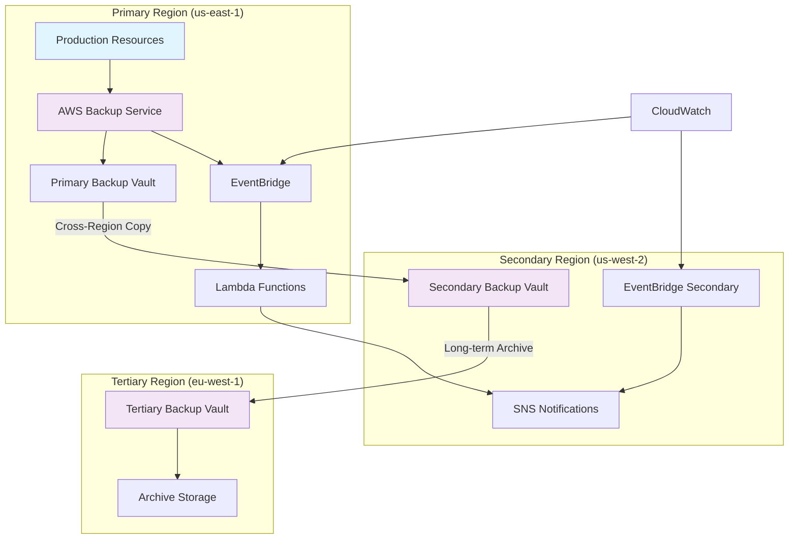

# Automating Multi-Region Backup Strategies using AWS Backup

## Problem

Your organization operates critical workloads across multiple AWS regions and needs a comprehensive backup strategy that ensures data can be recovered even if an entire region becomes unavailable. Current backup approaches are fragmented across different services, lack centralized management, and don't provide the cross-region redundancy required for business continuity. You need an automated solution that can orchestrate backups across multiple regions while maintaining compliance with recovery point objectives (RPO) and recovery time objectives (RTO).

## Solution

Implement a centralized, automated multi-region backup strategy using AWS Backup with cross-region copy destinations, EventBridge for workflow automation, and lifecycle policies for cost optimization. This solution creates a unified backup framework that automatically copies critical backups to secondary regions, implements intelligent lifecycle management, and provides comprehensive monitoring and alerting capabilities.

## Architecture Diagram



## Prerequisites

1. AWS account with appropriate permissions for AWS Backup, EventBridge, CloudWatch, and SNS
2. Multiple AWS regions configured (minimum of 2, recommended 3)
3. Existing AWS resources to be backed up (EC2 instances, RDS databases, DynamoDB tables, EFS file systems)
4. Understanding of RPO/RTO requirements for your organization
5. AWS CLI installed and configured
6. Estimated monthly cost: $50-200 depending on data volume and retention period

> **Note**: Cross-region data transfer charges apply for backup copies between regions. Review [AWS Backup pricing](https://aws.amazon.com/backup/pricing/) for detailed cost calculations.

## Preparation

```bash
# Set environment variables
export AWS_REGION=$(aws configure get region)
export AWS_ACCOUNT_ID=$(aws sts get-caller-identity \
    --query Account --output text)

# Set specific regions for backup strategy
export PRIMARY_REGION="us-east-1"
export SECONDARY_REGION="us-west-2" 
export TERTIARY_REGION="eu-west-1"

# Generate unique identifier for resources
RANDOM_SUFFIX=$(aws secretsmanager get-random-password \
    --exclude-punctuation --exclude-uppercase \
    --password-length 6 --require-each-included-type \
    --output text --query RandomPassword)

# Set resource names
export BACKUP_PLAN_NAME="MultiRegionBackupPlan"
export ORGANIZATION_NAME="YourOrg-${RANDOM_SUFFIX}"

echo "✅ Environment configured with unique suffix: ${RANDOM_SUFFIX}"
```

## Steps

1. **Create IAM Service Role for AWS Backup**:

   AWS Backup requires a service role with specific permissions to access and backup your AWS resources. This IAM role enables AWS Backup to perform backup operations across multiple services while maintaining the principle of least privilege. The role must include both backup and restore policies to support complete backup lifecycle management. For detailed IAM requirements, reference the [AWS Backup IAM service roles documentation](https://docs.aws.amazon.com/aws-backup/latest/devguide/iam-service-roles.html).

   ```bash
   # Create the AWS Backup service role
   aws iam create-role \
       --role-name AWSBackupServiceRole-${RANDOM_SUFFIX} \
       --assume-role-policy-document '{
           "Version": "2012-10-17",
           "Statement": [
               {
                   "Effect": "Allow",
                   "Principal": {
                       "Service": "backup.amazonaws.com"
                   },
                   "Action": "sts:AssumeRole"
               }
           ]
       }'

   # Wait for role to be ready
   aws iam wait role-exists \
       --role-name AWSBackupServiceRole-${RANDOM_SUFFIX}

   # Attach AWS managed policies for backup operations
   aws iam attach-role-policy \
       --role-name AWSBackupServiceRole-${RANDOM_SUFFIX} \
       --policy-arn arn:aws:iam::aws:policy/service-role/AWSBackupServiceRolePolicyForBackup

   aws iam attach-role-policy \
       --role-name AWSBackupServiceRole-${RANDOM_SUFFIX} \
       --policy-arn arn:aws:iam::aws:policy/service-role/AWSBackupServiceRolePolicyForRestores

   echo "✅ IAM service role created with backup and restore permissions"
   ```

   The service role is now configured with the necessary permissions to backup and restore AWS resources. This security foundation ensures AWS Backup can access your resources while maintaining proper access controls and audit trails for compliance requirements. The managed policies provide comprehensive coverage for supported AWS services without requiring custom policy development.

2. **Create Backup Vaults in All Regions**:

   Backup vaults provide secure, encrypted storage for backup recovery points across multiple regions. Creating dedicated vaults in each region establishes the infrastructure foundation for cross-region backup replication and ensures data locality compliance. Each vault uses AWS KMS encryption to protect backup data at rest, following security best practices outlined in the [AWS Backup Developer Guide](https://docs.aws.amazon.com/aws-backup/latest/devguide/whatisbackup.html).

   ```bash
   # Define vault names with organization prefix
   BACKUP_VAULT_PRIMARY="${ORGANIZATION_NAME}-primary-vault"
   BACKUP_VAULT_SECONDARY="${ORGANIZATION_NAME}-secondary-vault"
   BACKUP_VAULT_TERTIARY="${ORGANIZATION_NAME}-tertiary-vault"

   # Create primary vault in main operational region
   aws backup create-backup-vault \
       --backup-vault-name $BACKUP_VAULT_PRIMARY \
       --encryption-key-arn alias/aws/backup \
       --region $PRIMARY_REGION

   # Create secondary vault for disaster recovery
   aws backup create-backup-vault \
       --backup-vault-name $BACKUP_VAULT_SECONDARY \
       --encryption-key-arn alias/aws/backup \
       --region $SECONDARY_REGION

   # Create tertiary vault for long-term archival
   aws backup create-backup-vault \
       --backup-vault-name $BACKUP_VAULT_TERTIARY \
       --encryption-key-arn alias/aws/backup \
       --region $TERTIARY_REGION

   echo "✅ Backup vaults created in all three regions with encryption enabled"
   ```

   The multi-region vault infrastructure is now established, providing geographically distributed backup storage. This setup enables automatic cross-region replication and supports various disaster recovery scenarios while maintaining data encryption and security controls across all regions. The vault architecture supports the [AWS Well-Architected Framework](https://docs.aws.amazon.com/wellarchitected/latest/framework/welcome.html) reliability pillar principles.

3. **Create Comprehensive Backup Plan with Cross-Region Copy**:

   The backup plan defines automated backup schedules, retention policies, and cross-region copy destinations. This centralized configuration ensures consistent backup coverage across all critical resources while implementing lifecycle policies for cost optimization. The plan includes both daily operational backups and weekly long-term archival for comprehensive data protection. For detailed backup plan configuration options, see the [AWS Backup plan creation guide](https://docs.aws.amazon.com/aws-backup/latest/devguide/creating-a-backup-plan.html).

   ```bash
   # Create backup plan configuration with cross-region copies
   cat << EOF > multi-region-backup-plan.json
   {
     "BackupPlan": {
       "BackupPlanName": "$BACKUP_PLAN_NAME",
       "Rules": [
         {
           "RuleName": "DailyBackupsWithCrossRegionCopy",
           "TargetBackupVaultName": "$BACKUP_VAULT_PRIMARY",
           "ScheduleExpression": "cron(0 2 ? * * *)",
           "ScheduleExpressionTimezone": "UTC",
           "StartWindowMinutes": 480,
           "CompletionWindowMinutes": 10080,
           "Lifecycle": {
             "MoveToColdStorageAfterDays": 30,
             "DeleteAfterDays": 365
           },
           "CopyActions": [
             {
               "DestinationBackupVaultArn": "arn:aws:backup:$SECONDARY_REGION:$AWS_ACCOUNT_ID:backup-vault:$BACKUP_VAULT_SECONDARY",
               "Lifecycle": {
                 "MoveToColdStorageAfterDays": 30,
                 "DeleteAfterDays": 365
               }
             }
           ],
           "RecoveryPointTags": {
             "BackupType": "Daily",
             "Environment": "Production",
             "CrossRegion": "true"
           }
         },
         {
           "RuleName": "WeeklyLongTermArchival",
           "TargetBackupVaultName": "$BACKUP_VAULT_PRIMARY",
           "ScheduleExpression": "cron(0 3 ? * SUN *)",
           "ScheduleExpressionTimezone": "UTC",
           "StartWindowMinutes": 480,
           "CompletionWindowMinutes": 10080,
           "Lifecycle": {
             "MoveToColdStorageAfterDays": 90,
             "DeleteAfterDays": 2555
           },
           "CopyActions": [
             {
               "DestinationBackupVaultArn": "arn:aws:backup:$TERTIARY_REGION:$AWS_ACCOUNT_ID:backup-vault:$BACKUP_VAULT_TERTIARY",
               "Lifecycle": {
                 "MoveToColdStorageAfterDays": 90,
                 "DeleteAfterDays": 2555
               }
             }
           ],
           "RecoveryPointTags": {
             "BackupType": "Weekly",
             "Environment": "Production",
             "LongTerm": "true"
           }
         }
       ]
     }
   }
   EOF

   # Create the backup plan
   BACKUP_PLAN_ID=$(aws backup create-backup-plan \
       --cli-input-json file://multi-region-backup-plan.json \
       --region $PRIMARY_REGION \
       --query 'BackupPlanId' --output text)

   echo "✅ Multi-region backup plan created with ID: $BACKUP_PLAN_ID"
   ```

   The backup plan now orchestrates automated backups with intelligent lifecycle management and cross-region replication. This configuration ensures regular backup creation while optimizing storage costs through automatic transition to cold storage and eventual deletion based on retention requirements. The dual-rule approach provides both operational recovery capabilities and long-term archival compliance.

4. **Create Backup Selection for Resource Assignment**:

   Backup selections use tag-based resource discovery to automatically include critical resources in backup operations. This approach enables dynamic resource management where new resources with appropriate tags are automatically included in backup coverage without manual configuration updates, supporting DevOps workflows and infrastructure scaling. The tag-based selection follows AWS resource management best practices for governance and automation.

   ```bash
   # Create backup selection configuration using resource tags
   cat << EOF > backup-selection.json
   {
     "BackupSelection": {
       "SelectionName": "ProductionResourcesSelection",
       "IamRoleArn": "arn:aws:iam::$AWS_ACCOUNT_ID:role/AWSBackupServiceRole-${RANDOM_SUFFIX}",
       "Resources": ["*"],
       "Conditions": {
         "StringEquals": {
           "aws:ResourceTag/Environment": ["Production"],
           "aws:ResourceTag/BackupEnabled": ["true"]
         }
       }
     }
   }
   EOF

   # Create the backup selection
   aws backup create-backup-selection \
       --backup-plan-id $BACKUP_PLAN_ID \
       --cli-input-json file://backup-selection.json \
       --region $PRIMARY_REGION

   echo "✅ Backup selection created using tag-based resource discovery"
   ```

   The backup selection is now configured to automatically discover and backup resources based on standardized tagging. This tag-based approach ensures comprehensive coverage of production resources while providing flexibility for resource management and compliance reporting. New resources with proper tags will be automatically included in future backup operations.

5. **Configure EventBridge for Backup Monitoring**:

   EventBridge provides real-time monitoring and automation capabilities for backup operations by capturing backup job state changes and triggering appropriate responses. This event-driven architecture enables immediate notification of backup failures and supports automated remediation workflows for maintaining backup reliability. For detailed EventBridge integration patterns, reference the [AWS Backup events documentation](https://docs.aws.amazon.com/eventbridge/latest/ref/events-ref-backup.html).

   ```bash
   # Create EventBridge rule for backup job monitoring
   aws events put-rule \
       --name BackupJobFailureRule-${RANDOM_SUFFIX} \
       --event-pattern '{
           "source": ["aws.backup"],
           "detail-type": ["Backup Job State Change"],
           "detail": {
               "state": ["FAILED", "ABORTED"]
           }
       }' \
       --state ENABLED \
       --region $PRIMARY_REGION

   echo "✅ EventBridge rule created for backup failure monitoring"
   ```

   EventBridge monitoring is now active, providing real-time visibility into backup operations. This automation enables immediate response to backup failures, supporting proactive infrastructure management and maintaining backup service level agreements. The rule will trigger downstream actions whenever backup jobs fail or are aborted.

6. **Create SNS Topic for Backup Notifications**:

   SNS provides scalable notification capabilities for backup status updates and alerts. The notification system ensures stakeholders receive immediate notification of backup failures or important status changes, supporting rapid incident response and maintaining operational awareness of backup system health.

   ```bash
   # Create SNS topic for backup notifications
   BACKUP_NOTIFICATIONS_TOPIC=$(aws sns create-topic \
       --name backup-notifications-${RANDOM_SUFFIX} \
       --region $PRIMARY_REGION \
       --query 'TopicArn' --output text)

   # Subscribe email endpoint for notifications (replace with your email)
   aws sns subscribe \
       --topic-arn $BACKUP_NOTIFICATIONS_TOPIC \
       --protocol email \
       --notification-endpoint your-email@example.com \
       --region $PRIMARY_REGION

   echo "✅ SNS topic created: $BACKUP_NOTIFICATIONS_TOPIC"
   echo "⚠️ Confirm email subscription to receive notifications"
   ```

   The notification system is now configured to provide immediate alerts for backup system events. This communication framework ensures rapid response to backup issues while maintaining stakeholder awareness of backup operations and system health.

7. **Deploy Lambda Function for Backup Validation**:

   The Lambda function provides automated backup validation and health checking capabilities by analyzing backup job results and performing additional quality assurance checks. This serverless automation ensures backup integrity while providing detailed monitoring and reporting capabilities for compliance and operational requirements.

   ```bash
   # Create Lambda function for backup validation
   cat << 'EOF' > backup-validator.py
   import json
   import boto3
   import os
   import logging
   from datetime import datetime, timedelta

   logger = logging.getLogger()
   logger.setLevel(logging.INFO)

   def lambda_handler(event, context):
       backup_client = boto3.client('backup')
       sns_client = boto3.client('sns')
       
       # Extract backup job details from EventBridge event
       detail = event['detail']
       backup_job_id = detail['backupJobId']
       
       try:
           # Get backup job details
           response = backup_client.describe_backup_job(
               BackupJobId=backup_job_id
           )
           
           backup_job = response['BackupJob']
           
           # Validate backup job completion and health
           if backup_job['State'] in ['COMPLETED']:
               recovery_point_arn = backup_job['RecoveryPointArn']
               message = f"Backup validation successful for job {backup_job_id}"
               logger.info(message)
               
           elif backup_job['State'] in ['FAILED', 'ABORTED']:
               message = f"Backup job {backup_job_id} failed: {backup_job.get('StatusMessage', 'Unknown error')}"
               logger.error(message)
               
               # Send SNS notification for failed jobs
               sns_client.publish(
                   TopicArn=os.environ['SNS_TOPIC_ARN'],
                   Subject='AWS Backup Job Failed',
                   Message=message
               )
       
       except Exception as e:
           logger.error(f"Error validating backup job: {str(e)}")
           raise
       
       return {
           'statusCode': 200,
           'body': json.dumps('Backup validation completed')
       }
   EOF

   # Create deployment package
   zip backup-validator-${RANDOM_SUFFIX}.zip backup-validator.py

   # Create Lambda execution role
   LAMBDA_ROLE_ARN=$(aws iam create-role \
       --role-name BackupValidatorRole-${RANDOM_SUFFIX} \
       --assume-role-policy-document '{
           "Version": "2012-10-17",
           "Statement": [
               {
                   "Effect": "Allow",
                   "Principal": {
                       "Service": "lambda.amazonaws.com"
                   },
                   "Action": "sts:AssumeRole"
               }
           ]
       }' \
       --query 'Role.Arn' --output text)

   # Wait for role to be ready
   aws iam wait role-exists \
       --role-name BackupValidatorRole-${RANDOM_SUFFIX}

   # Attach basic execution role and custom backup permissions
   aws iam attach-role-policy \
       --role-name BackupValidatorRole-${RANDOM_SUFFIX} \
       --policy-arn arn:aws:iam::aws:policy/service-role/AWSLambdaBasicExecutionRole

   aws iam put-role-policy \
       --role-name BackupValidatorRole-${RANDOM_SUFFIX} \
       --policy-name BackupValidatorPolicy \
       --policy-document '{
           "Version": "2012-10-17",
           "Statement": [
               {
                   "Effect": "Allow",
                   "Action": [
                       "backup:DescribeBackupJob",
                       "backup:ListCopyJobs",
                       "backup:DescribeRecoveryPoint",
                       "sns:Publish"
                   ],
                   "Resource": "*"
               }
           ]
       }'

   # Wait for policy propagation
   sleep 10

   # Create Lambda function
   LAMBDA_FUNCTION_ARN=$(aws lambda create-function \
       --function-name backup-validator-${RANDOM_SUFFIX} \
       --runtime python3.9 \
       --role $LAMBDA_ROLE_ARN \
       --handler backup-validator.lambda_handler \
       --zip-file fileb://backup-validator-${RANDOM_SUFFIX}.zip \
       --environment Variables="{SNS_TOPIC_ARN=$BACKUP_NOTIFICATIONS_TOPIC}" \
       --timeout 300 \
       --region $PRIMARY_REGION \
       --query 'FunctionArn' --output text)

   echo "✅ Lambda function deployed for backup validation"
   ```

   The validation Lambda function is now deployed and ready to provide automated backup quality assurance. This serverless component enhances backup reliability by performing additional validation checks and providing intelligent alerting based on backup job outcomes.

8. **Configure EventBridge Integration with Lambda**:

   Connecting EventBridge rules to Lambda functions creates an automated response system for backup events. This integration enables real-time processing of backup status changes and supports sophisticated backup workflow automation while maintaining event-driven architecture principles for scalability and reliability.

   ```bash
   # Add EventBridge as Lambda trigger
   aws events put-targets \
       --rule BackupJobFailureRule-${RANDOM_SUFFIX} \
       --targets "Id"="1","Arn"="$LAMBDA_FUNCTION_ARN" \
       --region $PRIMARY_REGION

   # Grant EventBridge permission to invoke Lambda
   aws lambda add-permission \
       --function-name backup-validator-${RANDOM_SUFFIX} \
       --statement-id backup-eventbridge-trigger \
       --action lambda:InvokeFunction \
       --principal events.amazonaws.com \
       --source-arn arn:aws:events:${PRIMARY_REGION}:${AWS_ACCOUNT_ID}:rule/BackupJobFailureRule-${RANDOM_SUFFIX} \
       --region $PRIMARY_REGION

   echo "✅ EventBridge integration configured with Lambda function"
   ```

   The event-driven backup monitoring system is now fully operational, providing automated response to backup events. This integration ensures immediate processing of backup status changes and enables sophisticated backup workflow automation without manual intervention.

9. **Tag Resources for Backup Inclusion**:

   Resource tagging establishes the criteria for automatic backup inclusion and supports governance policies for backup coverage. Proper tagging ensures critical production resources are automatically discovered and included in backup operations while providing metadata for compliance reporting and cost allocation.

   ```bash
   # Example: Tag critical resources for backup inclusion
   # Replace resource IDs with your actual resource identifiers
   
   # Tag EC2 instances (replace with actual instance ID)
   aws ec2 create-tags \
       --resources i-1234567890abcdef0 \
       --tags Key=Environment,Value=Production Key=BackupEnabled,Value=true \
       --region $PRIMARY_REGION || echo "⚠️ EC2 instance not found - update with actual instance ID"

   # Tag RDS instances (replace with actual RDS identifier)
   aws rds add-tags-to-resource \
       --resource-name arn:aws:rds:${PRIMARY_REGION}:${AWS_ACCOUNT_ID}:db:mydb \
       --tags Key=Environment,Value=Production Key=BackupEnabled,Value=true || echo "⚠️ RDS instance not found - update with actual RDS identifier"

   echo "✅ Critical resources tagged for backup inclusion"
   ```

   Resource tagging is now configured to enable automatic backup discovery and inclusion. This standardized approach ensures consistent backup coverage across your infrastructure while supporting automated resource management and compliance reporting requirements.

> **Tip**: AWS Backup supports cross-region copy to up to 100 destination regions. Consider your compliance requirements and data sovereignty regulations when selecting destination regions. For detailed guidance, see the [AWS Backup Developer Guide](https://docs.aws.amazon.com/aws-backup/latest/devguide/whatisbackup.html).

## Validation & Testing

1. **Verify Backup Plan Creation and Configuration**:

   ```bash
   # Review backup plan details and rules
   aws backup get-backup-plan \
       --backup-plan-id $BACKUP_PLAN_ID \
       --region $PRIMARY_REGION
   ```

   Expected output: JSON configuration showing backup plan with two rules configured for daily and weekly backups with cross-region copy actions.

2. **Check Backup Vault Status Across Regions**:

   ```bash
   # Verify primary region vault
   aws backup describe-backup-vault \
       --backup-vault-name $BACKUP_VAULT_PRIMARY \
       --region $PRIMARY_REGION

   # Verify secondary region vault  
   aws backup describe-backup-vault \
       --backup-vault-name $BACKUP_VAULT_SECONDARY \
       --region $SECONDARY_REGION

   # Verify tertiary region vault
   aws backup describe-backup-vault \
       --backup-vault-name $BACKUP_VAULT_TERTIARY \
       --region $TERTIARY_REGION
   ```

3. **Test EventBridge Rule Configuration**:

   ```bash
   # Verify EventBridge rule exists
   aws events describe-rule \
       --name BackupJobFailureRule-${RANDOM_SUFFIX} \
       --region $PRIMARY_REGION

   # Check rule targets
   aws events list-targets-by-rule \
       --rule BackupJobFailureRule-${RANDOM_SUFFIX} \
       --region $PRIMARY_REGION
   ```

4. **Verify Lambda Function Deployment**:

   ```bash
   # Check Lambda function configuration
   aws lambda get-function \
       --function-name backup-validator-${RANDOM_SUFFIX} \
       --region $PRIMARY_REGION
   ```

> **Note**: Cross-region backup copies typically complete within 1-6 hours depending on backup size and network conditions. Monitor the copy jobs in the destination regions to confirm successful replication. For performance optimization guidance, reference the [AWS Backup best practices documentation](https://docs.aws.amazon.com/prescriptive-guidance/latest/backup-recovery/aws-backup.html).

## Cleanup

1. **Remove Backup Selections and Plans**:

   ```bash
   # Delete backup selections
   BACKUP_SELECTION_ID=$(aws backup list-backup-selections \
       --backup-plan-id $BACKUP_PLAN_ID \
       --region $PRIMARY_REGION \
       --query 'BackupSelectionsList[0].SelectionId' --output text)

   aws backup delete-backup-selection \
       --backup-plan-id $BACKUP_PLAN_ID \
       --selection-id $BACKUP_SELECTION_ID \
       --region $PRIMARY_REGION

   # Delete backup plan
   aws backup delete-backup-plan \
       --backup-plan-id $BACKUP_PLAN_ID \
       --region $PRIMARY_REGION

   echo "✅ Backup plan and selections removed"
   ```

2. **Remove EventBridge Rules and Lambda Function**:

   ```bash
   # Remove EventBridge targets and rule
   aws events remove-targets \
       --rule BackupJobFailureRule-${RANDOM_SUFFIX} \
       --ids "1" \
       --region $PRIMARY_REGION

   aws events delete-rule \
       --name BackupJobFailureRule-${RANDOM_SUFFIX} \
       --region $PRIMARY_REGION

   # Delete Lambda function
   aws lambda delete-function \
       --function-name backup-validator-${RANDOM_SUFFIX} \
       --region $PRIMARY_REGION

   echo "✅ EventBridge and Lambda components removed"
   ```

3. **Delete Backup Vaults**:

   ```bash
   # Delete backup vaults (only if empty)
   aws backup delete-backup-vault \
       --backup-vault-name $BACKUP_VAULT_PRIMARY \
       --region $PRIMARY_REGION

   aws backup delete-backup-vault \
       --backup-vault-name $BACKUP_VAULT_SECONDARY \
       --region $SECONDARY_REGION

   aws backup delete-backup-vault \
       --backup-vault-name $BACKUP_VAULT_TERTIARY \
       --region $TERTIARY_REGION

   echo "✅ Backup vaults removed"
   ```

4. **Clean Up IAM Roles and Policies**:

   ```bash
   # Remove IAM roles and policies
   aws iam detach-role-policy \
       --role-name AWSBackupServiceRole-${RANDOM_SUFFIX} \
       --policy-arn arn:aws:iam::aws:policy/service-role/AWSBackupServiceRolePolicyForBackup

   aws iam detach-role-policy \
       --role-name AWSBackupServiceRole-${RANDOM_SUFFIX} \
       --policy-arn arn:aws:iam::aws:policy/service-role/AWSBackupServiceRolePolicyForRestores

   aws iam delete-role \
       --role-name AWSBackupServiceRole-${RANDOM_SUFFIX}

   aws iam delete-role-policy \
       --role-name BackupValidatorRole-${RANDOM_SUFFIX} \
       --policy-name BackupValidatorPolicy

   aws iam detach-role-policy \
       --role-name BackupValidatorRole-${RANDOM_SUFFIX} \
       --policy-arn arn:aws:iam::aws:policy/service-role/AWSLambdaBasicExecutionRole

   aws iam delete-role \
       --role-name BackupValidatorRole-${RANDOM_SUFFIX}

   echo "✅ IAM resources cleaned up"
   ```

5. **Delete SNS Topic and Clean Up Files**:

   ```bash
   # Remove SNS topic and subscriptions
   aws sns delete-topic \
       --topic-arn $BACKUP_NOTIFICATIONS_TOPIC \
       --region $PRIMARY_REGION

   # Clean up local files
   rm -f multi-region-backup-plan.json
   rm -f backup-selection.json
   rm -f backup-validator.py
   rm -f backup-validator-${RANDOM_SUFFIX}.zip

   echo "✅ SNS notification topic and local files removed"
   ```

## Discussion

This multi-region backup strategy leverages AWS Backup's centralized management capabilities to create a robust, automated backup framework that addresses critical business continuity requirements. The solution demonstrates several key architectural patterns essential for enterprise-grade backup strategies, following the [AWS Well-Architected Framework](https://docs.aws.amazon.com/wellarchitected/latest/framework/welcome.html) principles of reliability, security, and cost optimization.

The cross-region copy functionality in AWS Backup provides automated geographic distribution of backups without requiring custom scripting or complex orchestration. By configuring copy actions within backup rules, you ensure that critical data is automatically replicated to secondary regions, meeting stringent RPO requirements even in the event of regional outages. The lifecycle policies optimize storage costs by automatically transitioning older backups to cold storage tiers, balancing compliance requirements with cost efficiency. For comprehensive backup planning guidance, reference the [AWS Backup Developer Guide](https://docs.aws.amazon.com/aws-backup/latest/devguide/creating-a-backup-plan.html).

EventBridge integration enables sophisticated backup workflow automation and monitoring by capturing backup job state changes and triggering validation workflows. This event-driven approach scales automatically and provides real-time visibility into backup operations across all regions. The integration with Lambda functions allows for custom validation logic, automated recovery testing, and intelligent alerting based on your specific operational requirements. For detailed EventBridge patterns with AWS Backup, see the [EventBridge reference documentation](https://docs.aws.amazon.com/eventbridge/latest/ref/events-ref-backup.html).

The tag-based resource selection strategy provides flexible, scalable resource management that adapts to changing infrastructure while supporting governance and compliance requirements. By using consistent tagging strategies across your AWS environment, you can automatically include new resources in backup plans without manual configuration updates. This approach supports DevOps practices and ensures that backup coverage scales with your infrastructure growth while maintaining governance controls. For IAM best practices with AWS Backup, consult the [IAM service roles documentation](https://docs.aws.amazon.com/aws-backup/latest/devguide/iam-service-roles.html).

> **Warning**: Ensure proper IAM permissions are configured before proceeding to avoid access denied errors. Cross-region data transfer charges apply for backup copies between regions, so consider implementing cost monitoring and optimization strategies based on your backup requirements.

## Challenge

Extend this multi-region backup solution by implementing these enhancements:

1. **Automated Disaster Recovery Testing**: Create a Lambda function that periodically performs restore operations in a test environment to validate backup integrity and recovery procedures.

2. **Intelligent Cost Optimization**: Implement backup analytics using CloudWatch metrics to automatically adjust retention periods based on resource criticality and access patterns.

3. **Compliance Reporting**: Build automated compliance reports that track backup coverage, retention compliance, and recovery testing results for audit requirements.

4. **Advanced Monitoring**: Integrate with AWS Config to monitor backup configuration drift and ensure backup policies remain compliant with organizational standards.

5. **Multi-Account Backup Strategy**: Extend the solution to support cross-account backup scenarios for organizations using AWS Organizations and centralized backup management.

## Infrastructure Code

*Infrastructure code will be generated after recipe approval.*