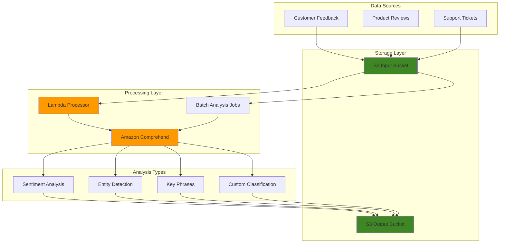

# Automating Text Analysis Pipelines with Amazon Comprehend

## Problem

Customer service teams at growing companies receive thousands of support tickets, product reviews, and feedback messages daily through multiple channels. Manual analysis of this unstructured text data is time-consuming and inconsistent, making it difficult to identify urgent issues, track sentiment trends, or extract actionable insights. Traditional rule-based text processing approaches fail to handle the complexity and nuance of natural language, resulting in missed opportunities for customer satisfaction improvements and business intelligence.

## Solution

Amazon Comprehend provides pre-trained natural language processing models that can automatically analyze text to extract entities, detect sentiment, identify key phrases, and classify content. This solution builds an end-to-end NLP pipeline that processes customer feedback in real-time and batch modes, automatically categorizes content, performs sentiment analysis, and stores structured insights for business intelligence dashboards.

## Architecture Diagram



## Prerequisites

1. AWS account with appropriate permissions for Comprehend, S3, Lambda, and IAM services
2. AWS CLI v2 installed and configured (or AWS CloudShell)
3. Basic understanding of natural language processing concepts and JSON data structures
4. Familiarity with AWS Lambda and S3 operations
5. Estimated cost: $5-15 for processing sample data (varies by text volume and custom model training)

> **Note**: Amazon Comprehend offers a free tier with 50K units (5M characters) per month for the first 12 months, which covers most experimentation needs.

## Preparation

```bash
# Set environment variables
export AWS_REGION=$(aws configure get region)
export AWS_ACCOUNT_ID=$(aws sts get-caller-identity \
    --query Account --output text)

# Generate unique identifiers for resources
RANDOM_SUFFIX=$(aws secretsmanager get-random-password \
    --exclude-punctuation --exclude-uppercase \
    --password-length 6 --require-each-included-type \
    --output text --query RandomPassword)

export COMPREHEND_BUCKET="comprehend-nlp-pipeline-${RANDOM_SUFFIX}"
export LAMBDA_FUNCTION_NAME="comprehend-processor-${RANDOM_SUFFIX}"
export IAM_ROLE_NAME="ComprehendLambdaRole-${RANDOM_SUFFIX}"

# Create S3 buckets for input and output
aws s3 mb s3://${COMPREHEND_BUCKET}
aws s3 mb s3://${COMPREHEND_BUCKET}-output

echo "✅ Created S3 buckets: ${COMPREHEND_BUCKET} and ${COMPREHEND_BUCKET}-output"

# Create sample text data for testing
cat > sample-reviews.txt << 'EOF'
The customer service at this restaurant was absolutely terrible. The food was cold and the staff was rude.
I love this product! The quality is amazing and the delivery was super fast. Highly recommend!
The hotel room was okay, nothing special. The location was convenient but the amenities were lacking.
Outstanding experience! The team went above and beyond to help us. Five stars!
Very disappointed with the purchase. The item broke after just one week of use.
EOF

# Upload sample data to S3
aws s3 cp sample-reviews.txt s3://${COMPREHEND_BUCKET}/input/
echo "✅ Uploaded sample data to S3"
```

## Steps

1. **Create IAM Role for Lambda and Comprehend Access**:

   IAM roles provide secure, temporary credential delegation without hardcoding secrets in application code. This security foundation follows the principle of least privilege, ensuring Lambda functions can access only the specific AWS services they need for NLP processing. The trust policy establishes which AWS services can assume this role.

   ```bash
   # Create trust policy for Lambda
   cat > lambda-trust-policy.json << 'EOF'
   {
     "Version": "2012-10-17",
     "Statement": [
       {
         "Effect": "Allow",
         "Principal": {
           "Service": "lambda.amazonaws.com"
         },
         "Action": "sts:AssumeRole"
       }
     ]
   }
   EOF
   
   # Create IAM role
   aws iam create-role \
       --role-name ${IAM_ROLE_NAME} \
       --assume-role-policy-document file://lambda-trust-policy.json
   
   # Attach basic Lambda execution policy
   aws iam attach-role-policy \
       --role-name ${IAM_ROLE_NAME} \
       --policy-arn arn:aws:iam::aws:policy/service-role/AWSLambdaBasicExecutionRole
   
   echo "✅ Created IAM role: ${IAM_ROLE_NAME}"
   ```

   The IAM role is now established with basic Lambda execution permissions. This security foundation enables your Lambda function to write logs to CloudWatch while maintaining secure access controls. The next step will extend these permissions to include Comprehend and S3 access.

2. **Create Custom IAM Policy for Comprehend and S3 Access**:

   Custom IAM policies enable fine-grained access control for your NLP pipeline. This policy grants specific Comprehend permissions for real-time analysis (DetectSentiment, DetectEntities) and batch processing (StartSentimentDetectionJob), while restricting S3 access to only the designated buckets. This approach minimizes security risks while enabling comprehensive text analysis capabilities.

   ```bash
   # Create custom policy for Comprehend and S3 access
   cat > comprehend-policy.json << EOF
   {
     "Version": "2012-10-17",
     "Statement": [
       {
         "Effect": "Allow",
         "Action": [
           "comprehend:DetectSentiment",
           "comprehend:DetectEntities",
           "comprehend:DetectKeyPhrases",
           "comprehend:DetectLanguage",
           "comprehend:DetectSyntax",
           "comprehend:DetectTargetedSentiment",
           "comprehend:StartDocumentClassificationJob",
           "comprehend:StartEntitiesDetectionJob",
           "comprehend:StartKeyPhrasesDetectionJob",
           "comprehend:StartSentimentDetectionJob",
           "comprehend:DescribeDocumentClassificationJob",
           "comprehend:DescribeEntitiesDetectionJob",
           "comprehend:DescribeKeyPhrasesDetectionJob",
           "comprehend:DescribeSentimentDetectionJob"
         ],
         "Resource": "*"
       },
       {
         "Effect": "Allow",
         "Action": [
           "s3:GetObject",
           "s3:PutObject",
           "s3:DeleteObject",
           "s3:ListBucket"
         ],
         "Resource": [
           "arn:aws:s3:::${COMPREHEND_BUCKET}",
           "arn:aws:s3:::${COMPREHEND_BUCKET}/*",
           "arn:aws:s3:::${COMPREHEND_BUCKET}-output",
           "arn:aws:s3:::${COMPREHEND_BUCKET}-output/*"
         ]
       }
     ]
   }
   EOF
   
   # Create and attach the custom policy
   aws iam create-policy \
       --policy-name ComprehendLambdaPolicy-${RANDOM_SUFFIX} \
       --policy-document file://comprehend-policy.json
   
   aws iam attach-role-policy \
       --role-name ${IAM_ROLE_NAME} \
       --policy-arn arn:aws:iam::${AWS_ACCOUNT_ID}:policy/ComprehendLambdaPolicy-${RANDOM_SUFFIX}
   
   echo "✅ Created and attached custom Comprehend policy"
   ```

   The custom policy is now attached to the Lambda execution role, enabling secure access to Comprehend's NLP capabilities and S3 storage. This granular permission model ensures your function can perform text analysis and data storage operations while maintaining security boundaries that prevent unauthorized access to other AWS resources.

3. **Create Lambda Function for Real-time Text Processing**:

   AWS Lambda provides serverless compute that automatically scales based on demand, making it ideal for real-time NLP processing. This function implements a comprehensive text analysis pipeline that leverages Comprehend's pre-trained models to extract sentiment, entities, and key phrases. The serverless architecture eliminates infrastructure management while providing sub-second response times for immediate feedback scenarios.

   ```bash
   # Create Lambda function code
   cat > lambda_function.py << 'EOF'
   import json
   import boto3
   import uuid
   from datetime import datetime
   
   comprehend = boto3.client('comprehend')
   s3 = boto3.client('s3')
   
   def lambda_handler(event, context):
       try:
           # Get text from S3 event or direct invocation
           if 'Records' in event:
               # S3 event trigger
               bucket = event['Records'][0]['s3']['bucket']['name']
               key = event['Records'][0]['s3']['object']['key']
               
               # Get text from S3
               response = s3.get_object(Bucket=bucket, Key=key)
               text = response['Body'].read().decode('utf-8')
           else:
               # Direct invocation
               text = event.get('text', '')
               bucket = event.get('output_bucket', '')
           
           if not text:
               return {'statusCode': 400, 'body': 'No text provided'}
           
           # Detect language first
           language_response = comprehend.detect_dominant_language(Text=text)
           language_code = language_response['Languages'][0]['LanguageCode']
           
           # Perform sentiment analysis
           sentiment_response = comprehend.detect_sentiment(
               Text=text,
               LanguageCode=language_code
           )
           
           # Extract entities
           entities_response = comprehend.detect_entities(
               Text=text,
               LanguageCode=language_code
           )
           
           # Extract key phrases
           keyphrases_response = comprehend.detect_key_phrases(
               Text=text,
               LanguageCode=language_code
           )
           
           # Compile results
           results = {
               'timestamp': datetime.now().isoformat(),
               'text': text,
               'language': language_code,
               'sentiment': {
                   'sentiment': sentiment_response['Sentiment'],
                   'scores': sentiment_response['SentimentScore']
               },
               'entities': entities_response['Entities'],
               'key_phrases': keyphrases_response['KeyPhrases']
           }
           
           # Save results to S3 if output bucket provided
           if bucket:
               output_key = f"processed/{uuid.uuid4()}.json"
               s3.put_object(
                   Bucket=bucket + '-output',
                   Key=output_key,
                   Body=json.dumps(results, indent=2),
                   ContentType='application/json'
               )
           
           return {
               'statusCode': 200,
               'body': json.dumps(results)
           }
           
       except Exception as e:
           print(f"Error processing text: {str(e)}")
           return {
               'statusCode': 500,
               'body': json.dumps({'error': str(e)})
           }
   EOF
   
   # Create deployment package
   zip -r lambda-function.zip lambda_function.py
   
   # Create Lambda function
   aws lambda create-function \
       --function-name ${LAMBDA_FUNCTION_NAME} \
       --runtime python3.9 \
       --role arn:aws:iam::${AWS_ACCOUNT_ID}:role/${IAM_ROLE_NAME} \
       --handler lambda_function.lambda_handler \
       --zip-file fileb://lambda-function.zip \
       --timeout 60 \
       --memory-size 256
   
   echo "✅ Created Lambda function: ${LAMBDA_FUNCTION_NAME}"
   ```

   The Lambda function is now deployed and ready to process text in real-time. This serverless NLP processor can handle both direct API calls and S3 event triggers, providing flexibility for different integration patterns. The function automatically detects language, analyzes sentiment with confidence scores, extracts named entities, and identifies key phrases - creating a comprehensive text analysis pipeline that scales automatically with demand.

4. **Test Real-time Text Processing**:

   Testing validates that your NLP pipeline correctly processes text and returns structured insights. This verification step ensures Comprehend's sentiment analysis, entity recognition, and key phrase extraction are working as expected. Real-time testing demonstrates the immediate value of the solution for customer feedback analysis and content moderation use cases.

   ```bash
   # Test with sample text
   aws lambda invoke \
       --function-name ${LAMBDA_FUNCTION_NAME} \
       --payload '{
         "text": "I absolutely love this new product! The quality is exceptional and the customer service team was incredibly helpful.",
         "output_bucket": "'${COMPREHEND_BUCKET}'"
       }' \
       --cli-binary-format raw-in-base64-out \
       response.json
   
   # Display results
   cat response.json | jq '.'
   
   echo "✅ Real-time processing test completed"
   ```

   The successful test confirms your Lambda function can analyze text and return structured JSON results with sentiment scores, detected entities, and key phrases. This real-time processing capability enables immediate insights for customer service teams and automated content routing based on sentiment analysis.

5. **Set Up Batch Processing for Large Document Sets**:

   Batch processing enables cost-effective analysis of large document collections, such as historical customer feedback or archived support tickets. Comprehend's batch jobs process thousands of documents in parallel while providing detailed analytics and lower per-document costs compared to real-time processing. This approach is ideal for business intelligence initiatives and quarterly sentiment trend analysis.

   ```bash
   # Create IAM role for Comprehend batch jobs
   cat > comprehend-service-role-policy.json << 'EOF'
   {
     "Version": "2012-10-17",
     "Statement": [
       {
         "Effect": "Allow",
         "Principal": {
           "Service": "comprehend.amazonaws.com"
         },
         "Action": "sts:AssumeRole"
       }
     ]
   }
   EOF
   
   # Create service role for Comprehend
   aws iam create-role \
       --role-name ComprehendServiceRole-${RANDOM_SUFFIX} \
       --assume-role-policy-document file://comprehend-service-role-policy.json
   
   # Create policy for Comprehend service access to S3
   cat > comprehend-s3-policy.json << EOF
   {
     "Version": "2012-10-17",
     "Statement": [
       {
         "Effect": "Allow",
         "Action": [
           "s3:GetObject",
           "s3:ListBucket"
         ],
         "Resource": [
           "arn:aws:s3:::${COMPREHEND_BUCKET}",
           "arn:aws:s3:::${COMPREHEND_BUCKET}/*"
         ]
       },
       {
         "Effect": "Allow",
         "Action": [
           "s3:PutObject"
         ],
         "Resource": [
           "arn:aws:s3:::${COMPREHEND_BUCKET}-output",
           "arn:aws:s3:::${COMPREHEND_BUCKET}-output/*"
         ]
       }
     ]
   }
   EOF
   
   # Create and attach S3 access policy
   aws iam create-policy \
       --policy-name ComprehendS3Policy-${RANDOM_SUFFIX} \
       --policy-document file://comprehend-s3-policy.json
   
   aws iam attach-role-policy \
       --role-name ComprehendServiceRole-${RANDOM_SUFFIX} \
       --policy-arn arn:aws:iam::${AWS_ACCOUNT_ID}:policy/ComprehendS3Policy-${RANDOM_SUFFIX}
   
   echo "✅ Created Comprehend service role for batch processing"
   ```

   The Comprehend service role establishes secure access for batch processing jobs to read input documents from S3 and write analysis results to the output bucket. This separation of concerns between real-time Lambda processing and batch job processing enables different security policies and access patterns for each use case.

6. **Create Batch Processing Scripts**:

   ```bash
   # Create batch processing script
   cat > batch-analysis.py << 'EOF'
   import boto3
   import json
   import time
   import sys
   
   def start_batch_analysis(input_bucket, output_bucket, job_name_prefix):
       comprehend = boto3.client('comprehend')
       
       # Start sentiment detection job
       sentiment_job = comprehend.start_sentiment_detection_job(
           InputDataConfig={
               'S3Uri': f's3://{input_bucket}/input/',
               'InputFormat': 'ONE_DOC_PER_LINE'
           },
           OutputDataConfig={
               'S3Uri': f's3://{output_bucket}/sentiment-output/'
           },
           DataAccessRoleArn=f'arn:aws:iam::{boto3.client("sts").get_caller_identity()["Account"]}:role/ComprehendServiceRole-{job_name_prefix.split("-")[-1]}',
           JobName=f'{job_name_prefix}-sentiment',
           LanguageCode='en'
       )
       
       # Start entities detection job
       entities_job = comprehend.start_entities_detection_job(
           InputDataConfig={
               'S3Uri': f's3://{input_bucket}/input/',
               'InputFormat': 'ONE_DOC_PER_LINE'
           },
           OutputDataConfig={
               'S3Uri': f's3://{output_bucket}/entities-output/'
           },
           DataAccessRoleArn=f'arn:aws:iam::{boto3.client("sts").get_caller_identity()["Account"]}:role/ComprehendServiceRole-{job_name_prefix.split("-")[-1]}',
           JobName=f'{job_name_prefix}-entities',
           LanguageCode='en'
       )
       
       # Start key phrases detection job
       keyphrases_job = comprehend.start_key_phrases_detection_job(
           InputDataConfig={
               'S3Uri': f's3://{input_bucket}/input/',
               'InputFormat': 'ONE_DOC_PER_LINE'
           },
           OutputDataConfig={
               'S3Uri': f's3://{output_bucket}/keyphrases-output/'
           },
           DataAccessRoleArn=f'arn:aws:iam::{boto3.client("sts").get_caller_identity()["Account"]}:role/ComprehendServiceRole-{job_name_prefix.split("-")[-1]}',
           JobName=f'{job_name_prefix}-keyphrases',
           LanguageCode='en'
       )
       
       return {
           'sentiment_job_id': sentiment_job['JobId'],
           'entities_job_id': entities_job['JobId'],
           'keyphrases_job_id': keyphrases_job['JobId']
       }
   
   def monitor_jobs(job_ids):
       comprehend = boto3.client('comprehend')
       
       while True:
           all_complete = True
           
           for job_type, job_id in job_ids.items():
               if job_type == 'sentiment_job_id':
                   status = comprehend.describe_sentiment_detection_job(JobId=job_id)
               elif job_type == 'entities_job_id':
                   status = comprehend.describe_entities_detection_job(JobId=job_id)
               elif job_type == 'keyphrases_job_id':
                   status = comprehend.describe_key_phrases_detection_job(JobId=job_id)
               
               job_status = status['JobProperties']['JobStatus']
               print(f"{job_type}: {job_status}")
               
               if job_status in ['RUNNING', 'SUBMITTED']:
                   all_complete = False
           
           if all_complete:
               print("All jobs completed!")
               break
           
           print("Waiting for jobs to complete...")
           time.sleep(30)
   
   if __name__ == "__main__":
       input_bucket = sys.argv[1]
       output_bucket = sys.argv[2]
       job_prefix = sys.argv[3]
       
       job_ids = start_batch_analysis(input_bucket, output_bucket, job_prefix)
       print(f"Started batch analysis jobs: {job_ids}")
       
       monitor_jobs(job_ids)
   EOF
   
   echo "✅ Created batch analysis script"
   ```

7. **Run Batch Analysis on Sample Data**:

   ```bash
   # Wait for IAM role propagation
   sleep 30
   
   # Prepare sample data in correct format (one document per line)
   cat > batch-input.txt << 'EOF'
   The customer service at this restaurant was absolutely terrible. The food was cold and the staff was rude.
   I love this product! The quality is amazing and the delivery was super fast. Highly recommend!
   The hotel room was okay, nothing special. The location was convenient but the amenities were lacking.
   Outstanding experience! The team went above and beyond to help us. Five stars!
   Very disappointed with the purchase. The item broke after just one week of use.
   EOF
   
   # Upload batch input data
   aws s3 cp batch-input.txt s3://${COMPREHEND_BUCKET}/input/
   
   # Run batch analysis
   python3 batch-analysis.py ${COMPREHEND_BUCKET} ${COMPREHEND_BUCKET}-output batch-job-${RANDOM_SUFFIX}
   
   echo "✅ Batch analysis jobs started and monitored"
   ```

8. **Create Custom Classification Model Training Data**:

   Custom classification models enable domain-specific categorization beyond Comprehend's pre-trained sentiment analysis. This training data teaches Comprehend to recognize business-specific patterns, such as distinguishing between product complaints, service compliments, and neutral feedback. Custom models provide higher accuracy for specialized use cases and enable automated ticket routing based on company-specific categories.

   ```bash
   # Create sample training data for custom classification
   mkdir -p training-data
   
   # Create training documents for different categories
   cat > training-data/complaints.txt << 'EOF'
   The service was terrible and I want my money back.
   This product broke after one day of use.
   The staff was rude and unhelpful.
   I am very disappointed with this purchase.
   The quality is much worse than expected.
   EOF
   
   cat > training-data/compliments.txt << 'EOF'
   Excellent service and great product quality!
   The staff was very helpful and professional.
   I highly recommend this product to everyone.
   Outstanding customer service experience.
   The quality exceeded my expectations.
   EOF
   
   cat > training-data/neutral.txt << 'EOF'
   The product is okay for the price.
   Average service, nothing special.
   The item works as described.
   Standard quality as expected.
   Regular customer service interaction.
   EOF
   
   # Create training manifest
   cat > training-manifest.csv << 'EOF'
   complaints,The service was terrible and I want my money back.
   complaints,This product broke after one day of use.
   complaints,The staff was rude and unhelpful.
   complaints,I am very disappointed with this purchase.
   complaints,The quality is much worse than expected.
   compliments,Excellent service and great product quality!
   compliments,The staff was very helpful and professional.
   compliments,I highly recommend this product to everyone.
   compliments,Outstanding customer service experience.
   compliments,The quality exceeded my expectations.
   neutral,The product is okay for the price.
   neutral,Average service, nothing special.
   neutral,The item works as described.
   neutral,Standard quality as expected.
   neutral,Regular customer service interaction.
   EOF
   
   # Upload training data
   aws s3 cp training-manifest.csv s3://${COMPREHEND_BUCKET}/training/
   
   echo "✅ Created and uploaded custom classification training data"
   ```

   The training data is now prepared in Comprehend's required CSV format with labeled examples for each category. This supervised learning approach enables the model to learn company-specific language patterns and classification rules. Quality training data with clear category distinctions leads to more accurate automated classification of incoming customer feedback.

9. **Train Custom Classification Model**:

   Custom model training leverages machine learning to create domain-specific classifiers tailored to your business vocabulary and categories. Comprehend's AutoML capabilities handle feature engineering, model selection, and hyperparameter tuning automatically, requiring only labeled training data. This democratizes advanced NLP without requiring deep machine learning expertise, enabling business teams to create specialized text classification solutions.

   ```bash
   # Start custom classification training job
   CLASSIFIER_NAME="feedback-classifier-${RANDOM_SUFFIX}"
   
   aws comprehend create-document-classifier \
       --document-classifier-name ${CLASSIFIER_NAME} \
       --language-code en \
       --input-data-config "S3Uri=s3://${COMPREHEND_BUCKET}/training/training-manifest.csv" \
       --output-data-config "S3Uri=s3://${COMPREHEND_BUCKET}-output/classifier-output/" \
       --data-access-role-arn arn:aws:iam::${AWS_ACCOUNT_ID}:role/ComprehendServiceRole-${RANDOM_SUFFIX}
   
   echo "✅ Started custom classification model training: ${CLASSIFIER_NAME}"
   echo "Note: Training will take 30-60 minutes to complete"
   ```

   The custom classification training job is now running, analyzing your labeled examples to build a specialized model. This training process creates a classifier that understands your business context and can automatically categorize new customer feedback with confidence scores. Once complete, the model can be integrated into your real-time Lambda function for automated content classification.

10. **Create Monitoring and Analysis Scripts**:

    ```bash
    # Create results analysis script
    cat > analyze-results.py << 'EOF'
    import boto3
    import json
    import pandas as pd
    from collections import defaultdict
    
    def analyze_sentiment_results(bucket_name, prefix):
        s3 = boto3.client('s3')
        
        # List all result files
        response = s3.list_objects_v2(
            Bucket=bucket_name,
            Prefix=prefix
        )
        
        sentiments = defaultdict(int)
        entities = defaultdict(int)
        key_phrases = defaultdict(int)
        
        for obj in response.get('Contents', []):
            if obj['Key'].endswith('.json'):
                # Read result file
                result = s3.get_object(Bucket=bucket_name, Key=obj['Key'])
                data = json.loads(result['Body'].read())
                
                # Process sentiment data
                if 'sentiment' in data:
                    sentiments[data['sentiment']['sentiment']] += 1
                
                # Process entities
                if 'entities' in data:
                    for entity in data['entities']:
                        entities[entity['Type']] += 1
                
                # Process key phrases
                if 'key_phrases' in data:
                    for phrase in data['key_phrases']:
                        key_phrases[phrase['Text']] += 1
        
        # Print summary
        print("Sentiment Analysis Results:")
        for sentiment, count in sentiments.items():
            print(f"  {sentiment}: {count}")
        
        print("\nTop Entity Types:")
        for entity_type, count in sorted(entities.items(), key=lambda x: x[1], reverse=True)[:10]:
            print(f"  {entity_type}: {count}")
        
        print("\nTop Key Phrases:")
        for phrase, count in sorted(key_phrases.items(), key=lambda x: x[1], reverse=True)[:10]:
            print(f"  {phrase}: {count}")
    
    if __name__ == "__main__":
        import sys
        bucket = sys.argv[1]
        prefix = sys.argv[2] if len(sys.argv) > 2 else 'processed/'
        analyze_sentiment_results(bucket, prefix)
    EOF
    
    echo "✅ Created results analysis script"
    ```

## Validation & Testing

1. **Verify Lambda Function Processing**:

   ```bash
   # Test Lambda function with different types of text
   aws lambda invoke \
       --function-name ${LAMBDA_FUNCTION_NAME} \
       --payload '{
         "text": "The product quality is terrible and customer service is unhelpful. I want a refund!",
         "output_bucket": "'${COMPREHEND_BUCKET}'"
       }' \
       --cli-binary-format raw-in-base64-out \
       negative-test.json
   
   # Check results
   cat negative-test.json | jq '.body | fromjson | .sentiment'
   ```

   Expected output: Sentiment should be "NEGATIVE" with high confidence score.

2. **Verify Batch Processing Results**:

   ```bash
   # Check if batch job output files exist
   aws s3 ls s3://${COMPREHEND_BUCKET}-output/sentiment-output/ --recursive
   aws s3 ls s3://${COMPREHEND_BUCKET}-output/entities-output/ --recursive
   aws s3 ls s3://${COMPREHEND_BUCKET}-output/keyphrases-output/ --recursive
   ```

   Expected output: Should show output files from batch processing jobs.

3. **Test Results Analysis**:

   ```bash
   # Analyze processed results
   python3 analyze-results.py ${COMPREHEND_BUCKET}-output processed/
   ```

   Expected output: Summary of sentiment distribution, entity types, and key phrases.

4. **Verify Custom Classification Model Status**:

   ```bash
   # Check classifier training status
   aws comprehend describe-document-classifier \
       --document-classifier-arn arn:aws:comprehend:${AWS_REGION}:${AWS_ACCOUNT_ID}:document-classifier/${CLASSIFIER_NAME}
   ```

   Expected output: Should show training status and metrics when completed.

## Cleanup

1. **Delete Lambda Function and IAM Roles**:

   ```bash
   # Delete Lambda function
   aws lambda delete-function \
       --function-name ${LAMBDA_FUNCTION_NAME}
   
   # Detach and delete IAM policies
   aws iam detach-role-policy \
       --role-name ${IAM_ROLE_NAME} \
       --policy-arn arn:aws:iam::aws:policy/service-role/AWSLambdaBasicExecutionRole
   
   aws iam detach-role-policy \
       --role-name ${IAM_ROLE_NAME} \
       --policy-arn arn:aws:iam::${AWS_ACCOUNT_ID}:policy/ComprehendLambdaPolicy-${RANDOM_SUFFIX}
   
   aws iam delete-policy \
       --policy-arn arn:aws:iam::${AWS_ACCOUNT_ID}:policy/ComprehendLambdaPolicy-${RANDOM_SUFFIX}
   
   aws iam delete-role \
       --role-name ${IAM_ROLE_NAME}
   
   echo "✅ Deleted Lambda function and IAM roles"
   ```

2. **Delete Comprehend Resources**:

   ```bash
   # Delete custom document classifier (if training completed)
   aws comprehend delete-document-classifier \
       --document-classifier-arn arn:aws:comprehend:${AWS_REGION}:${AWS_ACCOUNT_ID}:document-classifier/${CLASSIFIER_NAME} \
       2>/dev/null || echo "Classifier not found or already deleted"
   
   # Delete Comprehend service role
   aws iam detach-role-policy \
       --role-name ComprehendServiceRole-${RANDOM_SUFFIX} \
       --policy-arn arn:aws:iam::${AWS_ACCOUNT_ID}:policy/ComprehendS3Policy-${RANDOM_SUFFIX}
   
   aws iam delete-policy \
       --policy-arn arn:aws:iam::${AWS_ACCOUNT_ID}:policy/ComprehendS3Policy-${RANDOM_SUFFIX}
   
   aws iam delete-role \
       --role-name ComprehendServiceRole-${RANDOM_SUFFIX}
   
   echo "✅ Deleted Comprehend resources"
   ```

3. **Remove S3 Buckets and Local Files**:

   ```bash
   # Empty and delete S3 buckets
   aws s3 rm s3://${COMPREHEND_BUCKET} --recursive
   aws s3 rb s3://${COMPREHEND_BUCKET}
   
   aws s3 rm s3://${COMPREHEND_BUCKET}-output --recursive
   aws s3 rb s3://${COMPREHEND_BUCKET}-output
   
   # Clean up local files
   rm -f lambda-trust-policy.json comprehend-policy.json
   rm -f comprehend-service-role-policy.json comprehend-s3-policy.json
   rm -f lambda_function.py lambda-function.zip
   rm -f sample-reviews.txt batch-input.txt training-manifest.csv
   rm -f batch-analysis.py analyze-results.py
   rm -f response.json negative-test.json
   rm -rf training-data/
   
   echo "✅ Cleaned up S3 buckets and local files"
   ```

## Discussion

Amazon Comprehend provides a powerful and accessible entry point into natural language processing without requiring deep machine learning expertise. The service offers both pre-trained models for common NLP tasks and the ability to train custom models for domain-specific requirements. The architecture demonstrated in this recipe shows how to implement both real-time processing through Lambda functions and batch processing for large document sets.

The key advantage of using Amazon Comprehend is its seamless integration with other AWS services. Text data can be ingested from S3, processed through Lambda functions, and results can be stored back in S3 for further analysis or visualization. This serverless approach scales automatically based on demand and eliminates the need to manage underlying infrastructure. The service supports multiple languages and provides confidence scores for all predictions, enabling applications to handle edge cases appropriately.

For production deployments, consider implementing additional features like data validation, error handling, and result caching. The batch processing capabilities are particularly valuable for analyzing large volumes of historical data, while the real-time API is ideal for interactive applications and immediate feedback scenarios. Custom classification models can be trained to recognize company-specific categories, making the solution highly adaptable to different business contexts.

> **Tip**: Use Amazon Comprehend's targeted sentiment analysis for more granular insights when analyzing product reviews or customer feedback, as it provides entity-level sentiment rather than just document-level sentiment.

## Challenge

Extend this solution by implementing these enhancements:

1. **Build a real-time dashboard** using Amazon QuickSight to visualize sentiment trends and entity frequencies from the processed data stored in S3.

2. **Implement automated alerting** using CloudWatch and SNS to notify stakeholders when negative sentiment exceeds a threshold or when specific entities are mentioned frequently.

3. **Create a feedback loop system** that uses Amazon SageMaker to retrain custom models based on human feedback and improved performance metrics.

4. **Add multi-language support** by integrating Amazon Translate to pre-process non-English text before sending it to Comprehend for analysis.

5. **Develop a content moderation pipeline** using Comprehend's toxicity detection API to automatically flag inappropriate content in user-generated text.

## Infrastructure Code

*Infrastructure code will be generated after recipe approval.*