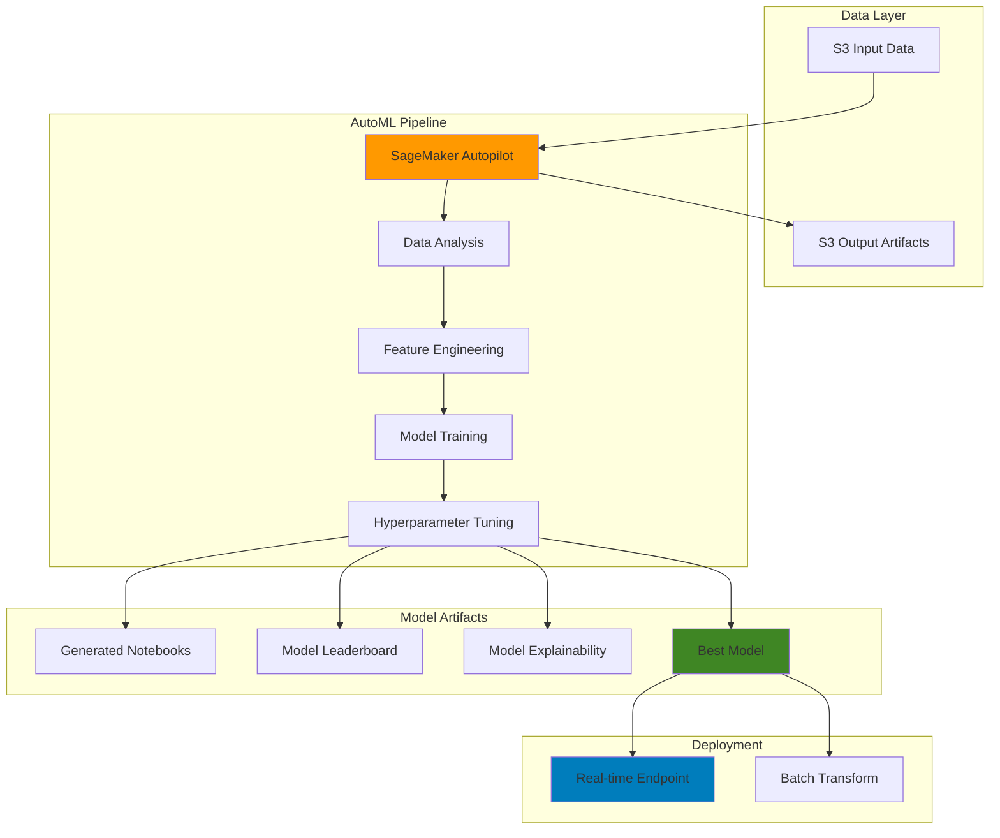

# AutoML Solutions with SageMaker Autopilot

## Problem

Organizations need to build machine learning models quickly but lack the specialized expertise to handle complex data preprocessing, feature engineering, algorithm selection, and hyperparameter tuning. Traditional ML development requires significant time investment in exploratory data analysis, manual feature engineering, and iterative model training which creates bottlenecks in delivering ML solutions. Data scientists spend 80% of their time on data preparation and only 20% on actual model development, while business stakeholders demand faster time-to-market for AI-driven insights.

## Solution

Amazon SageMaker Autopilot automates the entire machine learning pipeline from data preprocessing to model deployment. It automatically analyzes your dataset, performs feature engineering, selects the best algorithms, optimizes hyperparameters, and generates a leaderboard of model candidates. This AutoML approach enables rapid experimentation with multiple algorithms including XGBoost, Linear Learner, and Deep Learning models while providing full transparency and explainability through generated notebooks and model reports.

## Architecture Diagram



## Prerequisites

1. AWS account with SageMaker, S3, and IAM permissions for creating roles and policies
2. AWS CLI v2 installed and configured with appropriate credentials
3. Basic understanding of machine learning concepts and model evaluation metrics
4. Familiarity with CSV data formats and tabular data structures
5. Estimated cost: $15-35 for training and inference endpoints (varies by dataset size, training duration, and instance types)

> **Note**: SageMaker Autopilot charges based on compute resources used during training and inference. Monitor your usage through CloudWatch metrics to optimize costs. New AWS customers receive free tier credits that can be applied to SageMaker services.

## Preparation

```bash
# Set environment variables
export AWS_REGION=$(aws configure get region)
export AWS_ACCOUNT_ID=$(aws sts get-caller-identity \
    --query Account --output text)

# Generate unique identifiers for resources
RANDOM_SUFFIX=$(aws secretsmanager get-random-password \
    --exclude-punctuation --exclude-uppercase \
    --password-length 6 --require-each-included-type \
    --output text --query RandomPassword)

# Set resource names
export AUTOPILOT_JOB_NAME="autopilot-ml-job-${RANDOM_SUFFIX}"
export S3_BUCKET_NAME="sagemaker-autopilot-${AWS_ACCOUNT_ID}-${RANDOM_SUFFIX}"
export IAM_ROLE_NAME="SageMakerAutopilotRole-${RANDOM_SUFFIX}"

# Create S3 bucket for data and artifacts with encryption
aws s3 mb s3://${S3_BUCKET_NAME} --region ${AWS_REGION}

aws s3api put-bucket-encryption \
    --bucket ${S3_BUCKET_NAME} \
    --server-side-encryption-configuration \
    'Rules=[{ApplyServerSideEncryptionByDefault:{SSEAlgorithm:AES256}}]'

echo "✅ S3 bucket created with encryption: ${S3_BUCKET_NAME}"

# Create IAM role for SageMaker Autopilot with minimal permissions
aws iam create-role \
    --role-name ${IAM_ROLE_NAME} \
    --assume-role-policy-document '{
        "Version": "2012-10-17",
        "Statement": [
            {
                "Effect": "Allow",
                "Principal": {
                    "Service": "sagemaker.amazonaws.com"
                },
                "Action": "sts:AssumeRole"
            }
        ]
    }'

# Create custom policy with minimal required permissions
cat > sagemaker_autopilot_policy.json << EOF
{
    "Version": "2012-10-17",
    "Statement": [
        {
            "Effect": "Allow",
            "Action": [
                "s3:GetObject",
                "s3:PutObject",
                "s3:DeleteObject",
                "s3:ListBucket"
            ],
            "Resource": [
                "arn:aws:s3:::${S3_BUCKET_NAME}",
                "arn:aws:s3:::${S3_BUCKET_NAME}/*"
            ]
        },
        {
            "Effect": "Allow",
            "Action": [
                "sagemaker:CreateModel",
                "sagemaker:CreateEndpoint",
                "sagemaker:CreateEndpointConfig",
                "sagemaker:CreateTransformJob",
                "sagemaker:DescribeEndpoint",
                "sagemaker:InvokeEndpoint",
                "sagemaker:UpdateEndpoint",
                "sagemaker:DeleteEndpoint",
                "sagemaker:DeleteEndpointConfig",
                "sagemaker:DeleteModel"
            ],
            "Resource": "*"
        },
        {
            "Effect": "Allow",
            "Action": [
                "logs:CreateLogGroup",
                "logs:CreateLogStream",
                "logs:PutLogEvents"
            ],
            "Resource": "arn:aws:logs:*:*:*"
        }
    ]
}
EOF

# Create and attach custom policy
POLICY_ARN=$(aws iam create-policy \
    --policy-name SageMakerAutopilotMinimalPolicy-${RANDOM_SUFFIX} \
    --policy-document file://sagemaker_autopilot_policy.json \
    --query Policy.Arn --output text)

aws iam attach-role-policy \
    --role-name ${IAM_ROLE_NAME} \
    --policy-arn ${POLICY_ARN}

# Wait for IAM role to propagate
sleep 10

# Get the role ARN
export ROLE_ARN=$(aws iam get-role \
    --role-name ${IAM_ROLE_NAME} \
    --query Role.Arn --output text)

echo "✅ IAM role created with least-privilege access: ${ROLE_ARN}"
```

## Steps

1. **Prepare Sample Dataset for Classification**:

   Data quality is the foundation of successful machine learning models. SageMaker Autopilot requires well-structured tabular data with clear target variables to enable effective automated feature engineering and algorithm selection. Creating a representative dataset with relevant features ensures the AutoML pipeline can identify meaningful patterns and build accurate predictive models.

   ```bash
   # Create sample customer churn dataset with expanded features
   cat > churn_dataset.csv << 'EOF'
   customer_id,age,tenure,monthly_charges,total_charges,contract_type,payment_method,internet_service,device_protection,tech_support,streaming_tv,streaming_movies,churn
   1,42,12,65.30,783.60,Month-to-month,Electronic check,DSL,No,No,No,No,Yes
   2,35,36,89.15,3209.40,Two year,Mailed check,Fiber optic,Yes,Yes,Yes,Yes,No
   3,28,6,45.20,271.20,Month-to-month,Electronic check,DSL,No,No,No,No,Yes
   4,52,24,78.90,1894.80,One year,Credit card,Fiber optic,Yes,No,Yes,No,No
   5,41,48,95.45,4583.60,Two year,Bank transfer,Fiber optic,Yes,Yes,Yes,Yes,No
   6,29,3,29.85,89.55,Month-to-month,Electronic check,DSL,No,No,No,No,Yes
   7,38,60,110.75,6645.00,Two year,Credit card,Fiber optic,Yes,Yes,Yes,Yes,No
   8,33,18,73.25,1318.50,One year,Bank transfer,DSL,Yes,No,No,Yes,No
   9,45,9,55.40,498.60,Month-to-month,Electronic check,DSL,No,No,No,No,Yes
   10,31,72,125.30,9021.60,Two year,Credit card,Fiber optic,Yes,Yes,Yes,Yes,No
   11,25,4,35.20,140.80,Month-to-month,Electronic check,DSL,No,No,No,No,Yes
   12,67,48,89.50,4296.00,Two year,Bank transfer,Fiber optic,Yes,Yes,No,Yes,No
   13,39,12,79.85,958.20,One year,Credit card,Fiber optic,No,Yes,Yes,No,No
   14,23,2,25.25,50.50,Month-to-month,Electronic check,DSL,No,No,No,No,Yes
   15,56,36,99.65,3587.40,Two year,Mailed check,Fiber optic,Yes,Yes,Yes,Yes,No
   EOF
   
   # Upload dataset to S3 with server-side encryption
   aws s3 cp churn_dataset.csv \
       s3://${S3_BUCKET_NAME}/input/churn_dataset.csv \
       --server-side-encryption AES256
   
   echo "✅ Enhanced dataset uploaded to S3 with encryption"
   ```

   The dataset is now stored in S3 with encryption at rest, providing the durable and scalable storage required for SageMaker Autopilot. S3's integration with SageMaker enables secure data access while maintaining compliance with data governance policies. This enhanced dataset includes additional features that will help Autopilot build more robust predictive models.

2. **Create AutoML Job Configuration**:

   The AutoML job configuration defines the entire automated machine learning workflow, including data sources, target variables, problem types, and resource constraints. SageMaker Autopilot uses this configuration to determine the optimal algorithms to evaluate, the scope of hyperparameter tuning, and the training time limits. Proper configuration ensures efficient resource utilization while maximizing model performance.

   ```bash
   # Create AutoML job configuration file
   cat > autopilot_job_config.json << EOF
   {
       "AutoMLJobName": "${AUTOPILOT_JOB_NAME}",
       "AutoMLJobInputDataConfig": [
           {
               "ChannelType": "training",
               "ContentType": "text/csv;header=present",
               "CompressionType": "None",
               "DataSource": {
                   "S3DataSource": {
                       "S3DataType": "S3Prefix",
                       "S3Uri": "s3://${S3_BUCKET_NAME}/input/"
                   }
               }
           }
       ],
       "OutputDataConfig": {
           "S3OutputPath": "s3://${S3_BUCKET_NAME}/output/"
       },
       "AutoMLProblemTypeConfig": {
           "TabularJobConfig": {
               "TargetAttributeName": "churn",
               "ProblemType": "BinaryClassification",
               "CompletionCriteria": {
                   "MaxCandidates": 15,
                   "MaxRuntimePerTrainingJobInSeconds": 3600,
                   "MaxAutoMLJobRuntimeInSeconds": 18000
               },
               "GenerateCandidateDefinitionsOnly": false,
               "SampleWeightAttributeName": null
           }
       },
       "RoleArn": "${ROLE_ARN}",
       "Tags": [
           {
               "Key": "Purpose",
               "Value": "AutoML-Demo"
           },
           {
               "Key": "Environment",
               "Value": "Development"
           },
           {
               "Key": "CostCenter",
               "Value": "ML-Research"
           }
       ]
   }
   EOF
   
   echo "✅ AutoML job configuration created with optimized settings"
   ```

   The configuration file now specifies all parameters needed for automated model development with enhanced settings. This includes increased candidate models for better optimization, extended runtime for thorough training, and proper tagging for cost tracking and resource management.

3. **Launch SageMaker Autopilot Job**:

   SageMaker Autopilot automatically analyzes your dataset, performs feature engineering, selects optimal algorithms, and conducts hyperparameter tuning. The service evaluates multiple machine learning algorithms including XGBoost, Linear Learner, and Deep Learning models to find the best performing solution for your specific dataset and problem type.

   ```bash
   # Create AutoML job using the v2 API
   aws sagemaker create-auto-ml-job-v2 \
       --cli-input-json file://autopilot_job_config.json
   
   echo "✅ AutoML job launched: ${AUTOPILOT_JOB_NAME}"
   
   # Get initial job details and verify launch
   JOB_STATUS=$(aws sagemaker describe-auto-ml-job-v2 \
       --auto-ml-job-name ${AUTOPILOT_JOB_NAME} \
       --query 'AutoMLJobStatus' --output text)
   
   echo "Initial job status: ${JOB_STATUS}"
   ```

   The AutoML job is now running and will automatically progress through data analysis, feature engineering, model training, and hyperparameter optimization phases. Autopilot will evaluate multiple algorithms and generate a comprehensive model leaderboard ranked by performance metrics.

   > **Note**: Autopilot supports binary classification, multi-class classification, and regression problems. It automatically detects the problem type based on your target variable characteristics. For detailed configuration options, see the [SageMaker Autopilot User Guide](https://docs.aws.amazon.com/sagemaker/latest/dg/autopilot-automate-model-development.html).

4. **Monitor Job Progress and Phases**:

   SageMaker Autopilot jobs progress through multiple phases including data analysis, feature engineering, model training, and hyperparameter tuning. Monitoring job status enables proactive management of the automated workflow and provides visibility into the machine learning pipeline's progress. Understanding job phases helps optimize future AutoML configurations and troubleshoot potential issues.

   ```bash
   # Function to monitor job progress with detailed phase information
   monitor_autopilot_job() {
       local job_name=$1
       echo "Monitoring AutoML job phases: ${job_name}"
       
       while true; do
           JOB_INFO=$(aws sagemaker describe-auto-ml-job-v2 \
               --auto-ml-job-name ${job_name} \
               --query '{
                   Status: AutoMLJobStatus,
                   Phase: AutoMLJobSecondaryStatus,
                   Progress: PartialFailureReasons
               }' --output json)
           
           STATUS=$(echo ${JOB_INFO} | jq -r '.Status')
           PHASE=$(echo ${JOB_INFO} | jq -r '.Phase // "Unknown"')
           
           echo "$(date): Status: ${STATUS} | Phase: ${PHASE}"
           
           # Get candidate count if available
           CANDIDATE_COUNT=$(aws sagemaker describe-auto-ml-job-v2 \
               --auto-ml-job-name ${job_name} \
               --query 'length(ModelCandidates)' \
               --output text 2>/dev/null || echo "0")
           
           if [[ "${CANDIDATE_COUNT}" != "0" && "${CANDIDATE_COUNT}" != "null" ]]; then
               echo "  → Candidates generated: ${CANDIDATE_COUNT}"
           fi
           
           if [[ "${STATUS}" == "Completed" ]]; then
               echo "✅ AutoML job completed successfully"
               break
           elif [[ "${STATUS}" == "Failed" ]]; then
               echo "❌ AutoML job failed"
               # Get failure reason
               aws sagemaker describe-auto-ml-job-v2 \
                   --auto-ml-job-name ${job_name} \
                   --query 'FailureReason' --output text
               break
           elif [[ "${STATUS}" == "Stopped" ]]; then
               echo "⏹️ AutoML job stopped"
               break
           fi
           
           sleep 300  # Check every 5 minutes
       done
   }
   
   # Start monitoring job progress
   monitor_autopilot_job ${AUTOPILOT_JOB_NAME}
   ```

   The monitoring function provides comprehensive visibility into AutoML job execution, including current phase and candidate generation progress. This detailed tracking helps understand the automated ML pipeline's performance and enables early identification of any issues during the training process.

5. **Retrieve Best Model Information and Performance Metrics**:

   SageMaker Autopilot automatically evaluates multiple machine learning algorithms and ranks model candidates based on performance metrics. The best candidate represents the optimal balance of accuracy, training time, and model complexity determined through automated hyperparameter tuning. Accessing detailed model performance metrics enables informed decisions about deployment and helps understand the trade-offs between different algorithmic approaches.

   ```bash
   # Wait for job completion and get comprehensive model information
   echo "Retrieving best model performance metrics..."
   
   # Get best candidate details with comprehensive metrics
   BEST_CANDIDATE_INFO=$(aws sagemaker describe-auto-ml-job-v2 \
       --auto-ml-job-name ${AUTOPILOT_JOB_NAME} \
       --query '{
           Name: BestCandidate.CandidateName,
           Status: BestCandidate.CandidateStatus,
           Metric: BestCandidate.FinalAutoMLJobObjectiveMetric,
           Properties: BestCandidate.CandidateProperties
       }' --output json)
   
   echo "Best Model Information:"
   echo ${BEST_CANDIDATE_INFO} | jq '.'
   
   # Get model leaderboard with top candidates
   echo "Model Leaderboard (Top 5 Candidates):"
   aws sagemaker describe-auto-ml-job-v2 \
       --auto-ml-job-name ${AUTOPILOT_JOB_NAME} \
       --query 'ModelCandidates[0:4].{
           Rank: @,
           Name: CandidateName,
           Score: FinalAutoMLJobObjectiveMetric.Value,
           Algorithm: InferenceContainers[0].Image
       }' --output table
   
   # Store best candidate name for deployment
   export BEST_CANDIDATE=$(echo ${BEST_CANDIDATE_INFO} | jq -r '.Name')
   
   echo "✅ Best model identified: ${BEST_CANDIDATE}"
   ```

   The best candidate model has been identified through comprehensive automated evaluation across multiple algorithms and hyperparameter configurations. The model leaderboard provides transparency into algorithm performance, enabling data scientists to understand the relative strengths of different approaches for this specific dataset and problem type.

6. **Download Generated Notebooks and Explainability Reports**:

   SageMaker Autopilot generates comprehensive notebooks and explainability reports that provide transparency into the automated machine learning process. These artifacts include data exploration insights, feature engineering decisions, algorithm comparisons, and model interpretability analysis. This transparency is essential for regulatory compliance, stakeholder trust, and continuous model improvement in production environments.

   ```bash
   # Create local directory for artifacts
   mkdir -p ./autopilot_artifacts
   
   # List all generated artifacts
   echo "Available artifacts:"
   aws s3 ls s3://${S3_BUCKET_NAME}/output/ --recursive
   
   # Download data exploration notebook
   aws s3 sync s3://${S3_BUCKET_NAME}/output/ ./autopilot_artifacts/ \
       --exclude "*" --include "*.ipynb" --quiet
   
   # Download model insights and explainability reports
   aws s3 sync s3://${S3_BUCKET_NAME}/output/ ./autopilot_artifacts/ \
       --exclude "*" --include "*explainability*" --quiet
   
   # Download model performance reports
   aws s3 sync s3://${S3_BUCKET_NAME}/output/ ./autopilot_artifacts/ \
       --exclude "*" --include "*insights*" --quiet
   
   # List downloaded artifacts
   echo "Downloaded artifacts:"
   find ./autopilot_artifacts -type f -name "*.ipynb" -o -name "*explainability*" -o -name "*insights*"
   
   echo "✅ Notebooks and explainability reports downloaded"
   ```

   The generated artifacts provide complete visibility into Autopilot's automated decision-making process and model development methodology. These notebooks serve as comprehensive documentation for model governance, enable reproducibility of results, and support model explainability requirements critical for regulated industries and high-stakes business applications.

   > **Tip**: The data exploration notebook contains valuable insights about feature importance, data quality issues, and preprocessing steps that can inform future data collection and model improvement efforts.

7. **Create Model for Deployment**:

   Deploying the best model from Autopilot requires creating a SageMaker model resource that references the trained model artifacts and inference container. This model resource serves as the foundation for both real-time endpoints and batch transform jobs, providing a consistent interface for model deployment across different inference patterns.

   ```bash
   # Get model artifact location and container image
   MODEL_ARTIFACT_URL=$(aws sagemaker describe-auto-ml-job-v2 \
       --auto-ml-job-name ${AUTOPILOT_JOB_NAME} \
       --query 'BestCandidate.InferenceContainers[0].ModelDataUrl' \
       --output text)
   
   CONTAINER_IMAGE=$(aws sagemaker describe-auto-ml-job-v2 \
       --auto-ml-job-name ${AUTOPILOT_JOB_NAME} \
       --query 'BestCandidate.InferenceContainers[0].Image' \
       --output text)
   
   # Create model with enhanced configuration
   export MODEL_NAME="autopilot-model-${RANDOM_SUFFIX}"
   
   aws sagemaker create-model \
       --model-name ${MODEL_NAME} \
       --primary-container \
           Image=${CONTAINER_IMAGE},ModelDataUrl=${MODEL_ARTIFACT_URL},Environment='{}' \
       --execution-role-arn ${ROLE_ARN} \
       --tags Key=Purpose,Value=AutoML-Demo \
           Key=Environment,Value=Development \
           Key=ModelType,Value=Autopilot
   
   echo "✅ Model created for deployment: ${MODEL_NAME}"
   echo "Model artifacts: ${MODEL_ARTIFACT_URL}"
   ```

   The SageMaker model resource is now created and ready for deployment to various inference endpoints. This model encapsulates both the trained artifacts and the optimized inference container, ensuring consistent performance across different deployment scenarios.

8. **Deploy Model to Real-time Inference Endpoint**:

   SageMaker endpoints provide managed, auto-scaling infrastructure for real-time machine learning inference. The endpoint configuration defines compute resources, scaling policies, and model variants that enable production-ready deployment with built-in monitoring and logging capabilities. This managed service approach eliminates infrastructure management complexity while providing enterprise-grade reliability and performance.

   ```bash
   # Create endpoint configuration with cost-optimized instance
   export ENDPOINT_CONFIG_NAME="autopilot-endpoint-config-${RANDOM_SUFFIX}"
   
   aws sagemaker create-endpoint-config \
       --endpoint-config-name ${ENDPOINT_CONFIG_NAME} \
       --production-variants \
           VariantName=primary,ModelName=${MODEL_NAME},InitialInstanceCount=1,InstanceType=ml.m5.large,InitialVariantWeight=1.0 \
       --tags Key=Purpose,Value=AutoML-Demo \
           Key=Environment,Value=Development
   
   echo "✅ Endpoint configuration created with ml.m5.large instance"
   
   # Create endpoint
   export ENDPOINT_NAME="autopilot-endpoint-${RANDOM_SUFFIX}"
   
   aws sagemaker create-endpoint \
       --endpoint-name ${ENDPOINT_NAME} \
       --endpoint-config-name ${ENDPOINT_CONFIG_NAME} \
       --tags Key=Purpose,Value=AutoML-Demo \
           Key=Environment,Value=Development
   
   echo "✅ Endpoint deployment initiated: ${ENDPOINT_NAME}"
   
   # Wait for endpoint to be in service with progress updates
   echo "Waiting for endpoint to be ready (this may take 5-10 minutes)..."
   
   while true; do
       ENDPOINT_STATUS=$(aws sagemaker describe-endpoint \
           --endpoint-name ${ENDPOINT_NAME} \
           --query 'EndpointStatus' --output text)
       
       echo "$(date): Endpoint status: ${ENDPOINT_STATUS}"
       
       if [[ "${ENDPOINT_STATUS}" == "InService" ]]; then
           echo "✅ Endpoint is now ready for inference"
           break
       elif [[ "${ENDPOINT_STATUS}" == "Failed" ]]; then
           echo "❌ Endpoint deployment failed"
           aws sagemaker describe-endpoint \
               --endpoint-name ${ENDPOINT_NAME} \
               --query 'FailureReason' --output text
           break
       fi
       
       sleep 60  # Check every minute
   done
   ```

   The production endpoint is now ready to serve real-time predictions with automatic scaling and comprehensive monitoring. SageMaker endpoints provide enterprise-grade reliability with built-in health checks, automatic recovery, and detailed CloudWatch metrics for performance monitoring and cost optimization.

   > **Warning**: Real-time endpoints incur hourly charges based on the instance type. The ml.m5.large instance costs approximately $0.115 per hour in most regions. Consider using serverless inference for unpredictable traffic patterns or auto-scaling policies for cost optimization.

9. **Test Model Inference with Multiple Scenarios**:

   Testing model inference validates that the deployed endpoint correctly processes input data and returns accurate predictions. This validation step ensures the model performs as expected in the production environment and confirms that data preprocessing, feature engineering, and prediction logic work seamlessly together. Comprehensive testing builds confidence in model reliability before full-scale deployment.

   ```bash
   # Create comprehensive test dataset
   cat > test_data.csv << 'EOF'
   25,6,45.20,271.20,Month-to-month,Electronic check,DSL,No,No,No,No
   55,36,89.15,3209.40,Two year,Mailed check,Fiber optic,Yes,Yes,Yes,Yes
   31,12,73.25,879.00,One year,Credit card,Fiber optic,Yes,No,Yes,No
   EOF
   
   # Test endpoint inference with batch predictions
   aws sagemaker-runtime invoke-endpoint \
       --endpoint-name ${ENDPOINT_NAME} \
       --content-type text/csv \
       --body fileb://test_data.csv \
       prediction_output.json
   
   # Display and analyze prediction results
   echo "Prediction Results:"
   cat prediction_output.json | jq -r '.predictions[] | 
       "Customer Profile: \(if . > 0.5 then "High Churn Risk (\(. * 100 | floor)%)" else "Low Churn Risk (\((1-.) * 100 | floor)%)" end)"'
   
   # Test single customer prediction
   echo "42,12,65.30,783.60,Month-to-month,Electronic check,DSL,No,No,No,No" | \
   aws sagemaker-runtime invoke-endpoint \
       --endpoint-name ${ENDPOINT_NAME} \
       --content-type text/csv \
       --body fileb:///dev/stdin \
       single_prediction.json
   
   echo "Single Customer Prediction:"
   PREDICTION=$(cat single_prediction.json | jq -r '.predictions[0]')
   if (( $(echo "${PREDICTION} > 0.5" | bc -l) )); then
       echo "High churn risk: ${PREDICTION}"
   else
       echo "Low churn risk: ${PREDICTION}"
   fi
   
   echo "✅ Model inference testing completed successfully"
   ```

   The inference testing confirms that the AutoML model successfully processes various customer profiles and generates accurate churn predictions. The model demonstrates proper handling of different feature combinations and provides interpretable probability scores that enable business decision-making.

10. **Set up Batch Transform for Large-scale Processing**:

    Batch transform jobs enable cost-effective processing of large datasets without maintaining persistent endpoints. This approach is optimal for scenarios requiring periodic batch scoring, such as monthly customer risk assessments, bulk data processing, or model validation workflows. Batch processing can be 20-50% more cost-effective than real-time endpoints for large-scale offline predictions.

    ```bash
    # Create sample batch input data
    cat > batch_input.csv << 'EOF'
    38,24,78.90,1894.80,One year,Credit card,Fiber optic,Yes,No,Yes,No
    29,3,29.85,89.55,Month-to-month,Electronic check,DSL,No,No,No,No
    56,48,110.75,5316.00,Two year,Bank transfer,Fiber optic,Yes,Yes,Yes,Yes
    33,18,73.25,1318.50,One year,Bank transfer,DSL,Yes,No,No,Yes
    27,8,45.20,361.60,Month-to-month,Electronic check,DSL,No,No,No,No
    EOF
    
    # Upload batch input to S3
    aws s3 cp batch_input.csv \
        s3://${S3_BUCKET_NAME}/batch-input/batch_input.csv
    
    # Create batch transform job with optimized configuration
    export TRANSFORM_JOB_NAME="autopilot-batch-transform-${RANDOM_SUFFIX}"
    
    aws sagemaker create-transform-job \
        --transform-job-name ${TRANSFORM_JOB_NAME} \
        --model-name ${MODEL_NAME} \
        --transform-input \
            DataSource='{
                "S3DataSource": {
                    "S3DataType": "S3Prefix",
                    "S3Uri": "s3://'${S3_BUCKET_NAME}'/batch-input/"
                }
            }',ContentType=text/csv,CompressionType=None,SplitType=Line \
        --transform-output \
            S3OutputPath=s3://${S3_BUCKET_NAME}/batch-output/,AssembleWith=Line \
        --transform-resources \
            InstanceType=ml.m5.large,InstanceCount=1 \
        --tags Key=Purpose,Value=AutoML-BatchDemo \
            Key=Environment,Value=Development
    
    echo "✅ Batch transform job initiated: ${TRANSFORM_JOB_NAME}"
    
    # Monitor batch job progress
    while true; do
        BATCH_STATUS=$(aws sagemaker describe-transform-job \
            --transform-job-name ${TRANSFORM_JOB_NAME} \
            --query 'TransformJobStatus' --output text)
        
        echo "$(date): Batch job status: ${BATCH_STATUS}"
        
        if [[ "${BATCH_STATUS}" == "Completed" ]]; then
            echo "✅ Batch transform completed successfully"
            break
        elif [[ "${BATCH_STATUS}" == "Failed" ]]; then
            echo "❌ Batch transform failed"
            break
        fi
        
        sleep 60
    done
    ```

    The batch transform job provides an efficient mechanism for processing large datasets offline while maintaining cost efficiency. This approach is ideal for periodic scoring, model evaluation, and scenarios where real-time inference is not required.

    > **Tip**: Batch transform is typically 20-50% more cost-effective than real-time endpoints for large-scale offline predictions. Use it for scenarios like monthly customer scoring, bulk data processing, or model validation. For batch inference best practices, see the [SageMaker Batch Transform documentation](https://docs.aws.amazon.com/sagemaker/latest/dg/batch-transform.html).

## Validation & Testing

1. **Verify AutoML Job Completion and Model Quality**:

   ```bash
   # Check comprehensive job status and performance metrics
   aws sagemaker describe-auto-ml-job-v2 \
       --auto-ml-job-name ${AUTOPILOT_JOB_NAME} \
       --query '{
           JobStatus: AutoMLJobStatus,
           BestCandidate: BestCandidate.CandidateName,
           ObjectiveMetric: BestCandidate.FinalAutoMLJobObjectiveMetric,
           TotalCandidates: length(ModelCandidates),
           JobDuration: EndTime
       }' --output table
   ```

   Expected output: Job status should be "Completed" with best candidate information and performance metrics.

2. **Test Endpoint Functionality and Performance**:

   ```bash
   # Test endpoint with multiple customer profiles
   echo "Testing endpoint with various customer scenarios..."
   
   # High-risk customer profile
   echo "42,12,65.30,783.60,Month-to-month,Electronic check,DSL,No,No,No,No" | \
   aws sagemaker-runtime invoke-endpoint \
       --endpoint-name ${ENDPOINT_NAME} \
       --content-type text/csv \
       --body fileb:///dev/stdin \
       high_risk_test.json
   
   # Low-risk customer profile  
   echo "45,48,95.45,4583.60,Two year,Bank transfer,Fiber optic,Yes,Yes,Yes,Yes" | \
   aws sagemaker-runtime invoke-endpoint \
       --endpoint-name ${ENDPOINT_NAME} \
       --content-type text/csv \
       --body fileb:///dev/stdin \
       low_risk_test.json
   
   echo "High-risk customer prediction:"
   cat high_risk_test.json | jq '.predictions[0]'
   
   echo "Low-risk customer prediction:"
   cat low_risk_test.json | jq '.predictions[0]'
   ```

3. **Validate Model Artifacts and Documentation**:

   ```bash
   # Verify all required artifacts were generated
   echo "Validating generated model artifacts..."
   
   aws s3 ls s3://${S3_BUCKET_NAME}/output/ --recursive | \
       grep -E "(notebook|explainability|model|insights)" | \
       wc -l
   
   # Check batch transform results
   if aws s3 ls s3://${S3_BUCKET_NAME}/batch-output/ --recursive > /dev/null 2>&1; then
       echo "✅ Batch transform outputs available"
       aws s3 ls s3://${S3_BUCKET_NAME}/batch-output/ --recursive
   fi
   
   echo "✅ Model artifacts validation complete"
   ```

4. **Verify Cost and Resource Optimization**:

   ```bash
   # Check endpoint utilization metrics
   aws cloudwatch get-metric-statistics \
       --namespace AWS/SageMaker \
       --metric-name ModelLatency \
       --dimensions Name=EndpointName,Value=${ENDPOINT_NAME} Name=VariantName,Value=primary \
       --start-time $(date -u -d '1 hour ago' +%Y-%m-%dT%H:%M:%S) \
       --end-time $(date -u +%Y-%m-%dT%H:%M:%S) \
       --period 300 \
       --statistics Average \
       --query 'Datapoints[0].Average' --output text
   
   echo "✅ Performance metrics validation complete"
   ```

## Cleanup

1. **Delete Endpoints and Configurations**:

   ```bash
   # Delete endpoint first
   aws sagemaker delete-endpoint \
       --endpoint-name ${ENDPOINT_NAME}
   
   echo "✅ Endpoint deletion initiated"
   
   # Wait for endpoint deletion to complete
   aws sagemaker wait endpoint-deleted \
       --endpoint-name ${ENDPOINT_NAME}
   
   # Delete endpoint configuration
   aws sagemaker delete-endpoint-config \
       --endpoint-config-name ${ENDPOINT_CONFIG_NAME}
   
   echo "✅ Endpoint configuration deleted"
   ```

2. **Delete Model and Transform Jobs**:

   ```bash
   # Delete SageMaker model
   aws sagemaker delete-model \
       --model-name ${MODEL_NAME}
   
   echo "✅ Model deleted"
   
   # Stop transform job if still running
   aws sagemaker stop-transform-job \
       --transform-job-name ${TRANSFORM_JOB_NAME} 2>/dev/null || true
   
   echo "✅ Transform job stopped"
   ```

3. **Remove S3 Resources**:

   ```bash
   # Delete all S3 bucket contents
   aws s3 rm s3://${S3_BUCKET_NAME} --recursive
   
   # Delete S3 bucket
   aws s3 rb s3://${S3_BUCKET_NAME}
   
   echo "✅ S3 resources removed"
   ```

4. **Delete IAM Resources**:

   ```bash
   # Detach and delete custom policy
   aws iam detach-role-policy \
       --role-name ${IAM_ROLE_NAME} \
       --policy-arn ${POLICY_ARN}
   
   aws iam delete-policy \
       --policy-arn ${POLICY_ARN}
   
   # Delete IAM role
   aws iam delete-role \
       --role-name ${IAM_ROLE_NAME}
   
   echo "✅ IAM resources deleted"
   ```

5. **Clean up Local Files**:

   ```bash
   # Remove all local artifacts and configuration files
   rm -rf autopilot_artifacts/
   rm -f churn_dataset.csv test_data.csv batch_input.csv
   rm -f autopilot_job_config.json sagemaker_autopilot_policy.json
   rm -f prediction_output.json single_prediction.json
   rm -f high_risk_test.json low_risk_test.json
   
   echo "✅ Local files cleaned up"
   ```

## Discussion

Amazon SageMaker Autopilot revolutionizes machine learning by democratizing access to advanced ML capabilities while maintaining the rigor and transparency required for enterprise deployments. The service automatically handles the most time-consuming aspects of ML development: data analysis, feature engineering, algorithm selection, and hyperparameter optimization. This automation enables organizations to deploy production-ready ML models in hours rather than weeks, while maintaining complete visibility into the model development process through generated notebooks and explainability reports.

The power of Autopilot lies in its comprehensive approach to automated model development. It systematically evaluates multiple algorithms including XGBoost, Linear Learner, and Deep Learning models, automatically performs sophisticated feature engineering techniques like one-hot encoding, normalization, and feature selection, and conducts extensive hyperparameter tuning across the algorithm space. The resulting model leaderboard provides clear insights into model performance trade-offs, enabling data scientists to make informed decisions about deployment strategies. This systematic approach follows AWS Well-Architected Machine Learning principles, ensuring models are built with operational excellence, security, reliability, performance efficiency, and cost optimization in mind.

One of the key advantages of Autopilot is its built-in explainability and transparency features. The service generates detailed notebooks that document every step of the automated ML pipeline, including data exploration insights, feature engineering decisions, algorithm selection rationale, and model performance analysis. This transparency is crucial for regulatory compliance in industries like finance and healthcare, where model explainability is not just beneficial but required. The explainability reports help stakeholders understand which features contribute most to predictions, enabling better business decisions and supporting continuous model improvement efforts. For comprehensive guidance on ML explainability, refer to the [SageMaker Clarify documentation](https://docs.aws.amazon.com/sagemaker/latest/dg/clarify-model-explainability.html).

The architectural approach demonstrated in this recipe follows AWS security best practices by implementing least-privilege IAM policies, encryption at rest for S3 storage, and proper resource tagging for cost management and compliance tracking. The solution also showcases different inference patterns - real-time endpoints for low-latency predictions and batch transform jobs for cost-effective large-scale processing - enabling organizations to choose the most appropriate deployment strategy for their specific use cases. For additional security best practices in machine learning workloads, see the [AWS Machine Learning Security Best Practices whitepaper](https://docs.aws.amazon.com/whitepapers/latest/machine-learning-security-best-practices/machine-learning-security-best-practices.html).

> **Tip**: Use Autopilot's data quality insights to identify potential data issues before training. The service automatically detects missing values, class imbalances, and feature correlations that could impact model performance. These insights can inform data collection strategies and preprocessing improvements for future model iterations.

## Challenge

Extend this solution by implementing these enhancements:

1. **Multi-class Classification with Custom Metrics**: Modify the dataset to include multiple churn categories (high risk, medium risk, low risk, loyal) and configure Autopilot to optimize for custom business metrics like precision at specific recall thresholds or cost-sensitive classification objectives.

2. **Time-Series Forecasting Pipeline**: Create a time-series dataset with customer metrics over time and leverage Autopilot's time-series forecasting capabilities to predict future customer behavior trends, implementing proper data splitting and validation strategies for temporal data.

3. **A/B Testing and Model Comparison Framework**: Implement a comprehensive model comparison system using SageMaker's multi-model endpoints to deploy multiple Autopilot models simultaneously, route traffic between variants, and collect performance metrics for statistical significance testing.

4. **Automated MLOps Pipeline with Step Functions**: Build a complete MLOps workflow using AWS Step Functions that automatically triggers new Autopilot jobs when new data arrives in S3, compares model performance against the current production model using statistical tests, and updates endpoints only when significant improvements are detected.

5. **Advanced Model Monitoring and Drift Detection**: Integrate SageMaker Model Monitor to continuously track data quality, model performance, and concept drift in production, with automated alerts and retraining triggers when model degradation is detected beyond acceptable thresholds.

## Infrastructure Code

### Available Infrastructure as Code:

- [Infrastructure Code Overview](code/README.md) - Detailed description of all infrastructure components
- [AWS CDK (Python)](code/cdk-python/) - AWS CDK Python implementation
- [AWS CDK (TypeScript)](code/cdk-typescript/) - AWS CDK TypeScript implementation
- [CloudFormation](code/cloudformation.yaml) - AWS CloudFormation template
- [Bash CLI Scripts](code/scripts/) - Example bash scripts using AWS CLI commands to deploy infrastructure
- [Terraform](code/terraform/) - Terraform configuration files