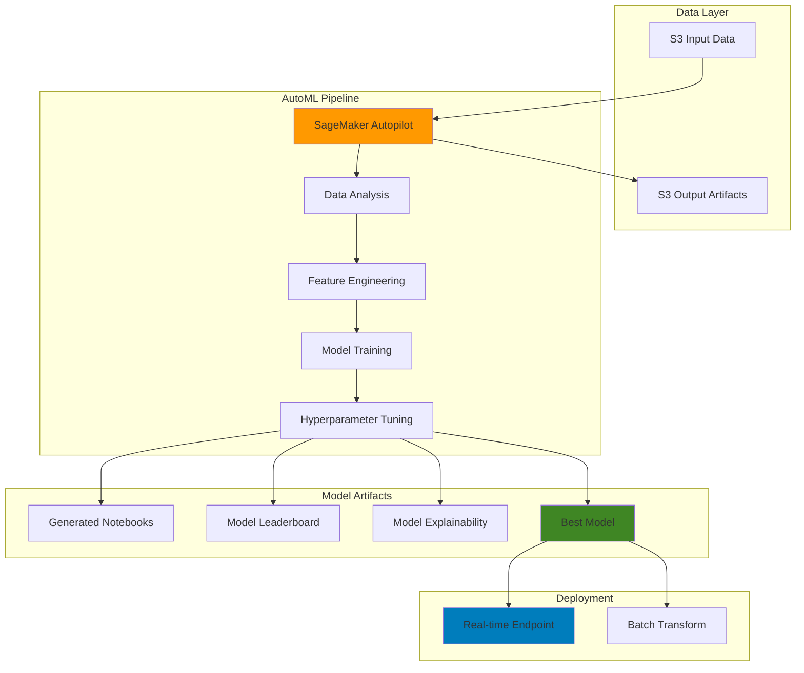

# AutoML Solutions with SageMaker Autopilot

## Problem

Organizations need to build machine learning models quickly but lack the specialized expertise to handle complex data preprocessing, feature engineering, algorithm selection, and hyperparameter tuning. Traditional ML development requires significant time investment in exploratory data analysis, manual feature engineering, and iterative model training which creates bottlenecks in delivering ML solutions. Data scientists spend 80% of their time on data preparation and only 20% on actual model development, while business stakeholders demand faster time-to-market for AI-driven insights.

## Solution

Amazon SageMaker Autopilot automates the entire machine learning pipeline from data preprocessing to model deployment. It automatically analyzes your dataset, performs feature engineering, selects the best algorithms, optimizes hyperparameters, and generates a leaderboard of model candidates. This AutoML approach enables rapid experimentation with multiple algorithms including XGBoost, Linear Learner, and Deep Learning models while providing full transparency and explainability through generated notebooks and model reports.

## Architecture Diagram



## Prerequisites

1. AWS account with SageMaker, S3, and IAM permissions
2. AWS CLI v2 installed and configured
3. Basic understanding of machine learning concepts
4. Familiarity with CSV data formats and tabular data
5. Estimated cost: $10-25 for training and inference endpoints (varies by dataset size and training duration)

## Preparation

```bash
# Set environment variables
export AWS_REGION=$(aws configure get region)
export AWS_ACCOUNT_ID=$(aws sts get-caller-identity \
    --query Account --output text)

# Generate unique identifiers for resources
RANDOM_SUFFIX=$(aws secretsmanager get-random-password \
    --exclude-punctuation --exclude-uppercase \
    --password-length 6 --require-each-included-type \
    --output text --query RandomPassword)

# Set resource names
export AUTOPILOT_JOB_NAME="autopilot-ml-job-${RANDOM_SUFFIX}"
export S3_BUCKET_NAME="sagemaker-autopilot-${AWS_ACCOUNT_ID}-${RANDOM_SUFFIX}"
export IAM_ROLE_NAME="SageMakerAutopilotRole-${RANDOM_SUFFIX}"

# Create S3 bucket for data and artifacts
aws s3 mb s3://${S3_BUCKET_NAME} --region ${AWS_REGION}

echo "✅ S3 bucket created: ${S3_BUCKET_NAME}"

# Create IAM role for SageMaker Autopilot
aws iam create-role \
    --role-name ${IAM_ROLE_NAME} \
    --assume-role-policy-document '{
        "Version": "2012-10-17",
        "Statement": [
            {
                "Effect": "Allow",
                "Principal": {
                    "Service": "sagemaker.amazonaws.com"
                },
                "Action": "sts:AssumeRole"
            }
        ]
    }'

# Attach required policies to the role
aws iam attach-role-policy \
    --role-name ${IAM_ROLE_NAME} \
    --policy-arn arn:aws:iam::aws:policy/AmazonSageMakerFullAccess

aws iam attach-role-policy \
    --role-name ${IAM_ROLE_NAME} \
    --policy-arn arn:aws:iam::aws:policy/AmazonS3FullAccess

# Get the role ARN
export ROLE_ARN=$(aws iam get-role \
    --role-name ${IAM_ROLE_NAME} \
    --query Role.Arn --output text)

echo "✅ IAM role created: ${ROLE_ARN}"
```

## Steps

1. **Prepare Sample Dataset for Classification**:

   Data quality is the foundation of successful machine learning models. SageMaker Autopilot requires well-structured tabular data with clear target variables to enable effective automated feature engineering and algorithm selection. Creating a representative dataset with relevant features ensures the AutoML pipeline can identify meaningful patterns and build accurate predictive models.

   ```bash
   # Create sample customer churn dataset
   cat > churn_dataset.csv << 'EOF'
   customer_id,age,tenure,monthly_charges,total_charges,contract_type,payment_method,churn
   1,42,12,65.30,783.60,Month-to-month,Electronic check,Yes
   2,35,36,89.15,3209.40,Two year,Mailed check,No
   3,28,6,45.20,271.20,Month-to-month,Electronic check,Yes
   4,52,24,78.90,1894.80,One year,Credit card,No
   5,41,48,95.45,4583.60,Two year,Bank transfer,No
   6,29,3,29.85,89.55,Month-to-month,Electronic check,Yes
   7,38,60,110.75,6645.00,Two year,Credit card,No
   8,33,18,73.25,1318.50,One year,Bank transfer,No
   9,45,9,55.40,498.60,Month-to-month,Electronic check,Yes
   10,31,72,125.30,9021.60,Two year,Credit card,No
   EOF
   
   # Upload dataset to S3
   aws s3 cp churn_dataset.csv \
       s3://${S3_BUCKET_NAME}/input/churn_dataset.csv
   
   echo "✅ Sample dataset uploaded to S3"
   ```

   The dataset is now stored in S3, providing the durable and scalable storage required for SageMaker Autopilot. S3's integration with SageMaker enables secure data access while maintaining compliance with data governance policies. This establishes the foundation for the automated ML pipeline to analyze data patterns and engineering features.

2. **Create AutoML Job Configuration**:

   The AutoML job configuration defines the entire automated machine learning workflow, including data sources, target variables, problem types, and resource constraints. SageMaker Autopilot uses this configuration to determine the optimal algorithms to evaluate, the scope of hyperparameter tuning, and the training time limits. Proper configuration ensures efficient resource utilization while maximizing model performance.

   ```bash
   # Create AutoML job configuration file
   cat > autopilot_job_config.json << EOF
   {
       "AutoMLJobName": "${AUTOPILOT_JOB_NAME}",
       "AutoMLJobInputDataConfig": [
           {
               "ChannelType": "training",
               "ContentType": "text/csv;header=present",
               "CompressionType": "None",
               "DataSource": {
                   "S3DataSource": {
                       "S3DataType": "S3Prefix",
                       "S3Uri": "s3://${S3_BUCKET_NAME}/input/"
                   }
               }
           }
       ],
       "OutputDataConfig": {
           "S3OutputPath": "s3://${S3_BUCKET_NAME}/output/"
       },
       "AutoMLProblemTypeConfig": {
           "TabularJobConfig": {
               "TargetAttributeName": "churn",
               "ProblemType": "BinaryClassification",
               "CompletionCriteria": {
                   "MaxCandidates": 10,
                   "MaxRuntimePerTrainingJobInSeconds": 3600,
                   "MaxAutoMLJobRuntimeInSeconds": 14400
               }
           }
       },
       "RoleArn": "${ROLE_ARN}",
       "Tags": [
           {
               "Key": "Purpose",
               "Value": "AutoML-Demo"
           },
           {
               "Key": "Environment",
               "Value": "Development"
           }
       ]
   }
   EOF
   
   echo "✅ AutoML job configuration created"
   ```

   The configuration file now specifies all parameters needed for automated model development. This includes setting completion criteria to balance training time with model quality, defining the binary classification problem type, and establishing resource limits to control costs while ensuring sufficient training time for optimal results.

3. **Launch SageMaker Autopilot Job**:

   SageMaker Autopilot automatically analyzes your dataset, performs feature engineering, selects optimal algorithms, and conducts hyperparameter tuning. The job configuration specifies the target variable, problem type, and resource constraints for the automated ML pipeline.

   ```bash
   # Create AutoML job using the v2 API
   aws sagemaker create-auto-ml-job-v2 \
       --cli-input-json file://autopilot_job_config.json
   
   echo "✅ AutoML job launched: ${AUTOPILOT_JOB_NAME}"
   
   # Get job details
   aws sagemaker describe-auto-ml-job-v2 \
       --auto-ml-job-name ${AUTOPILOT_JOB_NAME} \
       --query 'AutoMLJobStatus'
   ```

   > **Note**: Autopilot supports binary classification, multi-class classification, and regression problems. It automatically detects the problem type based on your target variable and dataset characteristics. For more details on job configuration options, see the [SageMaker Autopilot User Guide](https://docs.aws.amazon.com/sagemaker/latest/dg/autopilot-automate-model-development.html).

4. **Monitor Job Progress**:

   SageMaker Autopilot jobs progress through multiple phases including data analysis, feature engineering, model training, and hyperparameter tuning. Monitoring job status enables proactive management of the automated workflow and provides visibility into the machine learning pipeline's progress. Understanding job phases helps optimize future AutoML configurations and troubleshoot potential issues.

   ```bash
   # Function to check job status
   monitor_autopilot_job() {
       local job_name=$1
       echo "Monitoring AutoML job: ${job_name}"
       
       while true; do
           STATUS=$(aws sagemaker describe-auto-ml-job-v2 \
               --auto-ml-job-name ${job_name} \
               --query 'AutoMLJobStatus' \
               --output text)
           
           echo "$(date): Job Status: ${STATUS}"
           
           if [[ "${STATUS}" == "Completed" ]]; then
               echo "✅ AutoML job completed successfully"
               break
           elif [[ "${STATUS}" == "Failed" ]]; then
               echo "❌ AutoML job failed"
               break
           elif [[ "${STATUS}" == "Stopped" ]]; then
               echo "⏹️ AutoML job stopped"
               break
           fi
           
           sleep 300  # Check every 5 minutes
       done
   }
   
   # Start monitoring (runs in background)
   monitor_autopilot_job ${AUTOPILOT_JOB_NAME} &
   MONITOR_PID=$!
   
   echo "✅ Job monitoring started (PID: ${MONITOR_PID})"
   ```

   The monitoring function provides real-time feedback on AutoML job progress, enabling you to track the automated pipeline's execution. This visibility is crucial for understanding training duration, identifying potential issues early, and managing resource costs throughout the machine learning development process.

5. **Retrieve Best Model Information**:

   SageMaker Autopilot automatically evaluates multiple machine learning algorithms and ranks model candidates based on performance metrics. The best candidate represents the optimal balance of accuracy, training time, and model complexity determined through automated hyperparameter tuning. Accessing model performance metrics enables informed decisions about deployment and helps understand the trade-offs between different algorithmic approaches.

   ```bash
   # Wait for job completion and get best model
   echo "Getting best model information..."
   
   # Get best candidate details
   BEST_CANDIDATE=$(aws sagemaker describe-auto-ml-job-v2 \
       --auto-ml-job-name ${AUTOPILOT_JOB_NAME} \
       --query 'BestCandidate.CandidateName' \
       --output text)
   
   echo "Best candidate: ${BEST_CANDIDATE}"
   
   # Get model performance metrics
   aws sagemaker describe-auto-ml-job-v2 \
       --auto-ml-job-name ${AUTOPILOT_JOB_NAME} \
       --query 'BestCandidate.FinalAutoMLJobObjectiveMetric' \
       --output table
   
   echo "✅ Best model information retrieved"
   ```

   The best candidate model has been identified through comprehensive automated evaluation. This model represents the optimal solution discovered by Autopilot's systematic exploration of algorithms, feature engineering techniques, and hyperparameter combinations, providing a high-quality foundation for production deployment.

6. **Download Generated Notebooks and Reports**:

   SageMaker Autopilot generates comprehensive notebooks and explainability reports that provide transparency into the automated machine learning process. These artifacts include data exploration insights, feature engineering decisions, algorithm comparisons, and model interpretability analysis. This transparency is essential for regulatory compliance, stakeholder trust, and continuous model improvement in production environments.

   ```bash
   # List generated artifacts
   aws s3 ls s3://${S3_BUCKET_NAME}/output/ --recursive
   
   # Download data exploration notebook
   aws s3 sync s3://${S3_BUCKET_NAME}/output/ ./autopilot_artifacts/ \
       --exclude "*" --include "*.ipynb"
   
   # Download model insights report
   aws s3 sync s3://${S3_BUCKET_NAME}/output/ ./autopilot_artifacts/ \
       --exclude "*" --include "*explainability*"
   
   echo "✅ Notebooks and reports downloaded to ./autopilot_artifacts/"
   ```

   The generated artifacts provide complete visibility into Autopilot's decision-making process and model development approach. These notebooks serve as documentation for model governance, enable reproducibility of results, and support model explainability requirements critical for regulated industries and high-stakes business applications. For detailed information on model explainability, see the [SageMaker Clarify explainability documentation](https://docs.aws.amazon.com/sagemaker/latest/dg/autopilot-explainability.html).

7. **Create Real-time Inference Endpoint**:

   Deploying the best model from Autopilot involves creating a SageMaker model, endpoint configuration, and endpoint. This setup enables real-time predictions with automatic scaling and monitoring capabilities built into the SageMaker platform.

   ```bash
   # Get model artifact location
   MODEL_ARTIFACT_URL=$(aws sagemaker describe-auto-ml-job-v2 \
       --auto-ml-job-name ${AUTOPILOT_JOB_NAME} \
       --query 'BestCandidate.ModelInsights.ModelArtifactUrl' \
       --output text)
   
   # Create model
   export MODEL_NAME="autopilot-model-${RANDOM_SUFFIX}"
   
   aws sagemaker create-model \
       --model-name ${MODEL_NAME} \
       --primary-container Image=$(aws sagemaker describe-auto-ml-job-v2 \
           --auto-ml-job-name ${AUTOPILOT_JOB_NAME} \
           --query 'BestCandidate.InferenceContainers[0].Image' \
           --output text),ModelDataUrl=${MODEL_ARTIFACT_URL} \
       --execution-role-arn ${ROLE_ARN}
   
   echo "✅ Model created: ${MODEL_NAME}"
   ```

   > **Warning**: Real-time endpoints incur hourly charges based on the instance type. Start with smaller instances like ml.t2.medium for testing and scale up based on your throughput requirements. Consider using multi-model endpoints if you need to deploy multiple models cost-effectively.

8. **Deploy Model to Endpoint**:

   SageMaker endpoints provide managed, auto-scaling infrastructure for real-time machine learning inference. The endpoint configuration defines compute resources, scaling policies, and model variants that enable production-ready deployment with built-in monitoring and logging capabilities. This managed service approach eliminates infrastructure management complexity while providing enterprise-grade reliability and performance.

   ```bash
   # Create endpoint configuration
   export ENDPOINT_CONFIG_NAME="autopilot-endpoint-config-${RANDOM_SUFFIX}"
   
   aws sagemaker create-endpoint-config \
       --endpoint-config-name ${ENDPOINT_CONFIG_NAME} \
       --production-variants \
       VariantName=primary,ModelName=${MODEL_NAME},InitialInstanceCount=1,InstanceType=ml.m5.large
   
   echo "✅ Endpoint configuration created"
   
   # Create endpoint
   export ENDPOINT_NAME="autopilot-endpoint-${RANDOM_SUFFIX}"
   
   aws sagemaker create-endpoint \
       --endpoint-name ${ENDPOINT_NAME} \
       --endpoint-config-name ${ENDPOINT_CONFIG_NAME}
   
   echo "✅ Endpoint deployment initiated: ${ENDPOINT_NAME}"
   
   # Wait for endpoint to be in service
   aws sagemaker wait endpoint-in-service \
       --endpoint-name ${ENDPOINT_NAME}
   
   echo "✅ Endpoint is now in service"
   ```

   The production endpoint is now ready to serve real-time predictions with automatic scaling and comprehensive monitoring. SageMaker endpoints provide enterprise-grade reliability with built-in health checks, automatic recovery, and detailed CloudWatch metrics for performance monitoring and cost optimization.

9. **Test Model Inference**:

   Testing model inference validates that the deployed endpoint correctly processes input data and returns accurate predictions. This validation step ensures the model performs as expected in the production environment and confirms that data preprocessing, feature engineering, and prediction logic work seamlessly together. Proper testing builds confidence in model reliability before full-scale deployment.

   ```bash
   # Create test data
   cat > test_data.csv << 'EOF'
   25,6,45.20,271.20,Month-to-month,Electronic check
   55,36,89.15,3209.40,Two year,Mailed check
   EOF
   
   # Invoke endpoint for prediction
   aws sagemaker-runtime invoke-endpoint \
       --endpoint-name ${ENDPOINT_NAME} \
       --content-type text/csv \
       --body fileb://test_data.csv \
       prediction_output.json
   
   # Display prediction results
   echo "Prediction results:"
   cat prediction_output.json | jq '.'
   
   echo "✅ Model inference completed"
   ```

   The inference test confirms that the AutoML model successfully processes new data and generates predictions in the production environment. This validation demonstrates that the automated feature engineering and model deployment pipeline works correctly, providing confidence for real-world application deployment.

10. **Set up Batch Transform for Large-scale Predictions**:

    Batch transform jobs are ideal for processing large datasets offline without maintaining a persistent endpoint. This approach is more cost-effective for scenarios where you need to process batches of data periodically rather than serve real-time predictions.

    ```bash
    # Create batch transform job
    export TRANSFORM_JOB_NAME="autopilot-batch-transform-${RANDOM_SUFFIX}"
    
    aws sagemaker create-transform-job \
        --transform-job-name ${TRANSFORM_JOB_NAME} \
        --model-name ${MODEL_NAME} \
        --transform-input DataSource='{
            "S3DataSource": {
                "S3DataType": "S3Prefix",
                "S3Uri": "s3://'${S3_BUCKET_NAME}'/batch-input/"
            }
        }',ContentType=text/csv,CompressionType=None,SplitType=Line \
        --transform-output S3OutputPath=s3://${S3_BUCKET_NAME}/batch-output/ \
        --transform-resources InstanceType=ml.m5.large,InstanceCount=1
    
    echo "✅ Batch transform job created: ${TRANSFORM_JOB_NAME}"
    ```

    > **Tip**: Batch transform is typically 20-50% more cost-effective than real-time endpoints for large-scale offline predictions. Use it for scenarios like monthly customer scoring, bulk data processing, or model validation. For batch inference best practices, see the [SageMaker Batch Transform documentation](https://docs.aws.amazon.com/sagemaker/latest/dg/batch-transform.html).

## Validation & Testing

1. **Verify AutoML Job Completion**:

   ```bash
   # Check final job status
   aws sagemaker describe-auto-ml-job-v2 \
       --auto-ml-job-name ${AUTOPILOT_JOB_NAME} \
       --query '{
           JobStatus: AutoMLJobStatus,
           BestCandidate: BestCandidate.CandidateName,
           ObjectiveMetric: BestCandidate.FinalAutoMLJobObjectiveMetric
       }' --output table
   ```

   Expected output: Job status should be "Completed" with best candidate information.

2. **Test Endpoint Functionality**:

   ```bash
   # Test endpoint with sample data
   echo "42,12,65.30,783.60,Month-to-month,Electronic check" | \
   aws sagemaker-runtime invoke-endpoint \
       --endpoint-name ${ENDPOINT_NAME} \
       --content-type text/csv \
       --body fileb:///dev/stdin \
       endpoint_test.json
   
   echo "Endpoint test result:"
   cat endpoint_test.json
   ```

3. **Validate Model Artifacts**:

   ```bash
   # Check generated artifacts
   aws s3 ls s3://${S3_BUCKET_NAME}/output/ --recursive \
       | grep -E "(notebook|explainability|model)"
   
   echo "✅ Model artifacts validation complete"
   ```

## Cleanup

1. **Delete Endpoints and Configurations**:

   ```bash
   # Delete endpoint
   aws sagemaker delete-endpoint \
       --endpoint-name ${ENDPOINT_NAME}
   
   echo "✅ Endpoint deleted"
   
   # Delete endpoint configuration
   aws sagemaker delete-endpoint-config \
       --endpoint-config-name ${ENDPOINT_CONFIG_NAME}
   
   echo "✅ Endpoint configuration deleted"
   ```

2. **Delete Model and Transform Jobs**:

   ```bash
   # Delete model
   aws sagemaker delete-model \
       --model-name ${MODEL_NAME}
   
   echo "✅ Model deleted"
   
   # Stop transform job if running
   aws sagemaker stop-transform-job \
       --transform-job-name ${TRANSFORM_JOB_NAME} 2>/dev/null || true
   
   echo "✅ Transform job stopped"
   ```

3. **Remove S3 Resources**:

   ```bash
   # Delete S3 bucket contents
   aws s3 rm s3://${S3_BUCKET_NAME} --recursive
   
   # Delete S3 bucket
   aws s3 rb s3://${S3_BUCKET_NAME}
   
   echo "✅ S3 resources removed"
   ```

4. **Delete IAM Role**:

   ```bash
   # Detach policies
   aws iam detach-role-policy \
       --role-name ${IAM_ROLE_NAME} \
       --policy-arn arn:aws:iam::aws:policy/AmazonSageMakerFullAccess
   
   aws iam detach-role-policy \
       --role-name ${IAM_ROLE_NAME} \
       --policy-arn arn:aws:iam::aws:policy/AmazonS3FullAccess
   
   # Delete role
   aws iam delete-role \
       --role-name ${IAM_ROLE_NAME}
   
   echo "✅ IAM role deleted"
   ```

5. **Clean up Local Files**:

   ```bash
   # Remove local files
   rm -rf autopilot_artifacts/
   rm -f churn_dataset.csv test_data.csv
   rm -f autopilot_job_config.json
   rm -f prediction_output.json endpoint_test.json
   
   echo "✅ Local files cleaned up"
   ```

## Discussion

Amazon SageMaker Autopilot revolutionizes machine learning by democratizing access to advanced ML capabilities. The service automatically handles the most time-consuming aspects of ML development: data analysis, feature engineering, algorithm selection, and hyperparameter optimization. This automation enables organizations to deploy ML models in hours rather than weeks, while maintaining transparency through generated notebooks that explain every step of the process.

The power of Autopilot lies in its comprehensive approach to model development. It evaluates multiple algorithms including XGBoost, Linear Learner, and Deep Learning models, automatically performs feature engineering techniques like one-hot encoding and normalization, and conducts extensive hyperparameter tuning. The resulting model leaderboard provides clear insights into model performance, allowing users to make informed decisions about deployment. For comprehensive security best practices when using SageMaker, refer to the [IAM security best practices documentation](https://docs.aws.amazon.com/IAM/latest/UserGuide/best-practices.html).

One of the key advantages is the explainability features built into Autopilot. The service generates detailed notebooks showing data exploration, feature importance, and model insights, which is crucial for regulatory compliance and building trust with stakeholders. The model explainability reports help understand which features contribute most to predictions, enabling better business decisions and model refinement. These capabilities align with responsible AI practices and support organizations in meeting governance requirements for machine learning deployments.

> **Tip**: Use Autopilot's data quality insights to identify potential data issues before training. The service automatically detects missing values, class imbalances, and feature correlations that could impact model performance.

## Challenge

Extend this solution by implementing these enhancements:

1. **Multi-class Classification**: Modify the dataset to include multiple churn categories (high risk, medium risk, low risk, loyal) and train a multi-class model to see how Autopilot handles different classification scenarios.

2. **Time-Series Forecasting**: Create a time-series dataset with customer metrics over time and use Autopilot's time-series forecasting capabilities to predict future customer behavior trends.

3. **A/B Testing Framework**: Implement a model comparison system that deploys multiple Autopilot models to different endpoint variants and routes traffic to compare performance in real-time.

4. **Automated Retraining Pipeline**: Build a Step Functions workflow that automatically triggers new Autopilot jobs when new data arrives, compares performance against the current model, and updates the endpoint if the new model performs better.

5. **Custom Metrics and Objectives**: Experiment with different optimization objectives (precision, recall, F1-score) and implement custom business metrics to optimize for specific use cases like cost-sensitive predictions or fairness constraints.

## Infrastructure Code

*Infrastructure code will be generated after recipe approval.*