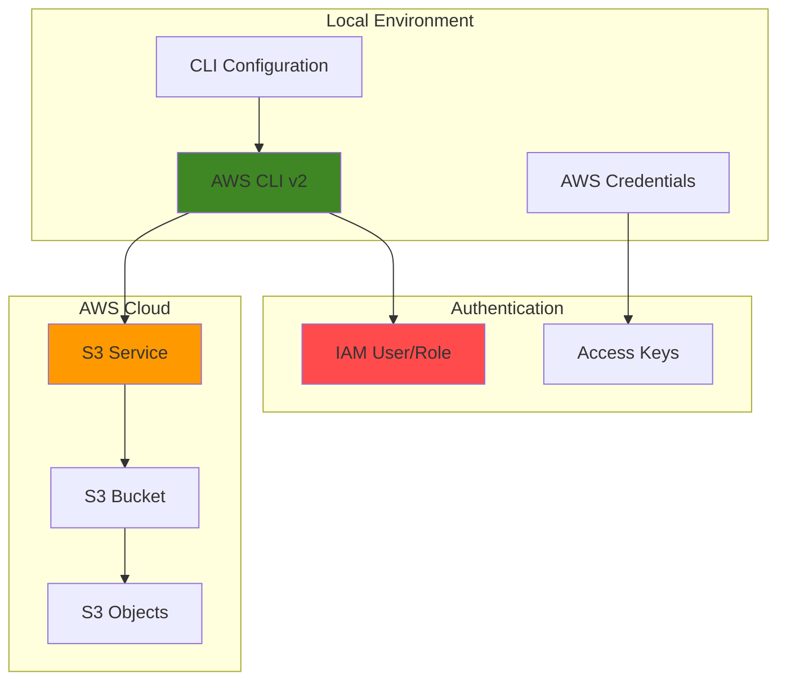

# AWS CLI Setup and First Commands with CLI and S3

## Problem

Organizations need efficient command-line access to AWS services for automation, scripting, and daily operations. Many developers and system administrators struggle with initial AWS CLI setup, credential configuration, and learning essential commands. Without proper CLI access, teams resort to manual console operations that are time-consuming, error-prone, and difficult to automate or integrate into CI/CD pipelines.

## Solution

Install and configure the AWS CLI v2 with proper credentials and security best practices, then learn fundamental S3 operations through hands-on practice. This approach establishes a solid foundation for AWS automation by providing secure, programmatic access to AWS services through a standardized command-line interface that supports scripting, automation, and integration with development workflows.

## Architecture Diagram



## Prerequisites

1. AWS account with appropriate permissions for IAM and S3 services
2. Administrative access to install software on your local machine
3. Basic understanding of command-line interfaces and terminal usage
4. Text editor for configuration file management
5. Estimated cost: Free (AWS CLI is free, S3 operations may incur minimal charges for testing)

> **Note**: This recipe follows AWS security best practices for credential management. Never share or commit AWS credentials to version control systems.

## Preparation

```bash
# Check if AWS CLI is already installed
aws --version 2>/dev/null || echo "AWS CLI not found - will install"

# Create a working directory for this recipe
mkdir -p ~/aws-cli-tutorial
cd ~/aws-cli-tutorial

echo "✅ Environment prepared for AWS CLI setup"
```

## Steps

1. **Install AWS CLI v2**:

   The AWS CLI v2 provides enhanced features, improved performance, and better security compared to v1. It's the recommended version for new installations and includes support for features like AWS SSO, enhanced credential management, and improved output formatting that follows AWS security best practices.

   ```bash
   # For Linux x86_64
   curl "https://awscli.amazonaws.com/awscli-exe-linux-x86_64.zip" \
       -o "awscliv2.zip"
   unzip awscliv2.zip
   sudo ./aws/install
   
   # For macOS (Intel)
   # curl "https://awscli.amazonaws.com/AWSCLIV2.pkg" -o "AWSCLIV2.pkg"
   # sudo installer -pkg AWSCLIV2.pkg -target /
   
   # For macOS (Apple Silicon)
   # curl "https://awscli.amazonaws.com/AWSCLIV2-arm64.pkg" -o "AWSCLIV2.pkg"
   # sudo installer -pkg AWSCLIV2.pkg -target /
   
   # For Windows (PowerShell as Administrator)
   # msiexec.exe /i https://awscli.amazonaws.com/AWSCLIV2.msi /quiet
   
   # Verify installation
   aws --version
   
   echo "✅ AWS CLI v2 installed successfully"
   ```

   The installation creates the `aws` command in your system PATH, enabling you to interact with AWS services from any terminal session. Version 2 includes automatic credential refresh, enhanced error messages, and improved resource waiter functionality that significantly improves the developer experience.

2. **Configure AWS CLI Credentials**:

   Proper credential configuration is essential for secure AWS CLI usage. The `aws configure` command sets up your access keys, default region, and output format in a secure credential store that follows AWS security best practices and creates encrypted credential files with appropriate file permissions.

   ```bash
   # Configure AWS CLI with your credentials
   # You'll be prompted for:
   # - AWS Access Key ID (from your IAM user)
   # - AWS Secret Access Key (from your IAM user)
   # - Default region name (e.g., us-east-1, us-west-2)
   # - Default output format (json recommended for automation)
   aws configure
   
   # Verify configuration without exposing credentials
   aws configure list
   
   # Test authentication with STS service
   aws sts get-caller-identity
   
   echo "✅ AWS CLI configured and authenticated"
   ```

   This configuration creates secure credential files in `~/.aws/` that the CLI uses for all subsequent operations. The `get-caller-identity` command confirms your authentication is working and displays your AWS account ID, user ARN, and user ID information for verification.

3. **Set Environment Variables for Tutorial**:

   Environment variables provide a convenient way to store values used throughout the tutorial session. These variables help maintain consistency across commands and make it easy to clean up resources later while following AWS naming conventions.

   ```bash
   # Set working region and get account information
   export AWS_REGION=$(aws configure get region)
   export AWS_ACCOUNT_ID=$(aws sts get-caller-identity \
       --query Account --output text)
   
   # Generate unique bucket name using timestamp
   TIMESTAMP=$(date +%Y%m%d-%H%M%S)
   export BUCKET_NAME="my-first-cli-bucket-${TIMESTAMP}"
   
   # Display configuration for verification
   echo "AWS Region: ${AWS_REGION}"
   echo "Account ID: ${AWS_ACCOUNT_ID}"
   echo "Bucket Name: ${BUCKET_NAME}"
   
   echo "✅ Environment variables configured"
   ```

   These variables ensure unique resource naming to avoid conflicts and provide easy reference throughout the tutorial. The timestamp-based naming prevents bucket name collisions across multiple users or tutorial runs while maintaining S3 bucket naming requirements.

4. **Create Your First S3 Bucket**:

   S3 buckets serve as containers for storing objects (files) in AWS with 99.999999999% (11 9's) durability. Creating a bucket demonstrates fundamental AWS CLI syntax and establishes a secure testing environment for practicing additional S3 operations with encryption enabled by default.

   ```bash
   # Create S3 bucket in your configured region
   aws s3 mb s3://${BUCKET_NAME} --region ${AWS_REGION}
   
   # Verify bucket creation and location
   aws s3 ls | grep ${BUCKET_NAME}
   
   # Check bucket location configuration
   aws s3api get-bucket-location --bucket ${BUCKET_NAME}
   
   # Enable server-side encryption for security
   aws s3api put-bucket-encryption \
       --bucket ${BUCKET_NAME} \
       --server-side-encryption-configuration \
       'Rules=[{ApplyServerSideEncryptionByDefault:{SSEAlgorithm:AES256}}]'
   
   echo "✅ S3 bucket created with encryption: ${BUCKET_NAME}"
   ```

   The `mb` (make bucket) command creates a new S3 bucket with default security settings. Adding server-side encryption ensures data at rest is protected, following AWS security best practices for production workloads while providing a secure foundation for learning.

5. **Upload and Manage Objects in S3**:

   Object operations form the core of S3 functionality and demonstrate fundamental cloud storage patterns. Learning to upload, list, and download objects provides the foundation for using S3 as a storage backend for applications, backups, and data processing workflows with built-in security features.

   ```bash
   # Create sample files to upload
   echo "Hello AWS CLI! This is my first S3 object." > sample-file.txt
   echo "AWS CLI makes cloud operations simple and scriptable." \
       >> sample-file.txt
   echo "Created on $(date)" >> sample-file.txt
   
   # Upload file to S3 with metadata
   aws s3 cp sample-file.txt s3://${BUCKET_NAME}/ \
       --metadata purpose=tutorial,created-by=aws-cli
   
   # List objects in bucket with details
   aws s3 ls s3://${BUCKET_NAME}/ --human-readable
   
   # Download file with different name
   aws s3 cp s3://${BUCKET_NAME}/sample-file.txt downloaded-file.txt
   
   # Verify download content
   cat downloaded-file.txt
   
   echo "✅ File uploaded to and downloaded from S3"
   ```

   These operations demonstrate the three fundamental S3 object operations: upload (`cp` to S3), list (`ls`), and download (`cp` from S3). The AWS CLI automatically handles HTTPS transfer, provides progress indicators for large files, and supports metadata tagging for object management.

6. **Explore Advanced CLI Features**:

   The AWS CLI includes powerful features for output formatting, filtering, and querying that enhance productivity and enable sophisticated scripting scenarios. Learning these features early establishes good CLI usage patterns and demonstrates the power of programmatic AWS access.

   ```bash
   # Get detailed bucket information with JSON output
   aws s3api head-bucket --bucket ${BUCKET_NAME}
   
   # List objects with comprehensive metadata
   aws s3api list-objects-v2 --bucket ${BUCKET_NAME}
   
   # Use JMESPath query to extract specific data
   aws s3api list-objects-v2 --bucket ${BUCKET_NAME} \
       --query 'Contents[].{Name:Key,Size:Size,Modified:LastModified}' \
       --output table
   
   # Check bucket encryption configuration
   aws s3api get-bucket-encryption --bucket ${BUCKET_NAME}
   
   # Get AWS CLI help for any command
   aws s3 help | head -20
   
   echo "✅ Explored advanced CLI features"
   ```

   The `s3api` commands provide low-level access to S3 features with detailed JSON responses. JMESPath queries allow precise data extraction from API responses, enabling powerful one-liner commands for automation scripts and advanced S3 management tasks.

## Validation & Testing

1. Verify AWS CLI installation and configuration:

   ```bash
   # Check CLI version (should be 2.x.x)
   aws --version
   
   # Verify credentials are configured
   aws configure list
   
   # Test authentication and permissions
   aws sts get-caller-identity
   ```

   Expected output: CLI version 2.x.x, credential configuration details showing your access key ID (partially masked), default region, and your AWS account information including Account ID and User ARN.

2. Test S3 operations and security:

   ```bash
   # Verify bucket exists and location
   aws s3 ls | grep ${BUCKET_NAME}
   aws s3api get-bucket-location --bucket ${BUCKET_NAME}
   
   # Check object was uploaded with metadata
   aws s3api head-object --bucket ${BUCKET_NAME} --key sample-file.txt
   
   # Verify encryption is enabled
   aws s3api get-bucket-encryption --bucket ${BUCKET_NAME}
   
   # Verify local file was downloaded correctly
   ls -la downloaded-file.txt
   diff sample-file.txt downloaded-file.txt
   ```

   Expected output: Bucket listed in your S3 buckets, object visible in bucket listing with metadata, encryption configuration showing AES256, and downloaded file matching original content.

3. Test CLI help and advanced features:

   ```bash
   # Access command help documentation
   aws s3 help | head -20
   
   # Test JMESPath query functionality
   aws s3api list-objects-v2 --bucket ${BUCKET_NAME} \
       --query 'Contents[0].Key' --output text
   
   # Verify different output formats
   aws s3api list-objects-v2 --bucket ${BUCKET_NAME} \
       --output table
   ```

   Expected output: Formatted help documentation for S3 commands, successful JMESPath query results, and properly formatted table output.

## Cleanup

1. Remove objects from S3 bucket:

   ```bash
   # Delete all objects in bucket
   aws s3 rm s3://${BUCKET_NAME}/ --recursive
   
   # Verify objects are deleted
   aws s3 ls s3://${BUCKET_NAME}/
   
   echo "✅ Deleted all objects from bucket"
   ```

2. Delete the S3 bucket:

   ```bash
   # Remove the empty bucket
   aws s3 rb s3://${BUCKET_NAME}
   
   # Verify bucket is deleted
   aws s3 ls | grep ${BUCKET_NAME} || echo "Bucket deleted successfully"
   
   echo "✅ Deleted bucket: ${BUCKET_NAME}"
   ```

3. Clean up local files and environment:

   ```bash
   # Remove tutorial files
   rm -f sample-file.txt downloaded-file.txt awscliv2.zip
   rm -rf aws/
   
   # Clean up environment variables
   unset BUCKET_NAME TIMESTAMP AWS_REGION AWS_ACCOUNT_ID
   
   # Return to original directory
   cd ~
   rm -rf ~/aws-cli-tutorial
   
   echo "✅ Local cleanup completed"
   ```

## Discussion

The AWS CLI v2 represents a significant advancement in cloud command-line tooling, providing developers and administrators with a powerful interface for AWS service management that follows the [AWS Well-Architected Framework](https://docs.aws.amazon.com/wellarchitected/latest/framework/welcome.html) principles. This recipe establishes the foundation for AWS automation by demonstrating proper installation, secure credential configuration, and fundamental S3 operations that form the basis for most cloud workflows while implementing security best practices from the start.

The CLI's design follows Unix command-line conventions while providing cloud-native features like automatic credential refresh, paginated output handling, and comprehensive error reporting. Understanding these capabilities early in your AWS journey enables more sophisticated automation scripts and integration with CI/CD pipelines. The choice of S3 for initial commands is strategic, as S3 operations represent common patterns used across AWS services: creating resources, managing objects, and querying metadata. The addition of server-side encryption demonstrates how security can be integrated into everyday operations.

Security considerations are paramount when using the AWS CLI. The `aws configure` command stores credentials in encrypted files with appropriate file permissions, but additional security measures like [IAM roles](https://docs.aws.amazon.com/IAM/latest/UserGuide/id_roles.html), temporary credentials, and [AWS SSO](https://docs.aws.amazon.com/singlesignon/latest/userguide/what-is.html) provide enhanced security for production environments. For development teams, establishing CLI proficiency reduces dependence on the AWS Console and enables version-controlled infrastructure management through tools like AWS CloudFormation and Terraform.

Performance optimization becomes important as CLI usage scales. The CLI supports features like command completion, output caching, and parallel operations that significantly improve productivity. Understanding JMESPath query syntax enables precise data extraction from API responses, reducing the need for external parsing tools and enabling powerful one-liner commands for complex operations. For comprehensive guidance on CLI configuration options, see the [AWS CLI User Guide](https://docs.aws.amazon.com/cli/latest/userguide/).

> **Tip**: Use `aws configure --profile profile-name` to manage multiple AWS accounts or regions without switching configurations. This feature is essential for teams managing multiple environments or working with different AWS accounts.

## Challenge

Extend this foundation by implementing these progressively advanced enhancements:

1. **Multiple Profiles Management**: Configure additional AWS CLI profiles for different environments (development, staging, production) and practice switching between them using the `--profile` parameter and environment variables.

2. **Advanced S3 Operations**: Explore the `aws s3 sync` command to synchronize local directories with S3 buckets, including options for exclusion patterns, delete operations, and bandwidth throttling for large transfers.

3. **Security and Compliance**: Implement S3 bucket policies, versioning, and lifecycle rules using CLI commands to demonstrate enterprise-grade data governance and compliance capabilities.

4. **Output Formatting and Automation**: Master JMESPath queries and CLI output formats (table, text, yaml) to create custom reports, extract specific data from AWS API responses, and build automated monitoring scripts.

5. **Cross-Service Integration**: Combine CLI commands across multiple AWS services (EC2, Lambda, CloudFormation, IAM) to create comprehensive automation workflows that demonstrate real-world cloud operations and infrastructure as code principles.

## Infrastructure Code

*Infrastructure code will be generated after recipe approval.*