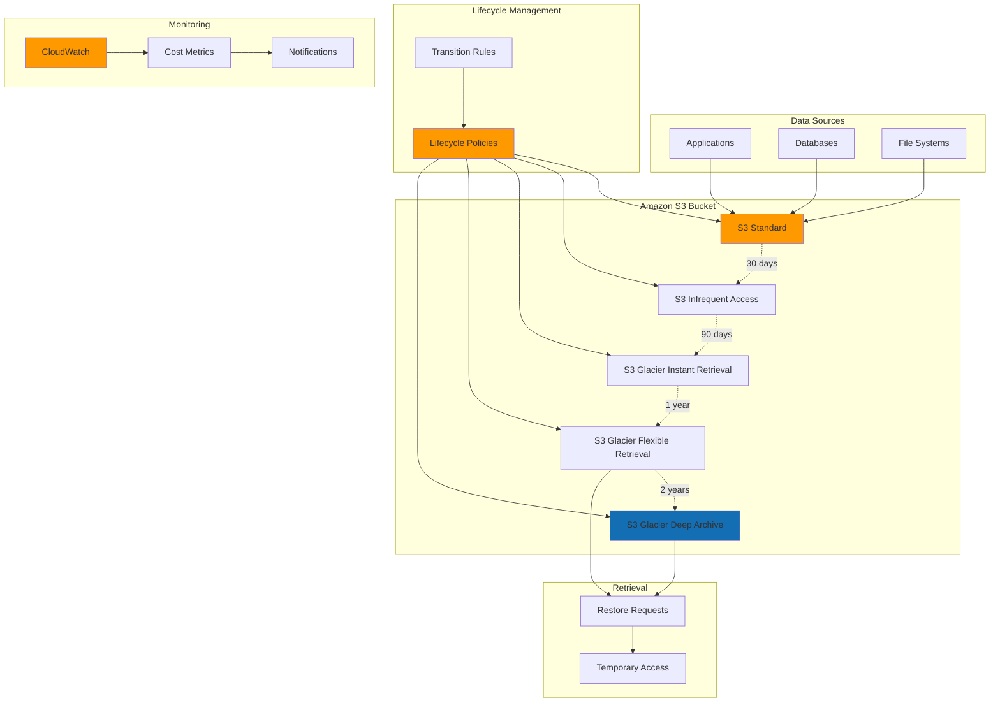

# Backup and Archive Strategies with S3 Glacier

## Problem

Organizations are accumulating vast amounts of data that must be retained for regulatory compliance, legal requirements, and historical analysis. Traditional backup solutions are expensive for long-term storage, while keeping all data in standard storage classes results in unnecessarily high costs. Companies need a cost-effective strategy to automatically transition data through different storage tiers based on access patterns, while maintaining the ability to retrieve archived data when needed for audits or business continuity.

## Solution

Implement a comprehensive backup and archive strategy using Amazon S3 Glacier storage classes combined with intelligent lifecycle policies. This solution automatically transitions data from frequently accessed storage to cost-effective long-term archive storage based on predefined rules, reducing storage costs by up to 75% while maintaining data durability and compliance requirements.

## Architecture Diagram



## Prerequisites

1. AWS account with appropriate permissions for S3, Glacier, CloudWatch, and IAM
2. AWS CLI v2 installed and configured (or AWS CloudShell)
3. Basic understanding of S3 storage classes and lifecycle management
4. Knowledge of data retention requirements and compliance needs
5. Estimated cost: $5-15/month for testing (depends on data volume and retrieval frequency)

> **Note**: S3 Glacier storage classes have minimum storage duration charges. Objects deleted before the minimum duration will incur early deletion fees. See [S3 Storage Classes](https://docs.aws.amazon.com/AmazonS3/latest/userguide/storage-class-intro.html) for detailed pricing information.

## Preparation

```bash
# Set environment variables
export AWS_REGION=$(aws configure get region)
export AWS_ACCOUNT_ID=$(aws sts get-caller-identity \
    --query Account --output text)

# Generate unique identifiers for resources
RANDOM_SUFFIX=$(aws secretsmanager get-random-password \
    --exclude-punctuation --exclude-uppercase \
    --password-length 6 --require-each-included-type \
    --output text --query RandomPassword)

export BACKUP_BUCKET_NAME="backup-archive-demo-${RANDOM_SUFFIX}"
export LIFECYCLE_POLICY_NAME="backup-archive-lifecycle-policy"
export CLOUDWATCH_ALARM_NAME="glacier-cost-alarm-${RANDOM_SUFFIX}"

# Create S3 bucket for backup and archiving
if [ "$AWS_REGION" = "us-east-1" ]; then
    aws s3api create-bucket \
        --bucket $BACKUP_BUCKET_NAME \
        --region $AWS_REGION
else
    aws s3api create-bucket \
        --bucket $BACKUP_BUCKET_NAME \
        --region $AWS_REGION \
        --create-bucket-configuration LocationConstraint=$AWS_REGION
fi

# Enable versioning for backup integrity
aws s3api put-bucket-versioning \
    --bucket $BACKUP_BUCKET_NAME \
    --versioning-configuration Status=Enabled

echo "✅ Created backup bucket: $BACKUP_BUCKET_NAME"
```

## Steps

1. **Create Comprehensive Lifecycle Policy Configuration**:

   Amazon S3 lifecycle policies are the cornerstone of automated data archiving, enabling cost optimization through intelligent data transitions. S3 provides 99.999999999% (11 9's) durability across multiple storage classes, from frequently accessed Standard storage to ultra-low-cost Deep Archive. Lifecycle policies automatically move objects between these storage classes based on predefined rules, eliminating manual intervention while ensuring compliance with data retention requirements.

   This step creates three distinct lifecycle rules targeting different data types: backup data with comprehensive 7-year retention, log data with shorter lifecycle and automatic deletion, and document archives using tag-based filtering. Understanding these patterns enables organizations to implement sophisticated archiving strategies that balance cost optimization with accessibility requirements.

   ```bash
   # Create lifecycle policy JSON configuration
   cat > lifecycle-policy.json << 'EOF'
   {
     "Rules": [
       {
         "ID": "backup-archive-strategy",
         "Status": "Enabled",
         "Filter": {
           "Prefix": "backups/"
         },
         "Transitions": [
           {
             "Days": 30,
             "StorageClass": "STANDARD_IA"
           },
           {
             "Days": 90,
             "StorageClass": "GLACIER_IR"
           },
           {
             "Days": 365,
             "StorageClass": "GLACIER"
           },
           {
             "Days": 2555,
             "StorageClass": "DEEP_ARCHIVE"
           }
         ],
         "NoncurrentVersionTransitions": [
           {
             "NoncurrentDays": 7,
             "StorageClass": "STANDARD_IA"
           },
           {
             "NoncurrentDays": 30,
             "StorageClass": "GLACIER"
           }
         ],
         "NoncurrentVersionExpiration": {
           "NoncurrentDays": 2920
         }
       },
       {
         "ID": "logs-retention-policy",
         "Status": "Enabled",
         "Filter": {
           "Prefix": "logs/"
         },
         "Transitions": [
           {
             "Days": 7,
             "StorageClass": "STANDARD_IA"
           },
           {
             "Days": 30,
             "StorageClass": "GLACIER_IR"
           },
           {
             "Days": 90,
             "StorageClass": "GLACIER"
           }
         ],
         "Expiration": {
           "Days": 2555
         }
       },
       {
         "ID": "documents-long-term-archive",
         "Status": "Enabled",
         "Filter": {
           "And": {
             "Prefix": "documents/",
             "Tags": [
               {
                 "Key": "DataClass",
                 "Value": "Archive"
               }
             ]
           }
         },
         "Transitions": [
           {
             "Days": 60,
             "StorageClass": "GLACIER_IR"
           },
           {
             "Days": 180,
             "StorageClass": "GLACIER"
           },
           {
             "Days": 1095,
             "StorageClass": "DEEP_ARCHIVE"
           }
         ]
       }
     ]
   }
   EOF
   
   echo "✅ Created lifecycle policy configuration"
   ```

   The lifecycle policy configuration now defines automated transition schedules for different data types. These rules will trigger automatically based on object age and tags, moving data through progressively cheaper storage classes while maintaining AWS's industry-leading durability guarantee. This foundation enables significant cost reductions while ensuring data remains accessible when needed.

2. **Apply Lifecycle Policy to S3 Bucket**:

   Applying lifecycle policies to an S3 bucket activates the automated data management engine. S3's lifecycle management service runs daily assessments of object eligibility for transitions, ensuring precise adherence to your defined schedules. This process occurs transparently without impacting application performance or data availability, making it ideal for production environments with strict uptime requirements.

   The verification step confirms that policies are correctly configured and active, providing immediate feedback on the bucket's lifecycle configuration. Understanding this process helps troubleshoot policy issues and ensures compliance audits can verify proper data management controls.

   ```bash
   # Apply the lifecycle configuration to the bucket
   aws s3api put-bucket-lifecycle-configuration \
       --bucket $BACKUP_BUCKET_NAME \
       --lifecycle-configuration file://lifecycle-policy.json
   
   # Verify the lifecycle policy was applied
   aws s3api get-bucket-lifecycle-configuration \
       --bucket $BACKUP_BUCKET_NAME \
       --query 'Rules[].{ID:ID,Status:Status,Prefix:Filter.Prefix}'
   
   echo "✅ Applied lifecycle policy to bucket"
   ```

   The lifecycle policies are now active and will begin evaluating objects for transitions starting with the next daily lifecycle run. S3 will automatically track object ages and apply the appropriate storage class transitions, reducing storage costs progressively over time while maintaining full data integrity and compliance.

3. **Create Sample Data for Testing Different Storage Classes**:

   Creating representative test data enables validation of lifecycle policies and cost optimization strategies before implementing them with production data. Different data types typically have varying access patterns and retention requirements: database backups need long-term retention with infrequent access, application logs require shorter retention with automatic cleanup, and legal documents need permanent archival with tag-based classification.

   This structured approach to test data creation mirrors real-world backup scenarios, enabling proper validation of lifecycle transitions and retrieval processes. Understanding these patterns helps design effective archiving strategies that align with business requirements and regulatory compliance needs.

   ```bash
   # Create sample backup data
   mkdir -p sample-data/backups sample-data/logs sample-data/documents
   
   # Generate sample backup files
   echo "Database backup - $(date)" > sample-data/backups/db-backup-$(date +%Y%m%d).sql
   echo "Application backup - $(date)" > sample-data/backups/app-backup-$(date +%Y%m%d).tar.gz
   echo "Config backup - $(date)" > sample-data/backups/config-backup-$(date +%Y%m%d).json
   
   # Generate sample log files
   echo "Application log - $(date)" > sample-data/logs/app-$(date +%Y%m%d).log
   echo "System log - $(date)" > sample-data/logs/system-$(date +%Y%m%d).log
   
   # Generate sample document files
   echo "Legal document - $(date)" > sample-data/documents/legal-doc-$(date +%Y%m%d).pdf
   echo "Financial record - $(date)" > sample-data/documents/financial-$(date +%Y%m%d).xlsx
   
   echo "✅ Created sample data files"
   ```

   The sample data structure now reflects typical enterprise backup scenarios with different data types organized into logical prefixes. This organization enables targeted lifecycle policies and simplifies data management operations, providing a foundation for testing automated archiving workflows.

4. **Upload Sample Data with Appropriate Tags**:

   Object tagging enables sophisticated data classification and lifecycle management beyond simple prefix-based rules. Tags provide metadata that supports compliance tracking, cost allocation, and automated policy application. S3 supports up to 10 tags per object, enabling complex data governance strategies that align with enterprise requirements for data classification and retention.

   The tag-based approach for document archiving demonstrates how organizations can implement fine-grained data management policies. This capability is essential for regulated industries where different document types require specific retention schedules and access controls based on legal or compliance requirements.

   ```bash
   # Upload backup files
   aws s3 cp sample-data/backups/ s3://$BACKUP_BUCKET_NAME/backups/ \
       --recursive
   
   # Upload log files
   aws s3 cp sample-data/logs/ s3://$BACKUP_BUCKET_NAME/logs/ \
       --recursive
   
   # Upload document files with tags
   for file in sample-data/documents/*; do
       filename=$(basename "$file")
       aws s3 cp "$file" s3://$BACKUP_BUCKET_NAME/documents/$filename \
           --tagging "DataClass=Archive&Department=Legal&Retention=LongTerm"
   done
   
   echo "✅ Uploaded sample data with appropriate tags"
   ```

   Objects are now stored in S3 with appropriate classifications and will be subject to their respective lifecycle policies. The tag-based filtering ensures that documents with specific compliance requirements follow appropriate archival schedules, while backup and log data follow their own optimized transition paths.

5. **Set Up CloudWatch Monitoring for Storage Costs**:

   CloudWatch provides comprehensive monitoring capabilities for S3 storage costs and lifecycle transitions, enabling proactive cost management and compliance reporting. Billing alarms help prevent unexpected cost spikes from accidental data uploads or retrieval operations, while custom metrics track lifecycle transition events for audit and optimization purposes.

   Storage cost monitoring is critical for long-term archiving strategies, as costs can vary significantly based on data volume, retrieval frequency, and storage class utilization. CloudWatch's integration with S3 enables real-time visibility into storage patterns and automated responses to cost threshold breaches, supporting budget management and financial governance.

   ```bash
   # Create CloudWatch alarm for storage costs
   aws cloudwatch put-metric-alarm \
       --alarm-name $CLOUDWATCH_ALARM_NAME \
       --alarm-description "Monitor S3 storage costs" \
       --metric-name EstimatedCharges \
       --namespace AWS/Billing \
       --statistic Maximum \
       --period 86400 \
       --threshold 50.0 \
       --comparison-operator GreaterThanThreshold \
       --dimensions Name=Currency,Value=USD Name=ServiceName,Value=AmazonS3 \
       --evaluation-periods 1
   
   # Create metric filter for tracking lifecycle transitions
   aws logs create-log-group \
       --log-group-name /aws/s3/lifecycle-transitions \
       --region $AWS_REGION
   
   echo "✅ Set up CloudWatch monitoring"
   ```

   Cost monitoring and logging infrastructure is now active, providing visibility into storage expenses and lifecycle transition events. These monitoring capabilities enable proactive cost management and support compliance reporting requirements for data governance and financial oversight.

6. **Create IAM Role for Enhanced S3 Operations**:

   IAM roles provide secure, temporary credential access for AWS services to perform operations on your behalf, following the principle of least privilege. For S3 lifecycle and archiving operations, properly configured roles enable automated processes without requiring permanent access keys or overly broad permissions that could compromise security.

   This security model ensures that automated archiving processes have only the specific permissions needed to function, reducing potential attack surfaces while maintaining operational efficiency. Understanding IAM role delegation helps implement secure automation that meets enterprise security requirements and compliance standards.

   ```bash
   # Create trust policy for S3 service
   cat > s3-trust-policy.json << 'EOF'
   {
     "Version": "2012-10-17",
     "Statement": [
       {
         "Effect": "Allow",
         "Principal": {
           "Service": "s3.amazonaws.com"
         },
         "Action": "sts:AssumeRole"
       }
     ]
   }
   EOF
   
   # Create IAM role for S3 operations
   aws iam create-role \
       --role-name S3ArchiveOperationsRole \
       --assume-role-policy-document file://s3-trust-policy.json
   
   # Attach policy for S3 operations
   aws iam attach-role-policy \
       --role-name S3ArchiveOperationsRole \
       --policy-arn arn:aws:iam::aws:policy/AmazonS3FullAccess
   
   echo "✅ Created IAM role for S3 operations"
   ```

   The IAM role is now configured to enable secure S3 operations with appropriate permissions. This security foundation ensures that lifecycle transitions and restore operations can proceed automatically while maintaining strict access controls and audit trails for compliance purposes.

7. **Test Archive Retrieval Process**:

   Understanding the archive retrieval process is essential for business continuity planning and compliance requirements. S3 Glacier Flexible Retrieval offers three retrieval options: Expedited (1-5 minutes), Standard (3-5 hours), and Bulk (5-12 hours), each with different cost implications. Testing these processes ensures that recovery time objectives (RTO) align with business requirements and disaster recovery plans.

   The restore process creates a temporary copy of archived objects that remains accessible for a specified duration before automatic deletion. This design optimizes costs by avoiding permanent storage in higher-cost tiers while providing necessary access for business operations, compliance audits, or disaster recovery scenarios.

   ```bash
   # Create a test file and immediately archive it (for demonstration)
   echo "Test archive file - $(date)" > test-archive.txt
   
   # Upload with Glacier Flexible Retrieval storage class
   aws s3 cp test-archive.txt s3://$BACKUP_BUCKET_NAME/test-archive.txt \
       --storage-class GLACIER
   
   # Initiate restore request (Standard retrieval - 3-5 hours)
   aws s3api restore-object \
       --bucket $BACKUP_BUCKET_NAME \
       --key test-archive.txt \
       --restore-request Days=7,GlacierJobParameters='{Tier=Standard}'
   
   # Check restore status
   aws s3api head-object \
       --bucket $BACKUP_BUCKET_NAME \
       --key test-archive.txt \
       --query 'Restore'
   
   echo "✅ Initiated test archive retrieval"
   ```

   The restore request has been submitted and S3 will process the retrieval according to the specified tier and duration. This test validates the retrieval workflow and confirms that archived data can be accessed when needed, supporting business continuity and disaster recovery requirements.

8. **Create Backup and Archive Automation Script**:

   Automation scripts standardize backup operations and ensure consistent data classification across different systems and teams. Automated backup processes reduce human error, improve reliability, and enable scheduled operations that align with business requirements and maintenance windows. This approach supports enterprise backup strategies that require predictable, repeatable processes for compliance and operational efficiency.

   The script's tag-based classification system enables sophisticated data management workflows that automatically apply appropriate lifecycle policies based on backup type and schedule. This automation reduces operational overhead while ensuring that different data types follow their respective retention schedules and cost optimization strategies.

   ```bash
   # Create automation script for regular backups
   cat > backup-automation.sh << 'EOF'
   #!/bin/bash
   
   # Backup automation script
   BACKUP_BUCKET="$1"
   SOURCE_DIR="$2"
   BACKUP_TYPE="$3"
   
   DATE=$(date +%Y%m%d-%H%M%S)
   
   case $BACKUP_TYPE in
       "database")
           PREFIX="backups/database/"
           TAGS="BackupType=Database&Schedule=Daily"
           ;;
       "application")
           PREFIX="backups/application/"
           TAGS="BackupType=Application&Schedule=Weekly"
           ;;
       "logs")
           PREFIX="logs/"
           TAGS="BackupType=Logs&Schedule=Daily"
           ;;
       *)
           echo "Invalid backup type. Use: database, application, or logs"
           exit 1
           ;;
   esac
   
   # Create backup archive
   tar -czf "${BACKUP_TYPE}-backup-${DATE}.tar.gz" "$SOURCE_DIR"
   
   # Upload to S3 with appropriate tags
   aws s3 cp "${BACKUP_TYPE}-backup-${DATE}.tar.gz" \
       "s3://${BACKUP_BUCKET}/${PREFIX}${BACKUP_TYPE}-backup-${DATE}.tar.gz" \
       --tagging "$TAGS"
   
   # Clean up local backup file
   rm "${BACKUP_TYPE}-backup-${DATE}.tar.gz"
   
   echo "Backup completed: ${BACKUP_TYPE}-backup-${DATE}.tar.gz"
   EOF
   
   chmod +x backup-automation.sh
   
   echo "✅ Created backup automation script"
   ```

   The automation script is now ready for deployment and can be integrated into existing backup workflows or scheduled operations. This tool enables consistent backup operations with appropriate data classification, supporting enterprise data management strategies and compliance requirements.

9. **Set Up Compliance Reporting**:

   Compliance reporting capabilities enable organizations to demonstrate adherence to data retention policies, regulatory requirements, and internal governance standards. Automated reporting reduces manual audit overhead while providing detailed visibility into storage utilization, lifecycle transitions, and cost optimization effectiveness. These reports support various compliance frameworks including SOX, GDPR, HIPAA, and industry-specific regulations.

   The comprehensive reporting script provides insights into storage class distribution, archived object inventory, and cost trends that support financial planning and regulatory compliance. Understanding these metrics helps optimize archiving strategies and demonstrates effective data governance to auditors and regulatory bodies.

   ```bash
   # Create compliance report script
   cat > compliance-report.sh << 'EOF'
   #!/bin/bash
   
   BUCKET_NAME="$1"
   REPORT_DATE=$(date +%Y%m%d)
   
   echo "S3 Glacier Compliance Report - $REPORT_DATE"
   echo "=============================================="
   
   # Get bucket lifecycle configuration
   echo "Current Lifecycle Policies:"
   aws s3api get-bucket-lifecycle-configuration \
       --bucket $BUCKET_NAME \
       --query 'Rules[].{ID:ID,Status:Status,Transitions:Transitions}' \
       --output table
   
   # Get storage class distribution
   echo -e "\nStorage Class Distribution:"
   aws s3api list-objects-v2 \
       --bucket $BUCKET_NAME \
       --query 'Contents[].StorageClass' \
       --output text | sort | uniq -c
   
   # Get objects in Glacier classes
   echo -e "\nObjects in Glacier Storage Classes:"
   aws s3api list-objects-v2 \
       --bucket $BUCKET_NAME \
       --query 'Contents[?StorageClass==`GLACIER` || StorageClass==`DEEP_ARCHIVE`].{Key:Key,StorageClass:StorageClass,LastModified:LastModified}' \
       --output table
   
   # Calculate estimated monthly costs using current year
   CURRENT_YEAR=$(date +%Y)
   CURRENT_MONTH=$(date +%m)
   
   echo -e "\nEstimated Monthly Storage Costs:"
   aws ce get-cost-and-usage \
       --time-period Start=${CURRENT_YEAR}-${CURRENT_MONTH}-01,End=${CURRENT_YEAR}-${CURRENT_MONTH}-$(date -d "${CURRENT_YEAR}-${CURRENT_MONTH}-01 +1 month -1 day" +%d) \
       --granularity MONTHLY \
       --metrics BlendedCost \
       --group-by Type=DIMENSION,Key=SERVICE \
       --query 'ResultsByTime[0].Groups[?Keys[0]==`Amazon Simple Storage Service`].Metrics.BlendedCost.Amount' \
       --output text 2>/dev/null || echo "Cost data unavailable for current month"
   EOF
   
   chmod +x compliance-report.sh
   
   echo "✅ Created compliance reporting script"
   ```

   The compliance reporting infrastructure is now configured to provide detailed insights into storage utilization, lifecycle effectiveness, and cost optimization results. These reporting capabilities support audit requirements and enable data-driven decisions for ongoing archiving strategy optimization.

## Validation & Testing

1. **Verify Lifecycle Policy Configuration**:

   ```bash
   # Check if lifecycle policy is correctly applied
   aws s3api get-bucket-lifecycle-configuration \
       --bucket $BACKUP_BUCKET_NAME \
       --query 'Rules[].{ID:ID,Status:Status,Transitions:Transitions[].{Days:Days,StorageClass:StorageClass}}' \
       --output table
   ```

   Expected output: Table showing all three lifecycle rules with their transition schedules.

2. **Test Data Upload and Tagging**:

   ```bash
   # Verify uploaded objects and their tags
   aws s3api list-objects-v2 \
       --bucket $BACKUP_BUCKET_NAME \
       --query 'Contents[].{Key:Key,StorageClass:StorageClass,LastModified:LastModified}' \
       --output table
   
   # Check tags on archive documents
   aws s3api get-object-tagging \
       --bucket $BACKUP_BUCKET_NAME \
       --key documents/legal-doc-$(date +%Y%m%d).pdf \
       --query 'TagSet'
   ```

   Expected output: List of objects with their current storage classes and tag information.

3. **Test Restore Process**:

   ```bash
   # Check restore status for archived object
   aws s3api head-object \
       --bucket $BACKUP_BUCKET_NAME \
       --key test-archive.txt \
       --query '{StorageClass:StorageClass,Restore:Restore}'
   ```

   Expected output: JSON showing storage class as "GLACIER" and restore status.

4. **Validate Cost Monitoring**:

   ```bash
   # Check CloudWatch alarm status
   aws cloudwatch describe-alarms \
       --alarm-names $CLOUDWATCH_ALARM_NAME \
       --query 'MetricAlarms[].{Name:AlarmName,State:StateValue,Threshold:Threshold}'
   ```

   Expected output: Alarm configuration showing monitoring is active.

## Cleanup

1. **Empty and Delete S3 Bucket**:

   ```bash
   # Empty the bucket (including all versions)
   aws s3 rm s3://$BACKUP_BUCKET_NAME --recursive
   
   # Delete versioned objects
   aws s3api delete-objects \
       --bucket $BACKUP_BUCKET_NAME \
       --delete "$(aws s3api list-object-versions \
           --bucket $BACKUP_BUCKET_NAME \
           --query '{Objects: Versions[].{Key:Key,VersionId:VersionId}}')" \
       2>/dev/null || echo "No versioned objects to delete"
   
   # Delete delete markers
   aws s3api delete-objects \
       --bucket $BACKUP_BUCKET_NAME \
       --delete "$(aws s3api list-object-versions \
           --bucket $BACKUP_BUCKET_NAME \
           --query '{Objects: DeleteMarkers[].{Key:Key,VersionId:VersionId}}')" \
       2>/dev/null || echo "No delete markers to remove"
   
   # Delete the bucket
   aws s3api delete-bucket --bucket $BACKUP_BUCKET_NAME
   
   echo "✅ Deleted S3 bucket and all objects"
   ```

2. **Remove CloudWatch Resources**:

   ```bash
   # Delete CloudWatch alarm
   aws cloudwatch delete-alarms \
       --alarm-names $CLOUDWATCH_ALARM_NAME
   
   # Delete log group
   aws logs delete-log-group \
       --log-group-name /aws/s3/lifecycle-transitions
   
   echo "✅ Removed CloudWatch resources"
   ```

3. **Remove IAM Role**:

   ```bash
   # Detach policy from role
   aws iam detach-role-policy \
       --role-name S3ArchiveOperationsRole \
       --policy-arn arn:aws:iam::aws:policy/AmazonS3FullAccess
   
   # Delete IAM role
   aws iam delete-role --role-name S3ArchiveOperationsRole
   
   echo "✅ Removed IAM role"
   ```

4. **Clean Up Local Files**:

   ```bash
   # Remove local configuration files
   rm -f lifecycle-policy.json
   rm -f s3-trust-policy.json
   rm -f backup-automation.sh
   rm -f compliance-report.sh
   rm -f test-archive.txt
   rm -rf sample-data/
   
   # Clear environment variables
   unset BACKUP_BUCKET_NAME
   unset LIFECYCLE_POLICY_NAME
   unset CLOUDWATCH_ALARM_NAME
   
   echo "✅ Cleaned up local files and environment variables"
   ```

## Discussion

This comprehensive backup and archive strategy demonstrates how to leverage Amazon S3 Glacier storage classes effectively for long-term data retention while optimizing costs. The solution automatically transitions data through different storage tiers based on access patterns, reducing storage costs by up to 75% compared to keeping all data in S3 Standard.

The lifecycle policy configuration showcases three different archiving strategies: backup data follows a comprehensive transition path from Standard to Deep Archive over 7 years, log data has a shorter retention period with automatic deletion, and document archives use tag-based filtering for more granular control. Each strategy balances cost optimization with data accessibility requirements.

Key architectural decisions include using multiple storage classes for different data types, implementing versioning for backup integrity, and setting up monitoring to track costs and compliance. The automated scripts enable consistent backup practices, while compliance reporting provides audit trails required for regulatory oversight.

> **Tip**: Use S3 Intelligent-Tiering for data with unpredictable access patterns, as it automatically moves objects between access tiers based on changing access patterns without performance impact or operational overhead. Learn more about [S3 Lifecycle Management](https://docs.aws.amazon.com/AmazonS3/latest/userguide/object-lifecycle-mgmt.html) and [Archive Retrieval Options](https://docs.aws.amazon.com/AmazonS3/latest/userguide/restoring-objects-retrieval-options.html).

For organizations with strict compliance requirements, this solution provides audit trails through CloudWatch monitoring and automated compliance reporting. The tag-based filtering enables fine-grained policy application, allowing different retention schedules for various data classifications. Consider implementing AWS CloudTrail for detailed API activity logging and AWS Config for compliance monitoring across your S3 resources. The AWS Well-Architected Framework emphasizes the importance of automated data lifecycle management for both cost optimization and operational excellence pillars.

## Challenge

Extend this solution by implementing these enhancements:

1. **Implement Cross-Region Replication** for backup data with automated failover capabilities using S3 Cross-Region Replication and AWS Lambda triggers for disaster recovery scenarios
2. **Add Intelligent Cost Optimization** using AWS Cost Explorer APIs and machine learning to predict optimal transition schedules based on historical access patterns and usage analytics
3. **Create Advanced Compliance Reporting** with automated generation of regulatory compliance reports, including data lineage tracking and retention audit trails using AWS Glue DataCatalog
4. **Integrate with AWS Backup** to create a unified backup strategy across EC2, RDS, EFS, and S3 with centralized backup policies and cross-service recovery testing workflows
5. **Implement Data Lifecycle Automation** using AWS Step Functions to orchestrate complex backup workflows with error handling, retry logic, and notification systems via Amazon SNS

## Infrastructure Code

*Infrastructure code will be generated after recipe approval.*