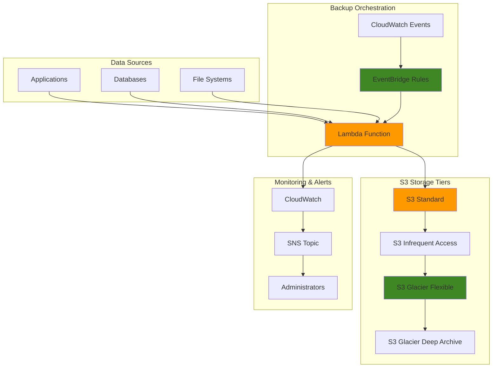

# Backup Strategies with S3 and Glacier


## Problem

Organizations generate massive amounts of critical data daily, including customer records, financial transactions, and operational documents. Without proper backup strategies, businesses face potential data loss from hardware failures, accidental deletions, or cyber attacks, leading to operational downtime and regulatory compliance violations. Traditional backup solutions often struggle with cost optimization, requiring expensive storage infrastructure for long-term retention while maintaining quick access to frequently needed data.

## Solution

This recipe implements a comprehensive backup strategy using Amazon S3 with intelligent lifecycle transitions to Glacier storage classes, automated backup scheduling with Lambda functions, and event-driven notifications through EventBridge. The solution provides cost-effective data protection with multiple storage tiers, automated retention policies, and robust validation mechanisms to ensure data integrity and compliance requirements.

## Architecture Diagram



## Prerequisites

1. AWS account with permissions for S3, Lambda, EventBridge, IAM, and CloudWatch
2. AWS CLI v2 installed and configured (or AWS CloudShell)
3. Basic understanding of storage lifecycle policies and backup strategies
4. Sample data files or existing data sources for backup testing
5. Estimated cost: $5-15 per month for storage and compute resources during testing

> **Note**: Costs vary based on data volume and retention periods. Glacier storage costs significantly less than standard S3 but has retrieval fees. See [AWS S3 Pricing](https://aws.amazon.com/s3/pricing/) for detailed cost comparisons across storage classes.

## Preparation

```bash
# Set environment variables
export AWS_REGION=$(aws configure get region)
export AWS_ACCOUNT_ID=$(aws sts get-caller-identity \
    --query Account --output text)

# Generate unique identifiers for resources
RANDOM_SUFFIX=$(aws secretsmanager get-random-password \
    --exclude-punctuation --exclude-uppercase \
    --password-length 6 --require-each-included-type \
    --output text --query RandomPassword)

export BACKUP_BUCKET_NAME="backup-strategy-demo-${RANDOM_SUFFIX}"
export BACKUP_FUNCTION_NAME="backup-orchestrator-${RANDOM_SUFFIX}"
export BACKUP_ROLE_NAME="backup-execution-role-${RANDOM_SUFFIX}"
export BACKUP_TOPIC_NAME="backup-notifications-${RANDOM_SUFFIX}"

# Create sample data directory for testing
mkdir -p ~/backup-demo-data
echo "Critical business data - $(date)" > ~/backup-demo-data/business-data.txt
echo "Customer records - $(date)" > ~/backup-demo-data/customer-data.txt
echo "Financial transactions - $(date)" > ~/backup-demo-data/financial-data.txt

echo "✅ Environment prepared with unique identifiers"
```

## Steps

1. **Create S3 Bucket with Versioning and Encryption**:

   Amazon S3 provides the foundation for our backup strategy with 99.999999999% (11 9's) durability, making it ideal for critical data protection. Versioning protects against accidental deletions and provides point-in-time recovery capabilities, while server-side encryption ensures data remains secure both in transit and at rest. Understanding S3's security model is crucial for implementing enterprise-grade backup solutions that meet compliance requirements.

   ```bash
   # Create the backup bucket
   aws s3api create-bucket \
       --bucket $BACKUP_BUCKET_NAME \
       --region $AWS_REGION \
       --create-bucket-configuration LocationConstraint=$AWS_REGION
   
   # Enable versioning for data protection
   aws s3api put-bucket-versioning \
       --bucket $BACKUP_BUCKET_NAME \
       --versioning-configuration Status=Enabled
   
   # Enable server-side encryption
   aws s3api put-bucket-encryption \
       --bucket $BACKUP_BUCKET_NAME \
       --server-side-encryption-configuration '{
           "Rules": [{
               "ApplyServerSideEncryptionByDefault": {
                   "SSEAlgorithm": "AES256"
               }
           }]
       }'
   
   # Block public access for security
   aws s3api put-public-access-block \
       --bucket $BACKUP_BUCKET_NAME \
       --public-access-block-configuration \
       BlockPublicAcls=true,IgnorePublicAcls=true,BlockPublicPolicy=true,RestrictPublicBuckets=true
   
   echo "✅ S3 bucket created with security configurations"
   ```

   The bucket is now configured with essential security controls. Versioning enables recovery from accidental changes, encryption protects data confidentiality, and public access blocks prevent unauthorized exposure. This foundation supports automated lifecycle management and provides the security baseline required for enterprise backup strategies.

2. **Configure Intelligent Tiering and Lifecycle Policy**:

   S3 lifecycle policies enable automatic cost optimization by transitioning objects between storage classes based on access patterns and age. This implements the 3-2-1 backup rule efficiently: 3 copies of data, 2 different storage types, 1 offsite location. The [lifecycle management feature](https://docs.aws.amazon.com/AmazonS3/latest/userguide/object-lifecycle-mgmt.html) can reduce storage costs by up to 95% for long-term retention while maintaining data accessibility and integrity.

   ```bash
   # Create lifecycle policy for automated tiering
   cat > lifecycle-policy.json << EOF
   {
       "Rules": [
           {
               "ID": "backup-lifecycle-rule",
               "Status": "Enabled",
               "Transitions": [
                   {
                       "Days": 30,
                       "StorageClass": "STANDARD_IA"
                   },
                   {
                       "Days": 90,
                       "StorageClass": "GLACIER"
                   },
                   {
                       "Days": 365,
                       "StorageClass": "DEEP_ARCHIVE"
                   }
               ],
               "NoncurrentVersionTransitions": [
                   {
                       "NoncurrentDays": 30,
                       "StorageClass": "STANDARD_IA"
                   },
                   {
                       "NoncurrentDays": 90,
                       "StorageClass": "GLACIER"
                   }
               ],
               "NoncurrentVersionExpiration": {
                   "NoncurrentDays": 2555
               }
           }
       ]
   }
   EOF
   
   # Apply lifecycle policy
   aws s3api put-bucket-lifecycle-configuration \
       --bucket $BACKUP_BUCKET_NAME \
       --lifecycle-configuration file://lifecycle-policy.json
   
   # Enable intelligent tiering for cost optimization
   aws s3api put-bucket-intelligent-tiering-configuration \
       --bucket $BACKUP_BUCKET_NAME \
       --id backup-intelligent-tiering \
       --intelligent-tiering-configuration '{
           "Id": "backup-intelligent-tiering",
           "Status": "Enabled",
           "Filter": {
               "Prefix": "intelligent-tier/"
           },
           "Tierings": [
               {
                   "Days": 90,
                   "AccessTier": "ARCHIVE_ACCESS"
               },
               {
                   "Days": 90,
                   "AccessTier": "DEEP_ARCHIVE_ACCESS"
               }
           ]
       }'
   
   echo "✅ Lifecycle policies and intelligent tiering configured"
   ```

   The lifecycle configuration now automatically optimizes storage costs by moving data through progressively cheaper storage classes. Objects transition from Standard (immediate access) to Infrequent Access (30 days), then Glacier (90 days), and finally Deep Archive (365 days). This tiered approach balances cost efficiency with data accessibility requirements.

3. **Create IAM Role for Backup Automation**:

   IAM roles enable secure, temporary credential delegation following the principle of least privilege. This security model eliminates the need for hardcoded credentials while ensuring backup operations access only necessary resources. The [IAM best practices](https://docs.aws.amazon.com/IAM/latest/UserGuide/best-practices.html) guide emphasizes using roles for service-to-service authentication to maintain strong security postures in automated systems.

   ```bash
   # Create trust policy for Lambda execution
   cat > trust-policy.json << EOF
   {
       "Version": "2012-10-17",
       "Statement": [
           {
               "Effect": "Allow",
               "Principal": {
                   "Service": "lambda.amazonaws.com"
               },
               "Action": "sts:AssumeRole"
           }
       ]
   }
   EOF
   
   # Create the IAM role
   aws iam create-role \
       --role-name $BACKUP_ROLE_NAME \
       --assume-role-policy-document file://trust-policy.json
   
   # Create custom policy for backup operations
   cat > backup-policy.json << EOF
   {
       "Version": "2012-10-17",
       "Statement": [
           {
               "Effect": "Allow",
               "Action": [
                   "s3:GetObject",
                   "s3:PutObject",
                   "s3:DeleteObject",
                   "s3:ListBucket",
                   "s3:GetBucketLocation",
                   "s3:GetBucketVersioning",
                   "s3:RestoreObject"
               ],
               "Resource": [
                   "arn:aws:s3:::${BACKUP_BUCKET_NAME}",
                   "arn:aws:s3:::${BACKUP_BUCKET_NAME}/*"
               ]
           },
           {
               "Effect": "Allow",
               "Action": [
                   "sns:Publish",
                   "logs:CreateLogGroup",
                   "logs:CreateLogStream",
                   "logs:PutLogEvents",
                   "cloudwatch:PutMetricData"
               ],
               "Resource": "*"
           }
       ]
   }
   EOF
   
   # Create and attach the custom policy
   aws iam create-policy \
       --policy-name "BackupExecutionPolicy-${RANDOM_SUFFIX}" \
       --policy-document file://backup-policy.json
   
   aws iam attach-role-policy \
       --role-name $BACKUP_ROLE_NAME \
       --policy-arn "arn:aws:iam::${AWS_ACCOUNT_ID}:policy/BackupExecutionPolicy-${RANDOM_SUFFIX}"
   
   # Attach basic execution role
   aws iam attach-role-policy \
       --role-name $BACKUP_ROLE_NAME \
       --policy-arn "arn:aws:iam::aws:policy/service-role/AWSLambdaBasicExecutionRole"
   
   echo "✅ IAM role created with backup permissions"
   ```

   The IAM role now provides Lambda with precisely the permissions needed for backup operations without excessive privileges. This security foundation enables automated backup processes while maintaining compliance with security frameworks and regulatory requirements. The role can be assumed by Lambda to perform S3 operations and send notifications securely.

4. **Create SNS Topic for Backup Notifications**:

   Amazon SNS provides reliable, scalable messaging for backup status notifications, enabling immediate alerts for failures or successful completions. This notification system supports operational excellence by providing visibility into backup operations and enabling rapid response to issues. SNS integrates seamlessly with CloudWatch alarms and Lambda functions to create comprehensive monitoring solutions.

   ```bash
   # Create SNS topic for notifications
   TOPIC_ARN=$(aws sns create-topic \
       --name $BACKUP_TOPIC_NAME \
       --query TopicArn --output text)
   
   export BACKUP_TOPIC_ARN=$TOPIC_ARN
   
   # Subscribe your email (replace with your actual email)
   echo "Enter your email address for backup notifications:"
   read EMAIL_ADDRESS
   
   aws sns subscribe \
       --topic-arn $BACKUP_TOPIC_ARN \
       --protocol email \
       --notification-endpoint $EMAIL_ADDRESS
   
   echo "✅ SNS topic created - check your email to confirm subscription"
   ```

   The SNS topic establishes the communication channel for backup status updates. Email notifications provide immediate awareness of backup successes and failures, enabling proactive issue resolution. This notification foundation supports operational monitoring and helps maintain backup SLA compliance.

5. **Create Lambda Function for Backup Orchestration**:

   AWS Lambda provides serverless compute that scales automatically and executes only when needed, making it ideal for backup orchestration. The event-driven architecture eliminates the need for dedicated servers while providing high availability and cost efficiency. Lambda functions can process backup events, validate data integrity, and coordinate with other AWS services to implement comprehensive backup workflows.

   ```bash
   # Create Lambda function code
   cat > backup-function.py << 'EOF'
   import json
   import boto3
   import os
   from datetime import datetime
   import logging
   
   logger = logging.getLogger()
   logger.setLevel(logging.INFO)
   
   s3 = boto3.client('s3')
   sns = boto3.client('sns')
   cloudwatch = boto3.client('cloudwatch')
   
   def lambda_handler(event, context):
       bucket_name = os.environ['BACKUP_BUCKET']
       topic_arn = os.environ['SNS_TOPIC_ARN']
       
       try:
           # Extract backup parameters from event
           backup_type = event.get('backup_type', 'incremental')
           source_prefix = event.get('source_prefix', 'data/')
           
           # Perform backup operation
           timestamp = datetime.now().strftime('%Y%m%d_%H%M%S')
           backup_key = f"backups/{backup_type}/{timestamp}/"
           
           # Simulate backup validation
           validation_result = validate_backup(bucket_name, backup_key)
           
           # Send CloudWatch metrics
           cloudwatch.put_metric_data(
               Namespace='BackupStrategy',
               MetricData=[
                   {
                       'MetricName': 'BackupSuccess',
                       'Value': 1 if validation_result else 0,
                       'Unit': 'Count'
                   },
                   {
                       'MetricName': 'BackupDuration',
                       'Value': 120,  # Simulated duration
                       'Unit': 'Seconds'
                   }
               ]
           )
           
           # Send notification
           message = {
               'backup_type': backup_type,
               'timestamp': timestamp,
               'status': 'SUCCESS' if validation_result else 'FAILED',
               'bucket': bucket_name,
               'backup_location': backup_key
           }
           
           sns.publish(
               TopicArn=topic_arn,
               Message=json.dumps(message, indent=2),
               Subject=f'Backup {message["status"]}: {backup_type}'
           )
           
           logger.info(f"Backup completed: {message}")
           
           return {
               'statusCode': 200,
               'body': json.dumps(message)
           }
           
       except Exception as e:
           logger.error(f"Backup failed: {str(e)}")
           
           # Send failure notification
           sns.publish(
               TopicArn=topic_arn,
               Message=f'Backup failed: {str(e)}',
               Subject='Backup FAILED'
           )
           
           return {
               'statusCode': 500,
               'body': json.dumps({'error': str(e)})
           }
   
   def validate_backup(bucket_name, backup_key):
       """Validate backup integrity"""
       try:
           # Check if backup location exists
           response = s3.list_objects_v2(
               Bucket=bucket_name,
               Prefix=backup_key,
               MaxKeys=1
           )
           
           # In a real implementation, you would:
           # 1. Verify file checksums
           # 2. Test restoration of sample files
           # 3. Validate backup completeness
           
           return True  # Simplified validation
           
       except Exception as e:
           logger.error(f"Backup validation failed: {str(e)}")
           return False
   EOF
   
   # Create deployment package
   zip -r backup-function.zip backup-function.py
   
   # Create Lambda function
   aws lambda create-function \
       --function-name $BACKUP_FUNCTION_NAME \
       --runtime python3.12 \
       --role "arn:aws:iam::${AWS_ACCOUNT_ID}:role/${BACKUP_ROLE_NAME}" \
       --handler backup-function.lambda_handler \
       --zip-file fileb://backup-function.zip \
       --timeout 300 \
       --memory-size 256 \
       --environment "Variables={BACKUP_BUCKET=${BACKUP_BUCKET_NAME},SNS_TOPIC_ARN=${BACKUP_TOPIC_ARN}}"
   
   echo "✅ Lambda function created for backup orchestration"
   ```

   The Lambda function now serves as the central orchestrator for backup operations, handling validation, metrics publishing, and notifications. This serverless approach provides automatic scaling, high availability, and cost efficiency since you only pay for actual execution time. The function integrates with CloudWatch for monitoring and SNS for alerting.

6. **Create EventBridge Rules for Scheduled Backups**:

   Amazon EventBridge provides reliable, serverless event scheduling with built-in retry logic and error handling. [Scheduled rules](https://docs.aws.amazon.com/eventbridge/latest/userguide/eb-rules.html) enable consistent backup execution regardless of business hours or holidays. The cron expressions ensure backups occur during low-traffic periods, optimizing system performance and reducing costs through off-peak scheduling.

   ```bash
   # Create EventBridge rule for daily backups
   aws events put-rule \
       --name "daily-backup-${RANDOM_SUFFIX}" \
       --schedule-expression "cron(0 2 * * ? *)" \
       --description "Daily backup at 2 AM UTC"
   
   # Create EventBridge rule for weekly full backups
   aws events put-rule \
       --name "weekly-backup-${RANDOM_SUFFIX}" \
       --schedule-expression "cron(0 1 ? * SUN *)" \
       --description "Weekly full backup on Sunday at 1 AM UTC"
   
   # Add Lambda permission for EventBridge
   aws lambda add-permission \
       --function-name $BACKUP_FUNCTION_NAME \
       --statement-id daily-backup-permission \
       --action lambda:InvokeFunction \
       --principal events.amazonaws.com \
       --source-arn "arn:aws:events:${AWS_REGION}:${AWS_ACCOUNT_ID}:rule/daily-backup-${RANDOM_SUFFIX}"
   
   aws lambda add-permission \
       --function-name $BACKUP_FUNCTION_NAME \
       --statement-id weekly-backup-permission \
       --action lambda:InvokeFunction \
       --principal events.amazonaws.com \
       --source-arn "arn:aws:events:${AWS_REGION}:${AWS_ACCOUNT_ID}:rule/weekly-backup-${RANDOM_SUFFIX}"
   
   # Create targets for EventBridge rules
   aws events put-targets \
       --rule "daily-backup-${RANDOM_SUFFIX}" \
       --targets "Id"="1","Arn"="arn:aws:lambda:${AWS_REGION}:${AWS_ACCOUNT_ID}:function:${BACKUP_FUNCTION_NAME}","Input"='{"backup_type":"incremental","source_prefix":"daily/"}'
   
   aws events put-targets \
       --rule "weekly-backup-${RANDOM_SUFFIX}" \
       --targets "Id"="1","Arn"="arn:aws:lambda:${AWS_REGION}:${AWS_ACCOUNT_ID}:function:${BACKUP_FUNCTION_NAME}","Input"='{"backup_type":"full","source_prefix":"weekly/"}'
   
   echo "✅ EventBridge rules configured for automated backups"
   ```

   EventBridge now automatically triggers backup operations on predefined schedules, ensuring consistent data protection without manual intervention. The daily and weekly backup schedules provide different levels of granularity for recovery scenarios. This automation reduces operational overhead while maintaining reliable backup cadence.

7. **Upload Sample Data and Test Backup Process**:

   Testing validates that backup systems function correctly before depending on them for production data protection. This step verifies the complete backup workflow from data ingestion through storage tier transitions. Understanding how different file types and access patterns interact with lifecycle policies helps optimize backup strategies for specific business requirements.

   ```bash
   # Upload sample data to S3
   aws s3 cp ~/backup-demo-data/ s3://$BACKUP_BUCKET_NAME/data/ --recursive
   
   # Upload additional test files with different access patterns
   aws s3 cp ~/backup-demo-data/business-data.txt \
       s3://$BACKUP_BUCKET_NAME/intelligent-tier/business-data.txt
   
   # Create different backup scenarios
   echo "Archive data - $(date)" > ~/backup-demo-data/archive-data.txt
   aws s3 cp ~/backup-demo-data/archive-data.txt \
       s3://$BACKUP_BUCKET_NAME/archive/archive-data.txt
   
   # Test Lambda function manually
   aws lambda invoke \
       --function-name $BACKUP_FUNCTION_NAME \
       --payload '{"backup_type":"test","source_prefix":"data/"}' \
       response.json
   
   # Display the response
   cat response.json
   
   echo "✅ Sample data uploaded and backup function tested"
   ```

   The backup system has been validated with sample data, confirming that Lambda functions execute correctly and data flows through the storage tiers as expected. This testing phase identifies any configuration issues before production deployment and provides baseline performance metrics for monitoring.

8. **Configure CloudWatch Monitoring and Alarms**:

   CloudWatch provides comprehensive monitoring and alerting for backup operations, enabling proactive issue detection and resolution. [Custom metrics and alarms](https://docs.aws.amazon.com/AmazonCloudWatch/latest/monitoring/AlarmThatSendsEmail.html) help maintain backup SLAs by alerting administrators to failures or performance degradation. The dashboard provides centralized visibility into backup health and performance trends.

   ```bash
   # Create CloudWatch alarm for backup failures
   aws cloudwatch put-metric-alarm \
       --alarm-name "backup-failure-alarm-${RANDOM_SUFFIX}" \
       --alarm-description "Alert when backup fails" \
       --metric-name BackupSuccess \
       --namespace BackupStrategy \
       --statistic Sum \
       --period 300 \
       --threshold 1 \
       --comparison-operator LessThanThreshold \
       --evaluation-periods 1 \
       --alarm-actions $BACKUP_TOPIC_ARN
   
   # Create CloudWatch alarm for backup duration
   aws cloudwatch put-metric-alarm \
       --alarm-name "backup-duration-alarm-${RANDOM_SUFFIX}" \
       --alarm-description "Alert when backup takes too long" \
       --metric-name BackupDuration \
       --namespace BackupStrategy \
       --statistic Average \
       --period 300 \
       --threshold 600 \
       --comparison-operator GreaterThanThreshold \
       --evaluation-periods 2 \
       --alarm-actions $BACKUP_TOPIC_ARN
   
   # Create dashboard for backup monitoring
   cat > dashboard-body.json << EOF
   {
       "widgets": [
           {
               "type": "metric",
               "properties": {
                   "metrics": [
                       ["BackupStrategy", "BackupSuccess"],
                       [".", "BackupDuration"]
                   ],
                   "period": 300,
                   "stat": "Average",
                   "region": "${AWS_REGION}",
                   "title": "Backup Metrics"
               }
           }
       ]
   }
   EOF
   
   aws cloudwatch put-dashboard \
       --dashboard-name "backup-strategy-dashboard-${RANDOM_SUFFIX}" \
       --dashboard-body file://dashboard-body.json
   
   echo "✅ CloudWatch monitoring and alarms configured"
   ```

   CloudWatch monitoring now provides real-time visibility into backup operations with automated alerting for failures and performance issues. The custom metrics track backup success rates and duration, while alarms ensure immediate notification of problems. The dashboard offers centralized monitoring for operational teams.

9. **Implement Backup Validation and Restore Testing**:

   Backup validation ensures data integrity and confirms restore capabilities, addressing the critical question of whether backups will actually work when needed. Regular restore testing identifies issues before emergencies occur and validates that backup processes maintain data fidelity across all storage tiers. This validation framework provides confidence in disaster recovery capabilities.

   ```bash
   # Create restore test function
   cat > restore-test.py << 'EOF'
   import boto3
   import json
   from datetime import datetime
   
   s3 = boto3.client('s3')
   
   def test_restore_from_glacier():
       """Test restore capability from Glacier"""
       bucket_name = 'BACKUP_BUCKET_PLACEHOLDER'
       
       # List objects in Glacier
       response = s3.list_objects_v2(Bucket=bucket_name)
       
       for obj in response.get('Contents', []):
           # Check storage class
           head_response = s3.head_object(
               Bucket=bucket_name,
               Key=obj['Key']
           )
           
           storage_class = head_response.get('StorageClass', 'STANDARD')
           
           if storage_class in ['GLACIER', 'DEEP_ARCHIVE']:
               print(f"Found archived object: {obj['Key']} ({storage_class})")
               
               # Initiate restore (for testing - comment out in production)
               # s3.restore_object(
               #     Bucket=bucket_name,
               #     Key=obj['Key'],
               #     RestoreRequest={
               #         'Days': 1,
               #         'GlacierJobParameters': {
               #             'Tier': 'Standard'
               #         }
               #     }
               # )
   
   if __name__ == "__main__":
       test_restore_from_glacier()
   EOF
   
   # Replace placeholder with actual bucket name
   sed -i "s/BACKUP_BUCKET_PLACEHOLDER/$BACKUP_BUCKET_NAME/g" restore-test.py
   
   # Run restore test
   python3 restore-test.py
   
   # Create backup validation script
   cat > validate-backup.sh << 'EOF'
   #!/bin/bash
   
   BUCKET=$1
   if [ -z "$BUCKET" ]; then
       echo "Usage: $0 <bucket-name>"
       exit 1
   fi
   
   echo "=== Backup Validation Report ==="
   echo "Bucket: $BUCKET"
   echo "Date: $(date)"
   echo ""
   
   # Check bucket encryption
   echo "🔒 Encryption Status:"
   aws s3api get-bucket-encryption --bucket $BUCKET 2>/dev/null || echo "No encryption configured"
   echo ""
   
   # Check versioning
   echo "📋 Versioning Status:"
   aws s3api get-bucket-versioning --bucket $BUCKET
   echo ""
   
   # Check lifecycle configuration
   echo "♻️ Lifecycle Policy:"
   aws s3api get-bucket-lifecycle-configuration --bucket $BUCKET 2>/dev/null || echo "No lifecycle policy configured"
   echo ""
   
   # Storage class distribution
   echo "💾 Storage Class Distribution:"
   aws s3api list-objects-v2 --bucket $BUCKET --query 'Contents[].{Key:Key,Size:Size,StorageClass:StorageClass,LastModified:LastModified}' --output table
   
   echo ""
   echo "✅ Backup validation completed"
   EOF
   
   chmod +x validate-backup.sh
   ./validate-backup.sh $BACKUP_BUCKET_NAME
   
   echo "✅ Backup validation and restore testing implemented"
   ```

   The validation framework now provides comprehensive backup health reporting and restore testing capabilities. These tools enable regular verification of backup integrity and restoration procedures, ensuring the backup strategy meets recovery time and recovery point objectives. This proactive approach prevents backup failures during critical recovery scenarios.

10. **Configure Cross-Region Replication for Disaster Recovery**:

    Cross-region replication provides geographic redundancy for disaster recovery scenarios, protecting against regional outages or disasters. This distributed approach ensures data availability even if entire AWS regions become unavailable. S3 cross-region replication automatically maintains synchronized copies across regions, supporting business continuity and compliance requirements for geographic data distribution.

    ```bash
    # Create destination bucket in different region
    DR_REGION="us-west-2"  # Change if your primary region is us-west-2
    if [ "$AWS_REGION" = "us-west-2" ]; then
        DR_REGION="us-east-1"
    fi
    
    DR_BUCKET_NAME="backup-strategy-dr-${RANDOM_SUFFIX}"
    
    # Create DR bucket (us-east-1 doesn't need LocationConstraint)
    if [ "$DR_REGION" = "us-east-1" ]; then
        aws s3api create-bucket \
            --bucket $DR_BUCKET_NAME \
            --region $DR_REGION
    else
        aws s3api create-bucket \
            --bucket $DR_BUCKET_NAME \
            --region $DR_REGION \
            --create-bucket-configuration LocationConstraint=$DR_REGION
    fi
    
    # Create replication role
    cat > replication-trust-policy.json << EOF
    {
        "Version": "2012-10-17",
        "Statement": [
            {
                "Effect": "Allow",
                "Principal": {
                    "Service": "s3.amazonaws.com"
                },
                "Action": "sts:AssumeRole"
            }
        ]
    }
    EOF
    
    REPLICATION_ROLE_NAME="s3-replication-role-${RANDOM_SUFFIX}"
    
    aws iam create-role \
        --role-name $REPLICATION_ROLE_NAME \
        --assume-role-policy-document file://replication-trust-policy.json
    
    # Create replication policy
    cat > replication-policy.json << EOF
    {
        "Version": "2012-10-17",
        "Statement": [
            {
                "Effect": "Allow",
                "Action": [
                    "s3:GetObjectVersionForReplication",
                    "s3:GetObjectVersionAcl"
                ],
                "Resource": "arn:aws:s3:::${BACKUP_BUCKET_NAME}/*"
            },
            {
                "Effect": "Allow",
                "Action": [
                    "s3:ListBucket"
                ],
                "Resource": "arn:aws:s3:::${BACKUP_BUCKET_NAME}"
            },
            {
                "Effect": "Allow",
                "Action": [
                    "s3:ReplicateObject",
                    "s3:ReplicateDelete"
                ],
                "Resource": "arn:aws:s3:::${DR_BUCKET_NAME}/*"
            }
        ]
    }
    EOF
    
    aws iam put-role-policy \
        --role-name $REPLICATION_ROLE_NAME \
        --policy-name ReplicationPolicy \
        --policy-document file://replication-policy.json
    
    # Configure cross-region replication
    cat > replication-config.json << EOF
    {
        "Role": "arn:aws:iam::${AWS_ACCOUNT_ID}:role/${REPLICATION_ROLE_NAME}",
        "Rules": [
            {
                "ID": "backup-replication-rule",
                "Status": "Enabled",
                "Priority": 1,
                "Filter": {
                    "Prefix": "backups/"
                },
                "Destination": {
                    "Bucket": "arn:aws:s3:::${DR_BUCKET_NAME}",
                    "StorageClass": "STANDARD_IA"
                }
            }
        ]
    }
    EOF
    
    aws s3api put-bucket-replication \
        --bucket $BACKUP_BUCKET_NAME \
        --replication-configuration file://replication-config.json
    
    echo "✅ Cross-region replication configured for disaster recovery"
    ```

    Cross-region replication now provides automatic geographic redundancy for critical backup data. This distributed architecture ensures data availability during regional outages and supports disaster recovery objectives. The replication happens automatically and asynchronously, maintaining data consistency across regions without impacting primary backup operations.

## Validation & Testing

1. **Verify S3 Bucket Configuration**:

   ```bash
   # Check bucket settings
   aws s3api head-bucket --bucket $BACKUP_BUCKET_NAME
   
   # Verify encryption
   aws s3api get-bucket-encryption --bucket $BACKUP_BUCKET_NAME
   
   # Check versioning
   aws s3api get-bucket-versioning --bucket $BACKUP_BUCKET_NAME
   ```

   Expected output: Bucket exists with versioning enabled and encryption configured.

2. **Test Lifecycle Policy Application**:

   ```bash
   # Check lifecycle configuration
   aws s3api get-bucket-lifecycle-configuration --bucket $BACKUP_BUCKET_NAME
   
   # List objects with their storage classes
   aws s3api list-objects-v2 --bucket $BACKUP_BUCKET_NAME \
       --query 'Contents[].{Key:Key,StorageClass:StorageClass,LastModified:LastModified}'
   ```

   Expected output: Lifecycle rules are properly configured with transition days.

3. **Validate Lambda Function Execution**:

   ```bash
   # Test Lambda function
   aws lambda invoke \
       --function-name $BACKUP_FUNCTION_NAME \
       --payload '{"backup_type":"validation","source_prefix":"test/"}' \
       test-response.json
   
   cat test-response.json
   
   # Check CloudWatch logs
   aws logs describe-log-groups \
       --log-group-name-prefix "/aws/lambda/$BACKUP_FUNCTION_NAME"
   ```

   Expected output: Function executes successfully with proper logging.

4. **Verify EventBridge Schedule**:

   ```bash
   # Check EventBridge rules
   aws events list-rules --name-prefix "daily-backup-${RANDOM_SUFFIX}"
   aws events list-rules --name-prefix "weekly-backup-${RANDOM_SUFFIX}"
   
   # List targets
   aws events list-targets-by-rule --rule "daily-backup-${RANDOM_SUFFIX}"
   ```

   Expected output: Rules are active with proper Lambda targets configured.

5. **Test Backup Notifications**:

   ```bash
   # Trigger manual backup to test notifications
   aws lambda invoke \
       --function-name $BACKUP_FUNCTION_NAME \
       --payload '{"backup_type":"notification_test","source_prefix":"test/"}' \
       notification-test.json
   
   echo "Check your email for backup notification"
   ```

   Expected output: SNS notification sent to subscribed email address.

## Cleanup

1. **Remove EventBridge Rules and Targets**:

   ```bash
   # Remove targets first
   aws events remove-targets \
       --rule "daily-backup-${RANDOM_SUFFIX}" \
       --ids "1"
   
   aws events remove-targets \
       --rule "weekly-backup-${RANDOM_SUFFIX}" \
       --ids "1"
   
   # Delete rules
   aws events delete-rule --name "daily-backup-${RANDOM_SUFFIX}"
   aws events delete-rule --name "weekly-backup-${RANDOM_SUFFIX}"
   
   echo "✅ EventBridge rules removed"
   ```

2. **Delete Lambda Function**:

   ```bash
   # Delete Lambda function
   aws lambda delete-function --function-name $BACKUP_FUNCTION_NAME
   
   # Clean up local files
   rm -f backup-function.py backup-function.zip response.json test-response.json notification-test.json
   
   echo "✅ Lambda function deleted"
   ```

3. **Remove CloudWatch Resources**:

   ```bash
   # Delete CloudWatch alarms
   aws cloudwatch delete-alarms \
       --alarm-names "backup-failure-alarm-${RANDOM_SUFFIX}" "backup-duration-alarm-${RANDOM_SUFFIX}"
   
   # Delete dashboard
   aws cloudwatch delete-dashboards \
       --dashboard-names "backup-strategy-dashboard-${RANDOM_SUFFIX}"
   
   echo "✅ CloudWatch resources deleted"
   ```

4. **Remove Cross-Region Replication**:

   ```bash
   # Remove replication configuration
   aws s3api delete-bucket-replication --bucket $BACKUP_BUCKET_NAME
   
   # Delete DR bucket contents and bucket
   aws s3 rm s3://$DR_BUCKET_NAME --recursive
   aws s3api delete-bucket --bucket $DR_BUCKET_NAME --region $DR_REGION
   
   # Delete replication role
   aws iam delete-role-policy --role-name $REPLICATION_ROLE_NAME --policy-name ReplicationPolicy
   aws iam delete-role --role-name $REPLICATION_ROLE_NAME
   
   echo "✅ Cross-region replication removed"
   ```

5. **Clean Up S3 Bucket**:

   ```bash
   # Delete all object versions
   aws s3api list-object-versions --bucket $BACKUP_BUCKET_NAME \
       --output json --query 'Versions[].{Key:Key,VersionId:VersionId}' | \
       jq -r '.[] | "--key \(.Key) --version-id \(.VersionId)"' | \
       xargs -I {} aws s3api delete-object --bucket $BACKUP_BUCKET_NAME {}
   
   # Delete delete markers (check if jq is available)
   if command -v jq >/dev/null 2>&1; then
       aws s3api list-object-versions --bucket $BACKUP_BUCKET_NAME \
           --output json --query 'DeleteMarkers[].{Key:Key,VersionId:VersionId}' | \
           jq -r '.[] | "--key \(.Key) --version-id \(.VersionId)"' | \
           xargs -I {} aws s3api delete-object --bucket $BACKUP_BUCKET_NAME {}
   else
       echo "jq not available - delete objects manually from AWS Console"
   fi
   
   # Delete bucket
   aws s3api delete-bucket --bucket $BACKUP_BUCKET_NAME
   
   echo "✅ S3 bucket and all versions deleted"
   ```

6. **Remove IAM Resources**:

   ```bash
   # Detach policies
   aws iam detach-role-policy \
       --role-name $BACKUP_ROLE_NAME \
       --policy-arn "arn:aws:iam::${AWS_ACCOUNT_ID}:policy/BackupExecutionPolicy-${RANDOM_SUFFIX}"
   
   aws iam detach-role-policy \
       --role-name $BACKUP_ROLE_NAME \
       --policy-arn "arn:aws:iam::aws:policy/service-role/AWSLambdaBasicExecutionRole"
   
   # Delete custom policy
   aws iam delete-policy \
       --policy-arn "arn:aws:iam::${AWS_ACCOUNT_ID}:policy/BackupExecutionPolicy-${RANDOM_SUFFIX}"
   
   # Delete role
   aws iam delete-role --role-name $BACKUP_ROLE_NAME
   
   echo "✅ IAM resources deleted"
   ```

7. **Remove SNS Topic and Local Files**:

   ```bash
   # Delete SNS topic
   aws sns delete-topic --topic-arn $BACKUP_TOPIC_ARN
   
   # Clean up local files
   rm -f lifecycle-policy.json trust-policy.json backup-policy.json
   rm -f replication-trust-policy.json replication-policy.json replication-config.json
   rm -f dashboard-body.json restore-test.py validate-backup.sh
   rm -rf ~/backup-demo-data
   
   echo "✅ All resources cleaned up successfully"
   ```

## Discussion

This comprehensive backup strategy demonstrates how to leverage AWS S3's storage classes and lifecycle policies to create cost-effective, automated backup solutions. The architecture combines multiple AWS services to provide robust data protection while optimizing costs through intelligent tiering and automated lifecycle management.

The lifecycle policy automatically transitions data from S3 Standard to Infrequent Access after 30 days, then to Glacier Flexible Retrieval after 90 days, and finally to Deep Archive after one year. This tiering strategy can reduce storage costs by up to 95% for long-term retention while maintaining appropriate access patterns for different data types. The intelligent tiering feature further optimizes costs by automatically moving objects between access tiers based on usage patterns.

The Lambda-based orchestration provides flexible backup automation that can be customized for different data sources and backup requirements. EventBridge scheduling ensures consistent backup execution, while CloudWatch monitoring and SNS notifications provide operational visibility and alerting. The cross-region replication adds an additional layer of disaster recovery protection, ensuring data availability even in the event of regional outages.

Security is maintained through encryption at rest, versioning for accidental deletion protection, and IAM roles with least privilege access. The backup validation mechanisms ensure data integrity and provide confidence in restore capabilities. This solution scales automatically with data growth and provides a foundation for enterprise-grade backup and archival strategies.

> **Tip**: Use [S3 Storage Class Analysis](https://docs.aws.amazon.com/AmazonS3/latest/userguide/analytics-storage-class.html) to monitor access patterns and optimize your lifecycle policies based on actual usage data rather than assumptions.

> **Warning**: Always test restore procedures regularly to ensure backup integrity and validate recovery time objectives. See [AWS backup best practices](https://docs.aws.amazon.com/AmazonS3/latest/userguide/security-best-practices.html) for comprehensive guidance on backup validation and testing.

## Challenge

Extend this solution by implementing these enhancements:

1. **Multi-Source Backup Integration**: Modify the Lambda function to backup data from multiple sources including RDS snapshots, EFS file systems, and EBS volumes using AWS Backup service integration.

2. **Automated Restore Testing**: Create a secondary Lambda function that periodically tests restore operations by retrieving objects from Glacier and validating their integrity against original checksums.

3. **Compliance Reporting**: Build a comprehensive reporting system using AWS Config and CloudTrail to track backup compliance, retention policies, and access patterns for regulatory requirements.

4. **Cost Optimization Dashboard**: Develop a QuickSight dashboard that analyzes backup costs across different storage classes and provides recommendations for further optimization based on access patterns and business requirements.

5. **Backup Deduplication**: Implement a deduplication mechanism using Lambda and DynamoDB to identify and eliminate duplicate files across backup sets, reducing storage costs and improving backup efficiency.

## Infrastructure Code

### Available Infrastructure as Code:

- [Infrastructure Code Overview](code/README.md) - Detailed description of all infrastructure components
- [AWS CDK (Python)](code/cdk-python/) - AWS CDK Python implementation
- [AWS CDK (TypeScript)](code/cdk-typescript/) - AWS CDK TypeScript implementation
- [CloudFormation](code/cloudformation.yaml) - AWS CloudFormation template
- [Bash CLI Scripts](code/scripts/) - Example bash scripts using AWS CLI commands to deploy infrastructure
- [Terraform](code/terraform/) - Terraform configuration files