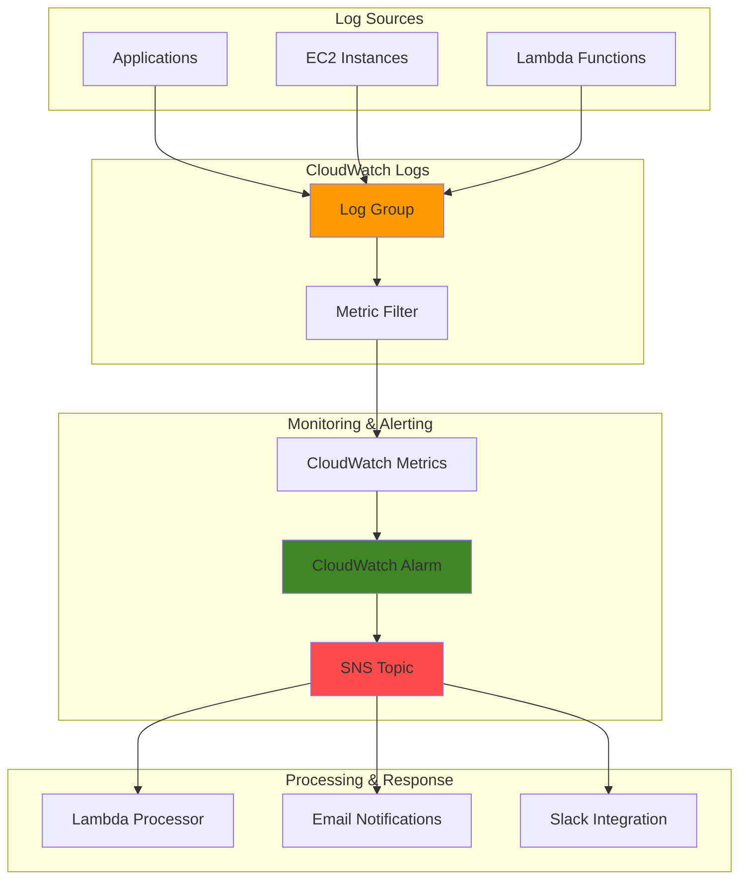

# Basic Log Monitoring with CloudWatch

## Problem

Application teams often struggle with detecting and responding to critical errors in their applications because they lack automated monitoring of their log files. Manual log review is time-consuming and reactive, leading to delayed incident response and potential service disruptions. Without automated alerting, critical errors like database connection failures, API timeouts, or authentication issues can go unnoticed for extended periods, resulting in poor user experience and potential revenue loss.

## Solution

This solution creates an automated log monitoring system using CloudWatch Logs metric filters to detect specific error patterns, CloudWatch Alarms to trigger notifications, and SNS to deliver real-time alerts to your team. A Lambda function processes log events and can perform additional analysis or remediation actions. This serverless architecture provides cost-effective, scalable monitoring that automatically scales with your application's log volume and ensures immediate notification of critical issues.

## Architecture Diagram



## Prerequisites

1. AWS account with appropriate permissions for CloudWatch, SNS, and Lambda services
2. AWS CLI v2 installed and configured (or AWS CloudShell)
3. Basic understanding of AWS CloudWatch Logs and log patterns
4. Email address for receiving notifications
5. Estimated cost: $5-15 per month for moderate log volumes (varies by log ingestion and retention)

> **Note**: This configuration follows AWS Well-Architected Framework principles for operational excellence and monitoring best practices.

## Preparation

```bash
# Set environment variables
export AWS_REGION=$(aws configure get region)
export AWS_ACCOUNT_ID=$(aws sts get-caller-identity \
    --query Account --output text)

# Generate unique identifiers for resources
RANDOM_SUFFIX=$(aws secretsmanager get-random-password \
    --exclude-punctuation --exclude-uppercase \
    --password-length 6 --require-each-included-type \
    --output text --query RandomPassword)

# Set resource names
export LOG_GROUP_NAME="/aws/application/monitoring-demo"
export METRIC_FILTER_NAME="error-count-filter"
export ALARM_NAME="application-errors-alarm"
export SNS_TOPIC_NAME="log-monitoring-alerts-${RANDOM_SUFFIX}"
export LAMBDA_FUNCTION_NAME="log-processor-${RANDOM_SUFFIX}"

# Set your email for notifications
export NOTIFICATION_EMAIL="your-email@example.com"

echo "✅ AWS environment configured with unique identifiers"
echo "Log Group: ${LOG_GROUP_NAME}"
echo "SNS Topic: ${SNS_TOPIC_NAME}"
echo "Lambda Function: ${LAMBDA_FUNCTION_NAME}"
```

## Steps

1. **Create CloudWatch Log Group for Application Logs**:

   CloudWatch Logs provides centralized log collection and storage with configurable retention policies. Creating a dedicated log group establishes the foundation for our monitoring system, allowing applications to send structured log data that can be filtered and analyzed. This centralized approach enables consistent log management across multiple applications and services.

   ```bash
   # Create log group with 7-day retention
   aws logs create-log-group \
       --log-group-name ${LOG_GROUP_NAME} \
       --retention-in-days 7
   
   # Verify log group creation
   aws logs describe-log-groups \
       --log-group-name-prefix ${LOG_GROUP_NAME} \
       --query 'logGroups[0].{Name:logGroupName,Retention:retentionInDays}'
   
   echo "✅ Log group created: ${LOG_GROUP_NAME}"
   ```

   The log group is now ready to receive log events from your applications. The 7-day retention policy balances storage costs with operational needs, ensuring logs are available for incident investigation while managing expenses.

2. **Create SNS Topic for Alert Notifications**:

   Amazon SNS provides a flexible, fully managed messaging service that can deliver notifications to multiple endpoints simultaneously. Creating the SNS topic early in the process ensures that our monitoring system can immediately send alerts when errors are detected, supporting rapid incident response and team coordination.

   ```bash
   # Create SNS topic for notifications
   aws sns create-topic --name ${SNS_TOPIC_NAME}
   
   # Get topic ARN for later use
   export SNS_TOPIC_ARN=$(aws sns get-topic-attributes \
       --topic-arn arn:aws:sns:${AWS_REGION}:${AWS_ACCOUNT_ID}:${SNS_TOPIC_NAME} \
       --query 'Attributes.TopicArn' --output text)
   
   # Subscribe email to topic
   aws sns subscribe \
       --topic-arn ${SNS_TOPIC_ARN} \
       --protocol email \
       --notification-endpoint ${NOTIFICATION_EMAIL}
   
   echo "✅ SNS topic created: ${SNS_TOPIC_NAME}"
   echo "✅ Email subscription added (check your email to confirm)"
   ```

   The SNS topic is now configured to deliver notifications to your email address. You'll receive a confirmation email that must be approved before notifications can be delivered. This decoupled architecture allows easy addition of other notification channels like Slack or SMS.

3. **Create Metric Filter to Detect Error Patterns**:

   CloudWatch Logs metric filters transform log data into CloudWatch metrics by scanning log events for specific patterns. This filter will detect common error patterns like "ERROR", "FAILED", "EXCEPTION", and "TIMEOUT" in your application logs. The metric filter creates a custom metric that can be used to trigger alarms and track error trends over time.

   ```bash
   # Create metric filter for error detection
   aws logs put-metric-filter \
       --log-group-name ${LOG_GROUP_NAME} \
       --filter-name ${METRIC_FILTER_NAME} \
       --filter-pattern '{ ($.level = "ERROR") || ($.message = "*ERROR*") || ($.message = "*FAILED*") || ($.message = "*EXCEPTION*") || ($.message = "*TIMEOUT*") }' \
       --metric-transformations \
           metricName=ApplicationErrors,\
           metricNamespace=CustomApp/Monitoring,\
           metricValue=1,\
           defaultValue=0
   
   # Verify metric filter creation
   aws logs describe-metric-filters \
       --log-group-name ${LOG_GROUP_NAME} \
       --query 'metricFilters[0].{Name:filterName,Pattern:filterPattern}'
   
   echo "✅ Metric filter created: ${METRIC_FILTER_NAME}"
   ```

   The metric filter is now actively monitoring your log group for error patterns. When matching log events are detected, the filter will increment the ApplicationErrors metric in the CustomApp/Monitoring namespace. This approach provides accurate error counting and enables threshold-based alerting.

4. **Create Lambda Function for Log Processing**:

   AWS Lambda enables serverless processing of log events, allowing custom analysis and automated remediation actions. This function will receive SNS notifications when errors are detected and can perform additional processing like parsing error details, enriching alerts with context, or triggering automated responses. The serverless model ensures cost-effective processing that scales with your alert volume.

   ```bash
   # Create Lambda function code
   cat > /tmp/log-processor.py << 'EOF'
import json
import boto3
import logging
from datetime import datetime

logger = logging.getLogger()
logger.setLevel(logging.INFO)

def lambda_handler(event, context):
    """
    Process CloudWatch alarm notifications and enrich alert data
    """
    
    try:
        # Parse SNS message
        for record in event['Records']:
            sns_message = json.loads(record['Sns']['Message'])
            
            # Extract alarm details
            alarm_name = sns_message.get('AlarmName', 'Unknown')
            alarm_reason = sns_message.get('NewStateReason', 'No reason provided')
            alarm_state = sns_message.get('NewStateValue', 'Unknown')
            timestamp = sns_message.get('StateChangeTime', datetime.now().isoformat())
            
            # Log processing details
            logger.info(f"Processing alarm: {alarm_name}")
            logger.info(f"State: {alarm_state}")
            logger.info(f"Reason: {alarm_reason}")
            logger.info(f"Timestamp: {timestamp}")
            
            # Additional processing can be added here:
            # - Query CloudWatch Logs for error context
            # - Send notifications to external systems
            # - Trigger automated remediation
            
        return {
            'statusCode': 200,
            'body': json.dumps('Log processing completed successfully')
        }
        
    except Exception as e:
        logger.error(f"Error processing log event: {str(e)}")
        return {
            'statusCode': 500,
            'body': json.dumps(f'Error: {str(e)}')
        }
EOF

   # Create deployment package
   cd /tmp && zip log-processor.zip log-processor.py
   
   # Create IAM role for Lambda function
   aws iam create-role \
       --role-name lambda-log-processor-role \
       --assume-role-policy-document '{
           "Version": "2012-10-17",
           "Statement": [
               {
                   "Effect": "Allow",
                   "Principal": {
                       "Service": "lambda.amazonaws.com"
                   },
                   "Action": "sts:AssumeRole"
               }
           ]
       }'
   
   # Attach basic execution policy
   aws iam attach-role-policy \
       --role-name lambda-log-processor-role \
       --policy-arn arn:aws:iam::aws:policy/service-role/AWSLambdaBasicExecutionRole
   
   # Wait for role to be available
   sleep 10
   
   # Create Lambda function
   aws lambda create-function \
       --function-name ${LAMBDA_FUNCTION_NAME} \
       --runtime python3.9 \
       --role arn:aws:iam::${AWS_ACCOUNT_ID}:role/lambda-log-processor-role \
       --handler log-processor.lambda_handler \
       --zip-file fileb://log-processor.zip \
       --timeout 60 \
       --memory-size 256
   
   echo "✅ Lambda function created: ${LAMBDA_FUNCTION_NAME}"
   ```

   The Lambda function is now deployed and ready to process alarm notifications. It includes comprehensive logging and error handling, making it easy to monitor processing activities and troubleshoot issues. The function can be extended with additional logic for automated remediation or integration with external systems.

5. **Create CloudWatch Alarm for Error Threshold**:

   CloudWatch Alarms monitor metrics and trigger actions when thresholds are exceeded. This alarm will monitor the ApplicationErrors metric created by our metric filter and trigger notifications when more than 2 errors occur within a 5-minute period. The alarm configuration balances sensitivity with false positive prevention, ensuring teams are notified of genuine issues without alert fatigue.

   ```bash
   # Create CloudWatch alarm for error threshold
   aws cloudwatch put-metric-alarm \
       --alarm-name ${ALARM_NAME} \
       --alarm-description "Alert when application errors exceed threshold" \
       --alarm-actions ${SNS_TOPIC_ARN} \
       --metric-name ApplicationErrors \
       --namespace CustomApp/Monitoring \
       --statistic Sum \
       --period 300 \
       --threshold 2 \
       --comparison-operator GreaterThanThreshold \
       --evaluation-periods 1 \
       --datapoints-to-alarm 1 \
       --treat-missing-data notBreaching
   
   # Verify alarm creation
   aws cloudwatch describe-alarms \
       --alarm-names ${ALARM_NAME} \
       --query 'MetricAlarms[0].{Name:AlarmName,State:StateValue,Threshold:Threshold}'
   
   echo "✅ CloudWatch alarm created: ${ALARM_NAME}"
   ```

   The alarm is now monitoring your application errors and will trigger notifications when the threshold is exceeded. The 5-minute evaluation period provides a balance between rapid detection and avoiding false alarms from transient issues.

6. **Subscribe Lambda Function to SNS Topic**:

   Integrating the Lambda function with the SNS topic creates an automated processing pipeline for alarm notifications. When the CloudWatch alarm triggers, SNS will invoke the Lambda function, enabling automated analysis and response. This serverless integration ensures reliable, scalable processing of all alarm events without managing infrastructure.

   ```bash
   # Subscribe Lambda function to SNS topic
   aws sns subscribe \
       --topic-arn ${SNS_TOPIC_ARN} \
       --protocol lambda \
       --notification-endpoint arn:aws:lambda:${AWS_REGION}:${AWS_ACCOUNT_ID}:function:${LAMBDA_FUNCTION_NAME}
   
   # Grant SNS permission to invoke Lambda
   aws lambda add-permission \
       --function-name ${LAMBDA_FUNCTION_NAME} \
       --statement-id sns-trigger \
       --action lambda:InvokeFunction \
       --principal sns.amazonaws.com \
       --source-arn ${SNS_TOPIC_ARN}
   
   echo "✅ Lambda function subscribed to SNS topic"
   ```

   The Lambda function is now subscribed to receive SNS notifications and has the necessary permissions to be invoked by the SNS service. This completes the automated processing pipeline from log events to alert processing.

7. **Generate Test Log Events**:

   Testing the monitoring system with realistic log events validates the complete workflow from log ingestion to alert delivery. This step simulates common application errors to ensure the metric filter correctly identifies error patterns and the alarm triggers appropriately. Testing is crucial for validating monitoring systems before production deployment.

   ```bash
   # Generate test log events to trigger the alarm
   aws logs create-log-stream \
       --log-group-name ${LOG_GROUP_NAME} \
       --log-stream-name test-stream-$(date +%Y%m%d%H%M%S)
   
   # Get the log stream name
   LOG_STREAM_NAME=$(aws logs describe-log-streams \
       --log-group-name ${LOG_GROUP_NAME} \
       --order-by LastEventTime --descending \
       --query 'logStreams[0].logStreamName' --output text)
   
   # Send test error events
   for i in {1..3}; do
       aws logs put-log-events \
           --log-group-name ${LOG_GROUP_NAME} \
           --log-stream-name ${LOG_STREAM_NAME} \
           --log-events \
               timestamp=$(date +%s000),message="ERROR: Database connection failed - attempt $i"
       
       echo "Sent test error event $i"
       sleep 2
   done
   
   echo "✅ Test log events sent to trigger alarm"
   echo "Wait 5-10 minutes for alarm to trigger and notifications to be sent"
   ```

   Test log events have been sent to the CloudWatch Logs group. The metric filter will detect these ERROR messages and increment the ApplicationErrors metric. Once the threshold is exceeded, the alarm will trigger and send notifications through SNS to both your email and Lambda function.

## Validation & Testing

1. **Verify Log Group and Metric Filter**:

   ```bash
   # Check log group contains our test events
   aws logs describe-log-streams \
       --log-group-name ${LOG_GROUP_NAME} \
       --query 'logStreams[0].{Name:logStreamName,LastEvent:lastEventTime}'
   
   # Verify metric filter is working
   aws logs describe-metric-filters \
       --log-group-name ${LOG_GROUP_NAME} \
       --query 'metricFilters[0].{Name:filterName,Pattern:filterPattern}'
   ```

   Expected output: Shows log stream information and metric filter configuration.

2. **Check CloudWatch Metrics**:

   ```bash
   # Check if ApplicationErrors metric is receiving data
   aws cloudwatch get-metric-statistics \
       --namespace CustomApp/Monitoring \
       --metric-name ApplicationErrors \
       --start-time $(date -u -d '10 minutes ago' +%Y-%m-%dT%H:%M:%S) \
       --end-time $(date -u +%Y-%m-%dT%H:%M:%S) \
       --period 300 \
       --statistics Sum
   ```

   Expected output: Shows metric data points with error counts from our test events.

3. **Verify Alarm State and History**:

   ```bash
   # Check alarm state
   aws cloudwatch describe-alarms \
       --alarm-names ${ALARM_NAME} \
       --query 'MetricAlarms[0].{Name:AlarmName,State:StateValue,Reason:StateReason}'
   
   # Check alarm history
   aws cloudwatch describe-alarm-history \
       --alarm-name ${ALARM_NAME} \
       --max-records 3
   ```

   Expected output: Alarm should be in ALARM state with history showing state changes.

4. **Test Lambda Function Processing**:

   ```bash
   # Check Lambda function logs
   aws logs describe-log-groups \
       --log-group-name-prefix /aws/lambda/${LAMBDA_FUNCTION_NAME} \
       --query 'logGroups[0].logGroupName'
   
   # Get recent Lambda execution logs
   aws logs filter-log-events \
       --log-group-name /aws/lambda/${LAMBDA_FUNCTION_NAME} \
       --start-time $(date -d '10 minutes ago' +%s)000 \
       --query 'events[*].message'
   ```

   Expected output: Lambda function logs showing successful processing of alarm notifications.

## Cleanup

1. **Delete CloudWatch Alarm**:

   ```bash
   # Delete CloudWatch alarm
   aws cloudwatch delete-alarms --alarm-names ${ALARM_NAME}
   
   echo "✅ CloudWatch alarm deleted"
   ```

2. **Remove Metric Filter**:

   ```bash
   # Delete metric filter
   aws logs delete-metric-filter \
       --log-group-name ${LOG_GROUP_NAME} \
       --filter-name ${METRIC_FILTER_NAME}
   
   echo "✅ Metric filter deleted"
   ```

3. **Delete Lambda Function and Role**:

   ```bash
   # Delete Lambda function
   aws lambda delete-function --function-name ${LAMBDA_FUNCTION_NAME}
   
   # Detach and delete IAM role
   aws iam detach-role-policy \
       --role-name lambda-log-processor-role \
       --policy-arn arn:aws:iam::aws:policy/service-role/AWSLambdaBasicExecutionRole
   
   aws iam delete-role --role-name lambda-log-processor-role
   
   echo "✅ Lambda function and IAM role deleted"
   ```

4. **Delete SNS Topic and Subscriptions**:

   ```bash
   # Delete SNS topic (automatically removes subscriptions)
   aws sns delete-topic --topic-arn ${SNS_TOPIC_ARN}
   
   echo "✅ SNS topic and subscriptions deleted"
   ```

5. **Delete CloudWatch Log Group**:

   ```bash
   # Delete log group and all log streams
   aws logs delete-log-group --log-group-name ${LOG_GROUP_NAME}
   
   echo "✅ CloudWatch log group deleted"
   ```

6. **Clean up temporary files**:

   ```bash
   # Remove temporary files
   rm -f /tmp/log-processor.py /tmp/log-processor.zip
   
   echo "✅ Temporary files cleaned up"
   ```

## Discussion

This log monitoring solution demonstrates a fundamental DevOps practice of proactive monitoring and alerting. By using CloudWatch Logs metric filters, we transform unstructured log data into actionable metrics that can trigger automated responses. The architecture follows AWS Well-Architected Framework principles, particularly in the areas of operational excellence and reliability.

The metric filter pattern `{ ($.level = "ERROR") || ($.message = "*ERROR*") || ($.message = "*FAILED*") || ($.message = "*EXCEPTION*") || ($.message = "*TIMEOUT*") }` uses CloudWatch Logs' JSON-based filtering syntax to detect various error conditions. This pattern works well for structured JSON logs but can be adapted for text-based logs using different syntax. The filter creates a custom metric that provides better visibility into application health than manual log review.

The integration between CloudWatch Alarms, SNS, and Lambda creates a flexible notification and processing pipeline. SNS provides reliable message delivery to multiple endpoints, while Lambda enables custom processing logic without managing servers. This serverless approach ensures cost-effective scaling and reduces operational overhead. The alarm threshold of 2 errors in 5 minutes balances sensitivity with false positive prevention - this can be adjusted based on your application's error patterns and business requirements.

Consider implementing log sampling for high-volume applications to manage costs while maintaining monitoring effectiveness. CloudWatch Logs pricing is based on data ingested, stored, and analyzed, so efficient log management is important for cost optimization. Additionally, using structured logging (JSON format) improves filtering accuracy and enables more sophisticated log analysis.

> **Tip**: Use CloudWatch Logs Insights for advanced log analysis and troubleshooting. The query language enables complex log searches across multiple log groups, helping identify patterns and root causes during incident response.

For production environments, consider implementing additional monitoring layers such as application performance monitoring (APM) tools, distributed tracing with AWS X-Ray, and custom business metrics. The monitoring strategy should align with your application's criticality and service level objectives (SLOs).

**Documentation References:**
- [Creating metrics from log events using filters](https://docs.aws.amazon.com/AmazonCloudWatch/latest/logs/MonitoringLogData.html)
- [Log group-level subscription filters](https://docs.aws.amazon.com/AmazonCloudWatch/latest/logs/SubscriptionFilters.html)
- [Using Amazon CloudWatch alarms](https://docs.aws.amazon.com/AmazonCloudWatch/latest/monitoring/AlarmThatSendsEmail.html)
- [Sending Lambda function logs to CloudWatch Logs](https://docs.aws.amazon.com/lambda/latest/dg/monitoring-cloudwatchlogs.html)
- [AWS Well-Architected Framework](https://docs.aws.amazon.com/wellarchitected/latest/framework/welcome.html)

## Challenge

Extend this log monitoring solution by implementing these enhancements:

1. **Multi-Pattern Detection**: Create additional metric filters for different error severities (WARNING, CRITICAL, FATAL) with separate thresholds and notification channels.

2. **Geographic Distribution**: Implement cross-region log monitoring for applications deployed in multiple AWS regions, using CloudWatch cross-region functionality.

3. **Automated Remediation**: Extend the Lambda function to perform automated remediation actions like restarting services, scaling resources, or creating support tickets based on error patterns.

4. **Integration with External Systems**: Add SNS subscriptions for Slack, PagerDuty, or other incident management tools to create a comprehensive alerting ecosystem.

5. **Advanced Analytics**: Implement CloudWatch Logs Insights queries within the Lambda function to provide detailed error context and trending information in alert notifications.

## Infrastructure Code

*Infrastructure code will be generated after recipe approval.*