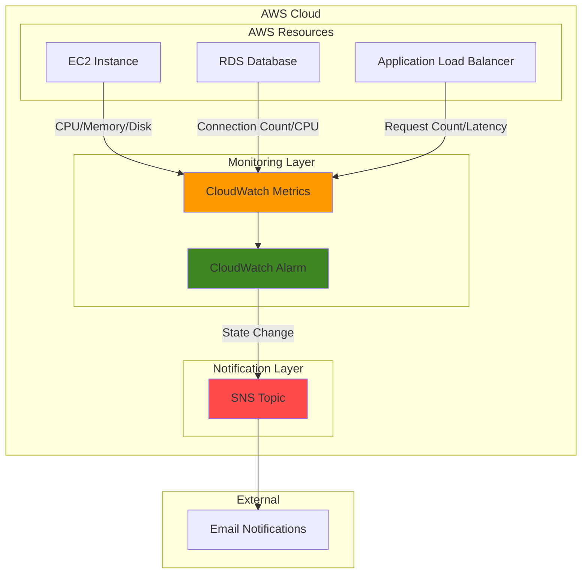

# Basic Monitoring with CloudWatch Alarms

## Problem

Organizations need visibility into their AWS resources to identify operational issues, but many struggle with setting up effective monitoring. Without proper monitoring, performance issues or resource constraints can go unnoticed until they cause service disruptions or affect user experience. Manual monitoring is time-consuming and unreliable, especially outside business hours. Small teams particularly need automated monitoring solutions that alert them when metrics exceed predefined thresholds, helping to maintain service reliability while minimizing operational overhead.

## Solution

This recipe demonstrates how to implement basic monitoring using Amazon CloudWatch and SNS to automatically track key metrics and receive notifications when thresholds are exceeded. CloudWatch continuously collects metrics from your AWS resources, while CloudWatch Alarms evaluate these metrics against thresholds you define. When an alarm state changes, Amazon SNS delivers notifications via email, allowing you to respond to issues quickly.

## Architecture Diagram



## Prerequisites

1. AWS account with CloudWatch and SNS permissions
2. AWS CLI v2 installed and configured (or AWS CloudShell)
3. Basic understanding of AWS metrics and monitoring concepts
4. An email address for receiving alarm notifications
5. Estimated cost: $0.10-$2.00 per month depending on alarm frequency and metrics monitored

> **Note**: CloudWatch alarms cost $0.10 per alarm per month. SNS email notifications are free for the first 1,000 emails per month, then $2.00 per 100,000 emails.

## Preparation

```bash
# Set environment variables
export AWS_REGION=$(aws configure get region)
export AWS_ACCOUNT_ID=$(aws sts get-caller-identity \
    --query Account --output text)

# Set your email address for notifications
export NOTIFICATION_EMAIL="your-email@example.com"

# Generate unique suffix for resource names
RANDOM_SUFFIX=$(aws secretsmanager get-random-password \
    --exclude-punctuation --exclude-uppercase \
    --password-length 6 --require-each-included-type \
    --output text --query RandomPassword)

export SNS_TOPIC_NAME="monitoring-alerts-${RANDOM_SUFFIX}"

echo "✅ Environment variables configured"
echo "Region: $AWS_REGION"
echo "Account ID: $AWS_ACCOUNT_ID"
echo "SNS Topic: $SNS_TOPIC_NAME"
```

## Steps

1. **Create SNS Topic for Alert Notifications**:

   Amazon SNS (Simple Notification Service) provides a reliable, scalable messaging service that delivers notifications to multiple endpoints simultaneously. Creating an SNS topic establishes the communication channel that CloudWatch Alarms will use to send alerts when metric thresholds are breached. This decouples the monitoring system from the notification delivery, allowing you to easily modify recipients without changing alarm configurations.

   ```bash
   # Create SNS topic for alarm notifications
   SNS_TOPIC_ARN=$(aws sns create-topic \
       --name $SNS_TOPIC_NAME \
       --query TopicArn --output text)
   
   echo "✅ SNS topic created: $SNS_TOPIC_ARN"
   ```

   The SNS topic is now available and ready to accept subscriptions. This foundational messaging infrastructure enables reliable delivery of alarm notifications to multiple channels as your monitoring needs grow.

2. **Subscribe Email Address to SNS Topic**:

   Email subscriptions provide immediate notification delivery to operations teams, ensuring critical alerts reach the right people quickly. SNS handles the complexity of email delivery, including retry logic and bounce handling, while maintaining high availability across AWS regions.

   ```bash
   # Subscribe email address to receive notifications
   aws sns subscribe \
       --topic-arn $SNS_TOPIC_ARN \
       --protocol email \
       --notification-endpoint $NOTIFICATION_EMAIL
   
   echo "✅ Email subscription created for $NOTIFICATION_EMAIL"
   echo "📧 Check your email and confirm the subscription"
   ```

   A confirmation email has been sent to your specified address. You must confirm this subscription before alarms can deliver notifications, ensuring only authorized recipients receive alerts.

3. **Create CloudWatch Alarm for High CPU Usage**:

   CloudWatch Alarms continuously evaluate metrics against defined thresholds, providing automated monitoring without manual intervention. CPU utilization monitoring is essential for identifying performance bottlenecks, capacity planning, and detecting abnormal workload patterns that could impact application performance or indicate security issues.

   ```bash
   # Create alarm for EC2 instance high CPU usage
   aws cloudwatch put-metric-alarm \
       --alarm-name "HighCPUUtilization-${RANDOM_SUFFIX}" \
       --alarm-description "Triggers when EC2 CPU exceeds 80%" \
       --metric-name CPUUtilization \
       --namespace AWS/EC2 \
       --statistic Average \
       --period 300 \
       --threshold 80 \
       --comparison-operator GreaterThanThreshold \
       --evaluation-periods 2 \
       --alarm-actions $SNS_TOPIC_ARN \
       --ok-actions $SNS_TOPIC_ARN \
       --treat-missing-data notBreaching
   
   echo "✅ High CPU alarm created successfully"
   ```

   This alarm monitors average CPU utilization across all EC2 instances in your account, triggering when usage exceeds 80% for two consecutive 5-minute periods. The configuration balances sensitivity with stability, reducing false alarms while ensuring genuine performance issues are detected promptly.

4. **Create CloudWatch Alarm for Application Load Balancer Response Time**:

   Application performance monitoring through response time metrics helps identify user experience degradation before it impacts business operations. Load balancer latency reflects the health of your entire application stack, including network performance, backend processing time, and resource availability.

   ```bash
   # Create alarm for ALB high response time
   aws cloudwatch put-metric-alarm \
       --alarm-name "HighResponseTime-${RANDOM_SUFFIX}" \
       --alarm-description "Triggers when ALB response time exceeds 1 second" \
       --metric-name TargetResponseTime \
       --namespace AWS/ApplicationELB \
       --statistic Average \
       --period 300 \
       --threshold 1.0 \
       --comparison-operator GreaterThanThreshold \
       --evaluation-periods 3 \
       --alarm-actions $SNS_TOPIC_ARN \
       --treat-missing-data notBreaching
   
   echo "✅ High response time alarm created successfully"
   ```

   This alarm detects when application response times exceed 1 second for three consecutive periods, indicating potential performance degradation that could affect user satisfaction and business metrics.

5. **Create CloudWatch Alarm for RDS Database Connections**:

   Database connection monitoring prevents connection pool exhaustion and identifies application scaling requirements. High connection counts often indicate inefficient connection management or unexpected traffic spikes that require immediate attention to maintain application availability.

   ```bash
   # Create alarm for RDS high connection count
   aws cloudwatch put-metric-alarm \
       --alarm-name "HighDBConnections-${RANDOM_SUFFIX}" \
       --alarm-description "Triggers when RDS connections exceed 80% of max" \
       --metric-name DatabaseConnections \
       --namespace AWS/RDS \
       --statistic Average \
       --period 300 \
       --threshold 80 \
       --comparison-operator GreaterThanThreshold \
       --evaluation-periods 2 \
       --alarm-actions $SNS_TOPIC_ARN \
       --treat-missing-data notBreaching
   
   echo "✅ High database connections alarm created successfully"
   ```

   This alarm monitors database connection utilization across all RDS instances, helping prevent connection exhaustion scenarios that could cause application failures or performance degradation.

> **Warning**: Ensure your email subscription is confirmed before testing alarms. Unconfirmed subscriptions will not receive notifications, potentially causing missed alerts for critical issues.

## Validation & Testing

1. **Verify SNS Topic and Subscription**:

   ```bash
   # List SNS topics to confirm creation
   aws sns list-topics --query "Topics[?contains(TopicArn, '$SNS_TOPIC_NAME')]"
   
   # Check subscription status
   aws sns list-subscriptions-by-topic \
       --topic-arn $SNS_TOPIC_ARN \
       --query "Subscriptions[0].SubscriptionArn"
   ```

   Expected output: Your email subscription should show a valid subscription ARN instead of "PendingConfirmation".

2. **Verify CloudWatch Alarms**:

   ```bash
   # List all created alarms
   aws cloudwatch describe-alarms \
       --alarm-name-prefix "High" \
       --query "MetricAlarms[].{Name:AlarmName,State:StateValue,Threshold:Threshold}"
   ```

   Expected output: All three alarms should appear with "OK" state and correct threshold values.

3. **Test Alarm Notification**:

   ```bash
   # Manually set alarm state to test notifications
   aws cloudwatch set-alarm-state \
       --alarm-name "HighCPUUtilization-${RANDOM_SUFFIX}" \
       --state-value ALARM \
       --state-reason "Testing alarm notification system"
   
   echo "✅ Test alarm triggered - check email for notification"
   
   # Reset alarm state
   sleep 30
   aws cloudwatch set-alarm-state \
       --alarm-name "HighCPUUtilization-${RANDOM_SUFFIX}" \
       --state-value OK \
       --state-reason "Test completed - resetting alarm"
   ```

   Expected result: You should receive two emails - one for the alarm state and one for the OK state.

## Cleanup

1. **Delete CloudWatch Alarms**:

   ```bash
   # Delete all created alarms
   aws cloudwatch delete-alarms \
       --alarm-names "HighCPUUtilization-${RANDOM_SUFFIX}" \
                     "HighResponseTime-${RANDOM_SUFFIX}" \
                     "HighDBConnections-${RANDOM_SUFFIX}"
   
   echo "✅ CloudWatch alarms deleted"
   ```

2. **Delete SNS Subscription and Topic**:

   ```bash
   # Get subscription ARN and delete subscription
   SUBSCRIPTION_ARN=$(aws sns list-subscriptions-by-topic \
       --topic-arn $SNS_TOPIC_ARN \
       --query "Subscriptions[0].SubscriptionArn" --output text)
   
   if [ "$SUBSCRIPTION_ARN" != "None" ] && [ "$SUBSCRIPTION_ARN" != "PendingConfirmation" ]; then
       aws sns unsubscribe --subscription-arn $SUBSCRIPTION_ARN
       echo "✅ Email subscription removed"
   fi
   
   # Delete SNS topic
   aws sns delete-topic --topic-arn $SNS_TOPIC_ARN
   echo "✅ SNS topic deleted"
   ```

3. **Clear Environment Variables**:

   ```bash
   # Clean up environment variables
   unset NOTIFICATION_EMAIL SNS_TOPIC_NAME SNS_TOPIC_ARN RANDOM_SUFFIX
   echo "✅ Environment variables cleared"
   ```

## Discussion

Amazon CloudWatch provides comprehensive monitoring capabilities that form the foundation of AWS operational excellence. The service automatically collects metrics from AWS resources every five minutes (or one minute with detailed monitoring), storing this data for up to 15 months. CloudWatch Alarms evaluate these metrics using statistical functions like Average, Sum, Maximum, and Minimum, enabling sophisticated threshold-based monitoring that adapts to your application's behavior patterns.

The integration between CloudWatch and SNS demonstrates AWS's event-driven architecture principles, where services communicate through loosely coupled messaging patterns. This design enables high availability and scalability - if SNS experiences issues, CloudWatch continues monitoring and queues notifications for delivery once service is restored. Additionally, SNS's fan-out capability allows a single alarm to trigger multiple notification channels simultaneously, supporting complex operational workflows. For detailed configuration options, refer to the [CloudWatch Alarms documentation](https://docs.aws.amazon.com/AmazonCloudWatch/latest/monitoring/AlarmThatSendsEmail.html) and [SNS email notifications guide](https://docs.aws.amazon.com/sns/latest/dg/sns-email-notifications.html).

Effective alarm configuration requires balancing sensitivity with operational burden. Too many alarms create "alert fatigue" where teams become desensitized to notifications, while too few alarms miss critical issues. Best practices include using multiple evaluation periods to reduce false positives, setting thresholds based on historical performance data, and implementing alarm hierarchies where lower-priority alarms escalate to higher-priority channels if not acknowledged. Consider implementing alarm suppression during planned maintenance windows and using CloudWatch Composite Alarms to create complex conditional logic that reduces noise while maintaining comprehensive coverage.

Cost optimization becomes important as monitoring scales across large AWS environments. CloudWatch charges $0.10 per alarm per month, so consider consolidating related metrics into composite alarms where appropriate. SNS email notifications are cost-effective for small teams but consider integrating with incident management platforms like PagerDuty or Opsgenie for enterprise operations. The [CloudWatch pricing documentation](https://aws.amazon.com/cloudwatch/pricing/) provides detailed cost calculations for different monitoring scenarios.

> **Tip**: Use CloudWatch Logs Insights to correlate alarm events with application logs, providing deeper context when investigating incidents. This integration helps identify root causes faster and improves mean time to resolution (MTTR).

## Challenge

Extend this solution by implementing these enhancements:

1. Install the CloudWatch agent on an EC2 instance to collect and monitor system-level metrics like memory usage, disk space, and specific log files.

2. Create a CloudWatch Logs metric filter to monitor application logs for error patterns, then set up an alarm based on the frequency of these errors.

3. Implement a CloudWatch dashboard that provides a unified view of all critical metrics across multiple services (EC2, RDS, Lambda, etc.).

4. Configure different notification channels for different types of alarms by creating multiple SNS topics with various subscribers (email, SMS, Slack via AWS Chatbot, etc.).

5. Create a Lambda function that gets triggered by an alarm and performs an automated remediation action, such as restarting a service or scaling up a resource.

## Infrastructure Code

*Infrastructure code will be generated after recipe approval.*