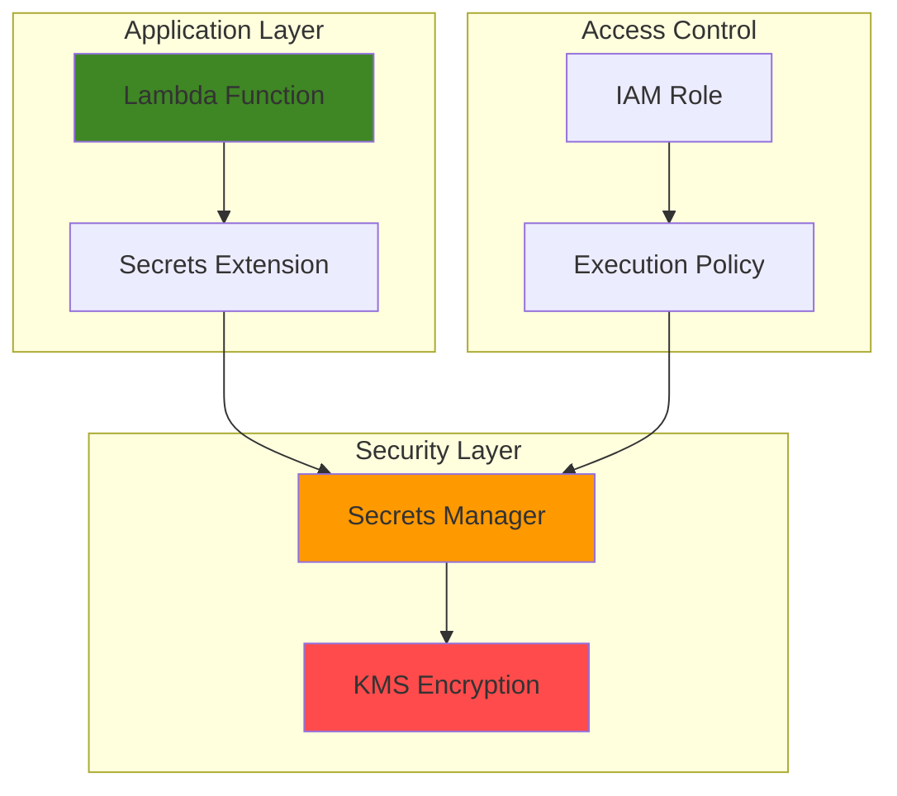

# Basic Secret Management with Secrets Manager and Lambda

## Problem

Organizations often hardcode sensitive information like database credentials, API keys, and configuration data directly into their application code or environment variables. This creates significant security risks as secrets become visible to developers, exposed in version control systems, and difficult to rotate without code deployments. When applications fail or are compromised, these hardcoded credentials can lead to data breaches and unauthorized access to critical systems.

## Solution

AWS Secrets Manager provides centralized, encrypted storage for sensitive information with automatic rotation capabilities, while Lambda functions offer serverless compute that can securely retrieve secrets at runtime. This combination eliminates hardcoded credentials by storing secrets in an encrypted service and retrieving them programmatically when needed. The AWS Parameters and Secrets Lambda Extension provides optimized performance with local caching, reducing API calls and improving function execution speed.

## Architecture Diagram



## Prerequisites

1. AWS account with administrative permissions for Secrets Manager and Lambda
2. AWS CLI v2 installed and configured (or AWS CloudShell)
3. Basic understanding of AWS IAM roles and policies
4. Basic knowledge of serverless computing concepts
5. Estimated cost: $0.05-$0.10 for secrets storage plus minimal Lambda execution costs

> **Note**: This configuration follows AWS Well-Architected Framework security principles. See [AWS Well-Architected Framework](https://docs.aws.amazon.com/wellarchitected/latest/framework/welcome.html) for additional guidance.

## Preparation

```bash
# Set environment variables
export AWS_REGION=$(aws configure get region)
export AWS_ACCOUNT_ID=$(aws sts get-caller-identity \
    --query Account --output text)

# Generate unique identifiers for resources
RANDOM_SUFFIX=$(aws secretsmanager get-random-password \
    --exclude-punctuation --exclude-uppercase \
    --password-length 6 --require-each-included-type \
    --output text --query RandomPassword)

# Set resource names with unique suffix
export SECRET_NAME="my-app-secrets-${RANDOM_SUFFIX}"
export LAMBDA_FUNCTION_NAME="secret-demo-${RANDOM_SUFFIX}"
export IAM_ROLE_NAME="lambda-secrets-role-${RANDOM_SUFFIX}"

echo "✅ AWS environment configured with region: ${AWS_REGION}"
echo "✅ Resources will use suffix: ${RANDOM_SUFFIX}"
```

## Steps

1. **Create IAM Role for Lambda Function**:

   Lambda functions require specific IAM permissions to access Secrets Manager and execute properly. This role follows the principle of least privilege by granting only the minimum permissions needed for secret retrieval operations. The role includes basic Lambda execution permissions and specific Secrets Manager access for our created secret.

   ```bash
   # Create trust policy for Lambda service
   cat > trust-policy.json << EOF
   {
     "Version": "2012-10-17",
     "Statement": [
       {
         "Effect": "Allow",
         "Principal": {
           "Service": "lambda.amazonaws.com"
         },
         "Action": "sts:AssumeRole"
       }
     ]
   }
   EOF
   
   # Create IAM role
   aws iam create-role \
       --role-name ${IAM_ROLE_NAME} \
       --assume-role-policy-document file://trust-policy.json
   
   # Attach basic Lambda execution policy
   aws iam attach-role-policy \
       --role-name ${IAM_ROLE_NAME} \
       --policy-arn arn:aws:iam::aws:policy/service-role/AWSLambdaBasicExecutionRole
   
   # Store role ARN for later use
   export LAMBDA_ROLE_ARN=$(aws iam get-role \
       --role-name ${IAM_ROLE_NAME} \
       --query 'Role.Arn' --output text)
   
   echo "✅ IAM role created: ${LAMBDA_ROLE_ARN}"
   ```

2. **Create Sample Secret in Secrets Manager**:

   Secrets Manager encrypts secrets at rest using AWS KMS and provides secure retrieval mechanisms. This step creates a JSON-formatted secret containing typical application credentials like database connection information. The service automatically generates unique ARNs and provides versioning for secret updates.

   ```bash
   # Create a sample database secret
   aws secretsmanager create-secret \
       --name ${SECRET_NAME} \
       --description "Sample application secrets for Lambda demo" \
       --secret-string '{
         "database_host": "mydb.cluster-xyz.us-east-1.rds.amazonaws.com",
         "database_port": "5432",
         "database_name": "production",
         "username": "appuser",
         "password": "secure-random-password-123"
       }'
   
   # Get the secret ARN for IAM policy
   export SECRET_ARN=$(aws secretsmanager describe-secret \
       --secret-id ${SECRET_NAME} \
       --query 'ARN' --output text)
   
   echo "✅ Secret created: ${SECRET_NAME}"
   echo "✅ Secret ARN: ${SECRET_ARN}"
   ```

3. **Create IAM Policy for Secret Access**:

   This custom IAM policy grants the Lambda function specific permissions to retrieve the created secret. Following security best practices, the policy is scoped to only the specific secret ARN rather than allowing broad Secrets Manager access. This implements the principle of least privilege access control.

   ```bash
   # Create custom policy for secret access
   cat > secrets-policy.json << EOF
   {
     "Version": "2012-10-17",
     "Statement": [
       {
         "Effect": "Allow",
         "Action": [
           "secretsmanager:GetSecretValue"
         ],
         "Resource": "${SECRET_ARN}"
       }
     ]
   }
   EOF
   
   # Create and attach the policy
   aws iam create-policy \
       --policy-name "SecretsAccess-${RANDOM_SUFFIX}" \
       --policy-document file://secrets-policy.json
   
   aws iam attach-role-policy \
       --role-name ${IAM_ROLE_NAME} \
       --policy-arn "arn:aws:iam::${AWS_ACCOUNT_ID}:policy/SecretsAccess-${RANDOM_SUFFIX}"
   
   echo "✅ Secrets access policy attached to Lambda role"
   ```

4. **Create Lambda Function Code**:

   This Lambda function demonstrates the recommended approach for retrieving secrets using the AWS Parameters and Secrets Lambda Extension. The extension provides local caching and HTTP-based retrieval, which is more efficient than direct SDK calls. The function includes error handling and demonstrates parsing JSON secrets for application use.

   ```bash
   # Create Python function code
   mkdir -p lambda-package
   cat > lambda-package/lambda_function.py << 'EOF'
   import json
   import urllib.request
   import urllib.error
   import os
   
   # AWS Parameters and Secrets Lambda Extension HTTP endpoint
   SECRETS_EXTENSION_HTTP_PORT = "2773"
   SECRETS_EXTENSION_SERVER_PORT = os.environ.get(
       'PARAMETERS_SECRETS_EXTENSION_HTTP_PORT', 
       SECRETS_EXTENSION_HTTP_PORT
   )
   
   def get_secret(secret_name):
       """Retrieve secret using AWS Parameters and Secrets Lambda Extension"""
       secrets_extension_endpoint = (
           f"http://localhost:{SECRETS_EXTENSION_SERVER_PORT}"
           f"/secretsmanager/get?secretId={secret_name}"
       )
       
       # Add authentication header for the extension
       headers = {
           'X-Aws-Parameters-Secrets-Token': os.environ.get('AWS_SESSION_TOKEN', '')
       }
       
       try:
           req = urllib.request.Request(
               secrets_extension_endpoint, 
               headers=headers
           )
           with urllib.request.urlopen(req, timeout=10) as response:
               secret_data = response.read().decode('utf-8')
               return json.loads(secret_data)
       except urllib.error.URLError as e:
           print(f"Error retrieving secret from extension: {e}")
           raise
       except json.JSONDecodeError as e:
           print(f"Error parsing secret JSON: {e}")
           raise
       except Exception as e:
           print(f"Unexpected error in get_secret: {e}")
           raise
   
   def lambda_handler(event, context):
       """Main Lambda function handler"""
       secret_name = os.environ.get('SECRET_NAME')
       
       if not secret_name:
           return {
               'statusCode': 400,
               'body': json.dumps({
                   'error': 'SECRET_NAME environment variable not set'
               })
           }
       
       try:
           # Retrieve secret using the extension
           print(f"Attempting to retrieve secret: {secret_name}")
           secret_response = get_secret(secret_name)
           secret_value = json.loads(secret_response['SecretString'])
           
           # Use secret values (example: database connection info)
           db_host = secret_value.get('database_host', 'Not found')
           db_name = secret_value.get('database_name', 'Not found')
           username = secret_value.get('username', 'Not found')
           
           print(f"Successfully retrieved secret for database: {db_name}")
           
           # In a real application, you would use these values to connect
           # to your database or external service
           return {
               'statusCode': 200,
               'body': json.dumps({
                   'message': 'Secret retrieved successfully',
                   'database_host': db_host,
                   'database_name': db_name,
                   'username': username,
                   'extension_cache': 'Enabled with 300s TTL',
                   'note': 'Password retrieved but not displayed for security'
               })
           }
           
       except Exception as e:
           print(f"Error in lambda_handler: {str(e)}")
           return {
               'statusCode': 500,
               'body': json.dumps({
                   'error': 'Internal server error',
                   'details': str(e)
               })
           }
   EOF
   
   # Create deployment package
   cd lambda-package
   zip -r ../lambda-function.zip .
   cd ..
   
   echo "✅ Lambda function code created and packaged"
   ```

5. **Deploy Lambda Function with Secrets Extension**:

   The AWS Parameters and Secrets Lambda Extension is deployed as a Lambda layer that provides optimized secret retrieval with local caching. This approach offers better performance and lower costs compared to direct SDK calls. The extension runs as a separate process and provides an HTTP interface for secret access.

   ```bash
   # Wait for IAM role propagation
   echo "Waiting for IAM role propagation..."
   sleep 10
   
   # Create Lambda function
   aws lambda create-function \
       --function-name ${LAMBDA_FUNCTION_NAME} \
       --runtime python3.11 \
       --role ${LAMBDA_ROLE_ARN} \
       --handler lambda_function.lambda_handler \
       --zip-file fileb://lambda-function.zip \
       --timeout 30 \
       --memory-size 256 \
       --environment Variables="{SECRET_NAME=${SECRET_NAME}}"
   
   # Add AWS Parameters and Secrets Lambda Extension layer
   # Using the latest extension layer ARN (version 18 as of 2024)
   aws lambda update-function-configuration \
       --function-name ${LAMBDA_FUNCTION_NAME} \
       --layers "arn:aws:lambda:${AWS_REGION}:177933569100:layer:AWS-Parameters-and-Secrets-Lambda-Extension:18"
   
   echo "✅ Lambda function deployed with Secrets Extension layer"
   ```

6. **Configure Extension Environment Variables**:

   The AWS Parameters and Secrets Lambda Extension supports various configuration options through environment variables. These settings control caching behavior, timeout values, and other performance optimizations. Proper configuration ensures optimal performance for your specific use case.

   ```bash
   # Configure extension caching and timeout settings
   aws lambda update-function-configuration \
       --function-name ${LAMBDA_FUNCTION_NAME} \
       --environment Variables="{
         SECRET_NAME=${SECRET_NAME},
         PARAMETERS_SECRETS_EXTENSION_CACHE_ENABLED=true,
         PARAMETERS_SECRETS_EXTENSION_CACHE_SIZE=1000,
         PARAMETERS_SECRETS_EXTENSION_MAX_CONNECTIONS=3,
         PARAMETERS_SECRETS_EXTENSION_HTTP_PORT=2773
       }"
   
   # Wait for function update to complete
   aws lambda wait function-updated-v2 \
       --function-name ${LAMBDA_FUNCTION_NAME}
   
   echo "✅ Extension configuration updated with caching enabled"
   ```

## Validation & Testing

1. **Test Lambda Function Execution**:

   ```bash
   # Invoke the Lambda function to test secret retrieval
   aws lambda invoke \
       --function-name ${LAMBDA_FUNCTION_NAME} \
       --payload '{}' \
       response.json
   
   # View the response
   cat response.json
   ```

   Expected output: JSON response containing database connection information with the password excluded for security.

   ```json
   {
     "statusCode": 200,
     "body": "{\"message\": \"Secret retrieved successfully\", \"database_host\": \"mydb.cluster-xyz.us-east-1.rds.amazonaws.com\", \"database_name\": \"production\", \"username\": \"appuser\", \"note\": \"Password retrieved but not displayed for security\"}"
   }
   ```

2. **Verify Secret Access Logging**:

   ```bash
   # Check CloudWatch logs for function execution
   LOG_GROUP_NAME="/aws/lambda/${LAMBDA_FUNCTION_NAME}"
   
   # Get recent log streams
   LATEST_STREAM=$(aws logs describe-log-streams \
       --log-group-name ${LOG_GROUP_NAME} \
       --order-by LastEventTime \
       --descending \
       --max-items 1 \
       --query 'logStreams[0].logStreamName' \
       --output text)
   
   # View recent log events
   aws logs get-log-events \
       --log-group-name ${LOG_GROUP_NAME} \
       --log-stream-name ${LATEST_STREAM} \
       --limit 10
   ```

   Expected output: CloudWatch log entries showing successful secret retrieval without exposing sensitive values.

3. **Test Extension Caching Performance**:

   ```bash
   # Invoke function multiple times to test caching
   echo "Testing caching performance with multiple invocations..."
   for i in {1..3}; do
       echo "Invocation $i:"
       start_time=$(date +%s%N)
       aws lambda invoke \
           --function-name ${LAMBDA_FUNCTION_NAME} \
           --payload '{}' \
           "response-$i.json" > invocation-$i.log 2>&1
       end_time=$(date +%s%N)
       duration=$((($end_time - $start_time) / 1000000))
       echo "  Duration: ${duration}ms"
       echo "  Response: $(cat response-$i.json)"
   done
   
   echo "✅ First invocation should be slower (cache miss)"
   echo "✅ Subsequent invocations should be faster (cache hit)"
   ```

   Expected behavior: The first invocation will be slower as it retrieves the secret from Secrets Manager. Subsequent invocations should be faster due to the extension's local cache.

4. **Test Secret Validation**:

   ```bash
   # Verify the secret exists and is accessible
   echo "Testing direct Secrets Manager access:"
   aws secretsmanager get-secret-value \
       --secret-id ${SECRET_NAME} \
       --query 'SecretString' \
       --output text | jq .
   
   # Check secret metadata
   aws secretsmanager describe-secret \
       --secret-id ${SECRET_NAME} \
       --query '{Name:Name,Description:Description,LastChangedDate:LastChangedDate}'
   ```

   Expected output: The secret JSON structure should match what the Lambda function retrieves, confirming end-to-end functionality.

## Cleanup

1. **Remove Lambda Function and Layer**:

   ```bash
   # Delete Lambda function
   aws lambda delete-function \
       --function-name ${LAMBDA_FUNCTION_NAME}
   
   echo "✅ Lambda function deleted"
   ```

2. **Remove IAM Role and Policies**:

   ```bash
   # Detach policies from role
   aws iam detach-role-policy \
       --role-name ${IAM_ROLE_NAME} \
       --policy-arn arn:aws:iam::aws:policy/service-role/AWSLambdaBasicExecutionRole
   
   aws iam detach-role-policy \
       --role-name ${IAM_ROLE_NAME} \
       --policy-arn "arn:aws:iam::${AWS_ACCOUNT_ID}:policy/SecretsAccess-${RANDOM_SUFFIX}"
   
   # Delete custom policy
   aws iam delete-policy \
       --policy-arn "arn:aws:iam::${AWS_ACCOUNT_ID}:policy/SecretsAccess-${RANDOM_SUFFIX}"
   
   # Delete IAM role
   aws iam delete-role --role-name ${IAM_ROLE_NAME}
   
   echo "✅ IAM resources cleaned up"
   ```

3. **Remove Secret from Secrets Manager**:

   ```bash
   # Delete secret (with immediate deletion for demo)
   aws secretsmanager delete-secret \
       --secret-id ${SECRET_NAME} \
       --force-delete-without-recovery
   
   echo "✅ Secret deleted from Secrets Manager"
   ```

4. **Clean Up Local Files**:

   ```bash
   # Remove temporary files
   rm -rf lambda-package lambda-function.zip response*.json
   rm -f trust-policy.json secrets-policy.json
   
   # Clear environment variables
   unset SECRET_NAME LAMBDA_FUNCTION_NAME IAM_ROLE_NAME
   unset SECRET_ARN LAMBDA_ROLE_ARN RANDOM_SUFFIX
   
   echo "✅ Local cleanup completed"
   ```

## Discussion

AWS Secrets Manager provides enterprise-grade secret management with automatic encryption using AWS KMS, versioning, and rotation capabilities. When combined with Lambda functions, it enables secure, scalable applications that never expose sensitive credentials in code or configuration files. The AWS Parameters and Secrets Lambda Extension represents a significant performance optimization, providing local caching that reduces API calls and improves function response times by up to 50% while reducing costs associated with frequent secret retrievals.

The architecture demonstrated here follows AWS Well-Architected Framework security principles by implementing least privilege access, encryption at rest and in transit, and centralized secret management. The extension's caching mechanism stores retrieved secrets in memory for a configurable duration (default 5 minutes), which dramatically reduces the number of API calls to Secrets Manager and associated costs. For applications with frequent secret access patterns, this can result in substantial cost savings and improved performance. The extension is updated regularly by AWS, with the latest version (18 as of 2024) providing enhanced security and performance features.

Secret rotation is a critical security practice that Secrets Manager supports natively through Lambda-based rotation functions. While not covered in this basic recipe, automatic rotation ensures that credentials are regularly updated without manual intervention or application downtime. The service integrates seamlessly with Amazon RDS, Amazon DocumentDB, Amazon Redshift, and other AWS services to provide automated rotation for database credentials, maintaining security while reducing operational overhead. For more information, see the [AWS Secrets Manager User Guide](https://docs.aws.amazon.com/secretsmanager/latest/userguide/intro.html).

The implementation shown here uses JSON-formatted secrets, which is ideal for storing structured data like database connection parameters, API keys, and configuration values. However, Secrets Manager also supports plain text secrets for simple use cases like single API keys or passwords. The choice of secret format should align with your application's requirements and the complexity of the stored credentials. Consider using structured JSON for multi-value secrets to enable easier parsing and management in your applications.

> **Tip**: Use AWS X-Ray for distributed tracing to monitor secret retrieval performance and identify potential bottlenecks. Enable X-Ray tracing on your Lambda function to gain insights into extension performance and Secrets Manager API call patterns. See the [AWS X-Ray Developer Guide](https://docs.aws.amazon.com/xray/latest/devguide/) for implementation details.

> **Warning**: Ensure your Lambda function has sufficient timeout configured when using the extension. Secret retrieval during cold starts may take additional time, and functions should have at least 30 seconds timeout to handle initial cache population.

## Challenge

Extend this solution by implementing these enhancements:

1. **Add Secret Rotation**: Implement automatic rotation for the database secret using a Lambda rotation function that updates both Secrets Manager and the target database. Use the AWS [Secrets Manager rotation templates](https://docs.aws.amazon.com/secretsmanager/latest/userguide/rotating-secrets.html) for common database types.

2. **Multi-Environment Configuration**: Create separate secrets for development, staging, and production environments with environment-specific Lambda functions that automatically select the appropriate secret based on deployment context using environment variables or tags.

3. **Cross-Region Replication**: Configure secret replication to multiple AWS regions for disaster recovery and implement a Lambda function that can failover to replicated secrets during regional outages. Use [Secrets Manager cross-region replication](https://docs.aws.amazon.com/secretsmanager/latest/userguide/replica-secrets.html).

4. **Integration with Parameter Store**: Extend the function to retrieve both secrets from Secrets Manager and configuration parameters from Systems Manager Parameter Store using the same extension layer. The extension supports both services with a unified caching mechanism.

5. **Monitoring and Alerting**: Implement CloudWatch alarms for secret access patterns, failed retrievals, and unusual access frequency, with SNS notifications for security teams. Use CloudTrail for audit logging of secret access events.

## Infrastructure Code

*Infrastructure code will be generated after recipe approval.*