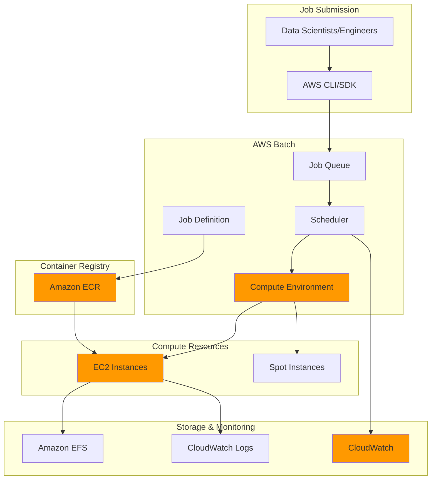

# Batch Processing Workloads with AWS Batch

## Problem

Financial services companies and research institutions need to process large volumes of data in batch jobs that can take hours or days to complete. Traditional approaches require managing infrastructure, scheduling jobs manually, and handling scaling issues when workloads fluctuate. Organizations struggle with optimizing costs while ensuring reliable execution of compute-intensive tasks like financial modeling, risk calculations, and scientific simulations.

## Solution

AWS Batch provides a fully managed batch computing service that automatically provisions compute resources, manages job queues, and schedules jobs based on priority and resource requirements. This solution leverages managed compute environments with EC2 instances, container-based job definitions, and intelligent scaling to handle variable workloads cost-effectively while ensuring high availability.

## Architecture Diagram



## Prerequisites

1. AWS account with appropriate permissions for AWS Batch, EC2, ECR, and CloudWatch
2. AWS CLI v2 installed and configured (or AWS CloudShell)
3. Docker installed for container image creation
4. Basic knowledge of containerization and batch processing concepts
5. Estimated cost: $5-15 for compute resources during this tutorial

> **Note**: This tutorial uses EC2 instances and may incur charges. Clean up resources when finished to avoid ongoing costs.

## Preparation

```bash
# Set environment variables
export AWS_REGION=$(aws configure get region)
export AWS_ACCOUNT_ID=$(aws sts get-caller-identity \
    --query Account --output text)

# Generate unique identifiers for resources
RANDOM_SUFFIX=$(aws secretsmanager get-random-password \
    --exclude-punctuation --exclude-uppercase \
    --password-length 6 --require-each-included-type \
    --output text --query RandomPassword)

export BATCH_COMPUTE_ENV_NAME="batch-compute-env-${RANDOM_SUFFIX}"
export BATCH_JOB_QUEUE_NAME="batch-job-queue-${RANDOM_SUFFIX}"
export BATCH_JOB_DEFINITION_NAME="batch-job-def-${RANDOM_SUFFIX}"
export ECR_REPO_NAME="batch-processing-${RANDOM_SUFFIX}"
export BATCH_SERVICE_ROLE_NAME="AWSBatchServiceRole-${RANDOM_SUFFIX}"
export BATCH_INSTANCE_PROFILE_NAME="ecsInstanceProfile-${RANDOM_SUFFIX}"
export BATCH_INSTANCE_ROLE_NAME="ecsInstanceRole-${RANDOM_SUFFIX}"

# Create IAM service role for AWS Batch
aws iam create-role \
    --role-name ${BATCH_SERVICE_ROLE_NAME} \
    --assume-role-policy-document '{
        "Version": "2012-10-17",
        "Statement": [
            {
                "Effect": "Allow",
                "Principal": {
                    "Service": "batch.amazonaws.com"
                },
                "Action": "sts:AssumeRole"
            }
        ]
    }'

# Attach the AWS managed policy for Batch service
aws iam attach-role-policy \
    --role-name ${BATCH_SERVICE_ROLE_NAME} \
    --policy-arn arn:aws:iam::aws:policy/service-role/AWSBatchServiceRole

# Create IAM role for ECS instance profile
aws iam create-role \
    --role-name ${BATCH_INSTANCE_ROLE_NAME} \
    --assume-role-policy-document '{
        "Version": "2012-10-17",
        "Statement": [
            {
                "Effect": "Allow",
                "Principal": {
                    "Service": "ec2.amazonaws.com"
                },
                "Action": "sts:AssumeRole"
            }
        ]
    }'

# Attach the AWS managed policy for ECS instance
aws iam attach-role-policy \
    --role-name ${BATCH_INSTANCE_ROLE_NAME} \
    --policy-arn arn:aws:iam::aws:policy/service-role/AmazonEC2ContainerServiceforEC2Role

# Create instance profile and add role
aws iam create-instance-profile \
    --instance-profile-name ${BATCH_INSTANCE_PROFILE_NAME}

aws iam add-role-to-instance-profile \
    --instance-profile-name ${BATCH_INSTANCE_PROFILE_NAME} \
    --role-name ${BATCH_INSTANCE_ROLE_NAME}

# Get default VPC and subnet information
export VPC_ID=$(aws ec2 describe-vpcs \
    --filters "Name=isDefault,Values=true" \
    --query 'Vpcs[0].VpcId' --output text)

export SUBNET_IDS=$(aws ec2 describe-subnets \
    --filters "Name=vpc-id,Values=${VPC_ID}" \
    --query 'Subnets[*].SubnetId' --output text | tr '\t' ',')

# Create security group for Batch compute environment
export SECURITY_GROUP_ID=$(aws ec2 create-security-group \
    --group-name batch-sg-${RANDOM_SUFFIX} \
    --description "Security group for AWS Batch compute environment" \
    --vpc-id ${VPC_ID} \
    --query 'GroupId' --output text)

echo "✅ Environment setup complete with VPC: ${VPC_ID}"
echo "✅ Security group created: ${SECURITY_GROUP_ID}"
```

## Steps

1. **Create ECR Repository and Push Container Image**:

   Amazon ECR provides a fully managed Docker container registry that integrates seamlessly with AWS Batch. Container images serve as the foundation for batch processing workloads, encapsulating application code, dependencies, and runtime environments. ECR's security features, including vulnerability scanning and image encryption, ensure that containerized batch jobs meet enterprise security standards while providing reliable artifact storage for production workloads.

   ```bash
   # Create ECR repository for storing container images
   aws ecr create-repository \
       --repository-name ${ECR_REPO_NAME} \
       --image-scanning-configuration scanOnPush=true
   
   # Get ECR login token
   aws ecr get-login-password --region ${AWS_REGION} | \
       docker login --username AWS \
       --password-stdin ${AWS_ACCOUNT_ID}.dkr.ecr.${AWS_REGION}.amazonaws.com
   
   # Create a sample batch processing application
   cat > Dockerfile << 'EOF'
FROM python:3.9-slim

WORKDIR /app

# Install required packages
RUN pip install numpy pandas boto3

# Copy processing script
COPY batch_processor.py .

# Run the batch processing script
CMD ["python", "batch_processor.py"]
EOF

   # Create sample batch processing script
   cat > batch_processor.py << 'EOF'
#!/usr/bin/env python3
import os
import time
import random
import numpy as np
import pandas as pd
from datetime import datetime

def main():
    # Get job parameters from environment variables
    job_id = os.environ.get('AWS_BATCH_JOB_ID', 'local-test')
    job_name = os.environ.get('AWS_BATCH_JOB_NAME', 'batch-job')
    
    print(f"Starting batch job: {job_name} (ID: {job_id})")
    print(f"Timestamp: {datetime.now()}")
    
    # Simulate data processing workload
    print("Generating sample data...")
    data_size = int(os.environ.get('DATA_SIZE', '1000'))
    data = np.random.randn(data_size, 5)
    df = pd.DataFrame(data, columns=['A', 'B', 'C', 'D', 'E'])
    
    # Simulate processing time
    processing_time = int(os.environ.get('PROCESSING_TIME', '60'))
    print(f"Processing {data_size} records for {processing_time} seconds...")
    
    # Perform some calculations
    results = []
    for i in range(processing_time):
        # Simulate complex calculations
        result = df.mean().sum() + random.random()
        results.append(result)
        time.sleep(1)
        
        if i % 10 == 0:
            print(f"Progress: {i+1}/{processing_time} seconds")
    
    # Output results
    final_result = sum(results) / len(results)
    print(f"Processing complete! Final result: {final_result:.6f}")
    print(f"Job {job_name} finished successfully at {datetime.now()}")

if __name__ == "__main__":
    main()
EOF

   # Build and tag the Docker image
   docker build -t ${ECR_REPO_NAME} .
   
   # Tag image for ECR
   docker tag ${ECR_REPO_NAME}:latest \
       ${AWS_ACCOUNT_ID}.dkr.ecr.${AWS_REGION}.amazonaws.com/${ECR_REPO_NAME}:latest
   
   # Push image to ECR
   docker push ${AWS_ACCOUNT_ID}.dkr.ecr.${AWS_REGION}.amazonaws.com/${ECR_REPO_NAME}:latest
   
   export CONTAINER_IMAGE_URI="${AWS_ACCOUNT_ID}.dkr.ecr.${AWS_REGION}.amazonaws.com/${ECR_REPO_NAME}:latest"
   
   echo "✅ Container image pushed to ECR: ${CONTAINER_IMAGE_URI}"
   ```

   The container image is now stored in ECR and ready for use by AWS Batch jobs. The automated vulnerability scanning helps maintain security compliance by identifying potential vulnerabilities before deployment. This containerized approach enables consistent execution environments across different compute resources and simplifies application deployment and scaling.

   > **Note**: ECR provides secure, scalable, and reliable container registry. The scanOnPush feature automatically scans images for vulnerabilities using Amazon Inspector, helping maintain security in your batch processing workloads. Learn more about [ECR vulnerability scanning](https://docs.aws.amazon.com/AmazonECR/latest/userguide/image-scanning.html).

2. **Create AWS Batch Compute Environment**:

   The compute environment defines the infrastructure resources that AWS Batch uses to run jobs. Managed compute environments automatically handle provisioning, scaling, and termination of compute resources based on job demand. This configuration includes a mix of On-Demand and Spot instances (50% Spot) to optimize costs while maintaining availability. The "optimal" instance types setting allows AWS Batch to select the most cost-effective instance types for your workloads automatically.

   ```bash
   # Wait for instance profile to be available
   echo "Waiting for instance profile to be available..."
   sleep 30
   
   # Create managed compute environment using JSON input
   cat > compute-environment.json << EOF
{
    "computeEnvironmentName": "${BATCH_COMPUTE_ENV_NAME}",
    "type": "MANAGED",
    "state": "ENABLED",
    "serviceRole": "arn:aws:iam::${AWS_ACCOUNT_ID}:role/${BATCH_SERVICE_ROLE_NAME}",
    "computeResources": {
        "type": "EC2",
        "minvCpus": 0,
        "maxvCpus": 100,
        "desiredvCpus": 0,
        "instanceTypes": ["optimal"],
        "subnets": ["${SUBNET_IDS//,/\",\"}"],
        "securityGroupIds": ["${SECURITY_GROUP_ID}"],
        "instanceRole": "arn:aws:iam::${AWS_ACCOUNT_ID}:instance-profile/${BATCH_INSTANCE_PROFILE_NAME}",
        "bidPercentage": 50,
        "ec2Configuration": [
            {
                "imageType": "ECS_AL2"
            }
        ]
    }
}
EOF

   # Create compute environment
   aws batch create-compute-environment \
       --cli-input-json file://compute-environment.json
   
   # Monitor status until VALID
   echo "Waiting for compute environment to be ready..."
   while true; do
       STATUS=$(aws batch describe-compute-environments \
           --compute-environments ${BATCH_COMPUTE_ENV_NAME} \
           --query 'computeEnvironments[0].status' --output text)
       
       if [ "$STATUS" = "VALID" ]; then
           echo "✅ Compute environment is ready: ${BATCH_COMPUTE_ENV_NAME}"
           break
       elif [ "$STATUS" = "INVALID" ]; then
           echo "❌ Compute environment creation failed"
           exit 1
       else
           echo "Compute environment status: $STATUS (waiting...)"
           sleep 30
       fi
   done
   ```

   The compute environment is now active and ready to receive job submissions. AWS Batch will automatically scale the infrastructure from 0 to 100 vCPUs based on job demand, creating EC2 instances as needed and terminating them when idle. This elastic scaling ensures optimal resource utilization while minimizing costs. The managed nature of this environment means AWS handles all infrastructure lifecycle management, including patching and updates.

3. **Create Job Queue**:

   Job queues provide the logical interface between job submissions and compute environments. They enable prioritization of workloads and can be associated with multiple compute environments for high availability and load distribution. The priority setting determines which jobs get scheduled first when multiple queues compete for resources. This abstraction layer allows for sophisticated workload management strategies in production environments.

   ```bash
   # Create job queue
   aws batch create-job-queue \
       --job-queue-name ${BATCH_JOB_QUEUE_NAME} \
       --state ENABLED \
       --priority 1 \
       --compute-environment-order order=1,computeEnvironment=${BATCH_COMPUTE_ENV_NAME}
   
   # Wait for job queue to be ready
   echo "Waiting for job queue to be ready..."
   while true; do
       STATUS=$(aws batch describe-job-queues \
           --job-queues ${BATCH_JOB_QUEUE_NAME} \
           --query 'jobQueues[0].status' --output text)
       
       if [ "$STATUS" = "VALID" ]; then
           echo "✅ Job queue is ready: ${BATCH_JOB_QUEUE_NAME}"
           break
       elif [ "$STATUS" = "INVALID" ]; then
           echo "❌ Job queue creation failed"
           exit 1
       else
           echo "Job queue status: $STATUS (waiting...)"
           sleep 15
       fi
   done
   ```

   The job queue is now active and ready to accept job submissions. This queue will route jobs to the associated compute environment where the AWS Batch scheduler will place them on available instances. The queue provides a buffer between job submission and execution, enabling efficient resource utilization and workload management across varying demand patterns.

4. **Create Job Definition**:

   Job definitions serve as blueprints that specify how containers should run in AWS Batch. They define resource requirements (CPU, memory), container images, environment variables, and logging configurations. This declarative approach ensures consistent job execution while enabling parameterization for different workload scenarios. The timeout setting provides protection against runaway jobs that could consume resources indefinitely.

   ```bash
   # Create log group first (required for job definition)
   aws logs create-log-group \
       --log-group-name /aws/batch/job \
       --retention-in-days 30
   
   # Create job definition
   aws batch register-job-definition \
       --job-definition-name ${BATCH_JOB_DEFINITION_NAME} \
       --type container \
       --container-properties '{
           "image": "'${CONTAINER_IMAGE_URI}'",
           "vcpus": 1,
           "memory": 512,
           "environment": [
               {"name": "DATA_SIZE", "value": "5000"},
               {"name": "PROCESSING_TIME", "value": "120"}
           ],
           "logConfiguration": {
               "logDriver": "awslogs",
               "options": {
                   "awslogs-group": "/aws/batch/job",
                   "awslogs-region": "'${AWS_REGION}'"
               }
           }
       }' \
       --timeout attemptDurationSeconds=3600
   
   # Get job definition ARN
   export JOB_DEFINITION_ARN=$(aws batch describe-job-definitions \
       --job-definition-name ${BATCH_JOB_DEFINITION_NAME} \
       --status ACTIVE \
       --query 'jobDefinitions[0].jobDefinitionArn' --output text)
   
   echo "✅ Job definition created: ${JOB_DEFINITION_ARN}"
   ```

   The job definition is now registered and can be referenced by job submissions. This reusable template ensures consistent execution environments while allowing runtime parameterization through environment variables. The integrated CloudWatch Logs configuration provides centralized logging for debugging and monitoring purposes, essential for production batch processing workloads.

5. **Submit and Monitor Batch Jobs**:

   Job submission represents the culmination of the batch processing infrastructure setup. AWS Batch accepts job submissions and places them in the queue for scheduling based on resource availability and priority. The parameterization capability allows the same job definition to process different workloads by passing runtime configuration through environment variables. This flexibility enables efficient resource utilization across diverse processing requirements.

   ```bash
   # Submit first batch job
   JOB_ID_1=$(aws batch submit-job \
       --job-name "data-processing-job-1" \
       --job-queue ${BATCH_JOB_QUEUE_NAME} \
       --job-definition ${BATCH_JOB_DEFINITION_NAME} \
       --parameters DATA_SIZE=1000,PROCESSING_TIME=60 \
       --query 'jobId' --output text)
   
   # Submit second batch job with different parameters
   JOB_ID_2=$(aws batch submit-job \
       --job-name "data-processing-job-2" \
       --job-queue ${BATCH_JOB_QUEUE_NAME} \
       --job-definition ${BATCH_JOB_DEFINITION_NAME} \
       --parameters DATA_SIZE=2000,PROCESSING_TIME=90 \
       --query 'jobId' --output text)
   
   echo "✅ Batch jobs submitted:"
   echo "Job 1 ID: ${JOB_ID_1}"
   echo "Job 2 ID: ${JOB_ID_2}"
   
   # Monitor job status
   echo "Monitoring job status..."
   for JOB_ID in ${JOB_ID_1} ${JOB_ID_2}; do
       echo "Job ${JOB_ID} status:"
       aws batch describe-jobs --jobs ${JOB_ID} \
           --query 'jobs[0].{Name:jobName,Status:status,CreatedAt:createdAt}' \
           --output table
   done
   ```

   The jobs are now submitted and will progress through various states: SUBMITTED, PENDING, RUNNABLE, STARTING, RUNNING, and finally SUCCEEDED or FAILED. AWS Batch automatically provisions compute resources as needed, ensuring jobs execute efficiently while optimizing costs through intelligent instance selection and scaling.

6. **Create Job Array for Parallel Processing**:

   Array jobs enable massively parallel processing by automatically creating multiple job instances from a single submission. Each array index runs independently with access to the AWS_BATCH_JOB_ARRAY_INDEX environment variable, allowing tasks to process different data partitions concurrently. This pattern is ideal for embarrassingly parallel workloads such as financial simulations, scientific computing, and large-scale data processing where tasks don't depend on each other.

   ```bash
   # Submit array job for parallel processing
   ARRAY_JOB_ID=$(aws batch submit-job \
       --job-name "parallel-data-processing" \
       --job-queue ${BATCH_JOB_QUEUE_NAME} \
       --job-definition ${BATCH_JOB_DEFINITION_NAME} \
       --array-properties size=5 \
       --parameters DATA_SIZE=500,PROCESSING_TIME=30 \
       --query 'jobId' --output text)
   
   echo "✅ Array job submitted: ${ARRAY_JOB_ID}"
   echo "This will create 5 parallel jobs for concurrent processing"
   ```

   The array job creates 5 independent parallel executions, dramatically reducing overall processing time through horizontal scaling. Each job instance can access its unique index through environment variables, enabling data partitioning and parallel processing strategies. This approach maximizes resource utilization and throughput for suitable workloads.

   > **Warning**: Array jobs are ideal for embarrassingly parallel workloads where tasks can run independently. Be mindful of resource limits and costs when submitting large array jobs, as each array index consumes compute resources. Monitor job queue utilization to ensure optimal resource allocation.

7. **Set up Job Monitoring and Alerts**:

   Comprehensive monitoring ensures operational excellence for production batch processing workloads. CloudWatch alarms provide proactive notification of failures and resource constraints, enabling rapid response to issues. The AWS/Batch namespace provides metrics for job success rates, queue depth, and resource utilization. Integrating these alarms with Amazon SNS enables automated notifications to operations teams and can trigger automated remediation workflows.

   ```bash
   # Create CloudWatch alarm for failed jobs
   aws cloudwatch put-metric-alarm \
       --alarm-name "BatchJobFailures-${RANDOM_SUFFIX}" \
       --alarm-description "Alert when batch jobs fail" \
       --metric-name FailedJobs \
       --namespace AWS/Batch \
       --statistic Sum \
       --period 300 \
       --threshold 1 \
       --comparison-operator GreaterThanOrEqualToThreshold \
       --evaluation-periods 1 \
       --dimensions Name=JobQueue,Value=${BATCH_JOB_QUEUE_NAME}
   
   # Create alarm for queue depth monitoring
   aws cloudwatch put-metric-alarm \
       --alarm-name "BatchQueueDepth-${RANDOM_SUFFIX}" \
       --alarm-description "Alert when job queue has many pending jobs" \
       --metric-name SubmittedJobs \
       --namespace AWS/Batch \
       --statistic Average \
       --period 300 \
       --threshold 10 \
       --comparison-operator GreaterThanThreshold \
       --evaluation-periods 2 \
       --dimensions Name=JobQueue,Value=${BATCH_JOB_QUEUE_NAME}
   
   echo "✅ CloudWatch alarms created for monitoring"
   ```

   The monitoring infrastructure is now in place to provide operational visibility and alerting. These alarms help maintain system reliability by detecting failures and capacity issues before they impact business operations. For production deployments, consider implementing additional metrics and creating dashboards for comprehensive observability.

## Validation & Testing

1. **Verify Compute Environment Status**:

   ```bash
   # Check compute environment details
   aws batch describe-compute-environments \
       --compute-environments ${BATCH_COMPUTE_ENV_NAME} \
       --query 'computeEnvironments[0].{Name:computeEnvironmentName,Status:status,State:state,Type:type}' \
       --output table
   ```

   Expected output: Status should be "VALID" and State should be "ENABLED"

2. **Monitor Job Execution**:

   ```bash
   # Check job statuses
   aws batch list-jobs \
       --job-queue ${BATCH_JOB_QUEUE_NAME} \
       --query 'jobSummaryList[*].{JobId:jobId,Name:jobName,Status:status,CreatedAt:createdAt}' \
       --output table
   
   # Get detailed job information
   aws batch describe-jobs --jobs ${JOB_ID_1} \
       --query 'jobs[0].{Name:jobName,Status:status,StatusReason:statusReason,LogStreamName:container.logStreamName}' \
       --output table
   ```

3. **View Job Logs**:

   ```bash
   # Get log stream name for the job
   LOG_STREAM=$(aws batch describe-jobs --jobs ${JOB_ID_1} \
       --query 'jobs[0].container.logStreamName' --output text)
   
   # View job logs
   if [ "$LOG_STREAM" != "null" ] && [ -n "$LOG_STREAM" ]; then
       aws logs get-log-events \
           --log-group-name /aws/batch/job \
           --log-stream-name ${LOG_STREAM} \
           --query 'events[*].message' --output text
   else
       echo "Job logs not yet available or job hasn't started"
   fi
   ```

4. **Test Job Cancellation**:

   ```bash
   # Submit a test job and cancel it
   TEST_JOB_ID=$(aws batch submit-job \
       --job-name "test-cancel-job" \
       --job-queue ${BATCH_JOB_QUEUE_NAME} \
       --job-definition ${BATCH_JOB_DEFINITION_NAME} \
       --query 'jobId' --output text)
   
   echo "Test job submitted: ${TEST_JOB_ID}"
   
   # Cancel the job
   aws batch cancel-job \
       --job-id ${TEST_JOB_ID} \
       --reason "Testing job cancellation"
   
   echo "✅ Job cancellation test completed"
   ```

## Cleanup

1. **Cancel Running Jobs**:

   ```bash
   # List and cancel any running jobs
   RUNNING_JOBS=$(aws batch list-jobs \
       --job-queue ${BATCH_JOB_QUEUE_NAME} \
       --job-status RUNNING \
       --query 'jobSummaryList[*].jobId' --output text)
   
   if [ -n "$RUNNING_JOBS" ]; then
       for JOB_ID in $RUNNING_JOBS; do
           aws batch cancel-job \
               --job-id $JOB_ID \
               --reason "Cleanup - tutorial completion"
           echo "Cancelled job: $JOB_ID"
       done
   fi
   
   echo "✅ Running jobs cancelled"
   ```

2. **Delete Job Queue**:

   ```bash
   # Disable and delete job queue
   aws batch update-job-queue \
       --job-queue ${BATCH_JOB_QUEUE_NAME} \
       --state DISABLED
   
   # Wait for queue to be disabled
   echo "Waiting for job queue to be disabled..."
   sleep 30
   
   aws batch delete-job-queue \
       --job-queue ${BATCH_JOB_QUEUE_NAME}
   
   echo "✅ Job queue deleted"
   ```

3. **Delete Compute Environment**:

   ```bash
   # Disable and delete compute environment
   aws batch update-compute-environment \
       --compute-environment ${BATCH_COMPUTE_ENV_NAME} \
       --state DISABLED
   
   # Wait for compute environment to be disabled
   echo "Waiting for compute environment to be disabled..."
   sleep 60
   
   aws batch delete-compute-environment \
       --compute-environment ${BATCH_COMPUTE_ENV_NAME}
   
   echo "✅ Compute environment deleted"
   ```

4. **Clean up IAM Resources**:

   ```bash
   # Remove role from instance profile
   aws iam remove-role-from-instance-profile \
       --instance-profile-name ${BATCH_INSTANCE_PROFILE_NAME} \
       --role-name ${BATCH_INSTANCE_ROLE_NAME}
   
   # Delete instance profile
   aws iam delete-instance-profile \
       --instance-profile-name ${BATCH_INSTANCE_PROFILE_NAME}
   
   # Detach policies and delete roles
   aws iam detach-role-policy \
       --role-name ${BATCH_SERVICE_ROLE_NAME} \
       --policy-arn arn:aws:iam::aws:policy/service-role/AWSBatchServiceRole
   
   aws iam delete-role --role-name ${BATCH_SERVICE_ROLE_NAME}
   
   aws iam detach-role-policy \
       --role-name ${BATCH_INSTANCE_ROLE_NAME} \
       --policy-arn arn:aws:iam::aws:policy/service-role/AmazonEC2ContainerServiceforEC2Role
   
   aws iam delete-role --role-name ${BATCH_INSTANCE_ROLE_NAME}
   
   echo "✅ IAM resources cleaned up"
   ```

5. **Remove Other Resources**:

   ```bash
   # Delete security group
   aws ec2 delete-security-group \
       --group-id ${SECURITY_GROUP_ID}
   
   # Delete CloudWatch alarms
   aws cloudwatch delete-alarms \
       --alarm-names "BatchJobFailures-${RANDOM_SUFFIX}" \
                     "BatchQueueDepth-${RANDOM_SUFFIX}"
   
   # Delete log group
   aws logs delete-log-group \
       --log-group-name /aws/batch/job
   
   # Delete ECR repository
   aws ecr delete-repository \
       --repository-name ${ECR_REPO_NAME} \
       --force
   
   # Clean up temporary files
   rm -f compute-environment.json Dockerfile batch_processor.py
   
   echo "✅ All resources cleaned up successfully"
   ```

## Discussion

AWS Batch provides a robust platform for running containerized batch workloads at scale without managing infrastructure. The service automatically handles compute resource provisioning, job scheduling, and scaling based on workload demands. This makes it ideal for organizations with variable or unpredictable batch processing requirements.

The key architectural components work together seamlessly: compute environments define the infrastructure resources, job queues manage job priority and routing, and job definitions specify container configurations. The scheduler intelligently places jobs based on resource availability and priority, while CloudWatch provides comprehensive monitoring and alerting capabilities.

Cost optimization is achieved through several mechanisms including Spot instance integration, automatic scaling, and efficient resource utilization. The service supports both EC2 and Fargate launch types, allowing organizations to choose the most appropriate compute model for their workloads. Multi-node parallel jobs enable high-performance computing scenarios, while array jobs provide efficient parallel processing capabilities.

Security is built-in through IAM integration for access control, VPC support for network isolation, and container-level security through ECR image scanning. The service integrates with AWS services like CloudWatch Logs for centralized logging and AWS X-Ray for distributed tracing, providing comprehensive observability for batch processing workloads. For detailed implementation guidance, refer to the [AWS Batch best practices documentation](https://docs.aws.amazon.com/batch/latest/userguide/best-practices.html) and [monitoring strategies](https://docs.aws.amazon.com/batch/latest/userguide/logging-and-monitoring.html).

> **Tip**: Use AWS Batch with AWS Step Functions to orchestrate complex workflows with dependencies between batch jobs. This combination enables sophisticated data processing pipelines with error handling and retry logic.

## Challenge

Extend this solution by implementing these enhancements:

1. **Multi-Queue Architecture**: Create separate job queues for different priority levels (high, medium, low) with different compute environments optimized for each workload type.

2. **Advanced Scheduling**: Implement job dependencies using the `dependsOn` parameter to create complex workflow orchestration where jobs execute in a specific order.

3. **Custom Monitoring Dashboard**: Build a CloudWatch dashboard with custom metrics for job success rates, queue depth, and resource utilization trends.

4. **Auto-scaling Integration**: Configure predictive scaling based on historical job patterns using CloudWatch metrics and AWS Auto Scaling.

5. **Cross-Region Processing**: Set up multi-region batch processing for disaster recovery and geographic distribution of workloads.

## Infrastructure Code

*Infrastructure code will be generated after recipe approval.*