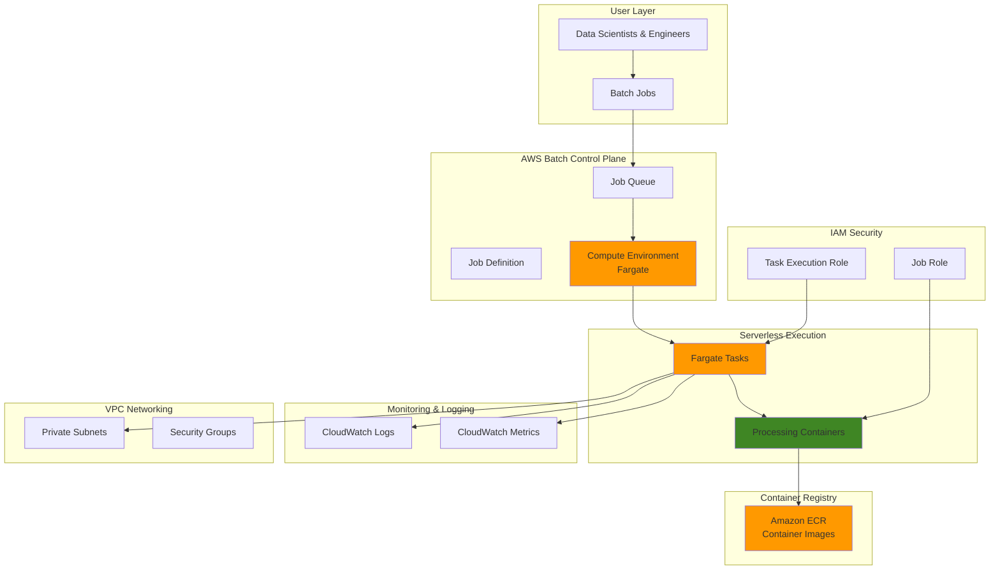

# Serverless Batch Processing with Fargate

## Problem

Modern enterprises need to process large volumes of data through batch jobs without managing complex server infrastructure. Traditional batch processing systems require provisioning and managing EC2 instances, handling scaling, monitoring resource utilization, and maintaining operational overhead. Companies struggle with rightsizing compute resources, face delays from cold starts when spinning up new instances, and waste money on idle compute capacity between batch job executions.

## Solution

AWS Batch with Fargate orchestration provides a serverless batch processing solution that automatically handles compute provisioning, scaling, and resource management. Fargate eliminates the need for server management while providing rapid job startup times (typically 30 seconds vs. minutes for EC2), precise resource allocation, and pay-per-use pricing. This approach enables organizations to focus on their batch processing logic rather than infrastructure management.

## Architecture Diagram



## Prerequisites

1. AWS account with appropriate permissions for AWS Batch, Fargate, IAM, ECR, and CloudWatch
2. AWS CLI v2 installed and configured (or AWS CloudShell)
3. Basic understanding of containerization and batch processing concepts
4. Docker knowledge for container image creation
5. VPC with subnets and security groups configured (default VPC is acceptable for testing)
6. Estimated cost: $0.50-$2.00 for completing this tutorial (varies by region and resource usage)

> **Note**: Fargate pricing is based on vCPU and memory resources consumed per second with a 1-minute minimum. Clean up resources promptly to minimize costs.

## Preparation

```bash
# Set environment variables
export AWS_REGION=$(aws configure get region)
export AWS_ACCOUNT_ID=$(aws sts get-caller-identity \
    --query Account --output text)

# Generate unique identifiers for resources
RANDOM_SUFFIX=$(aws secretsmanager get-random-password \
    --exclude-punctuation --exclude-uppercase \
    --password-length 6 --require-each-included-type \
    --output text --query RandomPassword)

export BATCH_COMPUTE_ENV_NAME="batch-fargate-compute-${RANDOM_SUFFIX}"
export BATCH_JOB_QUEUE_NAME="batch-fargate-queue-${RANDOM_SUFFIX}"
export BATCH_JOB_DEFINITION_NAME="batch-fargate-job-${RANDOM_SUFFIX}"
export BATCH_EXECUTION_ROLE_NAME="BatchFargateExecutionRole-${RANDOM_SUFFIX}"
export ECR_REPOSITORY_NAME="batch-processing-demo-${RANDOM_SUFFIX}"

# Get default VPC and subnet information
export DEFAULT_VPC_ID=$(aws ec2 describe-vpcs \
    --filters "Name=is-default,Values=true" \
    --query "Vpcs[0].VpcId" --output text)

export SUBNET_IDS=$(aws ec2 describe-subnets \
    --filters "Name=vpc-id,Values=${DEFAULT_VPC_ID}" \
    --query "Subnets[?MapPublicIpOnLaunch==\`true\`].SubnetId" \
    --output text | tr '\t' ',')

export SECURITY_GROUP_ID=$(aws ec2 describe-security-groups \
    --filters "Name=vpc-id,Values=${DEFAULT_VPC_ID}" \
             "Name=group-name,Values=default" \
    --query "SecurityGroups[0].GroupId" --output text)

echo "✅ Environment configured for region: ${AWS_REGION}"
echo "✅ Using VPC: ${DEFAULT_VPC_ID}"
echo "✅ Using subnets: ${SUBNET_IDS}"
```

## Steps

1. **Create IAM Execution Role for Fargate Tasks**:

   IAM execution roles are essential for Fargate tasks to securely interact with AWS services on your behalf. The [task execution role](https://docs.aws.amazon.com/AmazonECS/latest/developerguide/task_execution_IAM_role.html) grants the Fargate service permission to pull container images from ECR, write logs to CloudWatch, and retrieve secrets from AWS Secrets Manager. This follows the AWS Well-Architected Framework principle of least privilege by providing only the minimum permissions required for task execution.

   ```bash
   # Create trust policy for ECS tasks
   cat > /tmp/batch-execution-role-trust-policy.json << EOF
   {
     "Version": "2012-10-17",
     "Statement": [
       {
         "Effect": "Allow",
         "Principal": {
           "Service": "ecs-tasks.amazonaws.com"
         },
         "Action": "sts:AssumeRole"
       }
     ]
   }
   EOF
   
   # Create the execution role
   aws iam create-role \
       --role-name ${BATCH_EXECUTION_ROLE_NAME} \
       --assume-role-policy-document file:///tmp/batch-execution-role-trust-policy.json
   
   # Attach AWS managed policy for ECS task execution
   aws iam attach-role-policy \
       --role-name ${BATCH_EXECUTION_ROLE_NAME} \
       --policy-arn arn:aws:iam::aws:policy/service-role/AmazonECSTaskExecutionRolePolicy
   
   # Store the role ARN for later use
   export EXECUTION_ROLE_ARN=$(aws iam get-role \
       --role-name ${BATCH_EXECUTION_ROLE_NAME} \
       --query 'Role.Arn' --output text)
   
   echo "✅ Created execution role: ${EXECUTION_ROLE_ARN}"
   ```

   The execution role is now configured with the necessary permissions for Fargate task execution. This role enables secure container orchestration without exposing long-term credentials to your application code, following AWS security best practices.

2. **Create ECR Repository and Sample Container Image**:

   [Amazon ECR](https://docs.aws.amazon.com/AmazonECR/latest/userguide/what-is-ecr.html) is a fully managed container registry that integrates seamlessly with AWS Batch and Fargate. ECR provides secure, scalable, and reliable container image storage with built-in image scanning for vulnerabilities. Creating a private repository ensures your container images remain secure and accessible only to authorized AWS services within your account.

   ```bash
   # Create ECR repository
   aws ecr create-repository \
       --repository-name ${ECR_REPOSITORY_NAME} \
       --image-scanning-configuration scanOnPush=true
   
   # Get login token for ECR
   aws ecr get-login-password --region ${AWS_REGION} | \
       docker login --username AWS --password-stdin \
       ${AWS_ACCOUNT_ID}.dkr.ecr.${AWS_REGION}.amazonaws.com
   
   # Create a simple batch processing script
   cat > /tmp/batch-process.py << 'EOF'
   #!/usr/bin/env python3
   import os
   import sys
   import time
   import json
   from datetime import datetime
   
   def process_batch_job():
       """Simulate batch processing work"""
       job_id = os.environ.get('AWS_BATCH_JOB_ID', 'local-test')
       job_name = os.environ.get('AWS_BATCH_JOB_NAME', 'test-job')
       
       print(f"Starting batch job: {job_name} (ID: {job_id})")
       print(f"Timestamp: {datetime.now().isoformat()}")
       
       # Simulate processing work
       for i in range(10):
           print(f"Processing item {i+1}/10...")
           time.sleep(2)
       
       print("Batch processing completed successfully!")
       return {"status": "success", "processed_items": 10}
   
   if __name__ == "__main__":
       try:
           result = process_batch_job()
           print(json.dumps(result))
           sys.exit(0)
       except Exception as e:
           print(f"Error: {str(e)}")
           sys.exit(1)
   EOF
   
   # Create Dockerfile
   cat > /tmp/Dockerfile << 'EOF'
   FROM python:3.9-alpine
   
   WORKDIR /app
   
   # Copy the batch processing script
   COPY batch-process.py .
   
   # Make the script executable
   RUN chmod +x batch-process.py
   
   # Set the default command
   CMD ["python3", "batch-process.py"]
   EOF
   
   # Build and push the container image
   cd /tmp
   docker build -t ${ECR_REPOSITORY_NAME} .
   docker tag ${ECR_REPOSITORY_NAME}:latest \
       ${AWS_ACCOUNT_ID}.dkr.ecr.${AWS_REGION}.amazonaws.com/${ECR_REPOSITORY_NAME}:latest
   
   docker push ${AWS_ACCOUNT_ID}.dkr.ecr.${AWS_REGION}.amazonaws.com/${ECR_REPOSITORY_NAME}:latest
   
   # Store the image URI
   export CONTAINER_IMAGE_URI="${AWS_ACCOUNT_ID}.dkr.ecr.${AWS_REGION}.amazonaws.com/${ECR_REPOSITORY_NAME}:latest"
   
   echo "✅ Container image built and pushed: ${CONTAINER_IMAGE_URI}"
   ```

   Your custom container image is now available in ECR with automated vulnerability scanning enabled. This image contains your business logic and will be executed by Fargate tasks when jobs are submitted to the queue. ECR's integration with AWS security services ensures your container images meet security compliance requirements.

3. **Create Fargate Compute Environment**:

   [AWS Batch compute environments](https://docs.aws.amazon.com/batch/latest/userguide/fargate-compute-environments.html) define the compute resources where your jobs will run. Fargate compute environments eliminate the need to provision and manage EC2 instances, automatically scaling from zero to hundreds of containers based on job demand. This serverless approach provides rapid job startup times (typically 30 seconds) and precise resource allocation without infrastructure overhead.

   ```bash
   # Create compute environment configuration
   cat > /tmp/compute-environment.json << EOF
   {
     "computeEnvironmentName": "${BATCH_COMPUTE_ENV_NAME}",
     "type": "MANAGED",
     "state": "ENABLED",
     "computeResources": {
       "type": "FARGATE",
       "maxvCpus": 256,
       "subnets": ["${SUBNET_IDS//,/\",\"}"],
       "securityGroupIds": ["${SECURITY_GROUP_ID}"]
     }
   }
   EOF
   
   # Create the compute environment
   aws batch create-compute-environment \
       --cli-input-json file:///tmp/compute-environment.json
   
   # Wait for compute environment to be ready
   echo "⏳ Waiting for compute environment to be ready..."
   aws batch wait compute-environment-ready \
       --compute-environments ${BATCH_COMPUTE_ENV_NAME}
   
   echo "✅ Compute environment created: ${BATCH_COMPUTE_ENV_NAME}"
   ```

   The Fargate compute environment is operational and ready to provision serverless containers for batch processing. AWS Batch will automatically manage capacity and scaling based on job queue demand, leveraging the AWS service-linked role for Batch operations.

4. **Create Job Queue**:

   Job queues in AWS Batch act as staging areas where submitted jobs wait for available compute resources. They enable job prioritization, resource allocation control, and workload organization. Multiple queues can be configured with different priorities to handle varying business requirements, such as separating high-priority real-time jobs from lower-priority batch processing workloads.

   ```bash
   # Create job queue
   aws batch create-job-queue \
       --job-queue-name ${BATCH_JOB_QUEUE_NAME} \
       --state ENABLED \
       --priority 1 \
       --compute-environment-order order=1,computeEnvironment=${BATCH_COMPUTE_ENV_NAME}
   
   # Wait for job queue to be ready
   echo "⏳ Waiting for job queue to be ready..."
   aws batch wait job-queue-ready \
       --job-queues ${BATCH_JOB_QUEUE_NAME}
   
   echo "✅ Job queue created: ${BATCH_JOB_QUEUE_NAME}"
   ```

   The job queue is configured and ready to accept batch job submissions. Jobs submitted to this queue will be scheduled for execution on the Fargate compute environment based on resource availability and queue priority settings.

5. **Create CloudWatch Log Group**:

   [Amazon CloudWatch Logs](https://docs.aws.amazon.com/AmazonCloudWatch/latest/logs/Working-with-log-groups-and-streams.html) provides centralized logging for batch job execution, enabling real-time monitoring, debugging, and operational insights. Log groups organize log streams from multiple job executions, making it easy to track job progress, identify failures, and analyze performance patterns across your batch processing workloads.

   ```bash
   # Create log group for batch jobs
   aws logs create-log-group \
       --log-group-name "/aws/batch/job" \
       --retention-in-days 7
   
   echo "✅ CloudWatch log group created: /aws/batch/job"
   ```

   The log group is configured to capture all batch job output with a 7-day retention policy, providing operational visibility while managing storage costs. All job execution logs will be automatically streamed to this centralized location for monitoring and troubleshooting.

6. **Register Job Definition**:

   Job definitions serve as blueprints that specify how batch jobs should be executed. They define container specifications, resource requirements (vCPU and memory), execution role permissions, and logging configuration. For Fargate tasks, job definitions also configure network settings and platform capabilities, ensuring consistent job execution across different runs.

   ```bash
   # Create job definition for Fargate
   cat > /tmp/job-definition.json << EOF
   {
     "jobDefinitionName": "${BATCH_JOB_DEFINITION_NAME}",
     "type": "container",
     "platformCapabilities": ["FARGATE"],
     "containerProperties": {
       "image": "${CONTAINER_IMAGE_URI}",
       "resourceRequirements": [
         {
           "type": "VCPU",
           "value": "0.25"
         },
         {
           "type": "MEMORY",
           "value": "512"
         }
       ],
       "executionRoleArn": "${EXECUTION_ROLE_ARN}",
       "networkConfiguration": {
         "assignPublicIp": "ENABLED"
       },
       "logConfiguration": {
         "logDriver": "awslogs",
         "options": {
           "awslogs-group": "/aws/batch/job",
           "awslogs-region": "${AWS_REGION}",
           "awslogs-stream-prefix": "batch-fargate"
         }
       }
     }
   }
   EOF
   
   # Register the job definition
   aws batch register-job-definition \
       --cli-input-json file:///tmp/job-definition.json
   
   echo "✅ Job definition registered: ${BATCH_JOB_DEFINITION_NAME}"
   ```

   The job definition template is registered and ready for job submissions. This configuration ensures reproducible execution environments with precise resource allocation and comprehensive logging integration.

7. **Submit Test Batch Job**:

   Job submission triggers the AWS Batch orchestration workflow, where the service schedules your job on available compute resources. AWS Batch automatically handles container provisioning, network configuration, and resource allocation based on your job definition requirements. This demonstrates the end-to-end batch processing workflow from job submission to execution.

   ```bash
   # Submit a test job
   JOB_RESPONSE=$(aws batch submit-job \
       --job-name "test-fargate-job-$(date +%s)" \
       --job-queue ${BATCH_JOB_QUEUE_NAME} \
       --job-definition ${BATCH_JOB_DEFINITION_NAME})
   
   # Extract job ID
   export JOB_ID=$(echo ${JOB_RESPONSE} | jq -r '.jobId')
   
   echo "✅ Job submitted successfully: ${JOB_ID}"
   echo "📝 Job Name: $(echo ${JOB_RESPONSE} | jq -r '.jobName')"
   ```

   Your first batch job is queued and will begin execution once Fargate provisions the required container resources. The job ID enables tracking and monitoring throughout the execution lifecycle.

8. **Monitor Job Execution**:

   Real-time job monitoring provides visibility into batch processing status and enables proactive management of workloads. AWS Batch tracks job states from SUBMITTED through PENDING, RUNNABLE, RUNNING, to final states of SUCCEEDED or FAILED. Understanding these states helps optimize job scheduling and troubleshoot execution issues.

   ```bash
   # Function to check job status
   check_job_status() {
       aws batch describe-jobs --jobs ${JOB_ID} \
           --query 'jobs[0].status' --output text
   }
   
   # Monitor job progress
   echo "⏳ Monitoring job execution..."
   while true; do
       STATUS=$(check_job_status)
       echo "Job Status: ${STATUS}"
       
       if [ "${STATUS}" = "SUCCEEDED" ]; then
           echo "✅ Job completed successfully!"
           break
       elif [ "${STATUS}" = "FAILED" ]; then
           echo "❌ Job failed!"
           break
       fi
       
       sleep 10
   done
   
   # Get job details
   aws batch describe-jobs --jobs ${JOB_ID} \
       --query 'jobs[0].{JobName:jobName,Status:status,StartedAt:startedAt,StoppedAt:stoppedAt}'
   ```

   Job monitoring provides real-time feedback on execution progress and final results. This visibility enables efficient troubleshooting and performance optimization for future batch processing workflows.

9. **Submit Multiple Jobs for Parallel Processing**:

   Parallel job execution demonstrates AWS Batch's auto-scaling capabilities and efficient resource utilization. When multiple jobs are submitted simultaneously, Fargate automatically provisions additional containers to handle the increased workload, maximizing throughput while maintaining cost efficiency through precise resource allocation.

   ```bash
   # Submit multiple jobs to demonstrate parallel processing
   echo "🚀 Submitting multiple jobs for parallel processing..."
   JOB_IDS=()
   
   for i in {1..3}; do
       JOB_RESPONSE=$(aws batch submit-job \
           --job-name "parallel-job-${i}-$(date +%s)" \
           --job-queue ${BATCH_JOB_QUEUE_NAME} \
           --job-definition ${BATCH_JOB_DEFINITION_NAME})
       
       JOB_ID_PARALLEL=$(echo ${JOB_RESPONSE} | jq -r '.jobId')
       JOB_IDS+=("${JOB_ID_PARALLEL}")
       echo "📝 Submitted job ${i}: ${JOB_ID_PARALLEL}"
   done
   
   # Monitor all jobs
   echo "⏳ Monitoring parallel job execution..."
   for job_id in "${JOB_IDS[@]}"; do
       echo "Job ${job_id}: $(aws batch describe-jobs --jobs ${job_id} --query 'jobs[0].status' --output text)"
   done
   ```

   Multiple jobs running in parallel showcase the scalability benefits of serverless batch processing. Fargate's ability to rapidly provision containers enables efficient handling of variable workloads without pre-provisioned infrastructure.

10. **Configure Job Dependencies**:

    Job dependencies enable complex workflow orchestration by ensuring jobs execute in the correct sequence. This capability is essential for multi-stage data processing pipelines where subsequent jobs depend on the successful completion of prerequisite tasks. Dependencies help maintain data consistency and enable sophisticated batch processing workflows.

    ```bash
    # Submit a job that depends on the previous job
    DEPENDENT_JOB_RESPONSE=$(aws batch submit-job \
        --job-name "dependent-job-$(date +%s)" \
        --job-queue ${BATCH_JOB_QUEUE_NAME} \
        --job-definition ${BATCH_JOB_DEFINITION_NAME} \
        --depends-on jobId=${JOB_ID})
    
    export DEPENDENT_JOB_ID=$(echo ${DEPENDENT_JOB_RESPONSE} | jq -r '.jobId')
    
    echo "✅ Dependent job submitted: ${DEPENDENT_JOB_ID}"
    echo "📝 This job will start after job ${JOB_ID} completes"
    ```

    The dependent job demonstrates AWS Batch's workflow orchestration capabilities, automatically managing job execution order based on dependency relationships. This enables reliable multi-step data processing pipelines with built-in error handling.

## Validation & Testing

1. **Verify Compute Environment Status**:

   ```bash
   # Check compute environment status
   aws batch describe-compute-environments \
       --compute-environments ${BATCH_COMPUTE_ENV_NAME} \
       --query 'computeEnvironments[0].{Name:computeEnvironmentName,State:state,Status:status}' \
       --output table
   ```

   Expected output: State should be "ENABLED" and Status should be "VALID"

2. **Test Job Queue Configuration**:

   ```bash
   # Verify job queue configuration
   aws batch describe-job-queues \
       --job-queues ${BATCH_JOB_QUEUE_NAME} \
       --query 'jobQueues[0].{Name:jobQueueName,State:state,Priority:priority}' \
       --output table
   ```

   Expected output: State should be "ENABLED" with priority 1

3. **Validate Job Execution Logs**:

   ```bash
   # Get log stream for the job
   LOG_STREAM=$(aws batch describe-jobs --jobs ${JOB_ID} \
       --query 'jobs[0].attempts[0].taskProperties.containers[0].logStreamName' \
       --output text)
   
   # View job logs
   if [ "${LOG_STREAM}" != "None" ] && [ "${LOG_STREAM}" != "null" ]; then
       echo "📋 Job execution logs:"
       aws logs get-log-events \
           --log-group-name "/aws/batch/job" \
           --log-stream-name ${LOG_STREAM} \
           --query 'events[].message' --output text
   else
       echo "📋 Log stream not yet available or job still pending"
   fi
   ```

4. **Test Resource Allocation**:

   ```bash
   # Verify resource allocation
   aws batch describe-jobs --jobs ${JOB_ID} \
       --query 'jobs[0].{vCPUs:attempts[0].taskProperties.containers[0].resourceRequirements[?type==`VCPU`].value|[0],Memory:attempts[0].taskProperties.containers[0].resourceRequirements[?type==`MEMORY`].value|[0]}' \
       --output table
   ```

   Expected output: Should show 0.25 vCPUs and 512 MB memory

## Cleanup

1. **Stop Any Running Jobs**:

   ```bash
   # List and cancel any running jobs
   RUNNING_JOBS=$(aws batch list-jobs \
       --job-queue ${BATCH_JOB_QUEUE_NAME} \
       --job-status RUNNING \
       --query 'jobSummaryList[].jobId' --output text)
   
   if [ -n "${RUNNING_JOBS}" ]; then
       for job_id in ${RUNNING_JOBS}; do
           aws batch cancel-job \
               --job-id ${job_id} \
               --reason "Cleanup procedure"
           echo "✅ Cancelled job: ${job_id}"
       done
   fi
   ```

2. **Disable and Delete Job Queue**:

   ```bash
   # Disable job queue
   aws batch update-job-queue \
       --job-queue ${BATCH_JOB_QUEUE_NAME} \
       --state DISABLED
   
   # Wait for job queue to be disabled
   echo "⏳ Waiting for job queue to be disabled..."
   sleep 30
   
   # Delete job queue
   aws batch delete-job-queue \
       --job-queue ${BATCH_JOB_QUEUE_NAME}
   
   echo "✅ Job queue deleted: ${BATCH_JOB_QUEUE_NAME}"
   ```

3. **Disable and Delete Compute Environment**:

   ```bash
   # Disable compute environment
   aws batch update-compute-environment \
       --compute-environment ${BATCH_COMPUTE_ENV_NAME} \
       --state DISABLED
   
   # Wait for compute environment to be disabled
   echo "⏳ Waiting for compute environment to be disabled..."
   sleep 30
   
   # Delete compute environment
   aws batch delete-compute-environment \
       --compute-environment ${BATCH_COMPUTE_ENV_NAME}
   
   echo "✅ Compute environment deleted: ${BATCH_COMPUTE_ENV_NAME}"
   ```

4. **Clean Up Container Images and Repository**:

   ```bash
   # Delete ECR repository
   aws ecr delete-repository \
       --repository-name ${ECR_REPOSITORY_NAME} \
       --force
   
   echo "✅ ECR repository deleted: ${ECR_REPOSITORY_NAME}"
   ```

5. **Remove IAM Role and CloudWatch Resources**:

   ```bash
   # Detach policy from role
   aws iam detach-role-policy \
       --role-name ${BATCH_EXECUTION_ROLE_NAME} \
       --policy-arn arn:aws:iam::aws:policy/service-role/AmazonECSTaskExecutionRolePolicy
   
   # Delete IAM role
   aws iam delete-role \
       --role-name ${BATCH_EXECUTION_ROLE_NAME}
   
   # Delete CloudWatch log group
   aws logs delete-log-group \
       --log-group-name "/aws/batch/job"
   
   echo "✅ IAM role and CloudWatch log group deleted"
   ```

6. **Clean Up Temporary Files**:

   ```bash
   # Remove temporary files
   rm -f /tmp/batch-execution-role-trust-policy.json
   rm -f /tmp/compute-environment.json
   rm -f /tmp/job-definition.json
   rm -f /tmp/batch-process.py
   rm -f /tmp/Dockerfile
   
   echo "✅ Temporary files cleaned up"
   ```

## Discussion

AWS Batch with Fargate orchestration represents a paradigm shift in batch processing, moving from server-centric to serverless-centric architectures. The key advantage lies in Fargate's ability to provision containers in approximately 30 seconds compared to several minutes for EC2 instances, enabling more responsive batch processing workflows. This speed improvement is particularly valuable for time-sensitive data processing tasks and interactive analytics workloads.

The serverless nature of Fargate eliminates the operational overhead associated with managing EC2 instances, including patching, security updates, and capacity planning. Organizations can focus entirely on their batch processing logic while AWS handles the underlying infrastructure. The pay-per-use model ensures cost efficiency, as you only pay for the exact compute resources consumed during job execution, without idle time costs.

Fargate's resource allocation model allows for precise rightsizing of compute resources, supporting fractional vCPUs (0.25, 0.5, 1.0) and memory configurations from 512 MB to 30 GB. This granular control enables cost optimization for diverse workload requirements. The platform automatically handles job queuing, resource allocation, and fault tolerance, making it suitable for both simple data processing tasks and complex computational workloads. See the [AWS Batch User Guide](https://docs.aws.amazon.com/batch/latest/userguide/what-is-batch.html) for detailed service capabilities.

> **Tip**: Use AWS Batch job arrays for processing large datasets by splitting work across multiple parallel jobs. This approach maximizes throughput while maintaining cost efficiency. See the [AWS Batch job arrays documentation](https://docs.aws.amazon.com/batch/latest/userguide/array_jobs.html) for implementation details.

The integration with other AWS services enhances the platform's capabilities following the AWS Well-Architected Framework principles. CloudWatch provides comprehensive monitoring and logging, while IAM enables fine-grained access control. The ability to use custom container images from ECR allows teams to package their specific runtime environments and dependencies, ensuring consistency across development and production environments. For additional best practices, see the [AWS Well-Architected Framework](https://docs.aws.amazon.com/wellarchitected/latest/framework/welcome.html).

## Challenge

Extend this solution by implementing these enhancements:

1. **Multi-Queue Processing**: Create multiple job queues with different priorities and resource configurations to handle varying workload types (e.g., high-priority real-time jobs vs. low-priority batch jobs).

2. **Dynamic Resource Allocation**: Implement job definitions with multiple resource configurations and use job submission parameters to dynamically select appropriate resources based on input data size.

3. **Integration with Step Functions**: Build a workflow orchestration layer using AWS Step Functions to coordinate complex batch processing pipelines with error handling and retry logic.

4. **Spot Instance Integration**: Configure a hybrid compute environment that combines Fargate with EC2 Spot instances for cost-optimized processing of fault-tolerant workloads.

5. **Advanced Monitoring**: Implement custom CloudWatch metrics and alarms to track job performance, resource utilization, and cost metrics across different batch processing workflows.

## Infrastructure Code

### Available Infrastructure as Code:

- [Infrastructure Code Overview](code/README.md) - Detailed description of all infrastructure components
- [AWS CDK (Python)](code/cdk-python/) - AWS CDK Python implementation
- [AWS CDK (TypeScript)](code/cdk-typescript/) - AWS CDK TypeScript implementation
- [CloudFormation](code/cloudformation.yaml) - AWS CloudFormation template
- [Bash CLI Scripts](code/scripts/) - Example bash scripts using AWS CLI commands to deploy infrastructure
- [Terraform](code/terraform/) - Terraform configuration files