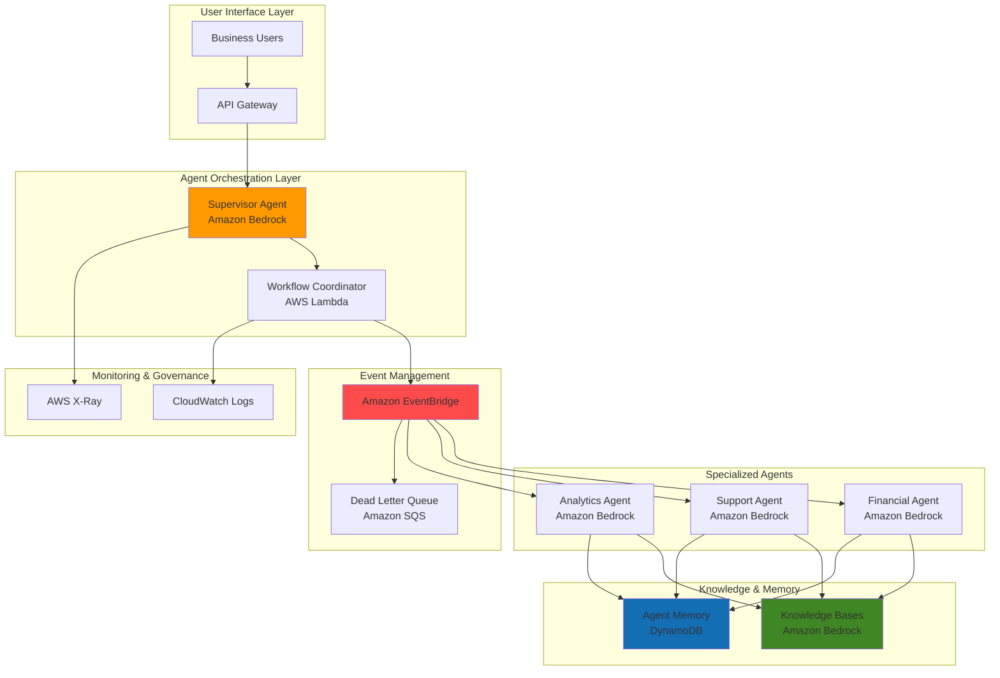

# Bedrock Multi-Agent AI Workflows with AgentCore

## Problem

Organizations need to process complex business tasks that require specialized knowledge across multiple domains, but traditional monolithic AI systems struggle with coordination between different expertise areas. Manual task routing between departments creates bottlenecks, while single-agent solutions lack the depth needed for specialized functions like financial analysis, customer support, and technical support. Without proper agent coordination mechanisms, businesses face inefficient workflows, inconsistent responses, and inability to scale intelligent automation across diverse use cases.

## Solution

Build a collaborative multi-agent AI system using Amazon Bedrock that orchestrates specialized agents through event-driven coordination. This solution leverages Amazon Bedrock's agent collaboration capabilities with a supervisor agent that intelligently routes tasks to domain-specific collaborator agents, while Amazon EventBridge manages asynchronous communication and AWS Lambda handles workflow orchestration. The architecture enables scalable, specialized AI processing with enterprise-grade security, real-time coordination, and comprehensive audit trails for business-critical decision making.

## Architecture Diagram



## Prerequisites

1. AWS account with Amazon Bedrock access and Claude 3 model access granted
2. AWS CLI v2 installed and configured (or AWS CloudShell)
3. Understanding of event-driven architectures and AI agent concepts
4. Basic knowledge of AWS Lambda, EventBridge, and IAM roles
5. Estimated cost: $75-150 for testing (includes Bedrock model usage, Lambda invocations, EventBridge events, and DynamoDB storage)

> **Note**: This recipe uses Amazon Bedrock Agents and standard AWS services. Ensure your AWS account has access to Bedrock models and review the [Amazon Bedrock User Guide](https://docs.aws.amazon.com/bedrock/latest/userguide/) for current capabilities and pricing.

## Preparation

```bash
# Set environment variables
export AWS_REGION=$(aws configure get region)
export AWS_ACCOUNT_ID=$(aws sts get-caller-identity \
    --query Account --output text)

# Generate unique identifiers for resources
RANDOM_SUFFIX=$(aws secretsmanager get-random-password \
    --exclude-punctuation --exclude-uppercase \
    --password-length 6 --require-each-included-type \
    --output text --query RandomPassword)

# Set resource names
export SUPERVISOR_AGENT_NAME="supervisor-agent-${RANDOM_SUFFIX}"
export FINANCE_AGENT_NAME="finance-agent-${RANDOM_SUFFIX}"
export SUPPORT_AGENT_NAME="support-agent-${RANDOM_SUFFIX}"
export ANALYTICS_AGENT_NAME="analytics-agent-${RANDOM_SUFFIX}"
export EVENT_BUS_NAME="multi-agent-bus-${RANDOM_SUFFIX}"
export COORDINATOR_FUNCTION_NAME="agent-coordinator-${RANDOM_SUFFIX}"
export MEMORY_TABLE_NAME="agent-memory-${RANDOM_SUFFIX}"

# Create foundational IAM role for Bedrock agents
aws iam create-role \
    --role-name BedrockAgentRole-${RANDOM_SUFFIX} \
    --assume-role-policy-document '{
        "Version": "2012-10-17",
        "Statement": [{
            "Effect": "Allow",
            "Principal": {"Service": "bedrock.amazonaws.com"},
            "Action": "sts:AssumeRole"
        }]
    }'

aws iam attach-role-policy \
    --role-name BedrockAgentRole-${RANDOM_SUFFIX} \
    --policy-arn arn:aws:iam::aws:policy/AmazonBedrockFullAccess

export BEDROCK_ROLE_ARN="arn:aws:iam::${AWS_ACCOUNT_ID}:role/BedrockAgentRole-${RANDOM_SUFFIX}"

echo "✅ AWS environment configured with unique identifiers"
```

## Steps

1. **Create DynamoDB Table for Agent Memory Management**:

   Amazon DynamoDB provides persistent storage for agent conversation history and shared context across multi-agent workflows. This serverless database scales automatically based on agent interaction patterns while providing millisecond latency for memory retrieval. The shared memory approach enables agents to build upon previous conversations and maintain context across complex multi-step business processes.

   ```bash
   # Create DynamoDB table for agent memory
   aws dynamodb create-table \
       --table-name ${MEMORY_TABLE_NAME} \
       --attribute-definitions \
           AttributeName=SessionId,AttributeType=S \
           AttributeName=Timestamp,AttributeType=N \
       --key-schema \
           AttributeName=SessionId,KeyType=HASH \
           AttributeName=Timestamp,KeyType=RANGE \
       --provisioned-throughput \
           ReadCapacityUnits=5,WriteCapacityUnits=5 \
       --stream-specification StreamEnabled=true,StreamViewType=NEW_AND_OLD_IMAGES \
       --tags Key=Project,Value=MultiAgentWorkflow

   # Wait for table creation
   aws dynamodb wait table-exists --table-name ${MEMORY_TABLE_NAME}

   export MEMORY_TABLE_ARN=$(aws dynamodb describe-table \
       --table-name ${MEMORY_TABLE_NAME} \
       --query 'Table.TableArn' --output text)

   echo "✅ DynamoDB memory table created: ${MEMORY_TABLE_ARN}"
   ```

   The DynamoDB table now provides centralized memory storage for all agents in our multi-agent system. This shared memory capability enables sophisticated coordination patterns where agents can reference previous conversations and build upon each other's work to deliver comprehensive business solutions.

2. **Create Custom EventBridge Bus for Agent Communication**:

   Amazon EventBridge provides the event-driven backbone for our multi-agent system, enabling asynchronous communication between agents while maintaining loose coupling. A custom event bus isolates our agent workflows from other system events and provides dedicated routing rules for agent coordination patterns. This approach ensures reliable message delivery with built-in retry mechanisms and dead letter queue support for failed agent interactions.

   ```bash
   # Create custom event bus for agent communication
   aws events create-event-bus \
       --name ${EVENT_BUS_NAME} \
       --tags Key=Project,Value=MultiAgentWorkflow

   # Create event rule for agent task routing
   aws events put-rule \
       --name agent-task-router \
       --event-bus-name ${EVENT_BUS_NAME} \
       --event-pattern '{
           "source": ["multi-agent.system"],
           "detail-type": ["Agent Task Request"]
       }' \
       --description "Routes tasks to specialized agents"

   export EVENT_BUS_ARN=$(aws events describe-event-bus \
       --name ${EVENT_BUS_NAME} \
       --query 'Arn' --output text)

   echo "✅ EventBridge bus created: ${EVENT_BUS_ARN}"
   ```

   The EventBridge bus now provides the foundation for agent-to-agent communication with structured event routing. This enables the supervisor agent to distribute tasks efficiently while maintaining audit trails and monitoring capabilities across the entire workflow.

3. **Create AWS Lambda Function for Workflow Coordination**:

   AWS Lambda serves as the central coordinator for our multi-agent workflows, processing EventBridge events and orchestrating the flow between different specialized agents. The serverless approach ensures cost-effective scaling based on demand while providing the flexibility to implement complex business logic for task routing, result aggregation, and error handling across multiple agent interactions.

   ```bash
   # Create IAM role for Lambda coordinator function
   aws iam create-role \
       --role-name LambdaCoordinatorRole-${RANDOM_SUFFIX} \
       --assume-role-policy-document '{
           "Version": "2012-10-17",
           "Statement": [{
               "Effect": "Allow",
               "Principal": {"Service": "lambda.amazonaws.com"},
               "Action": "sts:AssumeRole"
           }]
       }'

   # Attach necessary policies for coordination function
   aws iam attach-role-policy \
       --role-name LambdaCoordinatorRole-${RANDOM_SUFFIX} \
       --policy-arn arn:aws:iam::aws:policy/service-role/AWSLambdaBasicExecutionRole

   aws iam attach-role-policy \
       --role-name LambdaCoordinatorRole-${RANDOM_SUFFIX} \
       --policy-arn arn:aws:iam::aws:policy/AmazonEventBridgeFullAccess

   aws iam attach-role-policy \
       --role-name LambdaCoordinatorRole-${RANDOM_SUFFIX} \
       --policy-arn arn:aws:iam::aws:policy/AmazonBedrockFullAccess

   aws iam attach-role-policy \
       --role-name LambdaCoordinatorRole-${RANDOM_SUFFIX} \
       --policy-arn arn:aws:iam::aws:policy/AmazonDynamoDBFullAccess

   export LAMBDA_ROLE_ARN="arn:aws:iam::${AWS_ACCOUNT_ID}:role/LambdaCoordinatorRole-${RANDOM_SUFFIX}"

   # Create Lambda deployment package
   cat > coordinator.py << 'EOF'
import json
import boto3
import logging
from datetime import datetime
import os

logger = logging.getLogger()
logger.setLevel(logging.INFO)

eventbridge = boto3.client('events')
bedrock_agent = boto3.client('bedrock-agent-runtime')
dynamodb = boto3.resource('dynamodb')

def lambda_handler(event, context):
    """Coordinate multi-agent workflows based on EventBridge events"""
    
    try:
        # Parse EventBridge event
        detail = event.get('detail', {})
        task_type = detail.get('taskType')
        request_data = detail.get('requestData')
        correlation_id = detail.get('correlationId')
        session_id = detail.get('sessionId', correlation_id)
        
        logger.info(f"Processing task: {task_type} with correlation: {correlation_id}")
        
        # Store task in memory table
        memory_table = dynamodb.Table(os.environ['MEMORY_TABLE_NAME'])
        
        memory_table.put_item(
            Item={
                'SessionId': session_id,
                'Timestamp': int(datetime.now().timestamp()),
                'TaskType': task_type,
                'RequestData': request_data,
                'Status': 'processing'
            }
        )
        
        # Route to appropriate agent based on task type
        agent_response = route_to_agent(task_type, request_data, session_id)
        
        # Update memory with result
        memory_table.put_item(
            Item={
                'SessionId': session_id,
                'Timestamp': int(datetime.now().timestamp()),
                'TaskType': task_type,
                'Response': agent_response,
                'Status': 'completed'
            }
        )
        
        # Publish completion event
        eventbridge.put_events(
            Entries=[{
                'Source': 'multi-agent.coordinator',
                'DetailType': 'Agent Task Completed',
                'Detail': json.dumps({
                    'correlationId': correlation_id,
                    'taskType': task_type,
                    'result': agent_response,
                    'status': 'completed'
                }),
                'EventBusName': os.environ['EVENT_BUS_NAME']
            }]
        )
        
        return {
            'statusCode': 200,
            'body': json.dumps({
                'message': 'Task coordinated successfully',
                'correlationId': correlation_id
            })
        }
        
    except Exception as e:
        logger.error(f"Coordination error: {str(e)}")
        
        # Publish error event
        eventbridge.put_events(
            Entries=[{
                'Source': 'multi-agent.coordinator',
                'DetailType': 'Agent Task Failed',
                'Detail': json.dumps({
                    'correlationId': correlation_id,
                    'error': str(e),
                    'status': 'failed'
                }),
                'EventBusName': os.environ['EVENT_BUS_NAME']
            }]
        )
        
        return {
            'statusCode': 500,
            'body': json.dumps({'error': str(e)})
        }

def route_to_agent(task_type, request_data, session_id):
    """Route task to appropriate specialized agent"""
    
    # This is a simplified routing function
    # In production, this would invoke actual Bedrock agents
    agent_responses = {
        'financial_analysis': f"Financial analysis completed for: {request_data}",
        'customer_support': f"Customer support response for: {request_data}",
        'data_analytics': f"Analytics insights for: {request_data}"
    }
    
    return agent_responses.get(task_type, f"Processed by general agent: {request_data}")
EOF

   zip coordinator.zip coordinator.py

   # Create Lambda function
   aws lambda create-function \
       --function-name ${COORDINATOR_FUNCTION_NAME} \
       --runtime python3.11 \
       --role ${LAMBDA_ROLE_ARN} \
       --handler coordinator.lambda_handler \
       --zip-file fileb://coordinator.zip \
       --timeout 60 \
       --memory-size 256 \
       --environment Variables='{
           "EVENT_BUS_NAME":"'${EVENT_BUS_NAME}'",
           "MEMORY_TABLE_NAME":"'${MEMORY_TABLE_NAME}'"
       }'

   echo "✅ Lambda coordinator function created successfully"
   ```

   The Lambda coordinator function now acts as the central orchestration point for multi-agent workflows. It processes EventBridge events, routes tasks to appropriate agents, manages shared memory through DynamoDB, and provides comprehensive error handling and audit logging.

4. **Create Specialized Bedrock Agents with Domain Expertise**:

   Amazon Bedrock Agents provide the foundation for our specialized AI workforce, with each agent optimized for specific business domains. Creating domain-specific agents ensures focused expertise while maintaining consistent enterprise security and governance. These agents leverage Claude 3 foundation models with custom instructions to deliver specialized capabilities for financial analysis, customer support, and data analytics tasks.

   ```bash
   # Create Financial Analysis Agent
   aws bedrock-agent create-agent \
       --agent-name ${FINANCE_AGENT_NAME} \
       --agent-resource-role-arn ${BEDROCK_ROLE_ARN} \
       --description "Specialized agent for financial analysis and reporting" \
       --foundation-model anthropic.claude-3-sonnet-20240229-v1:0 \
       --instruction "You are a financial analysis specialist. Your role is to analyze financial data, create reports, calculate metrics, and provide insights on financial performance. Always provide detailed explanations of your analysis methodology and cite relevant financial principles. Focus on accuracy and compliance with financial reporting standards." \
       --idle-session-ttl-in-seconds 1800

   export FINANCE_AGENT_ID=$(aws bedrock-agent list-agents \
       --query "agentSummaries[?agentName=='${FINANCE_AGENT_NAME}'].agentId" \
       --output text)

   # Create Customer Support Agent
   aws bedrock-agent create-agent \
       --agent-name ${SUPPORT_AGENT_NAME} \
       --agent-resource-role-arn ${BEDROCK_ROLE_ARN} \
       --description "Specialized agent for customer support and service" \
       --foundation-model anthropic.claude-3-sonnet-20240229-v1:0 \
       --instruction "You are a customer support specialist. Your role is to help customers resolve issues, answer questions, and provide excellent service experiences. Always maintain a helpful, empathetic tone and focus on resolving customer concerns efficiently. Escalate complex technical issues when appropriate and always follow company policies." \
       --idle-session-ttl-in-seconds 1800

   export SUPPORT_AGENT_ID=$(aws bedrock-agent list-agents \
       --query "agentSummaries[?agentName=='${SUPPORT_AGENT_NAME}'].agentId" \
       --output text)

   # Create Data Analytics Agent
   aws bedrock-agent create-agent \
       --agent-name ${ANALYTICS_AGENT_NAME} \
       --agent-resource-role-arn ${BEDROCK_ROLE_ARN} \
       --description "Specialized agent for data analysis and insights" \
       --foundation-model anthropic.claude-3-sonnet-20240229-v1:0 \
       --instruction "You are a data analytics specialist. Your role is to analyze datasets, identify patterns, create visualizations, and provide actionable insights. Focus on statistical accuracy, clear data interpretation, and practical business recommendations. Always explain your analytical methodology and validate your findings." \
       --idle-session-ttl-in-seconds 1800

   export ANALYTICS_AGENT_ID=$(aws bedrock-agent list-agents \
       --query "agentSummaries[?agentName=='${ANALYTICS_AGENT_NAME}'].agentId" \
       --output text)

   echo "✅ Specialized agents created:"
   echo "   Finance Agent ID: ${FINANCE_AGENT_ID}"
   echo "   Support Agent ID: ${SUPPORT_AGENT_ID}"
   echo "   Analytics Agent ID: ${ANALYTICS_AGENT_ID}"
   ```

   The specialized agents are now configured with domain-specific expertise and clear role definitions. Each agent maintains focused capabilities while sharing common enterprise security controls and monitoring through Amazon Bedrock's managed infrastructure.

5. **Create Supervisor Agent for Multi-Agent Coordination**:

   The supervisor agent serves as the intelligent orchestrator for our multi-agent system, coordinating tasks across specialized agents through hierarchical delegation. This architectural pattern provides centralized planning and user interaction while enabling parallel processing and leveraging each agent's domain expertise for complex business workflows that require multiple areas of knowledge.

   ```bash
   # Create Supervisor Agent with multi-agent collaboration capabilities
   aws bedrock-agent create-agent \
       --agent-name ${SUPERVISOR_AGENT_NAME} \
       --agent-resource-role-arn ${BEDROCK_ROLE_ARN} \
       --description "Supervisor agent for multi-agent workflow coordination" \
       --foundation-model anthropic.claude-3-sonnet-20240229-v1:0 \
       --instruction "You are a supervisor agent responsible for coordinating complex business tasks across specialized agent teams. Your responsibilities include:
1. Analyzing incoming requests and breaking them into sub-tasks
2. Routing tasks to appropriate specialist agents: Financial Agent for financial analysis, Support Agent for customer service, Analytics Agent for data analysis
3. Coordinating parallel work streams and managing dependencies
4. Synthesizing results from multiple agents into cohesive responses
5. Ensuring quality control and consistency across agent outputs
Always provide clear task delegation and maintain oversight of the overall workflow progress." \
       --idle-session-ttl-in-seconds 3600 \
       --agent-collaboration SUPERVISOR

   export SUPERVISOR_AGENT_ID=$(aws bedrock-agent list-agents \
       --query "agentSummaries[?agentName=='${SUPERVISOR_AGENT_NAME}'].agentId" \
       --output text)

   # Wait for agent creation to complete
   echo "Waiting for supervisor agent creation to complete..."
   sleep 10

   # Prepare the supervisor agent for use
   aws bedrock-agent prepare-agent --agent-id ${SUPERVISOR_AGENT_ID}

   # Wait for preparation to complete
   sleep 30

   echo "✅ Supervisor agent configured with coordination capabilities"
   echo "   Supervisor Agent ID: ${SUPERVISOR_AGENT_ID}"
   ```

   The supervisor agent now provides the central coordination point for multi-agent workflows with clear delegation responsibilities and oversight capabilities. This hierarchical approach enables efficient task distribution while maintaining centralized quality control and user interaction.

6. **Configure Agent Collaboration Relationships**:

   Amazon Bedrock's multi-agent collaboration feature enables the supervisor agent to work with specialized collaborator agents in a coordinated manner. This step establishes the relationships between the supervisor and each specialized agent, defining their roles and collaboration patterns for seamless multi-agent workflows.

   ```bash
   # Associate collaborator agents with supervisor
   aws bedrock-agent associate-agent-collaborator \
       --agent-id ${SUPERVISOR_AGENT_ID} \
       --agent-version DRAFT \
       --collaborator-name "FinancialSpecialist" \
       --collaborator-agent-id ${FINANCE_AGENT_ID} \
       --collaborator-alias-arn "arn:aws:bedrock:${AWS_REGION}:${AWS_ACCOUNT_ID}:agent-alias/${FINANCE_AGENT_ID}/TSTALIASID" \
       --collaboration-instruction "Use this agent for financial analysis, revenue calculations, profit margin analysis, and financial reporting tasks."

   aws bedrock-agent associate-agent-collaborator \
       --agent-id ${SUPERVISOR_AGENT_ID} \
       --agent-version DRAFT \
       --collaborator-name "SupportSpecialist" \
       --collaborator-agent-id ${SUPPORT_AGENT_ID} \
       --collaborator-alias-arn "arn:aws:bedrock:${AWS_REGION}:${AWS_ACCOUNT_ID}:agent-alias/${SUPPORT_AGENT_ID}/TSTALIASID" \
       --collaboration-instruction "Use this agent for customer support queries, issue resolution, and service experience improvements."

   aws bedrock-agent associate-agent-collaborator \
       --agent-id ${SUPERVISOR_AGENT_ID} \
       --agent-version DRAFT \
       --collaborator-name "AnalyticsSpecialist" \
       --collaborator-agent-id ${ANALYTICS_AGENT_ID} \
       --collaborator-alias-arn "arn:aws:bedrock:${AWS_REGION}:${AWS_ACCOUNT_ID}:agent-alias/${ANALYTICS_AGENT_ID}/TSTALIASID" \
       --collaboration-instruction "Use this agent for data analysis, trend identification, and business intelligence insights."

   echo "✅ Agent collaboration relationships configured"
   ```

   The collaboration relationships now enable the supervisor agent to intelligently delegate tasks to specialized agents based on the request context. This creates a truly collaborative multi-agent system where each agent contributes their domain expertise to complex business problems.

7. **Configure EventBridge Integration with Lambda Coordinator**:

   Connecting EventBridge to the Lambda coordinator creates the event-driven orchestration layer that enables asynchronous agent communication and workflow management. This integration ensures reliable event processing with automatic retry logic and dead letter queue handling for failed events, providing enterprise-grade reliability for multi-agent coordination patterns.

   ```bash
   # Add EventBridge permission to invoke Lambda function
   aws lambda add-permission \
       --function-name ${COORDINATOR_FUNCTION_NAME} \
       --statement-id eventbridge-invoke \
       --action lambda:InvokeFunction \
       --principal events.amazonaws.com \
       --source-arn arn:aws:events:${AWS_REGION}:${AWS_ACCOUNT_ID}:rule/${EVENT_BUS_NAME}/agent-task-router

   # Create EventBridge target for Lambda function
   aws events put-targets \
       --rule agent-task-router \
       --event-bus-name ${EVENT_BUS_NAME} \
       --targets Id=1,Arn=arn:aws:lambda:${AWS_REGION}:${AWS_ACCOUNT_ID}:function:${COORDINATOR_FUNCTION_NAME}

   # Create dead letter queue for failed events
   aws sqs create-queue \
       --queue-name multi-agent-dlq-${RANDOM_SUFFIX} \
       --attributes '{
           "MessageRetentionPeriod": "1209600",
           "VisibilityTimeoutSeconds": "60"
       }'

   export DLQ_URL=$(aws sqs get-queue-url \
       --queue-name multi-agent-dlq-${RANDOM_SUFFIX} \
       --query 'QueueUrl' --output text)

   echo "✅ EventBridge integration configured with Lambda coordinator"
   echo "   Dead Letter Queue URL: ${DLQ_URL}"
   ```

   The EventBridge-Lambda integration now provides robust event-driven orchestration with comprehensive error handling. Failed events are automatically routed to the dead letter queue for analysis and replay, ensuring no agent tasks are lost during processing.

8. **Prepare All Agents for Production Use**:

   Preparing agents activates them for production use and creates the necessary aliases for stable endpoint access. This step ensures all agents are fully configured and ready to handle business requests while providing version management capabilities for controlled deployments and rollbacks.

   ```bash
   # Prepare all specialized agents
   aws bedrock-agent prepare-agent --agent-id ${FINANCE_AGENT_ID}
   aws bedrock-agent prepare-agent --agent-id ${SUPPORT_AGENT_ID}
   aws bedrock-agent prepare-agent --agent-id ${ANALYTICS_AGENT_ID}

   # Wait for all agents to be prepared
   echo "Waiting for all agents to be prepared..."
   sleep 60

   # Create production aliases for all agents
   aws bedrock-agent create-agent-alias \
       --agent-id ${SUPERVISOR_AGENT_ID} \
       --agent-alias-name production \
       --description "Production alias for supervisor agent"

   aws bedrock-agent create-agent-alias \
       --agent-id ${FINANCE_AGENT_ID} \
       --agent-alias-name production \
       --description "Production alias for finance agent"

   aws bedrock-agent create-agent-alias \
       --agent-id ${SUPPORT_AGENT_ID} \
       --agent-alias-name production \
       --description "Production alias for support agent"

   aws bedrock-agent create-agent-alias \
       --agent-id ${ANALYTICS_AGENT_ID} \
       --agent-alias-name production \
       --description "Production alias for analytics agent"

   export SUPERVISOR_ALIAS_ID=$(aws bedrock-agent list-agent-aliases \
       --agent-id ${SUPERVISOR_AGENT_ID} \
       --query "agentAliasSummaries[?agentAliasName=='production'].agentAliasId" \
       --output text)

   echo "✅ All agents prepared and production aliases created"
   echo "   Supervisor Agent Alias ID: ${SUPERVISOR_ALIAS_ID}"
   ```

   All agents are now fully prepared for production use with stable alias endpoints. This provides the foundation for reliable multi-agent workflows with version management and controlled deployment capabilities.

9. **Create Monitoring and Observability Infrastructure**:

   Comprehensive monitoring provides visibility into multi-agent workflows with CloudWatch metrics, X-Ray tracing, and custom dashboards. This observability infrastructure enables proactive issue detection, performance optimization, and business intelligence from agent interactions while maintaining compliance with enterprise monitoring requirements and AWS Well-Architected Framework principles.

   ```bash
   # Create CloudWatch Log Groups for agents
   aws logs create-log-group \
       --log-group-name /aws/bedrock/agents/supervisor \
       --retention-in-days 30

   aws logs create-log-group \
       --log-group-name /aws/bedrock/agents/specialized \
       --retention-in-days 30

   aws logs create-log-group \
       --log-group-name /aws/lambda/multi-agent-coordinator \
       --retention-in-days 30

   # Create CloudWatch Dashboard for multi-agent monitoring
   cat > dashboard-config.json << EOF
{
    "widgets": [
        {
            "type": "metric",
            "properties": {
                "metrics": [
                    ["AWS/Bedrock", "InvocationLatency", "AgentId", "${SUPERVISOR_AGENT_ID}"],
                    ["AWS/Bedrock", "InvocationCount", "AgentId", "${SUPERVISOR_AGENT_ID}"],
                    ["AWS/Lambda", "Duration", "FunctionName", "${COORDINATOR_FUNCTION_NAME}"],
                    ["AWS/Events", "MatchedEvents", "EventBusName", "${EVENT_BUS_NAME}"],
                    ["AWS/DynamoDB", "ConsumedReadCapacityUnits", "TableName", "${MEMORY_TABLE_NAME}"],
                    ["AWS/DynamoDB", "ConsumedWriteCapacityUnits", "TableName", "${MEMORY_TABLE_NAME}"]
                ],
                "period": 300,
                "stat": "Average",
                "region": "${AWS_REGION}",
                "title": "Multi-Agent Performance Metrics",
                "yAxis": {
                    "left": {
                        "min": 0
                    }
                }
            }
        }
    ]
}
EOF

   aws cloudwatch put-dashboard \
       --dashboard-name MultiAgentWorkflow-${RANDOM_SUFFIX} \
       --dashboard-body file://dashboard-config.json

   # Enable X-Ray tracing for Lambda function
   aws lambda update-function-configuration \
       --function-name ${COORDINATOR_FUNCTION_NAME} \
       --tracing-config Mode=Active

   echo "✅ Monitoring and observability infrastructure created"
   echo "   Dashboard: MultiAgentWorkflow-${RANDOM_SUFFIX}"
   ```

   The monitoring infrastructure now provides comprehensive visibility into agent performance, workflow execution, and system health. CloudWatch dashboards enable real-time monitoring while X-Ray tracing provides detailed insights into request flows across the multi-agent system.

## Validation & Testing

1. **Verify Agent Creation and Configuration**:

   ```bash
   # Check all agents are created and in ready state
   aws bedrock-agent list-agents \
       --query 'agentSummaries[?contains(agentName, `'${RANDOM_SUFFIX}'`)].{Name:agentName,Status:agentStatus,ID:agentId}' \
       --output table

   # Verify memory table is active
   aws dynamodb describe-table \
       --table-name ${MEMORY_TABLE_NAME} \
       --query 'Table.{Name:TableName,Status:TableStatus,ItemCount:ItemCount}'
   ```

   Expected output: All agents should show "PREPARED" status and memory table should show "ACTIVE" status.

2. **Test EventBridge to Lambda Integration**:

   ```bash
   # Send test event to verify EventBridge routing
   aws events put-events \
       --entries '[{
           "Source": "multi-agent.system",
           "DetailType": "Agent Task Request",
           "Detail": "{\"taskType\":\"financial_analysis\",\"requestData\":\"Q4 revenue analysis\",\"correlationId\":\"test-123\",\"sessionId\":\"session-456\"}",
           "EventBusName": "'${EVENT_BUS_NAME}'"
       }]'

   # Check Lambda function logs for processing
   sleep 5
   aws logs tail /aws/lambda/${COORDINATOR_FUNCTION_NAME} \
       --since 2m
   ```

   Expected output: EventBridge event should trigger Lambda function with successful processing logs showing task coordination.

3. **Test Multi-Agent Workflow with Supervisor Agent**:

   ```bash
   # Create a session for the supervisor agent
   SESSION_ID=$(date +%s)
   
   # Create session
   aws bedrock-agent-runtime create-session \
       --session-identifier ${SESSION_ID}

   # Create invocation within the session
   INVOCATION_ID=$(aws bedrock-agent-runtime create-invocation \
       --session-identifier ${SESSION_ID} \
       --description "Multi-agent business analysis request" \
       --query 'invocationId' --output text)

   # Send complex multi-domain request to supervisor agent
   python3 << EOF
import boto3
import json

client = boto3.client('bedrock-agent-runtime', region_name='${AWS_REGION}')

response = client.invoke_agent(
    agentId='${SUPERVISOR_AGENT_ID}',
    agentAliasId='${SUPERVISOR_ALIAS_ID}',
    sessionId='${SESSION_ID}',
    inputText="I need a comprehensive business analysis that includes: 1) Financial performance review for Q4 showing revenue trends and profit margins, 2) Customer satisfaction analysis from recent support interactions, and 3) Sales trend analytics with month-over-month comparisons. Please coordinate with your specialist team to provide a complete report.",
    enableTrace=True
)

completion = ""
for event in response.get("completion"):
    if 'chunk' in event:
        chunk = event["chunk"]
        completion += chunk["bytes"].decode()

print(f"Agent response: {completion}")
EOF

   # Check DynamoDB for memory persistence
   aws dynamodb scan \
       --table-name ${MEMORY_TABLE_NAME} \
       --limit 5
   ```

   Expected output: Supervisor agent should provide coordinated response referencing specialist agents with structured analysis.

## Cleanup

1. **Delete Agent Collaborations and Aliases**:

   ```bash
   # Disassociate collaborator agents
   aws bedrock-agent disassociate-agent-collaborator \
       --agent-id ${SUPERVISOR_AGENT_ID} \
       --agent-version DRAFT \
       --collaborator-id ${FINANCE_AGENT_ID}

   aws bedrock-agent disassociate-agent-collaborator \
       --agent-id ${SUPERVISOR_AGENT_ID} \
       --agent-version DRAFT \
       --collaborator-id ${SUPPORT_AGENT_ID}

   aws bedrock-agent disassociate-agent-collaborator \
       --agent-id ${SUPERVISOR_AGENT_ID} \
       --agent-version DRAFT \
       --collaborator-id ${ANALYTICS_AGENT_ID}

   # Delete agent aliases
   aws bedrock-agent delete-agent-alias \
       --agent-id ${SUPERVISOR_AGENT_ID} \
       --agent-alias-id ${SUPERVISOR_ALIAS_ID}

   echo "✅ Agent collaborations and aliases removed"
   ```

2. **Delete Bedrock Agents**:

   ```bash
   # Delete all created agents
   aws bedrock-agent delete-agent --agent-id ${SUPERVISOR_AGENT_ID}
   aws bedrock-agent delete-agent --agent-id ${FINANCE_AGENT_ID}
   aws bedrock-agent delete-agent --agent-id ${SUPPORT_AGENT_ID}
   aws bedrock-agent delete-agent --agent-id ${ANALYTICS_AGENT_ID}

   echo "✅ Bedrock agents deleted"
   ```

3. **Remove EventBridge Infrastructure**:

   ```bash
   # Remove EventBridge targets and rules
   aws events remove-targets \
       --rule agent-task-router \
       --event-bus-name ${EVENT_BUS_NAME} \
       --ids 1

   aws events delete-rule \
       --name agent-task-router \
       --event-bus-name ${EVENT_BUS_NAME}

   # Delete custom event bus
   aws events delete-event-bus \
       --name ${EVENT_BUS_NAME}

   echo "✅ EventBridge infrastructure removed"
   ```

4. **Delete Lambda Function and IAM Roles**:

   ```bash
   # Delete Lambda function
   aws lambda delete-function \
       --function-name ${COORDINATOR_FUNCTION_NAME}

   # Delete IAM roles and policies
   aws iam detach-role-policy \
       --role-name LambdaCoordinatorRole-${RANDOM_SUFFIX} \
       --policy-arn arn:aws:iam::aws:policy/service-role/AWSLambdaBasicExecutionRole

   aws iam detach-role-policy \
       --role-name LambdaCoordinatorRole-${RANDOM_SUFFIX} \
       --policy-arn arn:aws:iam::aws:policy/AmazonEventBridgeFullAccess

   aws iam detach-role-policy \
       --role-name LambdaCoordinatorRole-${RANDOM_SUFFIX} \
       --policy-arn arn:aws:iam::aws:policy/AmazonBedrockFullAccess

   aws iam detach-role-policy \
       --role-name LambdaCoordinatorRole-${RANDOM_SUFFIX} \
       --policy-arn arn:aws:iam::aws:policy/AmazonDynamoDBFullAccess

   aws iam delete-role --role-name LambdaCoordinatorRole-${RANDOM_SUFFIX}

   aws iam detach-role-policy \
       --role-name BedrockAgentRole-${RANDOM_SUFFIX} \
       --policy-arn arn:aws:iam::aws:policy/AmazonBedrockFullAccess

   aws iam delete-role --role-name BedrockAgentRole-${RANDOM_SUFFIX}

   echo "✅ Lambda function and IAM roles deleted"
   ```

5. **Clean Up Storage and Monitoring Resources**:

   ```bash
   # Delete DynamoDB table
   aws dynamodb delete-table --table-name ${MEMORY_TABLE_NAME}

   # Delete CloudWatch resources
   aws cloudwatch delete-dashboards \
       --dashboard-names MultiAgentWorkflow-${RANDOM_SUFFIX}

   aws logs delete-log-group \
       --log-group-name /aws/bedrock/agents/supervisor

   aws logs delete-log-group \
       --log-group-name /aws/bedrock/agents/specialized

   aws logs delete-log-group \
       --log-group-name /aws/lambda/multi-agent-coordinator

   # Delete SQS dead letter queue
   aws sqs delete-queue --queue-url ${DLQ_URL}

   # Remove local files
   rm -f coordinator.py coordinator.zip dashboard-config.json

   echo "✅ All resources cleaned up successfully"
   ```

## Discussion

This multi-agent AI workflow architecture leverages Amazon Bedrock's native agent collaboration capabilities to create a sophisticated, enterprise-ready system for complex business task processing. The solution implements the supervisor-collaborator pattern where a central supervisor agent intelligently coordinates specialized agents, each optimized for specific business domains like financial analysis, customer support, and data analytics. This approach mirrors real-world organizational structures where complex tasks require expertise from multiple departments working in coordination, following [AWS Well-Architected Framework](https://docs.aws.amazon.com/wellarchitected/latest/framework/welcome.html) principles for reliability and operational excellence.

The event-driven architecture using Amazon EventBridge provides several key advantages for multi-agent coordination. EventBridge's managed event routing eliminates the complexity of point-to-point agent communication while providing built-in retry mechanisms, dead letter queues, and audit trails for all agent interactions. This loose coupling enables independent scaling of agent workloads and supports complex workflow patterns like parallel processing, conditional routing, and result aggregation. The integration with AWS Lambda as the central coordinator provides serverless orchestration that scales based on demand while maintaining low operational overhead and cost efficiency.

Amazon Bedrock's multi-agent collaboration feature enables native coordination between agents without requiring custom orchestration logic. The supervisor agent can delegate tasks to collaborator agents based on their specialized instructions and automatically synthesize responses from multiple agents. This built-in capability reduces implementation complexity while providing enterprise-grade security, monitoring, and governance. The shared memory implementation using DynamoDB enables context-aware agents that can maintain conversation history and build upon previous interactions, essential for complex multi-step business processes.

The monitoring and observability implementation follows AWS operational best practices with CloudWatch dashboards providing real-time visibility into agent performance, workflow execution times, and error rates. X-Ray distributed tracing enables detailed analysis of request flows across the multi-agent system, supporting troubleshooting and performance optimization. The comprehensive logging and metrics also enable business intelligence analysis of agent interactions, task completion rates, and workflow efficiency patterns, supporting continuous improvement of the multi-agent system. For additional guidance on implementing robust serverless architectures, see the [AWS Lambda best practices documentation](https://docs.aws.amazon.com/lambda/latest/dg/best-practices.html).

> **Tip**: Consider implementing circuit breaker patterns in your Lambda coordinator to handle agent failures gracefully. The AWS Lambda best practices provide guidance on error handling and resilience patterns for serverless architectures, particularly important when orchestrating multiple AI agents.

## Challenge

Extend this multi-agent workflow solution by implementing these advanced capabilities:

1. **Implement Dynamic Agent Scaling**: Add auto-scaling logic that creates additional specialized agents based on workload demand using Amazon Bedrock APIs and CloudWatch metrics to trigger scaling events when agent response times exceed thresholds.

2. **Add Knowledge Base Integration**: Enhance each specialized agent with domain-specific knowledge bases using [Amazon Bedrock Knowledge Bases](https://docs.aws.amazon.com/bedrock/latest/userguide/knowledge-base.html) to provide more accurate and up-to-date information sourced from company documents and industry best practices.

3. **Create Advanced Workflow Orchestration**: Replace the Lambda coordinator with [AWS Step Functions](https://docs.aws.amazon.com/step-functions/latest/dg/welcome.html) to support complex workflow patterns like parallel execution, conditional branching, human-in-the-loop approvals, and sophisticated error handling with automatic retries.

4. **Build Cross-Agent Learning Workflows**: Implement feedback loops where agents can learn from successful interaction patterns and improve their coordination effectiveness using DynamoDB streams to capture workflow success metrics and agent performance analytics.

5. **Implement Multi-Tenant Agent Architecture**: Extend the system to support multiple organizations with isolated agent instances, tenant-specific customizations, and shared knowledge bases using VPC isolation and resource-based IAM policies for enterprise deployment scenarios.

## Infrastructure Code

*Infrastructure code will be generated after recipe approval.*