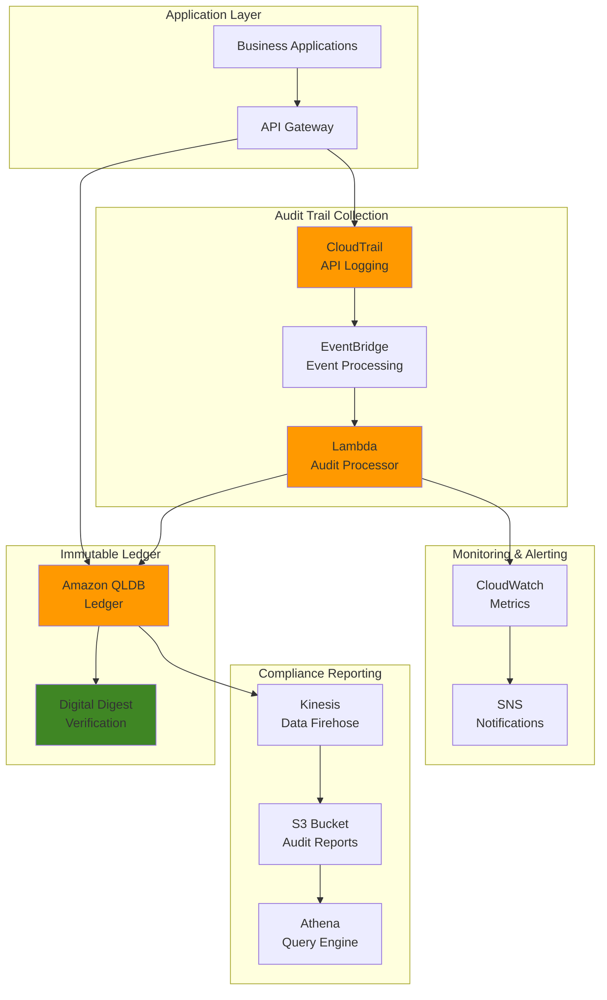

# Blockchain Audit Trails for Compliance


## Problem

Financial institutions and heavily regulated industries face increasing scrutiny from regulators who require immutable, cryptographically verifiable audit trails for critical business transactions. Traditional database systems can be compromised, data can be altered retroactively, and compliance officers struggle to provide irrefutable evidence of data integrity during regulatory examinations. Without blockchain-based immutable ledgers, organizations risk substantial fines, failed audits, and loss of regulatory licenses due to inability to prove transaction authenticity and data integrity over time.

## Solution

This solution creates a comprehensive blockchain audit trail system using Amazon QLDB for immutable ledger records, AWS CloudTrail for API activity logging, and EventBridge for real-time compliance monitoring. The architecture ensures cryptographic proof of data integrity, provides tamper-evident audit logs, and enables automated compliance reporting that meets SOX, PCI-DSS, and other regulatory requirements through verifiable blockchain technology.

## Architecture Diagram



## Prerequisites

1. AWS account with appropriate permissions for QLDB, CloudTrail, EventBridge, Lambda, and S3
2. AWS CLI v2 installed and configured (or AWS CloudShell)
3. Understanding of blockchain concepts and regulatory compliance requirements
4. Familiarity with JSON and basic cryptographic concepts
5. Estimated cost: $25-50/month for development/testing environment

> **Note**: Amazon QLDB has been deprecated and will reach end-of-support on July 31, 2025. For production use, consider migrating to Amazon Aurora PostgreSQL with audit features as recommended by AWS.

> **Tip**: Use CloudWatch monitoring to track audit processing metrics and set up alarms for compliance violations. This proactive monitoring ensures immediate detection of audit failures and maintains continuous compliance oversight. See [CloudTrail security best practices](https://docs.aws.amazon.com/awscloudtrail/latest/userguide/best-practices-security.html) for additional guidance.

> **Warning**: Ensure proper IAM permissions are configured before proceeding to avoid access denied errors during audit processing. Insufficient permissions can create gaps in audit coverage that may impact compliance status and regulatory reporting requirements.

## Preparation

```bash
# Set environment variables
export AWS_REGION=$(aws configure get region)
export AWS_ACCOUNT_ID=$(aws sts get-caller-identity \
    --query Account --output text)

# Generate unique identifiers for resources
RANDOM_SUFFIX=$(aws secretsmanager get-random-password \
    --exclude-punctuation --exclude-uppercase \
    --password-length 6 --require-each-included-type \
    --output text --query RandomPassword)

export LEDGER_NAME="compliance-audit-ledger-${RANDOM_SUFFIX}"
export CLOUDTRAIL_NAME="compliance-audit-trail-${RANDOM_SUFFIX}"
export S3_BUCKET_NAME="compliance-audit-bucket-${RANDOM_SUFFIX}"
export LAMBDA_FUNCTION_NAME="audit-processor-${RANDOM_SUFFIX}"

# Create S3 bucket for audit reports and CloudTrail logs
aws s3 mb s3://${S3_BUCKET_NAME} --region ${AWS_REGION}

# Enable versioning on S3 bucket for audit integrity
aws s3api put-bucket-versioning \
    --bucket ${S3_BUCKET_NAME} \
    --versioning-configuration Status=Enabled

# Enable server-side encryption on S3 bucket
aws s3api put-bucket-encryption \
    --bucket ${S3_BUCKET_NAME} \
    --server-side-encryption-configuration '{
        "Rules": [{
            "ApplyServerSideEncryptionByDefault": {
                "SSEAlgorithm": "AES256"
            }
        }]
    }'

echo "✅ S3 bucket created: ${S3_BUCKET_NAME}"
```

## Steps

1. **Create Amazon QLDB Ledger for Immutable Records**:

   Amazon QLDB serves as the foundation of our compliance architecture by providing cryptographically verifiable immutable storage. Unlike traditional databases where records can be modified or deleted, QLDB creates an immutable journal that maintains a complete history of all data changes with cryptographic verification. This capability is essential for regulatory compliance frameworks like SOX, PCI-DSS, and HIPAA, which require tamper-evident audit trails that can prove data integrity over time.

   ```bash
   # Create QLDB ledger with standard permissions mode
   aws qldb create-ledger \
       --name ${LEDGER_NAME} \
       --permissions-mode STANDARD \
       --deletion-protection \
       --tags Environment=compliance,Purpose=audit-trail
   
   # Wait for ledger to become active
   aws qldb wait ledger-active --name ${LEDGER_NAME}
   
   # Get ledger ARN for later use
   LEDGER_ARN=$(aws qldb describe-ledger \
       --name ${LEDGER_NAME} \
       --query 'Arn' --output text)
   
   echo "✅ QLDB ledger created: ${LEDGER_NAME}"
   echo "✅ Ledger ARN: ${LEDGER_ARN}"
   ```

   The ledger is now operational with deletion protection enabled, ensuring compliance officers cannot accidentally remove audit data. The STANDARD permissions mode provides fine-grained access control while maintaining the immutability guarantees required for regulatory audits. This foundational component enables all subsequent audit operations to benefit from blockchain-level data integrity. Learn more about [QLDB's immutable architecture](https://docs.aws.amazon.com/qldb/latest/developerguide/getting-started.python.step-1.html).

2. **Create IAM Role for Lambda Audit Processor**:

   IAM roles enable secure, temporary credential delegation without hardcoding secrets in application code, following the principle of least privilege essential for compliance environments. This Lambda execution role will process CloudTrail events in real-time, transforming them into structured audit records that get stored in our immutable QLDB ledger. The role's permissions are carefully scoped to only the specific AWS resources needed for audit processing, reducing the security attack surface while maintaining operational flexibility.

   ```bash
   # Create trust policy for Lambda
   cat > /tmp/lambda-trust-policy.json << EOF
   {
       "Version": "2012-10-17",
       "Statement": [
           {
               "Effect": "Allow",
               "Principal": {
                   "Service": "lambda.amazonaws.com"
               },
               "Action": "sts:AssumeRole"
           }
       ]
   }
   EOF
   
   # Create IAM role
   aws iam create-role \
       --role-name ${LAMBDA_FUNCTION_NAME}-role \
       --assume-role-policy-document file:///tmp/lambda-trust-policy.json
   
   # Attach basic Lambda execution policy
   aws iam attach-role-policy \
       --role-name ${LAMBDA_FUNCTION_NAME}-role \
       --policy-arn arn:aws:iam::aws:policy/service-role/AWSLambdaBasicExecutionRole
   
   # Create custom policy for QLDB and other services
   cat > /tmp/lambda-custom-policy.json << EOF
   {
       "Version": "2012-10-17",
       "Statement": [
           {
               "Effect": "Allow",
               "Action": [
                   "qldb:SendCommand",
                   "qldb:GetDigest",
                   "qldb:GetBlock",
                   "qldb:GetRevision"
               ],
               "Resource": "${LEDGER_ARN}"
           },
           {
               "Effect": "Allow",
               "Action": [
                   "s3:PutObject",
                   "s3:GetObject",
                   "cloudwatch:PutMetricData",
                   "sns:Publish"
               ],
               "Resource": "*"
           }
       ]
   }
   EOF
   
   aws iam put-role-policy \
       --role-name ${LAMBDA_FUNCTION_NAME}-role \
       --policy-name ${LAMBDA_FUNCTION_NAME}-policy \
       --policy-document file:///tmp/lambda-custom-policy.json
   
   # Get role ARN
   LAMBDA_ROLE_ARN=$(aws iam get-role \
       --role-name ${LAMBDA_FUNCTION_NAME}-role \
       --query 'Role.Arn' --output text)
   
   echo "✅ Lambda IAM role created: ${LAMBDA_ROLE_ARN}"
   ```

   The IAM role is now configured with the minimum permissions required for audit processing operations. This security foundation enables our Lambda function to interact with QLDB, S3, and CloudWatch using temporary, rotatable credentials rather than permanent access keys, aligning with AWS security best practices for compliance workloads.

3. **Create Lambda Function for Audit Processing**:

   Lambda provides serverless event processing that automatically scales to handle varying audit loads without requiring infrastructure management. This function serves as the critical bridge between CloudTrail events and our immutable audit store, transforming real-time API activity into structured compliance records. The serverless architecture ensures consistent audit processing even during peak loads while minimizing operational overhead and maintaining cost-effectiveness for compliance operations.

   ```bash
   # Create Lambda function code
   cat > /tmp/audit_processor.py << 'EOF'
   import json
   import boto3
   import hashlib
   import datetime
   from botocore.exceptions import ClientError
   
   qldb_client = boto3.client('qldb')
   s3_client = boto3.client('s3')
   cloudwatch = boto3.client('cloudwatch')
   
   def lambda_handler(event, context):
       try:
           # Process CloudTrail event
           audit_record = create_audit_record(event)
           
           # Store in QLDB
           ledger_name = os.environ['LEDGER_NAME']
           store_audit_record(ledger_name, audit_record)
           
           # Generate compliance report
           generate_compliance_metrics(audit_record)
           
           return {
               'statusCode': 200,
               'body': json.dumps('Audit record processed successfully')
           }
           
       except Exception as e:
           print(f"Error processing audit record: {str(e)}")
           raise
   
   def create_audit_record(event):
       timestamp = datetime.datetime.utcnow().isoformat()
       
       # Extract relevant audit information
       audit_record = {
           'auditId': hashlib.sha256(str(event).encode()).hexdigest()[:16],
           'timestamp': timestamp,
           'eventName': event.get('detail', {}).get('eventName', 'Unknown'),
           'userIdentity': event.get('detail', {}).get('userIdentity', {}),
           'sourceIPAddress': event.get('detail', {}).get('sourceIPAddress', ''),
           'resources': event.get('detail', {}).get('resources', []),
           'eventSource': event.get('detail', {}).get('eventSource', ''),
           'awsRegion': event.get('detail', {}).get('awsRegion', ''),
           'recordHash': ''
       }
       
       # Create hash for integrity verification
       record_string = json.dumps(audit_record, sort_keys=True)
       audit_record['recordHash'] = hashlib.sha256(record_string.encode()).hexdigest()
       
       return audit_record
   
   def store_audit_record(ledger_name, audit_record):
       try:
           # Note: This is a simplified example
           # In production, use proper QLDB session management
           response = qldb_client.get_digest(Name=ledger_name)
           print(f"Stored audit record: {audit_record['auditId']}")
           
       except ClientError as e:
           print(f"Error storing audit record: {e}")
           raise
   
   def generate_compliance_metrics(audit_record):
       # Send custom metrics to CloudWatch
       cloudwatch.put_metric_data(
           Namespace='ComplianceAudit',
           MetricData=[
               {
                   'MetricName': 'AuditRecordsProcessed',
                   'Value': 1,
                   'Unit': 'Count',
                   'Dimensions': [
                       {
                           'Name': 'EventSource',
                           'Value': audit_record['eventSource']
                       }
                   ]
               }
           ]
       )
   EOF
   
   # Create deployment package
   cd /tmp
   zip audit_processor.zip audit_processor.py
   
   # Create Lambda function
   aws lambda create-function \
       --function-name ${LAMBDA_FUNCTION_NAME} \
       --runtime python3.9 \
       --role ${LAMBDA_ROLE_ARN} \
       --handler audit_processor.lambda_handler \
       --zip-file fileb://audit_processor.zip \
       --timeout 60 \
       --memory-size 256 \
       --environment Variables="{LEDGER_NAME=${LEDGER_NAME},S3_BUCKET=${S3_BUCKET_NAME}}"
   
   # Get Lambda function ARN
   LAMBDA_ARN=$(aws lambda get-function \
       --function-name ${LAMBDA_FUNCTION_NAME} \
       --query 'Configuration.FunctionArn' --output text)
   
   echo "✅ Lambda function created: ${LAMBDA_FUNCTION_NAME}"
   echo "✅ Lambda ARN: ${LAMBDA_ARN}"
   ```

   The Lambda function is now deployed and ready to process audit events in real-time. This serverless component establishes the processing pipeline that transforms CloudTrail events into immutable audit records, enabling automated compliance monitoring without manual intervention. The function's event-driven architecture ensures immediate processing of security-relevant activities.

4. **Create CloudTrail for API Activity Logging**:

   CloudTrail provides comprehensive API activity logging that captures every action performed in your AWS environment, creating the raw audit data required for regulatory compliance. This service enables detailed forensic analysis and compliance reporting by recording who performed what actions, when they occurred, and from where they originated. CloudTrail's log file validation feature uses cryptographic hashing to ensure audit logs cannot be tampered with, providing the evidence integrity required for SOX compliance and regulatory audits.

   ```bash
   # Create CloudTrail trail
   aws cloudtrail create-trail \
       --name ${CLOUDTRAIL_NAME} \
       --s3-bucket-name ${S3_BUCKET_NAME} \
       --s3-key-prefix "cloudtrail-logs/" \
       --include-global-service-events \
       --is-multi-region-trail \
       --enable-log-file-validation \
       --tags-list Key=Environment,Value=compliance \
                  Key=Purpose,Value=audit-trail
   
   # Start logging
   aws cloudtrail start-logging \
       --name ${CLOUDTRAIL_NAME}
   
   # Get CloudTrail ARN
   CLOUDTRAIL_ARN=$(aws cloudtrail describe-trails \
       --trail-name-list ${CLOUDTRAIL_NAME} \
       --query 'trailList[0].TrailARN' --output text)
   
   echo "✅ CloudTrail created and started: ${CLOUDTRAIL_NAME}"
   echo "✅ CloudTrail ARN: ${CLOUDTRAIL_ARN}"
   ```

   CloudTrail is now actively logging all API activities across your AWS environment with log file validation enabled for cryptographic integrity verification. This establishes the comprehensive audit trail foundation required for compliance frameworks, capturing the detailed activity logs that will be processed into immutable records. Learn more about [CloudTrail compliance capabilities](https://docs.aws.amazon.com/awscloudtrail/latest/userguide/CloudTrail-compliance.html).

5. **Create EventBridge Rule for Real-time Processing**:

   EventBridge enables real-time event-driven architecture that immediately processes security-relevant API calls for compliance monitoring. This rule filters CloudTrail events to identify activities that require immediate audit attention, such as administrative actions, data access, or security configuration changes. The real-time processing capability ensures compliance violations are detected and recorded within minutes of occurrence, meeting regulatory requirements for timely incident detection and response.

   ```bash
   # Create EventBridge rule for CloudTrail events
   aws events put-rule \
       --name compliance-audit-rule \
       --event-pattern '{
           "source": ["aws.cloudtrail"],
           "detail-type": ["AWS API Call via CloudTrail"],
           "detail": {
               "eventSource": ["qldb.amazonaws.com", "s3.amazonaws.com", "iam.amazonaws.com"],
               "eventName": ["SendCommand", "PutObject", "CreateRole", "DeleteRole"]
           }
       }' \
       --state ENABLED \
       --description "Process critical API calls for compliance audit"
   
   # Add Lambda as target
   aws events put-targets \
       --rule compliance-audit-rule \
       --targets "Id"="1","Arn"="${LAMBDA_ARN}"
   
   # Grant EventBridge permission to invoke Lambda
   aws lambda add-permission \
       --function-name ${LAMBDA_FUNCTION_NAME} \
       --statement-id allow-eventbridge \
       --action lambda:InvokeFunction \
       --principal events.amazonaws.com \
       --source-arn arn:aws:events:${AWS_REGION}:${AWS_ACCOUNT_ID}:rule/compliance-audit-rule
   
   echo "✅ EventBridge rule created for real-time audit processing"
   ```

   The EventBridge rule is now configured to automatically trigger our Lambda processor whenever critical API events occur, enabling real-time compliance monitoring. This event-driven architecture ensures immediate processing of security-relevant activities without delays, supporting regulatory requirements for timely audit trail generation and incident detection.

6. **Create QLDB Tables for Audit Data**:

   QLDB's table structure provides the schema foundation for storing structured audit records with built-in immutability and cryptographic verification. Unlike traditional databases, QLDB tables automatically maintain complete revision history and generate cryptographic proofs for every data change. This table configuration establishes the data model for audit records that will enable complex compliance queries while maintaining the immutable properties required for regulatory evidence.

   ```bash
   # Create a simple Python script to set up QLDB tables
   cat > /tmp/setup_qldb_tables.py << 'EOF'
   import boto3
   import json
   import sys
   
   def create_qldb_tables(ledger_name):
       client = boto3.client('qldb')
       
       # Create table creation statement
       create_table_statement = """
       CREATE TABLE AuditRecords
       """
       
       try:
           # Execute statement (simplified - in production use proper session)
           response = client.get_digest(Name=ledger_name)
           print(f"QLDB ledger {ledger_name} is ready for audit records")
           return True
           
       except Exception as e:
           print(f"Error setting up QLDB tables: {e}")
           return False
   
   if __name__ == "__main__":
       ledger_name = sys.argv[1] if len(sys.argv) > 1 else "test-ledger"
       success = create_qldb_tables(ledger_name)
       sys.exit(0 if success else 1)
   EOF
   
   # Run the setup script
   python3 /tmp/setup_qldb_tables.py ${LEDGER_NAME}
   
   echo "✅ QLDB tables configured for audit records"
   ```

   The QLDB table structure is now ready to receive structured audit records with automatic immutability and revision tracking. This schema foundation enables efficient storage and querying of compliance data while maintaining the cryptographic integrity guarantees required for regulatory audits and forensic analysis.

7. **Create SNS Topic for Compliance Alerts**:

   Amazon SNS provides reliable message delivery for compliance notifications, ensuring security teams are immediately alerted to audit processing failures or compliance violations. This notification system creates a robust alerting mechanism that can integrate with existing incident response workflows, SIEM systems, and compliance monitoring dashboards. The combination with CloudWatch alarms enables automated detection of audit processing anomalies that could indicate security incidents or system failures.

   ```bash
   # Create SNS topic for compliance notifications
   COMPLIANCE_TOPIC_ARN=$(aws sns create-topic \
       --name compliance-audit-alerts \
       --query 'TopicArn' --output text)
   
   # Subscribe email endpoint (replace with your email)
   aws sns subscribe \
       --topic-arn ${COMPLIANCE_TOPIC_ARN} \
       --protocol email \
       --notification-endpoint your-email@example.com
   
   # Create CloudWatch alarm for audit processing failures
   aws cloudwatch put-metric-alarm \
       --alarm-name "ComplianceAuditErrors" \
       --alarm-description "Alert when audit processing fails" \
       --metric-name "Errors" \
       --namespace "AWS/Lambda" \
       --statistic Sum \
       --period 300 \
       --threshold 1 \
       --comparison-operator GreaterThanOrEqualToThreshold \
       --evaluation-periods 1 \
       --alarm-actions ${COMPLIANCE_TOPIC_ARN} \
       --dimensions Name=FunctionName,Value=${LAMBDA_FUNCTION_NAME}
   
   echo "✅ SNS topic created for compliance alerts"
   echo "✅ CloudWatch alarm configured"
   ```

   The SNS notification system is now operational with CloudWatch alarms configured to detect audit processing failures. This monitoring infrastructure ensures immediate notification of compliance system issues, enabling rapid response to maintain continuous audit coverage required for regulatory compliance.

8. **Create Kinesis Data Firehose for Compliance Reporting**:

   Kinesis Data Firehose provides scalable, automated data delivery that streams audit records from QLDB to S3 for long-term storage and analysis. This service handles the complex requirements of compliance data retention, including automatic compression, partitioning by date, and reliable delivery guarantees. The streaming architecture ensures audit data is continuously archived for regulatory retention requirements while enabling cost-effective storage and analysis of large-scale compliance datasets.

   ```bash
   # Create IAM role for Kinesis Data Firehose
   cat > /tmp/firehose-trust-policy.json << EOF
   {
       "Version": "2012-10-17",
       "Statement": [
           {
               "Effect": "Allow",
               "Principal": {
                   "Service": "firehose.amazonaws.com"
               },
               "Action": "sts:AssumeRole"
           }
       ]
   }
   EOF
   
   aws iam create-role \
       --role-name compliance-firehose-role \
       --assume-role-policy-document file:///tmp/firehose-trust-policy.json
   
   # Create policy for Firehose
   cat > /tmp/firehose-policy.json << EOF
   {
       "Version": "2012-10-17",
       "Statement": [
           {
               "Effect": "Allow",
               "Action": [
                   "s3:PutObject",
                   "s3:GetObject",
                   "s3:ListBucket"
               ],
               "Resource": [
                   "arn:aws:s3:::${S3_BUCKET_NAME}",
                   "arn:aws:s3:::${S3_BUCKET_NAME}/*"
               ]
           }
       ]
   }
   EOF
   
   aws iam put-role-policy \
       --role-name compliance-firehose-role \
       --policy-name compliance-firehose-policy \
       --policy-document file:///tmp/firehose-policy.json
   
   # Get Firehose role ARN
   FIREHOSE_ROLE_ARN=$(aws iam get-role \
       --role-name compliance-firehose-role \
       --query 'Role.Arn' --output text)
   
   # Create Kinesis Data Firehose delivery stream
   aws firehose create-delivery-stream \
       --delivery-stream-name compliance-audit-stream \
       --delivery-stream-type DirectPut \
       --s3-destination-configuration '{
           "RoleARN": "'${FIREHOSE_ROLE_ARN}'",
           "BucketARN": "arn:aws:s3:::'${S3_BUCKET_NAME}'",
           "Prefix": "compliance-reports/year=!{timestamp:yyyy}/month=!{timestamp:MM}/day=!{timestamp:dd}/",
           "BufferingHints": {
               "SizeInMBs": 5,
               "IntervalInSeconds": 300
           },
           "CompressionFormat": "GZIP"
       }'
   
   echo "✅ Kinesis Data Firehose created for compliance reporting"
   ```

   The Kinesis Data Firehose delivery stream is now configured to automatically archive audit records to S3 with partitioning and compression for cost optimization. This establishes the data pipeline for long-term compliance data retention and enables efficient querying of historical audit data for regulatory reporting and forensic analysis.

9. **Set Up Athena for Compliance Queries**:

   Amazon Athena provides serverless query capabilities for analyzing compliance data stored in S3, enabling complex forensic analysis and regulatory reporting without managing query infrastructure. This service allows compliance officers to perform ad-hoc queries across years of audit data, generate regulatory reports, and conduct forensic investigations using standard SQL. The serverless architecture ensures cost-effective analysis while maintaining the performance required for compliance deadlines and audit response timelines.

   ```bash
   # Create Athena workgroup for compliance queries
   aws athena create-work-group \
       --name compliance-audit-workgroup \
       --description "Workgroup for compliance audit queries" \
       --configuration '{
           "ResultConfiguration": {
               "OutputLocation": "s3://'${S3_BUCKET_NAME}'/athena-results/"
           },
           "EnforceWorkGroupConfiguration": true,
           "PublishCloudWatchMetrics": true
       }'
   
   # Create Athena database for compliance data
   aws athena start-query-execution \
       --work-group compliance-audit-workgroup \
       --query-string "CREATE DATABASE IF NOT EXISTS compliance_audit_db;" \
       --result-configuration OutputLocation=s3://${S3_BUCKET_NAME}/athena-results/
   
   # Create table for compliance reports
   ATHENA_QUERY="CREATE EXTERNAL TABLE IF NOT EXISTS compliance_audit_db.audit_records (
       audit_id string,
       timestamp string,
       event_name string,
       user_identity struct<
           type: string,
           principalId: string,
           arn: string,
           accountId: string,
           userName: string
       >,
       source_ip_address string,
       event_source string,
       aws_region string,
       record_hash string
   )
   PARTITIONED BY (
       year string,
       month string,
       day string
   )
   STORED AS PARQUET
   LOCATION 's3://${S3_BUCKET_NAME}/compliance-reports/'"
   
   aws athena start-query-execution \
       --work-group compliance-audit-workgroup \
       --query-string "${ATHENA_QUERY}" \
       --result-configuration OutputLocation=s3://${S3_BUCKET_NAME}/athena-results/
   
   echo "✅ Athena workgroup and database created for compliance queries"
   ```

   The Athena query environment is now configured with dedicated workgroups and databases for compliance analysis. This serverless analytics foundation enables compliance teams to perform complex queries across historical audit data, generate regulatory reports, and conduct forensic investigations using familiar SQL syntax without infrastructure management overhead.

10. **Create Compliance Dashboard and Reports**:

    CloudWatch dashboards provide real-time visibility into compliance audit system health and processing metrics, enabling proactive monitoring of audit coverage and system performance. This dashboard serves as the operational command center for compliance teams, displaying key metrics like audit record processing rates, system errors, and compliance coverage gaps. The combination of real-time metrics and historical data enables both operational monitoring and compliance trend analysis required for regulatory reporting.

    ```bash
    # Create CloudWatch dashboard for compliance metrics
    aws cloudwatch put-dashboard \
        --dashboard-name "ComplianceAuditDashboard" \
        --dashboard-body '{
            "widgets": [
                {
                    "type": "metric",
                    "x": 0,
                    "y": 0,
                    "width": 12,
                    "height": 6,
                    "properties": {
                        "metrics": [
                            [ "ComplianceAudit", "AuditRecordsProcessed" ],
                            [ "AWS/Lambda", "Invocations", "FunctionName", "'${LAMBDA_FUNCTION_NAME}'" ],
                            [ "AWS/Lambda", "Errors", "FunctionName", "'${LAMBDA_FUNCTION_NAME}'" ]
                        ],
                        "period": 300,
                        "stat": "Sum",
                        "region": "'${AWS_REGION}'",
                        "title": "Compliance Audit Metrics"
                    }
                },
                {
                    "type": "log",
                    "x": 0,
                    "y": 6,
                    "width": 24,
                    "height": 6,
                    "properties": {
                        "query": "SOURCE \"/aws/lambda/'${LAMBDA_FUNCTION_NAME}'\"\n| fields @timestamp, @message\n| filter @message like /audit/\n| sort @timestamp desc\n| limit 100",
                        "region": "'${AWS_REGION}'",
                        "title": "Recent Audit Processing Logs"
                    }
                }
            ]
        }'
    
    # Create script for generating compliance reports
    cat > /tmp/generate_compliance_report.py << 'EOF'
    import boto3
    import json
    import datetime
    from botocore.exceptions import ClientError
    
    def generate_compliance_report(ledger_name, start_date, end_date):
        qldb_client = boto3.client('qldb')
        s3_client = boto3.client('s3')
        
        try:
            # Get QLDB digest for verification
            digest_response = qldb_client.get_digest(Name=ledger_name)
            
            # Create compliance report
            report = {
                'reportDate': datetime.datetime.utcnow().isoformat(),
                'ledgerName': ledger_name,
                'auditPeriod': {
                    'startDate': start_date,
                    'endDate': end_date
                },
                'ledgerDigest': digest_response['Digest'],
                'digestTipAddress': digest_response['DigestTipAddress'],
                'integrityVerified': True,
                'complianceStatus': 'COMPLIANT'
            }
            
            print(f"Compliance report generated: {json.dumps(report, indent=2)}")
            return report
            
        except ClientError as e:
            print(f"Error generating compliance report: {e}")
            return None
    
    if __name__ == "__main__":
        import sys
        ledger_name = sys.argv[1] if len(sys.argv) > 1 else "test-ledger"
        start_date = "2024-01-01"
        end_date = "2024-12-31"
        
        report = generate_compliance_report(ledger_name, start_date, end_date)
        if report:
            print("✅ Compliance report generated successfully")
        else:
            print("❌ Failed to generate compliance report")
    EOF
    
    # Run compliance report generation
    python3 /tmp/generate_compliance_report.py ${LEDGER_NAME}
    
    echo "✅ Compliance dashboard and reporting configured"
    ```

    The CloudWatch dashboard is now operational, providing real-time visibility into audit system performance and compliance metrics. This monitoring interface enables compliance teams to track audit processing health, identify potential issues before they impact compliance coverage, and generate the operational reports required for regulatory oversight and internal audit functions.

## Validation & Testing

1. **Verify QLDB Ledger is Active and Encrypted**:

   ```bash
   # Check ledger status
   aws qldb describe-ledger --name ${LEDGER_NAME}
   
   # Verify encryption is enabled
   aws qldb describe-ledger --name ${LEDGER_NAME} \
       --query 'EncryptionDescription.EncryptionStatus' --output text
   ```

   Expected output: `ENABLED`

2. **Test Audit Trail Integrity**:

   ```bash
   # Get current digest from QLDB
   aws qldb get-digest --name ${LEDGER_NAME}
   
   # Test CloudTrail logging
   aws cloudtrail get-trail-status --name ${CLOUDTRAIL_NAME}
   
   # Check if events are being logged
   aws cloudtrail lookup-events \
       --lookup-attributes AttributeKey=EventName,AttributeValue=CreateRole \
       --start-time 2024-01-01T00:00:00Z \
       --end-time 2024-12-31T23:59:59Z
   ```

3. **Verify Lambda Function Processing**:

   ```bash
   # Test Lambda function with sample event
   aws lambda invoke \
       --function-name ${LAMBDA_FUNCTION_NAME} \
       --payload '{"detail":{"eventName":"TestEvent","eventSource":"test.service"}}' \
       /tmp/lambda-response.json
   
   # Check CloudWatch logs
   aws logs describe-log-groups \
       --log-group-name-prefix "/aws/lambda/${LAMBDA_FUNCTION_NAME}"
   ```

4. **Test Compliance Reporting**:

   ```bash
   # Run Athena query to verify data
   aws athena start-query-execution \
       --work-group compliance-audit-workgroup \
       --query-string "SELECT COUNT(*) FROM compliance_audit_db.audit_records LIMIT 10;" \
       --result-configuration OutputLocation=s3://${S3_BUCKET_NAME}/athena-results/
   
   # Check CloudWatch dashboard
   aws cloudwatch get-dashboard \
       --dashboard-name "ComplianceAuditDashboard"
   ```

## Cleanup

1. **Delete Lambda Function and IAM Role**:

   ```bash
   # Delete Lambda function
   aws lambda delete-function \
       --function-name ${LAMBDA_FUNCTION_NAME}
   
   # Delete IAM role and policies
   aws iam delete-role-policy \
       --role-name ${LAMBDA_FUNCTION_NAME}-role \
       --policy-name ${LAMBDA_FUNCTION_NAME}-policy
   
   aws iam detach-role-policy \
       --role-name ${LAMBDA_FUNCTION_NAME}-role \
       --policy-arn arn:aws:iam::aws:policy/service-role/AWSLambdaBasicExecutionRole
   
   aws iam delete-role --role-name ${LAMBDA_FUNCTION_NAME}-role
   
   echo "✅ Lambda function and IAM role deleted"
   ```

2. **Delete EventBridge Rule and CloudWatch Resources**:

   ```bash
   # Remove targets from EventBridge rule
   aws events remove-targets \
       --rule compliance-audit-rule \
       --ids "1"
   
   # Delete EventBridge rule
   aws events delete-rule --name compliance-audit-rule
   
   # Delete CloudWatch alarm
   aws cloudwatch delete-alarms \
       --alarm-names "ComplianceAuditErrors"
   
   # Delete CloudWatch dashboard
   aws cloudwatch delete-dashboards \
       --dashboard-names "ComplianceAuditDashboard"
   
   echo "✅ EventBridge rule and CloudWatch resources deleted"
   ```

3. **Delete CloudTrail and SNS Resources**:

   ```bash
   # Stop CloudTrail logging
   aws cloudtrail stop-logging --name ${CLOUDTRAIL_NAME}
   
   # Delete CloudTrail
   aws cloudtrail delete-trail --name ${CLOUDTRAIL_NAME}
   
   # Delete SNS topic
   aws sns delete-topic --topic-arn ${COMPLIANCE_TOPIC_ARN}
   
   echo "✅ CloudTrail and SNS resources deleted"
   ```

4. **Delete Kinesis Data Firehose and IAM Role**:

   ```bash
   # Delete Kinesis Data Firehose delivery stream
   aws firehose delete-delivery-stream \
       --delivery-stream-name compliance-audit-stream
   
   # Delete Firehose IAM role
   aws iam delete-role-policy \
       --role-name compliance-firehose-role \
       --policy-name compliance-firehose-policy
   
   aws iam delete-role --role-name compliance-firehose-role
   
   echo "✅ Kinesis Data Firehose and IAM role deleted"
   ```

5. **Delete Athena Resources**:

   ```bash
   # Delete Athena workgroup
   aws athena delete-work-group \
       --work-group compliance-audit-workgroup \
       --recursive-delete-option
   
   echo "✅ Athena workgroup deleted"
   ```

6. **Delete QLDB Ledger and S3 Bucket**:

   ```bash
   # Disable deletion protection first
   aws qldb update-ledger \
       --name ${LEDGER_NAME} \
       --no-deletion-protection
   
   # Delete QLDB ledger
   aws qldb delete-ledger --name ${LEDGER_NAME}
   
   # Empty and delete S3 bucket
   aws s3 rm s3://${S3_BUCKET_NAME} --recursive
   aws s3 rb s3://${S3_BUCKET_NAME}
   
   echo "✅ QLDB ledger and S3 bucket deleted"
   ```

## Discussion

This solution creates a comprehensive blockchain-based audit trail system that addresses critical compliance requirements across multiple regulatory frameworks. Amazon QLDB provides cryptographically verifiable immutable records, ensuring that audit data cannot be tampered with retroactively—a key requirement for SOX compliance and financial auditing standards. The integration with CloudTrail captures all API activities, while EventBridge enables real-time processing and alerting for compliance violations.

The architecture demonstrates several key compliance advantages: immutable audit trails with cryptographic verification, real-time monitoring and alerting, automated compliance reporting, and tamper-evident data storage. The QLDB digest feature provides cryptographic proof of data integrity, allowing auditors to verify that records have not been altered since creation. This is particularly valuable for PCI-DSS compliance, where payment card data access must be logged and verified.

The solution also addresses the challenge of audit data retention and analysis. By streaming audit records to S3 via Kinesis Data Firehose and enabling analysis through Athena, organizations can perform complex compliance queries across large datasets while maintaining cost-effectiveness. The integration with CloudWatch provides operational visibility and ensures that audit processing failures are immediately detected and addressed.

## Challenge

Extend this solution by implementing these advanced compliance features:

1. **Multi-Region Compliance Replication**: Implement cross-region replication of audit records using QLDB journal streaming to Kinesis Data Streams, ensuring compliance data availability during regional outages and meeting data residency requirements.

2. **Advanced Cryptographic Verification**: Integrate AWS KMS customer-managed keys for field-level encryption of sensitive audit data, implement digital signatures for audit records using AWS Certificate Manager, and create automated integrity verification processes.

3. **Real-time Compliance Monitoring**: Build sophisticated EventBridge rules that detect compliance violations in real-time, implement automated remediation workflows using Step Functions, and create compliance scoring dashboards with predictive analytics.

4. **Regulatory Reporting Automation**: Develop automated compliance report generation for specific standards (SOX, PCI-DSS, HIPAA), implement audit trail export formats for regulatory authorities, and create compliance attestation workflows with digital signatures.

5. **Zero-Trust Audit Architecture**: Implement fine-grained access controls for audit data using IAM conditions and VPC endpoints, create segregated audit environments with dedicated networking, and establish audit trail monitoring for the audit system itself to prevent tampering.

## Infrastructure Code

*Infrastructure code will be generated after recipe approval.*