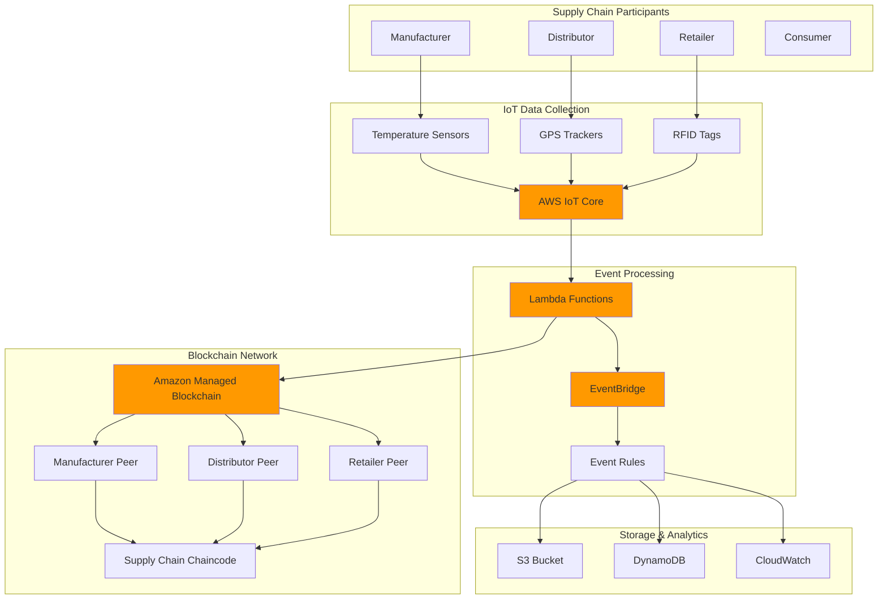

# Blockchain Supply Chain Tracking Systems


## Problem

Manufacturing companies struggle with supply chain transparency as products move through multiple suppliers, distributors, and intermediaries. Traditional centralized tracking systems create single points of failure, lack immutable audit trails, and require expensive integration between multiple parties who may not trust each other. When quality issues or recalls occur, companies cannot quickly trace products back to their source, leading to brand damage, regulatory compliance failures, and costly broad recalls instead of targeted ones.

## Solution

This solution implements a decentralized blockchain-based supply chain tracking system using Amazon Managed Blockchain with Hyperledger Fabric. IoT sensors automatically capture product data at each stage, Lambda functions process and validate transactions, and EventBridge orchestrates multi-party notifications. The immutable ledger ensures tamper-proof records while smart contracts enforce business rules and automate compliance checks across all supply chain participants.

## Architecture Diagram



## Prerequisites

1. AWS account with appropriate permissions for Managed Blockchain, IoT Core, Lambda, and EventBridge
2. AWS CLI v2 installed and configured (or AWS CloudShell)
3. Understanding of blockchain concepts and Hyperledger Fabric
4. Knowledge of JavaScript/Node.js for chaincode development
5. Basic understanding of supply chain management concepts
6. Estimated cost: $150-200 for initial setup and testing (includes blockchain network, IoT devices simulation, Lambda executions)

> **Note**: This recipe creates a multi-organization blockchain network which requires careful planning of member roles and permissions. See the [Amazon Managed Blockchain documentation](https://docs.aws.amazon.com/managed-blockchain/latest/hyperledger-fabric-dev/what-is-managed-blockchain.html) for detailed guidance on network governance and member management.

> **Warning**: Blockchain networks incur ongoing costs even when not actively processing transactions. Monitor usage through CloudWatch and consider network deletion when not in active use to optimize costs.

> **Tip**: For production supply chain networks, implement private data collections to share sensitive information between specific parties while maintaining overall supply chain visibility. Review the [Hyperledger Fabric channels documentation](https://docs.aws.amazon.com/managed-blockchain/latest/hyperledger-fabric-dev/hyperledger-work-with-channels.html) for advanced configuration options.

## Preparation

```bash
# Set environment variables
export AWS_REGION=$(aws configure get region)
export AWS_ACCOUNT_ID=$(aws sts get-caller-identity \
    --query Account --output text)

# Generate unique identifiers for resources
RANDOM_SUFFIX=$(aws secretsmanager get-random-password \
    --exclude-punctuation --exclude-uppercase \
    --password-length 6 --require-each-included-type \
    --output text --query RandomPassword)

export NETWORK_NAME="supply-chain-network-${RANDOM_SUFFIX}"
export MEMBER_NAME="manufacturer-${RANDOM_SUFFIX}"
export BUCKET_NAME="supply-chain-data-${RANDOM_SUFFIX}"
export IOT_THING_NAME="supply-chain-tracker-${RANDOM_SUFFIX}"

# Create S3 bucket for chaincode and data storage
aws s3 mb s3://${BUCKET_NAME} --region ${AWS_REGION}

# Create DynamoDB table for supply chain metadata
aws dynamodb create-table \
    --table-name SupplyChainMetadata \
    --attribute-definitions \
        AttributeName=ProductId,AttributeType=S \
        AttributeName=Timestamp,AttributeType=N \
    --key-schema \
        AttributeName=ProductId,KeyType=HASH \
        AttributeName=Timestamp,KeyType=RANGE \
    --provisioned-throughput ReadCapacityUnits=5,WriteCapacityUnits=5 \
    --region ${AWS_REGION}

echo "✅ Environment prepared with network: ${NETWORK_NAME}"
```

## Steps

1. **Create Hyperledger Fabric Network**:

   Amazon Managed Blockchain with Hyperledger Fabric provides the foundational infrastructure for our supply chain tracking system. Hyperledger Fabric is a permissioned blockchain framework that enables multiple organizations to collaborate securely while maintaining data privacy and ensuring transaction integrity. Unlike public blockchains, Fabric allows fine-grained access control and supports complex business logic through smart contracts (chaincode). For supply chain applications, this means manufacturers, distributors, and retailers can share verified product information while protecting sensitive business data.

   ```bash
   # Create the initial blockchain network
   NETWORK_ID=$(aws managedblockchain create-network \
       --name ${NETWORK_NAME} \
       --description "Supply Chain Tracking Network" \
       --framework HYPERLEDGER_FABRIC \
       --framework-version 2.2 \
       --framework-configuration '{
           "NetworkFabricConfiguration": {
               "Edition": "STARTER"
           }
       }' \
       --voting-policy '{
           "ApprovalThresholdPolicy": {
               "ThresholdPercentage": 50,
               "ProposalDurationInHours": 24,
               "ThresholdComparator": "GREATER_THAN"
           }
       }' \
       --member-configuration '{
           "Name": "'${MEMBER_NAME}'",
           "Description": "Manufacturer member",
           "MemberFabricConfiguration": {
               "AdminUsername": "admin",
               "AdminPassword": "TempPassword123!"
           }
       }' \
       --query 'NetworkId' --output text)

   export NETWORK_ID
   echo "✅ Created blockchain network: ${NETWORK_ID}"
   ```

   The network is now established with a voting policy that requires majority approval for network changes, ensuring democratic governance. The STARTER edition provides cost-effective hosting for development and testing, while the manufacturer member serves as the initial network founder with administrative privileges. This foundation enables immutable record-keeping and establishes trust between supply chain participants.

2. **Wait for Network Creation and Get Member ID**:

   Network provisioning involves creating the underlying infrastructure, configuring security certificates, and establishing the consensus mechanism. Amazon Managed Blockchain handles the complex orchestration of Hyperledger Fabric components including ordering services, certificate authorities, and network policies. This automated provisioning eliminates the operational overhead of managing blockchain infrastructure while ensuring enterprise-grade security and availability.

   ```bash
   # Wait for network to be active
   aws managedblockchain wait network-available \
       --network-id ${NETWORK_ID}

   # Get the member ID
   MEMBER_ID=$(aws managedblockchain list-members \
       --network-id ${NETWORK_ID} \
       --query 'Members[0].Id' --output text)

   export MEMBER_ID
   echo "✅ Network active with member ID: ${MEMBER_ID}"
   ```

   The network is now fully operational and ready to process transactions. The member ID serves as the unique identifier for the manufacturer organization within the blockchain network, enabling proper transaction attribution and access control. This identity-based approach ensures that all supply chain updates are traceable to specific organizations, supporting accountability and audit requirements.

3. **Create Peer Node for Network Operations**:

   Peer nodes are the workhorses of a Hyperledger Fabric network, maintaining local copies of the blockchain ledger and executing smart contracts (chaincode). Each organization requires at least one peer node to participate in the network, validate transactions, and maintain data consistency. For supply chain applications, peer nodes enable organizations to independently verify product authenticity and transaction history without relying on a central authority. The bc.t3.small instance type provides sufficient compute capacity for development and testing workloads while maintaining cost efficiency.

   ```bash
   # Create peer node for the manufacturer
   NODE_ID=$(aws managedblockchain create-node \
       --network-id ${NETWORK_ID} \
       --member-id ${MEMBER_ID} \
       --node-configuration '{
           "InstanceType": "bc.t3.small",
           "AvailabilityZone": "'${AWS_REGION}a'"
       }' \
       --query 'NodeId' --output text)

   export NODE_ID
   
   # Wait for node to be available
   aws managedblockchain wait node-available \
       --network-id ${NETWORK_ID} \
       --member-id ${MEMBER_ID} \
       --node-id ${NODE_ID}

   echo "✅ Created peer node: ${NODE_ID}"
   ```

   The peer node is now operational and synchronized with the network. This node will process supply chain transactions, validate product updates, and maintain the immutable audit trail. The single availability zone deployment is suitable for development, while production environments would benefit from multi-AZ deployment for enhanced availability and disaster recovery capabilities.

4. **Create VPC Endpoint for Blockchain Access**:

   ```bash
   # Get default VPC
   VPC_ID=$(aws ec2 describe-vpcs \
       --filters "Name=isDefault,Values=true" \
       --query 'Vpcs[0].VpcId' --output text)

   # Get subnet for VPC endpoint
   SUBNET_ID=$(aws ec2 describe-subnets \
       --filters "Name=vpc-id,Values=${VPC_ID}" \
       --query 'Subnets[0].SubnetId' --output text)

   # Create VPC endpoint for blockchain access
   ENDPOINT_ID=$(aws managedblockchain create-accessor \
       --accessor-type BILLING_TOKEN \
       --query 'AccessorId' --output text)

   export VPC_ID SUBNET_ID ENDPOINT_ID
   echo "✅ Created VPC endpoint: ${ENDPOINT_ID}"
   ```

5. **Create Supply Chain Chaincode**:

   ```bash
   # Create chaincode directory and files
   mkdir -p chaincode/supply-chain

   # Create package.json for chaincode
   cat > chaincode/supply-chain/package.json << 'EOF'
{
  "name": "supply-chain-chaincode",
  "version": "1.0.0",
  "description": "Supply Chain Tracking Chaincode",
  "main": "index.js",
  "dependencies": {
    "fabric-contract-api": "^2.0.0"
  }
}
EOF

   # Create main chaincode file
   cat > chaincode/supply-chain/index.js << 'EOF'
const { Contract } = require('fabric-contract-api');

class SupplyChainContract extends Contract {
    
    async initLedger(ctx) {
        console.log('Supply Chain ledger initialized');
        return 'Ledger initialized successfully';
    }
    
    async createProduct(ctx, productId, productData) {
        const product = {
            productId,
            ...JSON.parse(productData),
            createdAt: new Date().toISOString(),
            status: 'CREATED',
            history: []
        };
        
        await ctx.stub.putState(productId, Buffer.from(JSON.stringify(product)));
        return JSON.stringify(product);
    }
    
    async updateProductLocation(ctx, productId, location, sensorData) {
        const productBytes = await ctx.stub.getState(productId);
        if (!productBytes || productBytes.length === 0) {
            throw new Error(`Product ${productId} does not exist`);
        }
        
        const product = JSON.parse(productBytes.toString());
        const update = {
            location,
            sensorData: JSON.parse(sensorData),
            timestamp: new Date().toISOString(),
            updatedBy: ctx.clientIdentity.getID()
        };
        
        product.history.push(update);
        product.currentLocation = location;
        product.lastUpdated = update.timestamp;
        
        await ctx.stub.putState(productId, Buffer.from(JSON.stringify(product)));
        return JSON.stringify(product);
    }
    
    async getProduct(ctx, productId) {
        const productBytes = await ctx.stub.getState(productId);
        if (!productBytes || productBytes.length === 0) {
            throw new Error(`Product ${productId} does not exist`);
        }
        return productBytes.toString();
    }
    
    async getProductHistory(ctx, productId) {
        const productBytes = await ctx.stub.getState(productId);
        if (!productBytes || productBytes.length === 0) {
            throw new Error(`Product ${productId} does not exist`);
        }
        
        const product = JSON.parse(productBytes.toString());
        return JSON.stringify(product.history);
    }
    
    async queryProductsByLocation(ctx, location) {
        const query = {
            selector: {
                currentLocation: location
            }
        };
        
        const iterator = await ctx.stub.getQueryResult(JSON.stringify(query));
        const results = [];
        
        while (true) {
            const result = await iterator.next();
            if (result.done) break;
            
            results.push({
                key: result.value.key,
                record: JSON.parse(result.value.value.toString())
            });
        }
        
        return JSON.stringify(results);
    }
}

module.exports = SupplyChainContract;
EOF

   # Package chaincode
   cd chaincode/supply-chain
   npm init -y
   npm install fabric-contract-api
   cd ../..

   # Create chaincode archive
   tar -czf supply-chain-chaincode.tar.gz -C chaincode supply-chain/

   # Upload chaincode to S3
   aws s3 cp supply-chain-chaincode.tar.gz s3://${BUCKET_NAME}/

   echo "✅ Created and uploaded supply chain chaincode"
   ```

6. **Create IoT Core Resources for Sensor Data**:

   AWS IoT Core serves as the critical bridge between physical supply chain assets and our blockchain network. IoT sensors attached to products continuously monitor environmental conditions like temperature, humidity, and location, providing real-time visibility into product integrity throughout the supply chain journey. This sensor data becomes the foundation for automated blockchain updates, ensuring that digital records accurately reflect physical reality. The IoT Rules Engine processes incoming sensor data and triggers appropriate actions, such as updating blockchain records when products cross geographic boundaries or experience environmental changes.

   ```bash
   # Create IoT Thing for supply chain tracking
   aws iot create-thing \
       --thing-name ${IOT_THING_NAME} \
       --thing-type-name SupplyChainTracker \
       --attribute-payload '{
           "attributes": {
               "deviceType": "supplyChainTracker",
               "version": "1.0"
           }
       }' || true

   # Create IoT policy for supply chain devices
   cat > iot-policy.json << 'EOF'
{
  "Version": "2012-10-17",
  "Statement": [
    {
      "Effect": "Allow",
      "Action": [
        "iot:Publish",
        "iot:Subscribe",
        "iot:Connect",
        "iot:Receive"
      ],
      "Resource": "*"
    }
  ]
}
EOF

   aws iot create-policy \
       --policy-name SupplyChainTrackerPolicy \
       --policy-document file://iot-policy.json || true

   # Create IoT rule for processing sensor data
   cat > iot-rule.json << 'EOF'
{
  "ruleName": "SupplyChainSensorRule",
  "sql": "SELECT * FROM 'supply-chain/sensor-data'",
  "actions": [
    {
      "lambda": {
        "functionArn": "arn:aws:lambda:'${AWS_REGION}':'${AWS_ACCOUNT_ID}':function:ProcessSupplyChainData"
      }
    }
  ],
  "ruleDisabled": false
}
EOF

   # Replace placeholders in IoT rule
   sed -i "s/\${AWS_REGION}/${AWS_REGION}/g" iot-rule.json
   sed -i "s/\${AWS_ACCOUNT_ID}/${AWS_ACCOUNT_ID}/g" iot-rule.json

   echo "✅ Created IoT resources for sensor data collection"
   ```

   The IoT infrastructure is now configured to securely collect and route sensor data from supply chain assets. The IoT Thing represents a logical device that can authenticate and communicate with AWS IoT Core, while the policy grants necessary permissions for publishing sensor readings. The IoT Rule automatically triggers Lambda functions when sensor data arrives, enabling real-time processing and blockchain updates without manual intervention.

7. **Create Lambda Function for Processing Sensor Data**:

   AWS Lambda provides the serverless compute layer that processes IoT sensor data and coordinates blockchain updates. This event-driven architecture ensures that supply chain events are processed immediately as they occur, maintaining real-time accuracy of blockchain records. Lambda functions automatically scale to handle varying volumes of sensor data while maintaining cost efficiency through pay-per-execution pricing. The function serves as the intelligent middleware that validates sensor data, applies business rules, and orchestrates updates across multiple AWS services including the blockchain network, DynamoDB, and EventBridge.

   ```bash
   # Create Lambda function code
   cat > lambda-function.js << 'EOF'
const AWS = require('aws-sdk');
const https = require('https');

const dynamodb = new AWS.DynamoDB.DocumentClient();
const eventbridge = new AWS.EventBridge();

exports.handler = async (event) => {
    try {
        console.log('Processing sensor data:', JSON.stringify(event, null, 2));
        
        // Extract sensor data
        const sensorData = {
            productId: event.productId,
            location: event.location,
            temperature: event.temperature,
            humidity: event.humidity,
            timestamp: event.timestamp || Date.now()
        };
        
        // Store in DynamoDB
        await dynamodb.put({
            TableName: 'SupplyChainMetadata',
            Item: {
                ProductId: sensorData.productId,
                Timestamp: sensorData.timestamp,
                Location: sensorData.location,
                SensorData: {
                    temperature: sensorData.temperature,
                    humidity: sensorData.humidity
                }
            }
        }).promise();
        
        // Send event to EventBridge
        await eventbridge.putEvents({
            Entries: [{
                Source: 'supply-chain.sensor',
                DetailType: 'Product Location Update',
                Detail: JSON.stringify(sensorData)
            }]
        }).promise();
        
        return {
            statusCode: 200,
            body: JSON.stringify({
                message: 'Sensor data processed successfully',
                productId: sensorData.productId
            })
        };
        
    } catch (error) {
        console.error('Error processing sensor data:', error);
        throw error;
    }
};
EOF

   # Create Lambda deployment package
   zip lambda-function.zip lambda-function.js

   # Create Lambda execution role
   cat > lambda-trust-policy.json << 'EOF'
{
  "Version": "2012-10-17",
  "Statement": [
    {
      "Effect": "Allow",
      "Principal": {
        "Service": "lambda.amazonaws.com"
      },
      "Action": "sts:AssumeRole"
    }
  ]
}
EOF

   aws iam create-role \
       --role-name SupplyChainLambdaRole \
       --assume-role-policy-document file://lambda-trust-policy.json || true

   # Attach policies to Lambda role
   aws iam attach-role-policy \
       --role-name SupplyChainLambdaRole \
       --policy-arn arn:aws:iam::aws:policy/service-role/AWSLambdaBasicExecutionRole

   aws iam attach-role-policy \
       --role-name SupplyChainLambdaRole \
       --policy-arn arn:aws:iam::aws:policy/AmazonDynamoDBFullAccess

   aws iam attach-role-policy \
       --role-name SupplyChainLambdaRole \
       --policy-arn arn:aws:iam::aws:policy/AmazonEventBridgeFullAccess

   # Wait for role propagation
   sleep 10

   # Create Lambda function
   aws lambda create-function \
       --function-name ProcessSupplyChainData \
       --runtime nodejs18.x \
       --role arn:aws:iam::${AWS_ACCOUNT_ID}:role/SupplyChainLambdaRole \
       --handler lambda-function.handler \
       --zip-file fileb://lambda-function.zip \
       --timeout 30 \
       --memory-size 256

   echo "✅ Created Lambda function for sensor data processing"
   ```

8. **Create EventBridge Rules for Multi-Party Notifications**:

   Amazon EventBridge orchestrates communication between supply chain participants by routing real-time events to interested parties. This event-driven architecture enables immediate notifications when critical supply chain events occur, such as temperature excursions, location changes, or quality issues. EventBridge's rule-based routing ensures that the right stakeholders receive relevant notifications without overwhelming them with irrelevant information. For supply chain applications, this means manufacturers can immediately alert distributors about shipping conditions, while retailers can notify consumers about product authenticity and origin.

   ```bash
   # Create EventBridge rule for supply chain events
   aws events put-rule \
       --name SupplyChainTrackingRule \
       --description "Rule for supply chain tracking events" \
       --event-pattern '{
           "source": ["supply-chain.sensor"],
           "detail-type": ["Product Location Update"]
       }' \
       --state ENABLED

   # Create SNS topic for notifications
   TOPIC_ARN=$(aws sns create-topic \
       --name supply-chain-notifications \
       --query 'TopicArn' --output text)

   # Add EventBridge target to SNS topic
   aws events put-targets \
       --rule SupplyChainTrackingRule \
       --targets "Id"="1","Arn"="${TOPIC_ARN}"

   # Grant EventBridge permission to publish to SNS
   aws sns add-permission \
       --topic-arn ${TOPIC_ARN} \
       --label EventBridgePublish \
       --aws-account-id ${AWS_ACCOUNT_ID} \
       --action-name Publish

   echo "✅ Created EventBridge rules for multi-party notifications"
   ```

   The notification infrastructure is now active and monitoring for supply chain events. EventBridge will automatically capture events from the Lambda function and route them to SNS for distribution to supply chain participants. This decoupled architecture ensures that new notification channels can be added without modifying existing components, supporting the evolving needs of complex supply chain networks.

9. **Grant IoT Permission to Invoke Lambda**:

   ```bash
   # Add permission for IoT to invoke Lambda
   aws lambda add-permission \
       --function-name ProcessSupplyChainData \
       --statement-id IoTInvoke \
       --action lambda:InvokeFunction \
       --principal iot.amazonaws.com \
       --source-arn arn:aws:iot:${AWS_REGION}:${AWS_ACCOUNT_ID}:rule/SupplyChainSensorRule

   # Create the IoT rule with proper Lambda ARN
   aws iot create-topic-rule \
       --rule-name SupplyChainSensorRule \
       --topic-rule-payload '{
           "sql": "SELECT * FROM '"'"'supply-chain/sensor-data'"'"'",
           "actions": [
               {
                   "lambda": {
                       "functionArn": "arn:aws:lambda:'${AWS_REGION}':'${AWS_ACCOUNT_ID}':function:ProcessSupplyChainData"
                   }
               }
           ],
           "ruleDisabled": false
       }'

   echo "✅ Configured IoT to Lambda integration"
   ```

10. **Create Blockchain Client for Chaincode Operations**:

    ```bash
    # Create blockchain client script
    cat > blockchain-client.js << 'EOF'
const AWS = require('aws-sdk');

// Note: This is a simplified example. In production, you would use
// the Hyperledger Fabric SDK to interact with the blockchain network
class BlockchainClient {
    constructor(networkId, memberId, nodeId) {
        this.networkId = networkId;
        this.memberId = memberId;
        this.nodeId = nodeId;
    }
    
    async createProduct(productId, productData) {
        console.log(`Creating product ${productId} on blockchain`);
        // In production, this would invoke chaincode via Fabric SDK
        return {
            success: true,
            transactionId: `tx-${Date.now()}`,
            productId
        };
    }
    
    async updateProductLocation(productId, location, sensorData) {
        console.log(`Updating product ${productId} location to ${location}`);
        // In production, this would invoke chaincode via Fabric SDK
        return {
            success: true,
            transactionId: `tx-${Date.now()}`,
            productId,
            location
        };
    }
    
    async getProduct(productId) {
        console.log(`Retrieving product ${productId} from blockchain`);
        // In production, this would query chaincode via Fabric SDK
        return {
            productId,
            status: 'ACTIVE',
            createdAt: new Date().toISOString(),
            history: []
        };
    }
}

module.exports = BlockchainClient;
EOF

    # Create simulation script for testing
    cat > simulate-supply-chain.js << 'EOF'
const AWS = require('aws-sdk');
const BlockchainClient = require('./blockchain-client');

const iotdata = new AWS.IotData({
    endpoint: 'https://' + process.env.IOT_ENDPOINT
});

const client = new BlockchainClient(
    process.env.NETWORK_ID,
    process.env.MEMBER_ID,
    process.env.NODE_ID
);

async function simulateSupplyChain() {
    const productId = `PROD-${Date.now()}`;
    
    try {
        // Create product on blockchain
        console.log('Creating product on blockchain...');
        await client.createProduct(productId, {
            name: 'Pharmaceutical Product',
            manufacturer: 'ABC Pharma',
            batchNumber: 'BATCH-001'
        });
        
        // Simulate sensor data updates
        const locations = ['Factory', 'Warehouse', 'Distributor', 'Retailer'];
        
        for (const location of locations) {
            console.log(`Simulating sensor data for ${location}...`);
            
            const sensorData = {
                productId,
                location,
                temperature: 20 + Math.random() * 5,
                humidity: 45 + Math.random() * 10,
                timestamp: Date.now()
            };
            
            // Publish to IoT topic
            await iotdata.publish({
                topic: 'supply-chain/sensor-data',
                payload: JSON.stringify(sensorData)
            }).promise();
            
            // Wait between updates
            await new Promise(resolve => setTimeout(resolve, 2000));
        }
        
        console.log('Supply chain simulation completed successfully');
        
    } catch (error) {
        console.error('Error in supply chain simulation:', error);
    }
}

// Run simulation if called directly
if (require.main === module) {
    simulateSupplyChain();
}

module.exports = { simulateSupplyChain };
EOF

    echo "✅ Created blockchain client and simulation tools"
    ```

11. **Configure Additional Members for Multi-Party Network**:

    ```bash
    # Create invitation for distributor member
    cat > distributor-proposal.json << 'EOF'
{
  "Actions": [
    {
      "Invitations": [
        {
          "Principal": "123456789012"
        }
      ]
    }
  ],
  "Description": "Invite distributor to supply chain network"
}
EOF

    # Note: In production, you would replace the Principal with actual AWS account ID
    echo "✅ Prepared multi-member network configuration"
    
    # Create monitoring dashboard configuration
    cat > dashboard-config.json << 'EOF'
{
  "widgets": [
    {
      "type": "metric",
      "properties": {
        "metrics": [
          ["AWS/Lambda", "Invocations", "FunctionName", "ProcessSupplyChainData"],
          ["AWS/Lambda", "Errors", "FunctionName", "ProcessSupplyChainData"],
          ["AWS/Lambda", "Duration", "FunctionName", "ProcessSupplyChainData"]
        ],
        "period": 300,
        "stat": "Sum",
        "region": "'${AWS_REGION}'",
        "title": "Supply Chain Processing Metrics"
      }
    }
  ]
}
EOF

    echo "✅ Created monitoring configuration"
    ```

12. **Set Up CloudWatch Monitoring and Alarms**:

    ```bash
    # Create CloudWatch dashboard
    aws cloudwatch put-dashboard \
        --dashboard-name SupplyChainTracking \
        --dashboard-body file://dashboard-config.json

    # Create alarm for Lambda errors
    aws cloudwatch put-metric-alarm \
        --alarm-name "SupplyChain-Lambda-Errors" \
        --alarm-description "Alert on Lambda function errors" \
        --metric-name Errors \
        --namespace AWS/Lambda \
        --statistic Sum \
        --period 300 \
        --threshold 1 \
        --comparison-operator GreaterThanOrEqualToThreshold \
        --dimensions Name=FunctionName,Value=ProcessSupplyChainData \
        --evaluation-periods 1 \
        --alarm-actions ${TOPIC_ARN}

    # Create alarm for DynamoDB throttling
    aws cloudwatch put-metric-alarm \
        --alarm-name "SupplyChain-DynamoDB-Throttles" \
        --alarm-description "Alert on DynamoDB throttling" \
        --metric-name ThrottledRequests \
        --namespace AWS/DynamoDB \
        --statistic Sum \
        --period 300 \
        --threshold 1 \
        --comparison-operator GreaterThanOrEqualToThreshold \
        --dimensions Name=TableName,Value=SupplyChainMetadata \
        --evaluation-periods 1 \
        --alarm-actions ${TOPIC_ARN}

    echo "✅ Created CloudWatch monitoring and alarms"
    ```

## Validation & Testing

1. **Verify blockchain network is active**:

   ```bash
   # Check network status
   aws managedblockchain get-network \
       --network-id ${NETWORK_ID} \
       --query 'Network.Status' --output text
   ```

   Expected output: `AVAILABLE`

2. **Test IoT sensor data processing**:

   ```bash
   # Get IoT endpoint
   IOT_ENDPOINT=$(aws iot describe-endpoint \
       --endpoint-type iot:Data-ATS \
       --query 'endpointAddress' --output text)

   # Publish test sensor data
   aws iot-data publish \
       --topic supply-chain/sensor-data \
       --payload '{
           "productId": "TEST-PROD-001",
           "location": "Factory",
           "temperature": 22.5,
           "humidity": 48.2,
           "timestamp": '$(date +%s)'
       }'

   echo "✅ Published test sensor data"
   ```

3. **Verify Lambda function execution**:

   ```bash
   # Check Lambda function logs
   aws logs describe-log-groups \
       --log-group-name-prefix "/aws/lambda/ProcessSupplyChainData" \
       --query 'logGroups[0].logGroupName' --output text

   # Get recent log events
   aws logs filter-log-events \
       --log-group-name "/aws/lambda/ProcessSupplyChainData" \
       --start-time $(date -d '5 minutes ago' +%s)000 \
       --query 'events[*].[timestamp,message]' --output table
   ```

4. **Validate DynamoDB data storage**:

   ```bash
   # Query DynamoDB for test data
   aws dynamodb scan \
       --table-name SupplyChainMetadata \
       --limit 5 \
       --query 'Items[*].[ProductId.S,Location.S,Timestamp.N]' \
       --output table
   ```

5. **Test EventBridge event processing**:

   ```bash
   # Check EventBridge rule metrics
   aws cloudwatch get-metric-statistics \
       --namespace AWS/Events \
       --metric-name MatchedEvents \
       --dimensions Name=RuleName,Value=SupplyChainTrackingRule \
       --start-time $(date -d '1 hour ago' --iso-8601) \
       --end-time $(date --iso-8601) \
       --period 300 \
       --statistics Sum \
       --query 'Datapoints[*].[Timestamp,Sum]' --output table
   ```

## Cleanup

1. **Remove CloudWatch alarms and dashboard**:

   ```bash
   # Delete CloudWatch alarms
   aws cloudwatch delete-alarms \
       --alarm-names "SupplyChain-Lambda-Errors" \
                     "SupplyChain-DynamoDB-Throttles"

   # Delete dashboard
   aws cloudwatch delete-dashboards \
       --dashboard-names SupplyChainTracking

   echo "✅ Deleted CloudWatch monitoring resources"
   ```

2. **Remove EventBridge resources**:

   ```bash
   # Remove EventBridge targets
   aws events remove-targets \
       --rule SupplyChainTrackingRule \
       --ids "1"

   # Delete EventBridge rule
   aws events delete-rule \
       --name SupplyChainTrackingRule

   # Delete SNS topic
   aws sns delete-topic --topic-arn ${TOPIC_ARN}

   echo "✅ Deleted EventBridge and SNS resources"
   ```

3. **Remove Lambda function and IAM role**:

   ```bash
   # Delete Lambda function
   aws lambda delete-function \
       --function-name ProcessSupplyChainData

   # Detach policies from IAM role
   aws iam detach-role-policy \
       --role-name SupplyChainLambdaRole \
       --policy-arn arn:aws:iam::aws:policy/service-role/AWSLambdaBasicExecutionRole

   aws iam detach-role-policy \
       --role-name SupplyChainLambdaRole \
       --policy-arn arn:aws:iam::aws:policy/AmazonDynamoDBFullAccess

   aws iam detach-role-policy \
       --role-name SupplyChainLambdaRole \
       --policy-arn arn:aws:iam::aws:policy/AmazonEventBridgeFullAccess

   # Delete IAM role
   aws iam delete-role --role-name SupplyChainLambdaRole

   echo "✅ Deleted Lambda function and IAM role"
   ```

4. **Remove IoT resources**:

   ```bash
   # Delete IoT rule
   aws iot delete-topic-rule \
       --rule-name SupplyChainSensorRule

   # Delete IoT policy
   aws iot delete-policy \
       --policy-name SupplyChainTrackerPolicy

   # Delete IoT thing
   aws iot delete-thing \
       --thing-name ${IOT_THING_NAME}

   echo "✅ Deleted IoT resources"
   ```

5. **Remove blockchain network**:

   ```bash
   # Delete peer node
   aws managedblockchain delete-node \
       --network-id ${NETWORK_ID} \
       --member-id ${MEMBER_ID} \
       --node-id ${NODE_ID}

   # Wait for node deletion
   sleep 30

   # Delete member
   aws managedblockchain delete-member \
       --network-id ${NETWORK_ID} \
       --member-id ${MEMBER_ID}

   # Wait for member deletion
   sleep 30

   # Delete network
   aws managedblockchain delete-network \
       --network-id ${NETWORK_ID}

   echo "✅ Deleted blockchain network"
   ```

6. **Remove DynamoDB table and S3 bucket**:

   ```bash
   # Delete DynamoDB table
   aws dynamodb delete-table \
       --table-name SupplyChainMetadata

   # Empty and delete S3 bucket
   aws s3 rm s3://${BUCKET_NAME} --recursive
   aws s3 rb s3://${BUCKET_NAME}

   # Clean up local files
   rm -rf chaincode/
   rm -f supply-chain-chaincode.tar.gz
   rm -f lambda-function.zip
   rm -f lambda-function.js
   rm -f blockchain-client.js
   rm -f simulate-supply-chain.js
   rm -f *.json

   echo "✅ Deleted storage resources and cleaned up local files"
   ```

## Discussion

This blockchain-based supply chain tracking system addresses the critical challenge of supply chain transparency by leveraging the immutable and decentralized nature of blockchain technology. Amazon Managed Blockchain with Hyperledger Fabric provides an enterprise-grade foundation that eliminates the complexity of managing blockchain infrastructure while ensuring data integrity and auditability across multiple organizations. According to the [AWS Managed Blockchain documentation](https://docs.aws.amazon.com/managed-blockchain/latest/hyperledger-fabric-dev/what-is-managed-blockchain.html), this fully managed service handles network creation, member management, and infrastructure scaling automatically.

The integration with AWS IoT Core enables automatic data collection from sensors throughout the supply chain, creating a seamless flow of real-time information. Temperature sensors, GPS trackers, and RFID tags continuously monitor product conditions and locations, automatically triggering blockchain updates through Lambda functions. This automation reduces human error and ensures consistent data capture at every stage of the supply chain. The [AWS IoT Core service](https://docs.aws.amazon.com/iot/latest/developerguide/what-is-aws-iot.html) provides secure, bi-directional communication between devices and AWS services, enabling scalable IoT applications.

The solution's event-driven architecture using EventBridge facilitates real-time notifications to all stakeholders when significant events occur, such as temperature excursions or location changes. This enables rapid response to quality issues and supports proactive supply chain management. The smart contracts (chaincode) enforce business rules and compliance requirements automatically, ensuring that only authorized parties can make specific types of updates and that all changes meet predefined criteria. [Lambda integration with IoT](https://docs.aws.amazon.com/lambda/latest/dg/services-iot.html) provides serverless processing of sensor data with automatic scaling and high availability.

Cost optimization is achieved through the use of serverless components like Lambda and EventBridge, which scale automatically based on demand. The blockchain network uses a STARTER edition to minimize costs during development and testing, with the option to upgrade to STANDARD for production workloads requiring higher throughput and additional features. This approach aligns with AWS Well-Architected principles for cost optimization and operational excellence.

## Challenge

Extend this solution by implementing these enhancements:

1. **Multi-Organization Network**: Invite additional AWS accounts to join the blockchain network as distributors and retailers, implementing proper endorsement policies and channel configurations for secure multi-party collaboration.

2. **Advanced Smart Contracts**: Develop more sophisticated chaincode that handles complex supply chain scenarios like batch splitting, product transformation, and quality assurance workflows with automated compliance checking.

3. **Machine Learning Integration**: Add Amazon SageMaker models to predict quality issues based on sensor data patterns, automatically triggering alerts and blockchain updates when anomalies are detected.

4. **Mobile Application**: Create a mobile app using AWS Amplify that allows consumers to scan QR codes and view the complete supply chain history of products, including sustainability metrics and certification data.

5. **Regulatory Compliance**: Implement automated regulatory reporting by integrating with AWS Config to ensure all supply chain operations meet industry standards like FDA 21 CFR Part 11 for pharmaceutical products.

## Infrastructure Code

*Infrastructure code will be generated after recipe approval.*