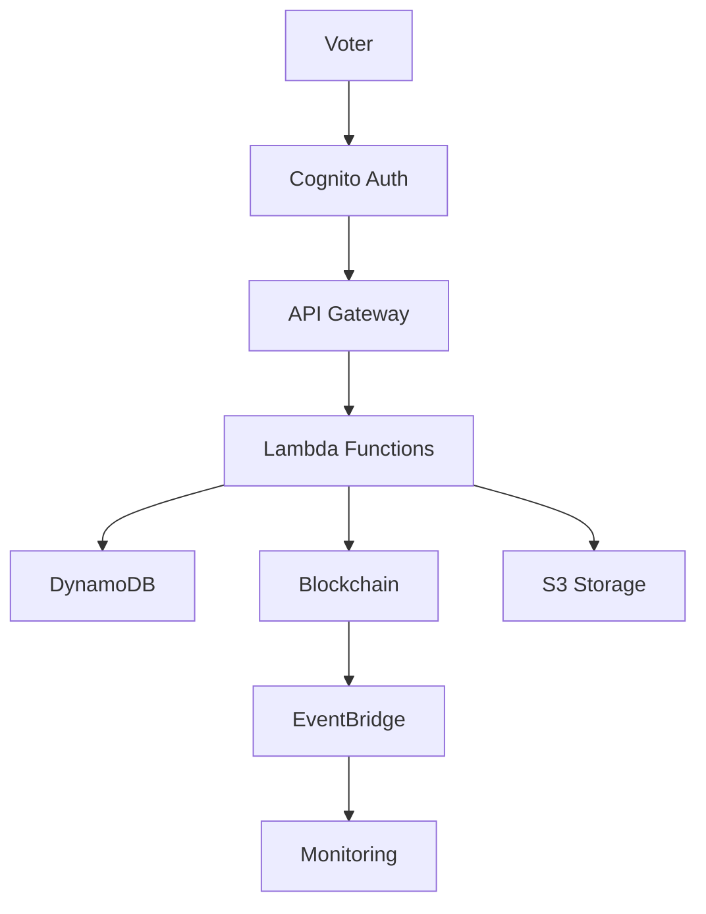

# Blockchain Voting System Architecture

## Overview

This document describes the architecture of the blockchain-based voting system implemented using AWS CDK (Cloud Development Kit) with TypeScript. The system provides a secure, transparent, and immutable voting platform using Amazon Managed Blockchain with Ethereum smart contracts.

## Architecture Principles

### Security First
- **Defense in Depth**: Multiple layers of security controls
- **Least Privilege Access**: IAM roles with minimal required permissions
- **Encryption Everywhere**: Data encrypted at rest and in transit
- **Audit Trail**: Comprehensive logging and monitoring

### Scalability
- **Serverless Architecture**: Auto-scaling Lambda functions
- **Managed Services**: Fully managed AWS services reduce operational overhead
- **Event-Driven**: Decoupled components using EventBridge
- **Pay-per-Use**: Cost-effective scaling model

### Reliability
- **High Availability**: Multi-AZ deployment where applicable
- **Fault Tolerance**: Automatic failover and recovery
- **Backup Strategy**: Point-in-time recovery for critical data
- **Monitoring**: Proactive alerting and health checks

### Compliance
- **Immutable Records**: Blockchain-based vote storage
- **Audit Trails**: CloudTrail integration for compliance
- **Data Protection**: GDPR-compliant data handling
- **Access Controls**: Role-based access control (RBAC)

## System Components

### 1. Security Stack (`VotingSystemSecurityStack`)

#### Purpose
Provides the foundational security infrastructure for the entire voting system.

#### Key Resources
- **AWS KMS**: Customer-managed encryption keys
- **IAM Roles**: Service-specific roles with least privilege
- **CloudTrail**: Comprehensive audit logging
- **AWS Config**: Compliance monitoring
- **GuardDuty**: Threat detection

#### Security Features
```typescript
// KMS Key with service-specific permissions
const kmsKey = new kms.Key(this, 'VotingSystemKmsKey', {
  enableKeyRotation: true,
  policy: new iam.PolicyDocument({
    statements: [
      // Service-specific access controls
    ]
  })
});

// Lambda execution role with minimal permissions
const lambdaRole = new iam.Role(this, 'LambdaExecutionRole', {
  assumedBy: new iam.ServicePrincipal('lambda.amazonaws.com'),
  inlinePolicies: {
    VotingSystemAccess: new iam.PolicyDocument({
      statements: [
        // DynamoDB, S3, KMS access only
      ]
    })
  }
});
```

### 2. Core System Stack (`BlockchainVotingSystemStack`)

#### Purpose
Implements the main voting system functionality including data storage, authentication, and blockchain integration.

#### Key Resources

##### Data Storage
- **DynamoDB Tables**:
  - `VoterRegistry`: Voter registration and verification data
  - `Elections`: Election metadata and configuration
- **S3 Buckets**:
  - `VotingData`: Encrypted vote storage and audit trails
  - `DApp`: Static website hosting for voting interface

##### Authentication & Authorization
- **Amazon Cognito**:
  - User Pool: Voter authentication
  - Identity Pool: Federated access to AWS resources
- **Multi-Factor Authentication**: SMS and TOTP support

##### Serverless Compute
- **Lambda Functions**:
  - `VoterAuth`: Handle voter registration and authentication
  - `VoteMonitor`: Process blockchain events and monitoring

##### API Layer
- **API Gateway**: RESTful API for voting operations
- **Cognito Authorizer**: Secure API access

##### Event Processing
- **EventBridge**: Real-time event routing
- **SNS Topics**: Multi-channel notifications

#### Data Flow


### 3. Monitoring Stack (`VotingSystemMonitoringStack`)

#### Purpose
Provides comprehensive observability, alerting, and performance monitoring for the voting system.

#### Key Resources

##### Dashboards & Visualization
- **CloudWatch Dashboard**: Real-time system metrics
- **Custom Metrics**: Voting-specific measurements
- **Log Insights**: Query and analyze log data

##### Alerting
- **CloudWatch Alarms**: Threshold-based alerts
- **SNS Topics**: Multi-channel notifications
- **Composite Alarms**: System health overview

##### Log Management
- **CloudWatch Logs**: Centralized logging
- **Metric Filters**: Extract metrics from logs
- **Log Retention**: Configurable retention policies

#### Monitoring Architecture
```typescript
// Custom metrics for voting activities
const votesCastMetric = new cloudwatch.Metric({
  namespace: 'VotingSystem',
  metricName: 'VotesCast',
  dimensionsMap: {
    Environment: this.config.environment,
  },
  statistic: 'Sum',
  period: cdk.Duration.minutes(5),
});

// Real-time dashboard
const dashboard = new cloudwatch.Dashboard(this, 'VotingSystemDashboard', {
  widgets: [
    new cloudwatch.GraphWidget({
      title: 'Voting Activity',
      left: [votesCastMetric],
    }),
    // Additional widgets...
  ],
});
```

## Data Models

### Voter Registry Table
```typescript
{
  VoterId: string;        // Partition key (hashed)
  ElectionId: string;     // Sort key
  PublicKey: string;      // Voter's public key
  EncryptedIdentity: string; // KMS-encrypted identity
  IsVerified: boolean;    // Verification status
  RegistrationTimestamp: number;
  ExpirationTimestamp: number;
}
```

### Elections Table
```typescript
{
  ElectionId: string;     // Partition key
  Name: string;          // Election name
  Description: string;   // Election description
  StartTime: number;     // Start timestamp
  EndTime: number;       // End timestamp
  Status: string;        // ACTIVE, ENDED, CANCELLED
  CreatedBy: string;     // Admin who created
  TotalVotes: number;    // Current vote count
  Candidates: Candidate[]; // Array of candidates
}
```

### Vote Storage (S3)
```typescript
{
  electionId: string;
  candidateId: string;
  transactionHash: string;  // Blockchain transaction
  blockNumber: number;      // Block number
  timestamp: number;        // Vote timestamp
  voterAddressHash: string; // Hashed voter address
  signature: string;        // Cryptographic signature
}
```

## Security Architecture

### Encryption Strategy
- **Data at Rest**: All data encrypted using AWS KMS
- **Data in Transit**: TLS 1.2+ for all communications
- **Key Management**: Customer-managed KMS keys with rotation
- **Secrets Management**: AWS Secrets Manager for sensitive data

### Access Control
- **IAM Roles**: Service-specific roles with least privilege
- **Resource Policies**: Bucket and table-level permissions
- **API Authorization**: Cognito-based authentication
- **Network Security**: VPC endpoints where applicable

### Audit & Compliance
- **CloudTrail**: All API calls logged
- **CloudWatch Logs**: Application-level logging
- **Blockchain Audit**: Immutable transaction records
- **Config Rules**: Compliance monitoring

## Blockchain Integration

### Amazon Managed Blockchain
```typescript
// Ethereum node configuration
const blockchainNode = new managedblockchain.CfnNode(this, 'VotingNode', {
  networkId: 'ethereum-mainnet', // or testnet
  nodeConfiguration: {
    instanceType: 'bc.t3.medium',
    availabilityZone: 'us-east-1a',
  },
});
```

### Smart Contract Architecture
```solidity
contract VotingSystem {
    struct Election {
        string name;
        uint256 startTime;
        uint256 endTime;
        bool isActive;
        mapping(address => bool) hasVoted;
        mapping(uint256 => uint256) voteCounts;
    }
    
    struct Voter {
        address voterAddress;
        bool isRegistered;
        bool isVerified;
        bytes32 voterIdHash;
    }
    
    mapping(uint256 => Election) public elections;
    mapping(address => Voter) public voters;
    
    event VoteCast(uint256 indexed electionId, uint256 indexed candidateId, address indexed voter);
    event ElectionCreated(uint256 indexed electionId, string name);
}
```

## Deployment Architecture

### Multi-Environment Support
- **Development**: Minimal resources, shorter retention
- **Staging**: Production-like environment for testing
- **Production**: Full security controls, long retention

### Infrastructure as Code
```typescript
// Environment-specific configuration
const config = {
  dev: {
    blockchain: { instanceType: 'bc.t3.small' },
    retention: logs.RetentionDays.ONE_WEEK,
    encryption: true,
  },
  prod: {
    blockchain: { instanceType: 'bc.t3.large' },
    retention: logs.RetentionDays.ONE_YEAR,
    encryption: true,
    deletionProtection: true,
  },
};
```

### Deployment Strategy
1. **Security Stack**: Deploy foundational security resources
2. **Core Stack**: Deploy main voting system components
3. **Monitoring Stack**: Deploy observability infrastructure

## Performance Considerations

### Scalability Patterns
- **DynamoDB**: On-demand billing for unpredictable workloads
- **Lambda**: Auto-scaling serverless compute
- **API Gateway**: Built-in throttling and caching
- **EventBridge**: Event-driven scaling

### Cost Optimization
- **Resource Tagging**: Detailed cost allocation
- **Lifecycle Policies**: Automated data archival
- **Reserved Capacity**: For predictable workloads
- **Spot Instances**: For non-critical processing

## Disaster Recovery

### Backup Strategy
- **DynamoDB**: Point-in-time recovery enabled
- **S3**: Cross-region replication for critical data
- **CloudTrail**: Multi-region trail configuration
- **Blockchain**: Immutable, distributed by design

### Recovery Procedures
1. **Data Recovery**: Restore from backups
2. **Infrastructure Recovery**: Redeploy from CDK
3. **Blockchain Recovery**: Resync from network
4. **Verification**: Validate system integrity

## Testing Strategy

### Unit Tests
```typescript
// CDK stack testing
describe('BlockchainVotingSystemStack', () => {
  it('should create DynamoDB tables', () => {
    template.hasResourceProperties('AWS::DynamoDB::Table', {
      TableName: 'voter-registry-dev',
      BillingMode: 'PAY_PER_REQUEST',
    });
  });
});
```

### Integration Tests
- **API Testing**: Automated API endpoint validation
- **Smart Contract Testing**: Solidity contract unit tests
- **End-to-End Testing**: Complete voting workflow validation

### Security Testing
- **Penetration Testing**: Third-party security assessment
- **Vulnerability Scanning**: Automated security scans
- **Compliance Testing**: Regulatory requirement validation

## Monitoring & Observability

### Key Metrics
- **Voting Metrics**: Votes cast, elections active, voter registrations
- **Performance Metrics**: API latency, Lambda duration, DynamoDB throttling
- **Security Metrics**: Failed authentication attempts, suspicious activities
- **Cost Metrics**: Resource utilization, cost per vote

### Alerting Strategy
- **Critical Alerts**: System failures, security breaches
- **Warning Alerts**: Performance degradation, capacity issues
- **Informational Alerts**: Election milestones, system updates

### Dashboard Design
- **Executive Dashboard**: High-level KPIs and status
- **Operational Dashboard**: Detailed system metrics
- **Security Dashboard**: Security events and compliance status

## Future Enhancements

### Planned Features
1. **Zero-Knowledge Proofs**: Enhanced privacy protection
2. **Multi-Chain Support**: Support for multiple blockchain networks
3. **Mobile Application**: Native mobile voting application
4. **Advanced Analytics**: Machine learning for fraud detection
5. **International Support**: Multi-language and multi-currency

### Technical Improvements
1. **Performance Optimization**: Caching strategies, database optimization
2. **Security Enhancements**: Additional authentication methods
3. **Scalability Improvements**: Auto-scaling optimizations
4. **Cost Optimization**: Resource rightsizing, reserved capacity

## Conclusion

The blockchain voting system architecture provides a secure, scalable, and compliant platform for conducting elections. The use of AWS CDK ensures consistent deployments, while the serverless architecture provides cost-effective scaling. The comprehensive monitoring and security features ensure system reliability and compliance with regulatory requirements.

The modular design allows for easy extension and customization, while the use of managed services reduces operational overhead. The blockchain integration provides immutable audit trails and transparent vote counting, essential for maintaining public trust in the electoral process.