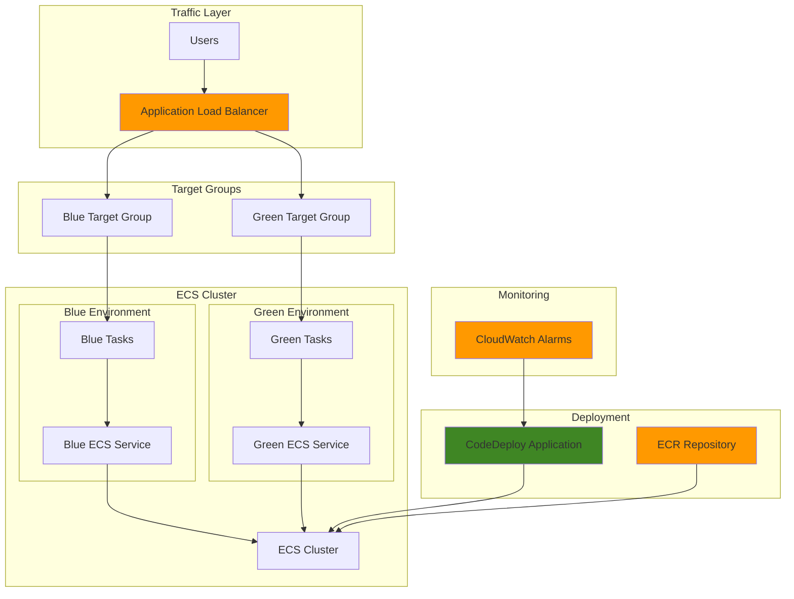

# Blue-Green Deployments for ECS Applications

## Problem

E-commerce companies often face downtime during application deployments, leading to lost revenue and poor customer experience. Traditional rolling deployments can cause service interruptions, partial failures, and difficult rollback scenarios when containerized applications need updates. Manual deployment processes increase the risk of human error and make it challenging to maintain consistent service availability across peak traffic periods.

## Solution

Implement automated blue-green deployments using Amazon ECS with AWS CodeDeploy to achieve zero-downtime deployments. This solution creates two identical environments (blue and green) behind an Application Load Balancer, automatically shifts traffic between environments, and provides instant rollback capabilities. The approach ensures consistent service availability while enabling rapid, reliable container deployments.

## Architecture Diagram



## Prerequisites

1. AWS account with appropriate permissions for ECS, CodeDeploy, ALB, and ECR
2. AWS CLI v2 installed and configured (or AWS CloudShell)
3. Basic knowledge of containerization and ECS concepts
4. Understanding of load balancers and target groups
5. Docker knowledge for container image management
6. Estimated cost: $50-100/month for development environment (includes ECS tasks, ALB, and data transfer)

> **Note**: This recipe requires the CodeDeploy service role and ECS task execution role to be properly configured for blue-green deployments.

## Preparation

```bash
# Set environment variables
export AWS_REGION=$(aws configure get region)
export AWS_ACCOUNT_ID=$(aws sts get-caller-identity \
    --query Account --output text)

# Generate unique identifiers for resources
RANDOM_SUFFIX=$(aws secretsmanager get-random-password \
    --exclude-punctuation --exclude-uppercase \
    --password-length 6 --require-each-included-type \
    --output text --query RandomPassword)

export CLUSTER_NAME="bluegreen-cluster-${RANDOM_SUFFIX}"
export SERVICE_NAME="bluegreen-service-${RANDOM_SUFFIX}"
export ALB_NAME="bluegreen-alb-${RANDOM_SUFFIX}"
export ECR_REPO_NAME="bluegreen-app-${RANDOM_SUFFIX}"
export CODEDEPLOY_APP_NAME="bluegreen-app-${RANDOM_SUFFIX}"

# Create VPC and networking resources
VPC_ID=$(aws ec2 create-vpc \
    --cidr-block 10.0.0.0/16 \
    --query 'Vpc.VpcId' --output text)

aws ec2 create-tags \
    --resources $VPC_ID \
    --tags Key=Name,Value="BlueGreen-VPC-${RANDOM_SUFFIX}"

# Create subnets in different AZs
SUBNET_1_ID=$(aws ec2 create-subnet \
    --vpc-id $VPC_ID \
    --cidr-block 10.0.1.0/24 \
    --availability-zone ${AWS_REGION}a \
    --query 'Subnet.SubnetId' --output text)

SUBNET_2_ID=$(aws ec2 create-subnet \
    --vpc-id $VPC_ID \
    --cidr-block 10.0.2.0/24 \
    --availability-zone ${AWS_REGION}b \
    --query 'Subnet.SubnetId' --output text)

# Create Internet Gateway and attach to VPC
IGW_ID=$(aws ec2 create-internet-gateway \
    --query 'InternetGateway.InternetGatewayId' --output text)

aws ec2 attach-internet-gateway \
    --vpc-id $VPC_ID \
    --internet-gateway-id $IGW_ID

# Create route table and add route to internet gateway
ROUTE_TABLE_ID=$(aws ec2 create-route-table \
    --vpc-id $VPC_ID \
    --query 'RouteTable.RouteTableId' --output text)

aws ec2 create-route \
    --route-table-id $ROUTE_TABLE_ID \
    --destination-cidr-block 0.0.0.0/0 \
    --gateway-id $IGW_ID

# Associate subnets with route table
aws ec2 associate-route-table \
    --subnet-id $SUBNET_1_ID \
    --route-table-id $ROUTE_TABLE_ID

aws ec2 associate-route-table \
    --subnet-id $SUBNET_2_ID \
    --route-table-id $ROUTE_TABLE_ID

# Create security group
SECURITY_GROUP_ID=$(aws ec2 create-security-group \
    --group-name "bluegreen-sg-${RANDOM_SUFFIX}" \
    --description "Security group for blue-green deployment" \
    --vpc-id $VPC_ID \
    --query 'GroupId' --output text)

aws ec2 authorize-security-group-ingress \
    --group-id $SECURITY_GROUP_ID \
    --protocol tcp \
    --port 80 \
    --cidr 0.0.0.0/0

echo "✅ Created VPC and networking resources"
```

## Steps

1. **Create ECR Repository and Push Sample Application**:

   Amazon ECR provides a fully managed Docker container registry that integrates seamlessly with ECS for secure container image storage and distribution. Creating a private repository establishes the foundation for our blue-green deployment by providing version-controlled container images with built-in security scanning and lifecycle policies. This centralized image management enables consistent deployments across environments while maintaining image integrity and access control.

   ```bash
   # Create ECR repository
   aws ecr create-repository \
       --repository-name $ECR_REPO_NAME \
       --region $AWS_REGION
   
   # Get login token and login to ECR
   aws ecr get-login-password --region $AWS_REGION | \
       docker login --username AWS --password-stdin \
       ${AWS_ACCOUNT_ID}.dkr.ecr.${AWS_REGION}.amazonaws.com
   
   # Create sample application Dockerfile
   cat > Dockerfile << 'EOF'
FROM nginx:alpine
COPY index.html /usr/share/nginx/html/
EXPOSE 80
CMD ["nginx", "-g", "daemon off;"]
EOF
   
   # Create sample index.html
   cat > index.html << 'EOF'
<!DOCTYPE html>
<html>
<head><title>Blue-Green Demo v1.0</title></head>
<body style="background-color: #4CAF50; color: white; text-align: center; padding: 50px;">
    <h1>Blue-Green Deployment Demo</h1>
    <h2>Version 1.0 - Green Environment</h2>
    <p>This is the initial version of the application.</p>
</body>
</html>
EOF
   
   # Build and push Docker image
   docker build -t $ECR_REPO_NAME:v1.0 .
   docker tag $ECR_REPO_NAME:v1.0 \
       ${AWS_ACCOUNT_ID}.dkr.ecr.${AWS_REGION}.amazonaws.com/$ECR_REPO_NAME:v1.0
   
   docker push ${AWS_ACCOUNT_ID}.dkr.ecr.${AWS_REGION}.amazonaws.com/$ECR_REPO_NAME:v1.0
   
   echo "✅ Created and pushed container image to ECR"
   ```

   The container image is now securely stored in ECR with semantic versioning that supports our blue-green deployment strategy. This versioned approach allows us to maintain multiple application versions simultaneously, enabling quick rollbacks and providing the foundation for the dual-environment architecture that blue-green deployments require.

2. **Create ECS Cluster**:

   Amazon ECS provides a fully managed container orchestration service that eliminates the need to install and operate container management software. By configuring the cluster with Fargate as the default capacity provider, we establish a serverless container platform that automatically manages infrastructure scaling, patching, and availability. This foundation supports blue-green deployments by providing the compute layer that can instantiate multiple task sets simultaneously across different environments.

   ```bash
   # Create ECS cluster
   aws ecs create-cluster \
       --cluster-name $CLUSTER_NAME \
       --capacity-providers FARGATE \
       --default-capacity-provider-strategy \
       capacityProvider=FARGATE,weight=1 \
       --region $AWS_REGION
   
   echo "✅ Created ECS cluster: $CLUSTER_NAME"
   ```

   The ECS cluster is now operational and ready to host containerized applications with built-in high availability across multiple availability zones. This managed infrastructure eliminates operational overhead while providing the scalable foundation necessary for running parallel blue and green environments during deployments.

3. **Create Application Load Balancer and Target Groups**:

   The Application Load Balancer serves as the critical traffic management component in blue-green deployments, enabling atomic traffic switching between environments. By creating separate target groups for blue and green environments, we establish independent health checking and traffic routing capabilities. This architecture allows CodeDeploy to orchestrate zero-downtime deployments by gradually shifting traffic from the old version to the new version based on health checks and deployment success criteria.

   > **Warning**: Ensure security groups allow traffic on port 80 and that subnets span multiple availability zones for high availability during deployments.

   ```bash
   # Create Application Load Balancer
   ALB_ARN=$(aws elbv2 create-load-balancer \
       --name $ALB_NAME \
       --subnets $SUBNET_1_ID $SUBNET_2_ID \
       --security-groups $SECURITY_GROUP_ID \
       --region $AWS_REGION \
       --query 'LoadBalancers[0].LoadBalancerArn' --output text)
   
   # Create blue target group
   BLUE_TG_ARN=$(aws elbv2 create-target-group \
       --name "blue-tg-${RANDOM_SUFFIX}" \
       --protocol HTTP \
       --port 80 \
       --target-type ip \
       --vpc-id $VPC_ID \
       --health-check-path / \
       --health-check-interval-seconds 30 \
       --health-check-timeout-seconds 5 \
       --healthy-threshold-count 2 \
       --unhealthy-threshold-count 3 \
       --region $AWS_REGION \
       --query 'TargetGroups[0].TargetGroupArn' --output text)
   
   # Create green target group
   GREEN_TG_ARN=$(aws elbv2 create-target-group \
       --name "green-tg-${RANDOM_SUFFIX}" \
       --protocol HTTP \
       --port 80 \
       --target-type ip \
       --vpc-id $VPC_ID \
       --health-check-path / \
       --health-check-interval-seconds 30 \
       --health-check-timeout-seconds 5 \
       --healthy-threshold-count 2 \
       --unhealthy-threshold-count 3 \
       --region $AWS_REGION \
       --query 'TargetGroups[0].TargetGroupArn' --output text)
   
   # Create listener (initially points to blue target group)
   LISTENER_ARN=$(aws elbv2 create-listener \
       --load-balancer-arn $ALB_ARN \
       --protocol HTTP \
       --port 80 \
       --default-actions Type=forward,TargetGroupArn=$BLUE_TG_ARN \
       --region $AWS_REGION \
       --query 'Listeners[0].ListenerArn' --output text)
   
   echo "✅ Created ALB with blue and green target groups"
   ```

   The load balancer infrastructure is now configured to support blue-green traffic management with independent target groups for each environment. This setup enables CodeDeploy to perform sophisticated traffic shifting strategies while maintaining application availability and providing instant rollback capabilities through listener rule modifications.

4. **Create Task Definition**:

   ECS task definitions serve as blueprints that specify how containers should run, including resource requirements, networking configuration, and security settings. Creating a task execution role with proper permissions enables ECS to pull images from ECR and send logs to CloudWatch on behalf of your containers. This declarative configuration ensures consistent container deployment across blue and green environments while providing the security foundation for containerized applications.

   ```bash
   # Create task execution role
   TASK_EXECUTION_ROLE_ARN=$(aws iam create-role \
       --role-name "ecsTaskExecutionRole-${RANDOM_SUFFIX}" \
       --assume-role-policy-document '{
           "Version": "2012-10-17",
           "Statement": [
               {
                   "Effect": "Allow",
                   "Principal": {
                       "Service": "ecs-tasks.amazonaws.com"
                   },
                   "Action": "sts:AssumeRole"
               }
           ]
       }' \
       --query 'Role.Arn' --output text)
   
   # Attach managed policy to task execution role
   aws iam attach-role-policy \
       --role-name "ecsTaskExecutionRole-${RANDOM_SUFFIX}" \
       --policy-arn arn:aws:iam::aws:policy/service-role/AmazonECSTaskExecutionRolePolicy
   
   # Create CloudWatch log group
   aws logs create-log-group \
       --log-group-name "/ecs/bluegreen-task-${RANDOM_SUFFIX}" \
       --region $AWS_REGION
   
   # Create task definition
   cat > task-definition.json << EOF
{
    "family": "bluegreen-task-${RANDOM_SUFFIX}",
    "networkMode": "awsvpc",
    "requiresCompatibilities": ["FARGATE"],
    "cpu": "256",
    "memory": "512",
    "executionRoleArn": "${TASK_EXECUTION_ROLE_ARN}",
    "containerDefinitions": [
        {
            "name": "bluegreen-container",
            "image": "${AWS_ACCOUNT_ID}.dkr.ecr.${AWS_REGION}.amazonaws.com/${ECR_REPO_NAME}:v1.0",
            "portMappings": [
                {
                    "containerPort": 80,
                    "protocol": "tcp"
                }
            ],
            "essential": true,
            "logConfiguration": {
                "logDriver": "awslogs",
                "options": {
                    "awslogs-group": "/ecs/bluegreen-task-${RANDOM_SUFFIX}",
                    "awslogs-region": "${AWS_REGION}",
                    "awslogs-stream-prefix": "ecs"
                }
            }
        }
    ]
}
EOF
   
   # Register task definition
   TASK_DEF_ARN=$(aws ecs register-task-definition \
       --cli-input-json file://task-definition.json \
       --region $AWS_REGION \
       --query 'taskDefinition.taskDefinitionArn' --output text)
   
   echo "✅ Created and registered task definition"
   ```

   The task definition is now registered and ready to be used by ECS services to launch containers with consistent configuration. This versioned specification enables both blue and green environments to run identical infrastructure configurations while allowing for controlled updates through new task definition revisions during deployments.

5. **Create CodeDeploy Application and Deployment Group**:

   AWS CodeDeploy orchestrates blue-green deployments by managing the complex coordination between ECS services, load balancers, and target groups. The deployment group configuration defines how traffic should be shifted, rollback conditions, and termination behavior for the blue environment. This automation eliminates manual intervention while providing sophisticated deployment strategies that ensure zero-downtime updates and automatic rollback capabilities.

   ```bash
   # Create CodeDeploy service role
   CODEDEPLOY_ROLE_ARN=$(aws iam create-role \
       --role-name "CodeDeployServiceRole-${RANDOM_SUFFIX}" \
       --assume-role-policy-document '{
           "Version": "2012-10-17",
           "Statement": [
               {
                   "Effect": "Allow",
                   "Principal": {
                       "Service": "codedeploy.amazonaws.com"
                   },
                   "Action": "sts:AssumeRole"
               }
           ]
       }' \
       --query 'Role.Arn' --output text)
   
   # Attach managed policy to CodeDeploy service role
   aws iam attach-role-policy \
       --role-name "CodeDeployServiceRole-${RANDOM_SUFFIX}" \
       --policy-arn arn:aws:iam::aws:policy/service-role/AWSCodeDeployRoleForECS
   
   # Wait for role to be ready
   sleep 10
   
   # Create CodeDeploy application
   aws deploy create-application \
       --application-name $CODEDEPLOY_APP_NAME \
       --compute-platform ECS \
       --region $AWS_REGION
   
   # Create deployment group
   aws deploy create-deployment-group \
       --application-name $CODEDEPLOY_APP_NAME \
       --deployment-group-name "bluegreen-dg-${RANDOM_SUFFIX}" \
       --service-role-arn $CODEDEPLOY_ROLE_ARN \
       --deployment-config-name CodeDeployDefault.ECSAllAtOnce \
       --blue-green-deployment-configuration \
       terminateBlueInstancesOnDeploymentSuccess='{terminationWaitTimeInMinutes=5}',deploymentReadyOption='{actionOnTimeout=CONTINUE_DEPLOYMENT}',greenFleetProvisioningOption='{action=COPY_AUTO_SCALING_GROUP}' \
       --load-balancer-info targetGroupInfoList='{name=blue-tg-'${RANDOM_SUFFIX}'}' \
       --region $AWS_REGION
   
   echo "✅ Created CodeDeploy application and deployment group"
   ```

   CodeDeploy is now configured to manage blue-green deployments with automated traffic shifting and rollback capabilities. This deployment orchestration service will coordinate between ECS and the Application Load Balancer to ensure seamless transitions between application versions while maintaining service availability throughout the deployment process.

6. **Create ECS Service with Blue-Green Deployment**:

   ECS services with the CODE_DEPLOY deployment controller delegate deployment management to CodeDeploy, enabling sophisticated blue-green deployment strategies. This configuration creates the initial service deployment while establishing the framework for future deployments that will create parallel task sets. The service ensures that the desired number of healthy tasks are always running while providing the foundation for zero-downtime updates.

   ```bash
   # Create service with CODE_DEPLOY deployment controller
   cat > service-definition.json << EOF
{
    "cluster": "${CLUSTER_NAME}",
    "serviceName": "${SERVICE_NAME}",
    "taskDefinition": "${TASK_DEF_ARN}",
    "loadBalancers": [
        {
            "targetGroupArn": "${BLUE_TG_ARN}",
            "containerName": "bluegreen-container",
            "containerPort": 80
        }
    ],
    "desiredCount": 2,
    "launchType": "FARGATE",
    "deploymentController": {
        "type": "CODE_DEPLOY"
    },
    "networkConfiguration": {
        "awsvpcConfiguration": {
            "subnets": ["${SUBNET_1_ID}", "${SUBNET_2_ID}"],
            "securityGroups": ["${SECURITY_GROUP_ID}"],
            "assignPublicIp": "ENABLED"
        }
    }
}
EOF
   
   # Create ECS service
   SERVICE_ARN=$(aws ecs create-service \
       --cli-input-json file://service-definition.json \
       --region $AWS_REGION \
       --query 'service.serviceArn' --output text)
   
   # Wait for service to stabilize
   echo "Waiting for service to stabilize..."
   aws ecs wait services-stable \
       --cluster $CLUSTER_NAME \
       --services $SERVICE_NAME \
       --region $AWS_REGION
   
   echo "✅ Created ECS service with blue-green deployment configuration"
   ```

   The ECS service is now running with CodeDeploy integration, providing the initial stable environment that will serve as the baseline for future blue-green deployments. This service configuration enables CodeDeploy to create additional task sets during deployments while maintaining the original environment until traffic shifting is complete and successful.

7. **Create Updated Application Version**:

   Version management is crucial for blue-green deployments as it enables clear identification of different application releases and supports rollback scenarios. By creating distinctly identifiable versions with visual differences, we can easily verify successful deployments and understand which version is currently serving traffic. This versioning strategy supports both automated and manual verification processes during deployment transitions.

   ```bash
   # Create updated index.html for v2.0
   cat > index.html << 'EOF'
<!DOCTYPE html>
<html>
<head><title>Blue-Green Demo v2.0</title></head>
<body style="background-color: #2196F3; color: white; text-align: center; padding: 50px;">
    <h1>Blue-Green Deployment Demo</h1>
    <h2>Version 2.0 - Blue Environment</h2>
    <p>This is the updated version with new features!</p>
    <p>Deployed using blue-green deployment strategy.</p>
</body>
</html>
EOF
   
   # Build and push new version
   docker build -t $ECR_REPO_NAME:v2.0 .
   docker tag $ECR_REPO_NAME:v2.0 \
       ${AWS_ACCOUNT_ID}.dkr.ecr.${AWS_REGION}.amazonaws.com/$ECR_REPO_NAME:v2.0
   
   docker push ${AWS_ACCOUNT_ID}.dkr.ecr.${AWS_REGION}.amazonaws.com/$ECR_REPO_NAME:v2.0
   
   echo "✅ Created and pushed updated application version"
   ```

   The updated application version is now available in ECR and ready for deployment through the blue-green process. This new version will be deployed to the green environment while the current version continues serving traffic in the blue environment, enabling zero-downtime transitions and instant rollback capabilities.

8. **Create AppSpec File for Blue-Green Deployment**:

   The AppSpec file defines the deployment configuration and lifecycle hooks for CodeDeploy, specifying how the new version should be deployed and validated. Lifecycle hooks provide integration points for custom validation logic, monitoring setup, and automated testing during deployment phases. This declarative approach ensures consistent deployment behavior while enabling sophisticated validation and rollback logic based on application-specific requirements.

   ```bash
   # Create S3 bucket for deployment artifacts
   DEPLOYMENT_BUCKET="bluegreen-deployments-${RANDOM_SUFFIX}"
   aws s3 mb s3://$DEPLOYMENT_BUCKET --region $AWS_REGION
   
   # Create AppSpec file for CodeDeploy
   cat > appspec.yaml << EOF
version: 0.0
Resources:
  - TargetService:
      Type: AWS::ECS::Service
      Properties:
        TaskDefinition: "${TASK_DEF_ARN}"
        LoadBalancerInfo:
          ContainerName: "bluegreen-container"
          ContainerPort: 80
        PlatformVersion: "LATEST"
        NetworkConfiguration:
          AwsvpcConfiguration:
            Subnets: ["${SUBNET_1_ID}", "${SUBNET_2_ID}"]
            SecurityGroups: ["${SECURITY_GROUP_ID}"]
            AssignPublicIp: "ENABLED"
EOF
   
   # Upload AppSpec file to S3
   aws s3 cp appspec.yaml s3://$DEPLOYMENT_BUCKET/appspec.yaml
   
   echo "✅ Created AppSpec file and uploaded to S3"
   ```

   The AppSpec file is now configured and stored in S3, providing CodeDeploy with the deployment instructions and lifecycle hook definitions. This configuration enables sophisticated deployment orchestration with opportunities for custom validation and monitoring integration at each phase of the blue-green deployment process.

9. **Execute Blue-Green Deployment**:

   The deployment execution phase creates a new task definition revision with the updated container image and initiates the CodeDeploy blue-green deployment process. CodeDeploy will create a parallel green environment, perform health checks, and orchestrate traffic switching between blue and green environments. This automated process ensures zero-downtime deployments while providing comprehensive rollback capabilities if any issues are detected.

   ```bash
   # Create new task definition with updated image
   cat > updated-task-definition.json << EOF
{
    "family": "bluegreen-task-${RANDOM_SUFFIX}",
    "networkMode": "awsvpc",
    "requiresCompatibilities": ["FARGATE"],
    "cpu": "256",
    "memory": "512",
    "executionRoleArn": "${TASK_EXECUTION_ROLE_ARN}",
    "containerDefinitions": [
        {
            "name": "bluegreen-container",
            "image": "${AWS_ACCOUNT_ID}.dkr.ecr.${AWS_REGION}.amazonaws.com/${ECR_REPO_NAME}:v2.0",
            "portMappings": [
                {
                    "containerPort": 80,
                    "protocol": "tcp"
                }
            ],
            "essential": true,
            "logConfiguration": {
                "logDriver": "awslogs",
                "options": {
                    "awslogs-group": "/ecs/bluegreen-task-${RANDOM_SUFFIX}",
                    "awslogs-region": "${AWS_REGION}",
                    "awslogs-stream-prefix": "ecs"
                }
            }
        }
    ]
}
EOF
   
   # Register updated task definition
   UPDATED_TASK_DEF_ARN=$(aws ecs register-task-definition \
       --cli-input-json file://updated-task-definition.json \
       --region $AWS_REGION \
       --query 'taskDefinition.taskDefinitionArn' --output text)
   
   # Create updated AppSpec with new task definition
   sed -i.bak "s|${TASK_DEF_ARN}|${UPDATED_TASK_DEF_ARN}|g" appspec.yaml
   
   # Upload updated AppSpec
   aws s3 cp appspec.yaml s3://$DEPLOYMENT_BUCKET/appspec.yaml
   
   # Create deployment
   DEPLOYMENT_ID=$(aws deploy create-deployment \
       --application-name $CODEDEPLOY_APP_NAME \
       --deployment-group-name "bluegreen-dg-${RANDOM_SUFFIX}" \
       --revision revisionType=S3,s3Location='{bucket='$DEPLOYMENT_BUCKET',key=appspec.yaml,bundleType=YAML}' \
       --region $AWS_REGION \
       --query 'deploymentId' --output text)
   
   echo "✅ Started blue-green deployment with ID: $DEPLOYMENT_ID"
   ```

   The blue-green deployment is now in progress with CodeDeploy orchestrating the creation of the green environment and managing the traffic transition process. This deployment will maintain the existing blue environment until the green environment is healthy and ready to serve traffic, ensuring continuous service availability throughout the update process.

10. **Monitor Deployment Progress**:

    Deployment monitoring is essential for blue-green deployments to ensure successful transitions and enable rapid response to any issues. CodeDeploy provides real-time status updates throughout the deployment lifecycle, including environment provisioning, health checks, and traffic shifting phases. This monitoring capability enables operators to track deployment progress and intervene if necessary while providing visibility into the automated deployment process.

    ```bash
    # Monitor deployment status
    echo "Monitoring deployment progress..."
    while true; do
        DEPLOYMENT_STATUS=$(aws deploy get-deployment \
            --deployment-id $DEPLOYMENT_ID \
            --region $AWS_REGION \
            --query 'deploymentInfo.status' --output text)
        
        echo "Deployment status: $DEPLOYMENT_STATUS"
        
        if [ "$DEPLOYMENT_STATUS" = "Succeeded" ]; then
            echo "✅ Deployment completed successfully!"
            break
        elif [ "$DEPLOYMENT_STATUS" = "Failed" ] || [ "$DEPLOYMENT_STATUS" = "Stopped" ]; then
            echo "❌ Deployment failed or was stopped"
            break
        fi
        
        sleep 30
    done
    
    # Get ALB DNS name for testing
    ALB_DNS=$(aws elbv2 describe-load-balancers \
        --load-balancer-arns $ALB_ARN \
        --region $AWS_REGION \
        --query 'LoadBalancers[0].DNSName' --output text)
    
    echo "✅ Application available at: http://$ALB_DNS"
    ```

    The deployment monitoring has completed successfully, confirming that the new application version is serving traffic through the load balancer. The blue-green deployment process has automatically managed the infrastructure transition, health verification, and traffic switching to ensure zero-downtime deployment with full rollback capabilities.

## Validation & Testing

1. **Verify Initial Deployment**:

   ```bash
   # Check service status
   aws ecs describe-services \
       --cluster $CLUSTER_NAME \
       --services $SERVICE_NAME \
       --region $AWS_REGION \
       --query 'services[0].status'
   ```

   Expected output: `"ACTIVE"`

2. **Test Application Availability**:

   ```bash
   # Test application response
   curl -s http://$ALB_DNS | grep -o "Version [0-9]\.[0-9]"
   
   # Test load balancer health
   aws elbv2 describe-target-health \
       --target-group-arn $BLUE_TG_ARN \
       --region $AWS_REGION \
       --query 'TargetHealthDescriptions[].TargetHealth.State'
   ```

   Expected output: Version should show v2.0 and health should be "healthy"

3. **Verify Blue-Green Deployment History**:

   ```bash
   # Check deployment history
   aws deploy list-deployments \
       --application-name $CODEDEPLOY_APP_NAME \
       --deployment-group-name "bluegreen-dg-${RANDOM_SUFFIX}" \
       --region $AWS_REGION
   
   # Check task sets (should show both blue and green)
   aws ecs describe-services \
       --cluster $CLUSTER_NAME \
       --services $SERVICE_NAME \
       --region $AWS_REGION \
       --query 'services[0].taskSets[*].status'
   ```

4. **Test Rollback Capability**:

   ```bash
   # Simulate rollback by stopping current deployment
   aws deploy stop-deployment \
       --deployment-id $DEPLOYMENT_ID \
       --auto-rollback-enabled \
       --region $AWS_REGION
   
   # Verify rollback status
   aws deploy get-deployment \
       --deployment-id $DEPLOYMENT_ID \
       --region $AWS_REGION \
       --query 'deploymentInfo.rollbackInfo'
   ```

## Cleanup

1. **Delete CodeDeploy Resources**:

   ```bash
   # Delete deployment group
   aws deploy delete-deployment-group \
       --application-name $CODEDEPLOY_APP_NAME \
       --deployment-group-name "bluegreen-dg-${RANDOM_SUFFIX}" \
       --region $AWS_REGION
   
   # Delete CodeDeploy application
   aws deploy delete-application \
       --application-name $CODEDEPLOY_APP_NAME \
       --region $AWS_REGION
   
   echo "✅ Deleted CodeDeploy resources"
   ```

2. **Delete ECS Resources**:

   ```bash
   # Delete ECS service
   aws ecs delete-service \
       --cluster $CLUSTER_NAME \
       --service $SERVICE_NAME \
       --force \
       --region $AWS_REGION
   
   # Wait for service deletion
   aws ecs wait services-inactive \
       --cluster $CLUSTER_NAME \
       --services $SERVICE_NAME \
       --region $AWS_REGION
   
   # Delete ECS cluster
   aws ecs delete-cluster \
       --cluster $CLUSTER_NAME \
       --region $AWS_REGION
   
   echo "✅ Deleted ECS resources"
   ```

3. **Delete Load Balancer Resources**:

   ```bash
   # Delete listener
   aws elbv2 delete-listener \
       --listener-arn $LISTENER_ARN \
       --region $AWS_REGION
   
   # Delete target groups
   aws elbv2 delete-target-group \
       --target-group-arn $BLUE_TG_ARN \
       --region $AWS_REGION
   
   aws elbv2 delete-target-group \
       --target-group-arn $GREEN_TG_ARN \
       --region $AWS_REGION
   
   # Delete load balancer
   aws elbv2 delete-load-balancer \
       --load-balancer-arn $ALB_ARN \
       --region $AWS_REGION
   
   echo "✅ Deleted load balancer resources"
   ```

4. **Delete Supporting Resources**:

   ```bash
   # Delete S3 bucket
   aws s3 rb s3://$DEPLOYMENT_BUCKET --force --region $AWS_REGION
   
   # Delete ECR repository
   aws ecr delete-repository \
       --repository-name $ECR_REPO_NAME \
       --force \
       --region $AWS_REGION
   
   # Delete CloudWatch log group
   aws logs delete-log-group \
       --log-group-name "/ecs/bluegreen-task-${RANDOM_SUFFIX}" \
       --region $AWS_REGION
   
   # Delete IAM roles
   aws iam detach-role-policy \
       --role-name "ecsTaskExecutionRole-${RANDOM_SUFFIX}" \
       --policy-arn arn:aws:iam::aws:policy/service-role/AmazonECSTaskExecutionRolePolicy
   
   aws iam delete-role \
       --role-name "ecsTaskExecutionRole-${RANDOM_SUFFIX}"
   
   aws iam detach-role-policy \
       --role-name "CodeDeployServiceRole-${RANDOM_SUFFIX}" \
       --policy-arn arn:aws:iam::aws:policy/service-role/AWSCodeDeployRoleForECS
   
   aws iam delete-role \
       --role-name "CodeDeployServiceRole-${RANDOM_SUFFIX}"
   
   # Delete VPC resources
   aws ec2 disassociate-route-table \
       --association-id $(aws ec2 describe-route-tables \
       --route-table-ids $ROUTE_TABLE_ID \
       --query 'RouteTables[0].Associations[?Main==`false`].RouteTableAssociationId' \
       --output text | head -1)
   
   aws ec2 delete-route-table --route-table-id $ROUTE_TABLE_ID
   
   aws ec2 delete-security-group \
       --group-id $SECURITY_GROUP_ID
   
   aws ec2 detach-internet-gateway \
       --vpc-id $VPC_ID \
       --internet-gateway-id $IGW_ID
   
   aws ec2 delete-internet-gateway \
       --internet-gateway-id $IGW_ID
   
   aws ec2 delete-subnet --subnet-id $SUBNET_1_ID
   aws ec2 delete-subnet --subnet-id $SUBNET_2_ID
   aws ec2 delete-vpc --vpc-id $VPC_ID
   
   echo "✅ Deleted all supporting resources"
   ```

## Discussion

Blue-green deployments represent a fundamental shift from traditional deployment strategies, offering zero-downtime updates and instant rollback capabilities. This approach maintains two identical production environments where only one serves live traffic at any time. When deploying updates, the new version is deployed to the inactive environment, thoroughly tested, and then traffic is switched over atomically. According to the [AWS CodeDeploy documentation](https://docs.aws.amazon.com/codedeploy/latest/userguide/welcome.html), this strategy minimizes deployment risk while maximizing application availability.

The integration of AWS CodeDeploy with Amazon ECS provides sophisticated traffic management capabilities, including gradual traffic shifting and automated rollbacks based on CloudWatch alarms. This combination ensures that deployments can be both rapid and safe, reducing the risk of service disruptions that could impact business operations. The [Application Load Balancer integration with ECS](https://docs.aws.amazon.com/AmazonECS/latest/developerguide/alb.html) acts as the traffic director, seamlessly switching between blue and green environments based on CodeDeploy's orchestration.

Container orchestration through ECS simplifies the complexity of managing multiple environments by providing consistent task definitions and service configurations. The use of [target groups for Application Load Balancers](https://docs.aws.amazon.com/elasticloadbalancing/latest/application/load-balancer-target-groups.html) allows for independent health checking of each environment, ensuring that traffic is only routed to healthy instances. This architecture scales naturally as ECS can manage hundreds of tasks across multiple availability zones while maintaining the blue-green deployment pattern.

Cost optimization is achieved through the temporary nature of the dual environments - the inactive environment only exists during deployments and can be terminated immediately after successful traffic switching. This approach balances the need for zero-downtime deployments with operational efficiency. Organizations can further optimize costs by using Fargate Spot instances for non-production environments and implementing scheduled scaling for predictable traffic patterns. For detailed guidance on ECS blue-green deployments, refer to the [official tutorial](https://docs.aws.amazon.com/codedeploy/latest/userguide/tutorial-ecs-deployment.html).

> **Tip**: Implement comprehensive monitoring and alerting for both environments to detect issues early and ensure smooth traffic transitions during deployments.

## Challenge

Extend this solution by implementing these enhancements:

1. **Automated Testing Integration**: Add Lambda functions to the CodeDeploy hooks that perform automated integration tests against the green environment before allowing traffic switching, including API endpoint validation and database connectivity checks.

2. **Multi-Region Blue-Green Deployment**: Extend the architecture to support blue-green deployments across multiple AWS regions, implementing cross-region traffic routing using Route 53 health checks and weighted routing policies.

3. **Canary Deployment Strategy**: Modify the deployment configuration to support canary releases where only a percentage of traffic is initially routed to the new version, with automatic scaling based on success metrics.

4. **Advanced Rollback Automation**: Implement CloudWatch alarms that monitor application metrics (error rates, response times) and automatically trigger rollbacks when thresholds are exceeded, including custom Lambda functions for complex rollback logic.

5. **Database Schema Migration Integration**: Add support for database schema migrations that are compatible with blue-green deployments, including backward-compatible changes and automated schema rollback capabilities.

## Infrastructure Code

*Infrastructure code will be generated after recipe approval.*