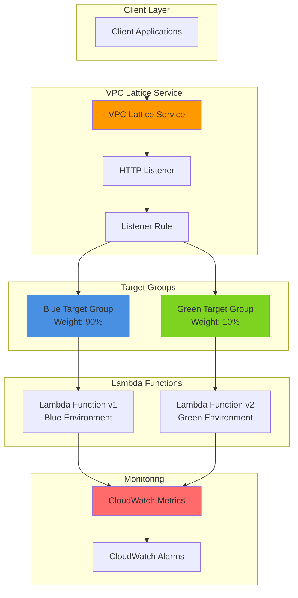

# Blue-Green Deployments with VPC Lattice and Lambda

## Problem

Enterprise applications require zero-downtime deployment strategies to maintain service availability during updates. Traditional deployment approaches risk service disruption when new code versions introduce bugs or performance issues. Organizations need a reliable mechanism to gradually shift traffic between application versions while maintaining the ability to instantly rollback problematic deployments, ensuring continuous service availability for critical business operations.

## Solution

Implement blue-green deployments using VPC Lattice weighted target groups to orchestrate traffic distribution between Lambda function versions. This approach leverages VPC Lattice's application networking capabilities to create isolated environments for each deployment version, enabling gradual traffic shifting with real-time monitoring and automated rollback capabilities based on CloudWatch metrics and health checks.

## Architecture Diagram



## Prerequisites

1. AWS account with VPC Lattice, Lambda, CloudWatch, and IAM permissions
2. AWS CLI v2 installed and configured (or AWS CloudShell)
3. Basic understanding of serverless architectures and blue-green deployment concepts
4. jq tool installed for JSON processing (or equivalent for testing endpoints)
5. Estimated cost: $5-15 per month for Lambda invocations, VPC Lattice service, and CloudWatch monitoring (varies by traffic volume)

> **Note**: VPC Lattice charges are based on the number of services and data processing units. Lambda costs are pay-per-invocation with generous free tier allowances.

## Preparation

```bash
# Set environment variables
export AWS_REGION=$(aws configure get region)
export AWS_ACCOUNT_ID=$(aws sts get-caller-identity \
    --query Account --output text)

# Generate unique identifiers for resources
RANDOM_SUFFIX=$(aws secretsmanager get-random-password \
    --exclude-punctuation --exclude-uppercase \
    --password-length 6 --require-each-included-type \
    --output text --query RandomPassword)

# Set resource names
export SERVICE_NAME="ecommerce-api-${RANDOM_SUFFIX}"
export BLUE_FUNCTION_NAME="ecommerce-blue-${RANDOM_SUFFIX}"
export GREEN_FUNCTION_NAME="ecommerce-green-${RANDOM_SUFFIX}"
export BLUE_TG_NAME="blue-tg-${RANDOM_SUFFIX}"
export GREEN_TG_NAME="green-tg-${RANDOM_SUFFIX}"
export LATTICE_SERVICE_NAME="lattice-service-${RANDOM_SUFFIX}"

# Create IAM role for Lambda functions
aws iam create-role \
    --role-name LambdaVPCLatticeRole-${RANDOM_SUFFIX} \
    --assume-role-policy-document '{
        "Version": "2012-10-17",
        "Statement": [{
            "Effect": "Allow",
            "Principal": {"Service": "lambda.amazonaws.com"},
            "Action": "sts:AssumeRole"
        }]
    }'

# Attach necessary policies
aws iam attach-role-policy \
    --role-name LambdaVPCLatticeRole-${RANDOM_SUFFIX} \
    --policy-arn arn:aws:iam::aws:policy/service-role/AWSLambdaBasicExecutionRole

# Wait for role to be available
sleep 10

# Get the role ARN
export LAMBDA_ROLE_ARN=$(aws iam get-role \
    --role-name LambdaVPCLatticeRole-${RANDOM_SUFFIX} \
    --query Role.Arn --output text)

echo "✅ AWS environment configured with unique suffix: ${RANDOM_SUFFIX}"
```

## Steps

1. **Create Blue Environment Lambda Function**:

   AWS Lambda provides the serverless compute foundation for our blue-green deployment strategy. The blue environment represents our current production version, handling the majority of traffic while maintaining service stability. Lambda's event-driven architecture integrates seamlessly with VPC Lattice, enabling automatic scaling and cost-effective request processing.

   ```bash
   # Create blue Lambda function deployment package
   cat > blue_function.py << 'EOF'
import json
import time

def lambda_handler(event, context):
    # Blue environment - stable production version
    response_data = {
        'environment': 'blue',
        'version': '1.0.0',
        'message': 'Hello from Blue Environment!',
        'timestamp': int(time.time()),
        'request_id': context.aws_request_id
    }
    
    return {
        'statusCode': 200,
        'headers': {
            'Content-Type': 'application/json',
            'X-Environment': 'blue'
        },
        'body': json.dumps(response_data)
    }
EOF
   
   # Package the function
   zip blue_function.zip blue_function.py
   
   # Create blue Lambda function with current Python runtime
   aws lambda create-function \
       --function-name ${BLUE_FUNCTION_NAME} \
       --runtime python3.12 \
       --role ${LAMBDA_ROLE_ARN} \
       --handler blue_function.lambda_handler \
       --zip-file fileb://blue_function.zip \
       --timeout 30 \
       --memory-size 256 \
       --environment Variables='{ENVIRONMENT=blue}' \
       --tags Environment=blue,Deployment=blue-green
   
   echo "✅ Blue Lambda function created: ${BLUE_FUNCTION_NAME}"
   ```

2. **Create Green Environment Lambda Function**:

   The green environment serves as our deployment target for new application versions. This isolated environment enables safe testing of new features and code changes without impacting production traffic. Lambda's versioning capabilities ensure consistent deployment artifacts while maintaining the ability to rollback instantly if issues arise.

   ```bash
   # Create green Lambda function deployment package
   cat > green_function.py << 'EOF'
import json
import time

def lambda_handler(event, context):
    # Green environment - new version being deployed
    response_data = {
        'environment': 'green',
        'version': '2.0.0',
        'message': 'Hello from Green Environment!',
        'timestamp': int(time.time()),
        'request_id': context.aws_request_id,
        'new_feature': 'Enhanced response with additional metadata'
    }
    
    return {
        'statusCode': 200,
        'headers': {
            'Content-Type': 'application/json',
            'X-Environment': 'green'
        },
        'body': json.dumps(response_data)
    }
EOF
   
   # Package the function
   zip green_function.zip green_function.py
   
   # Create green Lambda function with current Python runtime
   aws lambda create-function \
       --function-name ${GREEN_FUNCTION_NAME} \
       --runtime python3.12 \
       --role ${LAMBDA_ROLE_ARN} \
       --handler green_function.lambda_handler \
       --zip-file fileb://green_function.zip \
       --timeout 30 \
       --memory-size 256 \
       --environment Variables='{ENVIRONMENT=green}' \
       --tags Environment=green,Deployment=blue-green
   
   echo "✅ Green Lambda function created: ${GREEN_FUNCTION_NAME}"
   ```

3. **Create VPC Lattice Service Network**:

   VPC Lattice provides application-layer networking that abstracts the complexity of service discovery and load balancing. Creating a service network establishes the foundation for cross-service communication and traffic management, enabling advanced deployment strategies without managing traditional load balancers or service meshes.

   ```bash
   # Create VPC Lattice service network
   aws vpc-lattice create-service-network \
       --name ecommerce-network-${RANDOM_SUFFIX} \
       --auth-type AWS_IAM \
       --tags Environment=production,Purpose=blue-green-deployment
   
   # Wait for service network to be created
   sleep 10
   
   # Get service network ID
   export SERVICE_NETWORK_ID=$(aws vpc-lattice list-service-networks \
       --query "items[?name=='ecommerce-network-${RANDOM_SUFFIX}'].id" \
       --output text)
   
   echo "✅ VPC Lattice service network created: ${SERVICE_NETWORK_ID}"
   ```

4. **Create Blue Target Group for Lambda Function**:

   Target groups in VPC Lattice define how traffic is routed to compute resources. The blue target group maintains connections to our stable production Lambda function, providing health checking and request routing capabilities. This configuration ensures reliable service delivery while enabling gradual traffic shifting during deployments.

   ```bash
   # Create blue target group for Lambda
   aws vpc-lattice create-target-group \
       --name ${BLUE_TG_NAME} \
       --type LAMBDA \
       --tags Environment=blue,Purpose=target-group
   
   # Get blue target group ARN
   export BLUE_TG_ARN=$(aws vpc-lattice list-target-groups \
       --query "items[?name=='${BLUE_TG_NAME}'].arn" \
       --output text)
   
   # Register blue Lambda function with target group - add permission first
   aws lambda add-permission \
       --function-name ${BLUE_FUNCTION_NAME} \
       --statement-id vpc-lattice-blue \
       --principal vpc-lattice.amazonaws.com \
       --action lambda:InvokeFunction \
       --source-arn ${BLUE_TG_ARN}
   
   # Register Lambda function as target
   aws vpc-lattice register-targets \
       --target-group-identifier ${BLUE_TG_ARN} \
       --targets Id=${BLUE_FUNCTION_NAME}
   
   echo "✅ Blue target group created and Lambda function registered"
   ```

5. **Create Green Target Group for Lambda Function**:

   The green target group provides an isolated routing path for the new application version. This separation enables independent health checking and performance monitoring of the new deployment, ensuring that traffic is only routed to healthy instances of the updated application code.

   ```bash
   # Create green target group for Lambda
   aws vpc-lattice create-target-group \
       --name ${GREEN_TG_NAME} \
       --type LAMBDA \
       --tags Environment=green,Purpose=target-group
   
   # Get green target group ARN
   export GREEN_TG_ARN=$(aws vpc-lattice list-target-groups \
       --query "items[?name=='${GREEN_TG_NAME}'].arn" \
       --output text)
   
   # Register green Lambda function with target group - add permission first
   aws lambda add-permission \
       --function-name ${GREEN_FUNCTION_NAME} \
       --statement-id vpc-lattice-green \
       --principal vpc-lattice.amazonaws.com \
       --action lambda:InvokeFunction \
       --source-arn ${GREEN_TG_ARN}
   
   # Register Lambda function as target
   aws vpc-lattice register-targets \
       --target-group-identifier ${GREEN_TG_ARN} \
       --targets Id=${GREEN_FUNCTION_NAME}
   
   echo "✅ Green target group created and Lambda function registered"
   ```

6. **Create VPC Lattice Service with Weighted Routing**:

   The VPC Lattice service orchestrates traffic distribution between blue and green environments using weighted routing rules. This configuration starts with 90% traffic to the stable blue environment and 10% to the new green environment, enabling gradual validation of the new deployment with minimal risk to production traffic.

   ```bash
   # Create VPC Lattice service
   aws vpc-lattice create-service \
       --name ${LATTICE_SERVICE_NAME} \
       --auth-type AWS_IAM \
       --tags Environment=production,Purpose=blue-green-service
   
   # Wait for service to be created
   sleep 10
   
   # Get service ARN and ID
   export SERVICE_ARN=$(aws vpc-lattice list-services \
       --query "items[?name=='${LATTICE_SERVICE_NAME}'].arn" \
       --output text)
   
   export SERVICE_ID=$(aws vpc-lattice list-services \
       --query "items[?name=='${LATTICE_SERVICE_NAME}'].id" \
       --output text)
   
   # Associate service with service network
   aws vpc-lattice create-service-network-service-association \
       --service-network-identifier ${SERVICE_NETWORK_ID} \
       --service-identifier ${SERVICE_ID}
   
   # Wait for association to complete
   sleep 15
   
   # Create HTTP listener with weighted routing
   aws vpc-lattice create-listener \
       --service-identifier ${SERVICE_ID} \
       --name http-listener \
       --protocol HTTP \
       --port 80 \
       --default-action '{
           "forward": {
               "targetGroups": [
                   {
                       "targetGroupIdentifier": "'${BLUE_TG_ARN}'",
                       "weight": 90
                   },
                   {
                       "targetGroupIdentifier": "'${GREEN_TG_ARN}'",
                       "weight": 10
                   }
               ]
           }
       }'
   
   echo "✅ VPC Lattice service created with weighted routing (90% blue, 10% green)"
   ```

7. **Configure CloudWatch Monitoring and Alarms**:

   CloudWatch monitoring provides real-time visibility into deployment performance and health metrics. Setting up automated alarms enables proactive detection of issues in the green environment, triggering automatic rollback procedures when error rates or latency exceed acceptable thresholds.

   ```bash
   # Create CloudWatch alarm for green environment error rate
   aws cloudwatch put-metric-alarm \
       --alarm-name "${GREEN_FUNCTION_NAME}-ErrorRate" \
       --alarm-description "Monitor error rate for green environment" \
       --metric-name Errors \
       --namespace AWS/Lambda \
       --statistic Sum \
       --period 300 \
       --threshold 5 \
       --comparison-operator GreaterThanThreshold \
       --evaluation-periods 2 \
       --dimensions Name=FunctionName,Value=${GREEN_FUNCTION_NAME} \
       --treat-missing-data notBreaching
   
   # Create CloudWatch alarm for green environment duration
   aws cloudwatch put-metric-alarm \
       --alarm-name "${GREEN_FUNCTION_NAME}-Duration" \
       --alarm-description "Monitor duration for green environment" \
       --metric-name Duration \
       --namespace AWS/Lambda \
       --statistic Average \
       --period 300 \
       --threshold 10000 \
       --comparison-operator GreaterThanThreshold \
       --evaluation-periods 2 \
       --dimensions Name=FunctionName,Value=${GREEN_FUNCTION_NAME} \
       --treat-missing-data notBreaching
   
   echo "✅ CloudWatch alarms configured for monitoring green environment"
   ```

8. **Implement Gradual Traffic Shifting**:

   Gradual traffic shifting minimizes deployment risk by incrementally increasing traffic to the green environment while monitoring performance metrics. This approach enables early detection of issues while maintaining service stability through controlled exposure of the new application version to production traffic.

   ```bash
   # Function to update traffic weights
   update_traffic_weights() {
       local blue_weight=$1
       local green_weight=$2
       
       echo "Shifting traffic: Blue ${blue_weight}%, Green ${green_weight}%"
       
       # Get listener ARN
       local LISTENER_ARN=$(aws vpc-lattice list-listeners \
           --service-identifier ${SERVICE_ID} \
           --query "items[0].arn" --output text)
       
       # Update listener with new weights
       aws vpc-lattice update-listener \
           --service-identifier ${SERVICE_ID} \
           --listener-identifier ${LISTENER_ARN} \
           --default-action '{
               "forward": {
                   "targetGroups": [
                       {
                           "targetGroupIdentifier": "'${BLUE_TG_ARN}'",
                           "weight": '${blue_weight}'
                       },
                       {
                           "targetGroupIdentifier": "'${GREEN_TG_ARN}'",
                           "weight": '${green_weight}'
                       }
                   ]
               }
           }'
   }
   
   # Start with canary deployment (10% green)
   update_traffic_weights 90 10
   echo "✅ Initial canary deployment: 10% traffic to green environment"
   
   # Wait and monitor (in production, this would be automated based on metrics)
   echo "Monitoring green environment performance..."
   sleep 30
   
   # Increase green traffic to 50%
   update_traffic_weights 50 50
   echo "✅ Increased green traffic to 50%"
   ```

## Validation & Testing

1. **Verify VPC Lattice service configuration**:

   ```bash
   # Check service status
   aws vpc-lattice get-service --service-identifier ${SERVICE_ID}
   
   # Verify target group health
   aws vpc-lattice list-targets \
       --target-group-identifier ${BLUE_TG_ARN}
   
   aws vpc-lattice list-targets \
       --target-group-identifier ${GREEN_TG_ARN}
   ```

   Expected output: Service should show "ACTIVE" status and targets should show "HEALTHY" status.

2. **Test traffic distribution**:

   ```bash
   # Get service endpoint
   SERVICE_ENDPOINT=$(aws vpc-lattice get-service \
       --service-identifier ${SERVICE_ID} \
       --query 'dnsEntry.domainName' --output text)
   
   # Test multiple requests to verify weighted routing
   echo "Testing traffic distribution across environments:"
   for i in {1..10}; do
       response=$(curl -s "https://${SERVICE_ENDPOINT}" | \
           jq -r '.environment // "unknown"')
       echo "Request $i: $response"
       sleep 1
   done
   ```

   Expected output: Responses should show approximately 50% "blue" and 50% "green" based on current weights.

3. **Verify CloudWatch metrics**:

   ```bash
   # Check Lambda invocation metrics for both functions
   aws cloudwatch get-metric-statistics \
       --namespace AWS/Lambda \
       --metric-name Invocations \
       --dimensions Name=FunctionName,Value=${BLUE_FUNCTION_NAME} \
       --start-time $(date -u -d '10 minutes ago' +%Y-%m-%dT%H:%M:%S) \
       --end-time $(date -u +%Y-%m-%dT%H:%M:%S) \
       --period 300 \
       --statistics Sum
   
   aws cloudwatch get-metric-statistics \
       --namespace AWS/Lambda \
       --metric-name Invocations \
       --dimensions Name=FunctionName,Value=${GREEN_FUNCTION_NAME} \
       --start-time $(date -u -d '10 minutes ago' +%Y-%m-%dT%H:%M:%S) \
       --end-time $(date -u +%Y-%m-%dT%H:%M:%S) \
       --period 300 \
       --statistics Sum
   ```

## Cleanup

1. **Remove VPC Lattice service and associations**:

   ```bash
   # Delete service network service association
   ASSOCIATION_ID=$(aws vpc-lattice list-service-network-service-associations \
       --service-network-identifier ${SERVICE_NETWORK_ID} \
       --query "items[?serviceName=='${LATTICE_SERVICE_NAME}'].id" \
       --output text)
   
   if [ ! -z "$ASSOCIATION_ID" ]; then
       aws vpc-lattice delete-service-network-service-association \
           --service-network-service-association-identifier ${ASSOCIATION_ID}
       
       # Wait for association to be deleted
       sleep 15
   fi
   
   # Delete VPC Lattice service
   aws vpc-lattice delete-service --service-identifier ${SERVICE_ID}
   
   echo "✅ VPC Lattice service deleted"
   ```

2. **Remove target groups**:

   ```bash
   # Delete target groups
   aws vpc-lattice delete-target-group \
       --target-group-identifier ${BLUE_TG_ARN}
   
   aws vpc-lattice delete-target-group \
       --target-group-identifier ${GREEN_TG_ARN}
   
   echo "✅ Target groups deleted"
   ```

3. **Remove Lambda functions and IAM role**:

   ```bash
   # Delete Lambda functions
   aws lambda delete-function --function-name ${BLUE_FUNCTION_NAME}
   aws lambda delete-function --function-name ${GREEN_FUNCTION_NAME}
   
   # Delete IAM role
   aws iam detach-role-policy \
       --role-name LambdaVPCLatticeRole-${RANDOM_SUFFIX} \
       --policy-arn arn:aws:iam::aws:policy/service-role/AWSLambdaBasicExecutionRole
   
   aws iam delete-role --role-name LambdaVPCLatticeRole-${RANDOM_SUFFIX}
   
   # Clean up local files
   rm -f blue_function.py green_function.py blue_function.zip green_function.zip
   
   echo "✅ Lambda functions and IAM resources cleaned up"
   ```

4. **Remove CloudWatch alarms and service network**:

   ```bash
   # Delete CloudWatch alarms
   aws cloudwatch delete-alarms \
       --alarm-names "${GREEN_FUNCTION_NAME}-ErrorRate" \
                     "${GREEN_FUNCTION_NAME}-Duration"
   
   # Delete service network
   aws vpc-lattice delete-service-network \
       --service-network-identifier ${SERVICE_NETWORK_ID}
   
   echo "✅ All resources cleaned up successfully"
   ```

## Discussion

Blue-green deployments with VPC Lattice provide a sophisticated approach to zero-downtime application updates by leveraging AWS's application networking service. This strategy combines the benefits of environment isolation with granular traffic control, enabling organizations to deploy new application versions with confidence and minimal risk. The integration follows AWS Well-Architected Framework principles for operational excellence and reliability.

VPC Lattice's weighted target groups offer significant advantages over traditional blue-green approaches. Unlike application load balancers that require complex DNS switching or manual intervention, VPC Lattice enables programmatic traffic shifting with precise percentage control. This capability allows teams to implement canary deployments, gradually increasing traffic to new versions while monitoring performance metrics in real-time. The service's built-in health checking ensures that traffic is only routed to healthy targets, providing an additional layer of protection against problematic deployments.

The integration with Lambda functions creates a powerful serverless deployment pipeline that scales automatically based on demand. Lambda's event-driven architecture eliminates the need to manage server infrastructure while providing cost-effective scaling from zero to thousands of concurrent executions. When combined with VPC Lattice's service discovery and load balancing capabilities, this approach enables sophisticated deployment strategies without the operational overhead of traditional infrastructure management. For detailed information on Lambda runtimes and best practices, see the [AWS Lambda Developer Guide](https://docs.aws.amazon.com/lambda/latest/dg/).

CloudWatch monitoring integration provides comprehensive observability into deployment performance, enabling data-driven decisions about traffic shifting and rollback procedures. Automated alarms can trigger rollback actions when error rates or latency metrics exceed acceptable thresholds, ensuring that issues are detected and resolved quickly. This monitoring approach follows AWS Well-Architected Framework principles for operational excellence and reliability, providing the foundation for robust production deployment pipelines. For more information on VPC Lattice best practices, see the [VPC Lattice User Guide](https://docs.aws.amazon.com/vpc-lattice/latest/ug/).

> **Tip**: Consider implementing automated rollback triggers using CloudWatch alarms and AWS Systems Manager Automation documents. This approach can automatically shift traffic back to the blue environment when performance metrics indicate issues with the green deployment. For more guidance, see the [AWS Well-Architected Framework](https://docs.aws.amazon.com/wellarchitected/latest/framework/welcome.html) operational excellence pillar.

## Challenge

Extend this solution by implementing these enhancements:

1. **Automated Rollback System**: Create AWS Systems Manager Automation documents that automatically rollback deployments when CloudWatch alarms trigger, implementing custom Lambda functions to orchestrate the rollback process and notify teams via SNS.

2. **Multi-Region Blue-Green Deployments**: Expand the architecture to support cross-region deployments using Route 53 health checks and latency-based routing, enabling global application updates with regional fallback capabilities.

3. **Integration with CI/CD Pipelines**: Build AWS CodePipeline integration that automatically triggers blue-green deployments when new code is committed, including automated testing phases and approval gates before traffic shifting begins.

4. **Advanced Monitoring Dashboard**: Develop a custom CloudWatch dashboard that visualizes real-time traffic distribution, performance metrics, and deployment status across both environments, providing comprehensive visibility into deployment progress.

5. **Database Schema Migration Support**: Implement database migration strategies that work with blue-green deployments, including backward-compatible schema changes and data synchronization between environments using AWS DMS or custom Lambda functions.

## Infrastructure Code

*Infrastructure code will be generated after recipe approval.*