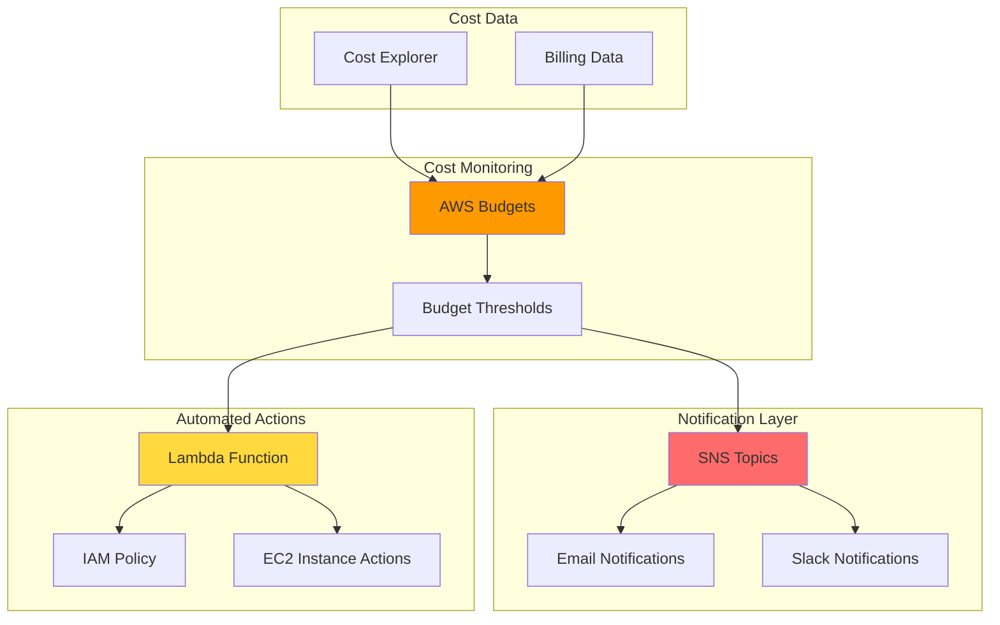

# Budget Alerts and Automated Cost Actions

## Problem

Organizations struggle with unpredictable cloud costs and reactive cost management, often discovering budget overruns after significant damage has occurred. Finance teams need proactive cost controls that automatically trigger alerts and preventive actions when spending approaches predefined thresholds, but lack the technical infrastructure to implement comprehensive budget monitoring and automated cost governance across multiple accounts and services.

## Solution

AWS Budgets provides comprehensive cost monitoring with automated alerts and actions that proactively manage spending. This solution combines budget thresholds with SNS notifications and Lambda-based automated actions to create a multi-layered cost governance system that alerts stakeholders and automatically applies cost control measures when spending exceeds defined limits.

## Architecture Diagram



## Prerequisites

1. AWS account with appropriate permissions for Budgets, SNS, Lambda, and IAM
2. AWS CLI v2 installed and configured (or AWS CloudShell)
3. Basic understanding of AWS cost management and JSON
4. Email address for budget notifications
5. Estimated cost: $2-5 per month for SNS, Lambda, and CloudWatch Logs

> **Note**: AWS Budgets allows 2 free budgets per month, with additional budgets costing $0.02 per day.

## Preparation

```bash
# Set environment variables
export AWS_REGION=$(aws configure get region)
export AWS_ACCOUNT_ID=$(aws sts get-caller-identity \
    --query Account --output text)
export BUDGET_EMAIL="your-email@example.com"

# Generate unique identifiers for resources
RANDOM_SUFFIX=$(aws secretsmanager get-random-password \
    --exclude-punctuation --exclude-uppercase \
    --password-length 6 --require-each-included-type \
    --output text --query RandomPassword)

export BUDGET_NAME="cost-control-budget-${RANDOM_SUFFIX}"
export SNS_TOPIC_NAME="budget-alerts-${RANDOM_SUFFIX}"
export LAMBDA_FUNCTION_NAME="budget-action-${RANDOM_SUFFIX}"
export IAM_ROLE_NAME="budget-lambda-role-${RANDOM_SUFFIX}"
export IAM_POLICY_NAME="budget-action-policy-${RANDOM_SUFFIX}"

echo "✅ Environment variables configured"
echo "Budget Name: ${BUDGET_NAME}"
echo "SNS Topic: ${SNS_TOPIC_NAME}"
echo "Lambda Function: ${LAMBDA_FUNCTION_NAME}"
```

## Steps

1. **Create SNS Topic for Budget Notifications**:

   Amazon SNS serves as the backbone of our notification system, providing reliable message delivery with 99.9% availability SLA. SNS enables decoupled communication between AWS Budgets and multiple notification endpoints, supporting email, SMS, HTTP, and Lambda integrations. This pub/sub pattern ensures budget alerts reach stakeholders through their preferred channels while maintaining system resilience.

   ```bash
   # Create SNS topic for budget alerts
   SNS_TOPIC_ARN=$(aws sns create-topic \
       --name "${SNS_TOPIC_NAME}" \
       --query TopicArn --output text)
   
   # Subscribe email to SNS topic
   aws sns subscribe \
       --topic-arn "${SNS_TOPIC_ARN}" \
       --protocol email \
       --notification-endpoint "${BUDGET_EMAIL}"
   
   echo "✅ SNS topic created: ${SNS_TOPIC_ARN}"
   echo "Check your email and confirm the subscription"
   ```

   The SNS topic is now operational and ready to deliver budget notifications. This foundational messaging layer enables both human stakeholders and automated systems to respond to budget events, supporting the comprehensive cost governance architecture detailed in the [AWS SNS Documentation](https://docs.aws.amazon.com/sns/).

2. **Create IAM Role for Lambda Budget Actions**:

   IAM roles enable secure, temporary credential delegation without embedding long-term access keys in application code. This security model follows the principle of least privilege, ensuring our Lambda function can access only the specific AWS resources required for budget remediation. The trust policy restricts role assumption to the Lambda service, preventing unauthorized access while enabling automated cost control actions.

   ```bash
   # Create trust policy for Lambda
   cat > /tmp/lambda-trust-policy.json << EOF
   {
       "Version": "2012-10-17",
       "Statement": [
           {
               "Effect": "Allow",
               "Principal": {
                   "Service": "lambda.amazonaws.com"
               },
               "Action": "sts:AssumeRole"
           }
       ]
   }
   EOF
   
   # Create IAM role
   IAM_ROLE_ARN=$(aws iam create-role \
       --role-name "${IAM_ROLE_NAME}" \
       --assume-role-policy-document file:///tmp/lambda-trust-policy.json \
       --query Role.Arn --output text)
   
   echo "✅ IAM role created: ${IAM_ROLE_ARN}"
   ```

   The Lambda execution role is now established, providing the security foundation for automated budget actions. This role will enable our function to interact with EC2, SNS, and CloudWatch services using temporary, rotatable credentials rather than permanent access keys, aligning with AWS security best practices outlined in the [IAM Best Practices Guide](https://docs.aws.amazon.com/IAM/latest/UserGuide/best-practices.html).

3. **Create IAM Policy for Budget Actions**:

   This IAM policy implements granular permissions that enable automated cost control while maintaining security boundaries. The policy grants specific permissions for CloudWatch Logs (observability), EC2 instance management (cost remediation), SNS publishing (notifications), and budget monitoring. This least-privilege approach ensures our automation can respond to budget alerts without unnecessary broad access, supporting both operational requirements and security compliance.

   ```bash
   # Create policy for budget actions
   cat > /tmp/budget-action-policy.json << EOF
   {
       "Version": "2012-10-17",
       "Statement": [
           {
               "Effect": "Allow",
               "Action": [
                   "logs:CreateLogGroup",
                   "logs:CreateLogStream",
                   "logs:PutLogEvents"
               ],
               "Resource": "arn:aws:logs:${AWS_REGION}:${AWS_ACCOUNT_ID}:*"
           },
           {
               "Effect": "Allow",
               "Action": [
                   "ec2:DescribeInstances",
                   "ec2:StopInstances",
                   "ec2:StartInstances",
                   "ec2:DescribeInstanceStatus"
               ],
               "Resource": "*"
           },
           {
               "Effect": "Allow",
               "Action": [
                   "sns:Publish"
               ],
               "Resource": "${SNS_TOPIC_ARN}"
           },
           {
               "Effect": "Allow",
               "Action": [
                   "budgets:ViewBudget",
                   "budgets:ModifyBudget"
               ],
               "Resource": "*"
           }
       ]
   }
   EOF
   
   # Create and attach policy
   aws iam create-policy \
       --policy-name "${IAM_POLICY_NAME}" \
       --policy-document file:///tmp/budget-action-policy.json
   
   aws iam attach-role-policy \
       --role-name "${IAM_ROLE_NAME}" \
       --policy-arn "arn:aws:iam::${AWS_ACCOUNT_ID}:policy/${IAM_POLICY_NAME}"
   
   echo "✅ IAM policy created and attached"
   ```

   The policy is now attached to the Lambda role, establishing the precise permissions required for intelligent cost control. This configuration enables the automation to identify and stop development instances while maintaining audit trails through CloudWatch Logs, creating a transparent and accountable cost management system.

4. **Create Lambda Function for Budget Actions**:

   AWS Lambda provides serverless compute capabilities that automatically scale and charge only for execution time, making it ideal for budget-triggered actions. Lambda functions can process SNS messages within milliseconds and execute complex business logic without infrastructure management. This event-driven architecture ensures immediate response to budget alerts while minimizing operational overhead and costs.

   ```bash
   # Create Lambda function code
   cat > /tmp/budget-action-function.py << 'EOF'
   import json
   import boto3
   import logging
   import os
   
   logger = logging.getLogger()
   logger.setLevel(logging.INFO)
   
   def lambda_handler(event, context):
       try:
           # Parse the budget alert event
           message = json.loads(event['Records'][0]['Sns']['Message'])
           budget_name = message.get('BudgetName', 'Unknown')
           account_id = message.get('AccountId', 'Unknown')
           
           logger.info(f"Budget alert triggered for {budget_name} in account {account_id}")
           
           # Initialize AWS clients
           ec2 = boto3.client('ec2')
           sns = boto3.client('sns')
           
           # Get development instances (tagged as Environment=Development)
           response = ec2.describe_instances(
               Filters=[
                   {'Name': 'tag:Environment', 'Values': ['Development', 'Dev']},
                   {'Name': 'instance-state-name', 'Values': ['running']}
               ]
           )
           
           instances_to_stop = []
           for reservation in response['Reservations']:
               for instance in reservation['Instances']:
                   instances_to_stop.append(instance['InstanceId'])
           
           # Stop development instances
           if instances_to_stop:
               ec2.stop_instances(InstanceIds=instances_to_stop)
               logger.info(f"Stopped {len(instances_to_stop)} development instances")
               
               # Get SNS topic ARN from environment variable
               sns_topic_arn = os.environ.get('SNS_TOPIC_ARN')
               if sns_topic_arn:
                   sns.publish(
                       TopicArn=sns_topic_arn,
                       Subject=f'Budget Action Executed - {budget_name}',
                       Message=f'Automatically stopped {len(instances_to_stop)} development instances due to budget alert.\n\nInstances: {", ".join(instances_to_stop)}'
                   )
           else:
               logger.info("No development instances found to stop")
           
           return {
               'statusCode': 200,
               'body': json.dumps({
                   'message': f'Budget action completed for {budget_name}',
                   'instances_stopped': len(instances_to_stop)
               })
           }
           
       except Exception as e:
           logger.error(f"Error executing budget action: {str(e)}")
           raise e
   EOF
   
   # Create deployment package
   cd /tmp
   zip budget-action-function.zip budget-action-function.py
   
   # Create Lambda function with updated runtime
   LAMBDA_FUNCTION_ARN=$(aws lambda create-function \
       --function-name "${LAMBDA_FUNCTION_NAME}" \
       --runtime python3.12 \
       --role "${IAM_ROLE_ARN}" \
       --handler budget-action-function.lambda_handler \
       --zip-file fileb://budget-action-function.zip \
       --description "Automated budget action function" \
       --timeout 60 \
       --environment Variables="{SNS_TOPIC_ARN=${SNS_TOPIC_ARN}}" \
       --query FunctionArn --output text)
   
   echo "✅ Lambda function created: ${LAMBDA_FUNCTION_ARN}"
   ```

   The Lambda function is now deployed and ready to process budget alert events. This intelligent automation can analyze budget notifications, identify appropriate cost control measures, and execute targeted actions like stopping development instances. The function maintains operational continuity by protecting production workloads while implementing immediate cost controls when budget thresholds are exceeded.

5. **Create Budget with Multiple Alert Thresholds**:

   AWS Budgets offers comprehensive cost monitoring with both actual and forecasted alerts, enabling proactive financial management. The multi-threshold configuration creates a graduated response system: early warnings at 80% enable preventive measures, forecasted alerts at 90% trigger escalation procedures, and critical alerts at 100% activate immediate cost controls. This approach transforms reactive cost management into predictive financial governance, as detailed in the [AWS Budgets User Guide](https://docs.aws.amazon.com/cost-management/latest/userguide/budgets-managing-costs.html).

   ```bash
   # Create budget configuration with proper timestamp format
   CURRENT_MONTH_START=$(date -d "$(date +%Y-%m-01)" +%s)
   BUDGET_END_DATE=$(date -d "$(date +%Y-%m-01) +2 years" +%s)
   
   cat > /tmp/budget-config.json << EOF
   {
       "BudgetName": "${BUDGET_NAME}",
       "BudgetLimit": {
           "Amount": "100",
           "Unit": "USD"
       },
       "BudgetType": "COST",
       "CostTypes": {
           "IncludeCredit": false,
           "IncludeDiscount": true,
           "IncludeOtherSubscription": true,
           "IncludeRecurring": true,
           "IncludeRefund": true,
           "IncludeSubscription": true,
           "IncludeSupport": true,
           "IncludeTax": true,
           "IncludeUpfront": true,
           "UseBlended": false,
           "UseAmortized": false
       },
       "TimeUnit": "MONTHLY",
       "TimePeriod": {
           "Start": ${CURRENT_MONTH_START},
           "End": ${BUDGET_END_DATE}
       }
   }
   EOF
   
   # Create notifications configuration
   cat > /tmp/budget-notifications.json << EOF
   [
       {
           "Notification": {
               "NotificationType": "ACTUAL",
               "ComparisonOperator": "GREATER_THAN",
               "Threshold": 80,
               "ThresholdType": "PERCENTAGE"
           },
           "Subscribers": [
               {
                   "SubscriptionType": "EMAIL",
                   "Address": "${BUDGET_EMAIL}"
               },
               {
                   "SubscriptionType": "SNS",
                   "Address": "${SNS_TOPIC_ARN}"
               }
           ]
       },
       {
           "Notification": {
               "NotificationType": "FORECASTED",
               "ComparisonOperator": "GREATER_THAN",
               "Threshold": 90,
               "ThresholdType": "PERCENTAGE"
           },
           "Subscribers": [
               {
                   "SubscriptionType": "EMAIL",
                   "Address": "${BUDGET_EMAIL}"
               },
               {
                   "SubscriptionType": "SNS",
                   "Address": "${SNS_TOPIC_ARN}"
               }
           ]
       },
       {
           "Notification": {
               "NotificationType": "ACTUAL",
               "ComparisonOperator": "GREATER_THAN",
               "Threshold": 100,
               "ThresholdType": "PERCENTAGE"
           },
           "Subscribers": [
               {
                   "SubscriptionType": "EMAIL",
                   "Address": "${BUDGET_EMAIL}"
               },
               {
                   "SubscriptionType": "SNS",
                   "Address": "${SNS_TOPIC_ARN}"
               }
           ]
       }
   ]
   EOF
   
   # Create budget
   aws budgets create-budget \
       --account-id "${AWS_ACCOUNT_ID}" \
       --budget file:///tmp/budget-config.json \
       --notifications-with-subscribers file:///tmp/budget-notifications.json
   
   echo "✅ Budget created with multiple alert thresholds"
   ```

   The budget is now active with intelligent threshold monitoring that provides both actual spend tracking and forecasted cost predictions. This multi-layered alert system ensures stakeholders receive timely notifications while automated systems can respond appropriately based on the severity of budget variance, creating a comprehensive cost governance framework.

6. **Configure Lambda Trigger for SNS Topic**:

   Integrating Lambda with SNS creates an event-driven automation pipeline that responds to budget alerts within seconds. The resource-based policy allows SNS to invoke the Lambda function, while the subscription ensures all budget notifications trigger automated actions. This loose coupling design pattern enables scalable, resilient automation that can process multiple concurrent budget events without bottlenecks.

   ```bash
   # Add SNS trigger to Lambda function
   aws lambda add-permission \
       --function-name "${LAMBDA_FUNCTION_NAME}" \
       --statement-id "sns-trigger" \
       --action lambda:InvokeFunction \
       --principal sns.amazonaws.com \
       --source-arn "${SNS_TOPIC_ARN}"
   
   # Subscribe Lambda to SNS topic
   aws sns subscribe \
       --topic-arn "${SNS_TOPIC_ARN}" \
       --protocol lambda \
       --notification-endpoint "${LAMBDA_FUNCTION_ARN}"
   
   echo "✅ Lambda function subscribed to SNS topic"
   ```

   The integration is now complete, establishing an automated response system that activates whenever budget thresholds are exceeded. This event-driven architecture ensures zero-delay response to cost overruns while maintaining the flexibility to add additional automated actions or notification channels in the future.

7. **Create Budget Action for Automated Policy Application**:

   IAM Deny policies provide a powerful mechanism for enforcing cost controls by preventing expensive resource provisioning when budgets are exceeded. This policy restricts users to cost-effective instance types (t3.nano, t3.micro, t3.small) while maintaining operational capability. The conditional logic ensures business continuity by allowing essential small instances while blocking expensive compute resources that could significantly impact budget compliance.

   ```bash
   # Create restrictive IAM policy for budget actions
   cat > /tmp/budget-restriction-policy.json << EOF
   {
       "Version": "2012-10-17",
       "Statement": [
           {
               "Effect": "Deny",
               "Action": [
                   "ec2:RunInstances"
               ],
               "Resource": "arn:aws:ec2:*:*:instance/*",
               "Condition": {
                   "StringNotEquals": {
                       "ec2:InstanceType": [
                           "t3.nano",
                           "t3.micro",
                           "t3.small"
                       ]
                   }
               }
           },
           {
               "Effect": "Deny",
               "Action": [
                   "rds:CreateDBInstance"
               ],
               "Resource": "*",
               "Condition": {
                   "StringNotEquals": {
                       "rds:db-instance-class": [
                           "db.t3.micro",
                           "db.t3.small"
                       ]
                   }
               }
           }
       ]
   }
   EOF
   
   # Create budget action policy
   BUDGET_ACTION_POLICY_ARN=$(aws iam create-policy \
       --policy-name "budget-restriction-policy-${RANDOM_SUFFIX}" \
       --policy-document file:///tmp/budget-restriction-policy.json \
       --query Policy.Arn --output text)
   
   echo "✅ Budget action policy created: ${BUDGET_ACTION_POLICY_ARN}"
   ```

   The restrictive policy is now available for AWS Budgets to apply automatically when cost thresholds are exceeded. This proactive approach prevents additional budget overruns by limiting resource provisioning capabilities while preserving essential operational functions, implementing intelligent cost controls as outlined in the [AWS Budgets Actions documentation](https://docs.aws.amazon.com/cost-management/latest/userguide/budgets-controls.html).

8. **Create IAM Role for Budget Actions**:

   The AWS Budgets service requires specific IAM permissions to execute automated actions on your behalf. This service-linked role enables AWS Budgets to apply IAM policies, control EC2 instances, and manage RDS resources when budget thresholds are triggered. The trust policy restricts role assumption to the AWS Budgets service, ensuring only legitimate budget events can trigger cost control actions, maintaining security while enabling automated financial governance.

   ```bash
   # Create trust policy for AWS Budgets
   cat > /tmp/budget-service-trust-policy.json << EOF
   {
       "Version": "2012-10-17",
       "Statement": [
           {
               "Effect": "Allow",
               "Principal": {
                   "Service": "budgets.amazonaws.com"
               },
               "Action": "sts:AssumeRole"
           }
       ]
   }
   EOF
   
   # Create IAM role for budget actions
   BUDGET_ACTION_ROLE_ARN=$(aws iam create-role \
       --role-name "budget-action-role-${RANDOM_SUFFIX}" \
       --assume-role-policy-document file:///tmp/budget-service-trust-policy.json \
       --query Role.Arn --output text)
   
   # Attach necessary policies
   aws iam attach-role-policy \
       --role-name "budget-action-role-${RANDOM_SUFFIX}" \
       --policy-arn "arn:aws:iam::aws:policy/service-role/BudgetsActionsWithAWSResourceControlAccess"
   
   echo "✅ Budget action role created: ${BUDGET_ACTION_ROLE_ARN}"
   ```

   The budget action role is now configured with the permissions required to execute cost control measures automatically. This completes the automated governance framework, enabling AWS Budgets to apply restrictive policies and control resources without manual intervention when budget violations occur, creating a self-healing cost management system.

## Validation & Testing

1. **Verify Budget Creation**:

   ```bash
   # Check budget details
   aws budgets describe-budget \
       --account-id "${AWS_ACCOUNT_ID}" \
       --budget-name "${BUDGET_NAME}"
   
   # List all notifications for the budget
   aws budgets describe-notifications-for-budget \
       --account-id "${AWS_ACCOUNT_ID}" \
       --budget-name "${BUDGET_NAME}"
   ```

   Expected output: Budget configuration with three notification thresholds at 80%, 90%, and 100%.

2. **Test SNS Topic and Lambda Integration**:

   ```bash
   # Test SNS topic by sending test message
   aws sns publish \
       --topic-arn "${SNS_TOPIC_ARN}" \
       --subject "Budget Alert Test" \
       --message '{"BudgetName": "Test Budget", "AccountId": "'${AWS_ACCOUNT_ID}'", "AlertType": "ACTUAL", "Threshold": 80}'
   
   # Check Lambda function logs
   aws logs describe-log-groups \
       --log-group-name-prefix "/aws/lambda/${LAMBDA_FUNCTION_NAME}"
   
   # View recent log events
   aws logs describe-log-streams \
       --log-group-name "/aws/lambda/${LAMBDA_FUNCTION_NAME}" \
       --order-by LastEventTime --descending
   ```

3. **Verify Budget Subscribers**:

   ```bash
   # Check email subscription status
   aws budgets describe-subscribers-for-notification \
       --account-id "${AWS_ACCOUNT_ID}" \
       --budget-name "${BUDGET_NAME}" \
       --notification NotificationType=ACTUAL,ComparisonOperator=GREATER_THAN,Threshold=80,ThresholdType=PERCENTAGE
   ```

   Expected output: Email and SNS subscribers for each notification threshold.

4. **Test Budget Action Permissions**:

   ```bash
   # Verify Lambda function configuration
   aws lambda get-function \
       --function-name "${LAMBDA_FUNCTION_NAME}" \
       --query Configuration.State
   
   # Test IAM policy simulation
   aws iam simulate-principal-policy \
       --policy-source-arn "${BUDGET_ACTION_ROLE_ARN}" \
       --action-names "ec2:RunInstances" \
       --resource-arns "*"
   ```

## Cleanup

1. **Delete Budget and Notifications**:

   ```bash
   # Delete budget (this also removes all associated notifications)
   aws budgets delete-budget \
       --account-id "${AWS_ACCOUNT_ID}" \
       --budget-name "${BUDGET_NAME}"
   
   echo "✅ Budget deleted"
   ```

2. **Remove Lambda Function and Role**:

   ```bash
   # Delete Lambda function
   aws lambda delete-function \
       --function-name "${LAMBDA_FUNCTION_NAME}"
   
   # Detach and delete IAM policies
   aws iam detach-role-policy \
       --role-name "${IAM_ROLE_NAME}" \
       --policy-arn "arn:aws:iam::${AWS_ACCOUNT_ID}:policy/${IAM_POLICY_NAME}"
   
   aws iam delete-policy \
       --policy-arn "arn:aws:iam::${AWS_ACCOUNT_ID}:policy/${IAM_POLICY_NAME}"
   
   aws iam delete-role \
       --role-name "${IAM_ROLE_NAME}"
   
   echo "✅ Lambda function and IAM role deleted"
   ```

3. **Delete SNS Topic**:

   ```bash
   # Delete SNS topic (this also removes all subscriptions)
   aws sns delete-topic \
       --topic-arn "${SNS_TOPIC_ARN}"
   
   echo "✅ SNS topic deleted"
   ```

4. **Remove Budget Action Resources**:

   ```bash
   # Delete budget action policy
   aws iam delete-policy \
       --policy-arn "${BUDGET_ACTION_POLICY_ARN}"
   
   # Detach and delete budget action role
   aws iam detach-role-policy \
       --role-name "budget-action-role-${RANDOM_SUFFIX}" \
       --policy-arn "arn:aws:iam::aws:policy/service-role/BudgetsActionsWithAWSResourceControlAccess"
   
   aws iam delete-role \
       --role-name "budget-action-role-${RANDOM_SUFFIX}"
   
   echo "✅ Budget action resources deleted"
   ```

5. **Clean up temporary files**:

   ```bash
   # Remove temporary files
   rm -f /tmp/budget-*.json /tmp/lambda-*.json
   rm -f /tmp/budget-action-function.py /tmp/budget-action-function.zip
   
   echo "✅ Temporary files cleaned up"
   ```

## Discussion

AWS Budgets provides a comprehensive cost management solution that goes beyond simple spending alerts. The multi-threshold approach implemented in this recipe creates a graduated response system where stakeholders receive early warnings at 80% of budget, forecasted alerts at 90%, and critical alerts at 100% actual spend. This layered notification system enables proactive cost management rather than reactive damage control, following principles outlined in the [AWS Well-Architected Cost Optimization Pillar](https://docs.aws.amazon.com/wellarchitected/latest/cost-optimization-pillar/welcome.html).

The automated action component demonstrates how Lambda functions can serve as intelligent cost control mechanisms. By automatically stopping non-production instances when budget thresholds are exceeded, organizations can implement immediate cost containment measures without manual intervention. The tagging-based approach ensures that only development resources are affected, protecting production workloads from automated actions while maintaining operational continuity.

Budget actions can also apply IAM policies to restrict resource provisioning, providing another layer of cost control. The sample policy restricts users to only small instance types when budgets are exceeded, preventing the launch of expensive compute resources. This approach balances cost control with operational continuity, as referenced in the [AWS Budgets Best Practices Guide](https://docs.aws.amazon.com/cost-management/latest/userguide/budgets-best-practices.html).

The SNS integration enables flexible notification routing, supporting email, SMS, and even integration with chat platforms like Slack through Lambda functions. This multi-channel approach ensures that budget alerts reach the right stakeholders through their preferred communication methods, improving response times and accountability. The pub/sub architecture also supports adding additional automated responses without modifying existing components.

> **Tip**: Use separate budgets for different cost categories (compute, storage, data transfer) to get granular insights into spending patterns and implement targeted cost controls.

## Challenge

Extend this solution by implementing these enhancements:

1. **Multi-Account Budget Management**: Create organization-level budgets that aggregate costs across multiple AWS accounts and implement centralized budget actions through AWS Organizations and AWS Control Tower.

2. **Dynamic Budget Thresholds**: Implement a Lambda function that adjusts budget limits based on historical spending patterns and seasonal variations using CloudWatch metrics and Amazon Forecast machine learning.

3. **Advanced Automated Actions**: Create more sophisticated budget actions that can resize RDS instances, modify Auto Scaling group configurations, or temporarily disable non-essential services based on budget thresholds and business criticality tags.

4. **Cost Anomaly Integration**: Combine AWS Budgets with AWS Cost Anomaly Detection to create intelligent alerts that distinguish between expected budget overruns and unusual spending patterns requiring immediate investigation.

5. **Slack Integration with Action Approvals**: Build a Slack bot that not only sends budget alerts but also allows managers to approve or reject automated actions through interactive Slack messages with audit trails.

## Infrastructure Code

*Infrastructure code will be generated after recipe approval.*