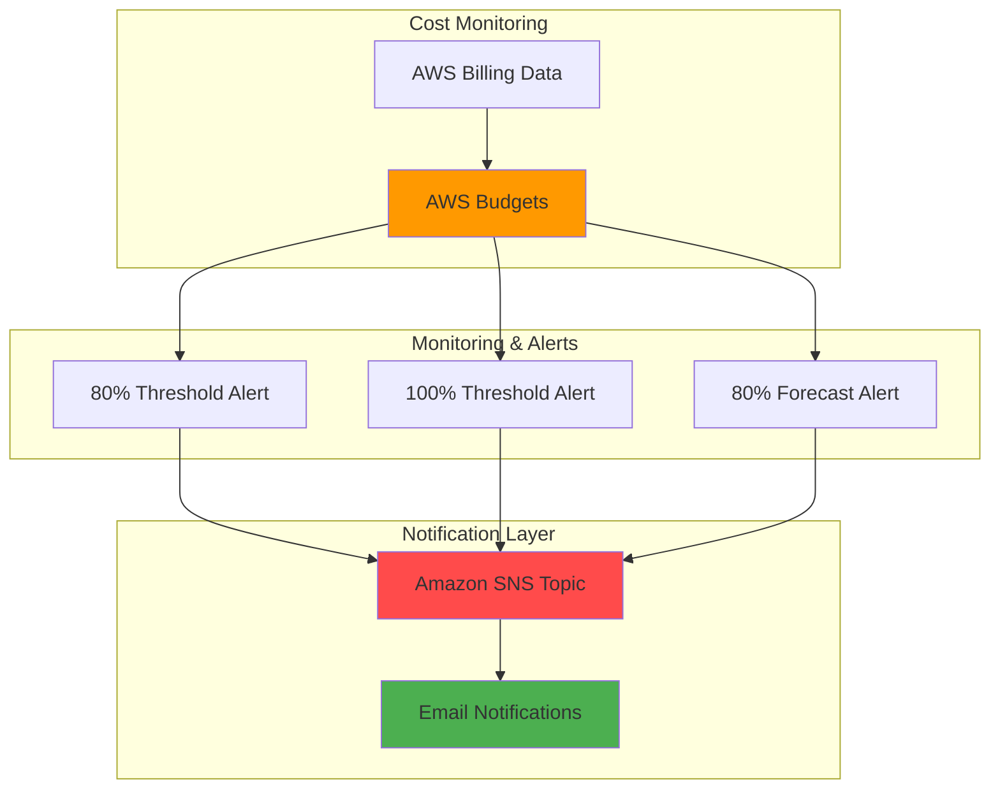

# Budget Monitoring with AWS Budgets and SNS

## Problem

Organizations struggle to control AWS spending without real-time visibility into cost trends and usage patterns. Without proactive cost monitoring, unexpected charges can accumulate rapidly, leading to budget overruns that impact business operations. Many teams discover cost spikes only after receiving monthly bills, making it impossible to take corrective action in time to prevent financial impact.

## Solution

AWS Budgets combined with SNS notifications provides automated cost monitoring and real-time alerts when spending approaches or exceeds predefined thresholds. This solution enables proactive cost management by sending email notifications at configurable percentage thresholds, allowing teams to take immediate action before budgets are exceeded.

## Architecture Diagram



## Prerequisites

1. AWS account with appropriate billing and budgets permissions (BudgetsFullAccess or custom policy)
2. AWS CLI installed and configured (version 2.0 or later) or AWS CloudShell
3. Valid email address for receiving budget notifications
4. Basic understanding of AWS cost management concepts
5. Estimated cost: $0 (AWS Budgets allows up to 2 free budgets per account)

> **Note**: AWS Budgets provides the first two budgets free of charge. Additional budgets cost $0.02 per day per budget.

## Preparation

```bash
# Set environment variables
export AWS_REGION=$(aws configure get region)
export AWS_ACCOUNT_ID=$(aws sts get-caller-identity \
    --query Account --output text)

# Set your email address for notifications (replace with your email)
export NOTIFICATION_EMAIL="your-email@example.com"

# Generate unique identifier for budget name
RANDOM_SUFFIX=$(aws secretsmanager get-random-password \
    --exclude-punctuation --exclude-uppercase \
    --password-length 6 --require-each-included-type \
    --output text --query RandomPassword)

export BUDGET_NAME="monthly-cost-budget-${RANDOM_SUFFIX}"
export SNS_TOPIC_NAME="budget-alerts-${RANDOM_SUFFIX}"

echo "✅ Environment configured with budget name: ${BUDGET_NAME}"
```

## Steps

1. **Create SNS Topic for Budget Notifications**:

   Amazon SNS provides a reliable, scalable messaging service that delivers budget alert notifications to email subscribers. Creating a dedicated topic for budget alerts ensures proper organization and allows for easy management of notification preferences, enabling reliable delivery even during high-volume periods.

   ```bash
   # Create SNS topic for budget notifications
   SNS_TOPIC_ARN=$(aws sns create-topic \
       --name ${SNS_TOPIC_NAME} \
       --query 'TopicArn' --output text)
   
   echo "✅ Created SNS topic: ${SNS_TOPIC_ARN}"
   ```

2. **Subscribe Email Address to SNS Topic**:

   Email subscriptions enable real-time delivery of budget alerts to stakeholders. SNS will send a confirmation email that must be confirmed to activate the subscription, ensuring that notifications reach the intended recipients and preventing unauthorized subscriptions.

   ```bash
   # Subscribe email to SNS topic
   SUBSCRIPTION_ARN=$(aws sns subscribe \
       --topic-arn ${SNS_TOPIC_ARN} \
       --protocol email \
       --notification-endpoint ${NOTIFICATION_EMAIL} \
       --query 'SubscriptionArn' --output text)
   
   echo "✅ Email subscription created. Check ${NOTIFICATION_EMAIL} for confirmation."
   echo "Please confirm the subscription in your email before proceeding."
   ```

3. **Create Budget Configuration JSON File**:

   AWS Budgets requires detailed configuration to define spending limits, time periods, and cost tracking preferences. This configuration establishes a monthly cost budget that tracks all AWS services and includes various cost types for comprehensive monitoring, following AWS recommended practices for budget creation.

   ```bash
   # Get current month start for budget period
   BUDGET_START=$(date -d "$(date +%Y-%m-01)" --iso-8601)
   BUDGET_START_EPOCH=$(date -d "${BUDGET_START}" +%s)
   
   # Create budget configuration file
   cat > budget.json << EOF
   {
       "BudgetName": "${BUDGET_NAME}",
       "BudgetLimit": {
           "Amount": "100",
           "Unit": "USD"
       },
       "BudgetType": "COST",
       "TimeUnit": "MONTHLY",
       "TimePeriod": {
           "Start": ${BUDGET_START_EPOCH},
           "End": 3706473600
       },
       "CostTypes": {
           "IncludeCredit": true,
           "IncludeDiscount": true,
           "IncludeOtherSubscription": true,
           "IncludeRecurring": true,
           "IncludeRefund": true,
           "IncludeSubscription": true,
           "IncludeSupport": true,
           "IncludeTax": true,
           "IncludeUpfront": true,
           "UseBlended": false
       }
   }
   EOF
   
   echo "✅ Budget configuration created with \$100 monthly limit"
   ```

4. **Create Notification Configuration for Budget Alerts**:

   Multiple notification thresholds provide graduated alerting, enabling early warning at 80% of budget and final alerts at 100%. This configuration includes both actual spend notifications (for current costs) and forecasted notifications (for projected costs), providing comprehensive cost visibility and enabling proactive cost management.

   ```bash
   # Create notifications configuration file
   cat > notifications.json << EOF
   [
       {
           "Notification": {
               "ComparisonOperator": "GREATER_THAN",
               "NotificationType": "ACTUAL",
               "Threshold": 80,
               "ThresholdType": "PERCENTAGE"
           },
           "Subscribers": [
               {
                   "Address": "${SNS_TOPIC_ARN}",
                   "SubscriptionType": "SNS"
               }
           ]
       },
       {
           "Notification": {
               "ComparisonOperator": "GREATER_THAN",
               "NotificationType": "ACTUAL",
               "Threshold": 100,
               "ThresholdType": "PERCENTAGE"
           },
           "Subscribers": [
               {
                   "Address": "${SNS_TOPIC_ARN}",
                   "SubscriptionType": "SNS"
               }
           ]
       },
       {
           "Notification": {
               "ComparisonOperator": "GREATER_THAN",
               "NotificationType": "FORECASTED",
               "Threshold": 80,
               "ThresholdType": "PERCENTAGE"
           },
           "Subscribers": [
               {
                   "Address": "${SNS_TOPIC_ARN}",
                   "SubscriptionType": "SNS"
               }
           ]
       }
   ]
   EOF
   
   echo "✅ Notification configuration created with 80% and 100% thresholds"
   ```

5. **Create AWS Budget with Notifications**:

   AWS Budgets provides comprehensive cost tracking and forecasting capabilities using machine learning algorithms to predict future spending. Creating the budget with integrated notifications establishes automated monitoring that tracks actual and forecasted costs against the defined limits, enabling proactive cost management decisions.

   ```bash
   # Create the budget with notifications
   aws budgets create-budget \
       --account-id ${AWS_ACCOUNT_ID} \
       --budget file://budget.json \
       --notifications-with-subscribers file://notifications.json
   
   echo "✅ Budget created successfully: ${BUDGET_NAME}"
   ```

6. **Verify Budget Creation and Configuration**:

   Budget verification ensures proper configuration and provides visibility into current spending patterns. The budget summary includes actual spending, forecasted costs, and remaining budget allocation, enabling immediate assessment of cost trends and validation of the monitoring system.

   ```bash
   # Verify budget was created successfully
   aws budgets describe-budget \
       --account-id ${AWS_ACCOUNT_ID} \
       --budget-name ${BUDGET_NAME} \
       --query 'Budget.{Name:BudgetName,Limit:BudgetLimit,ActualSpend:CalculatedSpend.ActualSpend,ForecastedSpend:CalculatedSpend.ForecastedSpend}' \
       --output table
   
   echo "✅ Budget verification completed"
   ```

## Validation & Testing

1. **Verify Budget Status and Current Spending**:

   ```bash
   # Check budget details and current spending
   aws budgets describe-budget \
       --account-id ${AWS_ACCOUNT_ID} \
       --budget-name ${BUDGET_NAME}
   ```

   Expected output: JSON response showing budget configuration, current actual spend, and forecasted spend.

2. **Verify Notification Configuration**:

   ```bash
   # List notifications for the budget
   aws budgets describe-notifications-for-budget \
       --account-id ${AWS_ACCOUNT_ID} \
       --budget-name ${BUDGET_NAME}
   ```

   Expected output: List of three notifications (80% actual, 100% actual, 80% forecasted).

3. **Test SNS Topic Subscription**:

   ```bash
   # Send test message to verify SNS setup
   aws sns publish \
       --topic-arn ${SNS_TOPIC_ARN} \
       --message "Test message: Budget monitoring system is active for ${BUDGET_NAME}" \
       --subject "Budget Alert Test"
   
   echo "✅ Test notification sent to ${NOTIFICATION_EMAIL}"
   ```

4. **Verify Email Subscription Status**:

   ```bash
   # Check SNS subscription status
   aws sns list-subscriptions-by-topic \
       --topic-arn ${SNS_TOPIC_ARN} \
       --query 'Subscriptions[?Protocol==`email`].{Email:Endpoint,Status:SubscriptionArn}' \
       --output table
   ```

   Expected output: Table showing email subscription with "Confirmed" status.

## Cleanup

1. **Delete Budget and Associated Notifications**:

   ```bash
   # Delete the budget (this removes all associated notifications)
   aws budgets delete-budget \
       --account-id ${AWS_ACCOUNT_ID} \
       --budget-name ${BUDGET_NAME}
   
   echo "✅ Budget deleted: ${BUDGET_NAME}"
   ```

2. **Remove SNS Topic and Subscriptions**:

   ```bash
   # Delete SNS topic (this removes all subscriptions)
   aws sns delete-topic \
       --topic-arn ${SNS_TOPIC_ARN}
   
   echo "✅ SNS topic deleted: ${SNS_TOPIC_NAME}"
   ```

3. **Clean Up Local Configuration Files**:

   ```bash
   # Remove temporary files
   rm -f budget.json notifications.json
   
   # Clear environment variables
   unset BUDGET_NAME SNS_TOPIC_NAME NOTIFICATION_EMAIL
   unset SNS_TOPIC_ARN SUBSCRIPTION_ARN RANDOM_SUFFIX
   unset BUDGET_START BUDGET_START_EPOCH
   
   echo "✅ Cleanup completed"
   ```

## Discussion

AWS Budgets provides sophisticated cost management capabilities by leveraging machine learning algorithms to analyze historical spending patterns and predict future costs. The service tracks actual spending in real-time and generates forecasts based on current usage trends, enabling proactive cost management decisions. By combining AWS Budgets with SNS notifications, organizations establish automated alerting systems that provide immediate visibility into cost anomalies and spending trends, following AWS Well-Architected Framework cost optimization principles.

The multi-threshold notification approach implemented in this recipe provides graduated alerting that enables different response strategies. The 80% threshold serves as an early warning system, allowing teams to investigate cost drivers and implement optimization measures before budget limits are reached. The 100% threshold provides final alerts when budgets are exceeded, triggering immediate cost reduction actions. Forecasted notifications add predictive capabilities, alerting teams when projected spending indicates potential budget overruns based on current usage patterns, enabling proactive intervention.

AWS Budgets supports various filtering and grouping options that enable granular cost tracking across services, accounts, regions, and custom tags. Organizations can create department-specific budgets, project-based cost tracking, or service-level spending limits to align with business requirements. The service integrates seamlessly with AWS Cost Explorer, providing detailed cost analysis and optimization recommendations. For enterprises managing multiple AWS accounts, AWS Organizations enables centralized budget management with consolidated billing and cross-account cost visibility.

The notification system leverages Amazon SNS's reliable message delivery infrastructure, ensuring that budget alerts reach stakeholders even during high-volume periods. SNS supports multiple delivery protocols including email, SMS, HTTP endpoints, and Lambda functions, enabling integration with existing alerting systems and automated response workflows. Organizations can extend this basic setup by implementing Lambda-based automated responses that trigger cost optimization actions when budget thresholds are exceeded, creating a comprehensive cost governance framework.

> **Tip**: Configure different budget thresholds for different cost categories (development vs. production environments) to enable appropriate responses based on the criticality of workloads and available optimization options.

*Sources: [AWS Budgets User Guide](https://docs.aws.amazon.com/cost-management/latest/userguide/budgets-managing-costs.html), [Amazon SNS Developer Guide](https://docs.aws.amazon.com/sns/latest/dg/welcome.html), [AWS Cost Management Best Practices](https://docs.aws.amazon.com/cost-management/latest/userguide/budgets-best-practices.html), [AWS Well-Architected Cost Optimization Pillar](https://docs.aws.amazon.com/wellarchitected/latest/cost-optimization-pillar/welcome.html)*

## Challenge

Extend this budget monitoring solution by implementing these enhancements:

1. **Multi-Service Budget Tracking**: Create separate budgets for different AWS services (EC2, S3, RDS) using cost filters to enable granular spending visibility and service-specific optimization strategies.

2. **Department-Based Cost Allocation**: Implement tag-based budget filtering to track spending by departments or projects, enabling chargeback and cost allocation reporting for organizational cost management.

3. **Automated Response Actions**: Integrate AWS Lambda functions with SNS notifications to implement automated cost optimization responses, such as stopping non-production instances or scaling down development environments when budget thresholds are exceeded.

4. **Advanced Analytics Dashboard**: Connect budget data to Amazon QuickSight for interactive cost analysis dashboards that provide trend analysis, cost forecasting, and optimization recommendations across multiple time periods and cost dimensions.

5. **Cross-Account Budget Monitoring**: Implement organization-wide budget monitoring using AWS Organizations and consolidated billing to track spending across multiple AWS accounts with centralized alerting and reporting capabilities.

## Infrastructure Code

*Infrastructure code will be generated after recipe approval.*