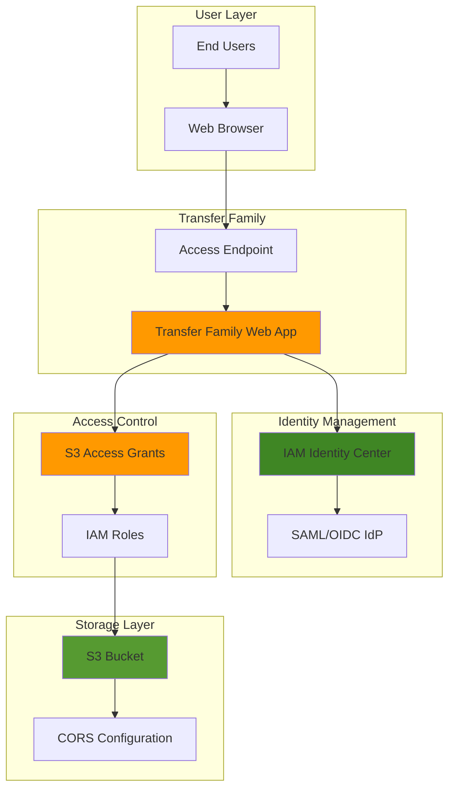

# Building File Portals with Transfer Family

## Problem

Many organizations struggle with providing secure, user-friendly file sharing capabilities to employees and contractors without requiring technical expertise or exposing sensitive data. Traditional file sharing solutions often lack enterprise-grade security controls, require complex client software installations, or don't integrate with existing identity management systems. This creates operational overhead for IT teams and friction for end users who need simple, secure access to business files.

## Solution

AWS Transfer Family Web Apps provides a fully managed, branded web portal that enables secure file uploads, downloads, and management directly through a web browser. The solution integrates seamlessly with IAM Identity Center for centralized identity management and uses S3 Access Grants for fine-grained permission control. This approach eliminates the need for specialized client software while maintaining enterprise security standards and providing a customizable user experience.

## Architecture Diagram



## Prerequisites

1. AWS account with administrative permissions for Transfer Family, S3, and IAM Identity Center
2. AWS CLI v2 installed and configured with appropriate credentials
3. Basic understanding of identity management concepts (SAML, OIDC)
4. An existing IAM Identity Center instance (account or organization level)
5. Estimated cost: $360-400 per month for resources created (primarily web app units at $0.50/hour)

> **Note**: This recipe assumes you have an IAM Identity Center instance configured. If not, the web app creation process can help you set one up.

## Preparation

```bash
# Set environment variables
export AWS_REGION=$(aws configure get region)
export AWS_ACCOUNT_ID=$(aws sts get-caller-identity \
    --query Account --output text)

# Generate unique identifiers for resources
RANDOM_SUFFIX=$(aws secretsmanager get-random-password \
    --exclude-punctuation --exclude-uppercase \
    --password-length 6 --require-each-included-type \
    --output text --query RandomPassword)

# Set resource names
export BUCKET_NAME="file-portal-bucket-${RANDOM_SUFFIX}"
export WEBAPP_NAME="file-portal-webapp-${RANDOM_SUFFIX}"
export USER_NAME="portal-user-${RANDOM_SUFFIX}"
export LOCATION_ROLE_NAME="S3AccessGrantsLocationRole-${RANDOM_SUFFIX}"

echo "✅ AWS environment configured with unique identifiers"
```

## Steps

1. **Create S3 Bucket for File Storage**:

   Amazon S3 provides the foundational storage layer for our file portal with 99.999999999% (11 9's) durability and enterprise-grade security features. The bucket will store all files uploaded and downloaded through the web portal while supporting encryption at rest and access logging for compliance requirements.

   ```bash
   # Create S3 bucket with versioning and encryption
   aws s3 mb s3://${BUCKET_NAME} --region ${AWS_REGION}
   
   # Enable versioning for file history
   aws s3api put-bucket-versioning \
       --bucket ${BUCKET_NAME} \
       --versioning-configuration Status=Enabled
   
   # Enable server-side encryption with AES-256
   aws s3api put-bucket-encryption \
       --bucket ${BUCKET_NAME} \
       --server-side-encryption-configuration \
       'Rules=[{ApplyServerSideEncryptionByDefault:{SSEAlgorithm:AES256}}]'
   
   # Enable access logging for compliance
   aws s3api put-bucket-logging \
       --bucket ${BUCKET_NAME} \
       --bucket-logging-status '{
           "LoggingEnabled": {
               "TargetBucket": "'${BUCKET_NAME}'",
               "TargetPrefix": "access-logs/"
           }
       }'
   
   echo "✅ S3 bucket created with security features enabled"
   ```

   The bucket is now configured with enterprise-grade security features including versioning for file history tracking, encryption at rest for data protection, and access logging for compliance requirements. This provides the secure foundation required for business file sharing.

2. **Create IAM Identity Center User**:

   IAM Identity Center provides centralized identity management with support for external identity providers, multi-factor authentication, and single sign-on capabilities. Creating a test user demonstrates the self-service portal's authentication workflow and ensures proper integration with the web app.

   ```bash
   # Get Identity Center instance details
   export IDC_INSTANCE_ARN=$(aws sso-admin list-instances \
       --query 'Instances[0].InstanceArn' --output text)
   export IDC_IDENTITY_STORE_ID=$(aws sso-admin list-instances \
       --query 'Instances[0].IdentityStoreId' --output text)
   
   # Create a test user in IAM Identity Center
   aws identitystore create-user \
       --identity-store-id ${IDC_IDENTITY_STORE_ID} \
       --user-name ${USER_NAME} \
       --name '{
           "GivenName": "Test",
           "FamilyName": "User"
       }' \
       --display-name "Test User" \
       --emails '[{
           "Value": "test-user@example.com",
           "Type": "work",
           "Primary": true
       }]'
   
   # Store the user ID for later use
   export USER_ID=$(aws identitystore list-users \
       --identity-store-id ${IDC_IDENTITY_STORE_ID} \
       --filters 'AttributePath=UserName,AttributeValue='${USER_NAME} \
       --query 'Users[0].UserId' --output text)
   
   echo "✅ IAM Identity Center user created with ID: ${USER_ID}"
   ```

   The test user is now available in IAM Identity Center with a configured email address and display name. This user will be able to access the web portal once assigned appropriate permissions through Access Grants.

3. **Create S3 Access Grants Instance**:

   S3 Access Grants provides fine-grained access control by mapping corporate identities directly to S3 resources. This eliminates the need for complex IAM policies while enabling temporary credential vending and detailed access auditing for compliance purposes.

   ```bash
   # Create S3 Access Grants instance
   aws s3control create-access-grants-instance \
       --account-id ${AWS_ACCOUNT_ID} \
       --identity-center-arn ${IDC_INSTANCE_ARN}
   
   # Wait for the instance to be ready
   aws s3control get-access-grants-instance \
       --account-id ${AWS_ACCOUNT_ID} \
       --query 'AccessGrantsInstanceId' --output text
   
   echo "✅ S3 Access Grants instance created with Identity Center integration"
   ```

   The Access Grants instance is now configured to work with IAM Identity Center, enabling seamless integration between corporate identities and S3 permissions. This provides scalable access control without managing complex IAM policies.

4. **Create IAM Role for Access Grants Location**:

   The Access Grants location requires an IAM role to perform operations on the S3 bucket. This role provides the necessary permissions for the service to manage access grants and temporary credentials.

   ```bash
   # Create IAM role for Access Grants location
   aws iam create-role \
       --role-name ${LOCATION_ROLE_NAME} \
       --assume-role-policy-document '{
           "Version": "2012-10-17",
           "Statement": [{
               "Effect": "Allow",
               "Principal": {"Service": "s3.amazonaws.com"},
               "Action": "sts:AssumeRole"
           }]
       }'
   
   # Attach policy for S3 operations
   aws iam attach-role-policy \
       --role-name ${LOCATION_ROLE_NAME} \
       --policy-arn arn:aws:iam::aws:policy/AmazonS3FullAccess
   
   # Get the role ARN
   export LOCATION_ROLE_ARN=$(aws iam get-role \
       --role-name ${LOCATION_ROLE_NAME} \
       --query 'Role.Arn' --output text)
   
   echo "✅ IAM role created for Access Grants location"
   ```

   The IAM role is now configured with the necessary permissions to manage S3 access grants and provide temporary credentials to authenticated users.

5. **Register S3 Location in Access Grants**:

   Registering the S3 bucket as a location in Access Grants enables fine-grained permission management at the bucket or prefix level. This creates the foundation for granting specific users access to designated areas of the storage without broad IAM permissions.

   ```bash
   # Register S3 bucket as an Access Grants location
   aws s3control create-access-grants-location \
       --account-id ${AWS_ACCOUNT_ID} \
       --location-scope s3://${BUCKET_NAME}/* \
       --iam-role-arn ${LOCATION_ROLE_ARN} \
       --tags '[{
           "Key": "Purpose",
           "Value": "TransferFamilyWebApp"
       }]'
   
   # Get the location ID
   export LOCATION_ID=$(aws s3control list-access-grants-locations \
       --account-id ${AWS_ACCOUNT_ID} \
       --query 'AccessGrantsLocationsList[?LocationScope==`s3://'${BUCKET_NAME}'/*`].AccessGrantsLocationId' \
       --output text)
   
   echo "✅ S3 location registered in Access Grants with ID: ${LOCATION_ID}"
   ```

   The S3 bucket is now registered as an Access Grants location with an appropriate IAM role for permission management. This enables granular access control that can be assigned to specific users or groups.

6. **Create Access Grant for User**:

   Creating an access grant maps the IAM Identity Center user to specific S3 permissions, enabling secure file operations without requiring direct IAM policy management. This approach provides temporary credentials and detailed access auditing.

   ```bash
   # Create access grant for the test user
   aws s3control create-access-grant \
       --account-id ${AWS_ACCOUNT_ID} \
       --access-grants-location-id ${LOCATION_ID} \
       --access-grants-location-configuration '{
           "S3SubPrefix": "*"
       }' \
       --grantee '{
           "GranteeType": "DIRECTORY_USER",
           "GranteeIdentifier": "'${USER_ID}'"
       }' \
       --permission READWRITE \
       --tags '[{
           "Key": "User",
           "Value": "'${USER_NAME}'"
       }]'
   
   echo "✅ Access grant created for user with read/write permissions"
   ```

   The user now has read/write permissions to the S3 bucket through Access Grants, enabling secure file operations through the web portal. This provides fine-grained access control without complex IAM policy management.

7. **Create IAM Role for Transfer Family Web App**:

   The Transfer Family Web App requires an IAM role to assume when handling identity operations. This role provides the necessary permissions to interact with IAM Identity Center and S3 Access Grants.

   ```bash
   # Create IAM role for Transfer Family Web App
   aws iam create-role \
       --role-name AWSTransferFamilyWebAppIdentityBearerRole \
       --assume-role-policy-document '{
           "Version": "2012-10-17",
           "Statement": [{
               "Effect": "Allow",
               "Principal": {"Service": "transfer.amazonaws.com"},
               "Action": "sts:AssumeRole"
           }]
       }'
   
   # Attach the managed policy for Transfer Family Web App
   aws iam attach-role-policy \
       --role-name AWSTransferFamilyWebAppIdentityBearerRole \
       --policy-arn arn:aws:iam::aws:policy/service-role/AWSTransferFamilyWebAppIdentityBearerRole
   
   # Get the role ARN
   export WEBAPP_ROLE_ARN=$(aws iam get-role \
       --role-name AWSTransferFamilyWebAppIdentityBearerRole \
       --query 'Role.Arn' --output text)
   
   echo "✅ IAM role created for Transfer Family Web App"
   ```

   The IAM role is now configured with the necessary permissions to handle identity operations and integrate with IAM Identity Center and S3 Access Grants.

8. **Create Transfer Family Web App**:

   Transfer Family Web Apps provides a fully managed, customizable web interface for S3 file operations. The service automatically handles authentication, session management, and secure file transfers while providing a branded user experience that requires no technical expertise.

   ```bash
   # Create Transfer Family web app with IAM Identity Center
   aws transfer create-web-app \
       --identity-provider-details '{
           "IdentityCenterConfig": {
               "InstanceArn": "'${IDC_INSTANCE_ARN}'",
               "Role": "'${WEBAPP_ROLE_ARN}'"
           }
       }' \
       --web-app-units '{
           "Provisioned": 1
       }' \
       --tags '[{
           "Key": "Name",
           "Value": "'${WEBAPP_NAME}'"
       }]'
   
   # Get the web app ID
   export WEBAPP_ID=$(aws transfer list-web-apps \
       --query 'WebApps[?Tags[?Key==`Name`&&Value==`'${WEBAPP_NAME}'`]].WebAppId' \
       --output text)
   
   # Wait for web app to be available
   aws transfer wait web-app-available --web-app-id ${WEBAPP_ID}
   
   echo "✅ Transfer Family web app created with ID: ${WEBAPP_ID}"
   ```

   The web app is now created with IAM Identity Center integration and a managed identity bearer role. This provides the secure authentication framework needed for user access while maintaining AWS security best practices.

9. **Configure CORS for S3 Bucket**:

   Cross-Origin Resource Sharing (CORS) configuration is essential for web applications to access S3 resources from a different domain. This enables the Transfer Family web app to securely upload and download files while maintaining browser security policies.

   ```bash
   # Get the web app access endpoint
   export ACCESS_ENDPOINT=$(aws transfer describe-web-app \
       --web-app-id ${WEBAPP_ID} \
       --query 'WebApp.AccessEndpoint' --output text)
   
   # Configure CORS for the S3 bucket
   aws s3api put-bucket-cors \
       --bucket ${BUCKET_NAME} \
       --cors-configuration '{
           "CORSRules": [{
               "AllowedHeaders": ["*"],
               "AllowedMethods": ["GET", "PUT", "POST", "DELETE", "HEAD"],
               "AllowedOrigins": ["https://'${ACCESS_ENDPOINT}'"],
               "ExposeHeaders": [
                   "last-modified", "content-length", "etag",
                   "x-amz-version-id", "content-type", "x-amz-request-id",
                   "x-amz-id-2", "date", "x-amz-cf-id", "x-amz-storage-class"
               ],
               "MaxAgeSeconds": 3000
           }]
       }'
   
   echo "✅ CORS configuration applied to S3 bucket for web app access"
   echo "Access URL: https://${ACCESS_ENDPOINT}"
   ```

   The CORS configuration now allows the web app to perform secure file operations while maintaining proper browser security policies. This enables seamless file uploads and downloads through the web interface, and users can now access the portal at the provided URL.

## Validation & Testing

1. **Verify Web App Status**:

   ```bash
   # Check web app status
   aws transfer describe-web-app --web-app-id ${WEBAPP_ID} \
       --query 'WebApp.{Status:State,Endpoint:AccessEndpoint,Units:WebAppUnits}'
   ```

   Expected output: Web app details showing "Available" status and proper configuration with the access endpoint URL.

2. **Test S3 Access Grants Configuration**:

   ```bash
   # List access grants to verify configuration
   aws s3control list-access-grants \
       --account-id ${AWS_ACCOUNT_ID} \
       --query 'AccessGrantsList[].{GrantId:AccessGrantId,Permission:Permission,Grantee:Grantee}'
   ```

   Expected output: Access grant details showing the user ID and READWRITE permissions.

3. **Verify CORS Configuration**:

   ```bash
   # Check CORS configuration
   aws s3api get-bucket-cors --bucket ${BUCKET_NAME} \
       --query 'CORSRules[0].{AllowedOrigins:AllowedOrigins,AllowedMethods:AllowedMethods}'
   ```

   Expected output: CORS rules showing the web app endpoint in AllowedOrigins and appropriate HTTP methods.

4. **Test Identity Center Integration**:

   ```bash
   # Verify Identity Center configuration
   aws transfer describe-web-app --web-app-id ${WEBAPP_ID} \
       --query 'WebApp.IdentityProviderDetails.IdentityCenterConfig'
   ```

   Expected output: Identity Center configuration showing the instance ARN and proper integration.

5. **Test File Upload and Download**:

   Navigate to the web app URL in a browser, authenticate with the created user credentials, and test file upload and download operations to ensure end-to-end functionality.

## Cleanup

1. **Remove Access Grants**:

   ```bash
   # List and delete access grants
   for GRANT_ID in $(aws s3control list-access-grants \
       --account-id ${AWS_ACCOUNT_ID} \
       --query 'AccessGrantsList[].AccessGrantId' --output text); do
       aws s3control delete-access-grant \
           --account-id ${AWS_ACCOUNT_ID} \
           --access-grant-id ${GRANT_ID}
   done
   
   echo "✅ Access grants deleted"
   ```

2. **Remove S3 Access Grants Location**:

   ```bash
   # Delete the registered location
   aws s3control delete-access-grants-location \
       --account-id ${AWS_ACCOUNT_ID} \
       --access-grants-location-id ${LOCATION_ID}
   
   echo "✅ S3 Access Grants location deleted"
   ```

3. **Remove Transfer Family Web App**:

   ```bash
   # Delete the Transfer Family web app
   aws transfer delete-web-app --web-app-id ${WEBAPP_ID}
   
   echo "✅ Transfer Family web app deleted"
   ```

4. **Remove IAM Identity Center User**:

   ```bash
   # Delete the test user
   aws identitystore delete-user \
       --identity-store-id ${IDC_IDENTITY_STORE_ID} \
       --user-id ${USER_ID}
   
   echo "✅ IAM Identity Center user deleted"
   ```

5. **Remove S3 Bucket**:

   ```bash
   # Empty and delete the S3 bucket
   aws s3 rm s3://${BUCKET_NAME} --recursive
   aws s3 rb s3://${BUCKET_NAME}
   
   echo "✅ S3 bucket and contents deleted"
   ```

6. **Remove IAM Roles**:

   ```bash
   # Detach policies and delete the IAM roles
   aws iam detach-role-policy \
       --role-name AWSTransferFamilyWebAppIdentityBearerRole \
       --policy-arn arn:aws:iam::aws:policy/service-role/AWSTransferFamilyWebAppIdentityBearerRole
   
   aws iam delete-role --role-name AWSTransferFamilyWebAppIdentityBearerRole
   
   aws iam detach-role-policy \
       --role-name ${LOCATION_ROLE_NAME} \
       --policy-arn arn:aws:iam::aws:policy/AmazonS3FullAccess
   
   aws iam delete-role --role-name ${LOCATION_ROLE_NAME}
   
   echo "✅ IAM roles deleted"
   ```

7. **Remove S3 Access Grants Instance**:

   ```bash
   # Delete the Access Grants instance
   aws s3control delete-access-grants-instance \
       --account-id ${AWS_ACCOUNT_ID}
   
   echo "✅ S3 Access Grants instance deleted"
   ```

## Discussion

AWS Transfer Family Web Apps represents a significant advancement in cloud-based file sharing, providing enterprise-grade security with consumer-grade usability. The service eliminates the complexity traditionally associated with secure file sharing by offering a fully managed solution that integrates seamlessly with existing identity management systems. Unlike traditional file sharing solutions that require client software or expose security vulnerabilities, Transfer Family Web Apps provides browser-based access with enterprise security controls, following AWS Well-Architected Framework principles for security and operational excellence.

The integration with IAM Identity Center is particularly powerful, as it enables organizations to leverage existing identity providers (SAML, OIDC) while maintaining centralized user management. This approach reduces IT overhead by eliminating the need to manage separate user databases while providing features like multi-factor authentication and single sign-on. The service automatically handles session management, token refresh, and secure credential vending, ensuring that users have seamless access without compromising security.

S3 Access Grants provides the fine-grained access control layer that makes this solution enterprise-ready. Rather than managing complex IAM policies, administrators can create intuitive grants that map corporate identities directly to S3 resources. This approach provides temporary credentials with automatic expiration, detailed audit trails, and the ability to grant access at the bucket, prefix, or even object level. The integration with IAM Identity Center ensures that access grants automatically respect organizational hierarchies and group memberships.

The cost structure of Transfer Family Web Apps is straightforward with pay-as-you-go pricing at $0.50 per hour per web app unit, allowing 250 concurrent sessions per unit. This pricing model enables organizations to scale capacity based on actual usage patterns while maintaining predictable costs. The service also provides built-in scalability, automatically handling load balancing, availability, and performance optimization without operational overhead.

> **Warning**: Monitor web app usage patterns and adjust capacity accordingly. Each web app unit supports 250 concurrent sessions, and costs approximately $360 per month at continuous operation. Consider implementing usage monitoring and automated scaling policies to optimize costs.

For comprehensive guidance on this solution, refer to the official AWS documentation: [Transfer Family Web Apps User Guide](https://docs.aws.amazon.com/transfer/latest/userguide/web-app.html), [IAM Identity Center User Guide](https://docs.aws.amazon.com/singlesignon/latest/userguide/what-is.html), [S3 Access Grants User Guide](https://docs.aws.amazon.com/AmazonS3/latest/userguide/access-grants.html), [AWS Well-Architected Framework](https://docs.aws.amazon.com/wellarchitected/latest/framework/welcome.html), and [S3 Security Best Practices](https://docs.aws.amazon.com/AmazonS3/latest/userguide/security-best-practices.html).

## Challenge

Extend this solution by implementing these enhancements:

1. **Custom Branding Integration**: Customize the web app with corporate logos, colors, and themes to match organizational branding standards while implementing custom domain names with SSL certificates for a seamless user experience.

2. **Advanced Access Controls**: Implement time-based access grants with automatic expiration, IP address restrictions, and device-based access controls using IAM Identity Center conditional access policies for enhanced security.

3. **Automated Workflow Integration**: Connect file uploads to AWS Step Functions workflows for automated processing, virus scanning with Amazon Inspector, and document classification using services like Amazon Textract and Comprehend.

4. **Multi-Region Deployment**: Configure cross-region replication for disaster recovery, implement global load balancing for improved performance, and ensure compliance with data residency requirements using AWS regions.

5. **Advanced Monitoring and Analytics**: Implement comprehensive logging with CloudWatch dashboards, set up automated alerts for security events using EventBridge, and create usage analytics reports using Amazon QuickSight for business intelligence insights.

## Infrastructure Code

### Available Infrastructure as Code:

- [Infrastructure Code Overview](code/README.md) - Detailed description of all infrastructure components
- [AWS CDK (Python)](code/cdk-python/) - AWS CDK Python implementation
- [AWS CDK (TypeScript)](code/cdk-typescript/) - AWS CDK TypeScript implementation
- [CloudFormation](code/cloudformation.yaml) - AWS CloudFormation template
- [Bash CLI Scripts](code/scripts/) - Example bash scripts using AWS CLI commands to deploy infrastructure
- [Terraform](code/terraform/) - Terraform configuration files