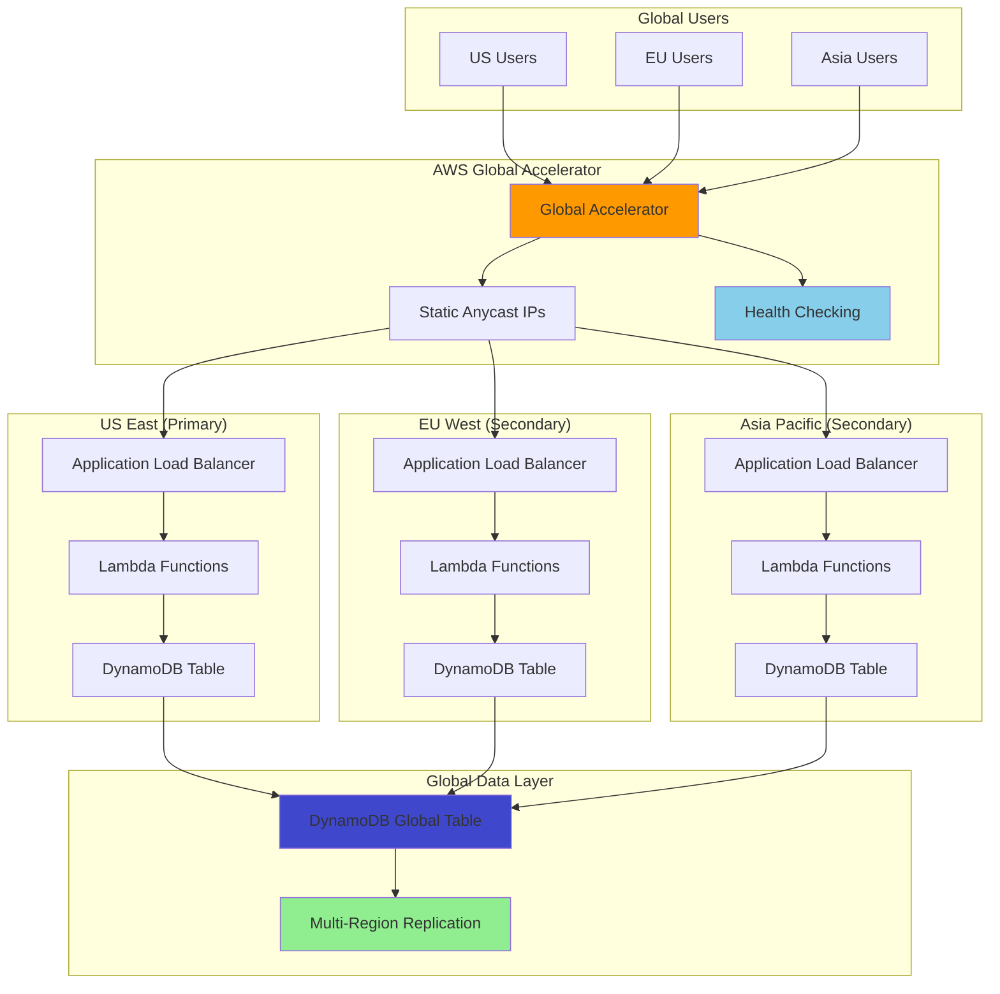

# Building Global Active-Active Architecture with AWS Global Accelerator

## Problem

Your global enterprise serves customers across multiple continents and requires consistent high performance, low latency, and disaster resilience. Traditional single-region deployments result in poor user experiences for geographically distributed users, with high latency and potential single points of failure. When regional outages occur, your application becomes unavailable to all users, causing significant business impact. You need a globally distributed, active-active architecture that provides optimal performance regardless of user location while maintaining data consistency and automatic failover capabilities.

## Solution

Deploy a multi-region active-active application architecture using AWS Global Accelerator for intelligent traffic routing, DynamoDB Global Tables for automatic multi-region data replication, and Lambda functions with Application Load Balancers in multiple regions. This solution provides static anycast IP addresses that route users to the nearest healthy region, ensures data consistency across regions through DynamoDB's conflict resolution, and delivers automatic failover without requiring DNS changes or manual intervention.



## Prerequisites

1. AWS account with permissions to create Global Accelerator, DynamoDB Global Tables, Lambda functions, and Application Load Balancers across multiple regions
2. AWS CLI v2 installed and configured with appropriate global permissions
3. Understanding of multi-region architectures and data consistency models
4. Familiarity with Lambda functions, ALB configuration, and DynamoDB operations
5. Basic knowledge of DNS and network traffic routing concepts
6. Estimated cost: $75-150/month for basic usage (Global Accelerator $18/month + ALB $16.20/month/region + DynamoDB and Lambda minimal costs)

> **Note**: Global Accelerator charges for fixed fees per accelerator and data transfer costs. DynamoDB Global Tables incur cross-region replication charges. Review [Global Accelerator pricing](https://aws.amazon.com/global-accelerator/pricing/) and [DynamoDB pricing](https://aws.amazon.com/dynamodb/pricing/) to understand costs.

## Preparation

Set up environment variables and create foundational resources:

```bash
# Set AWS environment variables
export AWS_REGION=$(aws configure get region)
export AWS_ACCOUNT_ID=$(aws sts get-caller-identity \
    --query Account --output text)

# Set primary environment variables
export PRIMARY_REGION="us-east-1"
export SECONDARY_REGION_EU="eu-west-1"
export SECONDARY_REGION_ASIA="ap-southeast-1"

# Generate unique identifiers for resources
RANDOM_SUFFIX=$(aws secretsmanager get-random-password \
    --exclude-punctuation --exclude-uppercase \
    --password-length 6 --require-each-included-type \
    --output text --query RandomPassword)

export APP_NAME="global-app-${RANDOM_SUFFIX}"
export TABLE_NAME="GlobalUserData-${RANDOM_SUFFIX}"
export ACCELERATOR_NAME="GlobalAccelerator-${RANDOM_SUFFIX}"

echo "Application Name: $APP_NAME"
echo "Table Name: $TABLE_NAME"
echo "Accelerator Name: $ACCELERATOR_NAME"
echo "Primary Region: $PRIMARY_REGION"
echo "EU Region: $SECONDARY_REGION_EU"
echo "Asia Region: $SECONDARY_REGION_ASIA"
```

Create IAM role for Lambda functions with multi-region DynamoDB access:

```bash
# Create Lambda execution role trust policy
cat > lambda-trust-policy.json << EOF
{
    "Version": "2012-10-17",
    "Statement": [
        {
            "Effect": "Allow",
            "Principal": {
                "Service": "lambda.amazonaws.com"
            },
            "Action": "sts:AssumeRole"
        }
    ]
}
EOF

# Create Lambda execution role
LAMBDA_ROLE_ARN=$(aws iam create-role \
    --role-name GlobalAppLambdaRole-${RANDOM_SUFFIX} \
    --assume-role-policy-document file://lambda-trust-policy.json \
    --query 'Role.Arn' --output text)

# Create policy for DynamoDB Global Table access
cat > lambda-dynamodb-policy.json << EOF
{
    "Version": "2012-10-17",
    "Statement": [
        {
            "Effect": "Allow",
            "Action": [
                "dynamodb:GetItem",
                "dynamodb:PutItem",
                "dynamodb:UpdateItem",
                "dynamodb:DeleteItem",
                "dynamodb:Query",
                "dynamodb:Scan"
            ],
            "Resource": [
                "arn:aws:dynamodb:*:${AWS_ACCOUNT_ID}:table/${TABLE_NAME}",
                "arn:aws:dynamodb:*:${AWS_ACCOUNT_ID}:table/${TABLE_NAME}/*"
            ]
        },
        {
            "Effect": "Allow",
            "Action": [
                "logs:CreateLogGroup",
                "logs:CreateLogStream",
                "logs:PutLogEvents"
            ],
            "Resource": "arn:aws:logs:*:*:*"
        }
    ]
}
EOF

# Attach policies to Lambda role
aws iam put-role-policy \
    --role-name GlobalAppLambdaRole-${RANDOM_SUFFIX} \
    --policy-name DynamoDBGlobalAccess \
    --policy-document file://lambda-dynamodb-policy.json

export LAMBDA_ROLE_ARN
echo "✅ Lambda IAM role created: $LAMBDA_ROLE_ARN"

# Wait for role to be available
sleep 15
```

## Steps

1. **Create DynamoDB table in the primary region**:

   DynamoDB Global Tables enable active-active replication across multiple AWS regions, providing eventually consistent data access with sub-second replication latency. This foundational step establishes the data layer that supports our multi-region architecture, ensuring users can read and write data from any region while maintaining consistency through DynamoDB's conflict resolution mechanisms.

   ```bash
   # Create DynamoDB table in primary region with streams enabled
   aws dynamodb create-table \
       --region $PRIMARY_REGION \
       --table-name $TABLE_NAME \
       --attribute-definitions \
           AttributeName=userId,AttributeType=S \
           AttributeName=timestamp,AttributeType=N \
       --key-schema \
           AttributeName=userId,KeyType=HASH \
           AttributeName=timestamp,KeyType=RANGE \
       --billing-mode PAY_PER_REQUEST \
       --stream-specification StreamEnabled=true,StreamViewType=NEW_AND_OLD_IMAGES

   # Wait for table to be active
   echo "Waiting for primary table to be active..."
   aws dynamodb wait table-exists \
       --region $PRIMARY_REGION \
       --table-name $TABLE_NAME

   echo "✅ DynamoDB table created in primary region"
   ```

   The table is now created with DynamoDB Streams enabled, which is required for Global Tables replication. The composite key design (userId + timestamp) supports efficient queries while allowing multiple records per user, enabling audit trails and data versioning that are essential for multi-region conflict resolution.

2. **Configure DynamoDB Global Tables for multi-region replication**:

   This step activates the Global Tables v2 feature using the modern update-table approach, which establishes automatic bi-directional replication between all regional tables. DynamoDB Global Tables use a last-writer-wins conflict resolution strategy and maintain eventual consistency across regions, typically propagating changes within one second. This creates the foundation for our active-active architecture where users can write to any region.

   ```bash
   # Add EU region replica using Global Tables v2
   aws dynamodb update-table \
       --region $PRIMARY_REGION \
       --table-name $TABLE_NAME \
       --replica-updates Create='{RegionName='$SECONDARY_REGION_EU'}'

   # Add Asia region replica using Global Tables v2  
   aws dynamodb update-table \
       --region $PRIMARY_REGION \
       --table-name $TABLE_NAME \
       --replica-updates Create='{RegionName='$SECONDARY_REGION_ASIA'}'

   echo "Waiting for Global Table setup to complete..."
   sleep 60

   # Verify Global Table status
   aws dynamodb describe-table \
       --region $PRIMARY_REGION \
       --table-name $TABLE_NAME \
       --query 'Table.{TableName:TableName,GlobalTableVersion:GlobalTableVersion,Replicas:Replicas[*].{Region:RegionName,Status:ReplicaStatus}}' \
       --output table

   echo "✅ DynamoDB Global Table configured"
   ```

   The Global Table is now operational using the current v2 format, automatically synchronizing data changes between regions. Each regional table maintains its own read and write capacity, enabling independent scaling while participating in the global replication network. This eliminates the traditional primary-secondary database pattern and supports true active-active operations.

> **Note**: DynamoDB Global Tables provide eventually consistent reads across regions. For strongly consistent reads, use the `ConsistentRead=true` parameter, but note that this only provides consistency within the local region. See [DynamoDB Global Tables documentation](https://docs.aws.amazon.com/amazondynamodb/latest/developerguide/GlobalTables.html) for detailed consistency patterns.

3. **Create Lambda function code for the application backend**:

   AWS Lambda provides the serverless compute layer for our multi-region application, enabling automatic scaling and fault isolation. This function implements a RESTful API that interacts with the local DynamoDB replica in each region, minimizing latency by processing requests locally while benefiting from Global Tables' automatic replication for data consistency.

   ```bash
   # Create Lambda function code
   cat > app_function.py << 'EOF'
import json
import boto3
import time
import os
from decimal import Decimal

# Initialize DynamoDB client
dynamodb = boto3.resource('dynamodb')
table_name = os.environ['TABLE_NAME']
table = dynamodb.Table(table_name)

def lambda_handler(event, context):
    """
    Multi-region active-active application handler
    Supports CRUD operations with automatic regional optimization
    """
    
    try:
        # Get HTTP method and path
        method = event.get('httpMethod', 'GET')
        path = event.get('path', '/')
        
        # Parse request body for POST/PUT requests
        body = {}
        if event.get('body'):
            body = json.loads(event['body'])
        
        # Get AWS region from context
        region = context.invoked_function_arn.split(':')[3]
        
        # Route based on HTTP method and path
        if method == 'GET' and path == '/health':
            return health_check(region)
        elif method == 'GET' and path.startswith('/user/'):
            user_id = path.split('/')[-1]
            return get_user_data(user_id, region)
        elif method == 'POST' and path == '/user':
            return create_user_data(body, region)
        elif method == 'PUT' and path.startswith('/user/'):
            user_id = path.split('/')[-1]
            return update_user_data(user_id, body, region)
        elif method == 'GET' and path == '/users':
            return list_users(region)
        else:
            return {
                'statusCode': 404,
                'headers': {'Content-Type': 'application/json'},
                'body': json.dumps({'error': 'Not found'})
            }
            
    except Exception as e:
        return {
            'statusCode': 500,
            'headers': {'Content-Type': 'application/json'},
            'body': json.dumps({'error': str(e), 'region': region})
        }

def health_check(region):
    """Health check endpoint for load balancer"""
    return {
        'statusCode': 200,
        'headers': {'Content-Type': 'application/json'},
        'body': json.dumps({
            'status': 'healthy',
            'region': region,
            'timestamp': int(time.time())
        })
    }

def get_user_data(user_id, region):
    """Get user data with regional context"""
    try:
        # Get latest record for user
        response = table.query(
            KeyConditionExpression='userId = :userId',
            ExpressionAttributeValues={':userId': user_id},
            ScanIndexForward=False,
            Limit=1
        )
        
        if response['Items']:
            item = response['Items'][0]
            # Convert Decimal to float for JSON serialization
            item = json.loads(json.dumps(item, default=decimal_default))
            return {
                'statusCode': 200,
                'headers': {'Content-Type': 'application/json'},
                'body': json.dumps({
                    'user': item,
                    'served_from_region': region
                })
            }
        else:
            return {
                'statusCode': 404,
                'headers': {'Content-Type': 'application/json'},
                'body': json.dumps({'error': 'User not found'})
            }
            
    except Exception as e:
        raise Exception(f"Error getting user data: {str(e)}")

def create_user_data(body, region):
    """Create new user data with regional tracking"""
    try:
        user_id = body.get('userId')
        if not user_id:
            return {
                'statusCode': 400,
                'headers': {'Content-Type': 'application/json'},
                'body': json.dumps({'error': 'userId is required'})
            }
        
        timestamp = int(time.time() * 1000)  # milliseconds for better precision
        
        item = {
            'userId': user_id,
            'timestamp': timestamp,
            'data': body.get('data', {}),
            'created_region': region,
            'last_updated': timestamp,
            'version': 1
        }
        
        table.put_item(Item=item)
        
        return {
            'statusCode': 201,
            'headers': {'Content-Type': 'application/json'},
            'body': json.dumps({
                'message': 'User created successfully',
                'userId': user_id,
                'created_in_region': region,
                'timestamp': timestamp
            })
        }
        
    except Exception as e:
        raise Exception(f"Error creating user data: {str(e)}")

def update_user_data(user_id, body, region):
    """Update user data with conflict resolution"""
    try:
        timestamp = int(time.time() * 1000)
        
        # Use atomic update with version control
        response = table.update_item(
            Key={'userId': user_id, 'timestamp': timestamp},
            UpdateExpression='SET #data = :data, last_updated = :timestamp, updated_region = :region ADD version :inc',
            ExpressionAttributeNames={'#data': 'data'},
            ExpressionAttributeValues={
                ':data': body.get('data', {}),
                ':timestamp': timestamp,
                ':region': region,
                ':inc': 1
            },
            ReturnValues='ALL_NEW'
        )
        
        return {
            'statusCode': 200,
            'headers': {'Content-Type': 'application/json'},
            'body': json.dumps({
                'message': 'User updated successfully',
                'userId': user_id,
                'updated_in_region': region,
                'timestamp': timestamp
            })
        }
        
    except Exception as e:
        raise Exception(f"Error updating user data: {str(e)}")

def list_users(region):
    """List users with pagination support"""
    try:
        # Simple scan with limit (in production, use GSI for better performance)
        response = table.scan(Limit=20)
        
        users = []
        processed_users = set()
        
        for item in response['Items']:
            user_id = item['userId']
            if user_id not in processed_users:
                users.append({
                    'userId': user_id,
                    'last_updated': int(item['last_updated']),
                    'version': int(item.get('version', 1))
                })
                processed_users.add(user_id)
        
        return {
            'statusCode': 200,
            'headers': {'Content-Type': 'application/json'},
            'body': json.dumps({
                'users': users,
                'count': len(users),
                'served_from_region': region
            })
        }
        
    except Exception as e:
        raise Exception(f"Error listing users: {str(e)}")

def decimal_default(obj):
    """JSON serializer for objects not serializable by default json code"""
    if isinstance(obj, Decimal):
        return float(obj)
    raise TypeError
EOF

   # Create deployment package
   zip lambda-function.zip app_function.py

   echo "✅ Lambda function code created and packaged"
   ```

   The Lambda function is now packaged and ready for deployment. It includes regional awareness, health check endpoints for load balancer integration, and implements CRUD operations with built-in conflict resolution through versioning and timestamps. This serverless approach eliminates server management while providing automatic scaling based on demand.

4. **Deploy Lambda functions in all three regions**:

   Deploying identical Lambda functions across multiple regions creates the distributed compute layer of our active-active architecture. Each function operates independently within its region, accessing the local DynamoDB replica for optimal performance while maintaining the same application logic and API interface across all regions.

   ```bash
   # Deploy Lambda function in primary region (US East)
   LAMBDA_FUNCTION_ARN_US=$(aws lambda create-function \
       --region $PRIMARY_REGION \
       --function-name ${APP_NAME}-us \
       --runtime python3.12 \
       --role $LAMBDA_ROLE_ARN \
       --handler app_function.lambda_handler \
       --zip-file fileb://lambda-function.zip \
       --timeout 30 \
       --environment Variables="{TABLE_NAME=${TABLE_NAME}}" \
       --query 'FunctionArn' --output text)

   # Deploy Lambda function in EU region
   LAMBDA_FUNCTION_ARN_EU=$(aws lambda create-function \
       --region $SECONDARY_REGION_EU \
       --function-name ${APP_NAME}-eu \
       --runtime python3.12 \
       --role $LAMBDA_ROLE_ARN \
       --handler app_function.lambda_handler \
       --zip-file fileb://lambda-function.zip \
       --timeout 30 \
       --environment Variables="{TABLE_NAME=${TABLE_NAME}}" \
       --query 'FunctionArn' --output text)

   # Deploy Lambda function in Asia region
   LAMBDA_FUNCTION_ARN_ASIA=$(aws lambda create-function \
       --region $SECONDARY_REGION_ASIA \
       --function-name ${APP_NAME}-asia \
       --runtime python3.12 \
       --role $LAMBDA_ROLE_ARN \
       --handler app_function.lambda_handler \
       --zip-file fileb://lambda-function.zip \
       --timeout 30 \
       --environment Variables="{TABLE_NAME=${TABLE_NAME}}" \
       --query 'FunctionArn' --output text)

   export LAMBDA_FUNCTION_ARN_US
   export LAMBDA_FUNCTION_ARN_EU
   export LAMBDA_FUNCTION_ARN_ASIA

   echo "✅ Lambda functions deployed in all regions"
   echo "US Function: $LAMBDA_FUNCTION_ARN_US"
   echo "EU Function: $LAMBDA_FUNCTION_ARN_EU"
   echo "Asia Function: $LAMBDA_FUNCTION_ARN_ASIA"
   ```

   The Lambda functions are now deployed and ready to process requests in each region. Each function automatically scales based on demand and operates with regional isolation, ensuring that issues in one region don't impact operations in other regions. This serverless approach provides built-in high availability and eliminates the need for server provisioning or capacity planning.

5. **Create Application Load Balancers and Target Groups in each region**:

   Application Load Balancers provide the HTTP/HTTPS entry points for our regional applications, offering advanced traffic routing, health checking, and integration with Lambda functions. By deploying ALBs in each region, we create regional endpoints that Global Accelerator will use to route traffic to the nearest healthy region, ensuring optimal performance and automatic failover.

   ```bash
   # Get default VPC and subnets for each region
   US_VPC_ID=$(aws ec2 describe-vpcs \
       --region $PRIMARY_REGION \
       --filters "Name=is-default,Values=true" \
       --query 'Vpcs[0].VpcId' --output text)

   US_SUBNET_IDS=$(aws ec2 describe-subnets \
       --region $PRIMARY_REGION \
       --filters "Name=vpc-id,Values=${US_VPC_ID}" \
       --query 'Subnets[0:2].SubnetId' --output text)

   EU_VPC_ID=$(aws ec2 describe-vpcs \
       --region $SECONDARY_REGION_EU \
       --filters "Name=is-default,Values=true" \
       --query 'Vpcs[0].VpcId' --output text)

   EU_SUBNET_IDS=$(aws ec2 describe-subnets \
       --region $SECONDARY_REGION_EU \
       --filters "Name=vpc-id,Values=${EU_VPC_ID}" \
       --query 'Subnets[0:2].SubnetId' --output text)

   ASIA_VPC_ID=$(aws ec2 describe-vpcs \
       --region $SECONDARY_REGION_ASIA \
       --filters "Name=is-default,Values=true" \
       --query 'Vpcs[0].VpcId' --output text)

   ASIA_SUBNET_IDS=$(aws ec2 describe-subnets \
       --region $SECONDARY_REGION_ASIA \
       --filters "Name=vpc-id,Values=${ASIA_VPC_ID}" \
       --query 'Subnets[0:2].SubnetId' --output text)

   # Create ALB in US region
   US_ALB_ARN=$(aws elbv2 create-load-balancer \
       --region $PRIMARY_REGION \
       --name ${APP_NAME}-us-alb \
       --subnets $US_SUBNET_IDS \
       --type application \
       --scheme internet-facing \
       --query 'LoadBalancers[0].LoadBalancerArn' --output text)

   # Create ALB in EU region
   EU_ALB_ARN=$(aws elbv2 create-load-balancer \
       --region $SECONDARY_REGION_EU \
       --name ${APP_NAME}-eu-alb \
       --subnets $EU_SUBNET_IDS \
       --type application \
       --scheme internet-facing \
       --query 'LoadBalancers[0].LoadBalancerArn' --output text)

   # Create ALB in Asia region
   ASIA_ALB_ARN=$(aws elbv2 create-load-balancer \
       --region $SECONDARY_REGION_ASIA \
       --name ${APP_NAME}-asia-alb \
       --subnets $ASIA_SUBNET_IDS \
       --type application \
       --scheme internet-facing \
       --query 'LoadBalancers[0].LoadBalancerArn' --output text)

   echo "✅ Application Load Balancers created"
   echo "US ALB: $US_ALB_ARN"
   echo "EU ALB: $EU_ALB_ARN"
   echo "Asia ALB: $ASIA_ALB_ARN"

   # Wait for ALBs to be active
   echo "Waiting for ALBs to be active..."
   sleep 60
   ```

   The Application Load Balancers are now provisioned across multiple Availability Zones in each region, providing high availability within each regional deployment. These ALBs will serve as the regional endpoints for Global Accelerator, enabling intelligent traffic routing based on network performance, geographic proximity, and endpoint health.

6. **Create Target Groups and configure Lambda integrations**:

   Target Groups define how the Application Load Balancers route traffic to backend services. For Lambda targets, ALB automatically converts HTTP requests to Lambda event payloads and transforms Lambda responses back to HTTP responses. This integration enables serverless applications to benefit from ALB's advanced routing, health checking, and load balancing capabilities.

   ```bash
   # Create target group for US Lambda
   US_TG_ARN=$(aws elbv2 create-target-group \
       --region $PRIMARY_REGION \
       --name ${APP_NAME}-us-tg \
       --target-type lambda \
       --query 'TargetGroups[0].TargetGroupArn' --output text)

   # Create target group for EU Lambda
   EU_TG_ARN=$(aws elbv2 create-target-group \
       --region $SECONDARY_REGION_EU \
       --name ${APP_NAME}-eu-tg \
       --target-type lambda \
       --query 'TargetGroups[0].TargetGroupArn' --output text)

   # Create target group for Asia Lambda
   ASIA_TG_ARN=$(aws elbv2 create-target-group \
       --region $SECONDARY_REGION_ASIA \
       --name ${APP_NAME}-asia-tg \
       --target-type lambda \
       --query 'TargetGroups[0].TargetGroupArn' --output text)

   # Register Lambda functions as targets
   aws elbv2 register-targets \
       --region $PRIMARY_REGION \
       --target-group-arn $US_TG_ARN \
       --targets Id=$LAMBDA_FUNCTION_ARN_US

   aws elbv2 register-targets \
       --region $SECONDARY_REGION_EU \
       --target-group-arn $EU_TG_ARN \
       --targets Id=$LAMBDA_FUNCTION_ARN_EU

   aws elbv2 register-targets \
       --region $SECONDARY_REGION_ASIA \
       --target-group-arn $ASIA_TG_ARN \
       --targets Id=$LAMBDA_FUNCTION_ARN_ASIA

   # Add Lambda permissions for ALB to invoke functions
   aws lambda add-permission \
       --region $PRIMARY_REGION \
       --function-name ${APP_NAME}-us \
       --statement-id allow-alb-invoke \
       --action lambda:InvokeFunction \
       --principal elasticloadbalancing.amazonaws.com \
       --source-arn $US_TG_ARN

   aws lambda add-permission \
       --region $SECONDARY_REGION_EU \
       --function-name ${APP_NAME}-eu \
       --statement-id allow-alb-invoke \
       --action lambda:InvokeFunction \
       --principal elasticloadbalancing.amazonaws.com \
       --source-arn $EU_TG_ARN

   aws lambda add-permission \
       --region $SECONDARY_REGION_ASIA \
       --function-name ${APP_NAME}-asia \
       --statement-id allow-alb-invoke \
       --action lambda:InvokeFunction \
       --principal elasticloadbalancing.amazonaws.com \
       --source-arn $ASIA_TG_ARN

   echo "✅ Target groups created and Lambda functions registered"
   ```

   The Lambda functions are now registered as targets and have the necessary permissions for ALB invocation. The target groups enable health checking through Lambda function responses, allowing the ALB to route traffic only to healthy functions. This integration provides the foundation for Global Accelerator's health-based traffic routing.

7. **Create ALB listeners to route traffic to Lambda functions**:

   Listeners define how the Application Load Balancers process incoming connection requests on specific ports and protocols. By configuring listeners on port 80, we enable HTTP traffic routing to our Lambda functions, completing the regional application stack that Global Accelerator will manage.

   ```bash
   # Create listener for US ALB
   aws elbv2 create-listener \
       --region $PRIMARY_REGION \
       --load-balancer-arn $US_ALB_ARN \
       --protocol HTTP \
       --port 80 \
       --default-actions Type=forward,TargetGroupArn=$US_TG_ARN

   # Create listener for EU ALB
   aws elbv2 create-listener \
       --region $SECONDARY_REGION_EU \
       --load-balancer-arn $EU_ALB_ARN \
       --protocol HTTP \
       --port 80 \
       --default-actions Type=forward,TargetGroupArn=$EU_TG_ARN

   # Create listener for Asia ALB
   aws elbv2 create-listener \
       --region $SECONDARY_REGION_ASIA \
       --load-balancer-arn $ASIA_ALB_ARN \
       --protocol HTTP \
       --port 80 \
       --default-actions Type=forward,TargetGroupArn=$ASIA_TG_ARN

   echo "✅ ALB listeners configured"
   ```

   The regional application stacks are now complete, with each region providing a fully functional HTTP API endpoint. The listeners enable traffic to flow from the internet through the ALBs to the Lambda functions, establishing the regional endpoints that Global Accelerator will intelligently route traffic to based on performance and health.

8. **Create AWS Global Accelerator and configure endpoints**:

   AWS Global Accelerator creates the global network entry point for our multi-region application, providing static anycast IP addresses that route traffic through AWS's global network infrastructure. Unlike DNS-based routing, Global Accelerator uses network-layer routing for instant failover and optimal path selection, eliminating the unpredictability of DNS caching and TTL propagation.

   ```bash
   # Global Accelerator must be created in us-west-2 region
   ACCELERATOR_ARN=$(aws globalaccelerator create-accelerator \
       --region us-west-2 \
       --name $ACCELERATOR_NAME \
       --ip-address-type IPV4 \
       --enabled \
       --query 'Accelerator.AcceleratorArn' --output text)

   # Get static IP addresses
   STATIC_IPS=$(aws globalaccelerator describe-accelerator \
       --region us-west-2 \
       --accelerator-arn $ACCELERATOR_ARN \
       --query 'Accelerator.IpSets[0].IpAddresses' --output text)

   export ACCELERATOR_ARN
   export STATIC_IPS

   echo "✅ Global Accelerator created: $ACCELERATOR_ARN"
   echo "Static IP addresses: $STATIC_IPS"

   # Wait for accelerator to be active
   echo "Waiting for accelerator to be active..."
   sleep 30

   # Create listener
   LISTENER_ARN=$(aws globalaccelerator create-listener \
       --region us-west-2 \
       --accelerator-arn $ACCELERATOR_ARN \
       --protocol TCP \
       --port-ranges FromPort=80,ToPort=80 \
       --query 'Listener.ListenerArn' --output text)

   export LISTENER_ARN
   echo "✅ Global Accelerator listener created: $LISTENER_ARN"
   ```

   Global Accelerator is now active with static anycast IP addresses that provide the single global entry point for our application. These IPs are announced from AWS edge locations worldwide, automatically directing users to the nearest AWS Point of Presence, which then routes traffic through the AWS global network to the optimal regional endpoint.

9. **Add regional endpoints to Global Accelerator**:

   This final step completes our active-active multi-region architecture by registering each regional Application Load Balancer as an endpoint group. Global Accelerator continuously monitors endpoint health and automatically routes traffic to the optimal healthy region based on network performance, geographic proximity, and endpoint availability. The health checking ensures seamless failover without user impact.

   ```bash
   # Get ALB ARNs for endpoints
   US_ALB_ARN_FULL=$(aws elbv2 describe-load-balancers \
       --region $PRIMARY_REGION \
       --load-balancer-arns $US_ALB_ARN \
       --query 'LoadBalancers[0].LoadBalancerArn' --output text)

   EU_ALB_ARN_FULL=$(aws elbv2 describe-load-balancers \
       --region $SECONDARY_REGION_EU \
       --load-balancer-arns $EU_ALB_ARN \
       --query 'LoadBalancers[0].LoadBalancerArn' --output text)

   ASIA_ALB_ARN_FULL=$(aws elbv2 describe-load-balancers \
       --region $SECONDARY_REGION_ASIA \
       --load-balancer-arns $ASIA_ALB_ARN \
       --query 'LoadBalancers[0].LoadBalancerArn' --output text)

   # Create endpoint group for US region (primary)
   US_ENDPOINT_GROUP_ARN=$(aws globalaccelerator create-endpoint-group \
       --region us-west-2 \
       --listener-arn $LISTENER_ARN \
       --endpoint-group-region $PRIMARY_REGION \
       --endpoint-configurations EndpointId=$US_ALB_ARN_FULL,Weight=100,ClientIPPreservationEnabled=false \
       --traffic-dial-percentage 100 \
       --health-check-interval-seconds 30 \
       --healthy-threshold-count 3 \
       --unhealthy-threshold-count 3 \
       --query 'EndpointGroup.EndpointGroupArn' --output text)

   # Create endpoint group for EU region
   EU_ENDPOINT_GROUP_ARN=$(aws globalaccelerator create-endpoint-group \
       --region us-west-2 \
       --listener-arn $LISTENER_ARN \
       --endpoint-group-region $SECONDARY_REGION_EU \
       --endpoint-configurations EndpointId=$EU_ALB_ARN_FULL,Weight=100,ClientIPPreservationEnabled=false \
       --traffic-dial-percentage 100 \
       --health-check-interval-seconds 30 \
       --healthy-threshold-count 3 \
       --unhealthy-threshold-count 3 \
       --query 'EndpointGroup.EndpointGroupArn' --output text)

   # Create endpoint group for Asia region
   ASIA_ENDPOINT_GROUP_ARN=$(aws globalaccelerator create-endpoint-group \
       --region us-west-2 \
       --listener-arn $LISTENER_ARN \
       --endpoint-group-region $SECONDARY_REGION_ASIA \
       --endpoint-configurations EndpointId=$ASIA_ALB_ARN_FULL,Weight=100,ClientIPPreservationEnabled=false \
       --traffic-dial-percentage 100 \
       --health-check-interval-seconds 30 \
       --healthy-threshold-count 3 \
       --unhealthy-threshold-count 3 \
       --query 'EndpointGroup.EndpointGroupArn' --output text)

   echo "✅ Regional endpoints added to Global Accelerator"
   echo "US Endpoint Group: $US_ENDPOINT_GROUP_ARN"
   echo "EU Endpoint Group: $EU_ENDPOINT_GROUP_ARN"
   echo "Asia Endpoint Group: $ASIA_ENDPOINT_GROUP_ARN"
   ```

   The multi-region active-active architecture is now fully operational. Global Accelerator intelligently routes traffic to the optimal regional endpoint based on real-time network conditions and health status. Users worldwide will be automatically directed to the nearest healthy region, providing consistent low-latency access while maintaining data consistency through DynamoDB Global Tables replication.

## Validation & Testing

1. Test the Global Accelerator endpoints and verify regional routing:

   ```bash
   echo "Global Accelerator Configuration:"
   echo "Accelerator ARN: $ACCELERATOR_ARN"
   echo "Static IP Addresses: $STATIC_IPS"
   echo ""
   echo "Testing endpoints from different regions..."
   
   # Test health endpoint
   for IP in $STATIC_IPS; do
       echo "Testing health check via $IP:"
       curl -s "http://$IP/health" | jq . || echo "Health check failed"
       echo ""
   done
   ```

2. Test multi-region data consistency with DynamoDB Global Tables:

   ```bash
   # Create test script for data consistency
   cat > test_global_consistency.py << 'EOF'
import requests
import json
import time
import sys

def test_global_consistency(static_ips):
    """Test data consistency across regions"""
    
    # Test data
    test_user = {
        "userId": f"test-user-{int(time.time())}",
        "data": {
            "name": "Test User",
            "email": "test@example.com",
            "preferences": {"region": "auto"}
        }
    }
    
    print("Testing multi-region active-active consistency...")
    print(f"Test user ID: {test_user['userId']}")
    
    # Create user via first IP
    first_ip = static_ips[0]
    print(f"\n1. Creating user via {first_ip}...")
    
    create_response = requests.post(
        f"http://{first_ip}/user",
        json=test_user,
        timeout=10
    )
    
    if create_response.status_code == 201:
        print("✅ User created successfully")
        result = create_response.json()
        print(f"   Created in region: {result.get('created_in_region')}")
    else:
        print(f"❌ Failed to create user: {create_response.status_code}")
        return False
    
    # Wait for replication
    print("\n2. Waiting for cross-region replication...")
    time.sleep(5)
    
    # Test read consistency across all IPs
    print("\n3. Testing read consistency across regions...")
    user_id = test_user['userId']
    
    for i, ip in enumerate(static_ips, 1):
        try:
            get_response = requests.get(
                f"http://{ip}/user/{user_id}",
                timeout=10
            )
            
            if get_response.status_code == 200:
                result = get_response.json()
                region = result.get('served_from_region', 'unknown')
                print(f"   ✅ IP {ip}: User found, served from {region}")
            else:
                print(f"   ❌ IP {ip}: User not found ({get_response.status_code})")
                
        except Exception as e:
            print(f"   ❌ IP {ip}: Request failed - {str(e)}")
    
    # Test update consistency
    print("\n4. Testing update consistency...")
    update_data = {
        "data": {
            "name": "Updated Test User",
            "email": "updated@example.com",
            "preferences": {"region": "auto", "updated": True}
        }
    }
    
    # Update via second IP (if available)
    update_ip = static_ips[1] if len(static_ips) > 1 else static_ips[0]
    
    update_response = requests.put(
        f"http://{update_ip}/user/{user_id}",
        json=update_data,
        timeout=10
    )
    
    if update_response.status_code == 200:
        print(f"✅ User updated via {update_ip}")
    else:
        print(f"❌ Failed to update user: {update_response.status_code}")
    
    return True

if __name__ == "__main__":
    # Parse static IPs from command line
    if len(sys.argv) < 2:
        print("Usage: python test_global_consistency.py <ip1> [ip2] ...")
        sys.exit(1)
    
    static_ips = sys.argv[1:]
    test_global_consistency(static_ips)
EOF

   # Run the consistency test
   python3 test_global_consistency.py $STATIC_IPS
   ```

3. Verify Global Accelerator health checking and failover:

   ```bash
   # Check endpoint health status
   aws globalaccelerator describe-endpoint-group \
       --region us-west-2 \
       --endpoint-group-arn $US_ENDPOINT_GROUP_ARN \
       --query 'EndpointGroup.EndpointDescriptions[*].{Endpoint:EndpointId,Health:HealthState,Weight:Weight}' \
       --output table

   aws globalaccelerator describe-endpoint-group \
       --region us-west-2 \
       --endpoint-group-arn $EU_ENDPOINT_GROUP_ARN \
       --query 'EndpointGroup.EndpointDescriptions[*].{Endpoint:EndpointId,Health:HealthState,Weight:Weight}' \
       --output table

   aws globalaccelerator describe-endpoint-group \
       --region us-west-2 \
       --endpoint-group-arn $ASIA_ENDPOINT_GROUP_ARN \
       --query 'EndpointGroup.EndpointDescriptions[*].{Endpoint:EndpointId,Health:HealthState,Weight:Weight}' \
       --output table
   ```

4. Test performance using the Global Accelerator Speed Comparison Tool:

   Visit the [AWS Global Accelerator Speed Comparison Tool](https://speedtest.globalaccelerator.aws/) to compare download speeds between direct internet access and Global Accelerator routing.

> **Tip**: Use CloudWatch metrics to monitor Global Accelerator performance, including NewFlowCount, ActiveFlowCount, and ProcessedBytesIn metrics. Set up alarms for endpoint health status changes to get notified of regional failures.

## Cleanup

1. Delete Global Accelerator resources:

   ```bash
   # Delete endpoint groups
   aws globalaccelerator delete-endpoint-group \
       --region us-west-2 \
       --endpoint-group-arn $US_ENDPOINT_GROUP_ARN

   aws globalaccelerator delete-endpoint-group \
       --region us-west-2 \
       --endpoint-group-arn $EU_ENDPOINT_GROUP_ARN

   aws globalaccelerator delete-endpoint-group \
       --region us-west-2 \
       --endpoint-group-arn $ASIA_ENDPOINT_GROUP_ARN

   # Delete listener
   aws globalaccelerator delete-listener \
       --region us-west-2 \
       --listener-arn $LISTENER_ARN

   # Delete accelerator
   aws globalaccelerator update-accelerator \
       --region us-west-2 \
       --accelerator-arn $ACCELERATOR_ARN \
       --enabled false

   sleep 30

   aws globalaccelerator delete-accelerator \
       --region us-west-2 \
       --accelerator-arn $ACCELERATOR_ARN

   echo "✅ Global Accelerator resources deleted"
   ```

2. Delete Application Load Balancers and related resources:

   ```bash
   # Delete ALBs in all regions
   aws elbv2 delete-load-balancer \
       --region $PRIMARY_REGION \
       --load-balancer-arn $US_ALB_ARN

   aws elbv2 delete-load-balancer \
       --region $SECONDARY_REGION_EU \
       --load-balancer-arn $EU_ALB_ARN

   aws elbv2 delete-load-balancer \
       --region $SECONDARY_REGION_ASIA \
       --load-balancer-arn $ASIA_ALB_ARN

   # Wait for ALBs to be deleted before deleting target groups
   sleep 60

   # Delete target groups
   aws elbv2 delete-target-group \
       --region $PRIMARY_REGION \
       --target-group-arn $US_TG_ARN

   aws elbv2 delete-target-group \
       --region $SECONDARY_REGION_EU \
       --target-group-arn $EU_TG_ARN

   aws elbv2 delete-target-group \
       --region $SECONDARY_REGION_ASIA \
       --target-group-arn $ASIA_TG_ARN

   echo "✅ Load balancers and target groups deleted"
   ```

3. Delete Lambda functions:

   ```bash
   aws lambda delete-function \
       --region $PRIMARY_REGION \
       --function-name ${APP_NAME}-us

   aws lambda delete-function \
       --region $SECONDARY_REGION_EU \
       --function-name ${APP_NAME}-eu

   aws lambda delete-function \
       --region $SECONDARY_REGION_ASIA \
       --function-name ${APP_NAME}-asia

   echo "✅ Lambda functions deleted"
   ```

4. Delete DynamoDB Global Table:

   ```bash
   # Remove replicas from Global Table
   aws dynamodb update-table \
       --region $PRIMARY_REGION \
       --table-name $TABLE_NAME \
       --replica-updates Delete='{RegionName='$SECONDARY_REGION_EU'}'

   aws dynamodb update-table \
       --region $PRIMARY_REGION \
       --table-name $TABLE_NAME \
       --replica-updates Delete='{RegionName='$SECONDARY_REGION_ASIA'}'

   # Wait for replica removal
   sleep 30

   # Delete primary table
   aws dynamodb delete-table \
       --region $PRIMARY_REGION \
       --table-name $TABLE_NAME

   echo "✅ DynamoDB Global Table and regional tables deleted"
   ```

5. Delete IAM role and clean up local files:

   ```bash
   aws iam delete-role-policy \
       --role-name GlobalAppLambdaRole-${RANDOM_SUFFIX} \
       --policy-name DynamoDBGlobalAccess

   aws iam delete-role \
       --role-name GlobalAppLambdaRole-${RANDOM_SUFFIX}

   # Clean up local files
   rm -f lambda-trust-policy.json
   rm -f lambda-dynamodb-policy.json
   rm -f app_function.py
   rm -f lambda-function.zip
   rm -f test_global_consistency.py

   echo "✅ IAM resources and local files cleaned up"
   ```

## Discussion

[AWS Global Accelerator](https://docs.aws.amazon.com/global-accelerator/latest/dg/what-is-global-accelerator.html) provides a fundamental improvement over traditional DNS-based global load balancing by utilizing AWS's global network infrastructure and anycast IP addresses. Unlike DNS-based solutions that rely on client-side caching and can take minutes to propagate changes, Global Accelerator provides instant failover and intelligent routing based on real-time network conditions, endpoint health, and geographic proximity. The static IP addresses eliminate the complexity of managing multiple regional endpoints and provide a single entry point for global applications.

The combination of Global Accelerator with [DynamoDB Global Tables](https://docs.aws.amazon.com/amazondynamodb/latest/developerguide/GlobalTables.html) creates a truly active-active multi-region architecture. DynamoDB Global Tables use eventual consistency with last-writer-wins conflict resolution, automatically replicating data changes across regions within typically under one second. This approach differs from traditional database replication by eliminating the need for a primary-secondary relationship, allowing writes to occur in any region while maintaining data consistency through sophisticated conflict resolution mechanisms.

The serverless compute layer using Lambda functions provides automatic scaling and fault isolation across regions. Each regional Lambda deployment operates independently, processing requests locally and interacting with the local DynamoDB replica, which minimizes cross-region latency for data operations. The Application Load Balancer integration enables advanced routing capabilities, health checking, and the ability to support both HTTP and HTTPS traffic with SSL termination. This architecture pattern supports blue-green deployments and canary releases at the regional level by adjusting traffic weights in Global Accelerator endpoint groups.

This recipe demonstrates AWS Well-Architected Framework principles including operational excellence through automated deployment, security through IAM roles and least privilege access, reliability through multi-region fault tolerance, and performance efficiency through global traffic optimization. The solution follows the [AWS Well-Architected Framework](https://docs.aws.amazon.com/wellarchitected/latest/framework/welcome.html) guidelines for building resilient, secure, and efficient cloud architectures.

> **Warning**: Be aware of the eventual consistency model in DynamoDB Global Tables. While updates propagate quickly, there may be brief periods where different regions return different data versions. Design your application logic to handle this gracefully, especially for critical operations that require strong consistency.

## Challenge

Enhance this multi-region architecture by implementing advanced monitoring with CloudWatch cross-region dashboards and automated failover policies, adding API Gateway with custom authorizers for enhanced security, implementing disaster recovery automation using AWS Lambda and CloudFormation StackSets, creating a mobile application using AWS Amplify that automatically connects to the nearest region, and exploring conflict resolution strategies for business-critical data updates. Additionally, create a comprehensive testing framework for simulating regional failures and measuring recovery times.

## Infrastructure Code

### Available Infrastructure as Code:

- [Infrastructure Code Overview](code/README.md) - Detailed description of all infrastructure components
- [AWS CDK (Python)](code/cdk-python/) - AWS CDK Python implementation
- [AWS CDK (TypeScript)](code/cdk-typescript/) - AWS CDK TypeScript implementation
- [CloudFormation](code/cloudformation.yaml) - AWS CloudFormation template
- [Bash CLI Scripts](code/scripts/) - Example bash scripts using AWS CLI commands to deploy infrastructure
- [Terraform](code/terraform/) - Terraform configuration files