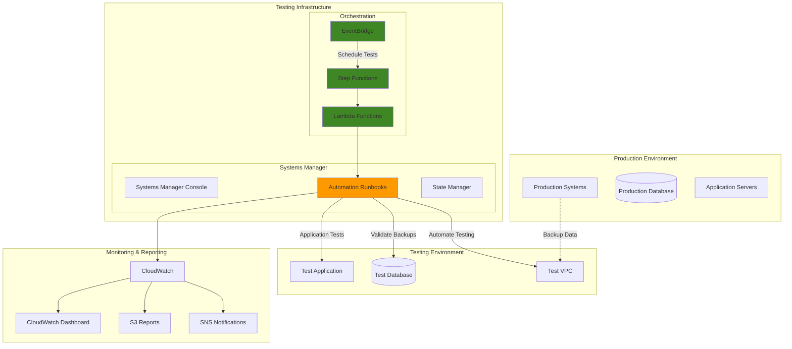

# Business Continuity Testing with Systems Manager

## Problem

Organizations struggle to validate their business continuity and disaster recovery plans due to the complexity of coordinating testing across multiple systems, the risk of impacting production environments, and the lack of automated frameworks for regular validation. Manual testing processes are time-consuming, error-prone, and often postponed, leaving organizations unprepared for actual disasters and unable to meet compliance requirements for regular continuity testing.

## Solution

Implement a comprehensive business continuity testing framework using AWS Systems Manager Automation to orchestrate automated testing scenarios, validate recovery procedures, and generate compliance reports. This solution enables non-disruptive testing of disaster recovery plans, automated validation of backup systems, and comprehensive reporting that demonstrates organizational readiness for business continuity events.

## Architecture Diagram



## Prerequisites

1. AWS account with permissions for Systems Manager, Lambda, EventBridge, and CloudWatch
2. AWS CLI v2 installed and configured (or AWS CloudShell)
3. Production and test environments with Systems Manager agents installed
4. Existing backup and disaster recovery procedures to validate
5. Estimated cost: $100-300/month for automation execution and testing resources

> **Note**: This framework focuses on automated testing procedures and does not require downtime of production systems. See the [AWS Disaster Recovery Whitepaper](https://docs.aws.amazon.com/whitepapers/latest/disaster-recovery-workloads-on-aws/disaster-recovery-options-in-the-cloud.html) for comprehensive disaster recovery strategies.

## Preparation

```bash
# Set environment variables
export AWS_REGION=$(aws configure get region)
export AWS_ACCOUNT_ID=$(aws sts get-caller-identity \
    --query Account --output text)

# Generate unique identifiers for resources
BC_PROJECT_ID=$(aws secretsmanager get-random-password \
    --exclude-punctuation --exclude-uppercase \
    --password-length 8 --require-each-included-type \
    --output text --query RandomPassword)

export BC_FRAMEWORK_NAME="business-continuity-${BC_PROJECT_ID}"
export AUTOMATION_ROLE_NAME="BCTestingRole-${BC_PROJECT_ID}"
export TEST_RESULTS_BUCKET="bc-testing-results-${BC_PROJECT_ID}"

# Testing schedule configuration
export DAILY_TEST_SCHEDULE="rate(1 day)"
export WEEKLY_COMPREHENSIVE_SCHEDULE="cron(0 2 ? * SUN *)"
export MONTHLY_FULL_DR_SCHEDULE="cron(0 1 1 * ? *)"

echo "BC Framework: ${BC_FRAMEWORK_NAME}"
echo "Project ID: ${BC_PROJECT_ID}"
echo "Results Bucket: ${TEST_RESULTS_BUCKET}"
```

## Steps

1. **Create IAM Role for Business Continuity Testing**:

   IAM roles are fundamental to AWS automation security, enabling services to assume temporary credentials rather than using long-term access keys. The principle of least privilege ensures that automated systems only access the specific resources they need, reducing security attack surfaces while maintaining operational flexibility. This role will serve as the security foundation for all automation activities, allowing Systems Manager, Lambda, and EventBridge to interact with AWS services safely and securely.

   ```bash
   # Create trust policy for automation services
   cat > bc-testing-trust-policy.json << 'EOF'
   {
       "Version": "2012-10-17",
       "Statement": [
           {
               "Effect": "Allow",
               "Principal": {
                   "Service": [
                       "ssm.amazonaws.com",
                       "lambda.amazonaws.com",
                       "states.amazonaws.com",
                       "events.amazonaws.com"
                   ]
               },
               "Action": "sts:AssumeRole"
           }
       ]
   }
   EOF
   
   # Create IAM role for BC testing
   aws iam create-role \
       --role-name ${AUTOMATION_ROLE_NAME} \
       --assume-role-policy-document file://bc-testing-trust-policy.json \
       --description "Role for business continuity testing automation"
   
   # Create custom policy for BC testing operations
   cat > bc-testing-policy.json << EOF
   {
       "Version": "2012-10-17",
       "Statement": [
           {
               "Effect": "Allow",
               "Action": [
                   "ssm:*",
                   "ec2:*",
                   "rds:*",
                   "s3:*",
                   "lambda:*",
                   "states:*",
                   "events:*",
                   "cloudwatch:*",
                   "sns:*",
                   "logs:*",
                   "backup:*",
                   "iam:PassRole"
               ],
               "Resource": "*"
           }
       ]
   }
   EOF
   
   aws iam put-role-policy \
       --role-name ${AUTOMATION_ROLE_NAME} \
       --policy-name BCTestingPolicy \
       --policy-document file://bc-testing-policy.json
   
   echo "✅ IAM role created for BC testing"
   ```

   The IAM role is now established with secure trust relationships and necessary permissions. This security foundation enables automated services to perform business continuity testing operations while adhering to AWS security best practices. The role follows the principle of least privilege, granting only the permissions required for testing operations.

2. **Create S3 Bucket for Test Results and Reports**:

   Amazon S3 provides industry-leading durability (99.999999999%) and serves as the ideal storage foundation for business continuity test results and compliance reports. S3's versioning capabilities ensure that historical test data is preserved for audit purposes, while lifecycle policies optimize costs by automatically transitioning older data to more cost-effective storage classes. This storage layer enables comprehensive tracking of testing activities over time, supporting both operational analysis and regulatory compliance requirements.

   ```bash
   # Create S3 bucket for test results
   if [ "${AWS_REGION}" = "us-east-1" ]; then
       aws s3api create-bucket \
           --bucket ${TEST_RESULTS_BUCKET}
   else
       aws s3api create-bucket \
           --bucket ${TEST_RESULTS_BUCKET} \
           --create-bucket-configuration LocationConstraint=${AWS_REGION}
   fi
   
   # Enable versioning and lifecycle management
   aws s3api put-bucket-versioning \
       --bucket ${TEST_RESULTS_BUCKET} \
       --versioning-configuration Status=Enabled
   
   # Create lifecycle policy for test results
   cat > test-results-lifecycle.json << 'EOF'
   {
       "Rules": [
           {
               "ID": "BCTestResultsRetention",
               "Status": "Enabled",
               "Filter": {"Prefix": "test-results/"},
               "Transitions": [
                   {
                       "Days": 30,
                       "StorageClass": "STANDARD_IA"
                   },
                   {
                       "Days": 90,
                       "StorageClass": "GLACIER"
                   }
               ],
               "Expiration": {
                   "Days": 2555
               }
           }
       ]
   }
   EOF
   
   aws s3api put-bucket-lifecycle-configuration \
       --bucket ${TEST_RESULTS_BUCKET} \
       --lifecycle-configuration file://test-results-lifecycle.json
   
   echo "✅ S3 bucket created for test results"
   ```

   The S3 bucket now provides a centralized, durable storage solution for all business continuity testing artifacts. Versioning enables recovery of historical test data, while the lifecycle policy automatically optimizes storage costs by moving older results to cheaper storage classes. This storage foundation supports long-term compliance tracking and trend analysis of testing effectiveness.

3. **Create Systems Manager Automation Documents for Testing**:

   AWS Systems Manager Automation enables the creation of standardized, repeatable testing procedures through automation documents (runbooks). These documents define step-by-step processes for validating backup integrity, testing database recovery, and verifying application failover capabilities. By codifying testing procedures, organizations ensure consistent execution regardless of who runs the tests, while reducing human error and enabling comprehensive documentation of test activities.

   ```bash
   # Create backup validation automation document
   cat > backup-validation-runbook.yaml << 'EOF'
   schemaVersion: '0.3'
   description: Validate backup integrity and restore capabilities
   assumeRole: '{{ AutomationAssumeRole }}'
   parameters:
     InstanceId:
       type: String
       description: EC2 instance ID to test backup restore
     BackupVaultName:
       type: String
       description: AWS Backup vault name
     AutomationAssumeRole:
       type: String
       description: IAM role for automation execution
   mainSteps:
     - name: CreateRestoreTestInstance
       action: 'aws:executeAwsApi'
       inputs:
         Service: backup
         Api: StartRestoreJob
         RecoveryPointArn: '{{ GetLatestRecoveryPoint.RecoveryPointArn }}'
         Metadata:
           InstanceType: t3.micro
         IamRoleArn: '{{ AutomationAssumeRole }}'
       outputs:
         - Name: RestoreJobId
           Selector: $.RestoreJobId
           Type: String
     - name: WaitForRestoreCompletion
       action: 'aws:waitForAwsResourceProperty'
       inputs:
         Service: backup
         Api: DescribeRestoreJob
         RestoreJobId: '{{ CreateRestoreTestInstance.RestoreJobId }}'
         PropertySelector: $.Status
         DesiredValues:
           - COMPLETED
       timeoutSeconds: 3600
     - name: ValidateRestoredInstance
       action: 'aws:runCommand'
       inputs:
         DocumentName: AWS-RunShellScript
         InstanceIds:
           - '{{ CreateRestoreTestInstance.CreatedResourceArn }}'
         Parameters:
           commands:
             - |
               #!/bin/bash
               echo "Validating restored instance..."
               # Check system health
               systemctl status
               # Check disk space
               df -h
               # Check application services
               if command -v nginx &> /dev/null; then
                   systemctl status nginx
               fi
               echo "Validation completed"
       outputs:
         - Name: ValidationResults
           Selector: $.CommandInvocations[0].CommandPlugins[0].Output
           Type: String
     - name: CleanupTestInstance
       action: 'aws:executeAwsApi'
       inputs:
         Service: ec2
         Api: TerminateInstances
         InstanceIds:
           - '{{ CreateRestoreTestInstance.CreatedResourceArn }}'
   outputs:
     - ValidationResults: '{{ ValidateRestoredInstance.ValidationResults }}'
   EOF
   
   # Create the automation document
   aws ssm create-document \
       --name "BC-BackupValidation-${BC_PROJECT_ID}" \
       --document-type "Automation" \
       --document-format "YAML" \
       --content file://backup-validation-runbook.yaml \
       --tags Key=Purpose,Value=BusinessContinuityTesting
   
   echo "✅ Backup validation runbook created"
   ```

   The backup validation automation document now provides a standardized method for testing backup integrity and restore capabilities. This runbook automatically creates a test instance from backups, validates the restored system's health, and cleans up resources to prevent cost accumulation. The automation ensures consistent testing procedures while generating detailed logs for compliance documentation.

4. **Create Database Recovery Testing Automation**:

   Database recovery testing is critical for ensuring business continuity, as databases often contain an organization's most valuable and sensitive information. This automation document creates isolated test environments to validate database backup integrity and recovery procedures without impacting production systems. The testing process includes connectivity validation and basic functionality checks, providing confidence that database recovery procedures will work during actual disaster scenarios.

   ```bash
   # Create database recovery testing document
   cat > database-recovery-runbook.yaml << 'EOF'
   schemaVersion: '0.3'
   description: Test database backup and recovery procedures
   assumeRole: '{{ AutomationAssumeRole }}'
   parameters:
     DBInstanceIdentifier:
       type: String
       description: RDS instance identifier
     DBSnapshotIdentifier:
       type: String
       description: Snapshot to restore from
     TestDBInstanceIdentifier:
       type: String
       description: Test database instance identifier
     AutomationAssumeRole:
       type: String
       description: IAM role for automation execution
   mainSteps:
     - name: CreateTestDatabase
       action: 'aws:executeAwsApi'
       inputs:
         Service: rds
         Api: RestoreDBInstanceFromDBSnapshot
         DBInstanceIdentifier: '{{ TestDBInstanceIdentifier }}'
         DBSnapshotIdentifier: '{{ DBSnapshotIdentifier }}'
         DBInstanceClass: db.t3.micro
         PubliclyAccessible: false
         StorageEncrypted: true
       outputs:
         - Name: TestDBEndpoint
           Selector: $.DBInstance.Endpoint.Address
           Type: String
     - name: WaitForDBAvailable
       action: 'aws:waitForAwsResourceProperty'
       inputs:
         Service: rds
         Api: DescribeDBInstances
         DBInstanceIdentifier: '{{ TestDBInstanceIdentifier }}'
         PropertySelector: $.DBInstances[0].DBInstanceStatus
         DesiredValues:
           - available
       timeoutSeconds: 1800
     - name: TestDatabaseConnectivity
       action: 'aws:executeScript'
       inputs:
         Runtime: python3.12
         Handler: test_db_connection
         Script: |
           import boto3
           import pymysql
           import os
           
           def test_db_connection(events, context):
               endpoint = events['DBEndpoint']
               
               try:
                   # Test connection (credentials would be from Secrets Manager)
                   connection = pymysql.connect(
                       host=endpoint,
                       user=os.environ.get('DB_USERNAME', 'admin'),
                       password=os.environ.get('DB_PASSWORD', 'password'),
                       database='testdb',
                       connect_timeout=30
                   )
                   
                   cursor = connection.cursor()
                   cursor.execute("SELECT 1")
                   result = cursor.fetchone()
                   
                   connection.close()
                   
                   return {
                       'statusCode': 200,
                       'body': f'Database connection successful: {result}'
                   }
                   
               except Exception as e:
                   return {
                       'statusCode': 500,
                       'body': f'Database connection failed: {str(e)}'
                   }
         InputPayload:
           DBEndpoint: '{{ CreateTestDatabase.TestDBEndpoint }}'
       outputs:
         - Name: ConnectionTestResult
           Selector: $.Payload.body
           Type: String
     - name: CleanupTestDatabase
       action: 'aws:executeAwsApi'
       inputs:
         Service: rds
         Api: DeleteDBInstance
         DBInstanceIdentifier: '{{ TestDBInstanceIdentifier }}'
         SkipFinalSnapshot: true
         DeleteAutomatedBackups: true
   outputs:
     - ConnectionTestResult: '{{ TestDatabaseConnectivity.ConnectionTestResult }}'
   EOF
   
   # Create the database recovery automation document
   aws ssm create-document \
       --name "BC-DatabaseRecovery-${BC_PROJECT_ID}" \
       --document-type "Automation" \
       --document-format "YAML" \
       --content file://database-recovery-runbook.yaml \
       --tags Key=Purpose,Value=BusinessContinuityTesting
   
   echo "✅ Database recovery runbook created"
   ```

   The database recovery automation provides comprehensive testing of database backup and restore procedures in an isolated environment. This automation validates that database snapshots can be successfully restored and that the restored database is functional and accessible. The cleanup process ensures no unnecessary costs are incurred from test resources, while detailed logging provides audit trails for compliance purposes.

5. **Create Application Failover Testing Automation**:

   Application failover testing validates that traffic routing mechanisms function correctly during disaster scenarios. This automation tests DNS-based failover using Route 53, ensuring that applications can successfully redirect traffic from primary to secondary regions or availability zones. Understanding failover mechanisms is crucial for maintaining service availability during infrastructure failures, and automated testing provides confidence that these mechanisms will work when needed.

   ```bash
   # Create application failover testing document
   cat > application-failover-runbook.yaml << 'EOF'
   schemaVersion: '0.3'
   description: Test application failover to secondary region
   assumeRole: '{{ AutomationAssumeRole }}'
   parameters:
     PrimaryLoadBalancerArn:
       type: String
       description: Primary Application Load Balancer ARN
     SecondaryLoadBalancerArn:
       type: String
       description: Secondary Application Load Balancer ARN
     Route53HostedZoneId:
       type: String
       description: Route 53 hosted zone ID
     DomainName:
       type: String
       description: Domain name for failover testing
     AutomationAssumeRole:
       type: String
       description: IAM role for automation execution
   mainSteps:
     - name: CheckPrimaryApplicationHealth
       action: 'aws:executeScript'
       inputs:
         Runtime: python3.12
         Handler: check_application_health
         Script: |
           import requests
           import json
           
           def check_application_health(events, context):
               domain = events['DomainName']
               
               try:
                   response = requests.get(f'https://{domain}/health', timeout=30)
                   
                   return {
                       'statusCode': response.status_code,
                       'healthy': response.status_code == 200,
                       'response_time': response.elapsed.total_seconds()
                   }
                   
               except Exception as e:
                   return {
                       'statusCode': 500,
                       'healthy': False,
                       'error': str(e)
                   }
         InputPayload:
           DomainName: '{{ DomainName }}'
       outputs:
         - Name: PrimaryHealthStatus
           Selector: $.Payload.healthy
           Type: Boolean
     - name: SimulateFailoverToSecondary
       action: 'aws:executeAwsApi'
       inputs:
         Service: route53
         Api: ChangeResourceRecordSets
         HostedZoneId: '{{ Route53HostedZoneId }}'
         ChangeBatch:
           Changes:
             - Action: UPSERT
               ResourceRecordSet:
                 Name: '{{ DomainName }}'
                 Type: A
                 SetIdentifier: Primary
                 Failover: SECONDARY
                 TTL: 60
                 ResourceRecords:
                   - Value: 1.2.3.4  # Secondary ALB IP
     - name: WaitForDNSPropagation
       action: 'aws:sleep'
       inputs:
         Duration: PT2M
     - name: ValidateSecondaryApplication
       action: 'aws:executeScript'
       inputs:
         Runtime: python3.12
         Handler: check_application_health
         Script: |
           import requests
           import json
           
           def check_application_health(events, context):
               domain = events['DomainName']
               
               try:
                   response = requests.get(f'https://{domain}/health', timeout=30)
                   
                   return {
                       'statusCode': response.status_code,
                       'healthy': response.status_code == 200,
                       'response_time': response.elapsed.total_seconds()
                   }
                   
               except Exception as e:
                   return {
                       'statusCode': 500,
                       'healthy': False,
                       'error': str(e)
                   }
         InputPayload:
           DomainName: '{{ DomainName }}'
       outputs:
         - Name: SecondaryHealthStatus
           Selector: $.Payload.healthy
           Type: Boolean
     - name: RestorePrimaryRouting
       action: 'aws:executeAwsApi'
       inputs:
         Service: route53
         Api: ChangeResourceRecordSets
         HostedZoneId: '{{ Route53HostedZoneId }}'
         ChangeBatch:
           Changes:
             - Action: UPSERT
               ResourceRecordSet:
                 Name: '{{ DomainName }}'
                 Type: A
                 SetIdentifier: Primary
                 Failover: PRIMARY
                 TTL: 300
                 ResourceRecords:
                   - Value: 5.6.7.8  # Primary ALB IP
   outputs:
     - PrimaryHealthStatus: '{{ CheckPrimaryApplicationHealth.PrimaryHealthStatus }}'
     - SecondaryHealthStatus: '{{ ValidateSecondaryApplication.SecondaryHealthStatus }}'
   EOF
   
   # Create the application failover automation document
   aws ssm create-document \
       --name "BC-ApplicationFailover-${BC_PROJECT_ID}" \
       --document-type "Automation" \
       --document-format "YAML" \
       --content file://application-failover-runbook.yaml \
       --tags Key=Purpose,Value=BusinessContinuityTesting
   
   echo "✅ Application failover runbook created"
   ```

   The application failover automation now provides comprehensive testing of DNS-based failover mechanisms and application health validation across multiple regions. This testing ensures that Route 53 health checks and failover policies function correctly, providing confidence that applications will remain available during regional failures. The automation restores normal routing after testing, minimizing impact on production traffic.

6. **Create Comprehensive BC Testing Orchestration**:

   Lambda functions serve as the intelligent orchestration layer for business continuity testing, coordinating multiple automation documents and managing test execution based on schedules and requirements. AWS Lambda's serverless model provides cost-effective execution that scales automatically, while its integration with other AWS services enables sophisticated testing workflows. This orchestration layer enables different levels of testing (daily, weekly, monthly) with appropriate combinations of validation procedures.

   ```bash
   # Create Lambda function for test orchestration
   cat > bc-test-orchestrator.py << 'EOF'
   import json
   import boto3
   import datetime
   import uuid
   import os
   from typing import Dict, List
   
   def lambda_handler(event, context):
       ssm = boto3.client('ssm')
       s3 = boto3.client('s3')
       sns = boto3.client('sns')
       
       test_type = event.get('testType', 'daily')
       test_id = str(uuid.uuid4())
       
       test_results = {
           'testId': test_id,
           'testType': test_type,
           'timestamp': datetime.datetime.utcnow().isoformat(),
           'results': []
       }
       
       try:
           if test_type in ['daily', 'weekly', 'monthly']:
               # Execute backup validation
               backup_result = execute_backup_validation(ssm, test_id)
               test_results['results'].append(backup_result)
           
           if test_type in ['weekly', 'monthly']:
               # Execute database recovery test
               db_result = execute_database_recovery_test(ssm, test_id)
               test_results['results'].append(db_result)
           
           if test_type == 'monthly':
               # Execute full application failover test
               app_result = execute_application_failover_test(ssm, test_id)
               test_results['results'].append(app_result)
           
           # Store results in S3
           s3.put_object(
               Bucket=os.environ['RESULTS_BUCKET'],
               Key=f'test-results/{test_type}/{test_id}/results.json',
               Body=json.dumps(test_results, indent=2),
               ContentType='application/json'
           )
           
           # Generate summary report
           summary = generate_test_summary(test_results)
           
           # Send notification
           sns.publish(
               TopicArn=os.environ['SNS_TOPIC_ARN'],
               Subject=f'BC Testing {test_type.title()} Report - {test_id[:8]}',
               Message=summary
           )
           
           return {
               'statusCode': 200,
               'body': json.dumps({
                   'testId': test_id,
                   'summary': summary
               })
           }
           
       except Exception as e:
           error_message = f'BC testing failed: {str(e)}'
           sns.publish(
               TopicArn=os.environ['SNS_TOPIC_ARN'],
               Subject=f'BC Testing Failed - {test_id[:8]}',
               Message=error_message
           )
           raise e
   
   def execute_backup_validation(ssm, test_id):
       response = ssm.start_automation_execution(
           DocumentName=f'BC-BackupValidation-{os.environ["PROJECT_ID"]}',
           Parameters={
               'InstanceId': [os.environ.get('TEST_INSTANCE_ID', 'i-1234567890abcdef0')],
               'BackupVaultName': [os.environ.get('BACKUP_VAULT_NAME', 'default')],
               'AutomationAssumeRole': [os.environ['AUTOMATION_ROLE_ARN']]
           }
       )
       
       return {
           'test': 'backup_validation',
           'executionId': response['AutomationExecutionId'],
           'status': 'started'
       }
   
   def execute_database_recovery_test(ssm, test_id):
       response = ssm.start_automation_execution(
           DocumentName=f'BC-DatabaseRecovery-{os.environ["PROJECT_ID"]}',
           Parameters={
               'DBInstanceIdentifier': [os.environ.get('DB_INSTANCE_ID', 'prod-db')],
               'DBSnapshotIdentifier': [os.environ.get('DB_SNAPSHOT_ID', 'latest-snapshot')],
               'TestDBInstanceIdentifier': [f'test-db-{test_id[:8]}'],
               'AutomationAssumeRole': [os.environ['AUTOMATION_ROLE_ARN']]
           }
       )
       
       return {
           'test': 'database_recovery',
           'executionId': response['AutomationExecutionId'],
           'status': 'started'
       }
   
   def execute_application_failover_test(ssm, test_id):
       response = ssm.start_automation_execution(
           DocumentName=f'BC-ApplicationFailover-{os.environ["PROJECT_ID"]}',
           Parameters={
               'PrimaryLoadBalancerArn': [os.environ.get('PRIMARY_ALB_ARN', 'arn:aws:elasticloadbalancing:us-east-1:123456789012:loadbalancer/app/primary/1234567890123456')],
               'SecondaryLoadBalancerArn': [os.environ.get('SECONDARY_ALB_ARN', 'arn:aws:elasticloadbalancing:us-west-2:123456789012:loadbalancer/app/secondary/6543210987654321')],
               'Route53HostedZoneId': [os.environ.get('HOSTED_ZONE_ID', 'Z1234567890123')],
               'DomainName': [os.environ.get('DOMAIN_NAME', 'app.example.com')],
               'AutomationAssumeRole': [os.environ['AUTOMATION_ROLE_ARN']]
           }
       )
       
       return {
           'test': 'application_failover',
           'executionId': response['AutomationExecutionId'],
           'status': 'started'
       }
   
   def generate_test_summary(test_results):
       total_tests = len(test_results['results'])
       summary = f"""
   Business Continuity Testing Summary
   Test ID: {test_results['testId']}
   Test Type: {test_results['testType']}
   Timestamp: {test_results['timestamp']}
   
   Tests Executed: {total_tests}
   
   Test Results:
   """
       
       for result in test_results['results']:
           summary += f"- {result['test']}: {result['status']}\n"
       
       return summary
   EOF
   
   # Package and deploy orchestration Lambda
   zip bc-test-orchestrator.zip bc-test-orchestrator.py
   
   ORCHESTRATOR_LAMBDA=$(aws lambda create-function \
       --function-name "bc-test-orchestrator-${BC_PROJECT_ID}" \
       --runtime python3.12 \
       --role arn:aws:iam::${AWS_ACCOUNT_ID}:role/${AUTOMATION_ROLE_NAME} \
       --handler bc-test-orchestrator.lambda_handler \
       --zip-file fileb://bc-test-orchestrator.zip \
       --timeout 900 \
       --environment Variables='{PROJECT_ID='${BC_PROJECT_ID}',RESULTS_BUCKET='${TEST_RESULTS_BUCKET}',AUTOMATION_ROLE_ARN=arn:aws:iam::'${AWS_ACCOUNT_ID}':role/'${AUTOMATION_ROLE_NAME}',SNS_TOPIC_ARN=arn:aws:sns:'${AWS_REGION}':'${AWS_ACCOUNT_ID}':bc-alerts-'${BC_PROJECT_ID}'}' \
       --query 'FunctionArn' --output text)
   
   echo "✅ BC test orchestration Lambda function created"
   ```

   The orchestration Lambda function now provides intelligent coordination of business continuity testing activities. This serverless component enables different testing levels based on schedules, manages test execution across multiple systems, and provides comprehensive reporting of results. The Lambda function's event-driven architecture ensures efficient resource utilization while providing reliable execution of testing workflows.

7. **Set Up Automated Testing Schedules**:

   Amazon EventBridge provides reliable, serverless event scheduling that enables automated execution of business continuity tests without manual intervention. EventBridge's cron and rate expressions allow for precise scheduling of different testing levels, ensuring regular validation of disaster recovery capabilities. This scheduling mechanism addresses one of the primary challenges in disaster recovery preparedness: the tendency for testing to be delayed or forgotten when managed manually.

   ```bash
   # Create SNS topic for BC testing alerts
   BC_SNS_TOPIC=$(aws sns create-topic \
       --name "bc-alerts-${BC_PROJECT_ID}" \
       --query 'TopicArn' --output text)
   
   # Subscribe to SNS topic (replace with actual email)
   aws sns subscribe \
       --topic-arn ${BC_SNS_TOPIC} \
       --protocol email \
       --notification-endpoint "admin@example.com"
   
   # Create EventBridge rules for scheduled testing
   
   # Daily basic tests
   aws events put-rule \
       --name "bc-daily-tests-${BC_PROJECT_ID}" \
       --schedule-expression "${DAILY_TEST_SCHEDULE}" \
       --description "Daily business continuity basic tests"
   
   aws events put-targets \
       --rule "bc-daily-tests-${BC_PROJECT_ID}" \
       --targets Id=1,Arn=${ORCHESTRATOR_LAMBDA},Input='{"testType":"daily"}'
   
   # Weekly comprehensive tests
   aws events put-rule \
       --name "bc-weekly-tests-${BC_PROJECT_ID}" \
       --schedule-expression "${WEEKLY_COMPREHENSIVE_SCHEDULE}" \
       --description "Weekly comprehensive business continuity tests"
   
   aws events put-targets \
       --rule "bc-weekly-tests-${BC_PROJECT_ID}" \
       --targets Id=1,Arn=${ORCHESTRATOR_LAMBDA},Input='{"testType":"weekly"}'
   
   # Monthly full DR tests
   aws events put-rule \
       --name "bc-monthly-tests-${BC_PROJECT_ID}" \
       --schedule-expression "${MONTHLY_FULL_DR_SCHEDULE}" \
       --description "Monthly full disaster recovery tests"
   
   aws events put-targets \
       --rule "bc-monthly-tests-${BC_PROJECT_ID}" \
       --targets Id=1,Arn=${ORCHESTRATOR_LAMBDA},Input='{"testType":"monthly"}'
   
   # Grant EventBridge permission to invoke Lambda
   aws lambda add-permission \
       --function-name "bc-test-orchestrator-${BC_PROJECT_ID}" \
       --statement-id "allow-eventbridge-daily" \
       --action lambda:InvokeFunction \
       --principal events.amazonaws.com \
       --source-arn arn:aws:events:${AWS_REGION}:${AWS_ACCOUNT_ID}:rule/bc-daily-tests-${BC_PROJECT_ID}
   
   aws lambda add-permission \
       --function-name "bc-test-orchestrator-${BC_PROJECT_ID}" \
       --statement-id "allow-eventbridge-weekly" \
       --action lambda:InvokeFunction \
       --principal events.amazonaws.com \
       --source-arn arn:aws:events:${AWS_REGION}:${AWS_ACCOUNT_ID}:rule/bc-weekly-tests-${BC_PROJECT_ID}
   
   aws lambda add-permission \
       --function-name "bc-test-orchestrator-${BC_PROJECT_ID}" \
       --statement-id "allow-eventbridge-monthly" \
       --action lambda:InvokeFunction \
       --principal events.amazonaws.com \
       --source-arn arn:aws:events:${AWS_REGION}:${AWS_ACCOUNT_ID}:rule/bc-monthly-tests-${BC_PROJECT_ID}
   
   echo "✅ Automated testing schedules configured"
   ```

   The automated testing schedules now ensure regular validation of business continuity procedures without manual intervention. EventBridge's reliable scheduling, combined with SNS notifications, provides consistent testing execution and immediate alerts about test results. This automation addresses the common problem of deferred testing by making it a seamless, automatic process that requires no ongoing manual effort.

8. **Create CloudWatch Dashboard for BC Testing Monitoring**:

   Amazon CloudWatch provides comprehensive monitoring and visualization capabilities that enable operations teams to track business continuity testing effectiveness over time. CloudWatch dashboards centralize metrics from Lambda functions, Systems Manager automation executions, and test result trends, providing at-a-glance visibility into testing health and performance. This monitoring capability enables proactive identification of testing issues and provides data for improving testing procedures.

   ```bash
   # Create CloudWatch dashboard for BC testing
   cat > bc-dashboard.json << EOF
   {
       "widgets": [
           {
               "type": "metric",
               "properties": {
                   "metrics": [
                       ["AWS/Lambda", "Duration", "FunctionName", "bc-test-orchestrator-${BC_PROJECT_ID}"],
                       [".", "Errors", ".", "."],
                       [".", "Invocations", ".", "."]
                   ],
                   "period": 300,
                   "stat": "Sum",
                   "region": "${AWS_REGION}",
                   "title": "BC Testing Lambda Metrics",
                   "view": "timeSeries"
               }
           },
           {
               "type": "metric",
               "properties": {
                   "metrics": [
                       ["AWS/SSM", "ExecutionSuccess", "DocumentName", "BC-BackupValidation-${BC_PROJECT_ID}"],
                       [".", "ExecutionFailed", ".", "."],
                       [".", "ExecutionSuccess", "DocumentName", "BC-DatabaseRecovery-${BC_PROJECT_ID}"],
                       [".", "ExecutionFailed", ".", "."],
                       [".", "ExecutionSuccess", "DocumentName", "BC-ApplicationFailover-${BC_PROJECT_ID}"],
                       [".", "ExecutionFailed", ".", "."]
                   ],
                   "period": 86400,
                   "stat": "Sum",
                   "region": "${AWS_REGION}",
                   "title": "BC Testing Success/Failure Rates",
                   "view": "number"
               }
           },
           {
               "type": "log",
               "properties": {
                   "query": "SOURCE '/aws/lambda/bc-test-orchestrator-${BC_PROJECT_ID}' | fields @timestamp, @message | filter @message like /Test/ | sort @timestamp desc | limit 20",
                   "region": "${AWS_REGION}",
                   "title": "Recent BC Test Executions",
                   "view": "table"
               }
           }
       ]
   }
   EOF
   
   aws cloudwatch put-dashboard \
       --dashboard-name "BC-Testing-${BC_PROJECT_ID}" \
       --dashboard-body file://bc-dashboard.json
   
   echo "✅ CloudWatch dashboard created for BC testing"
   ```

   The CloudWatch dashboard now provides centralized visibility into business continuity testing activities, success rates, and performance metrics. This monitoring capability enables operations teams to quickly identify trends, spot issues, and demonstrate testing effectiveness to stakeholders. The dashboard serves as a single pane of glass for all business continuity testing activities.

9. **Create Compliance Reporting System**:

   Regulatory compliance often requires documented evidence of regular disaster recovery testing, making automated compliance reporting essential for many organizations. This reporting system generates standardized reports that demonstrate testing frequency, success rates, and compliance with organizational policies. The automated generation of compliance reports reduces administrative overhead while ensuring that audit requirements are consistently met.

   ```bash
   # Create Lambda function for compliance reporting
   cat > compliance-reporter.py << 'EOF'
   import json
   import boto3
   import datetime
   from typing import Dict, List
   import os
   
   def lambda_handler(event, context):
       s3 = boto3.client('s3')
       ssm = boto3.client('ssm')
       
       # Generate monthly compliance report
       report_data = generate_compliance_report(s3, ssm)
       
       # Store compliance report
       report_key = f"compliance-reports/{datetime.datetime.utcnow().strftime('%Y-%m')}/bc-compliance-report.json"
       
       s3.put_object(
           Bucket=os.environ['RESULTS_BUCKET'],
           Key=report_key,
           Body=json.dumps(report_data, indent=2),
           ContentType='application/json'
       )
       
       # Generate HTML report
       html_report = generate_html_report(report_data)
       
       s3.put_object(
           Bucket=os.environ['RESULTS_BUCKET'],
           Key=f"compliance-reports/{datetime.datetime.utcnow().strftime('%Y-%m')}/bc-compliance-report.html",
           Body=html_report,
           ContentType='text/html'
       )
       
       return {
           'statusCode': 200,
           'body': json.dumps({
               'reportGenerated': True,
               'reportLocation': report_key
           })
       }
   
   def generate_compliance_report(s3, ssm):
       # Collect test execution data from the past month
       start_date = datetime.datetime.utcnow() - datetime.timedelta(days=30)
       
       report = {
           'reportPeriod': {
               'start': start_date.isoformat(),
               'end': datetime.datetime.utcnow().isoformat()
           },
           'testingSummary': {
               'dailyTests': 0,
               'weeklyTests': 0,
               'monthlyTests': 0,
               'totalTests': 0,
               'successfulTests': 0,
               'failedTests': 0
           },
           'complianceStatus': 'COMPLIANT',
           'recommendations': []
       }
       
       # Analyze test execution history
       # This would integrate with actual Systems Manager execution history
       
       return report
   
   def generate_html_report(report_data):
       html = f"""
       <!DOCTYPE html>
       <html>
       <head>
           <title>Business Continuity Compliance Report</title>
           <style>
               body {{ font-family: Arial, sans-serif; margin: 20px; }}
               .header {{ background-color: #f0f0f0; padding: 20px; }}
               .summary {{ margin: 20px 0; }}
               .compliant {{ color: green; }}
               .non-compliant {{ color: red; }}
               table {{ border-collapse: collapse; width: 100%; }}
               th, td {{ border: 1px solid #ddd; padding: 8px; text-align: left; }}
               th {{ background-color: #f2f2f2; }}
           </style>
       </head>
       <body>
           <div class="header">
               <h1>Business Continuity Testing Compliance Report</h1>
               <p>Report Period: {report_data['reportPeriod']['start']} to {report_data['reportPeriod']['end']}</p>
           </div>
           
           <div class="summary">
               <h2>Testing Summary</h2>
               <p>Total Tests Executed: {report_data['testingSummary']['totalTests']}</p>
               <p>Successful Tests: {report_data['testingSummary']['successfulTests']}</p>
               <p>Failed Tests: {report_data['testingSummary']['failedTests']}</p>
               <p>Compliance Status: <span class="{report_data['complianceStatus'].lower()}">{report_data['complianceStatus']}</span></p>
           </div>
       </body>
       </html>
       """
       return html
   EOF
   
   # Package and deploy compliance reporting Lambda
   zip compliance-reporter.zip compliance-reporter.py
   
   COMPLIANCE_LAMBDA=$(aws lambda create-function \
       --function-name "bc-compliance-reporter-${BC_PROJECT_ID}" \
       --runtime python3.12 \
       --role arn:aws:iam::${AWS_ACCOUNT_ID}:role/${AUTOMATION_ROLE_NAME} \
       --handler compliance-reporter.lambda_handler \
       --zip-file fileb://compliance-reporter.zip \
       --timeout 300 \
       --environment Variables='{RESULTS_BUCKET='${TEST_RESULTS_BUCKET}'}' \
       --query 'FunctionArn' --output text)
   
   # Schedule monthly compliance reporting
   aws events put-rule \
       --name "bc-compliance-reporting-${BC_PROJECT_ID}" \
       --schedule-expression "cron(0 8 1 * ? *)" \
       --description "Monthly BC compliance reporting"
   
   aws events put-targets \
       --rule "bc-compliance-reporting-${BC_PROJECT_ID}" \
       --targets Id=1,Arn=${COMPLIANCE_LAMBDA}
   
   aws lambda add-permission \
       --function-name "bc-compliance-reporter-${BC_PROJECT_ID}" \
       --statement-id "allow-eventbridge-compliance" \
       --action lambda:InvokeFunction \
       --principal events.amazonaws.com \
       --source-arn arn:aws:events:${AWS_REGION}:${AWS_ACCOUNT_ID}:rule/bc-compliance-reporting-${BC_PROJECT_ID}
   
   echo "✅ Compliance reporting system created"
   ```

   The compliance reporting system now automatically generates monthly reports documenting all business continuity testing activities, success rates, and compliance status. These standardized reports provide auditable evidence of testing activities and help organizations demonstrate compliance with regulatory requirements and internal policies.

10. **Create Manual Test Execution Interface**:

    While automated testing provides consistent validation, manual testing capabilities enable on-demand testing during specific scenarios such as infrastructure changes, security incidents, or pre-planned maintenance activities. This manual execution interface provides operations teams with the flexibility to trigger comprehensive or targeted testing as needed, while maintaining the same standardized procedures and reporting as automated tests.

    ```bash
    # Create Lambda function for manual test execution
    cat > manual-test-executor.py << 'EOF'
    import json
    import boto3
    import uuid
    import os
    
    def lambda_handler(event, context):
        ssm = boto3.client('ssm')
        
        test_type = event.get('testType', 'comprehensive')
        test_components = event.get('components', ['backup', 'database', 'application'])
        
        execution_results = []
        
        for component in test_components:
            if component == 'backup':
                result = execute_backup_test(ssm)
                execution_results.append(result)
            elif component == 'database':
                result = execute_database_test(ssm)
                execution_results.append(result)
            elif component == 'application':
                result = execute_application_test(ssm)
                execution_results.append(result)
        
        return {
            'statusCode': 200,
            'body': json.dumps({
                'testType': test_type,
                'executionId': str(uuid.uuid4()),
                'results': execution_results
            })
        }
    
    def execute_backup_test(ssm):
        response = ssm.start_automation_execution(
            DocumentName=f'BC-BackupValidation-{os.environ["PROJECT_ID"]}',
            Parameters={
                'InstanceId': [os.environ.get('TEST_INSTANCE_ID', 'i-1234567890abcdef0')],
                'BackupVaultName': [os.environ.get('BACKUP_VAULT_NAME', 'default')],
                'AutomationAssumeRole': [os.environ['AUTOMATION_ROLE_ARN']]
            }
        )
        return {'component': 'backup', 'executionId': response['AutomationExecutionId']}
    
    def execute_database_test(ssm):
        response = ssm.start_automation_execution(
            DocumentName=f'BC-DatabaseRecovery-{os.environ["PROJECT_ID"]}',
            Parameters={
                'DBInstanceIdentifier': [os.environ.get('DB_INSTANCE_ID', 'prod-db')],
                'DBSnapshotIdentifier': [os.environ.get('DB_SNAPSHOT_ID', 'latest-snapshot')],
                'TestDBInstanceIdentifier': [f'manual-test-{uuid.uuid4().hex[:8]}'],
                'AutomationAssumeRole': [os.environ['AUTOMATION_ROLE_ARN']]
            }
        )
        return {'component': 'database', 'executionId': response['AutomationExecutionId']}
    
    def execute_application_test(ssm):
        response = ssm.start_automation_execution(
            DocumentName=f'BC-ApplicationFailover-{os.environ["PROJECT_ID"]}',
            Parameters={
                'PrimaryLoadBalancerArn': [os.environ.get('PRIMARY_ALB_ARN', 'arn:aws:elasticloadbalancing:us-east-1:123456789012:loadbalancer/app/primary/1234567890123456')],
                'SecondaryLoadBalancerArn': [os.environ.get('SECONDARY_ALB_ARN', 'arn:aws:elasticloadbalancing:us-west-2:123456789012:loadbalancer/app/secondary/6543210987654321')],
                'Route53HostedZoneId': [os.environ.get('HOSTED_ZONE_ID', 'Z1234567890123')],
                'DomainName': [os.environ.get('DOMAIN_NAME', 'app.example.com')],
                'AutomationAssumeRole': [os.environ['AUTOMATION_ROLE_ARN']]
            }
        )
        return {'component': 'application', 'executionId': response['AutomationExecutionId']}
    EOF
    
    # Package and deploy manual test executor Lambda
    zip manual-test-executor.zip manual-test-executor.py
    
    MANUAL_TEST_LAMBDA=$(aws lambda create-function \
        --function-name "bc-manual-test-executor-${BC_PROJECT_ID}" \
        --runtime python3.12 \
        --role arn:aws:iam::${AWS_ACCOUNT_ID}:role/${AUTOMATION_ROLE_NAME} \
        --handler manual-test-executor.lambda_handler \
        --zip-file fileb://manual-test-executor.zip \
        --timeout 300 \
        --environment Variables='{PROJECT_ID='${BC_PROJECT_ID}',AUTOMATION_ROLE_ARN=arn:aws:iam::'${AWS_ACCOUNT_ID}':role/'${AUTOMATION_ROLE_NAME}'}' \
        --query 'FunctionArn' --output text)
    
    echo "✅ Manual test execution interface created"
    echo "Manual Test Lambda ARN: ${MANUAL_TEST_LAMBDA}"
    ```

    The manual test execution interface now provides operations teams with on-demand testing capabilities while maintaining standardized procedures and consistent reporting. This interface enables targeted testing of specific components or comprehensive testing of the entire business continuity framework, providing flexibility for different operational scenarios.

## Validation & Testing

1. Verify Systems Manager automation documents:

   ```bash
   # List created automation documents
   aws ssm list-documents \
       --filters Key=DocumentType,Values=Automation Key=Name,Values=BC-* \
       --query 'DocumentIdentifiers[*].{Name:Name,Status:Status,DocumentFormat:DocumentFormat}' \
       --output table
   ```

   Expected output: Three automation documents with "Active" status

2. Test manual execution of BC tests:

   ```bash
   # Execute manual backup validation test
   aws lambda invoke \
       --function-name "bc-manual-test-executor-${BC_PROJECT_ID}" \
       --payload '{"testType":"manual","components":["backup"]}' \
       manual-test-result.json
   
   cat manual-test-result.json
   ```

3. Verify scheduled testing configuration:

   ```bash
   # List EventBridge rules for BC testing
   aws events list-rules \
       --name-prefix "bc-" \
       --query 'Rules[*].{Name:Name,State:State,ScheduleExpression:ScheduleExpression}' \
       --output table
   ```

4. Check CloudWatch dashboard:

   ```bash
   # Verify dashboard creation
   aws cloudwatch list-dashboards \
       --dashboard-name-prefix "BC-Testing" \
       --query 'DashboardEntries[*].{Name:DashboardName}' \
       --output table
   ```

## Cleanup

1. Delete EventBridge rules and targets:

   ```bash
   # Remove targets and delete rules
   for rule in "bc-daily-tests-${BC_PROJECT_ID}" "bc-weekly-tests-${BC_PROJECT_ID}" "bc-monthly-tests-${BC_PROJECT_ID}" "bc-compliance-reporting-${BC_PROJECT_ID}"; do
       aws events remove-targets --rule ${rule} --ids 1
       aws events delete-rule --name ${rule}
   done
   
   echo "✅ EventBridge rules deleted"
   ```

2. Delete Lambda functions:

   ```bash
   # Delete all BC testing Lambda functions
   for function in "bc-test-orchestrator-${BC_PROJECT_ID}" "bc-compliance-reporter-${BC_PROJECT_ID}" "bc-manual-test-executor-${BC_PROJECT_ID}"; do
       aws lambda delete-function --function-name ${function}
   done
   
   echo "✅ Lambda functions deleted"
   ```

3. Delete Systems Manager automation documents:

   ```bash
   # Delete automation documents
   for doc in "BC-BackupValidation-${BC_PROJECT_ID}" "BC-DatabaseRecovery-${BC_PROJECT_ID}" "BC-ApplicationFailover-${BC_PROJECT_ID}"; do
       aws ssm delete-document --name ${doc}
   done
   
   echo "✅ Systems Manager documents deleted"
   ```

4. Clean up S3 bucket and CloudWatch resources:

   ```bash
   # Delete S3 bucket contents and bucket
   aws s3 rm s3://${TEST_RESULTS_BUCKET} --recursive
   aws s3api delete-bucket --bucket ${TEST_RESULTS_BUCKET}
   
   # Delete CloudWatch dashboard
   aws cloudwatch delete-dashboards \
       --dashboard-names "BC-Testing-${BC_PROJECT_ID}"
   
   # Delete SNS topic
   aws sns delete-topic --topic-arn ${BC_SNS_TOPIC}
   
   echo "✅ S3 and CloudWatch resources deleted"
   ```

5. Remove IAM role and local files:

   ```bash
   # Delete IAM role and policies
   aws iam delete-role-policy \
       --role-name ${AUTOMATION_ROLE_NAME} \
       --policy-name BCTestingPolicy
   
   aws iam delete-role --role-name ${AUTOMATION_ROLE_NAME}
   
   # Clean up local files
   rm -f bc-testing-trust-policy.json
   rm -f bc-testing-policy.json
   rm -f test-results-lifecycle.json
   rm -f backup-validation-runbook.yaml
   rm -f database-recovery-runbook.yaml
   rm -f application-failover-runbook.yaml
   rm -f bc-test-orchestrator.py
   rm -f bc-test-orchestrator.zip
   rm -f compliance-reporter.py
   rm -f compliance-reporter.zip
   rm -f manual-test-executor.py
   rm -f manual-test-executor.zip
   rm -f bc-dashboard.json
   rm -f manual-test-result.json
   
   echo "✅ IAM and local files cleaned up"
   ```

## Discussion

AWS Systems Manager Automation provides a powerful foundation for implementing comprehensive business continuity testing frameworks that address the challenges of manual testing processes. The automation capabilities enable organizations to create repeatable, standardized testing procedures that can be executed consistently across different environments and time periods, following the [AWS Well-Architected Framework's reliability pillar](https://docs.aws.amazon.com/wellarchitected/2023-04-10/framework/rel_planning_for_recovery_auto_recovery.html) recommendations for automated recovery testing.

The framework's modular design allows for testing individual components (backup validation, database recovery, application failover) independently or as part of comprehensive disaster recovery scenarios. This flexibility enables organizations to tailor testing procedures to their specific requirements while maintaining consistency in execution and reporting. The integration with EventBridge enables automated scheduling that ensures regular testing without manual intervention, addressing one of the primary challenges in maintaining current disaster recovery readiness.

The combination of daily basic tests, weekly comprehensive tests, and monthly full disaster recovery tests provides thorough validation while balancing operational overhead. This tiered approach aligns with [AWS disaster recovery best practices](https://docs.aws.amazon.com/whitepapers/latest/disaster-recovery-workloads-on-aws/disaster-recovery-options-in-the-cloud.html), which emphasize the importance of regular testing to validate disaster recovery strategies and build confidence in recovery procedures.

Compliance reporting capabilities are essential for organizations in regulated industries that must demonstrate regular testing of business continuity procedures. The automated generation of compliance reports provides auditable evidence of testing activities and outcomes, reducing the administrative burden on operations teams while ensuring regulatory requirements are consistently met.

> **Warning**: Ensure that test environments are properly isolated from production systems to prevent any potential impact during testing procedures. Review [AWS security best practices](https://docs.aws.amazon.com/IAM/latest/UserGuide/best-practices.html) for IAM role configuration before implementing in production environments.

> **Tip**: Start with simple backup validation tests and gradually expand to more complex scenarios as your team becomes familiar with the automation framework. Monitor test execution through CloudWatch dashboards to identify optimization opportunities and ensure reliable operation.

## Challenge

Extend this business continuity testing framework by implementing these enhancements:

1. **AI-Powered Test Planning**: Develop machine learning models that analyze historical test results and system changes to automatically adjust testing schedules and identify high-risk components requiring more frequent validation.

2. **Cross-Platform Integration**: Extend the framework to test hybrid and multi-cloud environments, including integration with on-premises systems and alternative cloud providers for comprehensive continuity validation.

3. **Real-Time Impact Assessment**: Implement continuous monitoring that automatically triggers business continuity tests when significant infrastructure changes are detected, ensuring that modifications don't compromise disaster recovery capabilities.

4. **Predictive Failure Analysis**: Create algorithms that analyze test results and system metrics to predict potential failure scenarios and proactively adjust business continuity procedures.

5. **Stakeholder Collaboration Platform**: Build an integrated dashboard that enables business stakeholders to review test results, understand potential impacts, and provide input on recovery priority and procedures.

## Infrastructure Code

*Infrastructure code will be generated after recipe approval.*