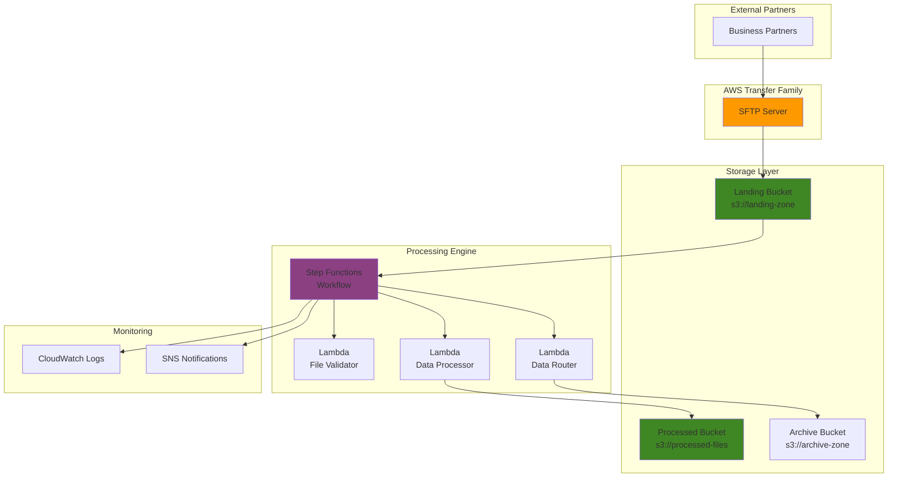

# Business File Processing with Transfer Family

## Problem

Organizations frequently receive business-critical files from partners through legacy SFTP protocols, requiring manual intervention to validate, transform, and route data to downstream systems. This manual process creates bottlenecks, increases error rates, and delays business operations, particularly when dealing with time-sensitive financial reports, inventory updates, or customer data feeds that must be processed according to strict business rules and compliance requirements.

## Solution

Implement a fully automated file processing pipeline using AWS Transfer Family for secure SFTP file ingestion, Step Functions for workflow orchestration, and Lambda for custom processing logic. This serverless architecture automatically validates incoming files, applies business transformations, and routes processed data to appropriate downstream systems while providing comprehensive monitoring, error handling, and audit trails for compliance requirements.

## Architecture Diagram



## Prerequisites

1. AWS account with administrative permissions for Transfer Family, Step Functions, Lambda, S3, IAM, and EventBridge
2. AWS CLI v2 installed and configured (or AWS CloudShell)
3. Basic understanding of SFTP protocols and file processing workflows
4. Knowledge of JSON for Step Functions state machine definitions
5. Estimated cost: $15-25/month for development environment (includes Transfer Family endpoint, Lambda executions, S3 storage)

> **Note**: Transfer Family charges $0.30 per hour for each enabled protocol endpoint plus data transfer costs. Consider using a single development environment to minimize costs during testing.

## Preparation

```bash
# Set environment variables for consistent resource naming
export AWS_REGION=$(aws configure get region)
export AWS_ACCOUNT_ID=$(aws sts get-caller-identity \
    --query Account --output text)

# Generate unique suffix for resource naming
RANDOM_SUFFIX=$(aws secretsmanager get-random-password \
    --exclude-punctuation --exclude-uppercase \
    --password-length 6 --require-each-included-type \
    --output text --query RandomPassword)

# Set project-specific variables
export PROJECT_NAME="file-processing-${RANDOM_SUFFIX}"
export LANDING_BUCKET="${PROJECT_NAME}-landing"
export PROCESSED_BUCKET="${PROJECT_NAME}-processed"
export ARCHIVE_BUCKET="${PROJECT_NAME}-archive"

# Create S3 buckets for file storage tiers with server-side encryption
aws s3 mb s3://${LANDING_BUCKET} --region ${AWS_REGION}
aws s3 mb s3://${PROCESSED_BUCKET} --region ${AWS_REGION}
aws s3 mb s3://${ARCHIVE_BUCKET} --region ${AWS_REGION}

# Enable S3 bucket versioning and encryption for data protection
aws s3api put-bucket-versioning \
    --bucket ${LANDING_BUCKET} \
    --versioning-configuration Status=Enabled

aws s3api put-bucket-versioning \
    --bucket ${PROCESSED_BUCKET} \
    --versioning-configuration Status=Enabled

# Enable server-side encryption with AES256
aws s3api put-bucket-encryption \
    --bucket ${LANDING_BUCKET} \
    --server-side-encryption-configuration \
    'Rules=[{ApplyServerSideEncryptionByDefault:{SSEAlgorithm:AES256}}]'

aws s3api put-bucket-encryption \
    --bucket ${PROCESSED_BUCKET} \
    --server-side-encryption-configuration \
    'Rules=[{ApplyServerSideEncryptionByDefault:{SSEAlgorithm:AES256}}]'

aws s3api put-bucket-encryption \
    --bucket ${ARCHIVE_BUCKET} \
    --server-side-encryption-configuration \
    'Rules=[{ApplyServerSideEncryptionByDefault:{SSEAlgorithm:AES256}}]'

# Enable EventBridge notifications for the landing bucket
aws s3api put-bucket-notification-configuration \
    --bucket ${LANDING_BUCKET} \
    --notification-configuration '{
        "EventBridgeConfiguration": {}
    }'

echo "✅ S3 buckets created with versioning, encryption, and EventBridge notifications enabled"
```

## Steps

1. **Create IAM Roles for Service Integration**:

   AWS services require specific IAM roles to interact securely with each other. Transfer Family needs permissions to access S3 buckets, Step Functions requires access to Lambda and S3, and Lambda functions need permissions to read/write S3 objects and publish CloudWatch logs. These roles implement least-privilege access patterns following AWS security best practices.

   ```bash
   # Create Lambda execution role with comprehensive permissions
   aws iam create-role \
       --role-name ${PROJECT_NAME}-lambda-role \
       --assume-role-policy-document '{
           "Version": "2012-10-17",
           "Statement": [{
               "Effect": "Allow",
               "Principal": {"Service": "lambda.amazonaws.com"},
               "Action": "sts:AssumeRole"
           }]
       }'
   
   # Attach AWS managed policies for Lambda
   aws iam attach-role-policy \
       --role-name ${PROJECT_NAME}-lambda-role \
       --policy-arn arn:aws:iam::aws:policy/service-role/AWSLambdaBasicExecutionRole
   
   # Create custom policy for S3 and SNS access
   aws iam create-policy \
       --policy-name ${PROJECT_NAME}-lambda-policy \
       --policy-document '{
           "Version": "2012-10-17",
           "Statement": [
               {
                   "Effect": "Allow",
                   "Action": [
                       "s3:GetObject",
                       "s3:PutObject",
                       "s3:CopyObject",
                       "s3:DeleteObject"
                   ],
                   "Resource": [
                       "arn:aws:s3:::'${LANDING_BUCKET}'/*",
                       "arn:aws:s3:::'${PROCESSED_BUCKET}'/*",
                       "arn:aws:s3:::'${ARCHIVE_BUCKET}'/*"
                   ]
               },
               {
                   "Effect": "Allow",
                   "Action": ["sns:Publish"],
                   "Resource": "*"
               },
               {
                   "Effect": "Allow",
                   "Action": ["sts:GetCallerIdentity"],
                   "Resource": "*"
               }
           ]
       }'
   
   aws iam attach-role-policy \
       --role-name ${PROJECT_NAME}-lambda-role \
       --policy-arn arn:aws:iam::${AWS_ACCOUNT_ID}:policy/${PROJECT_NAME}-lambda-policy
   
   # Create Transfer Family service role
   aws iam create-role \
       --role-name ${PROJECT_NAME}-transfer-role \
       --assume-role-policy-document '{
           "Version": "2012-10-17",
           "Statement": [{
               "Effect": "Allow",
               "Principal": {"Service": "transfer.amazonaws.com"},
               "Action": "sts:AssumeRole"
           }]
       }'
   
   # Create custom policy for Transfer Family S3 access
   aws iam create-policy \
       --policy-name ${PROJECT_NAME}-transfer-policy \
       --policy-document '{
           "Version": "2012-10-17",
           "Statement": [{
               "Effect": "Allow",
               "Action": [
                   "s3:PutObject",
                   "s3:GetObject",
                   "s3:GetObjectVersion",
                   "s3:DeleteObject",
                   "s3:DeleteObjectVersion"
               ],
               "Resource": "arn:aws:s3:::'${LANDING_BUCKET}'/*"
           },
           {
               "Effect": "Allow",
               "Action": [
                   "s3:ListBucket",
                   "s3:GetBucketLocation"
               ],
               "Resource": "arn:aws:s3:::'${LANDING_BUCKET}'"
           }]
       }'
   
   aws iam attach-role-policy \
       --role-name ${PROJECT_NAME}-transfer-role \
       --policy-arn arn:aws:iam::${AWS_ACCOUNT_ID}:policy/${PROJECT_NAME}-transfer-policy
   
   # Create Step Functions execution role
   aws iam create-role \
       --role-name ${PROJECT_NAME}-stepfunctions-role \
       --assume-role-policy-document '{
           "Version": "2012-10-17",
           "Statement": [{
               "Effect": "Allow",
               "Principal": {"Service": "states.amazonaws.com"},
               "Action": "sts:AssumeRole"
           }]
       }'
   
   # Create EventBridge role for Step Functions integration
   aws iam create-role \
       --role-name ${PROJECT_NAME}-events-role \
       --assume-role-policy-document '{
           "Version": "2012-10-17",
           "Statement": [{
               "Effect": "Allow",
               "Principal": {"Service": "events.amazonaws.com"},
               "Action": "sts:AssumeRole"
           }]
       }'
   
   echo "✅ IAM roles created with appropriate trust policies"
   ```

   The IAM roles establish secure authentication boundaries between AWS services, ensuring each service can only access the resources it needs to perform its designated function within the file processing pipeline. This follows the principle of least privilege recommended by the [AWS Well-Architected Framework Security Pillar](https://docs.aws.amazon.com/wellarchitected/latest/security-pillar/welcome.html).

2. **Create Lambda Functions for File Processing Logic**:

   Lambda functions provide serverless compute capacity for custom business logic without managing infrastructure. Each function handles a specific aspect of file processing: validation ensures data quality and format compliance, processing applies business transformations, and routing directs files to appropriate downstream systems based on content or metadata.

   ```bash
   # Create file validator Lambda function
   cat > validator-function.py << 'EOF'
import json
import boto3
import csv
from io import StringIO
import logging

# Configure logging
logger = logging.getLogger()
logger.setLevel(logging.INFO)

def lambda_handler(event, context):
    s3 = boto3.client('s3')
    
    # Extract S3 information from EventBridge or direct input
    if 'detail' in event:
        bucket = event['detail']['bucket']['name']
        key = event['detail']['object']['key']
    else:
        bucket = event['bucket']
        key = event['key']
    
    logger.info(f"Validating file: {key} in bucket: {bucket}")
    
    try:
        # Download and validate file format
        response = s3.get_object(Bucket=bucket, Key=key)
        content = response['Body'].read().decode('utf-8')
        
        # Validate CSV format
        csv_reader = csv.reader(StringIO(content))
        rows = list(csv_reader)
        
        if len(rows) < 2:  # Header + at least one data row
            raise ValueError("File must contain header and data rows")
        
        logger.info(f"File validation successful: {len(rows)-1} data rows found")
        
        return {
            'statusCode': 200,
            'isValid': True,
            'rowCount': len(rows) - 1,
            'bucket': bucket,
            'key': key
        }
    except Exception as e:
        logger.error(f"File validation failed: {str(e)}")
        return {
            'statusCode': 400,
            'isValid': False,
            'error': str(e),
            'bucket': bucket,
            'key': key
        }
EOF
   
   # Package and deploy validator function with latest Python runtime
   zip validator-function.zip validator-function.py
   
   aws lambda create-function \
       --function-name ${PROJECT_NAME}-validator \
       --runtime python3.12 \
       --role arn:aws:iam::${AWS_ACCOUNT_ID}:role/${PROJECT_NAME}-lambda-role \
       --handler validator-function.lambda_handler \
       --zip-file fileb://validator-function.zip \
       --timeout 60 \
       --memory-size 256 \
       --environment Variables='{
           "LOG_LEVEL":"INFO"
       }'
   
   echo "✅ File validator Lambda function deployed with Python 3.12 runtime"
   ```

   The validator function implements data quality checks and format validation, ensuring only properly formatted files proceed through the processing pipeline. This prevents downstream errors and maintains data integrity across the entire workflow. The enhanced logging provides better observability for troubleshooting and compliance auditing.

3. **Create Data Processing and Routing Lambda Functions**:

   The data processing function applies business-specific transformations to incoming files, while the routing function directs processed files to appropriate destinations based on content analysis. This serverless approach enables complex data transformations and intelligent routing without infrastructure management.

   ```bash
   # Create data processor Lambda function
   cat > processor-function.py << 'EOF'
import json
import boto3
import csv
import io
from datetime import datetime
import logging

# Configure logging
logger = logging.getLogger()
logger.setLevel(logging.INFO)

def lambda_handler(event, context):
    s3 = boto3.client('s3')
    bucket = event['bucket']
    key = event['key']
    
    logger.info(f"Processing file: {key} in bucket: {bucket}")
    
    try:
        # Download original file
        response = s3.get_object(Bucket=bucket, Key=key)
        content = response['Body'].read().decode('utf-8')
        
        # Process CSV data with business logic
        csv_reader = csv.DictReader(io.StringIO(content))
        processed_rows = []
        
        for row in csv_reader:
            # Add processing timestamp and metadata
            row['processed_timestamp'] = datetime.utcnow().isoformat()
            row['processing_version'] = '1.0'
            
            # Apply business logic transformations here
            if 'amount' in row:
                try:
                    # Convert amount to float and add validation flag
                    amount = float(row['amount'])
                    row['amount_validated'] = 'true'
                    row['amount_category'] = 'high' if amount > 1000 else 'standard'
                except ValueError:
                    row['amount_validated'] = 'false'
                    row['amount_category'] = 'unknown'
            
            processed_rows.append(row)
        
        # Convert back to CSV with enhanced metadata
        output = io.StringIO()
        if processed_rows:
            writer = csv.DictWriter(output, fieldnames=processed_rows[0].keys())
            writer.writeheader()
            writer.writerows(processed_rows)
        
        # Upload processed file with metadata
        processed_key = f"processed/{key}"
        processed_bucket = bucket.replace('landing', 'processed')
        
        s3.put_object(
            Bucket=processed_bucket,
            Key=processed_key,
            Body=output.getvalue(),
            ContentType='text/csv',
            Metadata={
                'original-bucket': bucket,
                'original-key': key,
                'processing-timestamp': datetime.utcnow().isoformat(),
                'record-count': str(len(processed_rows))
            }
        )
        
        logger.info(f"File processed successfully: {len(processed_rows)} records")
        
        return {
            'statusCode': 200,
            'processedKey': processed_key,
            'recordCount': len(processed_rows),
            'bucket': bucket,
            'originalKey': key
        }
        
    except Exception as e:
        logger.error(f"File processing failed: {str(e)}")
        return {
            'statusCode': 500,
            'error': str(e),
            'bucket': bucket,
            'key': key
        }
EOF
   
   # Create routing Lambda function
   cat > router-function.py << 'EOF'
import json
import boto3
import logging
from datetime import datetime

# Configure logging
logger = logging.getLogger()
logger.setLevel(logging.INFO)

def lambda_handler(event, context):
    s3 = boto3.client('s3')
    sns = boto3.client('sns')
    
    bucket = event['bucket']
    key = event['processedKey']
    record_count = event['recordCount']
    
    logger.info(f"Routing file: {key} with {record_count} records")
    
    try:
        # Determine routing destination based on file content and metadata
        if 'financial' in key.lower():
            destination = 'financial-data/'
            priority = 'high'
        elif 'inventory' in key.lower():
            destination = 'inventory-data/'
            priority = 'medium'
        else:
            destination = 'general-data/'
            priority = 'standard'
        
        # Copy to appropriate archive destination with organized structure
        processed_bucket = bucket.replace('landing', 'processed')
        archive_bucket = bucket.replace('landing', 'archive')
        
        # Create archive path with date partitioning
        date_partition = datetime.utcnow().strftime('%Y/%m/%d')
        archive_key = f"{destination}{date_partition}/{key}"
        
        # Copy with enhanced metadata
        s3.copy_object(
            CopySource={'Bucket': processed_bucket, 'Key': key},
            Bucket=archive_bucket,
            Key=archive_key,
            MetadataDirective='REPLACE',
            Metadata={
                'routing-destination': destination,
                'priority-level': priority,
                'archive-timestamp': datetime.utcnow().isoformat(),
                'record-count': str(record_count)
            }
        )
        
        logger.info(f"File routed to {destination} with priority {priority}")
        
        return {
            'statusCode': 200,
            'destination': destination,
            'archiveKey': archive_key,
            'recordCount': record_count,
            'priority': priority
        }
        
    except Exception as e:
        logger.error(f"File routing failed: {str(e)}")
        return {
            'statusCode': 500,
            'error': str(e)
        }
EOF
   
   # Deploy processor function with enhanced configuration
   zip processor-function.zip processor-function.py
   
   aws lambda create-function \
       --function-name ${PROJECT_NAME}-processor \
       --runtime python3.12 \
       --role arn:aws:iam::${AWS_ACCOUNT_ID}:role/${PROJECT_NAME}-lambda-role \
       --handler processor-function.lambda_handler \
       --zip-file fileb://processor-function.zip \
       --timeout 300 \
       --memory-size 512 \
       --environment Variables='{
           "LOG_LEVEL":"INFO"
       }'
   
   # Deploy router function
   zip router-function.zip router-function.py
   
   aws lambda create-function \
       --function-name ${PROJECT_NAME}-router \
       --runtime python3.12 \
       --role arn:aws:iam::${AWS_ACCOUNT_ID}:role/${PROJECT_NAME}-lambda-role \
       --handler router-function.lambda_handler \
       --zip-file fileb://router-function.zip \
       --timeout 180 \
       --memory-size 256 \
       --environment Variables='{
           "LOG_LEVEL":"INFO"
       }'
   
   echo "✅ Data processor and router Lambda functions deployed with enhanced logging"
   ```

   The processor function demonstrates how to implement custom business logic within the serverless architecture, including data validation, transformation, and metadata enrichment. The routing function enables intelligent file distribution to multiple downstream systems based on content analysis and business rules, with date-partitioned storage for better organization.

4. **Configure IAM Policies for Step Functions and EventBridge**:

   Step Functions and EventBridge require specific IAM permissions to invoke Lambda functions and orchestrate workflow execution. These policies enable secure cross-service communication while maintaining the principle of least privilege.

   ```bash
   # Create Step Functions policy for Lambda invocation
   aws iam create-policy \
       --policy-name ${PROJECT_NAME}-stepfunctions-policy \
       --policy-document '{
           "Version": "2012-10-17",
           "Statement": [{
               "Effect": "Allow",
               "Action": "lambda:InvokeFunction",
               "Resource": [
                   "arn:aws:lambda:'${AWS_REGION}':'${AWS_ACCOUNT_ID}':function:'${PROJECT_NAME}'-validator",
                   "arn:aws:lambda:'${AWS_REGION}':'${AWS_ACCOUNT_ID}':function:'${PROJECT_NAME}'-processor",
                   "arn:aws:lambda:'${AWS_REGION}':'${AWS_ACCOUNT_ID}':function:'${PROJECT_NAME}'-router"
               ]
           }]
       }'
   
   aws iam attach-role-policy \
       --role-name ${PROJECT_NAME}-stepfunctions-role \
       --policy-arn arn:aws:iam::${AWS_ACCOUNT_ID}:policy/${PROJECT_NAME}-stepfunctions-policy
   
   # Create EventBridge policy for Step Functions invocation
   aws iam create-policy \
       --policy-name ${PROJECT_NAME}-events-policy \
       --policy-document '{
           "Version": "2012-10-17",
           "Statement": [{
               "Effect": "Allow",
               "Action": "states:StartExecution",
               "Resource": "*"
           }]
       }'
   
   aws iam attach-role-policy \
       --role-name ${PROJECT_NAME}-events-role \
       --policy-arn arn:aws:iam::${AWS_ACCOUNT_ID}:policy/${PROJECT_NAME}-events-policy
   
   echo "✅ IAM policies configured for Step Functions and EventBridge"
   ```

   These IAM policies establish secure authorization for service-to-service communication, ensuring that Step Functions can invoke Lambda functions and EventBridge can trigger workflow executions. The policies follow AWS security best practices by granting minimal required permissions.

5. **Create Step Functions State Machine for Workflow Orchestration**:

   Step Functions provide visual workflow orchestration with built-in error handling, retry logic, and state management. The state machine coordinates the sequence of file processing operations, manages parallel execution where appropriate, and handles both success and failure scenarios with appropriate notifications and recovery actions.

   ```bash
   # Define enhanced Step Functions state machine with improved error handling
   cat > workflow-definition.json << EOF
{
  "Comment": "Automated file processing workflow with enhanced error handling",
  "StartAt": "ValidateFile",
  "States": {
    "ValidateFile": {
      "Type": "Task",
      "Resource": "arn:aws:lambda:${AWS_REGION}:${AWS_ACCOUNT_ID}:function:${PROJECT_NAME}-validator",
      "Next": "CheckValidation",
      "Retry": [
        {
          "ErrorEquals": ["Lambda.ServiceException", "Lambda.AWSLambdaException", "Lambda.SdkClientException"],
          "IntervalSeconds": 2,
          "MaxAttempts": 3,
          "BackoffRate": 2.0
        }
      ],
      "Catch": [
        {
          "ErrorEquals": ["States.ALL"],
          "Next": "ValidationFailed",
          "ResultPath": "$.error"
        }
      ]
    },
    "CheckValidation": {
      "Type": "Choice",
      "Choices": [
        {
          "Variable": "$.isValid",
          "BooleanEquals": true,
          "Next": "ProcessFile"
        }
      ],
      "Default": "ValidationFailed"
    },
    "ProcessFile": {
      "Type": "Task",
      "Resource": "arn:aws:lambda:${AWS_REGION}:${AWS_ACCOUNT_ID}:function:${PROJECT_NAME}-processor",
      "Next": "RouteFile",
      "Retry": [
        {
          "ErrorEquals": ["Lambda.ServiceException", "Lambda.AWSLambdaException"],
          "IntervalSeconds": 2,
          "MaxAttempts": 3,
          "BackoffRate": 2.0
        }
      ],
      "Catch": [
        {
          "ErrorEquals": ["States.ALL"],
          "Next": "ProcessingFailed",
          "ResultPath": "$.error"
        }
      ]
    },
    "RouteFile": {
      "Type": "Task",
      "Resource": "arn:aws:lambda:${AWS_REGION}:${AWS_ACCOUNT_ID}:function:${PROJECT_NAME}-router",
      "Next": "ProcessingComplete",
      "Retry": [
        {
          "ErrorEquals": ["Lambda.ServiceException"],
          "IntervalSeconds": 2,
          "MaxAttempts": 2
        }
      ],
      "Catch": [
        {
          "ErrorEquals": ["States.ALL"],
          "Next": "RoutingFailed",
          "ResultPath": "$.error"
        }
      ]
    },
    "ProcessingComplete": {
      "Type": "Succeed"
    },
    "ValidationFailed": {
      "Type": "Fail",
      "Cause": "File validation failed - file does not meet format requirements"
    },
    "ProcessingFailed": {
      "Type": "Fail",
      "Cause": "File processing failed - unable to transform data"
    },
    "RoutingFailed": {
      "Type": "Fail",
      "Cause": "File routing failed - unable to archive processed data"
    }
  }
}
EOF
   
   # Create Step Functions state machine with enhanced configuration
   aws stepfunctions create-state-machine \
       --name ${PROJECT_NAME}-workflow \
       --definition file://workflow-definition.json \
       --role-arn arn:aws:iam::${AWS_ACCOUNT_ID}:role/${PROJECT_NAME}-stepfunctions-role \
       --type STANDARD \
       --logging-configuration '{
           "level": "ERROR",
           "includeExecutionData": false,
           "destinations": [{
               "cloudWatchLogsLogGroup": {
                   "logGroupArn": "arn:aws:logs:'${AWS_REGION}':'${AWS_ACCOUNT_ID}':log-group:/aws/stepfunctions/'${PROJECT_NAME}'-workflow"
               }
           }]
       }'
   
   echo "✅ Step Functions workflow created with enhanced error handling and logging"
   ```

   The state machine provides robust workflow management with automatic retry policies, comprehensive error handling, and state transitions that ensure reliable file processing even when individual components experience temporary failures. The enhanced error handling includes specific failure states that provide clear diagnostic information.

6. **Create AWS Transfer Family SFTP Server**:

   Transfer Family provides fully managed SFTP endpoints that integrate directly with S3 storage, eliminating the need to manage SFTP servers while providing enterprise-grade security and compliance features. The service handles authentication, encryption in transit, and automatic file delivery to designated S3 buckets.

   ```bash
   # Create Transfer Family SFTP server with enhanced security configuration
   aws transfer create-server \
       --identity-provider-type SERVICE_MANAGED \
       --protocols SFTP \
       --endpoint-type PUBLIC \
       --security-policy-name TransferSecurityPolicy-2020-06 \
       --tags Key=Project,Value=${PROJECT_NAME} \
              Key=Environment,Value=Development \
              Key=CostCenter,Value=IT
   
   # Store server ID for user creation
   TRANSFER_SERVER_ID=$(aws transfer list-servers \
       --query 'Servers[0].ServerId' --output text)
   
   # Create SFTP user with S3 access and session policy for enhanced security
   aws transfer create-user \
       --server-id ${TRANSFER_SERVER_ID} \
       --user-name businesspartner \
       --role arn:aws:iam::${AWS_ACCOUNT_ID}:role/${PROJECT_NAME}-transfer-role \
       --home-directory /${LANDING_BUCKET}/uploads \
       --home-directory-type PATH \
       --policy '{
           "Version": "2012-10-17",
           "Statement": [{
               "Effect": "Allow",
               "Action": [
                   "s3:PutObject",
                   "s3:PutObjectAcl"
               ],
               "Resource": "arn:aws:s3:::'${LANDING_BUCKET}'/uploads/*"
           }]
       }' \
       --tags Key=UserType,Value=BusinessPartner \
              Key=AccessLevel,Value=Limited
   
   # Create SSH key pair for secure authentication
   ssh-keygen -t rsa -b 2048 -f transfer-key -N "" -C "transfer-family-key"
   
   # Import SSH public key to Transfer Family user
   aws transfer import-ssh-public-key \
       --server-id ${TRANSFER_SERVER_ID} \
       --user-name businesspartner \
       --ssh-public-key-body "$(cat transfer-key.pub)"
   
   echo "✅ Transfer Family SFTP server created with enhanced security: ${TRANSFER_SERVER_ID}"
   echo "✅ SSH key pair generated for secure authentication"
   ```

   The SFTP server provides a secure, standards-compliant interface that business partners can use with existing SFTP clients, while automatically delivering files to S3 where they trigger the automated processing workflow. The enhanced security configuration includes the latest security policy and session-based access controls.

7. **Configure S3 Event Integration with Step Functions**:

   S3 event notifications trigger the Step Functions workflow automatically when files arrive via SFTP, creating a truly event-driven architecture. This integration eliminates polling mechanisms and ensures immediate processing of files as they arrive, while providing reliable delivery guarantees through S3's event system.

   ```bash
   # Create EventBridge rule for S3 object creation events
   aws events put-rule \
       --name ${PROJECT_NAME}-file-processing \
       --event-pattern '{
           "source": ["aws.s3"],
           "detail-type": ["Object Created"],
           "detail": {
               "bucket": {"name": ["'${LANDING_BUCKET}'"]},
               "object": {
                   "key": [{"prefix": "uploads/"}]
               }
           }
       }' \
       --state ENABLED \
       --description "Trigger file processing workflow on S3 object creation"
   
   # Get Step Functions state machine ARN
   STATE_MACHINE_ARN=$(aws stepfunctions list-state-machines \
       --query "stateMachines[?name=='${PROJECT_NAME}-workflow'].stateMachineArn" \
       --output text)
   
   # Add Step Functions as EventBridge target with input transformation
   aws events put-targets \
       --rule ${PROJECT_NAME}-file-processing \
       --targets "Id"="1","Arn"="${STATE_MACHINE_ARN}","RoleArn"="arn:aws:iam::${AWS_ACCOUNT_ID}:role/${PROJECT_NAME}-events-role","InputTransformer"='{
           "InputPathsMap": {
               "bucket": "$.detail.bucket.name",
               "key": "$.detail.object.key"
           },
           "InputTemplate": "{\"bucket\": \"<bucket>\", \"key\": \"<key>\"}"
       }'
   
   echo "✅ S3 event integration configured with Step Functions"
   echo "✅ EventBridge rule targets files in uploads/ prefix only"
   ```

   The event-driven integration ensures files are processed immediately upon arrival without manual intervention or polling mechanisms, providing responsive file processing that scales automatically with business demand. The input transformation maps S3 event data to the expected Step Functions input format.

8. **Set Up Monitoring and Alerting**:

   CloudWatch monitoring and SNS notifications provide operational visibility and proactive alerting for the file processing pipeline. This observability enables quick identification and resolution of issues while providing audit trails for compliance and business reporting requirements.

   ```bash
   # Create CloudWatch log group for Step Functions
   aws logs create-log-group \
       --log-group-name /aws/stepfunctions/${PROJECT_NAME}-workflow
   
   # Create SNS topic for alerts
   aws sns create-topic --name ${PROJECT_NAME}-alerts
   
   TOPIC_ARN=$(aws sns list-topics \
       --query "Topics[?contains(TopicArn, '${PROJECT_NAME}-alerts')].TopicArn" \
       --output text)
   
   # Create CloudWatch alarm for failed executions
   aws cloudwatch put-metric-alarm \
       --alarm-name ${PROJECT_NAME}-failed-executions \
       --alarm-description "Alert on Step Functions execution failures" \
       --metric-name ExecutionsFailed \
       --namespace AWS/States \
       --statistic Sum \
       --period 300 \
       --threshold 1 \
       --comparison-operator GreaterThanOrEqualToThreshold \
       --evaluation-periods 1 \
       --alarm-actions ${TOPIC_ARN} \
       --dimensions Name=StateMachineArn,Value=${STATE_MACHINE_ARN}
   
   # Create alarm for Lambda function errors
   aws cloudwatch put-metric-alarm \
       --alarm-name ${PROJECT_NAME}-lambda-errors \
       --alarm-description "Alert on Lambda function errors" \
       --metric-name Errors \
       --namespace AWS/Lambda \
       --statistic Sum \
       --period 300 \
       --threshold 1 \
       --comparison-operator GreaterThanOrEqualToThreshold \
       --evaluation-periods 1 \
       --alarm-actions ${TOPIC_ARN} \
       --dimensions Name=FunctionName,Value=${PROJECT_NAME}-validator
   
   echo "✅ Comprehensive monitoring and alerting configured"
   echo "✅ CloudWatch alarms created for Step Functions and Lambda errors"
   ```

   The monitoring setup provides real-time visibility into workflow execution status and automatically notifies operations teams of any processing failures, enabling rapid response to issues and maintaining high service availability. Multiple alarms ensure comprehensive coverage of the processing pipeline.

## Validation & Testing

1. **Verify Transfer Family SFTP Server Status**:

   ```bash
   # Check server status and endpoint configuration
   aws transfer describe-server \
       --server-id ${TRANSFER_SERVER_ID} \
       --query 'Server.[State,EndpointType,Protocols,SecurityPolicyName]' \
       --output table
   
   # Get SFTP endpoint hostname for client configuration
   SFTP_ENDPOINT=$(aws transfer describe-server \
       --server-id ${TRANSFER_SERVER_ID} \
       --query 'Server.EndpointDetails.Address' \
       --output text)
   
   echo "SFTP Server Endpoint: ${SFTP_ENDPOINT}"
   echo "SFTP Connection: sftp -i transfer-key businesspartner@${SFTP_ENDPOINT}"
   ```

   Expected output: Server state should be "ONLINE" with SFTP protocol enabled and the latest security policy applied.

2. **Test File Upload and Processing Workflow**:

   ```bash
   # Create comprehensive test CSV file with various data types
   cat > test-financial-data.csv << 'EOF'
transaction_id,amount,currency,date,description
TX001,1500.00,USD,2025-07-23,Payment processing
TX002,2750.50,USD,2025-07-23,Wire transfer
TX003,890.25,EUR,2025-07-23,Currency exchange
TX004,invalid_amount,USD,2025-07-23,Invalid data test
EOF
   
   # Upload test file directly to S3 uploads folder to trigger workflow
   aws s3 cp test-financial-data.csv s3://${LANDING_BUCKET}/uploads/
   
   # Monitor Step Functions execution with detailed output
   sleep 15
   EXECUTION_ARN=$(aws stepfunctions list-executions \
       --state-machine-arn ${STATE_MACHINE_ARN} \
       --max-items 1 \
       --query 'executions[0].executionArn' \
       --output text)
   
   aws stepfunctions describe-execution \
       --execution-arn ${EXECUTION_ARN} \
       --query '[status,startDate,stopDate]' \
       --output table
   ```

   Expected output: Should show "SUCCEEDED" execution status with processing timestamps indicating successful workflow completion.

3. **Verify File Processing Results and Data Quality**:

   ```bash
   # Check processed files with metadata
   echo "=== Processed Files ==="
   aws s3 ls s3://${PROCESSED_BUCKET}/ --recursive
   
   # Check archived files with organized structure
   echo "=== Archived Files ==="
   aws s3 ls s3://${ARCHIVE_BUCKET}/ --recursive
   
   # Verify processed file content and enhancements
   echo "=== Processed File Content ==="
   aws s3 cp s3://${PROCESSED_BUCKET}/processed/uploads/test-financial-data.csv - | head -10
   
   # Check file metadata
   echo "=== File Metadata ==="
   aws s3api head-object \
       --bucket ${PROCESSED_BUCKET} \
       --key processed/uploads/test-financial-data.csv \
       --query 'Metadata'
   ```

   Expected output: Processed files should appear in both processed and archive buckets with added processing timestamps, validation flags, and organized date-partitioned structure in the archive.

## Cleanup

1. **Remove EventBridge and Step Functions Resources**:

   ```bash
   # Remove EventBridge targets and rules
   aws events remove-targets \
       --rule ${PROJECT_NAME}-file-processing \
       --ids "1"
   
   aws events delete-rule \
       --name ${PROJECT_NAME}-file-processing
   
   # Delete Step Functions state machine
   aws stepfunctions delete-state-machine \
       --state-machine-arn ${STATE_MACHINE_ARN}
   
   # Delete CloudWatch log group
   aws logs delete-log-group \
       --log-group-name /aws/stepfunctions/${PROJECT_NAME}-workflow
   
   echo "✅ EventBridge and Step Functions resources deleted"
   ```

2. **Remove Transfer Family Resources**:

   ```bash
   # Delete SSH key from Transfer Family user
   SSH_KEY_ID=$(aws transfer list-ssh-public-keys \
       --server-id ${TRANSFER_SERVER_ID} \
       --user-name businesspartner \
       --query 'SshPublicKeys[0].SshPublicKeyId' \
       --output text)
   
   aws transfer delete-ssh-public-key \
       --server-id ${TRANSFER_SERVER_ID} \
       --user-name businesspartner \
       --ssh-public-key-id ${SSH_KEY_ID}
   
   # Delete SFTP user
   aws transfer delete-user \
       --server-id ${TRANSFER_SERVER_ID} \
       --user-name businesspartner
   
   # Delete Transfer Family server
   aws transfer delete-server \
       --server-id ${TRANSFER_SERVER_ID}
   
   # Remove local SSH key files
   rm -f transfer-key transfer-key.pub
   
   echo "✅ Transfer Family resources deleted"
   ```

3. **Remove Lambda Functions**:

   ```bash
   # Delete Lambda functions
   aws lambda delete-function \
       --function-name ${PROJECT_NAME}-validator
   
   aws lambda delete-function \
       --function-name ${PROJECT_NAME}-processor
   
   aws lambda delete-function \
       --function-name ${PROJECT_NAME}-router
   
   # Remove local function packages
   rm -f validator-function.zip processor-function.zip router-function.zip
   rm -f validator-function.py processor-function.py router-function.py
   rm -f workflow-definition.json test-financial-data.csv
   
   echo "✅ Lambda functions deleted"
   ```

4. **Remove S3 Buckets and Contents**:

   ```bash
   # Empty and delete S3 buckets
   aws s3 rm s3://${LANDING_BUCKET} --recursive
   aws s3 rm s3://${PROCESSED_BUCKET} --recursive
   aws s3 rm s3://${ARCHIVE_BUCKET} --recursive
   
   aws s3 rb s3://${LANDING_BUCKET}
   aws s3 rb s3://${PROCESSED_BUCKET}
   aws s3 rb s3://${ARCHIVE_BUCKET}
   
   echo "✅ S3 storage resources deleted"
   ```

5. **Remove IAM Roles and Monitoring Resources**:

   ```bash
   # Delete CloudWatch alarms
   aws cloudwatch delete-alarms \
       --alarm-names ${PROJECT_NAME}-failed-executions \
                    ${PROJECT_NAME}-lambda-errors
   
   # Delete SNS topics
   aws sns delete-topic --topic-arn ${TOPIC_ARN}
   
   # Detach and delete custom IAM policies
   aws iam detach-role-policy \
       --role-name ${PROJECT_NAME}-lambda-role \
       --policy-arn arn:aws:iam::aws:policy/service-role/AWSLambdaBasicExecutionRole
   
   aws iam detach-role-policy \
       --role-name ${PROJECT_NAME}-lambda-role \
       --policy-arn arn:aws:iam::${AWS_ACCOUNT_ID}:policy/${PROJECT_NAME}-lambda-policy
   
   aws iam detach-role-policy \
       --role-name ${PROJECT_NAME}-transfer-role \
       --policy-arn arn:aws:iam::${AWS_ACCOUNT_ID}:policy/${PROJECT_NAME}-transfer-policy
   
   aws iam detach-role-policy \
       --role-name ${PROJECT_NAME}-stepfunctions-role \
       --policy-arn arn:aws:iam::${AWS_ACCOUNT_ID}:policy/${PROJECT_NAME}-stepfunctions-policy
   
   aws iam detach-role-policy \
       --role-name ${PROJECT_NAME}-events-role \
       --policy-arn arn:aws:iam::${AWS_ACCOUNT_ID}:policy/${PROJECT_NAME}-events-policy
   
   # Delete IAM policies
   aws iam delete-policy \
       --policy-arn arn:aws:iam::${AWS_ACCOUNT_ID}:policy/${PROJECT_NAME}-lambda-policy
   
   aws iam delete-policy \
       --policy-arn arn:aws:iam::${AWS_ACCOUNT_ID}:policy/${PROJECT_NAME}-transfer-policy
   
   aws iam delete-policy \
       --policy-arn arn:aws:iam::${AWS_ACCOUNT_ID}:policy/${PROJECT_NAME}-stepfunctions-policy
   
   aws iam delete-policy \
       --policy-arn arn:aws:iam::${AWS_ACCOUNT_ID}:policy/${PROJECT_NAME}-events-policy
   
   # Delete IAM roles
   aws iam delete-role --role-name ${PROJECT_NAME}-lambda-role
   aws iam delete-role --role-name ${PROJECT_NAME}-transfer-role
   aws iam delete-role --role-name ${PROJECT_NAME}-stepfunctions-role
   aws iam delete-role --role-name ${PROJECT_NAME}-events-role
   
   echo "✅ IAM roles and monitoring resources deleted"
   ```

## Discussion

Building automated file processing pipelines with AWS Transfer Family and Step Functions creates a robust, serverless architecture that eliminates the operational overhead of managing SFTP servers while providing enterprise-grade security and compliance capabilities. This approach is particularly valuable for organizations that need to maintain legacy SFTP interfaces for business partners while modernizing their internal data processing workflows. The [AWS Transfer Family User Guide](https://docs.aws.amazon.com/transfer/latest/userguide/) provides comprehensive guidance on advanced configurations, security best practices, and integration patterns.

The serverless architecture automatically scales based on file processing demand, ensuring cost efficiency during low-volume periods while handling traffic spikes without manual intervention. Step Functions provide visual workflow orchestration with built-in error handling, retry logic, and audit trails that support compliance requirements. This design follows the [AWS Well-Architected Framework](https://docs.aws.amazon.com/wellarchitected/latest/framework/) principles of operational excellence, security, and cost optimization by leveraging managed services that reduce operational complexity. The enhanced error handling and monitoring provide comprehensive observability for production operations.

From a security perspective, this solution implements multiple layers of protection including IAM-based access controls, encryption in transit through SFTP protocols, and encryption at rest in S3 storage. The architecture supports integration with enterprise identity providers for centralized user management and can be extended with AWS WAF and VPC endpoints for additional network security. For detailed security guidance, review the [Transfer Family security documentation](https://docs.aws.amazon.com/transfer/latest/userguide/security.html) and [Step Functions security best practices](https://docs.aws.amazon.com/step-functions/latest/dg/security.html).

The event-driven architecture enables real-time file processing that responds immediately to file arrivals without polling mechanisms or scheduled batch jobs. This responsive design reduces processing latency and improves business agility while maintaining reliability through AWS's managed service infrastructure. The use of EventBridge for S3 integration provides durable event delivery with built-in retry mechanisms. For comprehensive monitoring and troubleshooting guidance, consult the [Step Functions monitoring documentation](https://docs.aws.amazon.com/step-functions/latest/dg/monitoring-and-logging.html) and [CloudWatch best practices](https://docs.aws.amazon.com/AmazonCloudWatch/latest/monitoring/cloudwatch_architecture.html).

> **Tip**: Use AWS X-Ray tracing with Step Functions to analyze workflow performance and identify bottlenecks in your file processing pipeline. This provides valuable insights for optimizing processing times and resource allocation while maintaining compliance with data processing requirements.

## Challenge

Extend this solution by implementing these enhancements:

1. **Implement file encryption and decryption** using AWS KMS for additional data protection during processing, enabling end-to-end encryption from SFTP upload through final archive storage with customer-managed encryption keys.

2. **Add file format detection and conversion** capabilities using additional Lambda functions that automatically detect incoming file formats (JSON, XML, Excel) and convert them to standardized formats for downstream processing, supporting multiple data exchange standards.

3. **Create a dead letter queue workflow** for failed file processing attempts, implementing automatic retry logic with exponential backoff and human intervention workflows for files that cannot be processed automatically, including notification systems for operations teams.

4. **Build a file processing dashboard** using Amazon QuickSight or CloudWatch dashboards to visualize processing metrics, file throughput, error rates, and business KPIs derived from processed data, providing real-time operational insights.

5. **Implement advanced routing logic** that analyzes file content using Amazon Comprehend or custom ML models to automatically classify and route files based on detected entities, sentiment, or business context, enabling intelligent content-based processing workflows.

## Infrastructure Code

*Infrastructure code will be generated after recipe approval.*