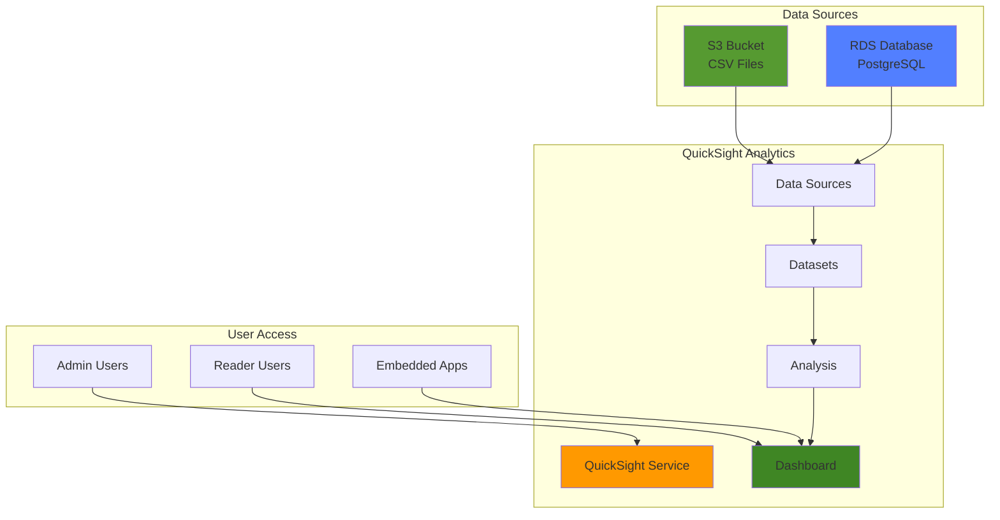

# Business Intelligence Dashboards with QuickSight


## Problem

Organizations often struggle with making data-driven decisions because their business data is scattered across different sources, teams lack the technical expertise to create visualizations, and existing BI tools are expensive and complex to maintain. Business stakeholders need quick access to interactive dashboards that can provide real-time insights from their operational data without requiring extensive technical setup or maintenance overhead.

## Solution

Amazon QuickSight provides a serverless, cloud-native business intelligence service that can connect to multiple data sources, automatically scale based on usage, and enable self-service analytics. This solution demonstrates how to set up QuickSight, connect to both S3 and RDS data sources, create interactive visualizations, and share dashboards with business stakeholders while maintaining proper security and cost controls.

## Architecture Diagram



## Prerequisites

1. AWS account with appropriate permissions for QuickSight, S3, RDS, and IAM
2. AWS CLI v2 installed and configured (or AWS CloudShell)
3. Basic understanding of SQL and data visualization concepts
4. Existing data in S3 or RDS (or willingness to create sample data)
5. Estimated cost: QuickSight Standard Edition $9/month per user, Enterprise Edition $18/month per user plus $250/month account fee, S3 storage ~$0.50/month, RDS ~$15-50/month depending on instance size

> **Note**: QuickSight offers a 30-day free trial with up to 4 users for testing purposes.

## Preparation

```bash
# Set environment variables
export AWS_REGION=$(aws configure get region)
export AWS_ACCOUNT_ID=$(aws sts get-caller-identity \
    --query Account --output text)

# Generate unique identifier for resources
RANDOM_SUFFIX=$(aws secretsmanager get-random-password \
    --exclude-punctuation --exclude-uppercase \
    --password-length 6 --require-each-included-type \
    --output text --query RandomPassword)

# Set resource names
export QUICKSIGHT_ACCOUNT_NAME="quicksight-demo-${RANDOM_SUFFIX}"
export S3_BUCKET_NAME="quicksight-data-${RANDOM_SUFFIX}"
export RDS_DB_NAME="quicksight-db-${RANDOM_SUFFIX}"
export IAM_ROLE_NAME="QuickSight-DataSource-Role-${RANDOM_SUFFIX}"

# Create S3 bucket for sample data
aws s3 mb s3://${S3_BUCKET_NAME} --region ${AWS_REGION}

# Create sample CSV data for demonstration
cat > sales_data.csv << 'EOF'
date,region,product,sales_amount,quantity
2024-01-01,North,Widget A,1200,10
2024-01-01,South,Widget B,800,8
2024-01-02,North,Widget A,1400,12
2024-01-02,South,Widget B,900,9
2024-01-03,East,Widget C,1100,11
2024-01-03,West,Widget A,1300,13
2024-01-04,North,Widget B,1600,16
2024-01-04,South,Widget C,1000,10
2024-01-05,East,Widget A,1500,15
2024-01-05,West,Widget B,1100,11
EOF

# Upload sample data to S3
aws s3 cp sales_data.csv s3://${S3_BUCKET_NAME}/data/sales_data.csv

echo "✅ Sample data uploaded to S3 bucket: ${S3_BUCKET_NAME}"
```

## Steps

1. **Set up Amazon QuickSight account**:

   Amazon QuickSight is a serverless business intelligence service that enables organizations to democratize data access without managing complex infrastructure. Unlike traditional BI tools that require dedicated servers and maintenance, QuickSight scales automatically based on usage and integrates seamlessly with AWS security services. Setting up your QuickSight account establishes the foundation for all subsequent analytics operations and determines your security model, user management approach, and data access patterns. Learn more about QuickSight's capabilities in the [official documentation](https://docs.aws.amazon.com/quicksight/latest/user/welcome.html).

   ```bash
   # Check QuickSight account status
   aws quicksight describe-account-settings \
       --aws-account-id ${AWS_ACCOUNT_ID} \
       --region ${AWS_REGION} 2>/dev/null || \
   echo "QuickSight account not found - manual setup required"
   
   # Create QuickSight account (this requires manual setup via console)
   echo "Visit https://quicksight.aws.amazon.com to set up your account"
   echo "Account name: ${QUICKSIGHT_ACCOUNT_NAME}"
   
   # Wait for manual setup confirmation
   read -p "Press Enter after completing QuickSight account setup..."
   
   echo "✅ QuickSight account setup initiated"
   ```

   Your QuickSight account is now initialized and ready to connect to data sources. This establishes your analytics workspace and enables you to begin creating datasets, analyses, and dashboards. The account configuration determines your service tier (Standard or Enterprise), user capacity, and available features including ML Insights and embedded analytics capabilities.

2. **Create IAM role for QuickSight data access**:

   IAM roles enable secure, temporary credential delegation without hardcoding secrets in application configurations. This principle of least privilege ensures QuickSight accesses only the specific AWS resources it needs, reducing security attack surfaces while maintaining operational flexibility. Unlike permanent access keys, IAM roles provide rotatable, time-limited credentials that align with security best practices and compliance requirements. The trust relationship specifically allows the QuickSight service to assume this role and access your data sources securely.

   ```bash
   # Create trust policy for QuickSight
   cat > quicksight-trust-policy.json << 'EOF'
   {
       "Version": "2012-10-17",
       "Statement": [
           {
               "Effect": "Allow",
               "Principal": {
                   "Service": "quicksight.amazonaws.com"
               },
               "Action": "sts:AssumeRole"
           }
       ]
   }
   EOF
   
   # Create IAM role
   aws iam create-role \
       --role-name ${IAM_ROLE_NAME} \
       --assume-role-policy-document file://quicksight-trust-policy.json \
       --description "Role for QuickSight to access data sources"
   
   # Attach S3 read permissions
   aws iam attach-role-policy \
       --role-name ${IAM_ROLE_NAME} \
       --policy-arn arn:aws:iam::aws:policy/AmazonS3ReadOnlyAccess
   
   echo "✅ IAM role created: ${IAM_ROLE_NAME}"
   ```

   The IAM role is now established and ready for QuickSight to assume when accessing data sources. This security foundation enables your BI platform to interact with S3 and other AWS services using temporary, rotatable credentials rather than permanent access keys. The role-based approach facilitates compliance with enterprise security policies and enables granular access control as your analytics platform scales.

3. **Create S3 data source in QuickSight**:

   Amazon S3 provides highly durable object storage with 99.999999999% (11 9's) durability, making it the ideal foundation for data lake architectures and analytics workloads. As a data source for QuickSight, S3 enables you to analyze virtually unlimited amounts of structured and semi-structured data without managing database infrastructure. QuickSight's native S3 integration supports multiple file formats including CSV, JSON, Parquet, and ORC, automatically optimizing query performance through its SPICE engine. This connection pattern enables cost-effective analytics on data lakes where raw data can be stored in lower-cost storage classes while remaining instantly available for analysis. See [supported data sources documentation](https://docs.aws.amazon.com/quicksight/latest/user/supported-data-sources.html) for complete format compatibility.

   ```bash
   # Create S3 data source
   aws quicksight create-data-source \
       --aws-account-id ${AWS_ACCOUNT_ID} \
       --data-source-id "s3-sales-data-${RANDOM_SUFFIX}" \
       --name "Sales Data S3 Source" \
       --type "S3" \
       --data-source-parameters '{
           "S3Parameters": {
               "ManifestFileLocation": {
                   "Bucket": "'${S3_BUCKET_NAME}'",
                   "Key": "data/sales_data.csv"
               }
           }
       }' \
       --region ${AWS_REGION}
   
   # Store data source ID for later use
   S3_DATA_SOURCE_ID="s3-sales-data-${RANDOM_SUFFIX}"
   
   echo "✅ S3 data source created: ${S3_DATA_SOURCE_ID}"
   ```

   The S3 data source connection is now established and ready to serve data to QuickSight. This connection enables real-time analysis of your S3-hosted data while leveraging QuickSight's SPICE engine for sub-second query response times. The data source configuration automatically handles authentication through the IAM role we created, ensuring secure access without exposing credentials.

4. **Create dataset from S3 data source**:

   QuickSight datasets define the schema, data types, and transformation logic that convert raw data sources into analytics-ready structures. This data modeling layer enables business users to work with meaningful field names and appropriate data types while abstracting the underlying storage format complexities. The dataset configuration includes column mapping, data type inference, and field relationships that optimize query performance and ensure accurate calculations. Proper dataset design is crucial for BI success as it determines calculation accuracy, filter behavior, and overall user experience in dashboards and analyses.

   ```bash
   # Create dataset
   aws quicksight create-data-set \
       --aws-account-id ${AWS_ACCOUNT_ID} \
       --data-set-id "sales-dataset-${RANDOM_SUFFIX}" \
       --name "Sales Dataset" \
       --physical-table-map '{
           "SalesTable": {
               "S3Source": {
                   "DataSourceArn": "arn:aws:quicksight:'${AWS_REGION}':'${AWS_ACCOUNT_ID}':datasource/'${S3_DATA_SOURCE_ID}'",
                   "UploadSettings": {
                       "Format": "CSV",
                       "StartFromRow": 1,
                       "ContainsHeader": true,
                       "Delimiter": ","
                   },
                   "InputColumns": [
                       {
                           "Name": "date",
                           "Type": "DATETIME"
                       },
                       {
                           "Name": "region",
                           "Type": "STRING"
                       },
                       {
                           "Name": "product",
                           "Type": "STRING"
                       },
                       {
                           "Name": "sales_amount",
                           "Type": "DECIMAL"
                       },
                       {
                           "Name": "quantity",
                           "Type": "INTEGER"
                       }
                   ]
               }
           }
       }' \
       --permissions '[
           {
               "Principal": "arn:aws:quicksight:'${AWS_REGION}':'${AWS_ACCOUNT_ID}':user/default/'$(aws sts get-caller-identity --query UserName --output text)'",
               "Actions": [
                   "quicksight:DescribeDataSet",
                   "quicksight:DescribeDataSetPermissions",
                   "quicksight:PassDataSet",
                   "quicksight:DescribeIngestion",
                   "quicksight:ListIngestions"
               ]
           }
       ]' \
       --region ${AWS_REGION}
   
   # Store dataset ID for later use
   DATASET_ID="sales-dataset-${RANDOM_SUFFIX}"
   
   echo "✅ Dataset created: ${DATASET_ID}"
   ```

   The dataset is now configured with proper schema mapping and data types, enabling accurate analysis and visualization. This structured data model ensures that calculations, filters, and aggregations behave correctly across all analyses and dashboards. The permission configuration enables authorized users to create analyses while maintaining data governance controls.

5. **Create analysis with visualizations**:

   QuickSight analyses serve as the creative workspace where business users and analysts build interactive visualizations and explore data relationships. Unlike static reports, analyses enable dynamic filtering, drill-downs, and real-time data exploration that empowers self-service analytics. The analysis layer separates the exploratory and developmental work from the published dashboard views, allowing iterative refinement without affecting end-user experiences. Each visual within an analysis can leverage different chart types, aggregation methods, and filtering contexts to reveal specific business insights and support data-driven decision making.

   ```bash
   # Create analysis
   aws quicksight create-analysis \
       --aws-account-id ${AWS_ACCOUNT_ID} \
       --analysis-id "sales-analysis-${RANDOM_SUFFIX}" \
       --name "Sales Analysis" \
       --definition '{
           "DataSetIdentifierDeclarations": [
               {
                   "DataSetArn": "arn:aws:quicksight:'${AWS_REGION}':'${AWS_ACCOUNT_ID}':dataset/'${DATASET_ID}'",
                   "Identifier": "SalesDataSet"
               }
           ],
           "Sheets": [
               {
                   "SheetId": "sheet1",
                   "Name": "Sales Overview",
                   "Visuals": [
                       {
                           "BarChartVisual": {
                               "VisualId": "sales-by-region",
                               "Title": {
                                   "Visibility": "VISIBLE",
                                   "FormatText": {
                                       "PlainText": "Sales by Region"
                                   }
                               },
                               "FieldWells": {
                                   "BarChartAggregatedFieldWells": {
                                       "Category": [
                                           {
                                               "CategoricalDimensionField": {
                                                   "FieldId": "region",
                                                   "Column": {
                                                       "DataSetIdentifier": "SalesDataSet",
                                                       "ColumnName": "region"
                                                   }
                                               }
                                           }
                                       ],
                                       "Values": [
                                           {
                                               "NumericalMeasureField": {
                                                   "FieldId": "sales_amount",
                                                   "Column": {
                                                       "DataSetIdentifier": "SalesDataSet",
                                                       "ColumnName": "sales_amount"
                                                   },
                                                   "AggregationFunction": {
                                                       "SimpleNumericalAggregation": "SUM"
                                                   }
                                               }
                                           }
                                       ]
                                   }
                               }
                           }
                       }
                   ]
               }
           ]
       }' \
       --permissions '[
           {
               "Principal": "arn:aws:quicksight:'${AWS_REGION}':'${AWS_ACCOUNT_ID}':user/default/'$(aws sts get-caller-identity --query UserName --output text)'",
               "Actions": [
                   "quicksight:RestoreAnalysis",
                   "quicksight:UpdateAnalysisPermissions",
                   "quicksight:DeleteAnalysis",
                   "quicksight:QueryAnalysis",
                   "quicksight:DescribeAnalysisPermissions",
                   "quicksight:DescribeAnalysis",
                   "quicksight:UpdateAnalysis"
               ]
           }
       ]' \
       --region ${AWS_REGION}
   
   # Store analysis ID for later use
   ANALYSIS_ID="sales-analysis-${RANDOM_SUFFIX}"
   
   echo "✅ Analysis created: ${ANALYSIS_ID}"
   ```

   Your analysis workspace is now ready with an initial bar chart visualization showing sales distribution by region. This foundational visual demonstrates how QuickSight automatically aggregates data and provides interactive capabilities. The analysis environment enables you to add more visuals, apply filters, and refine the presentation before publishing to stakeholders through dashboards.

6. **Create dashboard from analysis**:

   QuickSight dashboards represent the published, read-only views of your analysis work that are optimized for sharing with business stakeholders. Dashboards provide controlled access to insights without exposing the underlying data modeling or development complexity. They automatically refresh with new data, support responsive design for mobile access, and can be embedded into external applications or shared via email subscriptions. The dashboard creation process publishes a specific version of your analysis, creating a stable view that business users can rely on for consistent reporting while allowing continued development in the source analysis.

   ```bash
   # Create dashboard
   aws quicksight create-dashboard \
       --aws-account-id ${AWS_ACCOUNT_ID} \
       --dashboard-id "sales-dashboard-${RANDOM_SUFFIX}" \
       --name "Sales Dashboard" \
       --source-entity '{
           "SourceTemplate": {
               "DataSetReferences": [
                   {
                       "DataSetArn": "arn:aws:quicksight:'${AWS_REGION}':'${AWS_ACCOUNT_ID}':dataset/'${DATASET_ID}'",
                       "DataSetPlaceholder": "SalesDataSet"
                   }
               ],
               "Arn": "arn:aws:quicksight:'${AWS_REGION}':'${AWS_ACCOUNT_ID}':analysis/'${ANALYSIS_ID}'"
           }
       }' \
       --permissions '[
           {
               "Principal": "arn:aws:quicksight:'${AWS_REGION}':'${AWS_ACCOUNT_ID}':user/default/'$(aws sts get-caller-identity --query UserName --output text)'",
               "Actions": [
                   "quicksight:DescribeDashboard",
                   "quicksight:ListDashboardVersions",
                   "quicksight:UpdateDashboardPermissions",
                   "quicksight:QueryDashboard",
                   "quicksight:UpdateDashboard",
                   "quicksight:DeleteDashboard",
                   "quicksight:DescribeDashboardPermissions",
                   "quicksight:UpdateDashboardPublishedVersion"
               ]
           }
       ]' \
       --region ${AWS_REGION}
   
   # Store dashboard ID for later use
   DASHBOARD_ID="sales-dashboard-${RANDOM_SUFFIX}"
   
   echo "✅ Dashboard created: ${DASHBOARD_ID}"
   ```

   The dashboard is now published and ready for business stakeholder access. This creates a stable, version-controlled view of your analytics that automatically refreshes with new data while maintaining consistent layout and branding. Business users can now access interactive insights without needing to understand the underlying data modeling or development processes.

7. **Set up user access and permissions**:

   QuickSight's user management system provides role-based access control that aligns with enterprise security requirements and cost management objectives. The service supports multiple user roles including Admin (full platform access), Author (create and share content), and Reader (view-only access), each with granular permission controls. This tiered approach enables organizations to provide appropriate access levels while controlling licensing costs since Reader users have lower pricing than Authors or Admins. User management integrates with existing identity providers, enabling single sign-on and centralized access control that simplifies administration at scale. See the [user management documentation](https://docs.aws.amazon.com/quicksight/latest/user/managing-users.html) for comprehensive permission details.

   ```bash
   # List existing QuickSight users
   aws quicksight list-users \
       --aws-account-id ${AWS_ACCOUNT_ID} \
       --namespace default \
       --region ${AWS_REGION}
   
   # Create a reader user (replace with actual email)
   # Note: This requires the user to exist in your AWS account
   READER_EMAIL="reader@example.com"
   
   aws quicksight create-user \
       --aws-account-id ${AWS_ACCOUNT_ID} \
       --namespace default \
       --identity-type IAM \
       --user-role READER \
       --iam-arn "arn:aws:iam::${AWS_ACCOUNT_ID}:user/quicksight-reader" \
       --email ${READER_EMAIL} \
       --region ${AWS_REGION} || \
   echo "User creation may require manual setup via console"
   
   echo "✅ User permissions configured"
   ```

   User access controls are now established with appropriate role-based permissions. This security framework ensures that users can only access data and functionality appropriate to their role while providing the flexibility to scale access as your analytics platform grows. The Reader role provides cost-effective access for stakeholders who need to view dashboards without creating content.

8. **Configure dashboard sharing**:

   Dashboard sharing in QuickSight enables controlled distribution of business insights while maintaining data security and governance. The sharing model supports granular permissions that determine who can view, interact with, or modify dashboards. Beyond simple access control, QuickSight provides multiple sharing mechanisms including direct user sharing, group-based access, public URLs for external stakeholders, and email subscriptions for automated report delivery. This flexibility enables organizations to democratize data access while ensuring appropriate security boundaries and audit trails. Learn more about sharing strategies in the [dashboard sharing documentation](https://docs.aws.amazon.com/quicksight/latest/user/share-a-dashboard.html).

   ```bash
   # Share dashboard with specific users
   aws quicksight update-dashboard-permissions \
       --aws-account-id ${AWS_ACCOUNT_ID} \
       --dashboard-id ${DASHBOARD_ID} \
       --grant-permissions '[
           {
               "Principal": "arn:aws:quicksight:'${AWS_REGION}':'${AWS_ACCOUNT_ID}':user/default/*",
               "Actions": [
                   "quicksight:DescribeDashboard",
                   "quicksight:ListDashboardVersions",
                   "quicksight:QueryDashboard"
               ]
           }
       ]' \
       --region ${AWS_REGION}
   
   # Generate dashboard URL
   DASHBOARD_URL="https://quicksight.aws.amazon.com/sn/dashboards/${DASHBOARD_ID}"
   
   echo "✅ Dashboard shared successfully"
   echo "Dashboard URL: ${DASHBOARD_URL}"
   ```

   Your dashboard is now shared with appropriate access controls in place. Business stakeholders can access interactive insights through the provided URL while the underlying data and development environment remain secure. The sharing configuration enables collaboration while maintaining data governance and access audit trails required for enterprise compliance.

## Validation & Testing

1. **Verify data source connection**:

   ```bash
   # Check data source status
   aws quicksight describe-data-source \
       --aws-account-id ${AWS_ACCOUNT_ID} \
       --data-source-id ${S3_DATA_SOURCE_ID} \
       --region ${AWS_REGION}
   ```

   Expected output: Status should be "CREATION_SUCCESSFUL"

2. **Test dataset refresh**:

   ```bash
   # Trigger dataset refresh
   aws quicksight create-ingestion \
       --aws-account-id ${AWS_ACCOUNT_ID} \
       --data-set-id ${DATASET_ID} \
       --ingestion-id "manual-refresh-$(date +%s)" \
       --region ${AWS_REGION}
   
   # Check ingestion status
   aws quicksight describe-ingestion \
       --aws-account-id ${AWS_ACCOUNT_ID} \
       --data-set-id ${DATASET_ID} \
       --ingestion-id "manual-refresh-$(date +%s)" \
       --region ${AWS_REGION}
   ```

3. **Verify dashboard accessibility**:

   ```bash
   # Check dashboard status
   aws quicksight describe-dashboard \
       --aws-account-id ${AWS_ACCOUNT_ID} \
       --dashboard-id ${DASHBOARD_ID} \
       --region ${AWS_REGION}
   
   echo "Dashboard should be accessible at: ${DASHBOARD_URL}"
   ```

## Cleanup

1. **Delete dashboard and analysis**:

   ```bash
   # Delete dashboard
   aws quicksight delete-dashboard \
       --aws-account-id ${AWS_ACCOUNT_ID} \
       --dashboard-id ${DASHBOARD_ID} \
       --region ${AWS_REGION}
   
   echo "✅ Dashboard deleted"
   
   # Delete analysis
   aws quicksight delete-analysis \
       --aws-account-id ${AWS_ACCOUNT_ID} \
       --analysis-id ${ANALYSIS_ID} \
       --region ${AWS_REGION}
   
   echo "✅ Analysis deleted"
   ```

2. **Remove dataset and data source**:

   ```bash
   # Delete dataset
   aws quicksight delete-data-set \
       --aws-account-id ${AWS_ACCOUNT_ID} \
       --data-set-id ${DATASET_ID} \
       --region ${AWS_REGION}
   
   echo "✅ Dataset deleted"
   
   # Delete data source
   aws quicksight delete-data-source \
       --aws-account-id ${AWS_ACCOUNT_ID} \
       --data-source-id ${S3_DATA_SOURCE_ID} \
       --region ${AWS_REGION}
   
   echo "✅ Data source deleted"
   ```

3. **Clean up supporting resources**:

   ```bash
   # Delete IAM role
   aws iam detach-role-policy \
       --role-name ${IAM_ROLE_NAME} \
       --policy-arn arn:aws:iam::aws:policy/AmazonS3ReadOnlyAccess
   
   aws iam delete-role \
       --role-name ${IAM_ROLE_NAME}
   
   # Delete S3 bucket and contents
   aws s3 rm s3://${S3_BUCKET_NAME} --recursive
   aws s3 rb s3://${S3_BUCKET_NAME}
   
   # Clean up local files
   rm -f sales_data.csv quicksight-trust-policy.json
   
   echo "✅ All supporting resources cleaned up"
   ```

## Discussion

Amazon QuickSight provides a powerful serverless business intelligence solution that eliminates the need for organizations to maintain complex BI infrastructure. The service automatically scales based on usage patterns and provides machine learning-powered insights through its SPICE (Super-fast, Parallel, In-memory Calculation Engine) technology. This makes it particularly suitable for organizations that need to democratize data access while maintaining security and cost control.

The architecture demonstrated in this recipe showcases QuickSight's flexibility in connecting to multiple data sources. By using both S3 and RDS connections, organizations can build comprehensive analytics solutions that span their entire data ecosystem. The service's ability to handle structured and semi-structured data formats makes it adaptable to various business scenarios, from operational reporting to executive dashboards. QuickSight's [SPICE engine](https://docs.aws.amazon.com/quicksight/latest/user/spice.html) provides sub-second query response times by caching frequently accessed data in memory, enabling interactive analysis even on large datasets.

One of QuickSight's key strengths is its integration with AWS security and identity services. The IAM-based permission model ensures that users can only access data they're authorized to see, while the row-level security features (available in Enterprise edition) provide fine-grained access controls. This security-first approach makes QuickSight suitable for regulated industries and enterprise environments where data governance is critical. The service also supports integration with corporate identity providers, enabling single sign-on and centralized access management.

> **Tip**: Use QuickSight's [ML Insights feature](https://docs.aws.amazon.com/quicksight/latest/user/ml-data-set-requirements.html) to automatically discover anomalies, forecasts, and key drivers in your data without requiring data science expertise.

## Challenge

Extend this solution by implementing these enhancements:

1. **Advanced Analytics**: Add calculated fields, parameters, and ML-powered insights to create more sophisticated visualizations that automatically detect trends and anomalies in your business data.

2. **Multi-Source Integration**: Connect additional data sources such as Amazon Redshift, Amazon Athena, or external databases to create a unified analytics platform that provides a 360-degree view of your business.

3. **Embedded Analytics**: Implement QuickSight embedding to integrate dashboards directly into your existing web applications, providing seamless analytics experiences for your customers.

4. **Automated Alerting**: Set up QuickSight anomaly detection and threshold-based alerts to notify stakeholders when key metrics exceed predefined boundaries or show unusual patterns.

5. **Enterprise Security**: Implement row-level security, attribute-based access control, and integration with corporate identity providers to ensure data access aligns with organizational policies and compliance requirements.

## Infrastructure Code

*Infrastructure code will be generated after recipe approval.*