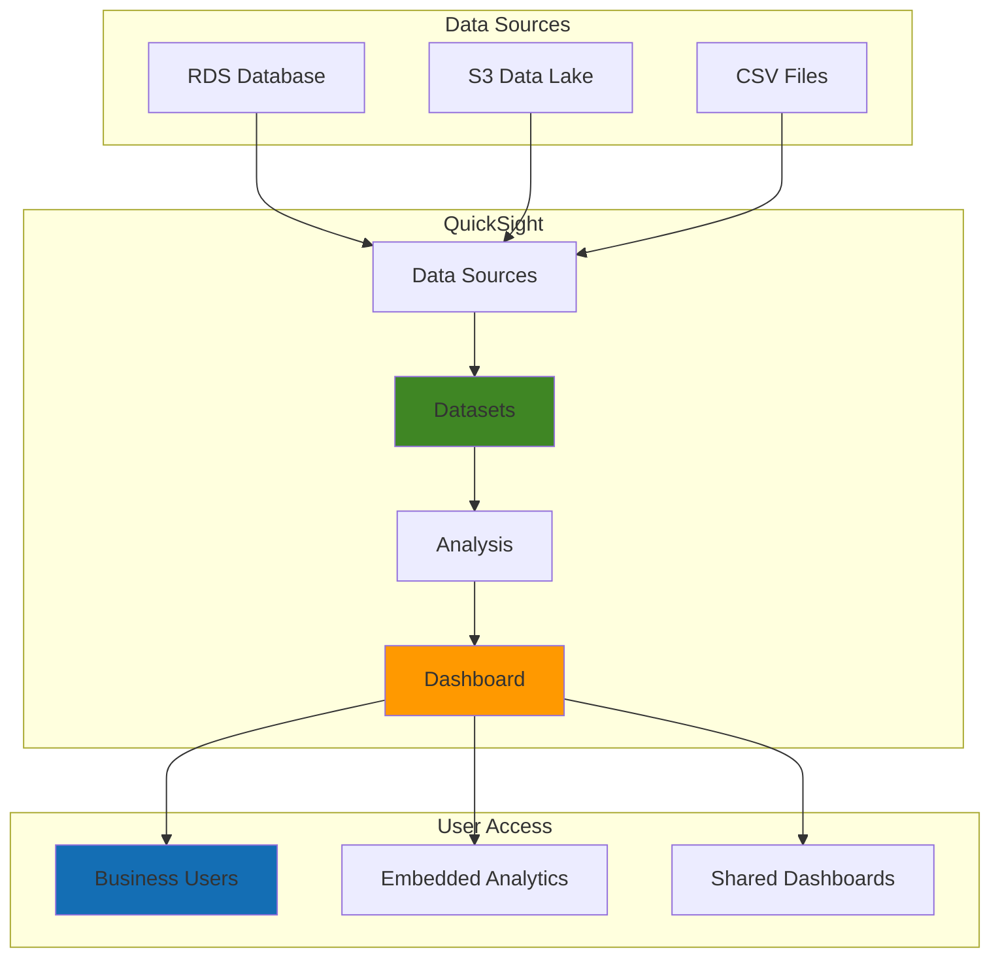

# Business Intelligence Solutions with QuickSight


## Problem

Organizations struggle with disparate data sources scattered across different systems, making it difficult to gain meaningful business insights. Traditional BI tools are often expensive, require complex infrastructure, and lack the scalability needed for modern data volumes. Business users need self-service analytics capabilities to make data-driven decisions without relying on IT teams for every report or dashboard request.

## Solution

Amazon QuickSight provides a scalable, serverless business intelligence service that connects to multiple data sources, enables rapid dashboard creation, and supports embedded analytics. This solution demonstrates how to build comprehensive BI dashboards with data connections, visualizations, and sharing capabilities while maintaining security and cost-effectiveness through pay-per-session pricing.

## Architecture Diagram



## Prerequisites

1. AWS account with QuickSight, S3, and RDS permissions
2. AWS CLI v2 installed and configured (or AWS CloudShell)
3. Basic understanding of SQL and data visualization concepts
4. Familiarity with AWS IAM roles and policies
5. Estimated cost: $24-48/month for QuickSight Standard + data source costs

> **Note**: QuickSight uses pay-per-session pricing for Standard edition ($24/month for first 4 users, then $5/session) and annual subscription for Enterprise edition ($18/month per user). For detailed pricing information, see the [Amazon QuickSight User Guide](https://docs.aws.amazon.com/quicksight/latest/user/welcome.html).

## Preparation

```bash
# Set environment variables
export AWS_REGION=$(aws configure get region)
export AWS_ACCOUNT_ID=$(aws sts get-caller-identity \
    --query Account --output text)

# Generate unique identifiers for resources
RANDOM_SUFFIX=$(aws secretsmanager get-random-password \
    --exclude-punctuation --exclude-uppercase \
    --password-length 6 --require-each-included-type \
    --output text --query RandomPassword)

export BUCKET_NAME="quicksight-bi-data-${RANDOM_SUFFIX}"
export DB_IDENTIFIER="quicksight-demo-db-${RANDOM_SUFFIX}"
export QUICKSIGHT_USER="quicksight-user-${RANDOM_SUFFIX}"

# Create S3 bucket for sample data
aws s3 mb s3://${BUCKET_NAME} --region ${AWS_REGION}

# Create sample CSV data for sales analytics
cat > sales_data.csv << 'EOF'
date,region,product,sales_amount,quantity,customer_segment
2024-01-15,North America,Product A,1200.50,25,Enterprise
2024-01-15,Europe,Product B,850.75,15,SMB
2024-01-16,Asia Pacific,Product A,2100.25,42,Enterprise
2024-01-16,North America,Product C,675.00,18,Consumer
2024-01-17,Europe,Product A,1450.80,29,Enterprise
2024-01-17,Asia Pacific,Product B,920.45,21,SMB
2024-01-18,North America,Product B,1100.30,22,SMB
2024-01-18,Europe,Product C,780.90,16,Consumer
2024-01-19,Asia Pacific,Product C,1350.60,35,Enterprise
2024-01-19,North America,Product A,1680.75,33,Enterprise
EOF

# Upload sample data to S3
aws s3 cp sales_data.csv s3://${BUCKET_NAME}/sales/
aws s3 cp sales_data.csv s3://${BUCKET_NAME}/sales/historical/

echo "✅ Preparation completed with bucket: ${BUCKET_NAME}"
```

## Steps

1. **Enable QuickSight Service**:

   Amazon QuickSight operates as a fully managed, serverless business intelligence service that eliminates the need for infrastructure provisioning or maintenance. Unlike traditional BI tools that require dedicated servers and complex licensing, QuickSight's cloud-native architecture automatically scales to handle varying workloads while providing consistent sub-second query performance through its SPICE (Super-fast, Parallel, In-memory Calculation Engine) technology.

   ```bash
   # Check if QuickSight is already enabled
   aws quicksight list-users --aws-account-id ${AWS_ACCOUNT_ID} \
       --namespace default --region ${AWS_REGION} \
       2>/dev/null || echo "QuickSight not enabled"
   
   # Note: QuickSight must be enabled via AWS Console first
   echo "⚠️  Enable QuickSight in AWS Console before continuing"
   echo "Navigate to: https://quicksight.aws.amazon.com/"
   echo "Choose Standard edition and complete setup"
   
   # Get QuickSight user ARN after enabling
   QUICKSIGHT_USER_ARN=$(aws quicksight list-users \
       --aws-account-id ${AWS_ACCOUNT_ID} \
       --namespace default --region ${AWS_REGION} \
       --query 'UserList[0].Arn' --output text)
   
   echo "✅ QuickSight user ARN: ${QUICKSIGHT_USER_ARN}"
   ```

   The service initialization establishes the foundation for your entire business intelligence ecosystem. QuickSight's pay-per-session pricing model makes it cost-effective for organizations with varying usage patterns, while the integrated security model ensures data access controls align with your organization's policies. This setup enables subsequent data source connections and dashboard creation capabilities.

2. **Create IAM Role for QuickSight S3 Access**:

   Secure data access in QuickSight relies on AWS IAM's principle of least privilege, enabling QuickSight to access only the specific data sources required for analytics while maintaining organizational security policies. This approach eliminates the need for hardcoded credentials and provides granular control over which datasets can be accessed by different user groups within your organization.

   ```bash
   # Create trust policy for QuickSight
   cat > quicksight-trust-policy.json << 'EOF'
   {
       "Version": "2012-10-17",
       "Statement": [
           {
               "Effect": "Allow",
               "Principal": {
                   "Service": "quicksight.amazonaws.com"
               },
               "Action": "sts:AssumeRole"
           }
       ]
   }
   EOF
   
   # Create IAM role
   aws iam create-role --role-name QuickSight-S3-Role \
       --assume-role-policy-document file://quicksight-trust-policy.json
   
   # Create S3 access policy
   cat > quicksight-s3-policy.json << EOF
   {
       "Version": "2012-10-17",
       "Statement": [
           {
               "Effect": "Allow",
               "Action": [
                   "s3:GetObject",
                   "s3:GetObjectVersion",
                   "s3:ListBucket"
               ],
               "Resource": [
                   "arn:aws:s3:::${BUCKET_NAME}",
                   "arn:aws:s3:::${BUCKET_NAME}/*"
               ]
           }
       ]
   }
   EOF
   
   # Attach policy to role
   aws iam put-role-policy --role-name QuickSight-S3-Role \
       --policy-name QuickSight-S3-Access \
       --policy-document file://quicksight-s3-policy.json
   
   echo "✅ IAM role created for QuickSight S3 access"
   ```

   This security configuration establishes a trusted relationship between QuickSight and your S3 data lake, enabling seamless data access while maintaining audit trails and access controls. The role-based approach supports compliance requirements and allows for easy permission management as your data sources expand.

3. **Create S3 Data Source in QuickSight**:

   Data sources in QuickSight serve as the connectivity layer between your analytics platform and various data repositories. S3 integration provides access to data lakes containing structured and semi-structured data from multiple business systems, enabling unified analytics across organizational silos. This connection method supports various file formats including CSV, JSON, and Parquet, making it ideal for modern data architectures where data is stored in cost-effective object storage.

   ```bash
   # Create S3 data source configuration
   cat > s3-data-source.json << EOF
   {
       "Name": "Sales-Data-S3",
       "Type": "S3",
       "DataSourceParameters": {
           "S3Parameters": {
               "ManifestFileLocation": {
                   "Bucket": "${BUCKET_NAME}",
                   "Key": "sales/sales_data.csv"
               }
           }
       }
   }
   EOF
   
   # Create the data source
   aws quicksight create-data-source \
       --aws-account-id ${AWS_ACCOUNT_ID} \
       --data-source-id sales-data-s3 \
       --cli-input-json file://s3-data-source.json \
       --region ${AWS_REGION}
   
   echo "✅ S3 data source created"
   ```

   The data source connection enables QuickSight to discover and catalog your S3-based datasets, providing the foundation for creating reusable datasets that can be shared across multiple analyses and dashboards. This approach promotes data consistency and reduces duplication in your analytics workflow.

4. **Create Sample RDS Database and Data Source**:

   Multi-source analytics capabilities represent one of QuickSight's key advantages, enabling organizations to combine data from operational databases, data warehouses, and data lakes into unified business intelligence solutions. RDS integration provides direct connectivity to transactional systems, supporting real-time analytics on operational data without requiring complex ETL processes or data movement.

   ```bash
   # Create RDS subnet group first
   aws rds create-db-subnet-group \
       --db-subnet-group-name quicksight-subnet-group \
       --db-subnet-group-description "Subnet group for QuickSight demo" \
       --subnet-ids $(aws ec2 describe-subnets \
           --query 'Subnets[0:2].SubnetId' --output text)
   
   # Create RDS MySQL instance
   aws rds create-db-instance \
       --db-instance-identifier ${DB_IDENTIFIER} \
       --db-instance-class db.t3.micro \
       --engine mysql \
       --master-username admin \
       --master-user-password TempPassword123! \
       --allocated-storage 20 \
       --db-subnet-group-name quicksight-subnet-group \
       --publicly-accessible \
       --region ${AWS_REGION}
   
   # Wait for RDS instance to be available
   echo "⏳ Waiting for RDS instance to be available..."
   aws rds wait db-instance-available \
       --db-instance-identifier ${DB_IDENTIFIER}
   
   # Get RDS endpoint
   RDS_ENDPOINT=$(aws rds describe-db-instances \
       --db-instance-identifier ${DB_IDENTIFIER} \
       --query 'DBInstances[0].Endpoint.Address' --output text)
   
   echo "✅ RDS instance created at: ${RDS_ENDPOINT}"
   ```

   This database connection establishes the foundation for real-time operational reporting, enabling business users to create dashboards that reflect current system state without impacting production performance. The combination of S3 and RDS data sources demonstrates how QuickSight supports hybrid analytics architectures common in modern enterprises.

5. **Create QuickSight Dataset from S3**:

   Datasets in QuickSight represent the data modeling layer where raw data is transformed into analytics-ready structures optimized for business intelligence workloads. The SPICE (Super-fast, Parallel, In-memory Calculation Engine) technology automatically optimizes data storage and indexing to deliver sub-second query performance, even on datasets containing millions of rows. This approach eliminates the need for pre-aggregated summary tables and enables ad-hoc exploration of detailed data.

   ```bash
   # Create dataset from S3 data source
   cat > dataset-s3.json << EOF
   {
       "Name": "Sales Analytics Dataset",
       "PhysicalTableMap": {
           "sales_table": {
               "S3Source": {
                   "DataSourceArn": "arn:aws:quicksight:${AWS_REGION}:${AWS_ACCOUNT_ID}:datasource/sales-data-s3",
                   "InputColumns": [
                       {"Name": "date", "Type": "STRING"},
                       {"Name": "region", "Type": "STRING"},
                       {"Name": "product", "Type": "STRING"},
                       {"Name": "sales_amount", "Type": "DECIMAL"},
                       {"Name": "quantity", "Type": "INTEGER"},
                       {"Name": "customer_segment", "Type": "STRING"}
                   ]
               }
           }
       },
       "LogicalTableMap": {
           "sales_logical": {
               "Alias": "Sales Data",
               "Source": {
                   "PhysicalTableId": "sales_table"
               },
               "DataTransforms": [
                   {
                       "CastColumnTypeOperation": {
                           "ColumnName": "date",
                           "NewColumnType": "DATETIME",
                           "Format": "yyyy-MM-dd"
                       }
                   }
               ]
           }
       }
   }
   EOF
   
   # Create the dataset
   aws quicksight create-data-set \
       --aws-account-id ${AWS_ACCOUNT_ID} \
       --data-set-id sales-dataset \
       --cli-input-json file://dataset-s3.json \
       --region ${AWS_REGION}
   
   echo "✅ QuickSight dataset created from S3"
   ```

   The dataset configuration includes data type optimization and transformation rules that improve query performance and ensure data consistency across all analyses. This reusable dataset can now serve multiple analyses and dashboards, promoting data governance and reducing redundant data processing across your organization.

6. **Create QuickSight Analysis**:

   Analyses in QuickSight provide the exploratory workspace where business users can create, modify, and experiment with visualizations before publishing them as dashboards. This distinction between analysis (authoring environment) and dashboard (consumption environment) enables collaborative development while maintaining published dashboard stability. The analysis environment supports drag-and-drop visual creation, calculated fields, and advanced filtering capabilities that empower business users to answer complex questions without requiring technical expertise.

   ```bash
   # Create analysis configuration
   cat > analysis-config.json << EOF
   {
       "Name": "Sales Performance Analysis",
       "Definition": {
           "DataSetIdentifierDeclarations": [
               {
                   "DataSetArn": "arn:aws:quicksight:${AWS_REGION}:${AWS_ACCOUNT_ID}:dataset/sales-dataset",
                   "Identifier": "sales_data"
               }
           ],
           "Sheets": [
               {
                   "SheetId": "sales_overview",
                   "Name": "Sales Overview",
                   "Visuals": [
                       {
                           "BarChartVisual": {
                               "VisualId": "sales_by_region",
                               "Title": {
                                   "Text": "Sales by Region"
                               },
                               "ChartConfiguration": {
                                   "FieldWells": {
                                       "BarChartAggregatedFieldWells": {
                                           "Category": [
                                               {
                                                   "CategoricalDimensionField": {
                                                       "FieldId": "region",
                                                       "Column": {
                                                           "DataSetIdentifier": "sales_data",
                                                           "ColumnName": "region"
                                                       }
                                                   }
                                               }
                                           ],
                                           "Values": [
                                               {
                                                   "NumericalMeasureField": {
                                                       "FieldId": "sales_amount",
                                                       "Column": {
                                                           "DataSetIdentifier": "sales_data",
                                                           "ColumnName": "sales_amount"
                                                       },
                                                       "AggregationFunction": {
                                                           "SimpleNumericalAggregation": "SUM"
                                                       }
                                                   }
                                               }
                                           ]
                                       }
                                   }
                               }
                           }
                       }
                   ]
               }
           ]
       }
   }
   EOF
   
   # Create the analysis
   aws quicksight create-analysis \
       --aws-account-id ${AWS_ACCOUNT_ID} \
       --analysis-id sales-analysis \
       --cli-input-json file://analysis-config.json \
       --region ${AWS_REGION}
   
   echo "✅ QuickSight analysis created"
   ```

   The analysis workspace now provides a foundation for iterative visualization development, enabling business analysts to explore data patterns and refine visual designs before sharing insights with broader stakeholder groups. This development environment supports version control and collaboration features essential for enterprise analytics workflows.

7. **Create Interactive Dashboard**:

   Dashboards in QuickSight serve as the primary consumption interface for business intelligence, providing interactive visualizations optimized for decision-making workflows. Unlike static reports, QuickSight dashboards enable real-time filtering, drill-down capabilities, and cross-visual interactions that allow users to explore data dynamically. The responsive design ensures dashboards function effectively across desktop and mobile platforms, supporting modern workforce mobility requirements.

   ```bash
   # Create dashboard from analysis
   cat > dashboard-config.json << EOF
   {
       "Name": "Sales Performance Dashboard",
       "DashboardId": "sales-dashboard",
       "Definition": {
           "DataSetIdentifierDeclarations": [
               {
                   "DataSetArn": "arn:aws:quicksight:${AWS_REGION}:${AWS_ACCOUNT_ID}:dataset/sales-dataset",
                   "Identifier": "sales_data"
               }
           ],
           "Sheets": [
               {
                   "SheetId": "dashboard_sheet",
                   "Name": "Sales Dashboard",
                   "Visuals": [
                       {
                           "BarChartVisual": {
                               "VisualId": "sales_by_region_chart",
                               "Title": {
                                   "Text": "Sales by Region"
                               }
                           }
                       },
                       {
                           "PieChartVisual": {
                               "VisualId": "sales_by_product_pie",
                               "Title": {
                                   "Text": "Sales Distribution by Product"
                               }
                           }
                       }
                   ]
               }
           ]
       }
   }
   EOF
   
   # Create the dashboard
   aws quicksight create-dashboard \
       --aws-account-id ${AWS_ACCOUNT_ID} \
       --dashboard-id sales-dashboard \
       --cli-input-json file://dashboard-config.json \
       --region ${AWS_REGION}
   
   echo "✅ Interactive dashboard created"
   ```

   The published dashboard provides controlled access to analytics insights while maintaining data security and governance policies. Dashboard versioning enables controlled updates to visualizations without disrupting ongoing business processes that depend on consistent reporting interfaces.

8. **Set Up Dashboard Sharing and Permissions**:

   QuickSight's sharing model enables secure collaboration while maintaining data governance through granular permission controls. The service supports both individual user permissions and group-based access, allowing administrators to efficiently manage dashboard access as organizations scale. Row-level security capabilities ensure users only see data relevant to their roles, maintaining compliance with data privacy regulations while enabling self-service analytics.

   ```bash
   # Create sharing permissions for dashboard
   cat > dashboard-permissions.json << EOF
   [
       {
           "Principal": "${QUICKSIGHT_USER_ARN}",
           "Actions": [
               "quicksight:DescribeDashboard",
               "quicksight:ListDashboardVersions",
               "quicksight:QueryDashboard"
           ]
       }
   ]
   EOF
   
   # Update dashboard permissions
   aws quicksight update-dashboard-permissions \
       --aws-account-id ${AWS_ACCOUNT_ID} \
       --dashboard-id sales-dashboard \
       --grant-permissions file://dashboard-permissions.json \
       --region ${AWS_REGION}
   
   # Publish dashboard
   aws quicksight update-dashboard-published-version \
       --aws-account-id ${AWS_ACCOUNT_ID} \
       --dashboard-id sales-dashboard \
       --version-number 1 \
       --region ${AWS_REGION}
   
   echo "✅ Dashboard permissions configured and published"
   ```

   The permission configuration establishes controlled access to analytics insights, enabling secure distribution of business intelligence across different organizational levels. This approach supports data democratization initiatives while maintaining necessary security and compliance boundaries.

9. **Enable Embedded Analytics**:

   Embedded analytics capabilities transform QuickSight from a standalone BI tool into an integrated component of custom applications, enabling organizations to provide analytics experiences directly within their existing software platforms. This approach eliminates context switching for end users while maintaining consistent branding and user experience across application portfolios. The embedded model supports both anonymous and authenticated access patterns, making it suitable for internal applications and customer-facing analytics scenarios.

   ```bash
   # Generate embed URL for dashboard
   EMBED_URL=$(aws quicksight generate-embed-url-for-anonymous-user \
       --aws-account-id ${AWS_ACCOUNT_ID} \
       --namespace default \
       --session-lifetime-in-minutes 60 \
       --authorized-resource-arns \
       "arn:aws:quicksight:${AWS_REGION}:${AWS_ACCOUNT_ID}:dashboard/sales-dashboard" \
       --experience-configuration \
       'DashboardVisual={InitialDashboardVisualId={DashboardId=sales-dashboard,SheetId=dashboard_sheet,VisualId=sales_by_region_chart}}' \
       --region ${AWS_REGION} \
       --query 'EmbedUrl' --output text)
   
   echo "✅ Embedded analytics URL generated"
   echo "Embed URL: ${EMBED_URL}"
   ```

   The generated embed URL provides secure, time-limited access to dashboard content that can be integrated into web applications, portals, or mobile applications. This capability enables organizations to deliver analytics as a native feature of their products, enhancing user engagement and decision-making capabilities without requiring separate BI tool training.

10. **Configure Scheduled Data Refresh**:

    Automated data refresh capabilities ensure that business intelligence dashboards reflect current business conditions without manual intervention, supporting real-time decision-making processes. QuickSight's SPICE refresh strategies balance data freshness requirements with performance optimization, enabling organizations to define refresh schedules that align with business cycles and data availability patterns. This automation reduces operational overhead while maintaining data consistency across analytics workflows.

    ```bash
    # Create refresh schedule for dataset
    cat > refresh-schedule.json << EOF
    {
        "ScheduleId": "daily-refresh",
        "RefreshType": "FULL_REFRESH",
        "StartAfterDateTime": "$(date -u -d '+1 day' +%Y-%m-%dT%H:%M:%S)Z",
        "ScheduleFrequency": {
            "Interval": "DAILY",
            "TimeOfTheDay": "06:00"
        }
    }
    EOF
    
    # Create refresh schedule
    aws quicksight create-refresh-schedule \
        --aws-account-id ${AWS_ACCOUNT_ID} \
        --data-set-id sales-dataset \
        --schedule file://refresh-schedule.json \
        --region ${AWS_REGION}
    
    echo "✅ Scheduled data refresh configured for daily at 6 AM UTC"
    ```

    The scheduled refresh configuration establishes a reliable data pipeline that maintains dashboard accuracy while optimizing resource utilization. This automation foundation supports enterprise-scale analytics operations where data freshness requirements must be balanced with system performance and cost considerations.

## Validation & Testing

1. **Verify Data Source Connection**:

   ```bash
   # Check data source status
   aws quicksight describe-data-source \
       --aws-account-id ${AWS_ACCOUNT_ID} \
       --data-source-id sales-data-s3 \
       --region ${AWS_REGION} \
       --query 'DataSource.Status'
   ```

   Expected output: `"CREATION_SUCCESSFUL"`

2. **Test Dataset Query**:

   ```bash
   # Preview dataset data
   aws quicksight get-data-set \
       --aws-account-id ${AWS_ACCOUNT_ID} \
       --data-set-id sales-dataset \
       --region ${AWS_REGION} \
       --query 'DataSet.Name'
   ```

   Expected output: `"Sales Analytics Dataset"`

3. **Verify Dashboard Creation**:

   ```bash
   # Check dashboard status
   aws quicksight describe-dashboard \
       --aws-account-id ${AWS_ACCOUNT_ID} \
       --dashboard-id sales-dashboard \
       --region ${AWS_REGION} \
       --query 'Dashboard.Version.Status'
   ```

   Expected output: `"CREATION_SUCCESSFUL"`

4. **Test Embedded Analytics URL**:

   ```bash
   # Generate new embed URL and test accessibility
   echo "Testing embed URL generation..."
   aws quicksight generate-embed-url-for-anonymous-user \
       --aws-account-id ${AWS_ACCOUNT_ID} \
       --namespace default \
       --session-lifetime-in-minutes 15 \
       --authorized-resource-arns \
       "arn:aws:quicksight:${AWS_REGION}:${AWS_ACCOUNT_ID}:dashboard/sales-dashboard" \
       --experience-configuration \
       'DashboardVisual={InitialDashboardVisualId={DashboardId=sales-dashboard,SheetId=dashboard_sheet,VisualId=sales_by_region_chart}}' \
       --region ${AWS_REGION} \
       --query 'EmbedUrl' --output text
   ```

## Cleanup

1. **Delete QuickSight Resources**:

   ```bash
   # Delete dashboard
   aws quicksight delete-dashboard \
       --aws-account-id ${AWS_ACCOUNT_ID} \
       --dashboard-id sales-dashboard \
       --region ${AWS_REGION}
   
   # Delete analysis
   aws quicksight delete-analysis \
       --aws-account-id ${AWS_ACCOUNT_ID} \
       --analysis-id sales-analysis \
       --region ${AWS_REGION}
   
   # Delete dataset
   aws quicksight delete-data-set \
       --aws-account-id ${AWS_ACCOUNT_ID} \
       --data-set-id sales-dataset \
       --region ${AWS_REGION}
   
   # Delete data source
   aws quicksight delete-data-source \
       --aws-account-id ${AWS_ACCOUNT_ID} \
       --data-source-id sales-data-s3 \
       --region ${AWS_REGION}
   
   echo "✅ QuickSight resources deleted"
   ```

2. **Remove RDS Instance**:

   ```bash
   # Delete RDS instance
   aws rds delete-db-instance \
       --db-instance-identifier ${DB_IDENTIFIER} \
       --skip-final-snapshot \
       --region ${AWS_REGION}
   
   # Delete subnet group
   aws rds delete-db-subnet-group \
       --db-subnet-group-name quicksight-subnet-group \
       --region ${AWS_REGION}
   
   echo "✅ RDS resources deleted"
   ```

3. **Clean up S3 and IAM Resources**:

   ```bash
   # Delete S3 bucket contents and bucket
   aws s3 rm s3://${BUCKET_NAME} --recursive
   aws s3 rb s3://${BUCKET_NAME}
   
   # Delete IAM role and policy
   aws iam delete-role-policy \
       --role-name QuickSight-S3-Role \
       --policy-name QuickSight-S3-Access
   
   aws iam delete-role --role-name QuickSight-S3-Role
   
   # Remove local files
   rm -f sales_data.csv quicksight-trust-policy.json \
         quicksight-s3-policy.json s3-data-source.json \
         dataset-s3.json analysis-config.json \
         dashboard-config.json dashboard-permissions.json \
         refresh-schedule.json
   
   echo "✅ All resources cleaned up"
   ```

## Discussion

Amazon QuickSight represents a paradigm shift in business intelligence by providing a serverless, pay-per-session model that eliminates the need for complex infrastructure management. The service integrates seamlessly with AWS data services like S3, RDS, and Redshift, enabling organizations to build comprehensive analytics solutions without the overhead of traditional BI tools. The architecture demonstrated here shows how to connect multiple data sources, create interactive visualizations, and enable self-service analytics for business users.

The embedded analytics capability is particularly powerful for SaaS applications, allowing developers to integrate dashboards directly into their applications without requiring users to access a separate BI tool. QuickSight's SPICE (Super-fast, Parallel, In-memory Calculation Engine) provides sub-second query performance on large datasets, while the automatic scaling ensures consistent performance as data volumes grow. The pay-per-session pricing model makes it cost-effective for organizations with sporadic usage patterns.

Security is built into QuickSight through integration with AWS IAM, enabling fine-grained access controls and secure data sharing. The service supports row-level security, allowing administrators to ensure users only see data relevant to their roles. Additionally, QuickSight's ML-powered insights can automatically detect anomalies and provide natural language narratives about data trends, reducing the burden on analysts to manually identify patterns.

> **Tip**: Use QuickSight's calculated fields and parameters to create dynamic dashboards that allow users to explore data interactively without creating multiple static reports. Learn more about advanced features in the [QuickSight Embedded Analytics documentation](https://docs.aws.amazon.com/quicksight/latest/user/embedded-analytics.html).

> **Warning**: SPICE capacity is limited by your QuickSight edition and region. Monitor your [SPICE usage](https://docs.aws.amazon.com/quicksight/latest/user/managing-spice-capacity.html) to avoid performance impacts as datasets grow larger.

## Challenge

Extend this solution by implementing these enhancements:

1. **Real-time Analytics**: Connect QuickSight to Amazon Kinesis Data Streams for real-time dashboard updates with streaming data from IoT devices or web applications.

2. **Advanced ML Insights**: Implement QuickSight's ML-powered features including forecasting, anomaly detection, and auto-narratives to provide predictive analytics and automated insights.

3. **Multi-tenant SaaS Analytics**: Build a multi-tenant analytics solution using QuickSight's embedded analytics with row-level security to serve different customers from the same dataset.

4. **Cross-account Data Sharing**: Set up cross-account data sharing using QuickSight datasets to enable analytics across multiple AWS accounts while maintaining security boundaries.

5. **Custom Visualizations**: Develop custom visualizations using QuickSight's custom visual SDK to create specialized charts for specific business requirements not covered by standard visualizations.

## Infrastructure Code

*Infrastructure code will be generated after recipe approval.*