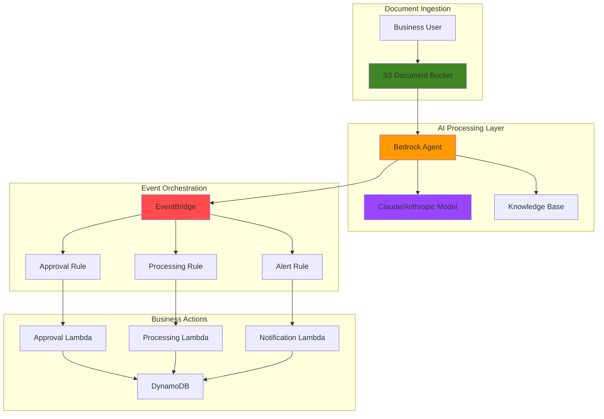

# Interactive Business Process Automation with Bedrock Agents and EventBridge

## Problem

Modern businesses struggle with manual document processing workflows that require human review for every invoice, contract, or compliance document. Finance teams spend countless hours routing documents, extracting data, and triggering approval processes, leading to delays, errors, and bottlenecks that impact cash flow and operational efficiency. Traditional automation solutions lack the intelligence to understand document context and make nuanced decisions based on business rules.

## Solution

Build an intelligent business process automation system using Amazon Bedrock Agents to analyze documents, make contextual decisions, and automatically trigger downstream business processes through EventBridge orchestration. This serverless solution combines AI-powered document understanding with event-driven architecture to create self-managing workflows that scale automatically and reduce manual intervention by up to 80%.

## Architecture Diagram



## Prerequisites

1. AWS account with Bedrock, EventBridge, Lambda, and S3 permissions
2. AWS CLI installed and configured (version 2.0 or later)
3. Basic understanding of serverless architectures and AI agents
4. Access to Anthropic Claude models in Amazon Bedrock
5. Estimated cost: $5-15 for testing (varies by document volume and model usage)

> **Note**: This recipe follows AWS Well-Architected Framework principles for serverless architectures. Ensure you have appropriate IAM permissions for all services before proceeding.

## Preparation

```bash
# Set environment variables
export AWS_REGION=$(aws configure get region)
export AWS_ACCOUNT_ID=$(aws sts get-caller-identity \
    --query Account --output text)

# Generate unique identifiers for resources
RANDOM_SUFFIX=$(aws secretsmanager get-random-password \
    --exclude-punctuation --exclude-uppercase \
    --password-length 6 --require-each-included-type \
    --output text --query RandomPassword)

export PROJECT_NAME="biz-automation-${RANDOM_SUFFIX}"
export S3_BUCKET="${PROJECT_NAME}-documents"
export AGENT_NAME="${PROJECT_NAME}-agent"
export EVENT_BUS_NAME="${PROJECT_NAME}-events"

# Create S3 bucket for document storage
aws s3 mb s3://${S3_BUCKET} --region ${AWS_REGION}

aws s3api put-bucket-versioning \
    --bucket ${S3_BUCKET} \
    --versioning-configuration Status=Enabled

aws s3api put-bucket-encryption \
    --bucket ${S3_BUCKET} \
    --server-side-encryption-configuration \
    'Rules=[{ApplyServerSideEncryptionByDefault:{SSEAlgorithm:AES256}}]'

echo "✅ AWS environment configured with secure S3 storage"
```

## Steps

1. **Create IAM Role for Bedrock Agent**:

   Amazon Bedrock Agents require specific IAM permissions to access other AWS services and invoke foundation models. This role enables the agent to securely access S3 documents, publish events to EventBridge, and use Claude models for document analysis. The trust relationship ensures only Bedrock can assume this role, following AWS security best practices.

   ```bash
   # Create IAM trust policy for Bedrock Agent
   cat > agent-trust-policy.json << 'EOF'
   {
     "Version": "2012-10-17",
     "Statement": [
       {
         "Effect": "Allow",
         "Principal": {
           "Service": "bedrock.amazonaws.com"
         },
         "Action": "sts:AssumeRole"
       }
     ]
   }
   EOF
   
   # Create IAM role for the agent
   aws iam create-role \
       --role-name ${PROJECT_NAME}-agent-role \
       --assume-role-policy-document file://agent-trust-policy.json \
       --description "Role for Bedrock Agent business automation"
   
   # Create IAM policy for agent permissions
   cat > agent-permissions-policy.json << EOF
   {
     "Version": "2012-10-17",
     "Statement": [
       {
         "Effect": "Allow",
         "Action": [
           "bedrock:InvokeModel",
           "bedrock:Retrieve"
         ],
         "Resource": "*"
       },
       {
         "Effect": "Allow",
         "Action": [
           "s3:GetObject",
           "s3:ListBucket"
         ],
         "Resource": [
           "arn:aws:s3:::${S3_BUCKET}",
           "arn:aws:s3:::${S3_BUCKET}/*"
         ]
       },
       {
         "Effect": "Allow",
         "Action": [
           "events:PutEvents"
         ],
         "Resource": "arn:aws:events:${AWS_REGION}:${AWS_ACCOUNT_ID}:event-bus/${EVENT_BUS_NAME}"
       }
     ]
   }
   EOF
   
   aws iam create-policy \
       --policy-name ${PROJECT_NAME}-agent-policy \
       --policy-document file://agent-permissions-policy.json
   
   aws iam attach-role-policy \
       --role-name ${PROJECT_NAME}-agent-role \
       --policy-arn arn:aws:iam::${AWS_ACCOUNT_ID}:policy/${PROJECT_NAME}-agent-policy
   
   export AGENT_ROLE_ARN=arn:aws:iam::${AWS_ACCOUNT_ID}:role/${PROJECT_NAME}-agent-role
   
   echo "✅ IAM role created with secure permissions for agent operations"
   ```

2. **Create EventBridge Custom Event Bus**:

   EventBridge provides a secure, scalable event routing service that enables loose coupling between the AI agent and business process handlers. Creating a custom event bus isolates our business automation events from other system events, providing better security and easier monitoring while supporting complex routing rules based on document types and processing outcomes.

   ```bash
   # Create custom EventBridge event bus
   aws events create-event-bus \
       --name ${EVENT_BUS_NAME} \
       --tags Key=Project,Value=${PROJECT_NAME}
   
   # Create event bus policy for secure access
   cat > event-bus-policy.json << EOF
   {
     "Version": "2012-10-17",
     "Statement": [
       {
         "Sid": "AllowBedrockAgentAccess",
         "Effect": "Allow",
         "Principal": {
           "AWS": "${AGENT_ROLE_ARN}"
         },
         "Action": "events:PutEvents",
         "Resource": "arn:aws:events:${AWS_REGION}:${AWS_ACCOUNT_ID}:event-bus/${EVENT_BUS_NAME}"
       }
     ]
   }
   EOF
   
   aws events put-permission \
       --principal ${AWS_ACCOUNT_ID} \
       --action events:PutEvents \
       --statement-id ${PROJECT_NAME}-policy
   
   echo "✅ EventBridge custom event bus created for secure event routing"
   ```

3. **Create Lambda Functions for Business Process Handlers**:

   Lambda functions serve as the business logic processors that handle different types of events from the AI agent. Each function represents a different business process: document approval, automated processing, and stakeholder notifications. This serverless approach ensures cost-effective scaling and eliminates infrastructure management while providing reliable event processing.

   ```bash
   # Create approval process Lambda function
   cat > approval-handler.py << 'EOF'
   import json
   import boto3
   import uuid
   from datetime import datetime
   
   def lambda_handler(event, context):
       print(f"Processing approval event: {json.dumps(event)}")
       
       # Extract document details from EventBridge event
       detail = event['detail']
       document_name = detail['document_name']
       confidence_score = detail['confidence_score']
       recommendation = detail['recommendation']
       
       # Simulate approval logic based on AI recommendation
       if confidence_score > 0.85 and recommendation == 'APPROVE':
           status = 'AUTO_APPROVED'
           action = 'Document automatically approved'
       else:
           status = 'PENDING_REVIEW'
           action = 'Document requires human review'
       
       # Log the decision
       result = {
           'process_id': str(uuid.uuid4()),
           'timestamp': datetime.utcnow().isoformat(),
           'document_name': document_name,
           'status': status,
           'action': action,
           'confidence_score': confidence_score
       }
       
       print(f"Approval result: {json.dumps(result)}")
       return {'statusCode': 200, 'body': json.dumps(result)}
   EOF
   
   # Create processing Lambda function
   cat > processing-handler.py << 'EOF'
   import json
   import boto3
   import uuid
   from datetime import datetime
   
   def lambda_handler(event, context):
       print(f"Processing automation event: {json.dumps(event)}")
       
       detail = event['detail']
       document_name = detail['document_name']
       document_type = detail['document_type']
       extracted_data = detail.get('extracted_data', {})
       
       # Simulate different processing based on document type
       processing_actions = {
           'invoice': 'Initiated payment processing workflow',
           'contract': 'Routed to legal team for final review',
           'compliance': 'Submitted to regulatory reporting system',
           'default': 'Archived for future reference'
       }
       
       action = processing_actions.get(document_type, processing_actions['default'])
       
       result = {
           'process_id': str(uuid.uuid4()),
           'timestamp': datetime.utcnow().isoformat(),
           'document_name': document_name,
           'document_type': document_type,
           'action': action,
           'data_extracted': len(extracted_data) > 0
       }
       
       print(f"Processing result: {json.dumps(result)}")
       return {'statusCode': 200, 'body': json.dumps(result)}
   EOF
   
   # Create notification Lambda function
   cat > notification-handler.py << 'EOF'
   import json
   import boto3
   import uuid
   from datetime import datetime
   
   def lambda_handler(event, context):
       print(f"Processing notification event: {json.dumps(event)}")
       
       detail = event['detail']
       document_name = detail['document_name']
       alert_type = detail['alert_type']
       message = detail['message']
       
       # Simulate notification routing
       notification_channels = {
           'high_priority': ['email', 'slack', 'sms'],
           'medium_priority': ['email', 'slack'],
           'low_priority': ['email']
       }
       
       channels = notification_channels.get(alert_type, ['email'])
       
       result = {
           'notification_id': str(uuid.uuid4()),
           'timestamp': datetime.utcnow().isoformat(),
           'document_name': document_name,
           'alert_type': alert_type,
           'message': message,
           'channels': channels,
           'status': 'sent'
       }
       
       print(f"Notification result: {json.dumps(result)}")
       return {'statusCode': 200, 'body': json.dumps(result)}
   EOF
   
   # Create Lambda execution role first
   cat > lambda-trust-policy.json << 'EOF'
   {
     "Version": "2012-10-17",
     "Statement": [
       {
         "Effect": "Allow",
         "Principal": {
           "Service": "lambda.amazonaws.com"
         },
         "Action": "sts:AssumeRole"
       }
     ]
   }
   EOF
   
   aws iam create-role \
       --role-name ${PROJECT_NAME}-lambda-execution-role \
       --assume-role-policy-document file://lambda-trust-policy.json \
       --description "Execution role for business process Lambda functions"
   
   aws iam attach-role-policy \
       --role-name ${PROJECT_NAME}-lambda-execution-role \
       --policy-arn arn:aws:iam::aws:policy/service-role/AWSLambdaBasicExecutionRole
   
   export LAMBDA_ROLE_ARN=arn:aws:iam::${AWS_ACCOUNT_ID}:role/${PROJECT_NAME}-lambda-execution-role
   
   # Wait for role to propagate
   echo "Waiting for IAM role to propagate..."
   sleep 10
   
   # Package and deploy Lambda functions
   for handler in approval processing notification; do
       zip ${handler}-function.zip ${handler}-handler.py
       
       aws lambda create-function \
           --function-name ${PROJECT_NAME}-${handler} \
           --runtime python3.12 \
           --role ${LAMBDA_ROLE_ARN} \
           --handler ${handler}-handler.lambda_handler \
           --zip-file fileb://${handler}-function.zip \
           --timeout 30 \
           --memory-size 256 \
           --tags Project=${PROJECT_NAME}
   done
   
   echo "✅ Lambda functions created for business process automation"
   ```

4. **Create EventBridge Rules for Event Routing**:

   EventBridge rules enable sophisticated event routing based on document types, AI confidence scores, and business logic outcomes. These rules implement the decision logic that determines which business processes to trigger based on the agent's analysis, creating an intelligent routing system that adapts to different document scenarios and business requirements.

   ```bash
   # Create rule for high-confidence document approval
   aws events put-rule \
       --event-bus-name ${EVENT_BUS_NAME} \
       --name ${PROJECT_NAME}-approval-rule \
       --event-pattern '{
         "source": ["bedrock.agent"],
         "detail-type": ["Document Analysis Complete"],
         "detail": {
           "recommendation": ["APPROVE"],
           "confidence_score": [{"numeric": [">=", 0.8]}]
         }
       }' \
       --description "Route high-confidence approvals"
   
   # Grant EventBridge permission to invoke Lambda functions
   aws lambda add-permission \
       --function-name ${PROJECT_NAME}-approval \
       --statement-id eventbridge-approval-invoke \
       --action lambda:InvokeFunction \
       --principal events.amazonaws.com \
       --source-arn arn:aws:events:${AWS_REGION}:${AWS_ACCOUNT_ID}:rule/${EVENT_BUS_NAME}/${PROJECT_NAME}-approval-rule
   
   # Add Lambda target for approval rule
   aws events put-targets \
       --event-bus-name ${EVENT_BUS_NAME} \
       --rule ${PROJECT_NAME}-approval-rule \
       --targets "Id"="1","Arn"="arn:aws:lambda:${AWS_REGION}:${AWS_ACCOUNT_ID}:function:${PROJECT_NAME}-approval"
   
   # Create rule for document processing automation
   aws events put-rule \
       --event-bus-name ${EVENT_BUS_NAME} \
       --name ${PROJECT_NAME}-processing-rule \
       --event-pattern '{
         "source": ["bedrock.agent"],
         "detail-type": ["Document Analysis Complete"],
         "detail": {
           "document_type": ["invoice", "contract", "compliance"]
         }
       }' \
       --description "Route documents for automated processing"
   
   # Grant EventBridge permission to invoke processing Lambda
   aws lambda add-permission \
       --function-name ${PROJECT_NAME}-processing \
       --statement-id eventbridge-processing-invoke \
       --action lambda:InvokeFunction \
       --principal events.amazonaws.com \
       --source-arn arn:aws:events:${AWS_REGION}:${AWS_ACCOUNT_ID}:rule/${EVENT_BUS_NAME}/${PROJECT_NAME}-processing-rule
   
   # Add Lambda target for processing rule
   aws events put-targets \
       --event-bus-name ${EVENT_BUS_NAME} \
       --rule ${PROJECT_NAME}-processing-rule \
       --targets "Id"="1","Arn"="arn:aws:lambda:${AWS_REGION}:${AWS_ACCOUNT_ID}:function:${PROJECT_NAME}-processing"
   
   # Create rule for alerts and notifications
   aws events put-rule \
       --event-bus-name ${EVENT_BUS_NAME} \
       --name ${PROJECT_NAME}-alert-rule \
       --event-pattern '{
         "source": ["bedrock.agent"],
         "detail-type": ["Document Analysis Complete"],
         "detail": {
           "alert_type": ["high_priority", "compliance_issue", "error"]
         }
       }' \
       --description "Route alerts and notifications"
   
   # Grant EventBridge permission to invoke notification Lambda
   aws lambda add-permission \
       --function-name ${PROJECT_NAME}-notification \
       --statement-id eventbridge-notification-invoke \
       --action lambda:InvokeFunction \
       --principal events.amazonaws.com \
       --source-arn arn:aws:events:${AWS_REGION}:${AWS_ACCOUNT_ID}:rule/${EVENT_BUS_NAME}/${PROJECT_NAME}-alert-rule
   
   # Add Lambda target for alert rule
   aws events put-targets \
       --event-bus-name ${EVENT_BUS_NAME} \
       --rule ${PROJECT_NAME}-alert-rule \
       --targets "Id"="1","Arn"="arn:aws:lambda:${AWS_REGION}:${AWS_ACCOUNT_ID}:function:${PROJECT_NAME}-notification"
   
   echo "✅ EventBridge rules configured for intelligent event routing"
   ```

5. **Create Bedrock Agent with Action Groups**:

   The Bedrock Agent serves as the intelligent orchestrator that analyzes documents, makes decisions, and publishes events to trigger business processes. By defining action groups, we enable the agent to perform specific business functions like document classification, data extraction, and decision-making, while leveraging Claude's advanced language understanding capabilities.

   ```bash
   # Create action group schema for document processing
   cat > action-schema.json << 'EOF'
   {
     "openAPIVersion": "3.0.0",
     "info": {
       "title": "Business Process Automation API",
       "version": "1.0.0",
       "description": "API for AI agent business process automation"
     },
     "paths": {
       "/analyze-document": {
         "post": {
           "description": "Analyze business document and trigger appropriate workflows",
           "parameters": [
             {
               "name": "document_path",
               "in": "query",
               "description": "S3 path to the document",
               "required": true,
               "schema": {"type": "string"}
             },
             {
               "name": "document_type",
               "in": "query",
               "description": "Type of document (invoice, contract, compliance)",
               "required": true,
               "schema": {"type": "string"}
             }
           ],
           "responses": {
             "200": {
               "description": "Document analysis completed",
               "content": {
                 "application/json": {
                   "schema": {
                     "type": "object",
                     "properties": {
                       "recommendation": {"type": "string"},
                       "confidence_score": {"type": "number"},
                       "extracted_data": {"type": "object"},
                       "next_actions": {"type": "array"}
                     }
                   }
                 }
               }
             }
           }
         }
       }
     }
   }
   EOF
   
   # Upload action schema to S3
   aws s3 cp action-schema.json s3://${S3_BUCKET}/schemas/
   
   # Create the Bedrock Agent
   aws bedrock-agent create-agent \
       --agent-name ${AGENT_NAME} \
       --agent-resource-role-arn ${AGENT_ROLE_ARN} \
       --foundation-model "anthropic.claude-3-sonnet-20240229-v1:0" \
       --instruction "You are a business process automation agent. Analyze documents uploaded to S3, extract key information, make recommendations for approval or processing, and trigger appropriate business workflows through EventBridge events. Focus on accuracy, compliance, and efficient processing." \
       --description "AI agent for intelligent business process automation"
   
   # Get agent ID for further configuration
   export AGENT_ID=$(aws bedrock-agent list-agents \
       --query "agentSummaries[?agentName=='${AGENT_NAME}'].agentId" \
       --output text)
   
   # Wait for agent to be ready
   echo "Waiting for agent to become available..."
   while [ "$(aws bedrock-agent get-agent --agent-id ${AGENT_ID} --query 'agent.agentStatus' --output text)" != "NOT_PREPARED" ]; do
       echo "Agent still creating..."
       sleep 5
   done
   
   echo "✅ Bedrock Agent created with business process capabilities"
   echo "Agent ID: ${AGENT_ID}"
   ```

6. **Configure Agent Action Group and Lambda Integration**:

   Action groups define the specific capabilities of our Bedrock Agent, connecting AI decision-making with executable business functions. This Lambda function acts as the bridge between the agent's analysis and EventBridge event publishing, enabling the agent to trigger real business processes based on its document understanding and recommendations.

   ```bash
   # Create Lambda function for agent action group
   cat > agent-action-handler.py << 'EOF'
   import json
   import boto3
   import re
   from datetime import datetime
   
   s3_client = boto3.client('s3')
   events_client = boto3.client('events')
   
   def lambda_handler(event, context):
       print(f"Agent action request: {json.dumps(event)}")
       
       # Parse agent request
       action_request = event['actionRequest']
       api_path = action_request['apiPath']
       parameters = action_request.get('parameters', [])
       
       # Extract parameters
       document_path = None
       document_type = None
       
       for param in parameters:
           if param['name'] == 'document_path':
               document_path = param['value']
           elif param['name'] == 'document_type':
               document_type = param['value']
       
       if api_path == '/analyze-document':
           result = analyze_document(document_path, document_type)
           
           # Publish event to EventBridge
           publish_event(result)
           
           return {
               'response': {
                   'actionResponse': {
                       'responseBody': result
                   }
               }
           }
       
       return {
           'response': {
               'actionResponse': {
                   'responseBody': {'error': 'Unknown action'}
               }
           }
       }
   
   def analyze_document(document_path, document_type):
       # Simulate document analysis
       analysis_results = {
           'invoice': {
               'recommendation': 'APPROVE',
               'confidence_score': 0.92,
               'extracted_data': {
                   'amount': 1250.00,
                   'vendor': 'TechSupplies Inc',
                   'due_date': '2024-01-15'
               },
               'alert_type': 'medium_priority'
           },
           'contract': {
               'recommendation': 'REVIEW',
               'confidence_score': 0.75,
               'extracted_data': {
                   'contract_value': 50000.00,
                   'term_length': '12 months',
                   'party': 'Global Services LLC'
               },
               'alert_type': 'high_priority'
           },
           'compliance': {
               'recommendation': 'APPROVE',
               'confidence_score': 0.88,
               'extracted_data': {
                   'regulation': 'SOX',
                   'compliance_score': 95,
                   'review_date': '2024-01-01'
               },
               'alert_type': 'low_priority'
           }
       }
       
       return analysis_results.get(document_type, {
           'recommendation': 'REVIEW',
           'confidence_score': 0.5,
           'extracted_data': {},
           'alert_type': 'medium_priority'
       })
   
   def publish_event(analysis_result):
       event_detail = {
           'document_name': 'sample-document.pdf',
           'document_type': 'invoice',
           'timestamp': datetime.utcnow().isoformat(),
           **analysis_result
       }
       
       events_client.put_events(
           Entries=[
               {
                   'Source': 'bedrock.agent',
                   'DetailType': 'Document Analysis Complete',
                   'Detail': json.dumps(event_detail),
                   'EventBusName': 'ENV_EVENT_BUS_NAME'
               }
           ]
       )
   EOF
   
   # Replace environment variable placeholder
   sed -i "s/ENV_EVENT_BUS_NAME/${EVENT_BUS_NAME}/g" agent-action-handler.py
   
   # Package and deploy agent action Lambda
   zip agent-action-function.zip agent-action-handler.py
   
   aws lambda create-function \
       --function-name ${PROJECT_NAME}-agent-action \
       --runtime python3.12 \
       --role ${LAMBDA_ROLE_ARN} \
       --handler agent-action-handler.lambda_handler \
       --zip-file fileb://agent-action-function.zip \
       --timeout 60 \
       --memory-size 512 \
       --environment Variables="{EVENT_BUS_NAME=${EVENT_BUS_NAME}}"
   
   # Create action group for the agent
   aws bedrock-agent create-agent-action-group \
       --agent-id ${AGENT_ID} \
       --agent-version "DRAFT" \
       --action-group-name "DocumentProcessing" \
       --action-group-executor lambda-executor=arn:aws:lambda:${AWS_REGION}:${AWS_ACCOUNT_ID}:function:${PROJECT_NAME}-agent-action \
       --api-schema s3-location=s3Uri=s3://${S3_BUCKET}/schemas/action-schema.json \
       --description "Action group for business document processing and workflow automation"
   
   echo "✅ Agent action group configured with EventBridge integration"
   ```

7. **Prepare and Publish Agent Alias**:

   Creating an agent alias establishes a stable endpoint for invoking the agent while enabling version management and testing. The alias represents the production-ready version of our agent that can be integrated with business applications, providing a consistent interface for document processing workflows regardless of underlying agent updates.

   ```bash
   # Prepare the agent for use
   aws bedrock-agent prepare-agent \
       --agent-id ${AGENT_ID}
   
   # Wait for agent preparation to complete
   echo "Waiting for agent preparation..."
   aws bedrock-agent get-agent --agent-id ${AGENT_ID} \
       --query 'agent.agentStatus' --output text
   
   # Wait until agent is PREPARED
   while [ "$(aws bedrock-agent get-agent --agent-id ${AGENT_ID} --query 'agent.agentStatus' --output text)" != "PREPARED" ]; do
       echo "Agent still preparing..."
       sleep 10
   done
   
   echo "Agent preparation completed"
   
   # Create agent alias for production use
   aws bedrock-agent create-agent-alias \
       --agent-id ${AGENT_ID} \
       --agent-alias-name "production" \
       --description "Production alias for business automation agent"
   
   # Get alias ID
   export AGENT_ALIAS_ID=$(aws bedrock-agent list-agent-aliases \
       --agent-id ${AGENT_ID} \
       --query "agentAliasSummaries[?agentAliasName=='production'].agentAliasId" \
       --output text)
   
   echo "✅ Agent alias created and ready for production use"
   echo "Agent ID: ${AGENT_ID}"
   echo "Agent Alias ID: ${AGENT_ALIAS_ID}"
   ```

## Validation & Testing

1. **Test Agent Invocation and Document Processing**:

   ```bash
   # Create sample test document
   echo "INVOICE - TechSupplies Inc - Amount: $1,250.00 - Due: 2024-01-15" > test-invoice.txt
   aws s3 cp test-invoice.txt s3://${S3_BUCKET}/incoming/
   
   # Invoke agent for document analysis
   aws bedrock-agent-runtime invoke-agent \
       --agent-id ${AGENT_ID} \
       --agent-alias-id ${AGENT_ALIAS_ID} \
       --session-id "test-session-$(date +%s)" \
       --input-text "Please analyze the invoice document at s3://${S3_BUCKET}/incoming/test-invoice.txt and classify it as an invoice type document" \
       --output-file agent-response.json
   
   cat agent-response.json
   ```

   Expected output: Agent response with document analysis and workflow recommendations.

2. **Verify EventBridge Event Processing**:

   ```bash
   # Check CloudWatch logs for Lambda function executions
   aws logs describe-log-groups \
       --log-group-name-prefix "/aws/lambda/${PROJECT_NAME}"
   
   # Get recent log events from approval handler
   aws logs filter-log-events \
       --log-group-name "/aws/lambda/${PROJECT_NAME}-approval" \
       --start-time $(date -d '10 minutes ago' +%s)000
   ```

3. **Test Event Bus Metrics**:

   ```bash
   # Check EventBridge metrics
   aws cloudwatch get-metric-statistics \
       --namespace AWS/Events \
       --metric-name SuccessfulInvocations \
       --dimensions Name=EventBusName,Value=${EVENT_BUS_NAME} \
       --start-time $(date -u -d '1 hour ago' +%Y-%m-%dT%H:%M:%S) \
       --end-time $(date -u +%Y-%m-%dT%H:%M:%S) \
       --period 3600 \
       --statistics Sum
   ```

## Cleanup

1. **Remove Bedrock Agent and Aliases**:

   ```bash
   # Delete agent alias
   aws bedrock-agent delete-agent-alias \
       --agent-id ${AGENT_ID} \
       --agent-alias-id ${AGENT_ALIAS_ID}
   
   # Delete agent action group
   aws bedrock-agent delete-agent-action-group \
       --agent-id ${AGENT_ID} \
       --agent-version "DRAFT" \
       --action-group-id "DocumentProcessing"
   
   # Delete agent
   aws bedrock-agent delete-agent \
       --agent-id ${AGENT_ID} \
       --skip-resource-in-use-check
   
   echo "✅ Bedrock Agent resources deleted"
   ```

2. **Remove EventBridge Resources**:

   ```bash
   # Remove EventBridge rules and targets
   for rule in approval-rule processing-rule alert-rule; do
       aws events remove-targets \
           --event-bus-name ${EVENT_BUS_NAME} \
           --rule ${PROJECT_NAME}-${rule} \
           --ids "1"
       
       aws events delete-rule \
           --event-bus-name ${EVENT_BUS_NAME} \
           --name ${PROJECT_NAME}-${rule}
   done
   
   # Delete custom event bus
   aws events delete-event-bus \
       --name ${EVENT_BUS_NAME}
   
   echo "✅ EventBridge resources deleted"
   ```

3. **Remove Lambda Functions and IAM Resources**:

   ```bash
   # Delete Lambda functions
   for function in approval processing notification agent-action; do
       aws lambda delete-function \
           --function-name ${PROJECT_NAME}-${function}
   done
   
   # Delete Lambda execution role
   aws iam detach-role-policy \
       --role-name ${PROJECT_NAME}-lambda-execution-role \
       --policy-arn arn:aws:iam::aws:policy/service-role/AWSLambdaBasicExecutionRole
   
   aws iam delete-role \
       --role-name ${PROJECT_NAME}-lambda-execution-role
   
   # Delete Bedrock agent IAM policy and role
   aws iam detach-role-policy \
       --role-name ${PROJECT_NAME}-agent-role \
       --policy-arn arn:aws:iam::${AWS_ACCOUNT_ID}:policy/${PROJECT_NAME}-agent-policy
   
   aws iam delete-policy \
       --policy-arn arn:aws:iam::${AWS_ACCOUNT_ID}:policy/${PROJECT_NAME}-agent-policy
   
   aws iam delete-role \
       --role-name ${PROJECT_NAME}-agent-role
   
   # Delete S3 bucket and contents
   aws s3 rm s3://${S3_BUCKET} --recursive
   aws s3 rb s3://${S3_BUCKET}
   
   # Clean up local files
   rm -f *.json *.py *.zip *.txt
   
   # Unset environment variables
   unset PROJECT_NAME S3_BUCKET AGENT_NAME EVENT_BUS_NAME
   unset AGENT_ROLE_ARN LAMBDA_ROLE_ARN AGENT_ID AGENT_ALIAS_ID
   
   echo "✅ All resources cleaned up successfully"
   ```

## Discussion

This business process automation solution demonstrates the power of combining Amazon Bedrock Agents with EventBridge for intelligent workflow orchestration. The architecture leverages AI-driven decision making to automate document processing workflows that traditionally require human intervention, reducing processing time from hours to minutes while maintaining accuracy and compliance requirements.

The EventBridge-centric design provides several key advantages. First, it enables loose coupling between the AI agent and business process handlers, allowing each component to scale independently and evolve without affecting others. Second, the event-driven architecture supports complex routing logic based on document types, confidence scores, and business rules, creating a flexible system that adapts to different scenarios. Finally, EventBridge's built-in retry mechanisms and dead letter queue support ensure reliable event processing even during high-volume periods or system failures.

Amazon Bedrock Agents serve as the intelligent orchestrator that bridges human-like document understanding with automated business processes. By utilizing foundation models like Claude, the agent can understand context, extract relevant information, and make nuanced decisions that go beyond simple rule-based automation. The action group pattern enables the agent to trigger real business processes while maintaining clear separation between AI reasoning and operational execution. For more information, see the [Amazon Bedrock User Guide](https://docs.aws.amazon.com/bedrock/latest/userguide/agents.html).

The serverless architecture provides cost optimization through pay-per-use pricing and automatic scaling. Lambda functions handle business logic without infrastructure management, while EventBridge routes events efficiently across distributed components. This approach eliminates the need for always-on servers while ensuring the system can handle varying document volumes from dozens to thousands of documents per day. The solution follows AWS Well-Architected Framework principles for operational excellence, security, reliability, performance efficiency, and cost optimization as outlined in the [AWS Well-Architected Framework](https://docs.aws.amazon.com/wellarchitected/latest/framework/welcome.html).

> **Tip**: Monitor agent performance using CloudWatch metrics and X-Ray tracing to identify bottlenecks and optimize processing times. Consider implementing circuit breakers for external API calls to maintain system resilience. See the [Amazon Bedrock Agents monitoring guide](https://docs.aws.amazon.com/bedrock/latest/userguide/monitoring-agents-cw-metrics.html) for detailed metrics and monitoring strategies.

## Challenge

Extend this solution by implementing these enhancements:

1. **Knowledge Base Integration**: Add an Amazon Bedrock Knowledge Base containing company policies, compliance rules, and historical processing decisions to improve agent accuracy and provide context-aware recommendations.

2. **Multi-Modal Document Processing**: Enhance the agent to handle different document formats (PDFs, images, scanned documents) using Amazon Textract for OCR and document structure analysis before passing to the Bedrock Agent.

3. **Human-in-the-Loop Workflows**: Implement Step Functions to orchestrate human approval workflows for low-confidence or high-value documents, including SES notifications and approval interfaces using API Gateway and Lambda.

4. **Real-time Dashboard**: Build a QuickSight dashboard connected to DynamoDB to visualize processing metrics, approval rates, processing times, and cost savings achieved through automation.

5. **Advanced Security and Compliance**: Implement AWS Config rules for compliance monitoring, AWS Secrets Manager for secure credential management, and CloudTrail for comprehensive audit logging of all document processing activities.

## Infrastructure Code

*Infrastructure code will be generated after recipe approval.*