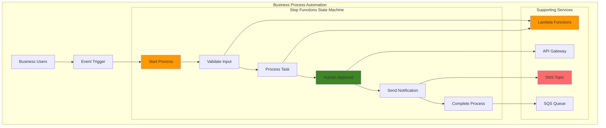

# Business Process Automation with Step Functions

## Problem

Enterprise organizations struggle with manual, error-prone business processes that require human intervention, cross-system coordination, and complex workflow management. Manual approval processes, delayed task execution, and lack of visibility into workflow status create operational inefficiencies and increased costs. Traditional workflow solutions often lack the scalability, reliability, and integration capabilities needed for modern cloud-native applications.

## Solution

AWS Step Functions provides a visual workflow service that coordinates distributed application components using state machines. By implementing business process automation with Step Functions, organizations can orchestrate complex workflows, manage human tasks, integrate multiple systems, and maintain complete visibility into process execution with built-in error handling and retry logic.

## Architecture Diagram



## Prerequisites

1. AWS account with Step Functions, Lambda, SQS, SNS, and API Gateway permissions
2. AWS CLI v2 installed and configured (or AWS CloudShell)
3. Basic understanding of state machines and workflow concepts
4. Familiarity with JSON and AWS service integrations
5. Estimated cost: $5-10 per month for development and testing

> **Note**: Step Functions charges based on state transitions, with the first 4,000 state transitions per month included in the AWS Free Tier. Learn more about [Step Functions pricing and workflow patterns](https://docs.aws.amazon.com/step-functions/latest/dg/welcome.html).

## Preparation

```bash
# Set environment variables
export AWS_REGION=$(aws configure get region)
export AWS_ACCOUNT_ID=$(aws sts get-caller-identity \
    --query Account --output text)

# Generate unique identifiers for resources
RANDOM_SUFFIX=$(aws secretsmanager get-random-password \
    --exclude-punctuation --exclude-uppercase \
    --password-length 6 --require-each-included-type \
    --output text --query RandomPassword)

export BUSINESS_PROCESS_PREFIX="business-process-${RANDOM_SUFFIX}"
export STATE_MACHINE_NAME="${BUSINESS_PROCESS_PREFIX}-workflow"
export LAMBDA_FUNCTION_NAME="${BUSINESS_PROCESS_PREFIX}-processor"
export SQS_QUEUE_NAME="${BUSINESS_PROCESS_PREFIX}-queue"
export SNS_TOPIC_NAME="${BUSINESS_PROCESS_PREFIX}-notifications"

# Create IAM role for Lambda execution
cat > lambda-execution-role-policy.json << EOF
{
  "Version": "2012-10-17",
  "Statement": [
    {
      "Effect": "Allow",
      "Principal": {
        "Service": "lambda.amazonaws.com"
      },
      "Action": "sts:AssumeRole"
    }
  ]
}
EOF

aws iam create-role \
    --role-name ${BUSINESS_PROCESS_PREFIX}-lambda-role \
    --assume-role-policy-document file://lambda-execution-role-policy.json

# Attach basic Lambda execution policy
aws iam attach-role-policy \
    --role-name ${BUSINESS_PROCESS_PREFIX}-lambda-role \
    --policy-arn arn:aws:iam::aws:policy/service-role/AWSLambdaBasicExecutionRole

# Create IAM role for Step Functions
cat > step-functions-role-policy.json << EOF
{
  "Version": "2012-10-17",
  "Statement": [
    {
      "Effect": "Allow",
      "Principal": {
        "Service": "states.amazonaws.com"
      },
      "Action": "sts:AssumeRole"
    }
  ]
}
EOF

aws iam create-role \
    --role-name ${BUSINESS_PROCESS_PREFIX}-stepfunctions-role \
    --assume-role-policy-document file://step-functions-role-policy.json

echo "✅ Created IAM roles for Lambda and Step Functions"
```

## Steps

1. **Create Lambda function for business logic processing**:

   Lambda functions serve as the computational backbone of our business process automation, providing serverless execution environments for custom business logic. In workflow orchestration, Lambda enables Step Functions to perform complex data processing, business rule validation, and system integrations without managing infrastructure. This serverless approach ensures automatic scaling, cost efficiency, and seamless integration with other AWS services within our state machine. Learn more about [Lambda-Step Functions integration patterns](https://docs.aws.amazon.com/step-functions/latest/dg/connect-lambda.html) for optimal orchestration design.

   ```bash
   # Create Lambda function code
   cat > business-processor.py << 'EOF'
import json
import boto3
import time
from datetime import datetime

def lambda_handler(event, context):
    # Extract business process data
    process_data = event.get('processData', {})
    process_type = process_data.get('type', 'unknown')
    
    # Simulate business logic processing
    processing_time = process_data.get('processingTime', 2)
    time.sleep(processing_time)
    
    # Generate processing result
    result = {
        'processId': process_data.get('processId', 'unknown'),
        'processType': process_type,
        'status': 'processed',
        'timestamp': datetime.utcnow().isoformat(),
        'result': f"Successfully processed {process_type} business process"
    }
    
    return {
        'statusCode': 200,
        'body': json.dumps(result),
        'processResult': result
    }
EOF

   # Create deployment package
   zip business-processor.zip business-processor.py
   
   # Get Lambda role ARN
   export LAMBDA_ROLE_ARN=$(aws iam get-role \
       --role-name ${BUSINESS_PROCESS_PREFIX}-lambda-role \
       --query 'Role.Arn' --output text)
   
   # Create Lambda function
   aws lambda create-function \
       --function-name ${LAMBDA_FUNCTION_NAME} \
       --runtime python3.9 \
       --role ${LAMBDA_ROLE_ARN} \
       --handler business-processor.lambda_handler \
       --zip-file fileb://business-processor.zip \
       --timeout 30
   
   export LAMBDA_FUNCTION_ARN=$(aws lambda get-function \
       --function-name ${LAMBDA_FUNCTION_NAME} \
       --query 'Configuration.FunctionArn' --output text)
   
   echo "✅ Created Lambda function: ${LAMBDA_FUNCTION_ARN}"
   ```

   The Lambda function is now deployed and ready to process business logic within our Step Functions workflow. This function handles the core processing tasks, validates business rules, and returns structured results that drive subsequent workflow decisions. The function ARN enables Step Functions to invoke this compute resource seamlessly, establishing the foundation for our automated business process execution.

2. **Create SQS queue for task management**:

   Amazon SQS provides reliable, scalable message queuing that enables asynchronous communication between workflow components. In business process automation, SQS queues serve as durable storage for completed tasks, audit logs, and downstream system notifications. This decoupling mechanism ensures that workflow completion data persists reliably and can be processed by external systems at their own pace, improving overall system resilience and enabling integration with legacy enterprise systems.

   ```bash
   # Create SQS queue for completed tasks
   aws sqs create-queue \
       --queue-name ${SQS_QUEUE_NAME} \
       --attributes VisibilityTimeoutSeconds=300
   
   export SQS_QUEUE_URL=$(aws sqs get-queue-url \
       --queue-name ${SQS_QUEUE_NAME} \
       --query 'QueueUrl' --output text)
   
   export SQS_QUEUE_ARN=$(aws sqs get-queue-attributes \
       --queue-url ${SQS_QUEUE_URL} \
       --attribute-names QueueArn \
       --query 'Attributes.QueueArn' --output text)
   
   echo "✅ Created SQS queue: ${SQS_QUEUE_ARN}"
   ```

   The SQS queue is now established as our durable message repository for workflow completion events. This queue will capture process completion data, audit information, and trigger downstream business systems as needed. The queue ARN enables Step Functions to send messages directly using AWS service integrations, creating a reliable bridge between our automated workflows and external enterprise systems.

3. **Create SNS topic for notifications**:

   Amazon SNS enables real-time notification delivery for business process events, supporting both human approval workflows and automated system notifications. In our automation architecture, SNS facilitates the critical human-in-the-loop pattern by delivering approval requests to stakeholders and collecting their responses. This publish-subscribe model ensures reliable delivery to multiple endpoints while supporting the callback token pattern essential for pausing workflow execution until human decisions are made.

   ```bash
   # Create SNS topic for process notifications
   aws sns create-topic --name ${SNS_TOPIC_NAME}
   
   export SNS_TOPIC_ARN=$(aws sns list-topics \
       --query "Topics[?contains(TopicArn, '${SNS_TOPIC_NAME}')].TopicArn" \
       --output text)
   
   # Subscribe email for notifications (replace with your email)
   aws sns subscribe \
       --topic-arn ${SNS_TOPIC_ARN} \
       --protocol email \
       --notification-endpoint user@example.com
   
   echo "✅ Created SNS topic: ${SNS_TOPIC_ARN}"
   echo "⚠️  Please confirm your email subscription to receive notifications"
   ```

   The SNS topic is now configured to handle both human approval notifications and process completion alerts. This notification infrastructure enables our Step Functions workflow to communicate with human stakeholders during approval gates and notify business users of process outcomes. The email subscription demonstrates the human approval pattern, while the topic ARN enables direct integration with Step Functions for automated notification delivery.

4. **Create Step Functions execution role with necessary permissions**:

   IAM roles implement the principle of least privilege for Step Functions, enabling secure cross-service interactions without embedding credentials in workflow definitions. This execution role grants Step Functions the specific permissions needed to invoke Lambda functions, publish SNS notifications, and send SQS messages. The role-based security model ensures that workflows can only access authorized resources while maintaining audit trails for compliance requirements essential in business process automation.

   ```bash
   # Create policy for Step Functions execution
   cat > step-functions-execution-policy.json << EOF
{
  "Version": "2012-10-17",
  "Statement": [
    {
      "Effect": "Allow",
      "Action": [
        "lambda:InvokeFunction"
      ],
      "Resource": [
        "${LAMBDA_FUNCTION_ARN}"
      ]
    },
    {
      "Effect": "Allow",
      "Action": [
        "sns:Publish"
      ],
      "Resource": [
        "${SNS_TOPIC_ARN}"
      ]
    },
    {
      "Effect": "Allow",
      "Action": [
        "sqs:SendMessage"
      ],
      "Resource": [
        "${SQS_QUEUE_ARN}"
      ]
    },
    {
      "Effect": "Allow",
      "Action": [
        "logs:CreateLogGroup",
        "logs:CreateLogStream",
        "logs:PutLogEvents"
      ],
      "Resource": "*"
    }
  ]
}
EOF

   # Attach policy to Step Functions role
   aws iam put-role-policy \
       --role-name ${BUSINESS_PROCESS_PREFIX}-stepfunctions-role \
       --policy-name StepFunctionsExecutionPolicy \
       --policy-document file://step-functions-execution-policy.json
   
   export STEP_FUNCTIONS_ROLE_ARN="arn:aws:iam::${AWS_ACCOUNT_ID}:role/${BUSINESS_PROCESS_PREFIX}-stepfunctions-role"
   
   echo "✅ Configured Step Functions execution role"
   ```

   The IAM execution role is now configured with precise permissions for our business process automation workflow. This security foundation enables Step Functions to orchestrate services securely while maintaining compliance with enterprise security standards. The role's scoped permissions ensure that workflows can only perform authorized actions, providing the security controls necessary for handling sensitive business processes and maintaining audit trails for regulatory compliance.

5. **Create Step Functions state machine definition**:

   The state machine definition embodies our business process logic using Amazon States Language (ASL), providing a declarative approach to workflow orchestration. This JSON-based definition includes error handling with retry policies, human approval integration using the `waitForTaskToken` pattern, and direct service integrations that eliminate the need for intermediate Lambda functions. The state machine design demonstrates key patterns like conditional branching, timeout handling, and failure recovery essential for robust business process automation. Reference the [human approval workflow tutorial](https://docs.aws.amazon.com/step-functions/latest/dg/tutorial-human-approval.html) for additional implementation patterns.

   ```bash
   # Create state machine definition
   cat > business-process-state-machine.json << EOF
{
  "Comment": "Business Process Automation Workflow",
  "StartAt": "ValidateInput",
  "States": {
    "ValidateInput": {
      "Type": "Pass",
      "Parameters": {
        "processData.$": "$.processData",
        "validationResult": "Input validated successfully"
      },
      "Next": "ProcessBusinessLogic"
    },
    "ProcessBusinessLogic": {
      "Type": "Task",
      "Resource": "${LAMBDA_FUNCTION_ARN}",
      "Retry": [
        {
          "ErrorEquals": ["States.TaskFailed"],
          "IntervalSeconds": 5,
          "MaxAttempts": 3,
          "BackoffRate": 2.0
        }
      ],
      "Catch": [
        {
          "ErrorEquals": ["States.ALL"],
          "Next": "ProcessingFailed"
        }
      ],
      "Next": "HumanApprovalRequired"
    },
    "HumanApprovalRequired": {
      "Type": "Task",
      "Resource": "arn:aws:states:::sns:publish.waitForTaskToken",
      "Parameters": {
        "TopicArn": "${SNS_TOPIC_ARN}",
        "Message": {
          "processId.$": "$.processResult.processId",
          "processType.$": "$.processResult.processType",
          "approvalRequired": "Please approve this business process",
          "taskToken.$": "$$.Task.Token"
        },
        "Subject": "Business Process Approval Required"
      },
      "HeartbeatSeconds": 3600,
      "TimeoutSeconds": 86400,
      "Next": "SendCompletionNotification"
    },
    "SendCompletionNotification": {
      "Type": "Task",
      "Resource": "arn:aws:states:::sns:publish",
      "Parameters": {
        "TopicArn": "${SNS_TOPIC_ARN}",
        "Message": {
          "processId.$": "$.processResult.processId",
          "status": "completed",
          "message": "Business process completed successfully"
        },
        "Subject": "Business Process Completed"
      },
      "Next": "LogToQueue"
    },
    "LogToQueue": {
      "Type": "Task",
      "Resource": "arn:aws:states:::sqs:sendMessage",
      "Parameters": {
        "QueueUrl": "${SQS_QUEUE_URL}",
        "MessageBody": {
          "processId.$": "$.processResult.processId",
          "completionTime.$": "$$.State.EnteredTime",
          "status": "completed"
        }
      },
      "End": true
    },
    "ProcessingFailed": {
      "Type": "Task",
      "Resource": "arn:aws:states:::sns:publish",
      "Parameters": {
        "TopicArn": "${SNS_TOPIC_ARN}",
        "Message": {
          "error": "Business process failed",
          "details.$": "$.Error"
        },
        "Subject": "Business Process Failed"
      },
      "End": true
    }
  }
}
EOF

   echo "✅ Created state machine definition"
   ```

   The state machine definition is now created, capturing our complete business process automation logic in a declarative format. This ASL specification includes sophisticated error handling, human approval workflows, and service integrations that enable reliable, auditable business process execution. The definition demonstrates enterprise-grade patterns for timeout management, retry logic, and failure handling that ensure business-critical processes complete successfully even in the face of transient failures or external system delays. Explore [Step Functions error handling best practices](https://docs.aws.amazon.com/step-functions/latest/dg/concepts-error-handling.html) for advanced resilience patterns.

6. **Create and deploy the Step Functions state machine**:

   Deploying the state machine transforms our workflow definition into an executable service capable of processing business requests at scale. Step Functions provides built-in monitoring, execution history, and visual debugging capabilities that are essential for enterprise workflow management. The deployed state machine becomes the central orchestrator for our business process automation, ready to coordinate Lambda functions, manage human approvals, and integrate with notification systems according to our defined business logic.

   ```bash
   # Create Step Functions state machine
   aws stepfunctions create-state-machine \
       --name ${STATE_MACHINE_NAME} \
       --definition file://business-process-state-machine.json \
       --role-arn ${STEP_FUNCTIONS_ROLE_ARN}
   
   export STATE_MACHINE_ARN=$(aws stepfunctions list-state-machines \
       --query "stateMachines[?name=='${STATE_MACHINE_NAME}'].stateMachineArn" \
       --output text)
   
   echo "✅ Created Step Functions state machine: ${STATE_MACHINE_ARN}"
   ```

   The Step Functions state machine is now deployed and operational, ready to execute business process automation workflows. This live orchestrator can handle multiple concurrent executions, maintain execution state across long-running processes, and provide complete visibility into workflow progress. The state machine ARN serves as the entry point for triggering business processes, enabling integration with external systems, scheduled execution, and event-driven automation patterns.

7. **Create API Gateway for human task callbacks**:

   API Gateway provides the HTTP interface necessary for human approval callbacks in our business process automation. When Step Functions pauses for human approval using the `waitForTaskToken` pattern, API Gateway enables stakeholders to submit their decisions through REST endpoints. This integration completes the human-in-the-loop workflow by providing a scalable, secure method for external systems or web applications to resume paused workflows with approval decisions, enabling sophisticated business process flows that require human judgment.

   ```bash
   # Create API Gateway for human approval callbacks
   aws apigateway create-rest-api \
       --name ${BUSINESS_PROCESS_PREFIX}-approval-api \
       --description "API for business process approvals"
   
   export API_ID=$(aws apigateway get-rest-apis \
       --query "items[?name=='${BUSINESS_PROCESS_PREFIX}-approval-api'].id" \
       --output text)
   
   # Get root resource ID
   export ROOT_RESOURCE_ID=$(aws apigateway get-resources \
       --rest-api-id ${API_ID} \
       --query 'items[?path==`/`].id' --output text)
   
   # Create approval resource
   aws apigateway create-resource \
       --rest-api-id ${API_ID} \
       --parent-id ${ROOT_RESOURCE_ID} \
       --path-part approval
   
   export APPROVAL_RESOURCE_ID=$(aws apigateway get-resources \
       --rest-api-id ${API_ID} \
       --query "items[?pathPart=='approval'].id" --output text)
   
   echo "✅ Created API Gateway for human approvals"
   ```

   The API Gateway is now configured to handle human approval callbacks, providing the REST interface that enables stakeholders to interact with paused workflows. This API establishes the communication bridge between human decision-makers and our automated business processes, allowing approvals to be submitted through web applications, mobile interfaces, or direct API calls. The approval resource creates the endpoint structure necessary for processing task tokens and resuming workflow execution based on human decisions.

8. **Test the business process automation workflow**:

   Testing validates that our business process automation functions correctly end-to-end, demonstrating the workflow's ability to process requests, execute business logic, and manage human approval flows. This test execution simulates a real business scenario (expense approval) and verifies that all components integrate properly. Monitoring the execution provides insights into workflow performance, state transitions, and the effectiveness of our error handling and notification mechanisms.

   ```bash
   # Create test input for workflow execution
   cat > test-input.json << EOF
{
  "processData": {
    "processId": "BP-001",
    "type": "expense-approval",
    "amount": 5000,
    "requestor": "john.doe@company.com",
    "description": "Software licensing renewal",
    "processingTime": 1
  }
}
EOF

   # Start Step Functions execution
   aws stepfunctions start-execution \
       --state-machine-arn ${STATE_MACHINE_ARN} \
       --name "test-execution-$(date +%s)" \
       --input file://test-input.json
   
   # Get execution ARN for the most recent execution
   export EXECUTION_ARN=$(aws stepfunctions list-executions \
       --state-machine-arn ${STATE_MACHINE_ARN} \
       --max-items 1 \
       --query 'executions[0].executionArn' --output text)
   
   echo "✅ Started workflow execution: ${EXECUTION_ARN}"
   echo "📧 Check your email for the approval notification"
   ```

   The workflow execution is now running, demonstrating our complete business process automation in action. This test validates the integration between Lambda processing, human approval notifications, and workflow orchestration. The execution ARN enables detailed monitoring of the workflow's progress through the Step Functions console, providing visibility into state transitions, timing, and any issues that may arise during process execution.

## Validation & Testing

1. **Monitor workflow execution status**:

   ```bash
   # Check execution status
   aws stepfunctions describe-execution \
       --execution-arn ${EXECUTION_ARN} \
       --query '{status: status, startDate: startDate, input: input}'
   ```

   Expected output: Shows execution status as "RUNNING" or "WAITING_FOR_CALLBACK"

2. **View execution history and state transitions**:

   ```bash
   # Get execution history
   aws stepfunctions get-execution-history \
       --execution-arn ${EXECUTION_ARN} \
       --query 'events[*].{type: type, timestamp: timestamp}' \
       --output table
   ```

3. **Test human approval workflow**:

   ```bash
   # Simulate human approval by sending task success
   # Note: Replace TASK_TOKEN_FROM_SNS_MESSAGE with actual token from email
   aws stepfunctions send-task-success \
       --task-token "TASK_TOKEN_FROM_SNS_MESSAGE" \
       --task-output '{"approved": true, "approver": "manager@company.com"}'
   ```

4. **Verify SQS queue receives completion messages**:

   ```bash
   # Check SQS queue for completion messages
   aws sqs receive-message \
       --queue-url ${SQS_QUEUE_URL} \
       --max-number-of-messages 10
   ```

## Cleanup

1. **Delete Step Functions state machine**:

   ```bash
   # Delete state machine
   aws stepfunctions delete-state-machine \
       --state-machine-arn ${STATE_MACHINE_ARN}
   
   echo "✅ Deleted Step Functions state machine"
   ```

2. **Delete Lambda function**:

   ```bash
   # Delete Lambda function
   aws lambda delete-function \
       --function-name ${LAMBDA_FUNCTION_NAME}
   
   echo "✅ Deleted Lambda function"
   ```

3. **Delete SQS queue and SNS topic**:

   ```bash
   # Delete SQS queue
   aws sqs delete-queue --queue-url ${SQS_QUEUE_URL}
   
   # Delete SNS topic
   aws sns delete-topic --topic-arn ${SNS_TOPIC_ARN}
   
   echo "✅ Deleted SQS queue and SNS topic"
   ```

4. **Delete API Gateway**:

   ```bash
   # Delete API Gateway
   aws apigateway delete-rest-api --rest-api-id ${API_ID}
   
   echo "✅ Deleted API Gateway"
   ```

5. **Remove IAM roles and policies**:

   ```bash
   # Delete Step Functions role policy
   aws iam delete-role-policy \
       --role-name ${BUSINESS_PROCESS_PREFIX}-stepfunctions-role \
       --policy-name StepFunctionsExecutionPolicy
   
   # Delete Step Functions IAM role
   aws iam delete-role \
       --role-name ${BUSINESS_PROCESS_PREFIX}-stepfunctions-role
   
   # Detach policy from Lambda role
   aws iam detach-role-policy \
       --role-name ${BUSINESS_PROCESS_PREFIX}-lambda-role \
       --policy-arn arn:aws:iam::aws:policy/service-role/AWSLambdaBasicExecutionRole
   
   # Delete Lambda IAM role
   aws iam delete-role \
       --role-name ${BUSINESS_PROCESS_PREFIX}-lambda-role
   
   # Clean up local files
   rm -f business-processor.py business-processor.zip
   rm -f lambda-execution-role-policy.json step-functions-role-policy.json
   rm -f step-functions-execution-policy.json business-process-state-machine.json
   rm -f test-input.json
   
   echo "✅ Cleaned up IAM resources and local files"
   ```

## Discussion

Step Functions provides a powerful platform for implementing business process automation by orchestrating distributed services through visual workflows. The service's integration with AWS services enables complex business processes to be automated while maintaining reliability and scalability. The state machine model allows for clear definition of business logic, error handling, and process flow visualization. Understanding [Step Functions service integration patterns](https://docs.aws.amazon.com/step-functions/latest/dg/connect-to-resource.html) is essential for designing efficient, maintainable workflows.

The human approval pattern demonstrated here is particularly valuable for business processes that require manual intervention or approval gates. By using the `waitForTaskToken` pattern, Step Functions can pause execution until external systems or human actors provide input, making it ideal for approval workflows, manual quality checks, or integration with external systems that require callbacks. This pattern is documented in the [AWS Step Functions human approval tutorial](https://docs.aws.amazon.com/step-functions/latest/dg/tutorial-human-approval.html), which provides additional CloudFormation-based implementation examples.

Error handling and retry logic are built into Step Functions, providing robust execution guarantees for business-critical processes. The service supports both automatic retries with exponential backoff and manual error handling through catch blocks, ensuring processes can recover from transient failures while escalating permanent issues appropriately. Our implementation demonstrates the AWS Well-Architected Framework's reliability pillar by incorporating comprehensive error handling and monitoring capabilities.

> **Tip**: Use Step Functions Express Workflows for high-volume, short-duration processes (under 5 minutes) and Standard Workflows for longer-running processes that require detailed execution history and visual debugging. See the [AWS Step Functions Developer Guide](https://docs.aws.amazon.com/step-functions/latest/dg/developing-workflows.html) for comprehensive workflow development patterns.

## Challenge

Extend this business process automation solution by implementing these enhancements:

1. **Multi-stage approval workflow** - Implement a sequential approval process with multiple approvers, conditional routing based on process amount or type, and escalation mechanisms for delayed approvals using Step Functions Choice states and timeouts.

2. **Integration with external systems** - Add API Gateway endpoints for external system callbacks, implement webhook processing for third-party service integration, and create DynamoDB logging for comprehensive audit trail requirements.

3. **Advanced monitoring and alerting** - Implement CloudWatch custom metrics for process performance tracking, create dashboards for business process KPIs using CloudWatch Insights, and set up automated alerts for failed or delayed processes using CloudWatch Alarms.

4. **Parallel processing capabilities** - Use Step Functions Map state to process multiple items simultaneously, implement batch processing for bulk operations using AWS Batch integration, and create fan-out/fan-in patterns for distributed processing across multiple Lambda functions.

5. **Process optimization and analytics** - Implement execution time tracking and optimization recommendations using CloudWatch metrics, create historical process performance analysis with Amazon QuickSight, and build automated process improvement suggestions based on execution patterns using machine learning insights.

## Infrastructure Code

### Available Infrastructure as Code:

- [Infrastructure Code Overview](code/README.md) - Detailed description of all infrastructure components
- [AWS CDK (Python)](code/cdk-python/) - AWS CDK Python implementation
- [AWS CDK (TypeScript)](code/cdk-typescript/) - AWS CDK TypeScript implementation
- [CloudFormation](code/cloudformation.yaml) - AWS CloudFormation template
- [Bash CLI Scripts](code/scripts/) - Example bash scripts using AWS CLI commands to deploy infrastructure
- [Terraform](code/terraform/) - Terraform configuration files