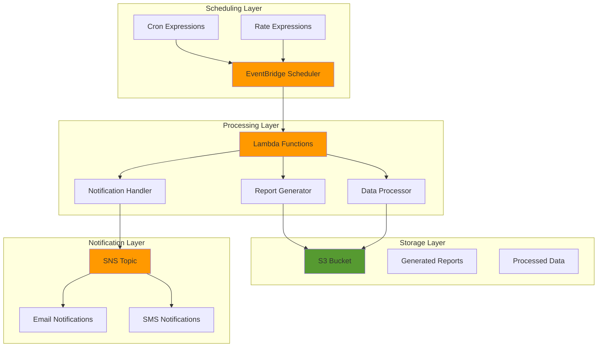

# Business Task Scheduling with EventBridge

## Problem

Organizations often struggle with manual execution of recurring business tasks like daily report generation, data processing, and notification delivery. These manual processes lead to delays, inconsistencies, and increased operational overhead, while requiring dedicated staff resources to monitor and execute routine tasks that should be automated.

## Solution

Create an automated business workflow system using EventBridge Scheduler to trigger Lambda functions on flexible schedules. This serverless architecture eliminates manual intervention by automatically executing tasks like report generation, data processing, and notification delivery based on configurable cron expressions and rate schedules.

## Architecture Diagram



## Prerequisites

1. AWS account with EventBridge Scheduler, Lambda, SNS, and S3 permissions
2. AWS CLI v2 installed and configured (or AWS CloudShell)
3. Basic understanding of serverless architectures and event-driven patterns
4. Familiarity with Python programming for Lambda functions
5. Estimated cost: $5-15 per month for typical business automation workloads

> **Note**: EventBridge Scheduler is a fully managed service that eliminates the need for infrastructure management while providing enterprise-grade scheduling capabilities with flexible retry policies and dead letter queues.

## Preparation

```bash
# Set environment variables
export AWS_REGION=$(aws configure get region)
export AWS_ACCOUNT_ID=$(aws sts get-caller-identity \
    --query Account --output text)

# Generate unique identifiers for resources
RANDOM_SUFFIX=$(aws secretsmanager get-random-password \
    --exclude-punctuation --exclude-uppercase \
    --password-length 6 --require-each-included-type \
    --output text --query RandomPassword)

# Set resource names
export BUCKET_NAME="business-automation-${RANDOM_SUFFIX}"
export SNS_TOPIC_NAME="business-notifications-${RANDOM_SUFFIX}"
export LAMBDA_FUNCTION_NAME="business-task-processor-${RANDOM_SUFFIX}"
export SCHEDULER_ROLE_NAME="eventbridge-scheduler-role-${RANDOM_SUFFIX}"
export LAMBDA_ROLE_NAME="lambda-execution-role-${RANDOM_SUFFIX}"

echo "✅ Environment configured for business automation setup"
```

## Steps

1. **Create S3 Bucket for Report Storage**:

   Amazon S3 provides the foundational storage layer for our business automation system. This bucket will store generated reports, processed data files, and serve as the central repository for all automated task outputs. S3's 99.999999999% (11 9's) durability and virtually unlimited scalability make it ideal for business-critical data storage.

   ```bash
   # Create S3 bucket for storing reports and processed data
   aws s3 mb s3://${BUCKET_NAME} --region ${AWS_REGION}
   
   # Enable versioning for data protection
   aws s3api put-bucket-versioning \
       --bucket ${BUCKET_NAME} \
       --versioning-configuration Status=Enabled
   
   # Enable server-side encryption
   aws s3api put-bucket-encryption \
       --bucket ${BUCKET_NAME} \
       --server-side-encryption-configuration \
       'Rules=[{ApplyServerSideEncryptionByDefault:{SSEAlgorithm:AES256}}]'
   
   echo "✅ S3 bucket created: ${BUCKET_NAME}"
   ```

   The S3 bucket is now configured with enterprise-grade security features including versioning for data protection and AES-256 encryption at rest. This provides a reliable foundation for storing sensitive business reports and processed data outputs.

2. **Create SNS Topic for Notifications**:

   Amazon SNS enables our automated system to send notifications when tasks complete, fail, or require attention. This fully managed pub/sub messaging service supports multiple delivery methods including email, SMS, and webhook endpoints, providing flexible notification options for business stakeholders.

   ```bash
   # Create SNS topic for business notifications
   aws sns create-topic --name ${SNS_TOPIC_NAME}
   
   # Get topic ARN
   TOPIC_ARN=$(aws sns get-topic-attributes \
       --topic-arn arn:aws:sns:${AWS_REGION}:${AWS_ACCOUNT_ID}:${SNS_TOPIC_NAME} \
       --query 'Attributes.TopicArn' --output text)
   
   # Subscribe email endpoint (replace with actual email)
   aws sns subscribe \
       --topic-arn ${TOPIC_ARN} \
       --protocol email \
       --notification-endpoint "admin@example.com"
   
   echo "✅ SNS topic created: ${SNS_TOPIC_NAME}"
   echo "✅ Topic ARN: ${TOPIC_ARN}"
   ```

   The SNS topic is now ready to deliver notifications to business stakeholders. Email subscriptions must be confirmed through the confirmation email sent to subscribers before notifications will be delivered.

3. **Create IAM Role for Lambda Execution**:

   IAM roles provide secure, temporary credentials for Lambda functions to access AWS services. This role follows the principle of least privilege, granting only the minimum permissions required for S3 operations, SNS publishing, and CloudWatch logging.

   ```bash
   # Create trust policy for Lambda
   cat > lambda-trust-policy.json << 'EOF'
   {
       "Version": "2012-10-17",
       "Statement": [
           {
               "Effect": "Allow",
               "Principal": {
                   "Service": "lambda.amazonaws.com"
               },
               "Action": "sts:AssumeRole"
           }
       ]
   }
   EOF
   
   # Create Lambda execution role
   aws iam create-role \
       --role-name ${LAMBDA_ROLE_NAME} \
       --assume-role-policy-document file://lambda-trust-policy.json
   
   # Attach basic Lambda execution policy
   aws iam attach-role-policy \
       --role-name ${LAMBDA_ROLE_NAME} \
       --policy-arn arn:aws:iam::aws:policy/service-role/AWSLambdaBasicExecutionRole
   
   echo "✅ Lambda execution role created: ${LAMBDA_ROLE_NAME}"
   ```

   The Lambda execution role now has the foundational permissions needed for CloudWatch logging. Additional permissions for S3 and SNS will be added in subsequent steps.

4. **Create IAM Policy for S3 and SNS Access**:

   This custom IAM policy grants the Lambda function specific permissions to interact with our S3 bucket and SNS topic. The policy follows security best practices by restricting access to only the resources created for this automation system.

   ```bash
   # Create custom policy for S3 and SNS access
   cat > lambda-permissions-policy.json << EOF
   {
       "Version": "2012-10-17",
       "Statement": [
           {
               "Effect": "Allow",
               "Action": [
                   "s3:GetObject",
                   "s3:PutObject",
                   "s3:DeleteObject",
                   "s3:ListBucket"
               ],
               "Resource": [
                   "arn:aws:s3:::${BUCKET_NAME}",
                   "arn:aws:s3:::${BUCKET_NAME}/*"
               ]
           },
           {
               "Effect": "Allow",
               "Action": [
                   "sns:Publish"
               ],
               "Resource": "${TOPIC_ARN}"
           }
       ]
   }
   EOF
   
   # Create and attach the policy
   aws iam create-policy \
       --policy-name ${LAMBDA_ROLE_NAME}-policy \
       --policy-document file://lambda-permissions-policy.json
   
   aws iam attach-role-policy \
       --role-name ${LAMBDA_ROLE_NAME} \
       --policy-arn arn:aws:iam::${AWS_ACCOUNT_ID}:policy/${LAMBDA_ROLE_NAME}-policy
   
   echo "✅ Lambda permissions policy created and attached"
   ```

   The Lambda function now has the necessary permissions to read from and write to the S3 bucket, as well as publish notifications to the SNS topic. This completes the security configuration for our automated business tasks.

5. **Create Lambda Function for Business Task Processing**:

   This Lambda function serves as the core processing engine for our automated business tasks. It demonstrates three common automation patterns: report generation, data processing, and notification delivery. The function is designed to handle different task types based on input parameters.

   ```bash
   # Create Lambda function code
   cat > business_task_processor.py << 'EOF'
   import json
   import boto3
   import datetime
   from io import StringIO
   import csv
   import os
   
   s3 = boto3.client('s3')
   sns = boto3.client('sns')
   
   def lambda_handler(event, context):
       try:
           # Get task type from event
           task_type = event.get('task_type', 'report')
           bucket_name = os.environ['BUCKET_NAME']
           topic_arn = os.environ['TOPIC_ARN']
           
           if task_type == 'report':
               result = generate_daily_report(bucket_name)
           elif task_type == 'data_processing':
               result = process_business_data(bucket_name)
           elif task_type == 'notification':
               result = send_business_notification(topic_arn)
           else:
               result = f"Unknown task type: {task_type}"
           
           # Send success notification
           sns.publish(
               TopicArn=topic_arn,
               Message=f"Business task completed successfully: {result}",
               Subject=f"Task Completion - {task_type}"
           )
           
           return {
               'statusCode': 200,
               'body': json.dumps({
                   'message': 'Task completed successfully',
                   'result': result,
                   'timestamp': datetime.datetime.now().isoformat()
               })
           }
           
       except Exception as e:
           # Send failure notification
           sns.publish(
               TopicArn=topic_arn,
               Message=f"Business task failed: {str(e)}",
               Subject=f"Task Failure - {task_type}"
           )
           
           return {
               'statusCode': 500,
               'body': json.dumps({
                   'error': str(e),
                   'timestamp': datetime.datetime.now().isoformat()
               })
           }
   
   def generate_daily_report(bucket_name):
       # Generate sample business report
       report_data = [
           ['Date', 'Revenue', 'Orders', 'Customers'],
           [datetime.datetime.now().strftime('%Y-%m-%d'), '12500', '45', '38'],
           [datetime.datetime.now().strftime('%Y-%m-%d'), '15800', '52', '41']
       ]
       
       # Convert to CSV
       csv_buffer = StringIO()
       writer = csv.writer(csv_buffer)
       writer.writerows(report_data)
       
       # Upload to S3
       report_key = f"reports/daily-report-{datetime.datetime.now().strftime('%Y%m%d')}.csv"
       s3.put_object(
           Bucket=bucket_name,
           Key=report_key,
           Body=csv_buffer.getvalue(),
           ContentType='text/csv'
       )
       
       return f"Daily report generated: {report_key}"
   
   def process_business_data(bucket_name):
       # Simulate data processing
       processed_data = {
           'processed_at': datetime.datetime.now().isoformat(),
           'records_processed': 150,
           'success_rate': 98.5,
           'errors': 2
       }
       
       # Save processed data to S3
       data_key = f"processed-data/batch-{datetime.datetime.now().strftime('%Y%m%d-%H%M%S')}.json"
       s3.put_object(
           Bucket=bucket_name,
           Key=data_key,
           Body=json.dumps(processed_data),
           ContentType='application/json'
       )
       
       return f"Data processing completed: {data_key}"
   
   def send_business_notification(topic_arn):
       # Send business update notification
       message = f"Business automation system status check completed at {datetime.datetime.now().isoformat()}"
       
       sns.publish(
           TopicArn=topic_arn,
           Message=message,
           Subject="Business Automation Status Update"
       )
       
       return "Business notification sent successfully"
   EOF
   
   # Create deployment package
   zip -r business-task-processor.zip business_task_processor.py
   
   # Create Lambda function with updated Python runtime
   LAMBDA_ROLE_ARN=$(aws iam get-role \
       --role-name ${LAMBDA_ROLE_NAME} \
       --query 'Role.Arn' --output text)
   
   aws lambda create-function \
       --function-name ${LAMBDA_FUNCTION_NAME} \
       --runtime python3.12 \
       --role ${LAMBDA_ROLE_ARN} \
       --handler business_task_processor.lambda_handler \
       --zip-file fileb://business-task-processor.zip \
       --timeout 60 \
       --memory-size 256 \
       --environment Variables="{BUCKET_NAME=${BUCKET_NAME},TOPIC_ARN=${TOPIC_ARN}}"
   
   echo "✅ Lambda function created: ${LAMBDA_FUNCTION_NAME}"
   ```

   The Lambda function is now deployed using Python 3.12 runtime and ready to process business tasks. It includes comprehensive error handling, logging, and notification capabilities to ensure reliable execution of automated workflows.

6. **Create IAM Role for EventBridge Scheduler**:

   EventBridge Scheduler requires its own IAM role to invoke Lambda functions on your behalf. This role provides the scheduler with the necessary permissions to trigger Lambda functions while maintaining security isolation between services.

   ```bash
   # Create trust policy for EventBridge Scheduler
   cat > scheduler-trust-policy.json << 'EOF'
   {
       "Version": "2012-10-17",
       "Statement": [
           {
               "Effect": "Allow",
               "Principal": {
                   "Service": "scheduler.amazonaws.com"
               },
               "Action": "sts:AssumeRole"
           }
       ]
   }
   EOF
   
   # Create EventBridge Scheduler role
   aws iam create-role \
       --role-name ${SCHEDULER_ROLE_NAME} \
       --assume-role-policy-document file://scheduler-trust-policy.json
   
   # Create policy for Lambda invocation
   cat > scheduler-policy.json << EOF
   {
       "Version": "2012-10-17",
       "Statement": [
           {
               "Effect": "Allow",
               "Action": [
                   "lambda:InvokeFunction"
               ],
               "Resource": "arn:aws:lambda:${AWS_REGION}:${AWS_ACCOUNT_ID}:function:${LAMBDA_FUNCTION_NAME}"
           }
       ]
   }
   EOF
   
   # Create and attach the policy
   aws iam create-policy \
       --policy-name ${SCHEDULER_ROLE_NAME}-policy \
       --policy-document file://scheduler-policy.json
   
   aws iam attach-role-policy \
       --role-name ${SCHEDULER_ROLE_NAME} \
       --policy-arn arn:aws:iam::${AWS_ACCOUNT_ID}:policy/${SCHEDULER_ROLE_NAME}-policy
   
   echo "✅ EventBridge Scheduler role created: ${SCHEDULER_ROLE_NAME}"
   ```

   The EventBridge Scheduler role now has the minimal permissions required to invoke our Lambda function. This follows security best practices by limiting the scheduler's access to only the necessary resources.

7. **Create EventBridge Schedules for Business Tasks**:

   EventBridge Scheduler provides flexible scheduling options using cron expressions and rate-based schedules. We'll create three different schedules to demonstrate various business automation patterns: daily reports, hourly data processing, and weekly notifications.

   ```bash
   # Get role ARN for scheduler
   SCHEDULER_ROLE_ARN=$(aws iam get-role \
       --role-name ${SCHEDULER_ROLE_NAME} \
       --query 'Role.Arn' --output text)
   
   # Create daily report schedule (runs at 9 AM every day)
   aws scheduler create-schedule \
       --name "daily-report-schedule" \
       --schedule-expression "cron(0 9 * * ? *)" \
       --schedule-expression-timezone "America/New_York" \
       --flexible-time-window Mode=OFF \
       --target '{
           "Arn": "arn:aws:lambda:'${AWS_REGION}':'${AWS_ACCOUNT_ID}':function:'${LAMBDA_FUNCTION_NAME}'",
           "RoleArn": "'${SCHEDULER_ROLE_ARN}'",
           "Input": "{\"task_type\":\"report\"}"
       }' \
       --description "Daily business report generation"
   
   # Create hourly data processing schedule
   aws scheduler create-schedule \
       --name "hourly-data-processing" \
       --schedule-expression "rate(1 hour)" \
       --flexible-time-window Mode=OFF \
       --target '{
           "Arn": "arn:aws:lambda:'${AWS_REGION}':'${AWS_ACCOUNT_ID}':function:'${LAMBDA_FUNCTION_NAME}'",
           "RoleArn": "'${SCHEDULER_ROLE_ARN}'",
           "Input": "{\"task_type\":\"data_processing\"}"
       }' \
       --description "Hourly business data processing"
   
   # Create weekly notification schedule (runs every Monday at 10 AM)
   aws scheduler create-schedule \
       --name "weekly-notification-schedule" \
       --schedule-expression "cron(0 10 ? * MON *)" \
       --schedule-expression-timezone "America/New_York" \
       --flexible-time-window Mode=OFF \
       --target '{
           "Arn": "arn:aws:lambda:'${AWS_REGION}':'${AWS_ACCOUNT_ID}':function:'${LAMBDA_FUNCTION_NAME}'",
           "RoleArn": "'${SCHEDULER_ROLE_ARN}'",
           "Input": "{\"task_type\":\"notification\"}"
       }' \
       --description "Weekly business status notifications"
   
   echo "✅ EventBridge schedules created successfully"
   ```

   Three automated schedules are now active: daily report generation at 9 AM, hourly data processing, and weekly status notifications on Mondays. These schedules demonstrate different timing patterns commonly used in business automation workflows.

8. **Configure Schedule Groups for Organization**:

   Schedule groups provide a way to organize and manage related schedules together. This organizational structure makes it easier to apply tags, monitor performance, and manage lifecycle policies for groups of related business automation tasks.

   ```bash
   # Create schedule group for business automation
   aws scheduler create-schedule-group \
       --name "business-automation-group" \
       --tags Key=Environment,Value=Production \
              Key=Department,Value=Operations \
              Key=Application,Value=BusinessAutomation
   
   # Move existing schedules to the group
   aws scheduler update-schedule \
       --name "daily-report-schedule" \
       --schedule-expression "cron(0 9 * * ? *)" \
       --schedule-expression-timezone "America/New_York" \
       --flexible-time-window Mode=OFF \
       --target '{
           "Arn": "arn:aws:lambda:'${AWS_REGION}':'${AWS_ACCOUNT_ID}':function:'${LAMBDA_FUNCTION_NAME}'",
           "RoleArn": "'${SCHEDULER_ROLE_ARN}'",
           "Input": "{\"task_type\":\"report\"}"
       }' \
       --group-name "business-automation-group"
   
   echo "✅ Schedule group created and configured"
   ```

   The business automation schedules are now organized within a dedicated schedule group with appropriate tags for cost tracking and resource management.

## Validation & Testing

1. **Verify Lambda Function Deployment**:

   ```bash
   # Check Lambda function status
   aws lambda get-function --function-name ${LAMBDA_FUNCTION_NAME}
   
   # Test Lambda function with sample event
   aws lambda invoke \
       --function-name ${LAMBDA_FUNCTION_NAME} \
       --payload '{"task_type":"report"}' \
       --cli-binary-format raw-in-base64-out \
       response.json
   
   cat response.json
   ```

   Expected output: HTTP 200 status with successful execution details and timestamp.

2. **Verify Schedule Creation**:

   ```bash
   # List all schedules
   aws scheduler list-schedules
   
   # Get specific schedule details
   aws scheduler get-schedule --name "daily-report-schedule"
   ```

   Expected output: Schedule configuration showing correct cron expression and target Lambda function.

3. **Test S3 Report Generation**:

   ```bash
   # Check S3 bucket contents
   aws s3 ls s3://${BUCKET_NAME}/reports/
   
   # Download and verify generated report
   aws s3 cp s3://${BUCKET_NAME}/reports/ ./reports/ --recursive
   ls -la reports/
   ```

   Expected output: CSV report files with current date stamp and proper business data format.

4. **Verify SNS Notification Delivery**:

   ```bash
   # Check SNS topic subscriptions
   aws sns list-subscriptions-by-topic --topic-arn ${TOPIC_ARN}
   
   # Send test notification
   aws sns publish \
       --topic-arn ${TOPIC_ARN} \
       --message "Test notification from business automation system" \
       --subject "Test Business Automation Alert"
   ```

   Expected output: Confirmation message ID and delivery to subscribed email addresses.

## Cleanup

1. **Delete EventBridge Schedules**:

   ```bash
   # Delete all schedules
   aws scheduler delete-schedule --name "daily-report-schedule"
   aws scheduler delete-schedule --name "hourly-data-processing"
   aws scheduler delete-schedule --name "weekly-notification-schedule"
   
   # Delete schedule group
   aws scheduler delete-schedule-group --name "business-automation-group"
   
   echo "✅ EventBridge schedules deleted"
   ```

2. **Delete Lambda Function**:

   ```bash
   # Delete Lambda function
   aws lambda delete-function --function-name ${LAMBDA_FUNCTION_NAME}
   
   echo "✅ Lambda function deleted"
   ```

3. **Delete IAM Roles and Policies**:

   ```bash
   # Detach and delete Lambda role policies
   aws iam detach-role-policy \
       --role-name ${LAMBDA_ROLE_NAME} \
       --policy-arn arn:aws:iam::aws:policy/service-role/AWSLambdaBasicExecutionRole
   
   aws iam detach-role-policy \
       --role-name ${LAMBDA_ROLE_NAME} \
       --policy-arn arn:aws:iam::${AWS_ACCOUNT_ID}:policy/${LAMBDA_ROLE_NAME}-policy
   
   aws iam delete-policy \
       --policy-arn arn:aws:iam::${AWS_ACCOUNT_ID}:policy/${LAMBDA_ROLE_NAME}-policy
   
   aws iam delete-role --role-name ${LAMBDA_ROLE_NAME}
   
   # Delete scheduler role and policy
   aws iam detach-role-policy \
       --role-name ${SCHEDULER_ROLE_NAME} \
       --policy-arn arn:aws:iam::${AWS_ACCOUNT_ID}:policy/${SCHEDULER_ROLE_NAME}-policy
   
   aws iam delete-policy \
       --policy-arn arn:aws:iam::${AWS_ACCOUNT_ID}:policy/${SCHEDULER_ROLE_NAME}-policy
   
   aws iam delete-role --role-name ${SCHEDULER_ROLE_NAME}
   
   echo "✅ IAM roles and policies deleted"
   ```

4. **Delete SNS Topic**:

   ```bash
   # Delete SNS topic
   aws sns delete-topic --topic-arn ${TOPIC_ARN}
   
   echo "✅ SNS topic deleted"
   ```

5. **Delete S3 Bucket**:

   ```bash
   # Empty S3 bucket
   aws s3 rm s3://${BUCKET_NAME} --recursive
   
   # Delete S3 bucket
   aws s3 rb s3://${BUCKET_NAME}
   
   echo "✅ S3 bucket deleted"
   ```

6. **Clean Up Local Files**:

   ```bash
   # Remove temporary files
   rm -f lambda-trust-policy.json
   rm -f lambda-permissions-policy.json
   rm -f scheduler-trust-policy.json
   rm -f scheduler-policy.json
   rm -f business_task_processor.py
   rm -f business-task-processor.zip
   rm -f response.json
   rm -rf reports/
   
   echo "✅ Local files cleaned up"
   ```

## Discussion

This business automation recipe demonstrates how EventBridge Scheduler and Lambda work together to create reliable, scalable task automation without infrastructure management. EventBridge Scheduler provides enterprise-grade scheduling capabilities with flexible cron expressions, rate-based scheduling, and built-in retry mechanisms. Unlike traditional cron jobs that require server maintenance, this serverless approach automatically scales based on demand while providing detailed monitoring and error handling.

The Lambda function architecture follows event-driven patterns where each task type is handled through different code paths based on input parameters. This approach provides flexibility for extending the system with new task types while maintaining code organization and testing capabilities. The integration with S3 for storage and SNS for notifications creates a complete workflow system that can handle diverse business automation requirements from simple report generation to complex data processing pipelines.

The solution implements AWS Well-Architected Framework principles by using managed services for operational excellence, implementing least-privilege IAM policies for security, and providing automatic retry mechanisms for reliability. Cost optimization is achieved through serverless computing that only charges for actual execution time, while the distributed architecture ensures high availability across multiple AWS availability zones.

Security considerations include encrypted data at rest in S3, secure credential management through IAM roles, and network isolation through VPC deployment options. The notification system provides real-time visibility into task execution status, enabling proactive monitoring and quick resolution of any issues. For production deployments, consider implementing additional monitoring through CloudWatch dashboards, custom metrics, and integration with existing enterprise monitoring systems.

> **Tip**: Use EventBridge Scheduler's flexible time windows feature to distribute load across time periods, preventing resource contention during peak usage times. This is particularly useful for large-scale batch processing operations.

For additional guidance, refer to the [EventBridge Scheduler User Guide](https://docs.aws.amazon.com/scheduler/latest/UserGuide/what-is-scheduler.html), [AWS Lambda Developer Guide](https://docs.aws.amazon.com/lambda/latest/dg/welcome.html), [Amazon SNS Developer Guide](https://docs.aws.amazon.com/sns/latest/dg/welcome.html), [Amazon S3 User Guide](https://docs.aws.amazon.com/s3/latest/userguide/Welcome.html), and the [AWS Well-Architected Framework](https://docs.aws.amazon.com/wellarchitected/latest/framework/welcome.html) for comprehensive best practices.

## Challenge

Extend this automation system by implementing these enhancements:

1. **Multi-Environment Support**: Create separate schedule groups for development, staging, and production environments with different execution schedules and notification targets.

2. **Advanced Error Handling**: Implement dead letter queues for failed executions, exponential backoff retry logic, and automated error analysis using CloudWatch Insights.

3. **Dynamic Scheduling**: Build a web interface using API Gateway and Lambda that allows business users to create, modify, and delete schedules without technical intervention.

4. **Cost Optimization Dashboard**: Create a QuickSight dashboard that analyzes Lambda execution costs, S3 storage costs, and provides recommendations for optimizing schedule frequencies.

5. **Integration with Business Systems**: Connect the automation system to existing business applications through API integrations, database connections, and enterprise service bus patterns.

## Infrastructure Code

### Available Infrastructure as Code:

- [Infrastructure Code Overview](code/README.md) - Detailed description of all infrastructure components
- [AWS CDK (Python)](code/cdk-python/) - AWS CDK Python implementation
- [AWS CDK (TypeScript)](code/cdk-typescript/) - AWS CDK TypeScript implementation
- [CloudFormation](code/cloudformation.yaml) - AWS CloudFormation template
- [Bash CLI Scripts](code/scripts/) - Example bash scripts using AWS CLI commands to deploy infrastructure
- [Terraform](code/terraform/) - Terraform configuration files