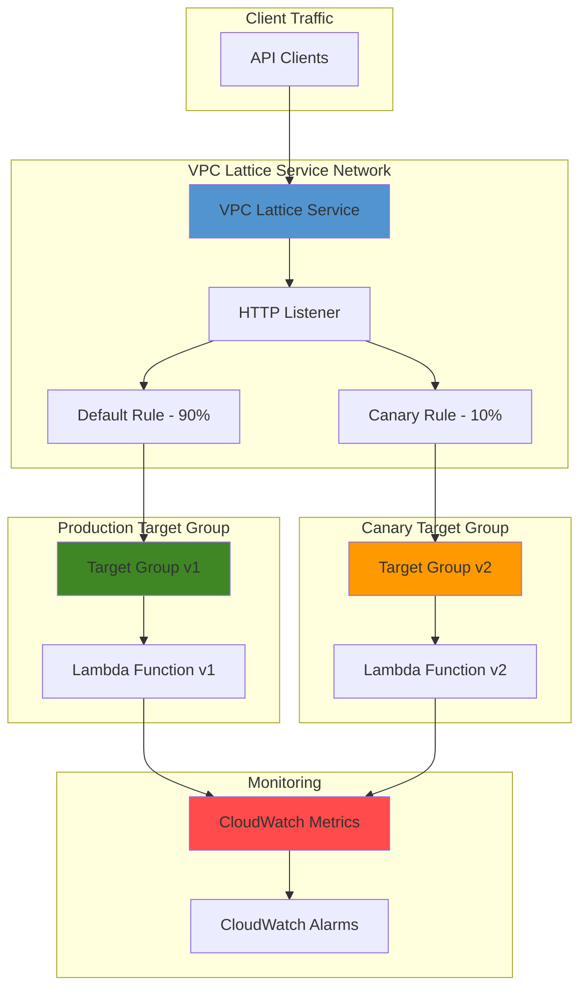

# Canary Deployments with VPC Lattice and Lambda

## Problem

Modern software development teams need to deploy new application versions safely without impacting all users simultaneously. Traditional blue-green deployments switch all traffic at once, creating risk for widespread issues. Organizations require a progressive deployment strategy that gradually shifts traffic to new versions while maintaining real-time monitoring and instant rollback capabilities if performance degrades or errors increase.

## Solution

Implement progressive canary deployments using VPC Lattice weighted routing to gradually shift traffic between Lambda function versions. VPC Lattice's listener rules enable precise traffic distribution between target groups containing different Lambda function versions, while CloudWatch provides comprehensive monitoring of performance metrics, error rates, and deployment health throughout the canary process.

## Architecture Diagram



## Prerequisites

1. AWS account with permissions for VPC Lattice, Lambda, CloudWatch, and IAM operations
2. AWS CLI v2 installed and configured (or use AWS CloudShell)
3. Basic understanding of serverless functions and application networking
4. Familiarity with canary deployment concepts and progressive delivery
5. Estimated cost: $5-15 for Lambda invocations, VPC Lattice processing, and CloudWatch monitoring during testing

> **Note**: VPC Lattice charges based on the number of requests processed and data transferred. Lambda charges per invocation and execution duration.

## Preparation

```bash
# Set environment variables
export AWS_REGION=$(aws configure get region)
export AWS_ACCOUNT_ID=$(aws sts get-caller-identity \
    --query Account --output text)

# Generate unique identifiers for resources
RANDOM_SUFFIX=$(aws secretsmanager get-random-password \
    --exclude-punctuation --exclude-uppercase \
    --password-length 6 --require-each-included-type \
    --output text --query RandomPassword)

export SERVICE_NAME="canary-demo-service-${RANDOM_SUFFIX}"
export FUNCTION_NAME="canary-demo-function-${RANDOM_SUFFIX}"
export SERVICE_NETWORK_NAME="canary-demo-network-${RANDOM_SUFFIX}"

# Create IAM execution role for Lambda functions
aws iam create-role \
    --role-name lambda-canary-execution-role-${RANDOM_SUFFIX} \
    --assume-role-policy-document '{
        "Version": "2012-10-17",
        "Statement": [
            {
                "Effect": "Allow",
                "Principal": {
                    "Service": "lambda.amazonaws.com"
                },
                "Action": "sts:AssumeRole"
            }
        ]
    }'

aws iam attach-role-policy \
    --role-name lambda-canary-execution-role-${RANDOM_SUFFIX} \
    --policy-arn arn:aws:iam::aws:policy/service-role/AWSLambdaBasicExecutionRole

# Add VPC Lattice invoke permissions
aws iam attach-role-policy \
    --role-name lambda-canary-execution-role-${RANDOM_SUFFIX} \
    --policy-arn arn:aws:iam::aws:policy/VPCLatticeServiceAccess

LAMBDA_ROLE_ARN=$(aws iam get-role \
    --role-name lambda-canary-execution-role-${RANDOM_SUFFIX} \
    --query 'Role.Arn' --output text)

echo "✅ AWS environment configured with unique suffix: ${RANDOM_SUFFIX}"
```

## Steps

1. **Create Lambda Function Version 1 (Production)**:

   AWS Lambda provides the foundation for our canary deployment by supporting multiple function versions. Version 1 represents our current production code that handles the baseline traffic. Creating distinct versions enables VPC Lattice to route traffic between different implementations while maintaining isolation and rollback capabilities.

   ```bash
   # Create simple Lambda function code for version 1
   cat > /tmp/lambda-v1.py << 'EOF'
import json
import time

def lambda_handler(event, context):
    return {
        'statusCode': 200,
        'headers': {
            'Content-Type': 'application/json'
        },
        'body': json.dumps({
            'version': 'v1.0.0',
            'message': 'Hello from production version',
            'timestamp': int(time.time()),
            'environment': 'production'
        })
    }
EOF
   
   # Package the function
   cd /tmp && zip lambda-v1.zip lambda-v1.py
   
   # Create Lambda function
   aws lambda create-function \
       --function-name ${FUNCTION_NAME} \
       --runtime python3.11 \
       --role ${LAMBDA_ROLE_ARN} \
       --handler lambda-v1.lambda_handler \
       --zip-file fileb://lambda-v1.zip \
       --timeout 30 \
       --memory-size 256 \
       --description "Production version for canary deployment demo"
   
   # Publish version 1
   LAMBDA_VERSION_1=$(aws lambda publish-version \
       --function-name ${FUNCTION_NAME} \
       --description "Production version 1.0.0" \
       --query 'Version' --output text)
   
   echo "✅ Lambda function version 1 created: ${LAMBDA_VERSION_1}"
   ```

2. **Create Lambda Function Version 2 (Canary)**:

   Version 2 represents our new canary deployment with enhanced functionality or bug fixes. This version will initially receive a small percentage of traffic to validate performance and functionality before full rollout. The canary version includes different response data to clearly identify which version processed each request.

   ```bash
   # Create enhanced Lambda function code for version 2
   cat > /tmp/lambda-v2.py << 'EOF'
import json
import time
import random

def lambda_handler(event, context):
    # Simulate enhanced features in canary version
    features = ['feature-a', 'feature-b', 'enhanced-logging']
    
    return {
        'statusCode': 200,
        'headers': {
            'Content-Type': 'application/json',
            'X-Version': 'v2.0.0'
        },
        'body': json.dumps({
            'version': 'v2.0.0',
            'message': 'Hello from canary version',
            'timestamp': int(time.time()),
            'environment': 'canary',
            'features': features,
            'response_time': random.randint(50, 200)
        })
    }
EOF
   
   # Update function code and publish version 2
   cd /tmp && zip lambda-v2.zip lambda-v2.py
   
   aws lambda update-function-code \
       --function-name ${FUNCTION_NAME} \
       --zip-file fileb://lambda-v2.zip
   
   # Wait for update to complete
   aws lambda wait function-updated \
       --function-name ${FUNCTION_NAME}
   
   # Publish version 2
   LAMBDA_VERSION_2=$(aws lambda publish-version \
       --function-name ${FUNCTION_NAME} \
       --description "Canary version 2.0.0 with enhanced features" \
       --query 'Version' --output text)
   
   echo "✅ Lambda function version 2 created: ${LAMBDA_VERSION_2}"
   ```

3. **Create VPC Lattice Service Network**:

   VPC Lattice service networks provide the logical application layer connectivity that enables service-to-service communication. The service network acts as the foundation for our canary deployment infrastructure, allowing us to define services and their routing policies independently of the underlying network topology.

   ```bash
   # Create VPC Lattice service network
   SERVICE_NETWORK_ID=$(aws vpc-lattice create-service-network \
       --name ${SERVICE_NETWORK_NAME} \
       --auth-type "NONE" \
       --query 'id' --output text)
   
   # Wait for service network to be active
   aws vpc-lattice get-service-network \
       --service-network-identifier ${SERVICE_NETWORK_ID} \
       --query 'status' --output text
   
   echo "✅ VPC Lattice service network created: ${SERVICE_NETWORK_ID}"
   ```

4. **Create Target Groups for Both Lambda Versions**:

   VPC Lattice target groups logically group our Lambda function versions, enabling independent health monitoring and traffic routing. Each target group represents a deployment target that can receive weighted traffic distribution. This separation allows precise control over canary deployment progression and instant rollback capabilities.

   ```bash
   # Create target group for production version (v1)
   PROD_TARGET_GROUP_ID=$(aws vpc-lattice create-target-group \
       --name "prod-targets-${RANDOM_SUFFIX}" \
       --type "LAMBDA" \
       --query 'id' --output text)
   
   # Register Lambda version 1 with production target group
   aws vpc-lattice register-targets \
       --target-group-identifier ${PROD_TARGET_GROUP_ID} \
       --targets id=${FUNCTION_NAME}:${LAMBDA_VERSION_1}
   
   # Create target group for canary version (v2)
   CANARY_TARGET_GROUP_ID=$(aws vpc-lattice create-target-group \
       --name "canary-targets-${RANDOM_SUFFIX}" \
       --type "LAMBDA" \
       --query 'id' --output text)
   
   # Register Lambda version 2 with canary target group
   aws vpc-lattice register-targets \
       --target-group-identifier ${CANARY_TARGET_GROUP_ID} \
       --targets id=${FUNCTION_NAME}:${LAMBDA_VERSION_2}
   
   echo "✅ Target groups created - Production: ${PROD_TARGET_GROUP_ID}"
   echo "✅ Target groups created - Canary: ${CANARY_TARGET_GROUP_ID}"
   ```

5. **Create VPC Lattice Service with Weighted Routing**:

   The VPC Lattice service defines the entry point for our application traffic and implements the core canary deployment logic through weighted routing rules. The listener configuration establishes how incoming requests are distributed between our production and canary target groups based on configurable weight percentages.

   ```bash
   # Create VPC Lattice service
   SERVICE_ID=$(aws vpc-lattice create-service \
       --name ${SERVICE_NAME} \
       --auth-type "NONE" \
       --query 'id' --output text)
   
   # Create HTTP listener with weighted routing for canary deployment
   LISTENER_ID=$(aws vpc-lattice create-listener \
       --service-identifier ${SERVICE_ID} \
       --name "canary-listener" \
       --protocol "HTTP" \
       --port 80 \
       --default-action '{
           "forward": {
               "targetGroups": [
                   {
                       "targetGroupIdentifier": "'${PROD_TARGET_GROUP_ID}'",
                       "weight": 90
                   },
                   {
                       "targetGroupIdentifier": "'${CANARY_TARGET_GROUP_ID}'",
                       "weight": 10
                   }
               ]
           }
       }' \
       --query 'id' --output text)
   
   # Associate service with service network
   aws vpc-lattice create-service-network-service-association \
       --service-network-identifier ${SERVICE_NETWORK_ID} \
       --service-identifier ${SERVICE_ID}
   
   echo "✅ VPC Lattice service created with 90/10 traffic split"
   echo "✅ Service ID: ${SERVICE_ID}"
   echo "✅ Listener ID: ${LISTENER_ID}"
   ```

6. **Configure CloudWatch Monitoring and Alarms**:

   CloudWatch monitoring provides real-time visibility into canary deployment health through custom metrics and automated alarms. These monitoring capabilities enable automatic rollback triggers based on error rates, latency thresholds, or custom business metrics, ensuring deployment safety and rapid incident response.

   ```bash
   # Create CloudWatch alarm for Lambda errors in canary version
   aws cloudwatch put-metric-alarm \
       --alarm-name "canary-lambda-errors-${RANDOM_SUFFIX}" \
       --alarm-description "Monitor errors in canary Lambda version" \
       --metric-name "Errors" \
       --namespace "AWS/Lambda" \
       --statistic "Sum" \
       --period 300 \
       --evaluation-periods 2 \
       --threshold 5 \
       --comparison-operator "GreaterThanThreshold" \
       --dimensions Name=FunctionName,Value=${FUNCTION_NAME} \
                    Name=Resource,Value=${FUNCTION_NAME}:${LAMBDA_VERSION_2}
   
   # Create CloudWatch alarm for Lambda duration in canary version
   aws cloudwatch put-metric-alarm \
       --alarm-name "canary-lambda-duration-${RANDOM_SUFFIX}" \
       --alarm-description "Monitor duration in canary Lambda version" \
       --metric-name "Duration" \
       --namespace "AWS/Lambda" \
       --statistic "Average" \
       --period 300 \
       --evaluation-periods 2 \
       --threshold 5000 \
       --comparison-operator "GreaterThanThreshold" \
       --dimensions Name=FunctionName,Value=${FUNCTION_NAME} \
                    Name=Resource,Value=${FUNCTION_NAME}:${LAMBDA_VERSION_2}
   
   echo "✅ CloudWatch alarms configured for canary monitoring"
   ```

7. **Test Canary Deployment with Progressive Traffic Shift**:

   Progressive traffic shifting validates canary deployment functionality by gradually increasing load on the new version while monitoring key performance indicators. This controlled approach minimizes risk while providing confidence in the new version's stability and performance characteristics.

   ```bash
   # Get service DNS name for testing
   SERVICE_DNS=$(aws vpc-lattice get-service \
       --service-identifier ${SERVICE_ID} \
       --query 'dnsEntry.domainName' --output text)
   
   echo "Testing initial 90/10 traffic split..."
   
   # Send test requests to observe traffic distribution
   for i in {1..20}; do
       echo "Request $i:"
       curl -s "https://${SERVICE_DNS}" | \
           jq -r '.body | fromjson | .version' 2>/dev/null || \
           echo "Request failed"
       sleep 1
   done
   
   echo ""
   echo "Shifting to 70/30 traffic split..."
   
   # Update listener to shift more traffic to canary
   aws vpc-lattice update-listener \
       --service-identifier ${SERVICE_ID} \
       --listener-identifier ${LISTENER_ID} \
       --default-action '{
           "forward": {
               "targetGroups": [
                   {
                       "targetGroupIdentifier": "'${PROD_TARGET_GROUP_ID}'",
                       "weight": 70
                   },
                   {
                       "targetGroupIdentifier": "'${CANARY_TARGET_GROUP_ID}'",
                       "weight": 30
                   }
               ]
           }
       }'
   
   echo "✅ Traffic shifted to 70/30 split (prod/canary)"
   ```

8. **Implement Automatic Rollback Capability**:

   Automatic rollback capabilities provide safety mechanisms that instantly revert traffic distribution when canary metrics exceed acceptable thresholds. This implementation demonstrates how CloudWatch alarms can trigger automated responses to protect user experience during problematic deployments.

   ```bash
   # Create SNS topic for rollback notifications
   ROLLBACK_TOPIC_ARN=$(aws sns create-topic \
       --name "canary-rollback-${RANDOM_SUFFIX}" \
       --query 'TopicArn' --output text)
   
   # Create Lambda function for automatic rollback
   cat > /tmp/rollback-function.py << 'EOF'
import boto3
import json
import os

def lambda_handler(event, context):
    lattice = boto3.client('vpc-lattice')
    
    # Parse CloudWatch alarm
    message = json.loads(event['Records'][0]['Sns']['Message'])
    alarm_name = message['AlarmName']
    
    if 'canary' in alarm_name and message['NewStateValue'] == 'ALARM':
        # Rollback to 100% production traffic
        try:
            lattice.update_listener(
                serviceIdentifier=os.environ['SERVICE_ID'],
                listenerIdentifier=os.environ['LISTENER_ID'],
                defaultAction={
                    'forward': {
                        'targetGroups': [
                            {
                                'targetGroupIdentifier': os.environ['PROD_TARGET_GROUP_ID'],
                                'weight': 100
                            }
                        ]
                    }
                }
            )
            print(f"Automatic rollback triggered by alarm: {alarm_name}")
            return {'statusCode': 200, 'body': 'Rollback successful'}
        except Exception as e:
            print(f"Rollback failed: {str(e)}")
            return {'statusCode': 500, 'body': f'Rollback failed: {str(e)}'}
    
    return {'statusCode': 200, 'body': 'No action required'}
EOF
   
   # Package and create rollback function
   cd /tmp && zip rollback-function.zip rollback-function.py
   
   aws lambda create-function \
       --function-name "canary-rollback-${RANDOM_SUFFIX}" \
       --runtime python3.11 \
       --role ${LAMBDA_ROLE_ARN} \
       --handler rollback-function.lambda_handler \
       --zip-file fileb://rollback-function.zip \
       --environment Variables='{
           "SERVICE_ID": "'${SERVICE_ID}'",
           "LISTENER_ID": "'${LISTENER_ID}'",
           "PROD_TARGET_GROUP_ID": "'${PROD_TARGET_GROUP_ID}'"
       }'
   
   echo "✅ Automatic rollback function created"
   ```

## Validation & Testing

1. **Verify VPC Lattice Service and Target Group Health**:

   ```bash
   # Check VPC Lattice service status
   aws vpc-lattice get-service \
       --service-identifier ${SERVICE_ID} \
       --query 'status'
   
   # Verify target group health
   aws vpc-lattice list-targets \
       --target-group-identifier ${PROD_TARGET_GROUP_ID}
   
   aws vpc-lattice list-targets \
       --target-group-identifier ${CANARY_TARGET_GROUP_ID}
   ```

   Expected output: Service status should be "ACTIVE" and all targets should show "HEALTHY" status.

2. **Test Traffic Distribution and Version Responses**:

   ```bash
   # Test multiple requests to verify traffic distribution
   echo "Testing traffic distribution over 50 requests..."
   v1_count=0
   v2_count=0
   
   for i in {1..50}; do
       response=$(curl -s "https://${SERVICE_DNS}")
       if echo "$response" | grep -q '"version": "v1.0.0"'; then
           ((v1_count++))
       elif echo "$response" | grep -q '"version": "v2.0.0"'; then
           ((v2_count++))
       fi
   done
   
   echo "V1 (Production) requests: $v1_count"
   echo "V2 (Canary) requests: $v2_count"
   echo "Expected ratio: ~70/30 based on current weights"
   ```

3. **Validate CloudWatch Metrics and Monitoring**:

   ```bash
   # Check Lambda invocation metrics
   aws cloudwatch get-metric-statistics \
       --namespace AWS/Lambda \
       --metric-name Invocations \
       --dimensions Name=FunctionName,Value=${FUNCTION_NAME} \
       --start-time $(date -u -d '1 hour ago' +%Y-%m-%dT%H:%M:%S) \
       --end-time $(date -u +%Y-%m-%dT%H:%M:%S) \
       --period 300 \
       --statistics Sum
   
   # Check alarm states
   aws cloudwatch describe-alarms \
       --alarm-names "canary-lambda-errors-${RANDOM_SUFFIX}" \
                     "canary-lambda-duration-${RANDOM_SUFFIX}"
   ```

## Cleanup

1. **Remove VPC Lattice Service and Associations**:

   ```bash
   # Remove service network association
   ASSOCIATION_ID=$(aws vpc-lattice list-service-network-service-associations \
       --service-network-identifier ${SERVICE_NETWORK_ID} \
       --query 'items[0].id' --output text)
   
   if [ "$ASSOCIATION_ID" != "null" ] && [ -n "$ASSOCIATION_ID" ]; then
       aws vpc-lattice delete-service-network-service-association \
           --service-network-service-association-identifier ${ASSOCIATION_ID}
   fi
   
   # Delete VPC Lattice service
   aws vpc-lattice delete-service \
       --service-identifier ${SERVICE_ID}
   
   echo "✅ VPC Lattice service deleted"
   ```

2. **Remove Target Groups and Service Network**:

   ```bash
   # Delete target groups
   aws vpc-lattice delete-target-group \
       --target-group-identifier ${PROD_TARGET_GROUP_ID}
   
   aws vpc-lattice delete-target-group \
       --target-group-identifier ${CANARY_TARGET_GROUP_ID}
   
   # Delete service network
   aws vpc-lattice delete-service-network \
       --service-network-identifier ${SERVICE_NETWORK_ID}
   
   echo "✅ Target groups and service network deleted"
   ```

3. **Remove Lambda Functions and IAM Resources**:

   ```bash
   # Delete Lambda functions
   aws lambda delete-function \
       --function-name ${FUNCTION_NAME}
   
   aws lambda delete-function \
       --function-name "canary-rollback-${RANDOM_SUFFIX}"
   
   # Delete IAM role
   aws iam detach-role-policy \
       --role-name lambda-canary-execution-role-${RANDOM_SUFFIX} \
       --policy-arn arn:aws:iam::aws:policy/service-role/AWSLambdaBasicExecutionRole
   
   aws iam detach-role-policy \
       --role-name lambda-canary-execution-role-${RANDOM_SUFFIX} \
       --policy-arn arn:aws:iam::aws:policy/VPCLatticeServiceAccess
   
   aws iam delete-role \
       --role-name lambda-canary-execution-role-${RANDOM_SUFFIX}
   
   echo "✅ Lambda functions and IAM resources deleted"
   ```

4. **Remove CloudWatch Resources**:

   ```bash
   # Delete CloudWatch alarms
   aws cloudwatch delete-alarms \
       --alarm-names "canary-lambda-errors-${RANDOM_SUFFIX}" \
                     "canary-lambda-duration-${RANDOM_SUFFIX}"
   
   # Delete SNS topic
   aws sns delete-topic --topic-arn ${ROLLBACK_TOPIC_ARN}
   
   # Clean up temporary files
   rm -f /tmp/lambda-v1.* /tmp/lambda-v2.* /tmp/rollback-function.*
   
   echo "✅ CloudWatch resources and temporary files cleaned up"
   ```

## Discussion

This recipe demonstrates advanced canary deployment capabilities by combining VPC Lattice's sophisticated traffic routing with Lambda's version management system. VPC Lattice provides network-level traffic distribution that operates independently of Lambda's built-in alias routing, offering greater control over progressive deployments across complex service architectures. The weighted routing mechanism enables precise traffic percentage control, allowing teams to gradually increase canary traffic from 10% to 30% to 50% and eventually to 100% based on performance validation.

VPC Lattice's service mesh architecture abstracts network complexity while providing enterprise-grade features like automatic health checking, cross-VPC connectivity, and fine-grained access controls. This approach surpasses traditional load balancer solutions by offering dynamic routing capabilities that respond to real-time application performance metrics. The target group abstraction enables independent scaling and health monitoring for each version, supporting sophisticated deployment strategies like ring deployments or blue-green variants.

The integration with CloudWatch provides comprehensive observability throughout the canary process, enabling automated rollback mechanisms based on custom business metrics beyond simple error rates. Teams can define deployment gates based on conversion rates, response times, or domain-specific KPIs. The automatic rollback capability ensures that problematic deployments are immediately contained, minimizing blast radius and protecting user experience. This monitoring approach follows AWS Well-Architected principles by implementing operational excellence through automation and reliability through rapid failure recovery.

Cost optimization emerges naturally from this serverless approach, as Lambda charges only for actual invocations while VPC Lattice pricing scales with request volume. Teams benefit from reduced operational overhead compared to managing traditional load balancers and container orchestration platforms. The declarative configuration supports infrastructure-as-code practices, enabling version-controlled deployment policies and automated testing of routing configurations.

> **Tip**: Configure custom CloudWatch metrics specific to your application's success criteria, such as business transaction completion rates or user engagement metrics, to create more intelligent deployment gates beyond technical metrics.

For additional guidance, consult the [VPC Lattice User Guide](https://docs.aws.amazon.com/vpc-lattice/latest/ug/), [Lambda Deployment Best Practices](https://docs.aws.amazon.com/lambda/latest/dg/best-practices.html), [AWS Well-Architected Operational Excellence Pillar](https://docs.aws.amazon.com/wellarchitected/latest/operational-excellence-pillar/), [CloudWatch Monitoring Best Practices](https://docs.aws.amazon.com/AmazonCloudWatch/latest/monitoring/), and [Canary Deployment Patterns](https://docs.aws.amazon.com/whitepapers/latest/overview-deployment-options/canary-deployments.html).

## Challenge

Extend this solution by implementing these enhancements:

1. **Multi-Region Canary Deployments**: Implement cross-region canary deployments using VPC Lattice service networks in multiple AWS regions with Route 53 health checks to route traffic based on regional canary performance.

2. **Advanced Deployment Gates**: Create sophisticated deployment progression logic using AWS Step Functions that automatically advances canary percentages based on multiple metric thresholds, business KPIs, and time-based gates.

3. **A/B Testing Integration**: Extend the weighted routing to support A/B testing scenarios with header-based routing rules that direct specific user segments to different Lambda versions while maintaining overall traffic distribution.

4. **Container Integration**: Integrate this pattern with ECS or EKS services running in target groups alongside Lambda functions, demonstrating hybrid serverless-container canary deployments through VPC Lattice's multi-target support.

5. **Custom Metrics and Business Logic**: Implement custom CloudWatch metrics from within the Lambda functions that track business-specific success criteria (conversion rates, user engagement) and use these metrics to drive deployment decisions.

## Infrastructure Code

*Infrastructure code will be generated after recipe approval.*