# Carbon Footprint Analytics with QuickSight

## Problem

Enterprise organizations struggle to correlate their cloud carbon footprint with cost optimization efforts, often managing sustainability reporting and financial management in separate silos. Without integrated visibility into carbon emissions trends alongside spending patterns, teams cannot identify opportunities where cost reduction initiatives simultaneously reduce environmental impact, missing dual optimization benefits that enhance both financial and sustainability performance.

## Solution

Create an automated sustainability intelligence platform using AWS Customer Carbon Footprint Tool for emissions tracking, Amazon QuickSight for advanced visualization, AWS Cost Explorer API for cost correlation, and AWS Lambda for automated data processing. This integrated approach enables regular carbon footprint monitoring with intelligent cost optimization recommendations, providing actionable insights that drive both environmental responsibility and financial efficiency across cloud operations.

## Architecture Diagram

```mermaid
graph TB
    subgraph "Data Sources"
        CCFT[AWS Customer Carbon Footprint Tool]
        CE[AWS Cost Explorer API]
        CW[CloudWatch Metrics]
    end
    
    subgraph "Processing Layer"
        LAMBDA[Lambda Function<br/>Data Processor]
        S3[S3 Data Lake<br/>Sustainability Analytics]
    end
    
    subgraph "Analytics & Visualization"
        QS[QuickSight Dashboard<br/>Sustainability Intelligence]
        ALERT[CloudWatch Alarms<br/>Threshold Monitoring]
    end
    
    subgraph "Automation"
        EB[EventBridge<br/>Scheduled Triggers]
        SNS[SNS Notifications<br/>Sustainability Alerts]
    end
    
    CCFT-->LAMBDA
    CE-->LAMBDA
    CW-->LAMBDA
    LAMBDA-->S3
    S3-->QS
    LAMBDA-->ALERT
    EB-->LAMBDA
    ALERT-->SNS
    
    style S3 fill:#FF9900
    style QS fill:#3F8624
    style LAMBDA fill:#FF9900
    style CCFT fill:#232F3E
```



## Prerequisites

1. AWS account with billing access and appropriate permissions for Cost Management, QuickSight, and Lambda
2. AWS CLI installed and configured (or AWS CloudShell)
3. Basic understanding of AWS sustainability concepts and carbon footprint methodology
4. Knowledge of data visualization principles and QuickSight dashboard creation
5. Estimated cost: $25-50/month for QuickSight Standard edition ($9/user/month annual), Lambda executions, and S3 storage

> **Note**: This recipe follows AWS Well-Architected Framework sustainability principles. Review the [AWS Well-Architected Framework Sustainability Pillar](https://docs.aws.amazon.com/wellarchitected/latest/sustainability-pillar/sustainability-pillar.html) for comprehensive guidance on building sustainable cloud solutions.

## Preparation

```bash
# Set environment variables
export AWS_REGION=$(aws configure get region)
export AWS_ACCOUNT_ID=$(aws sts get-caller-identity \
    --query Account --output text)

# Generate unique identifiers for resources
RANDOM_SUFFIX=$(aws secretsmanager get-random-password \
    --exclude-punctuation --exclude-uppercase \
    --password-length 6 --require-each-included-type \
    --output text --query RandomPassword)

# Set resource names
export BUCKET_NAME="sustainability-analytics-${RANDOM_SUFFIX}"
export FUNCTION_NAME="sustainability-data-processor-${RANDOM_SUFFIX}"
export ROLE_NAME="SustainabilityAnalyticsRole-${RANDOM_SUFFIX}"

# Create S3 bucket for sustainability data lake
aws s3 mb s3://${BUCKET_NAME} --region ${AWS_REGION}

aws s3api put-bucket-versioning \
    --bucket ${BUCKET_NAME} \
    --versioning-configuration Status=Enabled

aws s3api put-bucket-encryption \
    --bucket ${BUCKET_NAME} \
    --server-side-encryption-configuration \
    'Rules=[{ApplyServerSideEncryptionByDefault:{SSEAlgorithm:AES256}}]'

echo "✅ AWS environment configured with sustainability data lake"
```

## Steps

1. **Create IAM Role for Sustainability Analytics**:

   AWS Lambda requires appropriate permissions to access the Customer Carbon Footprint Tool data exports, Cost Explorer API, and S3 storage. This IAM role implements least privilege access while enabling comprehensive sustainability data collection and analysis across cost management and carbon footprint services. The role follows AWS security best practices by restricting access to only necessary services and resources.

   ```bash
   # Create trust policy for Lambda
   cat > trust-policy.json << EOF
   {
     "Version": "2012-10-17",
     "Statement": [
       {
         "Effect": "Allow",
         "Principal": {
           "Service": "lambda.amazonaws.com"
         },
         "Action": "sts:AssumeRole"
       }
     ]
   }
   EOF
   
   # Create IAM role
   aws iam create-role \
       --role-name ${ROLE_NAME} \
       --assume-role-policy-document file://trust-policy.json
   
   # Attach managed policies for basic Lambda execution
   aws iam attach-role-policy \
       --role-name ${ROLE_NAME} \
       --policy-arn arn:aws:iam::aws:policy/service-role/AWSLambdaBasicExecutionRole
   
   echo "✅ IAM role created for sustainability analytics"
   ```

   The IAM role is now configured with basic Lambda execution permissions. This establishes the foundation for secure access to AWS services while maintaining the principle of least privilege access control.

2. **Create Custom Policy for Carbon Footprint and Cost Access**:

   This custom policy grants the Lambda function necessary permissions to access both carbon footprint data and cost management APIs, enabling comprehensive sustainability-cost correlation analysis while maintaining security best practices. The policy specifically allows access to Cost Explorer APIs for retrieving cost and usage data, and S3 operations for data lake storage.

   ```bash
   # Create custom policy for sustainability analytics
   cat > sustainability-policy.json << EOF
   {
     "Version": "2012-10-17",
     "Statement": [
       {
         "Effect": "Allow",
         "Action": [
           "ce:GetCostAndUsage",
           "ce:GetUsageForecast",
           "ce:GetCostCategories",
           "ce:GetDimensionValues",
           "ce:GetRightsizingRecommendation",
           "cur:DescribeReportDefinitions",
           "cur:GetClassicReport",
           "s3:GetObject",
           "s3:PutObject",
           "s3:ListBucket",
           "cloudwatch:PutMetricData"
         ],
         "Resource": [
           "arn:aws:s3:::${BUCKET_NAME}",
           "arn:aws:s3:::${BUCKET_NAME}/*",
           "arn:aws:cur:*:${AWS_ACCOUNT_ID}:report/*",
           "*"
         ]
       },
       {
         "Effect": "Allow",
         "Action": [
           "quicksight:CreateDataSet",
           "quicksight:UpdateDataSet",
           "quicksight:CreateDashboard",
           "quicksight:UpdateDashboard",
           "quicksight:DescribeDataSet"
         ],
         "Resource": "*"
       }
     ]
   }
   EOF
   
   # Create and attach custom policy
   aws iam create-policy \
       --policy-name SustainabilityAnalyticsPolicy-${RANDOM_SUFFIX} \
       --policy-document file://sustainability-policy.json
   
   aws iam attach-role-policy \
       --role-name ${ROLE_NAME} \
       --policy-arn arn:aws:iam::${AWS_ACCOUNT_ID}:policy/SustainabilityAnalyticsPolicy-${RANDOM_SUFFIX}
   
   echo "✅ Custom permissions configured for carbon footprint and cost data access"
   ```

   The Lambda function now has comprehensive access to AWS billing and cost management APIs, enabling automated data collection for sustainability analytics while maintaining secure, auditable access controls.

3. **Create Lambda Function for Data Processing**:

   AWS Lambda provides serverless compute for automated data collection and processing from multiple AWS sustainability and cost APIs. This function implements intelligent data correlation algorithms that identify relationships between carbon emissions patterns and cost optimization opportunities, enabling proactive sustainability management. The function processes Cost Explorer data to create sustainability-cost correlation insights.

   ```bash
   # Create Lambda function code
   cat > sustainability_processor.py << 'EOF'
   import json
   import boto3
   from datetime import datetime, timedelta
   import logging
   import os
   
   logger = logging.getLogger()
   logger.setLevel(logging.INFO)
   
   def lambda_handler(event, context):
       """
       Process sustainability and cost data to create integrated analytics.
       AWS Customer Carbon Footprint Tool data is available with a 3-month delay.
       This function correlates cost data with carbon footprint insights.
       """
       
       try:
           # Initialize AWS clients
           ce_client = boto3.client('ce')
           s3_client = boto3.client('s3')
           cloudwatch = boto3.client('cloudwatch')
           
           # Get environment variables
           bucket_name = event.get('bucket_name', os.environ.get('BUCKET_NAME'))
           
           # Calculate date range (last 6 months for comprehensive analysis)
           end_date = datetime.now()
           start_date = end_date - timedelta(days=180)
           
           logger.info(f"Processing sustainability data from {start_date.date()} to {end_date.date()}")
           
           # Fetch cost data from Cost Explorer
           cost_response = ce_client.get_cost_and_usage(
               TimePeriod={
                   'Start': start_date.strftime('%Y-%m-%d'),
                   'End': end_date.strftime('%Y-%m-%d')
               },
               Granularity='MONTHLY',
               Metrics=['UnblendedCost'],
               GroupBy=[
                   {'Type': 'DIMENSION', 'Key': 'SERVICE'},
                   {'Type': 'DIMENSION', 'Key': 'REGION'}
               ]
           )
           
           # Get cost optimization recommendations
           rightsizing_response = ce_client.get_rightsizing_recommendation(
               Service='AmazonEC2',
               Configuration={
                   'BenefitsConsidered': True,
                   'RecommendationTarget': 'CROSS_INSTANCE_FAMILY'
               }
           )
           
           # Process cost data for sustainability correlation
           processed_data = {
               'timestamp': datetime.now().isoformat(),
               'data_collection_metadata': {
                   'aws_region': os.environ.get('AWS_REGION'),
                   'processing_date': datetime.now().isoformat(),
                   'analysis_period_days': 180,
                   'data_source': 'AWS Cost Explorer API'
               },
               'cost_data': cost_response['ResultsByTime'],
               'optimization_recommendations': rightsizing_response,
               'sustainability_metrics': {
                   'cost_optimization_opportunities': len(rightsizing_response.get('RightsizingRecommendations', [])),
                   'total_services_analyzed': len(set([
                       group['Keys'][0] for result in cost_response['ResultsByTime']
                       for group in result.get('Groups', [])
                   ])),
                   'carbon_footprint_notes': 'AWS Customer Carbon Footprint Tool data available with 3-month delay via billing console'
               }
           }
           
           # Save processed data to S3 with date partitioning
           s3_key = f"sustainability-analytics/{datetime.now().strftime('%Y/%m/%d')}/processed_data_{datetime.now().strftime('%H%M%S')}.json"
           
           s3_client.put_object(
               Bucket=bucket_name,
               Key=s3_key,
               Body=json.dumps(processed_data, default=str, indent=2),
               ContentType='application/json',
               Metadata={
                   'processing-date': datetime.now().isoformat(),
                   'data-type': 'sustainability-analytics'
               }
           )
           
           # Send custom metric to CloudWatch
           cloudwatch.put_metric_data(
               Namespace='SustainabilityAnalytics',
               MetricData=[
                   {
                       'MetricName': 'DataProcessingSuccess',
                       'Value': 1,
                       'Unit': 'Count',
                       'Dimensions': [
                           {
                               'Name': 'FunctionName',
                               'Value': context.function_name
                           }
                       ]
                   }
               ]
           )
           
           logger.info(f"Successfully processed sustainability data and saved to {s3_key}")
           
           return {
               'statusCode': 200,
               'body': json.dumps({
                   'message': 'Sustainability data processed successfully',
                   's3_location': f's3://{bucket_name}/{s3_key}',
                   'metrics': processed_data['sustainability_metrics']
               })
           }
           
       except Exception as e:
           logger.error(f"Error processing sustainability data: {str(e)}")
           
           # Send error metric to CloudWatch
           try:
               cloudwatch = boto3.client('cloudwatch')
               cloudwatch.put_metric_data(
                   Namespace='SustainabilityAnalytics',
                   MetricData=[
                       {
                           'MetricName': 'DataProcessingError',
                           'Value': 1,
                           'Unit': 'Count'
                       }
                   ]
               )
           except Exception as cw_error:
               logger.error(f"Error sending CloudWatch metric: {str(cw_error)}")
           
           return {
               'statusCode': 500,
               'body': json.dumps({'error': str(e)})
           }
   EOF
   
   # Package Lambda function
   zip -r function.zip sustainability_processor.py
   
   # Get role ARN
   ROLE_ARN=$(aws iam get-role --role-name ${ROLE_NAME} \
       --query Role.Arn --output text)
   
   # Create Lambda function with updated Python runtime
   aws lambda create-function \
       --function-name ${FUNCTION_NAME} \
       --runtime python3.12 \
       --role ${ROLE_ARN} \
       --handler sustainability_processor.lambda_handler \
       --zip-file fileb://function.zip \
       --timeout 300 \
       --memory-size 512 \
       --environment Variables="{BUCKET_NAME=${BUCKET_NAME}}" \
       --description "Processes AWS sustainability and cost data for analytics"
   
   echo "✅ Lambda function created for automated sustainability data processing"
   ```

   The Lambda function is now deployed with comprehensive error handling and CloudWatch metrics integration. This serverless approach ensures cost-effective processing that scales automatically while providing detailed logging and monitoring capabilities for troubleshooting and optimization.

4. **Configure EventBridge Schedule for Automated Data Collection**:

   Amazon EventBridge enables automated, scheduled execution of our sustainability data collection process. This serverless scheduler triggers the Lambda function monthly to align with AWS Customer Carbon Footprint Tool data availability, ensuring consistent and timely sustainability analytics updates without manual intervention. The schedule follows AWS best practices for cost-effective automation.

   ```bash
   # Create EventBridge rule for monthly execution
   aws events put-rule \
       --name "sustainability-data-collection-${RANDOM_SUFFIX}" \
       --schedule-expression "rate(30 days)" \
       --description "Monthly sustainability data collection and processing" \
       --state ENABLED
   
   # Add Lambda function as target with input transformation
   aws events put-targets \
       --rule "sustainability-data-collection-${RANDOM_SUFFIX}" \
       --targets "Id"="1","Arn"="arn:aws:lambda:${AWS_REGION}:${AWS_ACCOUNT_ID}:function:${FUNCTION_NAME}","Input"="{\"bucket_name\":\"${BUCKET_NAME}\",\"trigger_source\":\"eventbridge\"}"
   
   # Grant EventBridge permission to invoke Lambda
   aws lambda add-permission \
       --function-name ${FUNCTION_NAME} \
       --statement-id "allow-eventbridge-${RANDOM_SUFFIX}" \
       --action "lambda:InvokeFunction" \
       --principal events.amazonaws.com \
       --source-arn "arn:aws:events:${AWS_REGION}:${AWS_ACCOUNT_ID}:rule/sustainability-data-collection-${RANDOM_SUFFIX}"
   
   echo "✅ Automated data collection scheduled via EventBridge"
   ```

   The automated scheduling system is now active, ensuring regular data collection that aligns with AWS billing cycles and carbon footprint data availability. This eliminates manual intervention while maintaining data freshness for sustainability analytics.

5. **Set Up QuickSight Account and Data Source**:

   Amazon QuickSight provides enterprise-grade business intelligence capabilities for sustainability analytics. Setting up QuickSight with S3 integration enables sophisticated visualization of carbon footprint trends, cost correlations, and optimization opportunities through interactive dashboards that support data-driven sustainability decision making. QuickSight's SPICE engine accelerates query performance for large sustainability datasets.

   ```bash
   # Check if QuickSight is already set up
   QS_USER=$(aws quicksight describe-user \
       --aws-account-id ${AWS_ACCOUNT_ID} \
       --namespace default \
       --user-name $(aws sts get-caller-identity --query Arn --output text | cut -d'/' -f2) \
       --query User.UserName --output text 2>/dev/null || echo "not-found")
   
   if [ "$QS_USER" = "not-found" ]; then
       echo "QuickSight account setup required. Please complete these steps:"
       echo "1. Navigate to QuickSight service in AWS Console"
       echo "2. Sign up for QuickSight Standard edition (\$9/month per user with annual commitment)"
       echo "3. Grant S3 access permissions during setup"
       echo "4. Enable access to Cost Explorer data"
       echo "5. Return here to continue with data source creation"
       echo ""
       echo "QuickSight Console: https://${AWS_REGION}.quicksight.aws.amazon.com/"
   else
       echo "✅ QuickSight account already configured for user: ${QS_USER}"
   fi
   
   # Create S3 data source configuration (to be executed after QuickSight setup)
   cat > quicksight-datasource.json << EOF
   {
     "DataSourceId": "sustainability-analytics-${RANDOM_SUFFIX}",
     "Name": "Sustainability Analytics Data Source",
     "Type": "S3",
     "DataSourceParameters": {
       "S3Parameters": {
         "ManifestFileLocation": {
           "Bucket": "${BUCKET_NAME}",
           "Key": "manifests/sustainability-manifest.json"
         }
       }
     },
     "Permissions": [
       {
         "Principal": "arn:aws:quicksight:${AWS_REGION}:${AWS_ACCOUNT_ID}:user/default/${QS_USER}",
         "Actions": [
           "quicksight:DescribeDataSource",
           "quicksight:DescribeDataSourcePermissions",
           "quicksight:PassDataSource"
         ]
       }
     ]
   }
   EOF
   
   echo "✅ QuickSight data source configuration prepared"
   ```

   QuickSight is configured to access our sustainability data lake, enabling powerful analytics and visualization capabilities. The data source configuration supports automatic data refresh and enterprise security controls for sustainable business intelligence.

6. **Create S3 Manifest File for QuickSight Integration**:

   S3 manifest files define the data structure and location for QuickSight to access our sustainability analytics data. This configuration enables QuickSight to automatically discover and process time-series carbon footprint and cost data, supporting dynamic dashboard updates as new data becomes available through our automated collection process. The manifest supports JSON data format for flexible schema evolution.

   ```bash
   # Create manifest file for QuickSight data discovery
   cat > sustainability-manifest.json << EOF
   {
     "fileLocations": [
       {
         "URIPrefixes": [
           "s3://${BUCKET_NAME}/sustainability-analytics/"
         ]
       }
     ],
     "globalUploadSettings": {
       "format": "JSON",
       "delimiter": ",",
       "textqualifier": "\"",
       "containsHeader": "true"
     }
   }
   EOF
   
   # Upload manifest to S3
   aws s3 cp sustainability-manifest.json \
       s3://${BUCKET_NAME}/manifests/sustainability-manifest.json \
       --metadata "purpose=quicksight-manifest,data-type=sustainability-analytics"
   
   # Trigger initial data collection to populate the data lake
   aws lambda invoke \
       --function-name ${FUNCTION_NAME} \
       --payload "{\"bucket_name\":\"${BUCKET_NAME}\",\"trigger_source\":\"manual\"}" \
       response.json
   
   cat response.json
   
   echo "✅ S3 manifest created and initial data collection triggered"
   ```

   The S3 manifest is now available for QuickSight integration, and initial sustainability data has been collected. This establishes the data foundation required for building comprehensive sustainability dashboards and analytics.

7. **Configure CloudWatch Alarms for Sustainability Thresholds**:

   Amazon CloudWatch enables proactive monitoring of sustainability metrics with customizable thresholds for carbon footprint increases or cost optimization opportunities. These alarms provide automated notifications when sustainability targets are at risk, enabling rapid response to environmental impact changes and supporting continuous improvement in cloud sustainability practices. The monitoring system follows AWS operational excellence principles.

   ```bash
   # Create SNS topic for sustainability alerts
   SNS_TOPIC_ARN=$(aws sns create-topic \
       --name "sustainability-alerts-${RANDOM_SUFFIX}" \
       --query TopicArn --output text)
   
   # Subscribe to email notifications (uncomment and replace with your email)
   # aws sns subscribe \
   #     --topic-arn ${SNS_TOPIC_ARN} \
   #     --protocol email \
   #     --notification-endpoint your-email@example.com
   
   # Create CloudWatch alarm for Lambda processing failures
   aws cloudwatch put-metric-alarm \
       --alarm-name "SustainabilityDataProcessingFailure-${RANDOM_SUFFIX}" \
       --alarm-description "Alert when sustainability data processing fails" \
       --metric-name "Errors" \
       --namespace "AWS/Lambda" \
       --statistic "Sum" \
       --period 300 \
       --threshold 1 \
       --comparison-operator "GreaterThanOrEqualToThreshold" \
       --evaluation-periods 1 \
       --alarm-actions "${SNS_TOPIC_ARN}" \
       --dimensions Name=FunctionName,Value=${FUNCTION_NAME}
   
   # Create custom alarm for sustainability data processing success
   aws cloudwatch put-metric-alarm \
       --alarm-name "SustainabilityDataProcessingSuccess-${RANDOM_SUFFIX}" \
       --alarm-description "Monitor successful sustainability data processing" \
       --metric-name "DataProcessingSuccess" \
       --namespace "SustainabilityAnalytics" \
       --statistic "Sum" \
       --period 86400 \
       --threshold 1 \
       --comparison-operator "LessThanThreshold" \
       --evaluation-periods 1 \
       --alarm-actions "${SNS_TOPIC_ARN}" \
       --treat-missing-data "breaching"
   
   echo "✅ CloudWatch alarms configured for sustainability monitoring"
   ```

   Comprehensive monitoring is now active for both system health and sustainability data processing success. This provides operational visibility and automated alerting for maintaining reliable sustainability analytics capabilities.

8. **Create QuickSight Dashboard for Sustainability Intelligence**:

   Amazon QuickSight dashboards transform raw sustainability and cost data into actionable business intelligence through interactive visualizations. This step creates comprehensive sustainability intelligence views that correlate carbon footprint trends with cost optimization opportunities, enabling stakeholders to make informed decisions that advance both environmental and financial objectives. The dashboard supports drill-down analysis and automated insights.

   ```bash
   # Create sample dashboard configuration template
   cat > dashboard-config.json << EOF
   {
     "DashboardId": "sustainability-dashboard-${RANDOM_SUFFIX}",
     "Name": "AWS Sustainability Intelligence Dashboard",
     "Definition": {
       "DataSetIdentifierDeclarations": [
         {
           "DataSetIdentifier": "sustainability-dataset",
           "DataSetArn": "arn:aws:quicksight:${AWS_REGION}:${AWS_ACCOUNT_ID}:dataset/sustainability-analytics-${RANDOM_SUFFIX}"
         }
       ],
       "Sheets": [
         {
           "SheetId": "carbon-footprint-overview",
           "Name": "Carbon Footprint Overview",
           "Description": "High-level carbon emissions trends and key metrics"
         },
         {
           "SheetId": "cost-correlation",
           "Name": "Cost-Carbon Correlation",
           "Description": "Analysis of cost optimization opportunities with carbon impact"
         },
         {
           "SheetId": "regional-analysis",
           "Name": "Regional Sustainability",
           "Description": "Regional breakdown of carbon intensity and optimization opportunities"
         }
       ]
     }
   }
   EOF
   
   echo "Dashboard configuration template created."
   echo ""
   echo "To complete QuickSight dashboard setup, follow these steps:"
   echo ""
   echo "1. Access QuickSight Console:"
   echo "   https://${AWS_REGION}.quicksight.aws.amazon.com/"
   echo ""
   echo "2. Create Data Source:"
   echo "   - Click 'Datasets' → 'New dataset' → 'S3'"
   echo "   - Upload manifest file: s3://${BUCKET_NAME}/manifests/sustainability-manifest.json"
   echo "   - Name: 'Sustainability Analytics Dataset'"
   echo ""
   echo "3. Build Dashboard Visualizations:"
   echo "   - Time series charts for cost trends by service"
   echo "   - Bar charts for regional cost comparisons"
   echo "   - KPI cards for optimization opportunities"
   echo "   - Heat maps for service-region carbon intensity"
   echo ""
   echo "4. Configure Refresh Schedule:"
   echo "   - Set monthly refresh to align with AWS carbon footprint data"
   echo "   - Configure incremental refresh for cost data"
   echo ""
   echo "5. Share Dashboard:"
   echo "   - Set up user permissions for sustainability stakeholders"
   echo "   - Configure email subscriptions for monthly reports"
   
   echo "✅ QuickSight dashboard framework prepared for sustainability analytics"
   ```

   The dashboard framework is ready for implementation in QuickSight. This provides a structured approach to building comprehensive sustainability intelligence that connects carbon footprint insights with actionable cost optimization recommendations.

## Validation & Testing

1. **Verify Lambda Function Execution**:

   ```bash
   # Test Lambda function manually
   aws lambda invoke \
       --function-name ${FUNCTION_NAME} \
       --payload "{\"bucket_name\":\"${BUCKET_NAME}\",\"trigger_source\":\"test\"}" \
       test-response.json
   
   # Check execution result
   cat test-response.json
   
   # Verify S3 data upload
   aws s3 ls s3://${BUCKET_NAME}/sustainability-analytics/ --recursive
   ```

   Expected output: JSON response with successful data processing status and S3 object listing showing processed data files with timestamp-based partitioning.

2. **Test Cost Explorer API Integration**:

   ```bash
   # Verify Cost Explorer access and data availability
   aws ce get-cost-and-usage \
       --time-period Start=2024-01-01,End=2024-12-31 \
       --granularity MONTHLY \
       --metrics UnblendedCost \
       --group-by Type=DIMENSION,Key=SERVICE \
       --query 'ResultsByTime[0].Total'
   ```

   Expected output: Cost data in JSON format showing monthly cost breakdowns by service and region, demonstrating successful API integration.

3. **Validate CloudWatch Alarm Configuration**:

   ```bash
   # Check alarm status and configuration
   aws cloudwatch describe-alarms \
       --alarm-names "SustainabilityDataProcessingFailure-${RANDOM_SUFFIX}" \
       --query 'MetricAlarms[0].{State:StateValue,Threshold:Threshold,Period:Period}'
   ```

   Expected output: Alarm state showing "OK" status with configured threshold and period, indicating proper monitoring setup.

4. **Test EventBridge Rule Functionality**:

   ```bash
   # Verify EventBridge rule configuration
   aws events describe-rule \
       --name "sustainability-data-collection-${RANDOM_SUFFIX}" \
       --query '{State:State,ScheduleExpression:ScheduleExpression}'
   
   # List rule targets
   aws events list-targets-by-rule \
       --rule "sustainability-data-collection-${RANDOM_SUFFIX}"
   ```

   Expected output: Rule state showing "ENABLED" with correct schedule expression and Lambda function target configuration.

## Cleanup

1. **Remove QuickSight Resources**:

   ```bash
   # Note: QuickSight resources must be deleted via console
   echo "Please delete QuickSight dashboards and data sources manually:"
   echo "1. Navigate to QuickSight Console: https://${AWS_REGION}.quicksight.aws.amazon.com/"
   echo "2. Delete dashboard: sustainability-dashboard-${RANDOM_SUFFIX}"
   echo "3. Delete dataset: sustainability-analytics-${RANDOM_SUFFIX}"
   echo "4. Delete data source: sustainability-analytics-${RANDOM_SUFFIX}"
   ```

2. **Delete CloudWatch Alarms and SNS Topic**:

   ```bash
   # Delete CloudWatch alarms
   aws cloudwatch delete-alarms \
       --alarm-names "SustainabilityDataProcessingFailure-${RANDOM_SUFFIX}" \
       "SustainabilityDataProcessingSuccess-${RANDOM_SUFFIX}"
   
   # Delete SNS topic and subscriptions
   aws sns delete-topic --topic-arn ${SNS_TOPIC_ARN}
   
   echo "✅ Monitoring resources cleaned up"
   ```

3. **Remove EventBridge Rule and Lambda Function**:

   ```bash
   # Remove EventBridge targets and rule
   aws events remove-targets \
       --rule "sustainability-data-collection-${RANDOM_SUFFIX}" \
       --ids "1"
   
   aws events delete-rule \
       --name "sustainability-data-collection-${RANDOM_SUFFIX}"
   
   # Delete Lambda function
   aws lambda delete-function --function-name ${FUNCTION_NAME}
   
   echo "✅ Automation resources removed"
   ```

4. **Delete IAM Resources and S3 Bucket**:

   ```bash
   # Detach and delete IAM policies
   aws iam detach-role-policy \
       --role-name ${ROLE_NAME} \
       --policy-arn arn:aws:iam::aws:policy/service-role/AWSLambdaBasicExecutionRole
   
   aws iam detach-role-policy \
       --role-name ${ROLE_NAME} \
       --policy-arn arn:aws:iam::${AWS_ACCOUNT_ID}:policy/SustainabilityAnalyticsPolicy-${RANDOM_SUFFIX}
   
   aws iam delete-policy \
       --policy-arn arn:aws:iam::${AWS_ACCOUNT_ID}:policy/SustainabilityAnalyticsPolicy-${RANDOM_SUFFIX}
   
   aws iam delete-role --role-name ${ROLE_NAME}
   
   # Empty and delete S3 bucket
   aws s3 rm s3://${BUCKET_NAME} --recursive
   aws s3 rb s3://${BUCKET_NAME}
   
   # Clean up local files
   rm -f trust-policy.json sustainability-policy.json \
         sustainability_processor.py function.zip \
         quicksight-datasource.json sustainability-manifest.json \
         dashboard-config.json test-response.json response.json
   
   echo "✅ All AWS resources and local files cleaned up"
   ```

## Discussion

This solution demonstrates the power of integrated sustainability and cost analytics by combining AWS Customer Carbon Footprint Tool data with Cost Explorer insights through Amazon QuickSight's business intelligence capabilities. The [AWS Customer Carbon Footprint Tool](https://docs.aws.amazon.com/awsaccountbilling/latest/aboutv2/tracking-carbon-emissions.html) provides accurate Scope 2 emissions calculations using both market-based method (MBM) and location-based method (LBM) methodologies, following Greenhouse Gas Protocol standards with metric tons of carbon dioxide-equivalent (MTCO2e) measurements. By correlating this emissions data with detailed cost breakdowns from Cost Explorer, organizations gain unprecedented visibility into the relationship between cloud spending and environmental impact.

The serverless architecture using AWS Lambda ensures cost-effective data processing that scales automatically with organizational needs while maintaining alignment with the AWS Well-Architected Framework's sustainability pillar. The EventBridge-triggered automation respects the Customer Carbon Footprint Tool's monthly data publication schedule (typically between the 15th-25th of each month with a three-month delay), ensuring timely insights without unnecessary processing overhead. This approach supports the sustainability principle of using only what you need when you need it, minimizing the environmental impact of the monitoring solution itself. For detailed information about the Cost Explorer API capabilities, see the [AWS Cost Explorer API documentation](https://docs.aws.amazon.com/cost-management/latest/userguide/ce-api.html).

Amazon QuickSight's integration capabilities enable sophisticated analysis patterns including time-series carbon trend analysis, regional emissions comparisons, and service-specific sustainability optimization opportunities. The platform's machine learning insights can identify anomalies in carbon footprint patterns and suggest proactive optimization strategies. Organizations can leverage QuickSight's embedded analytics features to integrate sustainability metrics directly into existing business applications, democratizing access to environmental impact data across teams and stakeholders. The [QuickSight S3 data source creation process](https://docs.aws.amazon.com/quicksight/latest/user/create-a-data-set-s3-procedure.html) provides flexible data ingestion capabilities that support evolving sustainability data schemas.

The solution's design emphasizes actionable intelligence by connecting carbon footprint trends to specific optimization recommendations. For example, identifying regions with higher carbon intensity can inform workload placement decisions, while correlating service usage patterns with emissions data can guide architectural choices toward more sustainable alternatives. This data-driven approach transforms sustainability from a compliance requirement into a strategic business advantage that simultaneously reduces costs and environmental impact. For comprehensive sustainability guidance, refer to the [AWS Well-Architected Sustainability Pillar](https://docs.aws.amazon.com/wellarchitected/latest/sustainability-pillar/) documentation.

> **Tip**: Enable QuickSight's scheduled refresh feature to automatically update dashboards as new carbon footprint data becomes available each month. This ensures stakeholders always have access to the most current sustainability metrics for informed decision-making.

## Challenge

Extend this solution by implementing these enhancements:

1. **Multi-Account Sustainability Aggregation**: Implement AWS Organizations integration to collect and analyze carbon footprint data across multiple AWS accounts, providing enterprise-wide sustainability visibility and enabling centralized environmental impact governance.

2. **Predictive Carbon Footprint Modeling**: Use Amazon SageMaker to build machine learning models that predict future carbon emissions based on planned workload changes, enabling proactive sustainability planning and carbon budget management.

3. **Automated Sustainability Recommendations**: Integrate with AWS Compute Optimizer and AWS Trusted Advisor to automatically generate sustainability improvement recommendations, such as rightsizing instances in lower-carbon regions or migrating to more energy-efficient services.

4. **Real-time Sustainability Scoring**: Implement Amazon Kinesis Data Streams to process real-time usage metrics and provide continuous sustainability scoring for applications, enabling immediate feedback on environmental impact for development teams.

5. **Integration with External Carbon Accounting Systems**: Build API integrations with enterprise carbon accounting platforms like Salesforce Net Zero Cloud or Microsoft Sustainability Manager to synchronize AWS carbon footprint data with broader organizational sustainability reporting workflows.

## Infrastructure Code

### Available Infrastructure as Code:

- [Infrastructure Code Overview](code/README.md) - Detailed description of all infrastructure components
- [AWS CDK (Python)](code/cdk-python/) - AWS CDK Python implementation
- [AWS CDK (TypeScript)](code/cdk-typescript/) - AWS CDK TypeScript implementation
- [CloudFormation](code/cloudformation.yaml) - AWS CloudFormation template
- [Bash CLI Scripts](code/scripts/) - Example bash scripts using AWS CLI commands to deploy infrastructure
- [Terraform](code/terraform/) - Terraform configuration files