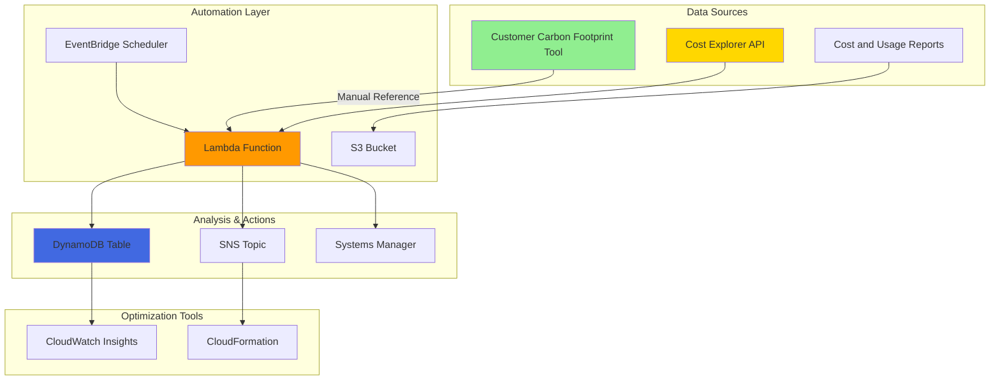

# Automated Carbon Footprint Optimization with Cost Explorer and EventBridge

## Problem

Organizations need to track and optimize their cloud infrastructure's environmental impact while maintaining cost efficiency, but manual carbon footprint monitoring is time-consuming and often misaligned with financial optimization goals. Many businesses struggle to implement systematic sustainability practices because they lack automated tools to correlate carbon emissions with cost data, making it difficult to identify optimization opportunities that deliver both environmental and financial benefits.

## Solution

This solution creates an automated carbon footprint optimization system by integrating Cost Explorer insights with sustainability analysis through EventBridge and Lambda. The system automatically analyzes monthly cost and usage patterns, applies industry-standard carbon emission factors, and generates optimization recommendations that reduce both environmental impact and operational costs through intelligent resource rightsizing and sustainable architecture patterns.

## Architecture Diagram



## Prerequisites

1. AWS account with billing and cost management permissions for Cost Explorer access
2. AWS CLI v2 installed and configured (or AWS CloudShell)
3. IAM permissions for Lambda, EventBridge, Cost Explorer, S3, DynamoDB, and SNS
4. Basic understanding of carbon accounting principles and AWS sustainability practices
5. Estimated cost: $15-25/month for Lambda executions, storage, and data transfer

> **Note**: The AWS Customer Carbon Footprint Tool provides carbon emission data through the AWS Console with a 3-month delay. This recipe uses Cost Explorer data with estimated carbon factors for real-time analysis. For official carbon data, reference the [AWS Customer Carbon Footprint Tool](https://docs.aws.amazon.com/awsaccountbilling/latest/aboutv2/ccft-overview.html) and [AWS Data Exports for carbon emissions](https://docs.aws.amazon.com/cur/latest/userguide/dataexports-carbon-emissions-info.html).

## Preparation

```bash
# Set environment variables
export AWS_REGION=$(aws configure get region)
export AWS_ACCOUNT_ID=$(aws sts get-caller-identity \
    --query Account --output text)

# Generate unique identifiers for resources
RANDOM_SUFFIX=$(aws secretsmanager get-random-password \
    --exclude-punctuation --exclude-uppercase \
    --password-length 6 --require-each-included-type \
    --output text --query RandomPassword)

export PROJECT_NAME="carbon-optimizer-${RANDOM_SUFFIX}"
export S3_BUCKET="${PROJECT_NAME}-data"
export LAMBDA_FUNCTION="${PROJECT_NAME}-analyzer"
export DYNAMODB_TABLE="${PROJECT_NAME}-metrics"

# Create S3 bucket for data storage
aws s3 mb s3://${S3_BUCKET} --region ${AWS_REGION}

aws s3api put-bucket-versioning \
    --bucket ${S3_BUCKET} \
    --versioning-configuration Status=Enabled

aws s3api put-bucket-encryption \
    --bucket ${S3_BUCKET} \
    --server-side-encryption-configuration \
    'Rules=[{ApplyServerSideEncryptionByDefault:{SSEAlgorithm:AES256}}]'

echo "✅ Preparation completed with project: ${PROJECT_NAME}"
```

## Steps

1. **Create IAM Role for Lambda Function**:

   AWS Lambda requires comprehensive permissions to access cost information and automation services. The IAM role establishes a secure foundation that enables the Lambda function to analyze cost patterns through the Cost Explorer API and trigger optimization actions across multiple AWS services. This role follows AWS security best practices by implementing least privilege access while providing the necessary permissions for automated carbon footprint analysis and optimization workflows.

   ```bash
   # Create trust policy for Lambda
   cat > lambda-trust-policy.json << 'EOF'
   {
     "Version": "2012-10-17",
     "Statement": [
       {
         "Effect": "Allow",
         "Principal": {
           "Service": "lambda.amazonaws.com"
         },
         "Action": "sts:AssumeRole"
       }
     ]
   }
   EOF
   
   # Create IAM role
   aws iam create-role \
       --role-name ${PROJECT_NAME}-lambda-role \
       --assume-role-policy-document file://lambda-trust-policy.json
   
   # Create comprehensive policy for carbon footprint optimization
   cat > lambda-permissions-policy.json << EOF
   {
     "Version": "2012-10-17",
     "Statement": [
       {
         "Effect": "Allow",
         "Action": [
           "logs:CreateLogGroup",
           "logs:CreateLogStream",
           "logs:PutLogEvents"
         ],
         "Resource": "arn:aws:logs:*:*:*"
       },
       {
         "Effect": "Allow",
         "Action": [
           "ce:GetCostAndUsage",
           "ce:GetDimensions",
           "ce:GetUsageReport",
           "ce:ListCostCategoryDefinitions",
           "cur:DescribeReportDefinitions"
         ],
         "Resource": "*"
       },
       {
         "Effect": "Allow",
         "Action": [
           "s3:GetObject",
           "s3:PutObject",
           "s3:DeleteObject",
           "s3:ListBucket"
         ],
         "Resource": [
           "arn:aws:s3:::${S3_BUCKET}",
           "arn:aws:s3:::${S3_BUCKET}/*"
         ]
       },
       {
         "Effect": "Allow",
         "Action": [
           "dynamodb:PutItem",
           "dynamodb:GetItem",
           "dynamodb:UpdateItem",
           "dynamodb:Query",
           "dynamodb:Scan"
         ],
         "Resource": "arn:aws:dynamodb:*:*:table/${DYNAMODB_TABLE}"
       },
       {
         "Effect": "Allow",
         "Action": [
           "sns:Publish"
         ],
         "Resource": "arn:aws:sns:*:*:${PROJECT_NAME}-notifications"
       },
       {
         "Effect": "Allow",
         "Action": [
           "ssm:GetParameter",
           "ssm:PutParameter",
           "ssm:GetParameters"
         ],
         "Resource": "arn:aws:ssm:*:*:parameter/${PROJECT_NAME}/*"
       }
     ]
   }
   EOF
   
   # Attach policies to role
   aws iam put-role-policy \
       --role-name ${PROJECT_NAME}-lambda-role \
       --policy-name CarbonOptimizationPolicy \
       --policy-document file://lambda-permissions-policy.json
   
   # Get role ARN for later use
   LAMBDA_ROLE_ARN=$(aws iam get-role \
       --role-name ${PROJECT_NAME}-lambda-role \
       --query 'Role.Arn' --output text)
   
   echo "✅ IAM role created: ${LAMBDA_ROLE_ARN}"
   ```

   The Lambda role is now configured with the necessary permissions to access cost information and automation services. This security foundation enables comprehensive analysis of sustainability metrics while maintaining proper access controls according to the [AWS IAM best practices](https://docs.aws.amazon.com/IAM/latest/UserGuide/best-practices.html) for automated cost optimization workflows.

2. **Create DynamoDB Table for Metrics Storage**:

   Amazon DynamoDB provides a scalable, serverless database foundation that's essential for storing carbon footprint metrics, cost correlations, and optimization recommendations. The NoSQL design enables efficient storage and retrieval of time-series sustainability data while supporting complex queries across multiple dimensions like service type, region, and carbon intensity. This table structure accommodates both real-time operational metrics and historical trend analysis, providing the data foundation needed for intelligent sustainability optimization workflows.

   ```bash
   # Create DynamoDB table for carbon footprint metrics
   aws dynamodb create-table \
       --table-name ${DYNAMODB_TABLE} \
       --attribute-definitions \
           AttributeName=MetricType,AttributeType=S \
           AttributeName=Timestamp,AttributeType=S \
       --key-schema \
           AttributeName=MetricType,KeyType=HASH \
           AttributeName=Timestamp,KeyType=RANGE \
       --provisioned-throughput \
           ReadCapacityUnits=5,WriteCapacityUnits=5 \
       --tags Key=Project,Value=${PROJECT_NAME} \
             Key=Purpose,Value=CarbonFootprintOptimization
   
   # Wait for table to become active
   aws dynamodb wait table-exists \
       --table-name ${DYNAMODB_TABLE}
   
   # Create Global Secondary Index for service-based queries
   aws dynamodb update-table \
       --table-name ${DYNAMODB_TABLE} \
       --attribute-definitions \
           AttributeName=ServiceName,AttributeType=S \
           AttributeName=CarbonIntensity,AttributeType=N \
       --global-secondary-index-updates \
           'Create={IndexName=ServiceCarbonIndex,KeySchema=[{AttributeName=ServiceName,KeyType=HASH},{AttributeName=CarbonIntensity,KeyType=RANGE}],Projection={ProjectionType=ALL},ProvisionedThroughput={ReadCapacityUnits=3,WriteCapacityUnits=3}}'
   
   echo "✅ DynamoDB table created and configured for sustainability metrics"
   ```

   The DynamoDB table is now ready to store carbon footprint metrics with efficient indexing for service-based analysis. This data structure enables historical tracking of sustainability improvements and supports automated optimization recommendations based on carbon intensity patterns across different AWS services. The Global Secondary Index provides fast access patterns for analyzing service-specific environmental impact trends.

3. **Create Lambda Function for Carbon Footprint Analysis**:

   The Lambda function serves as the core intelligence engine that correlates cost data with estimated carbon footprint metrics to identify optimization opportunities. This serverless compute approach ensures cost-effective processing while providing the scalability and flexibility needed to implement sophisticated sustainability algorithms. The function integrates with Cost Explorer to process usage and cost data, applies industry-standard carbon emission factors, and generates actionable recommendations that deliver both environmental and financial optimization benefits.

   ```bash
   # Create Lambda function code
   mkdir -p lambda-function
   cat > lambda-function/index.py << 'EOF'
   import json
   import boto3
   import os
   from datetime import datetime, timedelta
   from decimal import Decimal
   import logging
   
   # Configure logging
   logger = logging.getLogger()
   logger.setLevel(logging.INFO)
   
   # Initialize AWS clients
   ce_client = boto3.client('ce')
   dynamodb = boto3.resource('dynamodb')
   s3_client = boto3.client('s3')
   sns_client = boto3.client('sns')
   ssm_client = boto3.client('ssm')
   
   # Environment variables
   TABLE_NAME = os.environ['DYNAMODB_TABLE']
   S3_BUCKET = os.environ['S3_BUCKET']
   SNS_TOPIC_ARN = os.environ['SNS_TOPIC_ARN']
   
   table = dynamodb.Table(TABLE_NAME)
   
   def lambda_handler(event, context):
       """
       Main handler for carbon footprint optimization analysis
       """
       try:
           logger.info("Starting carbon footprint optimization analysis")
           
           # Get current date range for analysis
           end_date = datetime.now().date()
           start_date = end_date - timedelta(days=30)
           
           # Fetch cost and usage data
           cost_data = get_cost_and_usage_data(start_date, end_date)
           
           # Analyze carbon footprint correlations
           carbon_analysis = analyze_carbon_footprint(cost_data)
           
           # Store metrics in DynamoDB
           store_metrics(carbon_analysis)
           
           # Generate optimization recommendations
           recommendations = generate_recommendations(carbon_analysis)
           
           # Send notifications if significant findings
           if recommendations['high_impact_actions']:
               send_optimization_notifications(recommendations)
           
           return {
               'statusCode': 200,
               'body': json.dumps({
                   'message': 'Carbon footprint analysis completed successfully',
                   'recommendations_count': len(recommendations['all_actions']),
                   'high_impact_count': len(recommendations['high_impact_actions'])
               })
           }
           
       except Exception as e:
           logger.error(f"Error in carbon footprint analysis: {str(e)}")
           return {
               'statusCode': 500,
               'body': json.dumps({'error': str(e)})
           }
   
   def get_cost_and_usage_data(start_date, end_date):
       """
       Retrieve cost and usage data from Cost Explorer
       """
       try:
           response = ce_client.get_cost_and_usage(
               TimePeriod={
                   'Start': start_date.strftime('%Y-%m-%d'),
                   'End': end_date.strftime('%Y-%m-%d')
               },
               Granularity='DAILY',
               Metrics=['BlendedCost', 'UsageQuantity'],
               GroupBy=[
                   {'Type': 'DIMENSION', 'Key': 'SERVICE'},
                   {'Type': 'DIMENSION', 'Key': 'REGION'}
               ]
           )
           
           return response['ResultsByTime']
           
       except Exception as e:
           logger.error(f"Error retrieving cost data: {str(e)}")
           raise
   
   def analyze_carbon_footprint(cost_data):
       """
       Analyze carbon footprint patterns based on cost and usage data
       """
       analysis = {
           'total_cost': 0,
           'estimated_carbon_kg': 0,
           'services': {},
           'regions': {},
           'optimization_potential': 0
       }
       
       # Carbon intensity factors (kg CO2e per USD) by service type
       # Based on AWS Sustainability Pillar and industry standards
       carbon_factors = {
           'Amazon Elastic Compute Cloud - Compute': 0.000533,
           'Amazon Simple Storage Service': 0.000164,
           'Amazon Relational Database Service': 0.000688,
           'AWS Lambda': 0.000025,
           'Amazon CloudFront': 0.00004,
           'Amazon DynamoDB': 0.000045,
           'Amazon Elastic Load Balancing': 0.000312,
           'Amazon Virtual Private Cloud': 0.000089
       }
       
       # Regional carbon intensity factors (relative multipliers)
       # Based on AWS regional renewable energy usage
       regional_factors = {
           'us-east-1': 0.85,  # Virginia - high renewable content
           'us-west-2': 0.42,  # Oregon - very high renewable content
           'eu-west-1': 0.65,  # Ireland - moderate renewable mix
           'ap-southeast-2': 1.2,  # Sydney - higher carbon intensity
           'ca-central-1': 0.23,  # Canada - very low carbon intensity
           'eu-north-1': 0.11   # Stockholm - lowest carbon intensity
       }
       
       for time_period in cost_data:
           for group in time_period.get('Groups', []):
               service = group['Keys'][0] if len(group['Keys']) > 0 else 'Unknown'
               region = group['Keys'][1] if len(group['Keys']) > 1 else 'global'
               
               cost = float(group['Metrics']['BlendedCost']['Amount'])
               analysis['total_cost'] += cost
               
               # Calculate estimated carbon footprint
               service_factor = carbon_factors.get(service, 0.0003)  # Default factor
               regional_factor = regional_factors.get(region, 1.0)  # Default factor
               
               estimated_carbon = cost * service_factor * regional_factor
               analysis['estimated_carbon_kg'] += estimated_carbon
               
               # Track by service
               if service not in analysis['services']:
                   analysis['services'][service] = {
                       'cost': 0, 'carbon_kg': 0, 'optimization_score': 0
                   }
               
               analysis['services'][service]['cost'] += cost
               analysis['services'][service]['carbon_kg'] += estimated_carbon
               
               # Calculate optimization score (higher is better opportunity)
               if cost > 0:
                   analysis['services'][service]['optimization_score'] = (
                       estimated_carbon / cost * 1000  # Scale for readability
                   )
       
       return analysis
   
   def generate_recommendations(analysis):
       """
       Generate carbon footprint optimization recommendations
       """
       recommendations = {
           'all_actions': [],
           'high_impact_actions': [],
           'estimated_savings': {'cost': 0, 'carbon_kg': 0}
       }
       
       # Analyze services with high carbon intensity
       for service, metrics in analysis['services'].items():
           if metrics['cost'] > 10 and metrics['optimization_score'] > 0.2:
               recommendation = {
                   'service': service,
                   'current_cost': metrics['cost'],
                   'current_carbon_kg': metrics['carbon_kg'],
                   'action': determine_optimization_action(service, metrics),
                   'estimated_cost_savings': metrics['cost'] * 0.15,  # 15% savings
                   'estimated_carbon_reduction': metrics['carbon_kg'] * 0.25  # 25% reduction
               }
               
               recommendations['all_actions'].append(recommendation)
               
               if metrics['cost'] > 100:  # High impact threshold
                   recommendations['high_impact_actions'].append(recommendation)
                   recommendations['estimated_savings']['cost'] += recommendation['estimated_cost_savings']
                   recommendations['estimated_savings']['carbon_kg'] += recommendation['estimated_carbon_reduction']
       
       return recommendations
   
   def determine_optimization_action(service, metrics):
       """
       Determine specific optimization action for a service
       """
       action_map = {
           'Amazon Elastic Compute Cloud - Compute': 'Consider rightsizing instances or migrating to Graviton processors for up to 20% energy efficiency improvement',
           'Amazon Simple Storage Service': 'Implement Intelligent Tiering and lifecycle policies to reduce storage footprint',
           'Amazon Relational Database Service': 'Evaluate Aurora Serverless v2 or instance rightsizing for better resource utilization',
           'AWS Lambda': 'Optimize memory allocation and consider ARM-based architecture for improved efficiency',
           'Amazon CloudFront': 'Review caching strategies and enable compression to reduce data transfer',
           'Amazon DynamoDB': 'Consider on-demand billing for variable workloads to optimize resource usage'
       }
       
       return action_map.get(service, 'Review resource utilization and consider sustainable alternatives')
   
   def store_metrics(analysis):
       """
       Store analysis results in DynamoDB
       """
       timestamp = datetime.now().isoformat()
       
       # Store overall metrics
       table.put_item(
           Item={
               'MetricType': 'OVERALL_ANALYSIS',
               'Timestamp': timestamp,
               'TotalCost': Decimal(str(analysis['total_cost'])),
               'EstimatedCarbonKg': Decimal(str(analysis['estimated_carbon_kg'])),
               'ServiceCount': len(analysis['services'])
           }
       )
       
       # Store service-specific metrics
       for service, metrics in analysis['services'].items():
           table.put_item(
               Item={
                   'MetricType': f'SERVICE_{service.replace(" ", "_").replace("-", "_").upper()}',
                   'Timestamp': timestamp,
                   'ServiceName': service,
                   'Cost': Decimal(str(metrics['cost'])),
                   'CarbonKg': Decimal(str(metrics['carbon_kg'])),
                   'CarbonIntensity': Decimal(str(metrics['optimization_score']))
               }
           )
   
   def send_optimization_notifications(recommendations):
       """
       Send notifications about optimization opportunities
       """
       message = f"""
       Carbon Footprint Optimization Report
       
       High-Impact Opportunities Found: {len(recommendations['high_impact_actions'])}
       
       Estimated Monthly Savings:
       - Cost: ${recommendations['estimated_savings']['cost']:.2f}
       - Carbon: {recommendations['estimated_savings']['carbon_kg']:.3f} kg CO2e
       
       Top Recommendations:
       """
       
       for i, action in enumerate(recommendations['high_impact_actions'][:3], 1):
           message += f"""
       {i}. {action['service']}
          Current Cost: ${action['current_cost']:.2f}
          Carbon Impact: {action['current_carbon_kg']:.3f} kg CO2e
          Action: {action['action']}
       """
       
       try:
           sns_client.publish(
               TopicArn=SNS_TOPIC_ARN,
               Subject='Carbon Footprint Optimization Report',
               Message=message
           )
       except Exception as e:
           logger.error(f"Error sending notification: {str(e)}")
   EOF
   
   # Create deployment package
   cd lambda-function
   zip -r ../lambda-function.zip .
   cd ..
   
   # Create Lambda function
   aws lambda create-function \
       --function-name ${LAMBDA_FUNCTION} \
       --runtime python3.11 \
       --role ${LAMBDA_ROLE_ARN} \
       --handler index.lambda_handler \
       --zip-file fileb://lambda-function.zip \
       --timeout 300 \
       --memory-size 512 \
       --environment Variables="{
           \"DYNAMODB_TABLE\":\"${DYNAMODB_TABLE}\",
           \"S3_BUCKET\":\"${S3_BUCKET}\",
           \"SNS_TOPIC_ARN\":\"arn:aws:sns:${AWS_REGION}:${AWS_ACCOUNT_ID}:${PROJECT_NAME}-notifications\"
       }" \
       --tags Project=${PROJECT_NAME},Purpose=CarbonFootprintOptimization
   
   echo "✅ Lambda function created for carbon footprint analysis"
   ```

   The Lambda function is now deployed with comprehensive carbon footprint analysis capabilities. This intelligent automation engine correlates cost data with estimated carbon emissions using industry-standard sustainability factors based on the [AWS Well-Architected Sustainability Pillar](https://docs.aws.amazon.com/wellarchitected/latest/sustainability-pillar/sustainability-pillar.html), identifies high-impact optimization opportunities, and provides actionable recommendations for sustainable cloud operations.

4. **Create SNS Topic for Notifications**:

   Amazon SNS provides a reliable, scalable messaging service that ensures stakeholders receive timely notifications when significant carbon footprint optimization opportunities are identified. This pub/sub messaging approach enables real-time communication about sustainability improvements and cost savings opportunities. The notification system supports environmental reporting requirements, compliance workflows, and proactive resource optimization by delivering actionable insights to decision-makers across your organization.

   ```bash
   # Create SNS topic for notifications
   aws sns create-topic \
       --name ${PROJECT_NAME}-notifications \
       --tags Key=Project,Value=${PROJECT_NAME} \
              Key=Purpose,Value=CarbonOptimizationAlerts
   
   # Get topic ARN
   SNS_TOPIC_ARN=$(aws sns list-topics \
       --query "Topics[?contains(TopicArn, '${PROJECT_NAME}-notifications')].TopicArn" \
       --output text)
   
   # Subscribe email notification (replace with your email)
   read -p "Enter email address for carbon optimization notifications: " EMAIL_ADDRESS
   
   aws sns subscribe \
       --topic-arn ${SNS_TOPIC_ARN} \
       --protocol email \
       --notification-endpoint ${EMAIL_ADDRESS}
   
   echo "✅ SNS topic created. Check your email to confirm subscription."
   echo "Topic ARN: ${SNS_TOPIC_ARN}"
   ```

   The SNS notification system is now configured to deliver carbon footprint optimization alerts directly to stakeholders. This ensures immediate visibility into sustainability improvements and enables rapid response to high-impact optimization opportunities, supporting both environmental goals and operational efficiency initiatives.

5. **Create EventBridge Schedule for Automated Analysis**:

   Amazon EventBridge Scheduler provides serverless, managed automation that ensures consistent monitoring of sustainability metrics without requiring dedicated infrastructure management. This event-driven architecture enables continuous optimization by automatically triggering carbon footprint analysis at regular intervals, ensuring that sustainability insights remain current and actionable. The scheduled automation supports both strategic sustainability planning through monthly analyses and tactical optimization through more frequent monitoring cycles.

   ```bash
   # Create EventBridge schedule for monthly analysis
   aws scheduler create-schedule \
       --name ${PROJECT_NAME}-monthly-analysis \
       --schedule-expression "rate(30 days)" \
       --target "{
           \"RoleArn\": \"${LAMBDA_ROLE_ARN}\",
           \"Arn\": \"arn:aws:lambda:${AWS_REGION}:${AWS_ACCOUNT_ID}:function:${LAMBDA_FUNCTION}\"
       }" \
       --flexible-time-window '{"Mode": "OFF"}' \
       --description "Monthly carbon footprint optimization analysis"
   
   # Create additional schedule for weekly trend analysis
   aws scheduler create-schedule \
       --name ${PROJECT_NAME}-weekly-trends \
       --schedule-expression "rate(7 days)" \
       --target "{
           \"RoleArn\": \"${LAMBDA_ROLE_ARN}\",
           \"Arn\": \"arn:aws:lambda:${AWS_REGION}:${AWS_ACCOUNT_ID}:function:${LAMBDA_FUNCTION}\"
       }" \
       --flexible-time-window '{"Mode": "OFF"}' \
       --description "Weekly carbon footprint trend monitoring"
   
   echo "✅ EventBridge schedules created for automated analysis"
   ```

   The automated scheduling system is now active, providing continuous monitoring of carbon footprint metrics through both monthly comprehensive analyses and weekly trend monitoring. This dual-frequency approach ensures that sustainability optimization remains responsive to short-term changes while maintaining strategic oversight of long-term environmental impact trends.

6. **Configure Cost and Usage Reports for Enhanced Data**:

   AWS Cost and Usage Reports (CUR) provide the most detailed, granular data available for enhancing carbon footprint analysis beyond what's accessible through standard Cost Explorer APIs. These comprehensive reports include resource-level details, usage patterns, and cost allocation data that enable more sophisticated carbon emission calculations and optimization recommendations. The enhanced data granularity supports advanced sustainability analytics while improving the accuracy of environmental impact assessments across your entire AWS infrastructure.

   ```bash
   # Create Cost and Usage Report for enhanced carbon analysis
   cat > cur-definition.json << EOF
   {
       "ReportName": "carbon-optimization-detailed-report",
       "TimeUnit": "DAILY",
       "Format": "Parquet",
       "Compression": "GZIP",
       "AdditionalSchemaElements": ["RESOURCES", "SPLIT_COST_ALLOCATION_DATA"],
       "S3Bucket": "${S3_BUCKET}",
       "S3Prefix": "cost-usage-reports/",
       "S3Region": "${AWS_REGION}",
       "AdditionalArtifacts": ["ATHENA"],
       "RefreshClosedReports": true,
       "ReportVersioning": "OVERWRITE_REPORT"
   }
   EOF
   
   # Create the Cost and Usage Report
   aws cur put-report-definition \
       --region us-east-1 \
       --report-definition file://cur-definition.json
   
   echo "✅ Cost and Usage Reports configured for enhanced carbon analysis"
   ```

   The Cost and Usage Reports are now configured to provide enhanced, resource-level data for carbon footprint optimization. This detailed information stream enables more accurate sustainability calculations, better identification of optimization opportunities across all AWS services, and supports advanced analytics for comprehensive environmental impact management.

7. **Create Sustainability Best Practices Configuration**:

   AWS Systems Manager Parameter Store provides centralized configuration management for sustainability optimization rules and best practices. This configuration-driven approach enables dynamic adjustment of carbon optimization strategies without code changes, supporting evolving sustainability requirements and regional variations in carbon intensity. The parameter store integration ensures that optimization recommendations remain aligned with current environmental best practices and organizational sustainability goals.

   ```bash
   # Create Systems Manager parameter for sustainability configuration
   aws ssm put-parameter \
       --name "/${PROJECT_NAME}/sustainability-config" \
       --value '{
           "carbon_thresholds": {
               "high_impact": 100,
               "optimization_threshold": 0.2
           },
           "regional_preferences": {
               "preferred_regions": ["us-west-2", "eu-north-1", "ca-central-1"],
               "avoid_regions": []
           },
           "optimization_rules": {
               "graviton_migration": true,
               "intelligent_tiering": true,
               "serverless_first": true,
               "right_sizing": true
           },
           "notification_settings": {
               "email_threshold": 50,
               "weekly_summary": true
           }
       }' \
       --type String \
       --description "Sustainability optimization configuration"
   
   # Create CloudFormation template for sustainable infrastructure
   cat > sustainable-infrastructure-template.yaml << 'EOF'
   AWSTemplateFormatVersion: '2010-09-09'
   Description: 'Sustainable infrastructure template with carbon-optimized resources'
   
   Parameters:
     EnvironmentType:
       Type: String
       Default: production
       AllowedValues: [production, staging, development]
   
   Mappings:
     SustainableInstanceTypes:
       production:
         InstanceType: m6g.large  # Graviton processor for efficiency
       staging:
         InstanceType: t4g.medium  # Graviton processor for efficiency
       development:
         InstanceType: t4g.small   # Graviton processor for efficiency
   
   Resources:
     SustainableComputeInstance:
       Type: AWS::EC2::Instance
       Properties:
         InstanceType: !FindInMap [SustainableInstanceTypes, !Ref EnvironmentType, InstanceType]
         ImageId: ami-0abcdef1234567890  # Replace with latest ARM-based AMI
         Tags:
           - Key: SustainabilityOptimized
             Value: true
           - Key: CarbonFootprintTracking
             Value: enabled
   
     EfficientStorage:
       Type: AWS::S3::Bucket
       Properties:
         IntelligentTieringConfigurations:
           - Id: OptimizeStorage
             Status: Enabled
             OptionalFields:
               - BucketKeyStatus
         LifecycleConfiguration:
           Rules:
             - Id: TransitionToIA
               Status: Enabled
               TransitionInDays: 30
               StorageClass: STANDARD_IA
             - Id: TransitionToGlacier
               Status: Enabled
               TransitionInDays: 90
               StorageClass: GLACIER
   EOF
   
   # Store template in S3 for future use
   aws s3 cp sustainable-infrastructure-template.yaml \
       s3://${S3_BUCKET}/templates/
   
   echo "✅ Sustainability configuration and templates created"
   ```

   The sustainability configuration is now established with best practices templates that demonstrate environmental optimization principles. This configuration-driven approach ensures that carbon footprint optimization strategies remain current with evolving sustainability requirements while integrating seamlessly with the automated analysis system for comprehensive environmental lifecycle management.

## Validation & Testing

1. **Test Lambda Function Execution**:

   ```bash
   # Invoke Lambda function to test carbon footprint analysis
   aws lambda invoke \
       --function-name ${LAMBDA_FUNCTION} \
       --payload '{}' \
       response.json
   
   # Check execution results
   cat response.json
   ```

   Expected output: JSON response with status code 200 and analysis summary including recommendations count.

2. **Verify DynamoDB Data Storage**:

   ```bash
   # Query stored carbon footprint metrics
   aws dynamodb scan \
       --table-name ${DYNAMODB_TABLE} \
       --max-items 5
   ```

   Expected output: Items showing carbon footprint metrics with timestamps and service analysis data.

3. **Test Cost Explorer Integration**:

   ```bash
   # Verify Cost Explorer access and data retrieval
   aws ce get-cost-and-usage \
       --time-period Start=$(date -d '30 days ago' '+%Y-%m-%d'),End=$(date '+%Y-%m-%d') \
       --granularity MONTHLY \
       --metrics "BlendedCost" \
       --group-by Type=DIMENSION,Key=SERVICE \
       --max-items 5
   ```

   Expected output: Cost data grouped by AWS service for carbon footprint correlation.

4. **Validate EventBridge Schedules**:

   ```bash
   # List created schedules
   aws scheduler list-schedules \
       --name-prefix ${PROJECT_NAME}
   ```

   Expected output: Two schedules showing monthly and weekly analysis automation.

## Cleanup

1. **Delete EventBridge Schedules**:

   ```bash
   # Delete automation schedules
   aws scheduler delete-schedule \
       --name ${PROJECT_NAME}-monthly-analysis
   
   aws scheduler delete-schedule \
       --name ${PROJECT_NAME}-weekly-trends
   
   echo "✅ EventBridge schedules deleted"
   ```

2. **Delete Lambda Function and Role**:

   ```bash
   # Delete Lambda function
   aws lambda delete-function \
       --function-name ${LAMBDA_FUNCTION}
   
   # Delete IAM role and policies
   aws iam delete-role-policy \
       --role-name ${PROJECT_NAME}-lambda-role \
       --policy-name CarbonOptimizationPolicy
   
   aws iam delete-role \
       --role-name ${PROJECT_NAME}-lambda-role
   
   echo "✅ Lambda function and IAM role deleted"
   ```

3. **Remove DynamoDB Table**:

   ```bash
   # Delete DynamoDB table
   aws dynamodb delete-table \
       --table-name ${DYNAMODB_TABLE}
   
   echo "✅ DynamoDB table deleted"
   ```

4. **Delete SNS Topic and S3 Resources**:

   ```bash
   # Delete SNS topic
   aws sns delete-topic \
       --topic-arn ${SNS_TOPIC_ARN}
   
   # Empty and delete S3 bucket
   aws s3 rm s3://${S3_BUCKET} --recursive
   aws s3 rb s3://${S3_BUCKET}
   
   # Delete Cost and Usage Report
   aws cur delete-report-definition \
       --region us-east-1 \
       --report-name carbon-optimization-detailed-report
   
   # Delete Systems Manager parameters
   aws ssm delete-parameter \
       --name "/${PROJECT_NAME}/sustainability-config"
   
   # Clean up local files
   rm -rf lambda-function lambda-function.zip *.json *.yaml
   
   echo "✅ All resources cleaned up successfully"
   ```

## Discussion

Carbon footprint optimization represents a critical intersection of environmental responsibility and operational efficiency in modern cloud computing. This automated solution leverages AWS's comprehensive cost management tools to create a continuous optimization loop that delivers measurable environmental and financial benefits. The integration of Cost Explorer with estimated carbon emission factors provides practical visibility into the relationship between cloud spending and environmental impact, enabling data-driven decisions that support corporate sustainability goals while maintaining operational efficiency. For comprehensive understanding of AWS sustainability practices, review the [AWS Well-Architected Sustainability Pillar](https://docs.aws.amazon.com/wellarchitected/latest/sustainability-pillar/sustainability-pillar.html) and [AWS Customer Carbon Footprint Tool](https://docs.aws.amazon.com/awsaccountbilling/latest/aboutv2/ccft-overview.html).

The automated analysis engine demonstrates how modern cloud architectures can embed sustainability considerations directly into operational workflows without sacrificing performance or reliability. By correlating cost patterns with carbon emissions estimates using research-based environmental factors aligned with AWS sustainability guidance, organizations gain actionable insights that traditionally required manual analysis or external sustainability consulting services. The system's ability to identify high-impact optimization opportunities ensures that sustainability efforts focus on changes that deliver measurable environmental improvements while supporting business objectives. This approach aligns with the [AWS Well-Architected Framework](https://docs.aws.amazon.com/wellarchitected/latest/framework/welcome.html) principle of treating sustainability as a cross-cutting concern that enhances rather than constrains operational excellence.

From a technical architecture perspective, this solution showcases the power of serverless computing for sustainability applications while embodying the environmental principles it seeks to optimize. The event-driven design minimizes resource consumption during idle periods while ensuring reliable operation when analysis is needed. The integration with fully managed AWS services like EventBridge, Lambda, and DynamoDB reduces operational overhead while providing enterprise-grade reliability, scalability, and security. For detailed technical implementation guidance, consult the [AWS Lambda Developer Guide](https://docs.aws.amazon.com/lambda/latest/dg/) and [Cost Explorer API Reference](https://docs.aws.amazon.com/aws-cost-management/latest/APIReference/Welcome.html).

The solution's extensibility enables organizations to customize sustainability metrics and optimization strategies based on their specific environmental goals, regulatory requirements, and business contexts. Future enhancements could include integration with the official [AWS Data Exports for carbon emissions](https://docs.aws.amazon.com/cur/latest/userguide/dataexports-carbon-emissions-info.html) for enhanced accuracy, automated resource rightsizing based on real-time sustainability scores, and predictive analysis for carbon footprint forecasting. For advanced sustainability optimization techniques and emerging best practices, reference AWS sustainability resources and explore the latest [AWS carbon reduction innovations](https://aws.amazon.com/about-aws/sustainability/).

> **Tip**: Configure CloudWatch alarms on DynamoDB and Lambda metrics to monitor the system's own carbon footprint, creating a feedback loop that ensures your optimization tools remain efficient and sustainable while demonstrating continuous improvement in environmental impact.

## Challenge

Extend this carbon footprint optimization solution by implementing these advanced capabilities:

1. **Integration with AWS Data Exports**: Enhance the solution to consume official carbon emissions data from AWS Data Exports when available, providing more accurate carbon footprint calculations and enabling validation of estimated values against official AWS measurements.

2. **Multi-Account Carbon Governance**: Extend the solution to work across AWS Organizations with consolidated carbon reporting, organization-wide optimization recommendations, and automated compliance checking against corporate sustainability targets and regulatory requirements.

3. **Real-time Sustainability Scoring**: Create a real-time sustainability dashboard using Amazon QuickSight that displays live carbon intensity scores for different services and regions, enabling immediate optimization decisions and supporting sustainability-aware resource allocation strategies.

4. **Automated Remediation Workflows**: Implement AWS Systems Manager Automation documents that automatically apply sustainability optimizations such as instance rightsizing, storage class transitions, and region migration based on carbon footprint analysis results and predefined business rules.

5. **Carbon-Aware Application Architecture**: Develop APIs that allow applications to make infrastructure decisions based on real-time carbon intensity data, such as choosing compute regions with lower environmental impact or scheduling batch jobs during periods of renewable energy availability.

## Infrastructure Code

### Available Infrastructure as Code:

- [Infrastructure Code Overview](code/README.md) - Detailed description of all infrastructure components
- [AWS CDK (Python)](code/cdk-python/) - AWS CDK Python implementation
- [AWS CDK (TypeScript)](code/cdk-typescript/) - AWS CDK TypeScript implementation
- [CloudFormation](code/cloudformation.yaml) - AWS CloudFormation template
- [Bash CLI Scripts](code/scripts/) - Example bash scripts using AWS CLI commands to deploy infrastructure
- [Terraform](code/terraform/) - Terraform configuration files