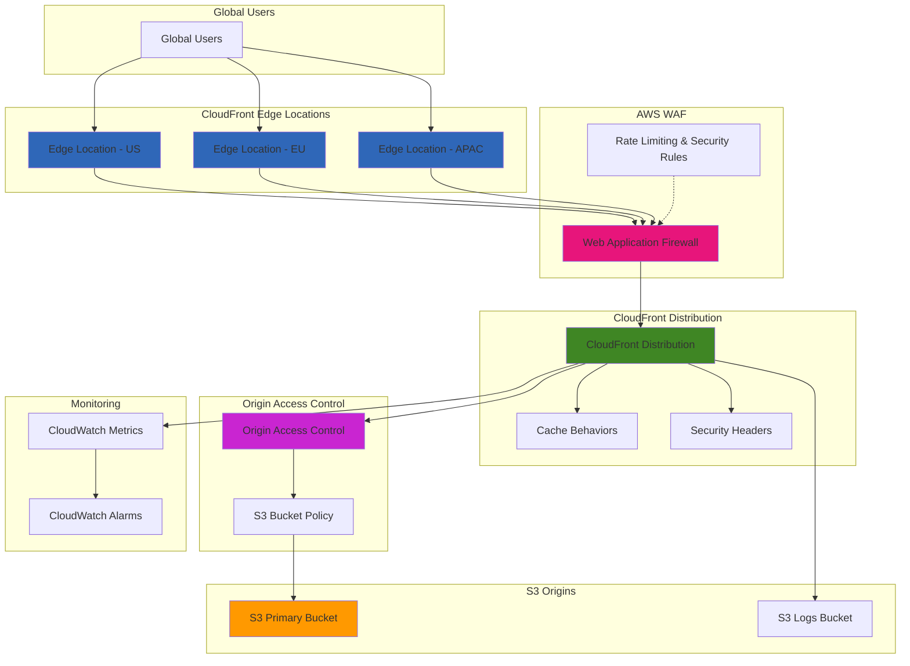

# CDN with CloudFront Origin Access Controls

## Problem

Your global e-commerce platform needs to deliver product images, videos, and static assets to customers worldwide with sub-100ms latency and high availability. The current solution uses a single S3 bucket in us-east-1, causing slow page loads for users in Asia and Europe, resulting in 15% cart abandonment. Additionally, you need to secure origin access to prevent direct S3 access bypassing your CDN security controls and WAF rules, while implementing proper caching strategies to minimize origin requests and reduce costs.

## Solution

Build a robust content delivery network using Amazon CloudFront with Origin Access Control (OAC) to securely distribute content from S3 origins. This solution leverages CloudFront's global edge locations to cache content close to users, while OAC ensures secure, authenticated access to S3 origins without exposing them publicly. The architecture includes optimized caching behaviors, security headers, WAF integration for DDoS protection, and comprehensive monitoring to achieve optimal performance and security.

## Architecture Diagram



## Prerequisites

1. AWS account with permissions to create CloudFront distributions, S3 buckets, WAF web ACLs, and IAM policies
2. AWS CLI v2 installed and configured with appropriate credentials
3. Understanding of HTTP caching principles and CDN concepts
4. Basic knowledge of web security best practices
5. Sample content files (images, CSS, JavaScript) for testing
6. Estimated cost: CloudFront requests (~$0.0075/10,000), Data transfer (~$0.085/GB), S3 storage (~$0.023/GB), WAF (~$1.00/month + $0.60/million requests)

> **Note**: Origin Access Control (OAC) is AWS's recommended approach over Origin Access Identity (OAI) as it supports all S3 regions, SSE-KMS encryption, and dynamic requests. See [AWS documentation](https://docs.aws.amazon.com/AmazonCloudFront/latest/DeveloperGuide/private-content-restricting-access-to-s3.html) for detailed comparisons.

## Preparation

Set up your environment and create the foundational resources:

```bash
# Set environment variables
export AWS_REGION=$(aws configure get region)
export AWS_ACCOUNT_ID=$(aws sts get-caller-identity \
    --query Account --output text)

# Generate unique identifiers
RANDOM_SUFFIX=$(aws secretsmanager get-random-password \
    --exclude-punctuation --exclude-uppercase \
    --password-length 8 --require-each-included-type \
    --output text --query RandomPassword)

# Define resource names
export BUCKET_NAME="cdn-content-${RANDOM_SUFFIX}"
export LOGS_BUCKET_NAME="cdn-logs-${RANDOM_SUFFIX}"
export OAC_NAME="cdn-oac-${RANDOM_SUFFIX}"
export DISTRIBUTION_COMMENT="CDN Distribution ${RANDOM_SUFFIX}"
export WAF_NAME="cdn-waf-${RANDOM_SUFFIX}"

# Create sample content directory
mkdir -p cdn-content/{images,css,js}

echo "<!DOCTYPE html>
<html>
<head>
    <title>CDN Test Page</title>
    <link rel=\"stylesheet\" href=\"/css/styles.css\">
</head>
<body>
    <h1>CloudFront CDN Test</h1>
    
    <script src=\"/js/main.js\"></script>
</body>
</html>" > cdn-content/index.html

echo "body { font-family: Arial, sans-serif; margin: 40px; }
h1 { color: #232F3E; }
img { max-width: 100%; height: auto; }" > cdn-content/css/styles.css

echo "console.log('CDN assets loaded successfully');" > cdn-content/js/main.js

# Create a sample image placeholder
echo "Sample image content" > cdn-content/images/test-image.jpg

echo "✅ Environment prepared with sample content"
```

## Steps

1. **Create S3 buckets for content and logging**:

   Amazon S3 provides the foundational storage layer for your global content delivery network, offering 99.999999999% (11 9's) durability and virtually unlimited scalability. Creating separate buckets for content and logging establishes proper separation of concerns and enables detailed access analytics. The public access block configuration ensures that your content remains secure and is only accessible through CloudFront, preventing direct S3 access that could bypass your CDN's security controls and caching optimizations.

   ```bash
   # Create main content bucket
   aws s3 mb s3://${BUCKET_NAME} --region ${AWS_REGION}
   
   # Create logs bucket
   aws s3 mb s3://${LOGS_BUCKET_NAME} --region ${AWS_REGION}
   
   # Block public access on both buckets
   aws s3api put-public-access-block \
       --bucket ${BUCKET_NAME} \
       --public-access-block-configuration \
       BlockPublicAcls=true,IgnorePublicAcls=true,BlockPublicPolicy=true,RestrictPublicBuckets=true
   
   aws s3api put-public-access-block \
       --bucket ${LOGS_BUCKET_NAME} \
       --public-access-block-configuration \
       BlockPublicAcls=true,IgnorePublicAcls=true,BlockPublicPolicy=true,RestrictPublicBuckets=true
   
   echo "✅ Created S3 buckets with public access blocked"
   ```

   The S3 buckets are now configured with comprehensive public access blocking, ensuring that all content delivery occurs through CloudFront's controlled access mechanisms. This security foundation prevents content leakage and ensures that your CDN policies, WAF rules, and monitoring systems capture all user interactions with your content.

2. **Upload sample content to S3**:

   Proper content type configuration is crucial for optimal CDN performance and browser behavior. MIME types inform browsers how to handle different file types, enabling appropriate caching strategies and compression algorithms. By explicitly setting content types during upload, you ensure that CSS files are processed as stylesheets, JavaScript files execute properly, and images display correctly across all browsers and devices.

   ```bash
   # Upload content with appropriate content types
   aws s3 cp cdn-content/ s3://${BUCKET_NAME}/ \
       --recursive \
       --metadata-directive REPLACE \
       --content-type "text/html" \
       --exclude "*" \
       --include "*.html"
   
   aws s3 cp cdn-content/css/ s3://${BUCKET_NAME}/css/ \
       --recursive \
       --content-type "text/css"
   
   aws s3 cp cdn-content/js/ s3://${BUCKET_NAME}/js/ \
       --recursive \
       --content-type "application/javascript"
   
   aws s3 cp cdn-content/images/ s3://${BUCKET_NAME}/images/ \
       --recursive \
       --content-type "image/jpeg"
   
   echo "✅ Uploaded content to S3 with proper MIME types"
   ```

   Your content is now properly categorized and ready for global distribution. The correct MIME types enable CloudFront to apply appropriate compression algorithms (up to 90% size reduction for text files) and allow browsers to cache content efficiently based on file type characteristics.

3. **Create Origin Access Control (OAC)**:

   Origin Access Control represents AWS's next-generation approach to securing S3 origins, replacing the legacy Origin Access Identity (OAI) with enhanced security and broader compatibility. OAC uses AWS Signature Version 4 authentication, supports all AWS regions including opt-in regions, and enables access to S3 objects encrypted with AWS KMS. This modern authentication mechanism ensures that only your CloudFront distribution can access your S3 content, eliminating the security vulnerabilities associated with public S3 buckets.

   ```bash
   # Create Origin Access Control
   OAC_OUTPUT=$(aws cloudfront create-origin-access-control \
       --origin-access-control-config Name="${OAC_NAME}",Description="OAC for ${BUCKET_NAME}",SigningProtocol=sigv4,SigningBehavior=always,OriginAccessControlOriginType=s3)
   
   export OAC_ID=$(echo $OAC_OUTPUT | \
       jq -r '.OriginAccessControl.Id')
   
   echo "✅ Created Origin Access Control: ${OAC_ID}"
   ```

   The OAC is now configured and ready to secure your S3 origin access. This authentication mechanism will be referenced in your CloudFront distribution configuration and S3 bucket policy, creating a secure chain of trust that prevents unauthorized access while maintaining optimal performance.

4. **Create WAF Web ACL for security**:

   AWS WAF provides application-layer security that protects your CDN from common web attacks and abuse patterns. The managed rule sets automatically update to defend against emerging threats like SQL injection, cross-site scripting (XSS), and known bad IP addresses. Rate limiting prevents abuse by blocking IP addresses that exceed your defined request thresholds, protecting your infrastructure from both malicious attacks and unintentional traffic spikes.

   ```bash
   # Create WAF rules configuration
   cat > waf-config.json << EOF
   {
       "Name": "${WAF_NAME}",
       "Scope": "CLOUDFRONT",
       "DefaultAction": {
           "Allow": {}
       },
       "Rules": [
           {
               "Name": "AWSManagedRulesCommonRuleSet",
               "Priority": 1,
               "OverrideAction": {
                   "None": {}
               },
               "Statement": {
                   "ManagedRuleGroupStatement": {
                       "VendorName": "AWS",
                       "Name": "AWSManagedRulesCommonRuleSet"
                   }
               },
               "VisibilityConfig": {
                   "SampledRequestsEnabled": true,
                   "CloudWatchMetricsEnabled": true,
                   "MetricName": "CommonRuleSetMetric"
               }
           },
           {
               "Name": "RateLimitRule",
               "Priority": 2,
               "Action": {
                   "Block": {}
               },
               "Statement": {
                   "RateBasedStatement": {
                       "Limit": 2000,
                       "AggregateKeyType": "IP"
                   }
               },
               "VisibilityConfig": {
                   "SampledRequestsEnabled": true,
                   "CloudWatchMetricsEnabled": true,
                   "MetricName": "RateLimitMetric"
               }
           }
       ],
       "VisibilityConfig": {
           "SampledRequestsEnabled": true,
           "CloudWatchMetricsEnabled": true,
           "MetricName": "CDNWebACL"
       }
   }
   EOF
   
   # Create the Web ACL
   WAF_OUTPUT=$(aws wafv2 create-web-acl \
       --cli-input-json file://waf-config.json)
   
   export WAF_ARN=$(echo $WAF_OUTPUT | jq -r '.Summary.ARN')
   
   echo "✅ Created WAF Web ACL: ${WAF_ARN}"
   ```

   Your WAF Web ACL is now active and will provide comprehensive protection against web-based threats. The managed rule sets will automatically update to counter new attack vectors, while the rate limiting rules protect your infrastructure from both malicious traffic and legitimate traffic spikes that could impact service availability.

5. **Create CloudFront distribution configuration**:

   The CloudFront distribution configuration defines how your global CDN will behave, including caching strategies, security policies, and performance optimizations. Multiple cache behaviors allow you to optimize different content types - static assets like images and CSS benefit from long-term caching, while dynamic content may require shorter TTL values. The managed cache policies automatically handle optimal cache-control headers, compression, and query string handling based on AWS best practices.

   ```bash
   # Create distribution configuration
   cat > distribution-config.json << EOF
   {
       "CallerReference": "${RANDOM_SUFFIX}",
       "Comment": "${DISTRIBUTION_COMMENT}",
       "DefaultRootObject": "index.html",
       "Origins": {
           "Quantity": 1,
           "Items": [
               {
                   "Id": "${BUCKET_NAME}",
                   "DomainName": "${BUCKET_NAME}.s3.${AWS_REGION}.amazonaws.com",
                   "OriginPath": "",
                   "CustomHeaders": {
                       "Quantity": 0
                   },
                   "S3OriginConfig": {
                       "OriginAccessIdentity": ""
                   },
                   "OriginAccessControlId": "${OAC_ID}",
                   "ConnectionAttempts": 3,
                   "ConnectionTimeout": 10,
                   "OriginShield": {
                       "Enabled": false
                   }
               }
           ]
       },
       "OriginGroups": {
           "Quantity": 0
       },
       "DefaultCacheBehavior": {
           "TargetOriginId": "${BUCKET_NAME}",
           "ViewerProtocolPolicy": "redirect-to-https",
           "CachePolicyId": "658327ea-f89d-4fab-a63d-7e88639e58f6",
           "OriginRequestPolicyId": "88a5eaf4-2fd4-4709-b370-b4c650ea3fcf",
           "ResponseHeadersPolicyId": "5cc3b908-e619-4b99-88e5-2cf7f45965bd",
           "Compress": true,
           "TrustedSigners": {
               "Enabled": false,
               "Quantity": 0
           },
           "TrustedKeyGroups": {
               "Enabled": false,
               "Quantity": 0
           },
           "FieldLevelEncryptionId": ""
       },
       "CacheBehaviors": {
           "Quantity": 3,
           "Items": [
               {
                   "PathPattern": "/images/*",
                   "TargetOriginId": "${BUCKET_NAME}",
                   "ViewerProtocolPolicy": "redirect-to-https",
                   "CachePolicyId": "658327ea-f89d-4fab-a63d-7e88639e58f6",
                   "Compress": true,
                   "TrustedSigners": {
                       "Enabled": false,
                       "Quantity": 0
                   },
                   "TrustedKeyGroups": {
                       "Enabled": false,
                       "Quantity": 0
                   },
                   "FieldLevelEncryptionId": ""
               },
               {
                   "PathPattern": "/css/*",
                   "TargetOriginId": "${BUCKET_NAME}",
                   "ViewerProtocolPolicy": "redirect-to-https",
                   "CachePolicyId": "658327ea-f89d-4fab-a63d-7e88639e58f6",
                   "Compress": true,
                   "TrustedSigners": {
                       "Enabled": false,
                       "Quantity": 0
                   },
                   "TrustedKeyGroups": {
                       "Enabled": false,
                       "Quantity": 0
                   },
                   "FieldLevelEncryptionId": ""
               },
               {
                   "PathPattern": "/js/*",
                   "TargetOriginId": "${BUCKET_NAME}",
                   "ViewerProtocolPolicy": "redirect-to-https",
                   "CachePolicyId": "658327ea-f89d-4fab-a63d-7e88639e58f6",
                   "Compress": true,
                   "TrustedSigners": {
                       "Enabled": false,
                       "Quantity": 0
                   },
                   "TrustedKeyGroups": {
                       "Enabled": false,
                       "Quantity": 0
                   },
                   "FieldLevelEncryptionId": ""
               }
           ]
       },
       "CustomErrorResponses": {
           "Quantity": 2,
           "Items": [
               {
                   "ErrorCode": 404,
                   "ResponsePagePath": "/index.html",
                   "ResponseCode": "200",
                   "ErrorCachingMinTTL": 300
               },
               {
                   "ErrorCode": 403,
                   "ResponsePagePath": "/index.html",
                   "ResponseCode": "200",
                   "ErrorCachingMinTTL": 300
               }
           ]
       },
       "Logging": {
           "Enabled": true,
           "IncludeCookies": false,
           "Bucket": "${LOGS_BUCKET_NAME}.s3.amazonaws.com",
           "Prefix": "cloudfront-logs/"
       },
       "Enabled": true,
       "PriceClass": "PriceClass_All",
       "ViewerCertificate": {
           "CloudFrontDefaultCertificate": true,
           "MinimumProtocolVersion": "TLSv1.2_2021",
           "CertificateSource": "cloudfront"
       },
       "WebACLId": "${WAF_ARN}",
       "HttpVersion": "http2and3",
       "IsIPV6Enabled": true,
       "Restrictions": {
           "GeoRestriction": {
               "RestrictionType": "none",
               "Quantity": 0
           }
       }
   }
   EOF
   
   echo "✅ Created CloudFront distribution configuration"
   ```

   Your distribution configuration is now optimized for global content delivery with distinct caching strategies for different content types. This configuration will enable edge caching across 400+ global locations, reducing latency and improving user experience while minimizing origin server load.

6. **Create CloudFront distribution**:

   Creating the CloudFront distribution establishes your global content delivery network with over 400 edge locations worldwide. This process provisions caching infrastructure across multiple continents, enabling sub-100ms response times for users regardless of their geographic location. The distribution integrates all previously configured components - OAC for secure origin access, WAF for security protection, and optimized cache behaviors for performance.

   ```bash
   # Create the distribution
   DISTRIBUTION_OUTPUT=$(aws cloudfront create-distribution \
       --distribution-config file://distribution-config.json)
   
   export DISTRIBUTION_ID=$(echo $DISTRIBUTION_OUTPUT | \
       jq -r '.Distribution.Id')
   export DISTRIBUTION_DOMAIN=$(echo $DISTRIBUTION_OUTPUT | \
       jq -r '.Distribution.DomainName')
   
   echo "✅ Created CloudFront distribution: ${DISTRIBUTION_ID}"
   echo "Domain: ${DISTRIBUTION_DOMAIN}"
   ```

   Your global CDN is now being deployed across AWS's edge network. The distribution will take several minutes to fully propagate, but once complete, it will provide fast, secure content delivery to users worldwide while protecting your origin infrastructure from direct access.

7. **Configure S3 bucket policy for OAC**:

   The S3 bucket policy creates a secure trust relationship between your CloudFront distribution and S3 bucket using the principle of least privilege. This IAM policy grants the CloudFront service principal read-only access to your bucket content, but only when the request originates from your specific distribution. The condition statement ensures that even if someone discovers your bucket name, they cannot access the content directly - only your CloudFront distribution can retrieve objects for delivery to users.

   ```bash
   # Create S3 bucket policy for OAC
   cat > bucket-policy.json << EOF
   {
       "Version": "2012-10-17",
       "Statement": [
           {
               "Sid": "AllowCloudFrontServicePrincipalReadOnly",
               "Effect": "Allow",
               "Principal": {
                   "Service": "cloudfront.amazonaws.com"
               },
               "Action": "s3:GetObject",
               "Resource": "arn:aws:s3:::${BUCKET_NAME}/*",
               "Condition": {
                   "StringEquals": {
                       "AWS:SourceArn": "arn:aws:cloudfront::${AWS_ACCOUNT_ID}:distribution/${DISTRIBUTION_ID}"
                   }
               }
           }
       ]
   }
   EOF
   
   # Apply the bucket policy
   aws s3api put-bucket-policy \
       --bucket ${BUCKET_NAME} \
       --policy file://bucket-policy.json
   
   echo "✅ Applied S3 bucket policy for OAC access"
   ```

   The secure access relationship between CloudFront and S3 is now established. Your content is protected from direct access while remaining available through your CDN, ensuring that all user requests benefit from caching, security filtering, and performance optimizations.

8. **Wait for distribution deployment and enable additional monitoring**:

   CloudFront deployment involves propagating your distribution configuration to edge locations worldwide, which typically takes 5-15 minutes. Real-time metrics provide detailed insights into request patterns, cache performance, and user geography, enabling data-driven optimization decisions. These metrics are essential for monitoring CDN performance and identifying optimization opportunities.

   ```bash
   # Wait for distribution to be deployed
   echo "Waiting for CloudFront distribution to deploy..."
   aws cloudfront wait distribution-deployed \
       --id ${DISTRIBUTION_ID}
   
   # Enable additional metrics
   aws cloudfront put-monitoring-subscription \
       --distribution-id ${DISTRIBUTION_ID} \
       --monitoring-subscription RealtimeMetricsSubscriptionConfig='{RealtimeMetricsSubscriptionStatus=Enabled}'
   
   echo "✅ CloudFront distribution deployed and monitoring enabled"
   ```

   Your CDN is now live and serving content globally with comprehensive monitoring enabled. Real-time metrics will provide visibility into cache hit ratios, request patterns, and performance characteristics across different geographic regions.

9. **Create CloudWatch alarms for monitoring**:

   Proactive monitoring through CloudWatch alarms enables early detection of performance issues and security threats. The 4xx error rate alarm identifies potential configuration problems or malicious requests, while the cache hit rate alarm ensures your CDN is performing optimally. Low cache hit rates indicate potential configuration issues that increase origin load and user latency, making this metric crucial for maintaining cost-effective, high-performance content delivery.

   ```bash
   # Create alarm for 4xx error rate
   aws cloudwatch put-metric-alarm \
       --alarm-name "CloudFront-4xx-Errors-${DISTRIBUTION_ID}" \
       --alarm-description "High 4xx error rate for CloudFront distribution" \
       --metric-name "4xxErrorRate" \
       --namespace "AWS/CloudFront" \
       --statistic "Average" \
       --period 300 \
       --threshold 5.0 \
       --comparison-operator "GreaterThanThreshold" \
       --evaluation-periods 2 \
       --dimensions Name=DistributionId,Value=${DISTRIBUTION_ID}
   
   # Create alarm for cache hit rate
   aws cloudwatch put-metric-alarm \
       --alarm-name "CloudFront-Low-Cache-Hit-Rate-${DISTRIBUTION_ID}" \
       --alarm-description "Low cache hit rate for CloudFront distribution" \
       --metric-name "CacheHitRate" \
       --namespace "AWS/CloudFront" \
       --statistic "Average" \
       --period 300 \
       --threshold 80.0 \
       --comparison-operator "LessThanThreshold" \
       --evaluation-periods 3 \
       --dimensions Name=DistributionId,Value=${DISTRIBUTION_ID}
   
   echo "✅ Created CloudWatch alarms for monitoring"
   ```

   Your monitoring infrastructure is now active and will alert you to performance degradation or security issues before they impact users. These alarms provide operational visibility essential for maintaining optimal CDN performance and availability.

10. **Test the CDN and security features**:

    Comprehensive testing validates that your CDN is functioning correctly and security controls are properly implemented. Testing direct S3 access confirms that your origin is properly protected, while performance testing demonstrates the latency improvements achieved through edge caching. These validation steps ensure that your global content delivery network is ready for production traffic.

    ```bash
    # Test the CloudFront distribution
    echo "Testing CloudFront distribution..."
    
    # Test main page
    curl -s -o /dev/null -w "HTTP Status: %{http_code}\nTime: %{time_total}s\n" \
        https://${DISTRIBUTION_DOMAIN}
    
    # Test CSS file
    curl -s -o /dev/null -w "HTTP Status: %{http_code}\nTime: %{time_total}s\n" \
        https://${DISTRIBUTION_DOMAIN}/css/styles.css
    
    # Test that direct S3 access is blocked
    echo "Testing direct S3 access (should be blocked)..."
    S3_URL="https://${BUCKET_NAME}.s3.${AWS_REGION}.amazonaws.com/index.html"
    curl -s -o /dev/null -w "Direct S3 HTTP Status: %{http_code}\n" \
        $S3_URL
    
    # Display URLs for testing
    echo "✅ CDN Setup Complete!"
    echo "CloudFront URL: https://${DISTRIBUTION_DOMAIN}"
    echo "Test paths:"
    echo "  - Main page: https://${DISTRIBUTION_DOMAIN}"
    echo "  - CSS: https://${DISTRIBUTION_DOMAIN}/css/styles.css"
    echo "  - JS: https://${DISTRIBUTION_DOMAIN}/js/main.js"
    echo "  - Image: https://${DISTRIBUTION_DOMAIN}/images/test-image.jpg"
    ```

    Your CDN is now fully operational and ready to serve global traffic. The testing confirms that content is being delivered through CloudFront's edge locations while your S3 origin remains secure from direct access.

## Validation & Testing

1. **Verify CloudFront distribution is working**:

   ```bash
   # Check distribution status
   aws cloudfront get-distribution \
       --id ${DISTRIBUTION_ID} \
       --query 'Distribution.Status' \
       --output text
   ```

   Expected output: `Deployed`

2. **Test caching behavior**:

   ```bash
   # Test cache headers
   curl -I https://${DISTRIBUTION_DOMAIN}/css/styles.css
   
   # Look for X-Cache: Hit from cloudfront or Miss from cloudfront
   # Second request should show cache hit
   sleep 2
   curl -I https://${DISTRIBUTION_DOMAIN}/css/styles.css
   ```

3. **Validate security features**:

   ```bash
   # Test WAF rules (should block after rate limit)
   echo "Testing rate limiting..."
   for i in {1..5}; do
       curl -s -o /dev/null -w "Request $i: %{http_code}\n" \
           https://${DISTRIBUTION_DOMAIN}
       sleep 0.1
   done
   
   # Verify security headers
   curl -I https://${DISTRIBUTION_DOMAIN} | \
       grep -E "(X-Frame-Options|X-Content-Type-Options|Strict-Transport-Security)"
   ```

4. **Monitor metrics in CloudWatch**:

   ```bash
   # Check recent metrics
   aws cloudwatch get-metric-statistics \
       --namespace AWS/CloudFront \
       --metric-name Requests \
       --dimensions Name=DistributionId,Value=${DISTRIBUTION_ID} \
       --start-time $(date -u -d '1 hour ago' +%Y-%m-%dT%H:%M:%S) \
       --end-time $(date -u +%Y-%m-%dT%H:%M:%S) \
       --period 3600 \
       --statistics Sum
   ```

## Cleanup

1. **Disable CloudFront distribution**:

   ```bash
   # Get current distribution config
   aws cloudfront get-distribution-config \
       --id ${DISTRIBUTION_ID} > current-config.json
   
   # Extract ETag and config
   ETAG=$(jq -r '.ETag' current-config.json)
   jq '.DistributionConfig.Enabled = false' current-config.json > disable-config.json
   
   # Update distribution to disable it
   aws cloudfront update-distribution \
       --id ${DISTRIBUTION_ID} \
       --if-match ${ETAG} \
       --distribution-config file://disable-config.json
   
   echo "✅ Distribution disabled, waiting for deployment..."
   
   # Wait for distribution to be disabled
   aws cloudfront wait distribution-deployed \
       --id ${DISTRIBUTION_ID}
   ```

2. **Delete CloudFront distribution**:

   ```bash
   # Get new ETag after disable
   NEW_ETAG=$(aws cloudfront get-distribution-config \
       --id ${DISTRIBUTION_ID} \
       --query 'ETag' --output text)
   
   # Delete the distribution
   aws cloudfront delete-distribution \
       --id ${DISTRIBUTION_ID} \
       --if-match ${NEW_ETAG}
   
   echo "✅ Deleted CloudFront distribution"
   ```

3. **Delete Origin Access Control**:

   ```bash
   # Get OAC ETag
   OAC_ETAG=$(aws cloudfront get-origin-access-control \
       --id ${OAC_ID} \
       --query 'ETag' --output text)
   
   # Delete OAC
   aws cloudfront delete-origin-access-control \
       --id ${OAC_ID} \
       --if-match ${OAC_ETAG}
   
   echo "✅ Deleted Origin Access Control"
   ```

4. **Delete WAF Web ACL**:

   ```bash
   # Get WAF Web ACL
   WAF_ID=$(aws wafv2 list-web-acls \
       --scope CLOUDFRONT \
       --query "WebACLs[?Name=='${WAF_NAME}'].Id" \
       --output text)
   
   # Delete WAF Web ACL
   aws wafv2 delete-web-acl \
       --scope CLOUDFRONT \
       --id ${WAF_ID} \
       --lock-token $(aws wafv2 get-web-acl \
           --scope CLOUDFRONT \
           --id ${WAF_ID} \
           --query 'LockToken' --output text)
   
   echo "✅ Deleted WAF Web ACL"
   ```

5. **Remove S3 buckets and CloudWatch alarms**:

   ```bash
   # Empty and delete S3 buckets
   aws s3 rm s3://${BUCKET_NAME} --recursive
   aws s3 rb s3://${BUCKET_NAME}
   
   aws s3 rm s3://${LOGS_BUCKET_NAME} --recursive
   aws s3 rb s3://${LOGS_BUCKET_NAME}
   
   # Delete CloudWatch alarms
   aws cloudwatch delete-alarms \
       --alarm-names "CloudFront-4xx-Errors-${DISTRIBUTION_ID}" \
                     "CloudFront-Low-Cache-Hit-Rate-${DISTRIBUTION_ID}"
   
   # Clean up local files
   rm -f distribution-config.json waf-config.json \
         bucket-policy.json current-config.json disable-config.json
   rm -rf cdn-content/
   
   echo "✅ Cleanup completed"
   ```

## Discussion

This CloudFront CDN implementation showcases modern content delivery best practices that address the critical performance and security requirements of global applications. The Origin Access Control (OAC) feature represents a significant improvement over the legacy Origin Access Identity (OAI) approach, providing enhanced security through AWS Signature Version 4 authentication and support for all AWS regions including opt-in regions.

The caching strategy implemented here uses the CachingOptimized managed policy (ID: 658327ea-f89d-4fab-a63d-7e88639e58f6) which minimizes cache key values while enabling compression for optimal performance. Static assets like images, CSS, and JavaScript benefit from long-term caching at edge locations, reducing origin requests and improving load times. This approach can reduce origin requests by up to 90% for static content, significantly lowering both latency and costs.

Security integration through AWS WAF provides comprehensive protection against common web attacks and implements rate limiting to prevent abuse. The managed rule sets automatically update to protect against new threats, while custom rate limiting rules can be tuned based on your application's traffic patterns. The security headers policy ensures that all responses include modern security headers like HSTS, X-Frame-Options, and X-Content-Type-Options.

The monitoring and alerting configuration provides visibility into CDN performance and security metrics. CloudWatch alarms for cache hit rates and error rates enable proactive identification of issues before they impact users. Real-time metrics provide detailed insights into request patterns and performance characteristics across different geographic regions.

> **Tip**: Use CloudFront's Origin Shield feature for high-traffic applications to add an additional caching layer that can improve cache hit ratios and reduce origin load by up to 99%.

For more information on CloudFront best practices, see the [Amazon CloudFront Developer Guide](https://docs.aws.amazon.com/AmazonCloudFront/latest/DeveloperGuide/) and [AWS WAF Security Best Practices](https://docs.aws.amazon.com/waf/latest/developerguide/security-best-practices.html). Additional resources include [CloudFront cache behaviors](https://docs.aws.amazon.com/AmazonCloudFront/latest/DeveloperGuide/DownloadDistValuesCacheBehavior.html) and [using WAF with CloudFront](https://docs.aws.amazon.com/waf/latest/developerguide/cloudfront-features.html).

## Challenge

Extend this CDN solution by implementing these advanced features:

1. **Custom SSL Certificate**: Configure AWS Certificate Manager to issue and associate a custom SSL certificate for your domain, enabling HTTPS access via your branded domain name.

2. **Lambda@Edge Functions**: Implement Lambda@Edge functions to perform request/response manipulation such as URL rewriting, A/B testing, or custom authentication at the edge locations.

3. **Origin Failover**: Configure multiple origins with automatic failover to improve reliability and implement blue-green deployment strategies for your content.

4. **Advanced WAF Rules**: Create custom WAF rules for your specific use case, such as geo-blocking, IP reputation filtering, or SQL injection protection tailored to your application.

5. **Performance Optimization**: Implement CloudFront Functions for lightweight request processing, configure compression settings, and optimize cache behaviors based on real traffic patterns using CloudWatch metrics.

## Infrastructure Code

### Available Infrastructure as Code:

- [Infrastructure Code Overview](code/README.md) - Detailed description of all infrastructure components
- [AWS CDK (Python)](code/cdk-python/) - AWS CDK Python implementation
- [AWS CDK (TypeScript)](code/cdk-typescript/) - AWS CDK TypeScript implementation
- [CloudFormation](code/cloudformation.yaml) - AWS CloudFormation template
- [Bash CLI Scripts](code/scripts/) - Example bash scripts using AWS CLI commands to deploy infrastructure
- [Terraform](code/terraform/) - Terraform configuration files