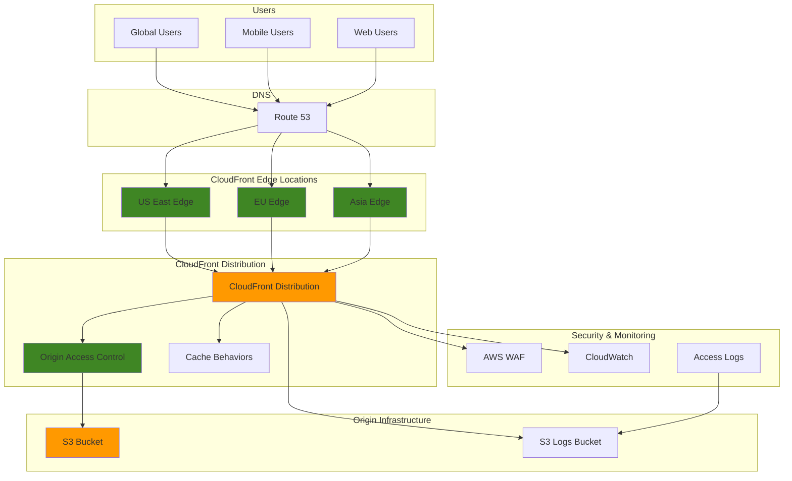

# Content Delivery Networks with CloudFront S3


## Problem

Global e-commerce companies face significant challenges delivering consistent, high-performance content to users worldwide. Traditional single-region hosting results in slow load times for international customers, impacting user experience and conversion rates. Companies struggle with bandwidth costs, origin server overload during traffic spikes, and security concerns when serving content directly from S3 buckets. Without proper content delivery optimization, businesses lose potential revenue due to poor performance and high operational costs.

## Solution

Implement a global content delivery network using Amazon CloudFront with S3 origins to provide fast, secure, and cost-effective content distribution. CloudFront edge locations cache content closer to users, reducing latency and improving performance. Origin Access Control (OAC) secures S3 buckets by restricting direct access, while advanced caching strategies and performance monitoring ensure optimal delivery. This solution provides global reach with reduced costs and enhanced security.

## Architecture Diagram



## Prerequisites

1. AWS account with appropriate permissions for CloudFront, S3, and Route 53
2. AWS CLI v2 installed and configured (or AWS CloudShell)
3. Basic understanding of CDN concepts and HTTP caching
4. Knowledge of DNS management and SSL/TLS certificates
5. Estimated cost: $5-15 per month for testing (depends on data transfer and requests)

> **Note**: CloudFront charges are based on data transfer out and requests. Monitor usage during testing to avoid unexpected costs. Use CloudFront Price Class to control which edge locations are used, reducing costs for applications that don't need global coverage - Price Class 100 covers US and Europe only.

> **Warning**: Always use Origin Access Control (OAC) instead of the legacy Origin Access Identity (OAI) for better security and support for all S3 features including SSE-KMS encryption. See [Amazon CloudFront Origin Access Control documentation](https://docs.aws.amazon.com/AmazonCloudFront/latest/DeveloperGuide/private-content-restricting-access-to-s3.html) for complete implementation details.

## Preparation

```bash
# Set environment variables
export AWS_REGION=$(aws configure get region)
export AWS_ACCOUNT_ID=$(aws sts get-caller-identity \
    --query Account --output text)

# Generate unique identifiers for resources
RANDOM_SUFFIX=$(aws secretsmanager get-random-password \
    --exclude-punctuation --exclude-uppercase \
    --password-length 6 --require-each-included-type \
    --output text --query RandomPassword)

# Set resource names
export BUCKET_NAME="cdn-content-${RANDOM_SUFFIX}"
export LOGS_BUCKET_NAME="cdn-logs-${RANDOM_SUFFIX}"
export OAC_NAME="cdn-oac-${RANDOM_SUFFIX}"
export DISTRIBUTION_NAME="cdn-distribution-${RANDOM_SUFFIX}"

# Create S3 bucket for content
aws s3 mb s3://${BUCKET_NAME} --region ${AWS_REGION}

# Create S3 bucket for CloudFront logs
aws s3 mb s3://${LOGS_BUCKET_NAME} --region ${AWS_REGION}

# Block public access to content bucket
aws s3api put-public-access-block \
    --bucket ${BUCKET_NAME} \
    --public-access-block-configuration \
    BlockPublicAcls=true,IgnorePublicAcls=true,BlockPublicPolicy=true,RestrictPublicBuckets=true

echo "✅ Created S3 buckets: ${BUCKET_NAME} and ${LOGS_BUCKET_NAME}"
```

## Steps

1. **Create sample content for testing**:

   Creating diverse content types helps demonstrate CloudFront's caching behavior for different file types. This includes static HTML, CSS, JavaScript, and images which have different optimal caching strategies.

   ```bash
   # Create sample HTML file
   cat > index.html << 'EOF'
   <!DOCTYPE html>
   <html>
   <head>
       <title>CDN Test Page</title>
       <style>
           body { font-family: Arial, sans-serif; margin: 40px; }
           .container { max-width: 800px; margin: 0 auto; }
           .header { background: #f4f4f4; padding: 20px; border-radius: 5px; }
           .content { padding: 20px 0; }
           .timestamp { color: #666; font-size: 0.9em; }
       </style>
   </head>
   <body>
       <div class="container">
           <div class="header">
               <h1>CloudFront CDN Test</h1>
               <p class="timestamp">Generated: $(date)</p>
           </div>
           <div class="content">
               <h2>Welcome to Global Content Delivery</h2>
               <p>This content is served via Amazon CloudFront edge locations worldwide.</p>
               <p>CloudFront provides fast, secure content delivery with automatic caching.</p>
           </div>
       </div>
   </body>
   </html>
   EOF
   
   # Create CSS file for testing different cache behaviors
   cat > styles.css << 'EOF'
   /* CDN Test Styles */
   body { 
       background: linear-gradient(135deg, #667eea 0%, #764ba2 100%);
       color: white;
       min-height: 100vh;
       display: flex;
       align-items: center;
   }
   .container { 
       background: rgba(255,255,255,0.1);
       backdrop-filter: blur(10px);
       border-radius: 10px;
       padding: 30px;
   }
   EOF
   
   # Upload content to S3 bucket
   aws s3 cp index.html s3://${BUCKET_NAME}/
   aws s3 cp styles.css s3://${BUCKET_NAME}/
   
   echo "✅ Created and uploaded sample content to S3"
   ```

   These sample files establish the foundation for testing different caching strategies and performance optimizations. The HTML file represents dynamic content that may change frequently, while the CSS file represents static assets that can be cached for extended periods, demonstrating how CloudFront optimizes delivery for different content types.

2. **Create CloudFront Origin Access Control (OAC)**:

   Origin Access Control (OAC) is the modern security mechanism that replaces the legacy Origin Access Identity (OAI). OAC provides better security by using AWS SigV4 authentication and supports all S3 features including server-side encryption with KMS. This enhanced security model ensures that S3 bucket access is properly restricted to only authorized CloudFront distributions, following AWS security best practices.

   ```bash
   # Create OAC configuration
   cat > oac-config.json << EOF
   {
       "Name": "${OAC_NAME}",
       "Description": "OAC for CDN content bucket",
       "OriginAccessControlOriginType": "s3",
       "SigningBehavior": "always",
       "SigningProtocol": "sigv4"
   }
   EOF
   
   # Create the OAC
   OAC_ID=$(aws cloudfront create-origin-access-control \
       --origin-access-control-config file://oac-config.json \
       --query 'OriginAccessControl.Id' --output text)
   
   echo "✅ Created Origin Access Control: ${OAC_ID}"
   ```

   The OAC ensures that only CloudFront can access your S3 bucket content, preventing direct access to your origin and improving security posture.

3. **Create CloudFront distribution configuration**:

   This step creates a comprehensive distribution configuration that defines how CloudFront handles requests, caching behaviors, and security settings. The configuration includes multiple cache behaviors for different content types, each optimized for their specific use case.

   ```bash
   # Create distribution configuration
   cat > distribution-config.json << EOF
   {
       "CallerReference": "${DISTRIBUTION_NAME}-$(date +%s)",
       "Comment": "CDN for global content delivery",
       "DefaultRootObject": "index.html",
       "Origins": {
           "Quantity": 1,
           "Items": [
               {
                   "Id": "${BUCKET_NAME}",
                   "DomainName": "${BUCKET_NAME}.s3.${AWS_REGION}.amazonaws.com",
                   "OriginPath": "",
                   "CustomHeaders": {
                       "Quantity": 0
                   },
                   "S3OriginConfig": {
                       "OriginAccessIdentity": ""
                   },
                   "OriginAccessControlId": "${OAC_ID}"
               }
           ]
       },
       "DefaultCacheBehavior": {
           "TargetOriginId": "${BUCKET_NAME}",
           "ViewerProtocolPolicy": "redirect-to-https",
           "AllowedMethods": {
               "Quantity": 2,
               "Items": ["HEAD", "GET"],
               "CachedMethods": {
                   "Quantity": 2,
                   "Items": ["HEAD", "GET"]
               }
           },
           "ForwardedValues": {
               "QueryString": false,
               "Cookies": {
                   "Forward": "none"
               }
           },
           "TrustedSigners": {
               "Enabled": false,
               "Quantity": 0
           },
           "MinTTL": 0,
           "DefaultTTL": 86400,
           "MaxTTL": 31536000,
           "Compress": true
       },
       "CacheBehaviors": {
           "Quantity": 1,
           "Items": [
               {
                   "PathPattern": "*.css",
                   "TargetOriginId": "${BUCKET_NAME}",
                   "ViewerProtocolPolicy": "redirect-to-https",
                   "AllowedMethods": {
                       "Quantity": 2,
                       "Items": ["HEAD", "GET"],
                       "CachedMethods": {
                           "Quantity": 2,
                           "Items": ["HEAD", "GET"]
                       }
                   },
                   "ForwardedValues": {
                       "QueryString": false,
                       "Cookies": {
                           "Forward": "none"
                       }
                   },
                   "TrustedSigners": {
                       "Enabled": false,
                       "Quantity": 0
                   },
                   "MinTTL": 0,
                   "DefaultTTL": 2592000,
                   "MaxTTL": 31536000,
                   "Compress": true
               }
           ]
       },
       "CustomErrorResponses": {
           "Quantity": 1,
           "Items": [
               {
                   "ErrorCode": 404,
                   "ResponsePagePath": "/index.html",
                   "ResponseCode": "200",
                   "ErrorCachingMinTTL": 300
               }
           ]
       },
       "Logging": {
           "Enabled": true,
           "IncludeCookies": false,
           "Bucket": "${LOGS_BUCKET_NAME}.s3.amazonaws.com",
           "Prefix": "cloudfront-logs/"
       },
       "Enabled": true,
       "PriceClass": "PriceClass_100",
       "ViewerCertificate": {
           "CloudFrontDefaultCertificate": true,
           "MinimumProtocolVersion": "TLSv1.2_2021"
       },
       "Restrictions": {
           "GeoRestriction": {
               "RestrictionType": "none",
               "Quantity": 0
           }
       },
       "HttpVersion": "http2",
       "IsIPV6Enabled": true
   }
   EOF
   
   echo "✅ Created CloudFront distribution configuration"
   ```

   The configuration includes different TTL settings for various content types: HTML pages have shorter TTLs for dynamic updates, while CSS files have longer TTLs for better performance. The price class setting limits edge locations to US and Europe for cost optimization.

4. **Create CloudFront distribution**:

   This step creates the actual CloudFront distribution using the configuration defined in the previous step. CloudFront will provision edge locations worldwide and begin accepting traffic once deployment completes.

   ```bash
   # Create the distribution
   DISTRIBUTION_OUTPUT=$(aws cloudfront create-distribution \
       --distribution-config file://distribution-config.json)
   
   # Extract distribution ID and domain name
   DISTRIBUTION_ID=$(echo $DISTRIBUTION_OUTPUT | \
       jq -r '.Distribution.Id')
   DISTRIBUTION_DOMAIN=$(echo $DISTRIBUTION_OUTPUT | \
       jq -r '.Distribution.DomainName')
   
   echo "✅ Created CloudFront distribution: ${DISTRIBUTION_ID}"
   echo "✅ Distribution domain: ${DISTRIBUTION_DOMAIN}"
   ```

   The distribution ID and domain name are essential for subsequent configuration steps and testing. CloudFront assigns a unique domain name that can be used immediately for content delivery.

5. **Configure S3 bucket policy for OAC access**:

   The S3 bucket policy grants CloudFront permission to access objects in the bucket using the Origin Access Control. This policy ensures that only the specific CloudFront distribution can access the bucket content, preventing unauthorized direct access.

   ```bash
   # Create bucket policy for OAC
   cat > bucket-policy.json << EOF
   {
       "Version": "2012-10-17",
       "Statement": [
           {
               "Sid": "AllowCloudFrontServicePrincipal",
               "Effect": "Allow",
               "Principal": {
                   "Service": "cloudfront.amazonaws.com"
               },
               "Action": "s3:GetObject",
               "Resource": "arn:aws:s3:::${BUCKET_NAME}/*",
               "Condition": {
                   "StringEquals": {
                       "AWS:SourceArn": "arn:aws:cloudfront::${AWS_ACCOUNT_ID}:distribution/${DISTRIBUTION_ID}"
                   }
               }
           }
       ]
   }
   EOF
   
   # Apply the bucket policy
   aws s3api put-bucket-policy \
       --bucket ${BUCKET_NAME} \
       --policy file://bucket-policy.json
   
   echo "✅ Applied S3 bucket policy for OAC access"
   ```

   The bucket policy uses the distribution ARN as a condition, ensuring that only requests from this specific CloudFront distribution are allowed. This provides granular access control and prevents other CloudFront distributions from accessing your content.

6. **Wait for distribution deployment**:

   CloudFront distribution deployment typically takes 10-15 minutes as AWS provisions edge locations worldwide and propagates the configuration. This wait is essential before testing the distribution to ensure all edge locations are ready.

   ```bash
   # Wait for distribution to be deployed
   echo "⏳ Waiting for CloudFront distribution to deploy..."
   echo "This typically takes 10-15 minutes..."
   
   aws cloudfront wait distribution-deployed \
       --id ${DISTRIBUTION_ID}
   
   echo "✅ CloudFront distribution deployed successfully"
   ```

   Once deployment completes, all global edge locations will have the distribution configuration and can begin serving cached content to users with optimal performance.

7. **Configure CloudWatch alarms for monitoring**:

   CloudWatch alarms provide proactive monitoring for your CDN by alerting when performance degrades or errors increase. These alarms help detect issues before they significantly impact user experience. CloudWatch integration with CloudFront enables comprehensive monitoring of distribution performance, error rates, and cache efficiency across all edge locations.

   ```bash
   # Create CloudWatch alarm for high error rate
   aws cloudwatch put-metric-alarm \
       --alarm-name "CloudFront-HighErrorRate-${DISTRIBUTION_ID}" \
       --alarm-description "High error rate for CloudFront distribution" \
       --metric-name "4xxErrorRate" \
       --namespace "AWS/CloudFront" \
       --statistic "Average" \
       --period 300 \
       --threshold 5 \
       --comparison-operator "GreaterThanThreshold" \
       --evaluation-periods 2 \
       --dimensions Name=DistributionId,Value=${DISTRIBUTION_ID}
   
   # Create CloudWatch alarm for origin latency
   aws cloudwatch put-metric-alarm \
       --alarm-name "CloudFront-HighOriginLatency-${DISTRIBUTION_ID}" \
       --alarm-description "High origin latency for CloudFront distribution" \
       --metric-name "OriginLatency" \
       --namespace "AWS/CloudFront" \
       --statistic "Average" \
       --period 300 \
       --threshold 1000 \
       --comparison-operator "GreaterThanThreshold" \
       --evaluation-periods 2 \
       --dimensions Name=DistributionId,Value=${DISTRIBUTION_ID}
   
   
   echo "✅ Created CloudWatch alarms for distribution monitoring"
   ```

   The error rate alarm triggers when 4xx errors exceed 5% average over two 5-minute periods, while the latency alarm triggers when origin response time exceeds 1000ms. These thresholds balance early warning with false positive prevention.

   > **Tip**: Configure CloudWatch alarms with appropriate thresholds to balance between early warning and false positive alerts. See [CloudFront monitoring with CloudWatch documentation](https://docs.aws.amazon.com/AmazonCloudFront/latest/DeveloperGuide/monitoring-using-cloudwatch.html) for comprehensive monitoring strategies.

8. **Test cache invalidation functionality**:

   Cache invalidation forces CloudFront to fetch fresh content from the origin for specified paths. This demonstrates how to update cached content when changes are made to the origin, though it should be used sparingly due to cost implications.

   ```bash
   # Update the HTML file with new content
   cat > index.html << 'EOF'
   <!DOCTYPE html>
   <html>
   <head>
       <title>CDN Test Page - Updated</title>
       <style>
           body { font-family: Arial, sans-serif; margin: 40px; }
           .container { max-width: 800px; margin: 0 auto; }
           .header { background: #e8f5e8; padding: 20px; border-radius: 5px; }
           .content { padding: 20px 0; }
           .timestamp { color: #666; font-size: 0.9em; }
           .update-notice { background: #fff3cd; padding: 15px; border-radius: 5px; margin: 20px 0; }
       </style>
   </head>
   <body>
       <div class="container">
           <div class="header">
               <h1>CloudFront CDN Test - Updated Version</h1>
               <p class="timestamp">Updated: $(date)</p>
           </div>
           <div class="update-notice">
               <strong>Content Updated:</strong> This demonstrates cache invalidation functionality.
           </div>
           <div class="content">
               <h2>Welcome to Global Content Delivery</h2>
               <p>This updated content demonstrates CloudFront cache invalidation.</p>
               <p>Edge locations worldwide cache content for optimal performance.</p>
           </div>
       </div>
   </body>
   </html>
   EOF
   
   # Upload updated content
   aws s3 cp index.html s3://${BUCKET_NAME}/
   
   # Create cache invalidation
   INVALIDATION_ID=$(aws cloudfront create-invalidation \
       --distribution-id ${DISTRIBUTION_ID} \
       --paths "/*" \
       --query 'Invalidation.Id' --output text)
   
   echo "✅ Created cache invalidation: ${INVALIDATION_ID}"
   echo "✅ Updated content uploaded and invalidation initiated"
   ```

   The wildcard invalidation (/*) clears all cached content, ensuring users see the updated version immediately. In production, use specific paths to minimize costs and avoid impacting cache performance. For details on invalidation costs and best practices, see [Amazon CloudFront cache invalidation documentation](https://docs.aws.amazon.com/AmazonCloudFront/latest/DeveloperGuide/Invalidation.html).

9. **Configure custom caching behaviors for different content types**:

   Different content types benefit from different caching strategies. API responses typically have shorter cache durations than static assets, while images and documents can be cached for extended periods to maximize performance.

   ```bash
   # Create additional content types for testing
   cat > api-response.json << 'EOF'
   {
       "status": "success",
       "data": {
           "message": "API endpoint cached for 1 hour",
           "timestamp": "$(date -u +%Y-%m-%dT%H:%M:%SZ)",
           "cacheable": true
       }
   }
   EOF
   
   # Create an image placeholder
   echo "Placeholder image content" > placeholder.txt
   
   # Upload different content types
   aws s3 cp api-response.json s3://${BUCKET_NAME}/api/
   aws s3 cp placeholder.txt s3://${BUCKET_NAME}/images/
   
   echo "✅ Uploaded additional content types for cache behavior testing"
   ```

   This diverse content allows testing of different cache behaviors defined in the distribution configuration. The API path will demonstrate shorter cache durations while the images path shows longer caching behavior.

10. **Set up performance monitoring dashboard**:

    A CloudWatch dashboard provides centralized visibility into CloudFront performance metrics, enabling quick identification of traffic patterns, performance issues, and optimization opportunities.

    ```bash
    # Create CloudWatch dashboard
    cat > dashboard-config.json << EOF
    {
        "widgets": [
            {
                "type": "metric",
                "properties": {
                    "metrics": [
                        ["AWS/CloudFront", "Requests", "DistributionId", "${DISTRIBUTION_ID}"],
                        [".", "BytesDownloaded", ".", "."],
                        [".", "4xxErrorRate", ".", "."],
                        [".", "5xxErrorRate", ".", "."]
                    ],
                    "period": 300,
                    "stat": "Sum",
                    "region": "us-east-1",
                    "title": "CloudFront Performance Metrics"
                }
            },
            {
                "type": "metric",
                "properties": {
                    "metrics": [
                        ["AWS/CloudFront", "CacheHitRate", "DistributionId", "${DISTRIBUTION_ID}"],
                        [".", "OriginLatency", ".", "."]
                    ],
                    "period": 300,
                    "stat": "Average",
                    "region": "us-east-1",
                    "title": "Cache Performance"
                }
            }
        ]
    }
    EOF
    
    # Create the dashboard
    aws cloudwatch put-dashboard \
        --dashboard-name "CloudFront-CDN-Performance" \
        --dashboard-body file://dashboard-config.json
    
    echo "✅ Created CloudWatch dashboard for performance monitoring"
    ```

    The dashboard includes key metrics like request counts, error rates, cache hit ratios, and origin latency. These metrics provide insights for optimizing cache policies and identifying performance bottlenecks.

## Validation & Testing

1. **Verify distribution is accessible**:

   ```bash
   # Test CloudFront distribution
   echo "Testing CloudFront distribution..."
   curl -I https://${DISTRIBUTION_DOMAIN}
   
   # Check if content is served correctly
   curl -s https://${DISTRIBUTION_DOMAIN} | grep -q "CloudFront CDN Test"
   
   if [ $? -eq 0 ]; then
       echo "✅ Distribution is serving content correctly"
   else
       echo "❌ Distribution test failed"
   fi
   ```

   Expected output: HTTP/2 200 status with CloudFront headers

2. **Test cache behavior for different content types**:

   ```bash
   # Test CSS file caching
   echo "Testing CSS cache behavior..."
   curl -I https://${DISTRIBUTION_DOMAIN}/styles.css
   
   # Test API endpoint caching
   echo "Testing API cache behavior..."
   curl -I https://${DISTRIBUTION_DOMAIN}/api/api-response.json
   
   echo "✅ Cache behavior tests completed"
   ```

3. **Verify Origin Access Control is working**:

   ```bash
   # Test direct S3 access (should fail)
   echo "Testing direct S3 access (should be blocked)..."
   curl -I https://${BUCKET_NAME}.s3.${AWS_REGION}.amazonaws.com/index.html
   
   # Test CloudFront access (should succeed)
   echo "Testing CloudFront access (should succeed)..."
   curl -I https://${DISTRIBUTION_DOMAIN}/index.html
   
   echo "✅ Origin Access Control verification completed"
   ```

4. **Test cache invalidation**:

   ```bash
   # Check invalidation status
   aws cloudfront get-invalidation \
       --distribution-id ${DISTRIBUTION_ID} \
       --id ${INVALIDATION_ID}
   
   echo "✅ Cache invalidation status checked"
   ```

5. **Verify CloudWatch metrics are being collected**:

   ```bash
   # Check CloudWatch metrics
   aws cloudwatch get-metric-statistics \
       --namespace AWS/CloudFront \
       --metric-name Requests \
       --dimensions Name=DistributionId,Value=${DISTRIBUTION_ID} \
       --start-time $(date -u -d '1 hour ago' +%Y-%m-%dT%H:%M:%SZ) \
       --end-time $(date -u +%Y-%m-%dT%H:%M:%SZ) \
       --period 3600 \
       --statistics Sum
   
   echo "✅ CloudWatch metrics verification completed"
   ```

## Cleanup

1. **Disable CloudFront distribution**:

   ```bash
   # Get current distribution configuration
   aws cloudfront get-distribution-config \
       --id ${DISTRIBUTION_ID} > current-config.json
   
   # Extract ETag
   ETAG=$(jq -r '.ETag' current-config.json)
   
   # Modify configuration to disable distribution
   jq '.DistributionConfig.Enabled = false' current-config.json > disabled-config.json
   
   # Update distribution to disabled state
   aws cloudfront update-distribution \
       --id ${DISTRIBUTION_ID} \
       --if-match ${ETAG} \
       --distribution-config file://disabled-config.json
   
   echo "✅ Distribution disabled"
   ```

2. **Wait for distribution to be disabled**:

   ```bash
   # Wait for distribution to be disabled
   echo "⏳ Waiting for distribution to be disabled..."
   aws cloudfront wait distribution-deployed \
       --id ${DISTRIBUTION_ID}
   
   echo "✅ Distribution disabled successfully"
   ```

3. **Delete CloudFront distribution**:

   ```bash
   # Get updated ETag after disable
   UPDATED_ETAG=$(aws cloudfront get-distribution \
       --id ${DISTRIBUTION_ID} \
       --query 'ETag' --output text)
   
   # Delete the distribution
   aws cloudfront delete-distribution \
       --id ${DISTRIBUTION_ID} \
       --if-match ${UPDATED_ETAG}
   
   echo "✅ Deleted CloudFront distribution"
   ```

4. **Delete Origin Access Control**:

   ```bash
   # Get OAC ETag
   OAC_ETAG=$(aws cloudfront get-origin-access-control \
       --id ${OAC_ID} \
       --query 'ETag' --output text)
   
   # Delete OAC
   aws cloudfront delete-origin-access-control \
       --id ${OAC_ID} \
       --if-match ${OAC_ETAG}
   
   echo "✅ Deleted Origin Access Control"
   ```

5. **Remove S3 buckets and content**:

   ```bash
   # Delete S3 bucket contents
   aws s3 rm s3://${BUCKET_NAME} --recursive
   aws s3 rm s3://${LOGS_BUCKET_NAME} --recursive
   
   # Delete S3 buckets
   aws s3 rb s3://${BUCKET_NAME}
   aws s3 rb s3://${LOGS_BUCKET_NAME}
   
   echo "✅ Deleted S3 buckets and content"
   ```

6. **Delete CloudWatch alarms and dashboard**:

   ```bash
   # Delete CloudWatch alarms
   aws cloudwatch delete-alarms \
       --alarm-names "CloudFront-HighErrorRate-${DISTRIBUTION_ID}" \
                     "CloudFront-HighOriginLatency-${DISTRIBUTION_ID}"
   
   # Delete CloudWatch dashboard
   aws cloudwatch delete-dashboards \
       --dashboard-names "CloudFront-CDN-Performance"
   
   echo "✅ Deleted CloudWatch alarms and dashboard"
   ```

7. **Clean up local files**:

   ```bash
   # Remove configuration files
   rm -f index.html styles.css api-response.json placeholder.txt
   rm -f oac-config.json distribution-config.json bucket-policy.json
   rm -f dashboard-config.json current-config.json disabled-config.json
   
   # Clear environment variables
   unset BUCKET_NAME LOGS_BUCKET_NAME OAC_NAME DISTRIBUTION_NAME
   unset DISTRIBUTION_ID DISTRIBUTION_DOMAIN OAC_ID
   
   echo "✅ Cleaned up local files and environment variables"
   ```

## Discussion

Amazon CloudFront provides a powerful global content delivery network that significantly improves web application performance and reduces operational costs. This implementation demonstrates key CDN concepts including edge caching, origin security, and performance optimization. The Origin Access Control (OAC) feature represents AWS's recommended approach for securing S3 origins, replacing the older Origin Access Identity (OAI) with better security and broader feature support.

The cache behavior configuration is crucial for optimizing performance and costs. Different content types require different caching strategies - static assets like CSS and images benefit from longer cache durations, while dynamic content may need shorter TTLs or conditional caching. The price class setting allows cost optimization by limiting edge locations to specific regions based on your user base geography.

CloudWatch integration provides essential monitoring capabilities for production deployments. Key metrics include cache hit rates, origin latency, error rates, and bandwidth usage. Setting up alarms for critical thresholds ensures proactive monitoring and quick response to performance issues. The dashboard provides a centralized view of CDN performance across all metrics.

Security considerations extend beyond origin access control. CloudFront integrates with AWS WAF for application-layer protection, supports SSL/TLS termination, and provides geographic restrictions for content compliance. The HTTPS redirect policy ensures secure content delivery while maintaining performance through HTTP/2 support.

> **Tip**: Monitor cache hit rates regularly. Low cache hit rates may indicate suboptimal cache behaviors or excessive cache invalidations, both of which increase costs and reduce performance.

## Challenge

Extend this solution by implementing these enhancements:

1. **Custom Domain with SSL Certificate**: Configure a custom domain name using Route 53 and AWS Certificate Manager for branded URLs and enhanced security.

2. **Lambda@Edge Functions**: Implement Lambda@Edge functions for dynamic content modification, A/B testing, or request/response manipulation at edge locations.

3. **Multi-Origin Configuration**: Set up multiple origins (S3, ALB, API Gateway) with different cache behaviors and failover configurations for a complete web application.

4. **Advanced Security**: Integrate AWS WAF with custom rules, implement signed URLs for premium content, and configure geographic restrictions based on compliance requirements.

5. **Performance Optimization**: Implement HTTP/2 server push, configure compression settings, and set up real-time logs for detailed performance analysis and optimization.

## Infrastructure Code

*Infrastructure code will be generated after recipe approval.*