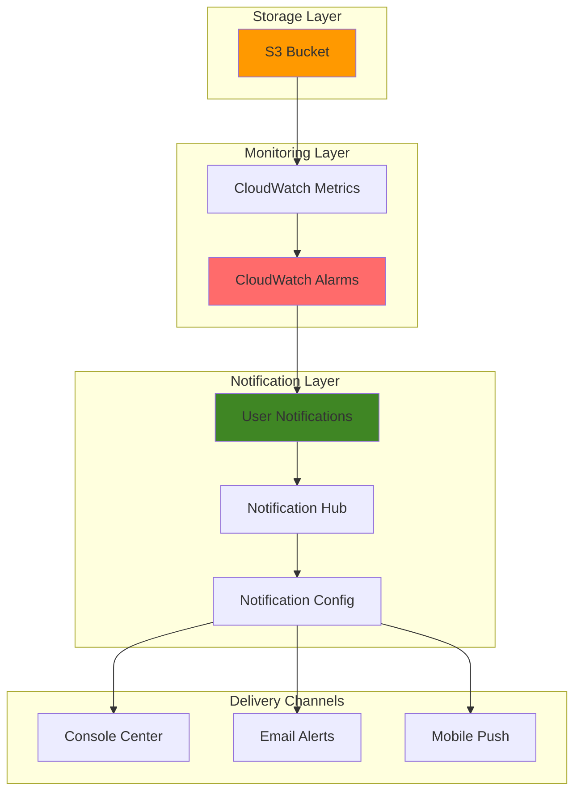

# Centralized Alert Management with User Notifications and CloudWatch

## Problem

Enterprise organizations struggle with alert fatigue and scattered notifications across multiple AWS services, making it difficult to respond promptly to critical infrastructure issues. Traditional notification systems send alerts to various channels without central coordination, resulting in missed alerts, delayed incident response, and operational inefficiencies that can impact business continuity.

## Solution

AWS User Notifications provides a centralized notification management system that consolidates CloudWatch alarms and other AWS service alerts into a unified dashboard with configurable delivery channels. This solution creates a single pane of glass for monitoring S3 storage metrics, enabling teams to manage notification preferences, filter alerts by priority, and ensure critical issues receive immediate attention through multiple delivery methods.

## Architecture Diagram



## Prerequisites

1. AWS account with Administrator access for CloudWatch, S3, and User Notifications services
2. AWS CLI v2 installed and configured with appropriate credentials
3. Basic understanding of AWS CloudWatch metrics and alarm concepts
4. Valid email address for notification testing
5. Estimated cost: $0.10-$0.50 per month for CloudWatch alarms and S3 storage

> **Note**: AWS User Notifications is available in most AWS regions. Verify service availability in your target region before proceeding.

## Preparation

```bash
# Set environment variables
export AWS_REGION=$(aws configure get region)
export AWS_ACCOUNT_ID=$(aws sts get-caller-identity \
    --query Account --output text)

# Generate unique identifiers for resources
RANDOM_SUFFIX=$(aws secretsmanager get-random-password \
    --exclude-punctuation --exclude-uppercase \
    --password-length 6 --require-each-included-type \
    --output text --query RandomPassword)

# Set resource names
export BUCKET_NAME="monitoring-demo-${RANDOM_SUFFIX}"
export ALARM_NAME="s3-bucket-size-alarm"
export NOTIFICATION_CONFIG_NAME="s3-monitoring-config"

echo "✅ AWS environment configured for region: ${AWS_REGION}"
echo "✅ Using bucket name: ${BUCKET_NAME}"
```

## Steps

1. **Create S3 Bucket with CloudWatch Metrics**:

   Amazon S3 provides built-in integration with CloudWatch for monitoring storage metrics, enabling automatic collection of bucket-level statistics. Creating a bucket with CloudWatch request metrics enabled establishes the foundation for comprehensive storage monitoring and proactive alerting on capacity, usage, and access patterns.

   ```bash
   # Create S3 bucket with versioning
   aws s3 mb s3://${BUCKET_NAME} --region ${AWS_REGION}
   
   # Enable versioning for better tracking
   aws s3api put-bucket-versioning \
       --bucket ${BUCKET_NAME} \
       --versioning-configuration Status=Enabled
   
   # Enable CloudWatch request metrics
   aws s3api put-bucket-metrics-configuration \
       --bucket ${BUCKET_NAME} \
       --id EntireBucket \
       --metrics-configuration Id=EntireBucket
   
   echo "✅ S3 bucket ${BUCKET_NAME} created with CloudWatch metrics enabled"
   ```

   The S3 bucket now automatically publishes daily storage metrics and optional request metrics to CloudWatch, providing comprehensive visibility into storage utilization, object count, and request patterns that form the basis for intelligent alerting.

2. **Upload Sample Files to Generate Metrics**:

   Generating initial storage activity creates baseline metrics for CloudWatch monitoring and ensures alarm thresholds can be properly configured. This step simulates real-world usage patterns that will trigger metric collection and provide data for testing the complete notification workflow.

   ```bash
   # Create sample files with different sizes
   echo "Sample monitoring data - $(date)" > sample1.txt
   echo "Additional test content for metrics generation" > sample2.txt
   
   # Upload files to S3 bucket
   aws s3 cp sample1.txt s3://${BUCKET_NAME}/data/
   aws s3 cp sample2.txt s3://${BUCKET_NAME}/logs/
   
   # Create a larger file for size-based monitoring
   dd if=/dev/zero of=largefile.dat bs=1024 count=1024 2>/dev/null
   aws s3 cp largefile.dat s3://${BUCKET_NAME}/archive/
   
   # Clean up local files
   rm -f sample1.txt sample2.txt largefile.dat
   
   echo "✅ Sample files uploaded to generate CloudWatch metrics"
   ```

   The uploaded files establish initial storage metrics and request patterns that CloudWatch will track, enabling the creation of meaningful alarms based on actual bucket usage rather than theoretical thresholds.

3. **Create CloudWatch Alarm for Bucket Size**:

   CloudWatch alarms provide intelligent monitoring by evaluating metric thresholds and triggering notifications when storage patterns indicate potential issues. This alarm monitors bucket size growth and serves as the event source for the centralized notification system, ensuring storage capacity concerns are immediately escalated.

   ```bash
   # Create CloudWatch alarm for bucket size monitoring
   aws cloudwatch put-metric-alarm \
       --alarm-name ${ALARM_NAME} \
       --alarm-description "Monitor S3 bucket size growth" \
       --metric-name BucketSizeBytes \
       --namespace AWS/S3 \
       --statistic Average \
       --period 86400 \
       --threshold 5000000 \
       --comparison-operator GreaterThanThreshold \
       --evaluation-periods 1 \
       --treat-missing-data notBreaching \
       --dimensions Name=BucketName,Value=${BUCKET_NAME} \
                    Name=StorageType,Value=StandardStorage
   
   # Verify alarm creation
   aws cloudwatch describe-alarms \
       --alarm-names ${ALARM_NAME} \
       --query "MetricAlarms[0].{Name:AlarmName,State:StateValue}"
   
   echo "✅ CloudWatch alarm ${ALARM_NAME} created for bucket monitoring"
   ```

   The CloudWatch alarm continuously evaluates S3 storage metrics and changes state when thresholds are exceeded, providing the trigger mechanism for automated notifications through the User Notifications service integration.

4. **Register User Notifications Hub**:

   AWS User Notifications requires a notification hub to aggregate and process alerts from multiple AWS services. The hub serves as the central processing engine that receives CloudWatch alarm state changes and routes them according to configured delivery preferences and filtering rules. Registration establishes the regional endpoint for notification processing.

   ```bash
   # Register notification hub for centralized management
   aws notifications register-notification-hub \
       --notification-hub-region ${AWS_REGION}
   
   # Verify notification hub registration
   aws notifications list-notification-hubs \
       --query "notificationHubs[0].{Region:notificationHubRegion,Status:status}"
   
   echo "✅ Notification hub registered in region: ${AWS_REGION}"
   ```

   The notification hub establishes the central coordination point for all alert processing, enabling sophisticated routing logic and ensuring consistent notification delivery across multiple channels and user preferences. Hub registration is a one-time operation per region that enables notification processing capabilities.

5. **Create Email Contact for Notifications**:

   Setting up email contacts enables immediate notification delivery to operations teams and stakeholders. AWS User Notifications uses a dedicated contacts service to manage email addresses and handle activation workflows, ensuring reliable delivery to verified recipients.

   ```bash
   # Prompt for email address
   read -p "Enter your email address for notifications: " USER_EMAIL
   
   # Create email contact using User Notifications Contacts service
   aws notificationscontacts create-email-contact \
       --name "monitoring-alerts-contact" \
       --email-address "${USER_EMAIL}"
   
   # Get the email contact ARN
   EMAIL_CONTACT_ARN=$(aws notificationscontacts list-email-contacts \
       --query "emailContacts[?name=='monitoring-alerts-contact'].arn" \
       --output text)
   
   echo "✅ Email contact created: ${EMAIL_CONTACT_ARN}"
   echo "📧 Check your email for activation instructions"
   ```

   The email contact provides reliable, asynchronous notification delivery with built-in activation verification and delivery confirmation. Email contacts must be activated before they can receive notifications, ensuring that only verified recipients receive critical alerts.

6. **Create Notification Configuration**:

   User notification configurations define the complete alerting workflow by connecting CloudWatch alarms to delivery channels through sophisticated filtering and routing rules. This configuration enables centralized management of alert priorities, recipient groups, and escalation procedures for comprehensive incident response automation.

   ```bash
   # Wait for email contact activation (optional manual step)
   echo "⏳ Waiting for email contact activation..."
   echo "Please check your email and activate the contact before proceeding"
   read -p "Press Enter after email activation is complete..."
   
   # Create event rule for CloudWatch alarm state changes
   aws notifications create-event-rule \
       --name "${NOTIFICATION_CONFIG_NAME}-event-rule" \
       --description "Filter CloudWatch alarm state changes for S3 monitoring" \
       --event-pattern '{
         "source": ["aws.cloudwatch"],
         "detail-type": ["CloudWatch Alarm State Change"],
         "detail": {
           "alarmName": ["'${ALARM_NAME}'"],
           "state": {
             "value": ["ALARM", "OK"]
           }
         }
       }'
   
   # Create notification configuration
   aws notifications create-notification-configuration \
       --name "${NOTIFICATION_CONFIG_NAME}" \
       --description "S3 monitoring notification configuration" \
       --aggregation-duration "PT5M"
   
   # Get notification configuration ARN
   NOTIFICATION_CONFIG_ARN=$(aws notifications list-notification-configurations \
       --query "notificationConfigurations[?name=='${NOTIFICATION_CONFIG_NAME}'].arn" \
       --output text)
   
   # Associate email contact with notification configuration
   aws notifications associate-channel \
       --arn "${EMAIL_CONTACT_ARN}" \
       --notification-configuration-arn "${NOTIFICATION_CONFIG_ARN}"
   
   echo "✅ Notification configuration created and associated with email contact"
   ```

   The configuration establishes intelligent event processing that filters CloudWatch alarm state changes, aggregates related notifications over 5-minute windows, and ensures appropriate delivery timing to prevent alert flooding while maintaining notification reliability.

7. **Test Notification System**:

   Validating the complete notification workflow ensures reliable alert delivery and proper system integration. This testing process verifies that CloudWatch alarms correctly trigger User Notifications processing and that configured delivery channels successfully reach intended recipients with properly formatted alert content.

   ```bash
   # Manually trigger alarm state change for testing
   aws cloudwatch set-alarm-state \
       --alarm-name ${ALARM_NAME} \
       --state-value ALARM \
       --state-reason "Manual test of notification system"
   
   echo "✅ Alarm state set to ALARM for testing purposes"
   echo "Check your email and AWS Console Notifications Center for alerts"
   
   # Wait and reset alarm state
   sleep 30
   aws cloudwatch set-alarm-state \
       --alarm-name ${ALARM_NAME} \
       --state-value OK \
       --state-reason "Test completed - resetting to OK state"
   
   echo "✅ Alarm state reset to OK - test completed"
   ```

   The test cycle validates end-to-end notification delivery, confirming that alarm state changes successfully trigger User Notifications processing and reach configured delivery channels with appropriate content and timing.

## Validation & Testing

1. **Verify S3 bucket and metrics configuration**:

   ```bash
   # Check bucket exists and has metrics enabled
   aws s3api get-bucket-metrics-configuration \
       --bucket ${BUCKET_NAME} \
       --id EntireBucket
   
   # List bucket contents
   aws s3 ls s3://${BUCKET_NAME} --recursive
   ```

   Expected output: JSON configuration showing metrics enabled and list of uploaded files.

2. **Confirm CloudWatch alarm status**:

   ```bash
   # Verify alarm configuration and current state
   aws cloudwatch describe-alarms \
       --alarm-names ${ALARM_NAME} \
       --query "MetricAlarms[0].{Name:AlarmName,State:StateValue,Threshold:Threshold}"
   ```

   Expected output: Alarm details showing OK state and configured threshold of 5000000 bytes.

3. **Check notification hub and email contacts**:

   ```bash
   # List notification hubs
   aws notifications list-notification-hubs \
       --query "notificationHubs[*].{Region:notificationHubRegion,Status:status}"
   
   # List email contacts
   aws notificationscontacts list-email-contacts \
       --query "emailContacts[*].{Name:name,Status:status,Email:emailAddress}"
   ```

   Expected output: Active notification hub in your region and activated email contact configuration.

4. **Verify User Notifications console access**:

   Access the AWS Management Console and navigate to User Notifications to confirm:
   - Notification hub is active
   - Configuration rules are properly set
   - Test notifications appear in the Console Notifications Center

## Cleanup

1. **Remove notification configurations and associations**:

   ```bash
   # Get notification configuration ARN
   NOTIFICATION_CONFIG_ARN=$(aws notifications \
       list-notification-configurations \
       --query "notificationConfigurations[?name=='${NOTIFICATION_CONFIG_NAME}'].arn" \
       --output text)
   
   # Disassociate email contact from notification configuration
   aws notifications disassociate-channel \
       --arn "${EMAIL_CONTACT_ARN}" \
       --notification-configuration-arn "${NOTIFICATION_CONFIG_ARN}"
   
   # Delete event rule
   aws notifications delete-event-rule \
       --name "${NOTIFICATION_CONFIG_NAME}-event-rule"
   
   # Delete notification configuration
   aws notifications delete-notification-configuration \
       --arn "${NOTIFICATION_CONFIG_ARN}"
   
   echo "✅ Notification configuration and associations deleted"
   ```

2. **Remove email contact and notification hub**:

   ```bash
   # Delete email contact
   aws notificationscontacts delete-email-contact \
       --arn "${EMAIL_CONTACT_ARN}"
   
   # Deregister notification hub
   aws notifications deregister-notification-hub \
       --notification-hub-region ${AWS_REGION}
   
   echo "✅ Email contact deleted and notification hub deregistered"
   ```

3. **Delete CloudWatch alarm**:

   ```bash
   # Remove CloudWatch alarm
   aws cloudwatch delete-alarms --alarm-names ${ALARM_NAME}
   
   echo "✅ CloudWatch alarm deleted"
   ```

4. **Remove S3 bucket and contents**:

   ```bash
   # Delete all objects in bucket
   aws s3 rm s3://${BUCKET_NAME} --recursive
   
   # Delete the bucket
   aws s3 rb s3://${BUCKET_NAME}
   
   echo "✅ S3 bucket and contents removed"
   ```

## Discussion

AWS User Notifications represents a significant advancement in centralized alert management, addressing the common enterprise challenge of notification sprawl across multiple AWS services. By consolidating CloudWatch alarms, AWS Health events, and other service notifications into a unified dashboard, organizations can reduce alert fatigue and improve incident response times. This service follows the AWS Well-Architected Framework's operational excellence pillar by enabling automated operations and centralized monitoring that scales with organizational growth.

The integration between CloudWatch and User Notifications leverages Amazon EventBridge for reliable event delivery, ensuring that alarm state changes are consistently processed even during high-traffic periods. This architecture supports sophisticated filtering and aggregation capabilities, allowing teams to customize notification timing and reduce duplicate alerts while maintaining critical notification delivery. The 5-minute aggregation duration configured in this recipe helps balance responsiveness with notification consolidation, preventing alert storms during cascading failures.

Cost optimization is achieved through intelligent notification batching and the use of daily storage metrics for S3 monitoring, which are provided at no additional charge. Request metrics, while optional and billable, provide more granular insights for high-traffic buckets where real-time monitoring justifies the additional cost. Organizations should evaluate their monitoring requirements against the [Amazon CloudWatch pricing](https://aws.amazon.com/cloudwatch/pricing/) structure to optimize their alerting strategy.

The centralized notification approach significantly improves security incident response by ensuring that critical alerts reach appropriate personnel through multiple channels. This design supports compliance requirements for incident notification and provides audit trails for alert delivery confirmation. For comprehensive guidance on implementing monitoring strategies, refer to the [AWS User Notifications User Guide](https://docs.aws.amazon.com/notifications/latest/userguide/) and [CloudWatch monitoring best practices](https://docs.aws.amazon.com/AmazonCloudWatch/latest/monitoring/cloudwatch_concepts.html).

> **Tip**: Configure multiple email contacts for different severity levels and create separate notification configurations to ensure critical alerts reach on-call personnel while routine notifications go to appropriate team channels. This tiered approach prevents alert fatigue while maintaining comprehensive coverage.

## Challenge

Extend this solution by implementing these enhancements:

1. **Multi-Service Integration**: Add CloudWatch alarms for EC2 instances, RDS databases, and Lambda functions to create comprehensive infrastructure monitoring with unified notification delivery.

2. **Advanced Filtering Rules**: Implement sophisticated EventBridge rules that filter notifications based on resource tags, account IDs, or custom metadata to support multi-tenant environments and complex organizational structures.

3. **Escalation Policies**: Create time-based escalation workflows using Step Functions that automatically escalate unacknowledged critical alerts to senior personnel or management after specified time intervals.

4. **Custom Dashboards**: Build CloudWatch dashboards that integrate with User Notifications to provide visual correlation between metrics trends and notification patterns, enabling proactive issue identification.

5. **API Integration**: Develop custom applications using the User Notifications API to create specialized notification interfaces for mobile apps, chatbots, or external incident management systems like PagerDuty or ServiceNow.

## Infrastructure Code

### Available Infrastructure as Code:

- [Infrastructure Code Overview](code/README.md) - Detailed description of all infrastructure components
- [AWS CDK (Python)](code/cdk-python/) - AWS CDK Python implementation
- [AWS CDK (TypeScript)](code/cdk-typescript/) - AWS CDK TypeScript implementation
- [CloudFormation](code/cloudformation.yaml) - AWS CloudFormation template
- [Bash CLI Scripts](code/scripts/) - Example bash scripts using AWS CLI commands to deploy infrastructure
- [Terraform](code/terraform/) - Terraform configuration files