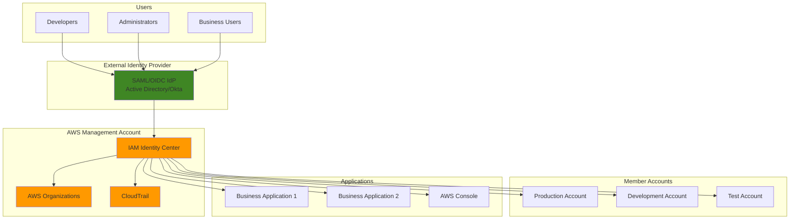

# Centralized Identity Federation

## Problem

Enterprise organizations struggle with managing user identities across multiple AWS accounts and external systems, leading to security vulnerabilities from password sprawl, administrative overhead from maintaining separate user directories, and compliance challenges from lack of centralized audit trails. Traditional approaches using individual IAM users don't scale effectively for enterprise environments with hundreds or thousands of users requiring access to different applications and AWS accounts based on their roles and responsibilities.

## Solution

AWS IAM Identity Center (successor to AWS SSO) provides centralized identity management that integrates with external identity providers and enables single sign-on across multiple AWS accounts and applications. This solution establishes a scalable identity federation architecture that centralizes user management, implements role-based access control through permission sets, and provides comprehensive audit capabilities while maintaining security best practices for enterprise identity governance.

## Architecture Diagram



## Prerequisites

1. AWS Organizations set up with management account and member accounts
2. AWS CLI v2 installed and configured with administrative permissions
3. External identity provider (Active Directory, Okta, Azure AD, etc.) for federation
4. Knowledge of SAML/OIDC protocols and identity federation concepts
5. Understanding of IAM roles, policies, and cross-account access patterns
6. Estimated cost: $15-25/month for IAM Identity Center usage, CloudTrail storage costs

> **Note**: This recipe requires administrative access to AWS Organizations and the ability to configure external identity providers. Some steps may require coordination with your identity provider administrator.

## Preparation

```bash
# Set environment variables
export AWS_REGION=$(aws configure get region)
export AWS_ACCOUNT_ID=$(aws sts get-caller-identity \
    --query Account --output text)

# Generate unique identifiers for resources
RANDOM_SUFFIX=$(aws secretsmanager get-random-password \
    --exclude-punctuation --exclude-uppercase \
    --password-length 6 --require-each-included-type \
    --output text --query RandomPassword)

export SSO_INSTANCE_NAME="enterprise-sso-${RANDOM_SUFFIX}"
export PERMISSION_SET_PREFIX="PS-${RANDOM_SUFFIX}"

# Verify AWS Organizations is enabled
aws organizations describe-organization \
    --query 'Organization.{Id:Id,Status:AvailablePolicyTypes}' \
    --output table

# Enable CloudTrail for audit logging
aws cloudtrail create-trail \
    --name "identity-federation-audit-trail" \
    --s3-bucket-name "identity-audit-logs-${AWS_ACCOUNT_ID}-${RANDOM_SUFFIX}" \
    --include-global-service-events \
    --is-multi-region-trail \
    --enable-log-file-validation

# Create S3 bucket for CloudTrail logs
aws s3 mb s3://identity-audit-logs-${AWS_ACCOUNT_ID}-${RANDOM_SUFFIX} \
    --region ${AWS_REGION}

# Apply bucket policy for CloudTrail
aws s3api put-bucket-policy \
    --bucket identity-audit-logs-${AWS_ACCOUNT_ID}-${RANDOM_SUFFIX} \
    --policy '{
        "Version": "2012-10-17",
        "Statement": [
            {
                "Effect": "Allow",
                "Principal": {
                    "Service": "cloudtrail.amazonaws.com"
                },
                "Action": "s3:PutObject",
                "Resource": "arn:aws:s3:::identity-audit-logs-'${AWS_ACCOUNT_ID}'-'${RANDOM_SUFFIX}'/*",
                "Condition": {
                    "StringEquals": {
                        "s3:x-amz-acl": "bucket-owner-full-control"
                    }
                }
            },
            {
                "Effect": "Allow",
                "Principal": {
                    "Service": "cloudtrail.amazonaws.com"
                },
                "Action": "s3:GetBucketAcl",
                "Resource": "arn:aws:s3:::identity-audit-logs-'${AWS_ACCOUNT_ID}'-'${RANDOM_SUFFIX}'"
            }
        ]
    }'

echo "✅ Environment prepared with Organizations and CloudTrail configured"
```

## Steps

1. **Enable AWS IAM Identity Center**:

   This step initializes the central identity management service that will coordinate all authentication and authorization across your AWS organization. IAM Identity Center serves as the hub for managing user identities, permission sets, and access policies.

   ```bash
   # Enable IAM Identity Center in the management account
   aws sso-admin create-instance \
       --name ${SSO_INSTANCE_NAME} \
       --tags Key=Environment,Value=Production \
       Key=Purpose,Value=IdentityFederation
   
   # Get the SSO instance ARN and store it
   export SSO_INSTANCE_ARN=$(aws sso-admin list-instances \
       --query 'Instances[0].InstanceArn' --output text)
   
   export SSO_IDENTITY_STORE_ID=$(aws sso-admin list-instances \
       --query 'Instances[0].IdentityStoreId' --output text)
   
   echo "✅ IAM Identity Center enabled with ARN: ${SSO_INSTANCE_ARN}"
   ```

   > **Note**: IAM Identity Center can only be enabled in the management account of an AWS Organization. Ensure you have the necessary permissions as this service manages access across all member accounts. See the [IAM Identity Center User Guide](https://docs.aws.amazon.com/singlesignon/latest/userguide/what-is.html) for detailed prerequisites.

2. **Configure External Identity Provider Integration**:

   This step establishes the trust relationship between your existing enterprise identity provider (like Active Directory, Okta, or Azure AD) and AWS IAM Identity Center. The SAML configuration enables users to authenticate with their corporate credentials and receive AWS access tokens.

   ```bash
   # Create identity provider configuration for SAML
   aws sso-admin create-identity-provider \
       --instance-arn ${SSO_INSTANCE_ARN} \
       --identity-provider-type "SAML" \
       --identity-provider-configuration '{
           "SamlConfiguration": {
               "MetadataUrl": "https://your-idp.example.com/metadata",
               "AttributeMapping": {
                   "email": "${path:enterprise.email}",
                   "given_name": "${path:enterprise.givenName}",
                   "family_name": "${path:enterprise.familyName}",
                   "name": "${path:enterprise.displayName}"
               }
           }
       }'
   
   # Store the identity provider ARN
   export IDP_ARN=$(aws sso-admin list-identity-providers \
       --instance-arn ${SSO_INSTANCE_ARN} \
       --query 'IdentityProviders[0].IdentityProviderArn' --output text)
   
   echo "✅ External identity provider configured with ARN: ${IDP_ARN}"
   ```

   > **Warning**: Replace the metadata URL with your actual identity provider's SAML metadata endpoint. Incorrect attribute mappings can prevent users from accessing AWS resources. Test the configuration with a small group before rolling out to all users.

3. **Create Permission Sets for Role-Based Access**:

   Permission sets define collections of policies that determine what actions users can perform in AWS accounts. They act as templates that can be reused across multiple accounts and provide consistent access patterns throughout your organization. Each permission set includes session duration settings to enforce time-bound access, reducing security exposure from long-lived sessions.

   ```bash
   # Create developer permission set
   aws sso-admin create-permission-set \
       --instance-arn ${SSO_INSTANCE_ARN} \
       --name "${PERMISSION_SET_PREFIX}-Developer" \
       --description "Development environment access with limited permissions" \
       --session-duration "PT8H" \
       --tags Key=Role,Value=Developer
   
   # Store developer permission set ARN
   export DEV_PERMISSION_SET_ARN=$(aws sso-admin list-permission-sets \
       --instance-arn ${SSO_INSTANCE_ARN} \
       --query 'PermissionSets[?contains(@, `Developer`)]' --output text)
   
   # Create administrator permission set
   aws sso-admin create-permission-set \
       --instance-arn ${SSO_INSTANCE_ARN} \
       --name "${PERMISSION_SET_PREFIX}-Administrator" \
       --description "Full administrative access across all accounts" \
       --session-duration "PT4H" \
       --tags Key=Role,Value=Administrator
   
   # Store administrator permission set ARN
   export ADMIN_PERMISSION_SET_ARN=$(aws sso-admin list-permission-sets \
       --instance-arn ${SSO_INSTANCE_ARN} \
       --query 'PermissionSets[?contains(@, `Administrator`)]' --output text)
   
   # Create read-only permission set
   aws sso-admin create-permission-set \
       --instance-arn ${SSO_INSTANCE_ARN} \
       --name "${PERMISSION_SET_PREFIX}-ReadOnly" \
       --description "Read-only access for business users and auditors" \
       --session-duration "PT12H" \
       --tags Key=Role,Value=ReadOnly
   
   # Store read-only permission set ARN
   export READONLY_PERMISSION_SET_ARN=$(aws sso-admin list-permission-sets \
       --instance-arn ${SSO_INSTANCE_ARN} \
       --query 'PermissionSets[?contains(@, `ReadOnly`)]' --output text)
   
   echo "✅ Permission sets created for different user roles"
   ```

   The permission sets are now created and can be assigned to users and groups across your AWS organization. These templates ensure consistent role-based access patterns and provide a foundation for implementing least-privilege security principles.

4. **Attach AWS Managed Policies to Permission Sets**:

   AWS managed policies provide pre-configured permission sets that follow security best practices for common use cases. Attaching these policies to permission sets establishes baseline access levels while reducing the complexity of custom policy creation. This approach leverages AWS expertise in defining secure, functional permissions for various roles.

   ```bash
   # Attach PowerUserAccess to developer permission set
   aws sso-admin attach-managed-policy-to-permission-set \
       --instance-arn ${SSO_INSTANCE_ARN} \
       --permission-set-arn ${DEV_PERMISSION_SET_ARN} \
       --managed-policy-arn "arn:aws:iam::aws:policy/PowerUserAccess"
   
   # Attach AdministratorAccess to administrator permission set
   aws sso-admin attach-managed-policy-to-permission-set \
       --instance-arn ${SSO_INSTANCE_ARN} \
       --permission-set-arn ${ADMIN_PERMISSION_SET_ARN} \
       --managed-policy-arn "arn:aws:iam::aws:policy/AdministratorAccess"
   
   # Attach ReadOnlyAccess to read-only permission set
   aws sso-admin attach-managed-policy-to-permission-set \
       --instance-arn ${SSO_INSTANCE_ARN} \
       --permission-set-arn ${READONLY_PERMISSION_SET_ARN} \
       --managed-policy-arn "arn:aws:iam::aws:policy/ReadOnlyAccess"
   
   echo "✅ AWS managed policies attached to permission sets"
   ```

   The AWS managed policies are now attached to your permission sets, providing foundation-level access appropriate for each role. These policies are maintained by AWS and automatically updated with new service features and security improvements.

5. **Create Custom Inline Policies for Fine-Grained Access**:

   Inline policies provide organization-specific access controls that complement AWS managed policies. The developer policy implements explicit denials for sensitive administrative functions while allowing controlled IAM role usage through service-specific conditions. This layered security approach ensures developers can perform their duties while protecting critical infrastructure components.

   ```bash
   # Create custom developer policy with specific restrictions
   aws sso-admin put-inline-policy-to-permission-set \
       --instance-arn ${SSO_INSTANCE_ARN} \
       --permission-set-arn ${DEV_PERMISSION_SET_ARN} \
       --inline-policy '{
           "Version": "2012-10-17",
           "Statement": [
               {
                   "Effect": "Deny",
                   "Action": [
                       "iam:*",
                       "organizations:*",
                       "account:*",
                       "billing:*",
                       "aws-portal:*"
                   ],
                   "Resource": "*"
               },
               {
                   "Effect": "Allow",
                   "Action": [
                       "iam:GetRole",
                       "iam:GetRolePolicy",
                       "iam:ListRoles",
                       "iam:ListRolePolicies",
                       "iam:PassRole"
                   ],
                   "Resource": "*",
                   "Condition": {
                       "StringLike": {
                           "iam:PassedToService": [
                               "lambda.amazonaws.com",
                               "ec2.amazonaws.com",
                               "ecs-tasks.amazonaws.com"
                           ]
                       }
                   }
               }
           ]
       }'
   
   # Create custom business user policy
   aws sso-admin put-inline-policy-to-permission-set \
       --instance-arn ${SSO_INSTANCE_ARN} \
       --permission-set-arn ${READONLY_PERMISSION_SET_ARN} \
       --inline-policy '{
           "Version": "2012-10-17",
           "Statement": [
               {
                   "Effect": "Allow",
                   "Action": [
                       "s3:GetObject",
                       "s3:ListBucket",
                       "cloudwatch:GetMetricStatistics",
                       "cloudwatch:ListMetrics",
                       "logs:DescribeLogGroups",
                       "logs:DescribeLogStreams",
                       "logs:FilterLogEvents"
                   ],
                   "Resource": "*"
               },
               {
                   "Effect": "Allow",
                   "Action": [
                       "quicksight:*"
                   ],
                   "Resource": "*"
               }
           ]
       }'
   
   echo "✅ Custom inline policies created for fine-grained access control"
   ```

   The custom policies now provide fine-grained access controls that reflect your organization's specific security requirements. These policies work alongside AWS managed policies to create a comprehensive authorization framework.

6. **Configure Multi-Account Access Assignments**:

   Account assignments link users or groups from your identity provider to specific AWS accounts with defined permission sets. This creates the actual access relationships that determine what users can do in which AWS accounts. This step implements the principle of least privilege by granting specific roles only the access they need.

   ```bash
   # Get list of organizational accounts
   aws organizations list-accounts \
       --query 'Accounts[].{Id:Id,Name:Name,Status:Status}' \
       --output table
   
   # Store development account ID (replace with your actual dev account ID)
   export DEV_ACCOUNT_ID="123456789012"
   export PROD_ACCOUNT_ID="234567890123"
   
   # Create account assignment for developers to dev account
   aws sso-admin create-account-assignment \
       --instance-arn ${SSO_INSTANCE_ARN} \
       --target-id ${DEV_ACCOUNT_ID} \
       --target-type "AWS_ACCOUNT" \
       --permission-set-arn ${DEV_PERMISSION_SET_ARN} \
       --principal-type "GROUP" \
       --principal-id "developers-group-id"
   
   # Create account assignment for administrators to all accounts
   aws sso-admin create-account-assignment \
       --instance-arn ${SSO_INSTANCE_ARN} \
       --target-id ${PROD_ACCOUNT_ID} \
       --target-type "AWS_ACCOUNT" \
       --permission-set-arn ${ADMIN_PERMISSION_SET_ARN} \
       --principal-type "GROUP" \
       --principal-id "administrators-group-id"
   
   # Create account assignment for business users to read-only access
   aws sso-admin create-account-assignment \
       --instance-arn ${SSO_INSTANCE_ARN} \
       --target-id ${PROD_ACCOUNT_ID} \
       --target-type "AWS_ACCOUNT" \
       --permission-set-arn ${READONLY_PERMISSION_SET_ARN} \
       --principal-type "GROUP" \
       --principal-id "business-users-group-id"
   
   echo "✅ Multi-account access assignments configured"
   ```

   > **Tip**: Use the AWS Organizations [Account Factory](https://docs.aws.amazon.com/controltower/latest/userguide/account-factory.html) to automatically assign appropriate permission sets to new accounts as they're created, ensuring consistent access patterns across your organization.

7. **Configure Application Integration**:

   Application integration extends single sign-on capabilities beyond AWS services to your business applications. SAML-based integration enables users to access enterprise applications through the same identity federation system, creating a unified authentication experience. The attribute mapping ensures user information flows correctly between systems for authorization decisions.

   ```bash
   # Create application for business application integration
   aws sso-admin create-application \
       --instance-arn ${SSO_INSTANCE_ARN} \
       --name "BusinessApp1" \
       --description "Primary business application SAML integration" \
       --status "ENABLED" \
       --portal-options '{
           "Visibility": "ENABLED",
           "SignInOptions": {
               "Origin": "IDENTITY_CENTER",
               "ApplicationUrl": "https://app1.company.com"
           }
       }'
   
   # Store application ARN
   export APP1_ARN=$(aws sso-admin list-applications \
       --instance-arn ${SSO_INSTANCE_ARN} \
       --query 'Applications[?Name==`BusinessApp1`].ApplicationArn' --output text)
   
   # Configure SAML application attributes
   aws sso-admin put-application-attribute-mapping \
       --instance-arn ${SSO_INSTANCE_ARN} \
       --application-arn ${APP1_ARN} \
       --attribute-mapping '{
           "email": "${path:enterprise.email}",
           "firstName": "${path:enterprise.givenName}",
           "lastName": "${path:enterprise.familyName}",
           "groups": "${path:enterprise.groups}"
       }'
   
   # Create assignment for business users to application
   aws sso-admin create-application-assignment \
       --instance-arn ${SSO_INSTANCE_ARN} \
       --application-arn ${APP1_ARN} \
       --principal-type "GROUP" \
       --principal-id "business-users-group-id"
   
   echo "✅ Application integration configured for single sign-on"
   ```

   Your business applications are now integrated with the centralized identity system, enabling seamless single sign-on access. Users can navigate between AWS and business applications without additional authentication steps.

8. **Implement Automated User Provisioning**:

   SCIM (System for Cross-domain Identity Management) automation synchronizes user lifecycle changes between your identity provider and AWS IAM Identity Center. This eliminates manual user management overhead while ensuring access rights remain current with organizational changes. Just-in-time provisioning creates user accounts automatically during first login, reducing pre-provisioning requirements.

   ```bash
   # Enable SCIM provisioning for automated user lifecycle management
   aws sso-admin put-provisioning-configuration \
       --instance-arn ${SSO_INSTANCE_ARN} \
       --provisioning-configuration '{
           "ProvisioningType": "SCIM",
           "ScimConfiguration": {
               "EndpointUrl": "https://your-idp.example.com/scim/v2",
               "AuthenticationMethod": "BEARER_TOKEN",
               "BearerToken": "your-scim-bearer-token"
           }
       }'
   
   # Configure automatic group membership synchronization
   aws sso-admin create-group-membership \
       --instance-arn ${SSO_INSTANCE_ARN} \
       --group-id "developers-group-id" \
       --membership-type "AUTOMATIC" \
       --attribute-filter '{
           "AttributePath": "department",
           "ComparisonOperator": "EQUALS",
           "ComparisonValue": "Engineering"
       }'
   
   # Enable just-in-time provisioning
   aws sso-admin put-user-provisioning-configuration \
       --instance-arn ${SSO_INSTANCE_ARN} \
       --provisioning-configuration '{
           "JitProvisioning": {
               "Enabled": true,
               "UserAttributeMapping": {
                   "email": "${path:enterprise.email}",
                   "givenName": "${path:enterprise.givenName}",
                   "familyName": "${path:enterprise.familyName}",
                   "displayName": "${path:enterprise.displayName}"
               }
           }
       }'
   
   echo "✅ Automated user provisioning and lifecycle management configured"
   ```

   User provisioning automation is now active, ensuring user accounts and group memberships stay synchronized with your enterprise identity system. This reduces administrative overhead and improves security through timely access revocation.

9. **Configure Session and Security Settings**:

   Session management and security controls implement additional protection layers beyond basic authentication. Multi-factor authentication requirements, session timeouts, and trusted device registration create defense-in-depth security. These settings balance user convenience with security requirements by allowing longer sessions for trusted devices while enforcing stricter controls for unknown environments.

   ```bash
   # Configure session timeout and security settings
   aws sso-admin put-session-configuration \
       --instance-arn ${SSO_INSTANCE_ARN} \
       --session-configuration '{
           "SessionTimeout": "PT8H",
           "IdleSessionTimeout": "PT1H",
           "RequireMFA": true,
           "MfaConfiguration": {
               "MfaType": "TOTP",
               "TotpConfiguration": {
                   "CodeLength": 6,
                   "TimeStep": 30
               }
           }
       }'
   
   # Configure access control settings
   aws sso-admin put-access-control-configuration \
       --instance-arn ${SSO_INSTANCE_ARN} \
       --access-control-configuration '{
           "SessionDuration": "PT8H",
           "SessionIdleTimeout": "PT1H",
           "RequireAuthentication": true,
           "DeviceRegistration": {
               "Enabled": true,
               "MaxDevicesPerUser": 5
           }
       }'
   
   # Enable trusted device management
   aws sso-admin enable-trusted-device-management \
       --instance-arn ${SSO_INSTANCE_ARN} \
       --trusted-device-configuration '{
           "DeviceRegistrationEnabled": true,
           "DeviceTrustLevel": "HIGH",
           "MaxTrustedDevicesPerUser": 3
       }'
   
   echo "✅ Session and security settings configured"
   ```

   Advanced security controls are now active, providing enhanced protection against unauthorized access while maintaining user productivity. The trusted device system reduces authentication friction for known devices while maintaining security for new access attempts.

10. **Configure Audit and Compliance Logging**:

    Comprehensive audit logging provides the visibility required for security monitoring and compliance reporting. CloudWatch integration enables real-time analysis of authentication events and user activities. The dashboard visualization helps security teams identify patterns, anomalies, and potential threats while meeting audit requirements for identity management systems.

    ```bash
    # Enable detailed audit logging
    aws sso-admin put-audit-configuration \
        --instance-arn ${SSO_INSTANCE_ARN} \
        --audit-configuration '{
            "AuditLogDestination": {
                "CloudWatchLogs": {
                    "LogGroupName": "/aws/sso/audit-logs",
                    "LogStreamName": "identity-center-audit"
                }
            },
            "AuditLogLevel": "DETAILED",
            "IncludeUserActivities": true,
            "IncludeSystemActivities": true
        }'
    
    # Create CloudWatch log group for audit logs
    aws logs create-log-group \
        --log-group-name "/aws/sso/audit-logs"
    
    # Set retention policy for audit logs
    aws logs put-retention-policy \
        --log-group-name "/aws/sso/audit-logs" \
        --retention-in-days 365
    
    # Create CloudWatch dashboard for monitoring
    aws cloudwatch put-dashboard \
        --dashboard-name "IdentityFederationDashboard" \
        --dashboard-body '{
            "widgets": [
                {
                    "type": "metric",
                    "properties": {
                        "metrics": [
                            ["AWS/SSO", "SignInAttempts"],
                            ["AWS/SSO", "SignInSuccesses"],
                            ["AWS/SSO", "SignInFailures"]
                        ],
                        "period": 300,
                        "stat": "Sum",
                        "region": "'${AWS_REGION}'",
                        "title": "Identity Center Sign-in Metrics"
                    }
                },
                {
                    "type": "log",
                    "properties": {
                        "query": "SOURCE \"/aws/sso/audit-logs\" | fields @timestamp, eventName, sourceIPAddress, userIdentity.type\n| filter eventName like /SignIn/\n| stats count() by sourceIPAddress\n| sort count desc",
                        "region": "'${AWS_REGION}'",
                        "title": "Sign-in Activity by IP Address"
                    }
                }
            ]
        }'
    
    echo "✅ Audit and compliance logging configured"
    ```

    Audit logging and monitoring systems are now operational, providing comprehensive visibility into identity federation activities. The CloudWatch dashboard offers real-time insights into authentication patterns and potential security events.

11. **Configure High Availability and Disaster Recovery**:

    Disaster recovery planning ensures business continuity in case of service disruptions or regional outages. Multi-region backup capabilities protect against data loss while automated recovery procedures reduce downtime. Service health monitoring provides early warning of potential issues and triggers automated response procedures when necessary.

    ```bash
    # Configure multi-region backup for identity center configuration
    aws sso-admin create-backup-configuration \
        --instance-arn ${SSO_INSTANCE_ARN} \
        --backup-configuration '{
            "BackupRegions": ["us-east-1", "us-west-2"],
            "BackupFrequency": "DAILY",
            "RetentionPeriod": 30,
            "CrossRegionReplication": true
        }'
    
    # Create disaster recovery runbook
    aws ssm put-document \
        --name "IdentityFederationDisasterRecovery" \
        --document-type "Automation" \
        --document-format "YAML" \
        --content '{
            "schemaVersion": "0.3",
            "description": "Disaster recovery procedures for Identity Federation",
            "parameters": {
                "BackupRegion": {
                    "type": "String",
                    "description": "Region to restore from"
                }
            },
            "mainSteps": [
                {
                    "name": "RestoreIdentityCenter",
                    "action": "aws:executeAwsApi",
                    "inputs": {
                        "Service": "sso-admin",
                        "Api": "RestoreInstance",
                        "BackupId": "{{ BackupId }}",
                        "TargetRegion": "{{ BackupRegion }}"
                    }
                }
            ]
        }'
    
    # Configure monitoring alerts for service health
    aws cloudwatch put-metric-alarm \
        --alarm-name "IdentityFederationHealthAlarm" \
        --alarm-description "Monitor Identity Center service health" \
        --metric-name "ServiceHealth" \
        --namespace "AWS/SSO" \
        --statistic "Average" \
        --period 300 \
        --threshold 1 \
        --comparison-operator "LessThanThreshold" \
        --evaluation-periods 2 \
        --alarm-actions "arn:aws:sns:${AWS_REGION}:${AWS_ACCOUNT_ID}:identity-alerts"
    
    echo "✅ High availability and disaster recovery configured"
    ```

    Disaster recovery and high availability systems are now established, ensuring your identity federation system remains operational during adverse events. The backup systems and automated procedures provide confidence in business continuity capabilities.

12. **Provision Permission Sets to Accounts**:

    Permission set provisioning creates the actual IAM roles and policies in target AWS accounts that enable federated access. This process translates the abstract permission definitions into concrete AWS resources that users can assume. The provisioning operation must complete successfully before users can access the assigned accounts with their federated identities.

    ```bash
    # Provision all permission sets to target accounts
    aws sso-admin provision-permission-set \
        --instance-arn ${SSO_INSTANCE_ARN} \
        --permission-set-arn ${DEV_PERMISSION_SET_ARN} \
        --target-type "AWS_ACCOUNT" \
        --target-id ${DEV_ACCOUNT_ID}
    
    aws sso-admin provision-permission-set \
        --instance-arn ${SSO_INSTANCE_ARN} \
        --permission-set-arn ${ADMIN_PERMISSION_SET_ARN} \
        --target-type "AWS_ACCOUNT" \
        --target-id ${PROD_ACCOUNT_ID}
    
    aws sso-admin provision-permission-set \
        --instance-arn ${SSO_INSTANCE_ARN} \
        --permission-set-arn ${READONLY_PERMISSION_SET_ARN} \
        --target-type "AWS_ACCOUNT" \
        --target-id ${PROD_ACCOUNT_ID}
    
    # Wait for provisioning to complete
    echo "Waiting for permission set provisioning to complete..."
    sleep 30
    
    # Verify provisioning status
    aws sso-admin describe-permission-set-provisioning-status \
        --instance-arn ${SSO_INSTANCE_ARN} \
        --provision-request-id "latest"
    
    echo "✅ Permission sets provisioned to all target accounts"
    ```

    Permission set provisioning is complete, and federated users can now access their assigned AWS accounts with the appropriate roles and permissions. The identity federation system is fully operational and ready for user authentication.

## Validation & Testing

1. **Verify IAM Identity Center Configuration**:

   ```bash
   # Check Identity Center instance status
   aws sso-admin describe-instance \
       --instance-arn ${SSO_INSTANCE_ARN} \
       --query '{Status:Status,IdentityStoreId:IdentityStoreId}'
   
   # List all configured permission sets
   aws sso-admin list-permission-sets \
       --instance-arn ${SSO_INSTANCE_ARN} \
       --query 'PermissionSets[]' --output table
   ```

   Expected output: Instance should show "ACTIVE" status and permission sets should be listed.

2. **Test External Identity Provider Integration**:

   ```bash
   # Verify identity provider configuration
   aws sso-admin describe-identity-provider \
       --instance-arn ${SSO_INSTANCE_ARN} \
       --identity-provider-arn ${IDP_ARN}
   
   # Test SAML metadata retrieval
   curl -s "https://your-idp.example.com/metadata" | head -10
   ```

   Expected output: Identity provider should show "ACTIVE" status and metadata should be accessible.

3. **Validate Permission Set Policies**:

   ```bash
   # Check attached managed policies
   aws sso-admin list-managed-policies-in-permission-set \
       --instance-arn ${SSO_INSTANCE_ARN} \
       --permission-set-arn ${DEV_PERMISSION_SET_ARN}
   
   # Verify inline policies
   aws sso-admin get-inline-policy-for-permission-set \
       --instance-arn ${SSO_INSTANCE_ARN} \
       --permission-set-arn ${DEV_PERMISSION_SET_ARN}
   ```

   Expected output: Should show attached managed policies and inline policy content.

4. **Test Multi-Account Access Assignments**:

   ```bash
   # List account assignments
   aws sso-admin list-account-assignments \
       --instance-arn ${SSO_INSTANCE_ARN} \
       --account-id ${DEV_ACCOUNT_ID}
   
   # Verify cross-account role creation
   aws iam list-roles \
       --query 'Roles[?contains(RoleName, `AWSReservedSSO`)]' \
       --output table
   ```

   Expected output: Should show account assignments and AWS reserved SSO roles.

5. **Verify Audit and Compliance Logging**:

   ```bash
   # Check CloudTrail logs for Identity Center events
   aws logs filter-log-events \
       --log-group-name "/aws/sso/audit-logs" \
       --start-time $(date -u -d '1 hour ago' +%s)000 \
       --filter-pattern "{ $.eventSource = \"sso.amazonaws.com\" }"
   
   # Verify CloudWatch dashboard
   aws cloudwatch get-dashboard \
       --dashboard-name "IdentityFederationDashboard"
   ```

   Expected output: Should show audit events and dashboard configuration.

## Cleanup

1. **Remove Account Assignments**:

   ```bash
   # Delete account assignments
   aws sso-admin delete-account-assignment \
       --instance-arn ${SSO_INSTANCE_ARN} \
       --target-id ${DEV_ACCOUNT_ID} \
       --target-type "AWS_ACCOUNT" \
       --permission-set-arn ${DEV_PERMISSION_SET_ARN} \
       --principal-type "GROUP" \
       --principal-id "developers-group-id"
   
   aws sso-admin delete-account-assignment \
       --instance-arn ${SSO_INSTANCE_ARN} \
       --target-id ${PROD_ACCOUNT_ID} \
       --target-type "AWS_ACCOUNT" \
       --permission-set-arn ${ADMIN_PERMISSION_SET_ARN} \
       --principal-type "GROUP" \
       --principal-id "administrators-group-id"
   
   echo "✅ Account assignments deleted"
   ```

2. **Remove Application Integrations**:

   ```bash
   # Delete application assignments
   aws sso-admin delete-application-assignment \
       --instance-arn ${SSO_INSTANCE_ARN} \
       --application-arn ${APP1_ARN} \
       --principal-type "GROUP" \
       --principal-id "business-users-group-id"
   
   # Delete applications
   aws sso-admin delete-application \
       --instance-arn ${SSO_INSTANCE_ARN} \
       --application-arn ${APP1_ARN}
   
   echo "✅ Application integrations removed"
   ```

3. **Remove Permission Sets**:

   ```bash
   # Detach managed policies from permission sets
   aws sso-admin detach-managed-policy-from-permission-set \
       --instance-arn ${SSO_INSTANCE_ARN} \
       --permission-set-arn ${DEV_PERMISSION_SET_ARN} \
       --managed-policy-arn "arn:aws:iam::aws:policy/PowerUserAccess"
   
   # Delete inline policies
   aws sso-admin delete-inline-policy-from-permission-set \
       --instance-arn ${SSO_INSTANCE_ARN} \
       --permission-set-arn ${DEV_PERMISSION_SET_ARN}
   
   # Delete permission sets
   aws sso-admin delete-permission-set \
       --instance-arn ${SSO_INSTANCE_ARN} \
       --permission-set-arn ${DEV_PERMISSION_SET_ARN}
   
   aws sso-admin delete-permission-set \
       --instance-arn ${SSO_INSTANCE_ARN} \
       --permission-set-arn ${ADMIN_PERMISSION_SET_ARN}
   
   aws sso-admin delete-permission-set \
       --instance-arn ${SSO_INSTANCE_ARN} \
       --permission-set-arn ${READONLY_PERMISSION_SET_ARN}
   
   echo "✅ Permission sets removed"
   ```

4. **Remove Identity Provider and Instance**:

   ```bash
   # Delete identity provider
   aws sso-admin delete-identity-provider \
       --instance-arn ${SSO_INSTANCE_ARN} \
       --identity-provider-arn ${IDP_ARN}
   
   # Delete IAM Identity Center instance
   aws sso-admin delete-instance \
       --instance-arn ${SSO_INSTANCE_ARN}
   
   echo "✅ Identity provider and IAM Identity Center instance removed"
   ```

5. **Remove Audit and Monitoring Resources**:

   ```bash
   # Delete CloudWatch dashboard
   aws cloudwatch delete-dashboards \
       --dashboard-names "IdentityFederationDashboard"
   
   # Delete CloudWatch alarms
   aws cloudwatch delete-alarms \
       --alarm-names "IdentityFederationHealthAlarm"
   
   # Delete CloudWatch log groups
   aws logs delete-log-group \
       --log-group-name "/aws/sso/audit-logs"
   
   # Delete CloudTrail
   aws cloudtrail delete-trail \
       --name "identity-federation-audit-trail"
   
   # Delete S3 bucket and contents
   aws s3 rm s3://identity-audit-logs-${AWS_ACCOUNT_ID}-${RANDOM_SUFFIX} --recursive
   aws s3 rb s3://identity-audit-logs-${AWS_ACCOUNT_ID}-${RANDOM_SUFFIX}
   
   # Delete SSM documents
   aws ssm delete-document \
       --name "IdentityFederationDisasterRecovery"
   
   echo "✅ All audit and monitoring resources removed"
   ```

6. **Clean Up Environment Variables**:

   ```bash
   # Remove exported environment variables
   unset SSO_INSTANCE_ARN
   unset SSO_IDENTITY_STORE_ID
   unset IDP_ARN
   unset DEV_PERMISSION_SET_ARN
   unset ADMIN_PERMISSION_SET_ARN
   unset READONLY_PERMISSION_SET_ARN
   unset APP1_ARN
   unset DEV_ACCOUNT_ID
   unset PROD_ACCOUNT_ID
   unset SSO_INSTANCE_NAME
   unset PERMISSION_SET_PREFIX
   unset RANDOM_SUFFIX
   
   echo "✅ Environment variables cleaned up"
   ```

## Discussion

AWS IAM Identity Center provides a comprehensive solution for enterprise identity federation that addresses the complex challenges of managing user access across multiple AWS accounts and applications. The architecture demonstrated in this recipe establishes a centralized identity management system that integrates seamlessly with existing enterprise identity providers while maintaining security best practices and compliance requirements.

The implementation leverages several key architectural patterns. The hub-and-spoke model places IAM Identity Center in the management account of AWS Organizations, enabling centralized policy management and cross-account access control. Permission sets act as templates that define what users can do in AWS accounts, providing consistent role-based access control across the organization. The integration with external identity providers through SAML or OIDC protocols eliminates the need for separate AWS user accounts while maintaining the enterprise's existing identity governance processes.

Security considerations are paramount in this architecture. Multi-factor authentication enforcement, session timeout controls, and trusted device management provide defense-in-depth protection. The separation of duties through different permission sets ensures users have only the minimum necessary access for their roles. Comprehensive audit logging through CloudTrail and CloudWatch provides the visibility needed for compliance and security monitoring. The automated provisioning and deprovisioning of user access reduces the risk of orphaned accounts and ensures consistent application of security policies.

The business value of this solution extends beyond security improvements. Centralized identity management reduces administrative overhead by eliminating the need to manage individual IAM users across multiple accounts. Single sign-on capabilities improve user productivity by reducing password fatigue and login friction. The scalable architecture supports organizational growth without proportional increases in identity management complexity. Integration with existing enterprise identity providers preserves investments in identity infrastructure while extending capabilities to cloud resources.

> **Warning**: Always test identity federation configurations in non-production environments first, as misconfigurations can lock users out of critical systems. Maintain emergency break-glass administrative access through traditional IAM users to ensure recovery capabilities.

## Challenge

Extend this identity federation solution by implementing these advanced enhancements:

1. **Implement Conditional Access Policies**: Create context-aware access controls based on user location, device trust level, and risk scores using AWS IAM Identity Center's advanced policy features and integration with AWS CloudTrail for behavioral analysis.

2. **Build Privileged Access Management (PAM)**: Implement just-in-time access elevation workflows using AWS Systems Manager Session Manager, AWS Lambda, and AWS Step Functions to provide temporary elevated privileges with approval workflows and automatic revocation.

3. **Create Identity Governance Dashboard**: Develop a comprehensive identity governance solution using Amazon QuickSight, AWS Glue, and Amazon Athena to provide insights into access patterns, permission usage, and compliance reporting across all federated identities.

4. **Implement Zero Trust Architecture**: Extend the solution to include network-based conditional access using AWS VPC endpoints, AWS PrivateLink, and AWS Network Firewall to ensure secure access regardless of user location or network.

5. **Build Cross-Cloud Identity Bridge**: Create identity federation bridges to other cloud providers using AWS Lambda and custom SAML assertions to enable seamless multi-cloud identity management while maintaining centralized control in AWS IAM Identity Center.

## Infrastructure Code

*Infrastructure code will be generated after recipe approval.*