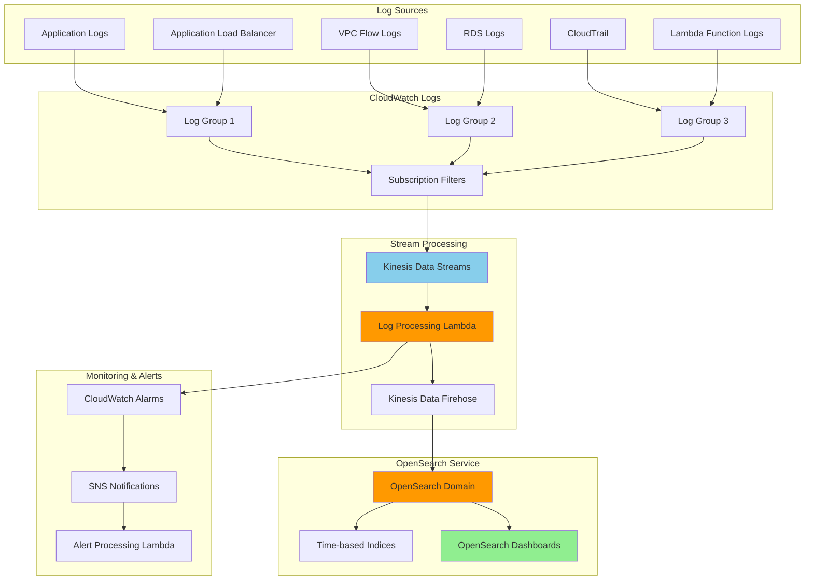

# Centralized Logging with OpenSearch Service

## Problem

Your organization operates multiple applications and AWS services across different environments, generating vast amounts of log data scattered across various systems. Troubleshooting issues requires manual investigation across multiple CloudWatch Log Groups, application logs lack correlation, and security events are difficult to detect without centralized analysis. You need a comprehensive solution to aggregate, search, analyze, and visualize all logs in one place while providing real-time alerting and compliance reporting capabilities.

## Solution

Build a centralized logging architecture using Amazon OpenSearch Service as the core analytics engine, integrated with CloudWatch Logs, Lambda functions for log processing, and Kinesis Data Streams for scalable ingestion. This solution automatically collects logs from multiple sources, transforms and enriches log data, provides powerful search and visualization capabilities through OpenSearch Dashboards, and enables proactive monitoring with custom alerts and automated responses.

## Architecture Diagram



## Prerequisites

1. AWS account with administrator access for initial setup
2. Multiple AWS services generating logs (EC2, Lambda, RDS, etc.)
3. Basic understanding of JSON log formats and Elasticsearch/OpenSearch concepts
4. AWS CLI version 2 installed and configured with appropriate permissions
5. Understanding of log analysis patterns and security monitoring requirements
6. Estimated cost: $50-100/month for small-to-medium log volumes (varies significantly with data volume)

> **Note**: OpenSearch Service pricing includes charges for compute instances, storage, and data transfer. Review [OpenSearch Service pricing](https://aws.amazon.com/opensearch-service/pricing/) to understand costs based on your expected log volume.

## Preparation

```bash
# Set up environment variables for consistent resource naming
export AWS_ACCOUNT_ID=$(aws sts get-caller-identity \
    --query Account --output text)
export AWS_REGION=$(aws configure get region)
export RANDOM_STRING=$(aws secretsmanager get-random-password \
    --exclude-punctuation --exclude-uppercase \
    --password-length 6 --require-each-included-type \
    --output text --query RandomPassword)

export DOMAIN_NAME="central-logging-${RANDOM_STRING}"
export KINESIS_STREAM="log-stream-${RANDOM_STRING}"
export FIREHOSE_STREAM="log-delivery-${RANDOM_STRING}"

echo "✅ Environment variables configured"
echo "Domain Name: $DOMAIN_NAME"
echo "Kinesis Stream: $KINESIS_STREAM"
echo "Firehose Stream: $FIREHOSE_STREAM"
```

## Steps

1. **Create IAM service roles for OpenSearch Service**:

   ```bash
   # Create OpenSearch service role trust policy
   cat > opensearch-trust-policy.json << 'EOF'
   {
     "Version": "2012-10-17",
     "Statement": [
       {
         "Effect": "Allow",
         "Principal": {
           "Service": "opensearch.amazonaws.com"
         },
         "Action": "sts:AssumeRole"
       }
     ]
   }
   EOF
   
   # Create the service role
   aws iam create-role \
       --role-name OpenSearchServiceRole-${RANDOM_STRING} \
       --assume-role-policy-document file://opensearch-trust-policy.json
   
   export OPENSEARCH_ROLE_ARN="arn:aws:iam::${AWS_ACCOUNT_ID}:role/OpenSearchServiceRole-${RANDOM_STRING}"
   
   echo "✅ Created OpenSearch service role: $OPENSEARCH_ROLE_ARN"
   ```

   This IAM role provides the necessary permissions for OpenSearch Service to operate securely within your AWS environment. The trust policy allows the OpenSearch service to assume this role and perform administrative operations on the domain.

2. **Create Kinesis Data Stream for scalable log ingestion**:

   ```bash
   # Create Kinesis stream with multiple shards for scalability
   aws kinesis create-stream \
       --stream-name $KINESIS_STREAM \
       --shard-count 2
   
   # Wait for stream to become active
   echo "Waiting for Kinesis stream to become active..."
   aws kinesis wait stream-exists --stream-name $KINESIS_STREAM
   
   export KINESIS_STREAM_ARN="arn:aws:kinesis:${AWS_REGION}:${AWS_ACCOUNT_ID}:stream/${KINESIS_STREAM}"
   echo "✅ Kinesis stream created: $KINESIS_STREAM_ARN"
   ```

   Kinesis Data Streams acts as the real-time data ingestion layer, providing durability and scalability for high-volume log streams. The two shards provide initial capacity for approximately 2,000 records per second and 2 MB/sec of data ingestion. Each shard can handle up to 1,000 records per second and 1 MB/sec of incoming data, and you can dynamically resize your stream based on actual throughput requirements to optimize costs and performance.

3. **Create and configure Amazon OpenSearch Service domain**:

   ```bash
   # Create OpenSearch domain configuration for production use
   cat > opensearch-domain-config.json << EOF
   {
     "DomainName": "$DOMAIN_NAME",
     "OpenSearchVersion": "OpenSearch_2.9",
     "ClusterConfig": {
       "InstanceType": "t3.small.search",
       "InstanceCount": 3,
       "DedicatedMasterEnabled": true,
       "MasterInstanceType": "t3.small.search",
       "MasterInstanceCount": 3,
       "ZoneAwarenessEnabled": true,
       "ZoneAwarenessConfig": {
         "AvailabilityZoneCount": 3
       }
     },
     "EBSOptions": {
       "EBSEnabled": true,
       "VolumeType": "gp3",
       "VolumeSize": 20
     },
     "EncryptionAtRestOptions": {
       "Enabled": true
     },
     "NodeToNodeEncryptionOptions": {
       "Enabled": true
     },
     "DomainEndpointOptions": {
       "EnforceHTTPS": true,
       "TLSSecurityPolicy": "Policy-Min-TLS-1-2-2019-07"
     },
     "AccessPolicies": "{\"Version\":\"2012-10-17\",\"Statement\":[{\"Effect\":\"Allow\",\"Principal\":{\"AWS\":\"arn:aws:iam::${AWS_ACCOUNT_ID}:root\"},\"Action\":\"es:*\",\"Resource\":\"arn:aws:es:${AWS_REGION}:${AWS_ACCOUNT_ID}:domain/${DOMAIN_NAME}/*\"}]}"
   }
   EOF
   
   # Create OpenSearch domain
   aws opensearch create-domain \
       --cli-input-json file://opensearch-domain-config.json
   
   echo "✅ Creating OpenSearch domain (this takes 15-20 minutes)..."
   ```

   This configuration creates a production-ready OpenSearch cluster with dedicated master nodes for stability, multi-AZ deployment for high availability, and encryption for security. The cluster uses three data nodes and three master nodes to ensure resilience and eliminate single points of failure.

4. **Wait for OpenSearch domain to become available and get endpoints**:

   ```bash
   # Wait for domain to be available
   echo "Waiting for OpenSearch domain to be active..."
   while true; do
       DOMAIN_STATUS=$(aws opensearch describe-domain \
           --domain-name $DOMAIN_NAME \
           --query 'DomainStatus.Processing' \
           --output text)
       
       if [ "$DOMAIN_STATUS" = "False" ]; then
           echo "✅ OpenSearch domain is ready!"
           break
       fi
       
       echo "Domain still processing... waiting 60 seconds"
       sleep 60
   done
   
   # Get domain endpoints
   OPENSEARCH_ENDPOINT=$(aws opensearch describe-domain \
       --domain-name $DOMAIN_NAME \
       --query 'DomainStatus.Endpoints.vpc' \
       --output text)
   
   if [ "$OPENSEARCH_ENDPOINT" = "None" ] || [ -z "$OPENSEARCH_ENDPOINT" ]; then
       OPENSEARCH_ENDPOINT=$(aws opensearch describe-domain \
           --domain-name $DOMAIN_NAME \
           --query 'DomainStatus.Endpoint' \
           --output text)
   fi
   
   export OPENSEARCH_ENDPOINT
   echo "✅ OpenSearch Endpoint: https://$OPENSEARCH_ENDPOINT"
   ```

   This step waits for the OpenSearch domain to complete its initialization process. Domain creation typically takes 15-20 minutes and includes cluster provisioning, security configuration, and index template setup.

5. **Create and deploy log processing Lambda function**:

   ```bash
   # Create log processing Lambda function
   cat > log_processor.py << 'EOF'
   import json
   import base64
   import gzip
   import boto3
   import datetime
   import os
   import re
   from typing import Dict, List, Any
   
   firehose = boto3.client('firehose')
   cloudwatch = boto3.client('cloudwatch')
   
   def lambda_handler(event, context):
       """
       Process CloudWatch Logs data from Kinesis stream
       Enrich logs and forward to Kinesis Data Firehose
       """
       records_to_firehose = []
       error_count = 0
       
       for record in event['Records']:
           try:
               # Decode Kinesis data
               compressed_payload = base64.b64decode(record['kinesis']['data'])
               uncompressed_payload = gzip.decompress(compressed_payload)
               log_data = json.loads(uncompressed_payload)
               
               # Process each log event
               for log_event in log_data.get('logEvents', []):
                   enriched_log = enrich_log_event(log_event, log_data)
                   
                   # Convert to JSON string for Firehose
                   json_record = json.dumps(enriched_log) + '\n'
                   
                   records_to_firehose.append({
                       'Data': json_record
                   })
                   
           except Exception as e:
               print(f"Error processing record: {str(e)}")
               error_count += 1
               continue
       
       # Send processed records to Firehose
       if records_to_firehose:
           try:
               response = firehose.put_record_batch(
                   DeliveryStreamName=os.environ['FIREHOSE_STREAM_NAME'],
                   Records=records_to_firehose
               )
               
               failed_records = response.get('FailedPutCount', 0)
               if failed_records > 0:
                   print(f"Failed to process {failed_records} records")
                   
           except Exception as e:
               print(f"Error sending to Firehose: {str(e)}")
               error_count += len(records_to_firehose)
       
       # Send metrics to CloudWatch
       if error_count > 0:
           cloudwatch.put_metric_data(
               Namespace='CentralLogging/Processing',
               MetricData=[
                   {
                       'MetricName': 'ProcessingErrors',
                       'Value': error_count,
                       'Unit': 'Count',
                       'Timestamp': datetime.datetime.utcnow()
                   }
               ]
           )
       
       return {
           'statusCode': 200,
           'processedRecords': len(records_to_firehose),
           'errorCount': error_count
       }
   
   def enrich_log_event(log_event: Dict, log_data: Dict) -> Dict:
       """
       Enrich log events with additional metadata and parsing
       """
       enriched = {
           '@timestamp': datetime.datetime.fromtimestamp(
               log_event['timestamp'] / 1000
           ).isoformat() + 'Z',
           'message': log_event.get('message', ''),
           'log_group': log_data.get('logGroup', ''),
           'log_stream': log_data.get('logStream', ''),
           'aws_account_id': log_data.get('owner', ''),
           'aws_region': os.environ.get('AWS_REGION', ''),
           'source_type': determine_source_type(log_data.get('logGroup', ''))
       }
       
       # Parse structured logs (JSON)
       try:
           if log_event['message'].strip().startswith('{'):
               parsed_message = json.loads(log_event['message'])
               enriched['parsed_message'] = parsed_message
               
               # Extract common fields
               if 'level' in parsed_message:
                   enriched['log_level'] = parsed_message['level'].upper()
               if 'timestamp' in parsed_message:
                   enriched['original_timestamp'] = parsed_message['timestamp']
                   
       except (json.JSONDecodeError, KeyError):
           pass
       
       # Extract log level from message
       if 'log_level' not in enriched:
           enriched['log_level'] = extract_log_level(log_event['message'])
       
       # Add security context for security-related logs
       if is_security_related(log_event['message'], log_data.get('logGroup', '')):
           enriched['security_event'] = True
           enriched['priority'] = 'high'
       
       return enriched
   
   def determine_source_type(log_group: str) -> str:
       """Determine the type of service generating the logs"""
       if '/aws/lambda/' in log_group:
           return 'lambda'
       elif '/aws/apigateway/' in log_group:
           return 'api-gateway'
       elif '/aws/rds/' in log_group:
           return 'rds'
       elif '/aws/vpc/flowlogs' in log_group:
           return 'vpc-flow-logs'
       elif 'cloudtrail' in log_group.lower():
           return 'cloudtrail'
       else:
           return 'application'
   
   def extract_log_level(message: str) -> str:
       """Extract log level from message content"""
       log_levels = ['ERROR', 'WARN', 'WARNING', 'INFO', 'DEBUG', 'TRACE']
       message_upper = message.upper()
       
       for level in log_levels:
           if level in message_upper:
               return level
       
       return 'INFO'
   
   def is_security_related(message: str, log_group: str) -> bool:
       """Identify potentially security-related log events"""
       security_keywords = [
           'authentication failed', 'access denied', 'unauthorized',
           'security group', 'iam', 'login failed', 'brute force',
           'suspicious', 'blocked', 'firewall', 'intrusion'
       ]
       
       message_lower = message.lower()
       log_group_lower = log_group.lower()
       
       # Check for security keywords
       for keyword in security_keywords:
           if keyword in message_lower:
               return True
       
       # Security-related log groups
       if any(term in log_group_lower for term in ['cloudtrail', 'security', 'auth', 'iam']):
           return True
       
       return False
   EOF
   
   echo "✅ Created log processing function code"
   ```

   This Lambda function serves as the intelligence layer in our logging pipeline. It processes raw CloudWatch Logs data, enriches it with contextual metadata, parses structured JSON logs, extracts log levels, and identifies security-related events for prioritized handling.

6. **Create Lambda execution role and deploy the function**:

   ```bash
   # Create Lambda deployment package
   zip log_processor.zip log_processor.py
   
   # Create Lambda execution role
   cat > lambda-trust-policy.json << 'EOF'
   {
     "Version": "2012-10-17",
     "Statement": [
       {
         "Effect": "Allow",
         "Principal": {
           "Service": "lambda.amazonaws.com"
         },
         "Action": "sts:AssumeRole"
       }
     ]
   }
   EOF
   
   aws iam create-role \
       --role-name LogProcessorLambdaRole-${RANDOM_STRING} \
       --assume-role-policy-document file://lambda-trust-policy.json
   
   # Create and attach Lambda execution policy
   cat > lambda-execution-policy.json << EOF
   {
     "Version": "2012-10-17",
     "Statement": [
       {
         "Effect": "Allow",
         "Action": [
           "logs:CreateLogGroup",
           "logs:CreateLogStream",
           "logs:PutLogEvents"
         ],
         "Resource": "arn:aws:logs:*:*:*"
       },
       {
         "Effect": "Allow",
         "Action": [
           "kinesis:DescribeStream",
           "kinesis:GetShardIterator",
           "kinesis:GetRecords",
           "kinesis:ListStreams"
         ],
         "Resource": "$KINESIS_STREAM_ARN"
       },
       {
         "Effect": "Allow",
         "Action": [
           "firehose:PutRecord",
           "firehose:PutRecordBatch"
         ],
         "Resource": "arn:aws:firehose:${AWS_REGION}:${AWS_ACCOUNT_ID}:deliverystream/*"
       },
       {
         "Effect": "Allow",
         "Action": [
           "cloudwatch:PutMetricData"
         ],
         "Resource": "*"
       }
     ]
   }
   EOF
   
   aws iam put-role-policy \
       --role-name LogProcessorLambdaRole-${RANDOM_STRING} \
       --policy-name LogProcessorExecutionPolicy \
       --policy-document file://lambda-execution-policy.json
   
   export LAMBDA_ROLE_ARN="arn:aws:iam::${AWS_ACCOUNT_ID}:role/LogProcessorLambdaRole-${RANDOM_STRING}"
   
   # Wait for role to be ready
   sleep 10
   
   echo "✅ Created Lambda execution role with necessary permissions"
   ```

   The IAM role follows the principle of least privilege, granting only the specific permissions needed for the Lambda function to read from Kinesis, write to Firehose, publish CloudWatch metrics, and create its own logs.

   > **Tip**: Use specific filter patterns instead of empty strings to reduce costs and processing overhead. For example, use `[timestamp, request_id, ERROR]` to only forward error-level logs, or `{ $.eventName = ConsoleLogin }` for CloudTrail login events. Learn more about [CloudWatch Logs filter patterns](https://docs.aws.amazon.com/AmazonCloudWatch/latest/logs/FilterAndPatternSyntax.html).

7. **Create Kinesis Data Firehose delivery stream to OpenSearch**:

   ```bash
   # Create Firehose service role
   cat > firehose-trust-policy.json << 'EOF'
   {
     "Version": "2012-10-17",
     "Statement": [
       {
         "Effect": "Allow",
         "Principal": {
           "Service": "firehose.amazonaws.com"
         },
         "Action": "sts:AssumeRole"
       }
     ]
   }
   EOF
   
   aws iam create-role \
       --role-name FirehoseDeliveryRole-${RANDOM_STRING} \
       --assume-role-policy-document file://firehose-trust-policy.json
   
   # Create Firehose service policy
   cat > firehose-service-policy.json << EOF
   {
     "Version": "2012-10-17",
     "Statement": [
       {
         "Effect": "Allow",
         "Action": [
           "es:ESHttpPost",
           "es:ESHttpPut"
         ],
         "Resource": "arn:aws:es:${AWS_REGION}:${AWS_ACCOUNT_ID}:domain/${DOMAIN_NAME}/*"
       },
       {
         "Effect": "Allow",
         "Action": [
           "s3:AbortMultipartUpload",
           "s3:GetBucketLocation",
           "s3:GetObject",
           "s3:ListBucket",
           "s3:ListBucketMultipartUploads",
           "s3:PutObject"
         ],
         "Resource": [
           "arn:aws:s3:::central-logging-backup-${RANDOM_STRING}",
           "arn:aws:s3:::central-logging-backup-${RANDOM_STRING}/*"
         ]
       },
       {
         "Effect": "Allow",
         "Action": [
           "logs:PutLogEvents"
         ],
         "Resource": "arn:aws:logs:${AWS_REGION}:${AWS_ACCOUNT_ID}:log-group:/aws/kinesisfirehose/*"
       }
     ]
   }
   EOF
   
   aws iam put-role-policy \
       --role-name FirehoseDeliveryRole-${RANDOM_STRING} \
       --policy-name FirehoseDeliveryPolicy \
       --policy-document file://firehose-service-policy.json
   
   export FIREHOSE_ROLE_ARN="arn:aws:iam::${AWS_ACCOUNT_ID}:role/FirehoseDeliveryRole-${RANDOM_STRING}"
   
   # Wait for role to be ready
   sleep 10
   
   echo "✅ Created Firehose delivery role"
   ```

   Kinesis Data Firehose acts as the reliable delivery mechanism between our processing layer and OpenSearch. It handles buffering, compression, automatic retries, and provides backup storage for failed deliveries.

8. **Create backup S3 bucket and deploy Firehose stream**:

   ```bash
   # Create S3 bucket for failed delivery backups
   BACKUP_BUCKET="central-logging-backup-${RANDOM_STRING}"
   aws s3api create-bucket \
       --bucket $BACKUP_BUCKET \
       --region $AWS_REGION \
       --create-bucket-configuration LocationConstraint=$AWS_REGION
   
   export BACKUP_BUCKET
   
   # Create Firehose delivery stream configuration
   cat > firehose-config.json << EOF
   {
     "DeliveryStreamName": "$FIREHOSE_STREAM",
     "DeliveryStreamType": "DirectPut",
     "OpenSearchDestinationConfiguration": {
       "RoleARN": "$FIREHOSE_ROLE_ARN",
       "DomainARN": "arn:aws:es:${AWS_REGION}:${AWS_ACCOUNT_ID}:domain/${DOMAIN_NAME}",
       "IndexName": "logs-%Y-%m-%d",
       "IndexRotationPeriod": "OneDay",
       "TypeName": "_doc",
       "RetryDuration": 300,
       "S3BackupMode": "FailedDocumentsOnly",
       "S3Configuration": {
         "RoleARN": "$FIREHOSE_ROLE_ARN",
         "BucketARN": "arn:aws:s3:::$BACKUP_BUCKET",
         "Prefix": "failed-logs/",
         "ErrorOutputPrefix": "errors/",
         "BufferingHints": {
           "SizeInMBs": 5,
           "IntervalInSeconds": 300
         },
         "CompressionFormat": "GZIP"
       },
       "ProcessingConfiguration": {
         "Enabled": false
       },
       "CloudWatchLoggingOptions": {
         "Enabled": true,
         "LogGroupName": "/aws/kinesisfirehose/$FIREHOSE_STREAM"
       }
     }
   }
   EOF
   
   # Create the Firehose delivery stream
   aws firehose create-delivery-stream \
       --cli-input-json file://firehose-config.json
   
   echo "✅ Kinesis Data Firehose delivery stream created: $FIREHOSE_STREAM"
   ```

   The Firehose stream is configured with daily index rotation, which optimizes query performance and enables efficient data lifecycle management. Failed documents are automatically backed up to S3 for later analysis and recovery.

9. **Deploy Lambda function and configure event source mapping**:

   ```bash
   # Create Lambda function
   aws lambda create-function \
       --function-name LogProcessor-${RANDOM_STRING} \
       --runtime python3.9 \
       --role $LAMBDA_ROLE_ARN \
       --handler log_processor.lambda_handler \
       --zip-file fileb://log_processor.zip \
       --timeout 300 \
       --memory-size 512 \
       --environment Variables="{FIREHOSE_STREAM_NAME=${FIREHOSE_STREAM}}"
   
   export LAMBDA_FUNCTION_ARN="arn:aws:lambda:${AWS_REGION}:${AWS_ACCOUNT_ID}:function:LogProcessor-${RANDOM_STRING}"
   
   # Create event source mapping from Kinesis to Lambda
   aws lambda create-event-source-mapping \
       --function-name LogProcessor-${RANDOM_STRING} \
       --event-source-arn $KINESIS_STREAM_ARN \
       --starting-position LATEST \
       --batch-size 100 \
       --maximum-batching-window-in-seconds 10
   
   echo "✅ Lambda function deployed and connected to Kinesis stream"
   ```

   The event source mapping configures Lambda to automatically process records from the Kinesis stream in batches, optimizing throughput while maintaining low latency for log processing.

   > **Warning**: Initial log ingestion may take 5-10 minutes to appear in OpenSearch due to buffering in Kinesis Data Firehose. Be patient during initial testing and allow sufficient time for the full pipeline to process data. For troubleshooting, check the [Firehose monitoring guide](https://docs.aws.amazon.com/kinesis/latest/dev/monitoring-with-cloudwatch.html).

10. **Configure CloudWatch Logs subscription filters for automatic log forwarding**:

    ```bash
    # Create CloudWatch Logs service role
    cat > cwlogs-trust-policy.json << 'EOF'
    {
      "Version": "2012-10-17",
      "Statement": [
        {
          "Effect": "Allow",
          "Principal": {
            "Service": "logs.amazonaws.com"
          },
          "Action": "sts:AssumeRole",
          "Condition": {
            "StringLike": {
              "aws:SourceArn": "arn:aws:logs:*:*:*"
            }
          }
        }
      ]
    }
    EOF
    
    aws iam create-role \
        --role-name CWLogsToKinesisRole-${RANDOM_STRING} \
        --assume-role-policy-document file://cwlogs-trust-policy.json
    
    # Create policy for CloudWatch Logs to write to Kinesis
    cat > cwlogs-kinesis-policy.json << EOF
    {
      "Version": "2012-10-17",
      "Statement": [
        {
          "Effect": "Allow",
          "Action": [
            "kinesis:PutRecord",
            "kinesis:PutRecords"
          ],
          "Resource": "$KINESIS_STREAM_ARN"
        }
      ]
    }
    EOF
    
    aws iam put-role-policy \
        --role-name CWLogsToKinesisRole-${RANDOM_STRING} \
        --policy-name CWLogsToKinesisPolicy \
        --policy-document file://cwlogs-kinesis-policy.json
    
    export CWLOGS_ROLE_ARN="arn:aws:iam::${AWS_ACCOUNT_ID}:role/CWLogsToKinesisRole-${RANDOM_STRING}"
    
    # Wait for role to be ready
    sleep 10
    
    # Create subscription filters for existing log groups
    LOG_GROUPS=$(aws logs describe-log-groups \
        --query 'logGroups[].logGroupName' \
        --output text)
    
    echo "Creating subscription filters for existing log groups..."
    for LOG_GROUP in $LOG_GROUPS; do
        # Skip already processed log groups or system groups
        if [[ $LOG_GROUP == *"firehose"* ]] || [[ $LOG_GROUP == *"LogProcessor"* ]]; then
            continue
        fi
        
        echo "Creating filter for: $LOG_GROUP"
        aws logs put-subscription-filter \
            --log-group-name "$LOG_GROUP" \
            --filter-name "CentralLoggingFilter-${RANDOM_STRING}" \
            --filter-pattern "" \
            --destination-arn $KINESIS_STREAM_ARN \
            --role-arn $CWLOGS_ROLE_ARN \
            --distribution "Random" 2>/dev/null || echo "  Failed to create filter for $LOG_GROUP"
    done
    
    echo "✅ Subscription filters configured for existing log groups"
    ```

    Subscription filters automatically forward log data from CloudWatch Logs to our Kinesis stream. This creates the automatic ingestion layer that captures logs from all AWS services and applications without requiring manual configuration for each log source.

## Validation & Testing

1. **Generate test logs to validate the pipeline**:

   ```bash
   # Create test application logs
   TEST_LOG_GROUP="/aws/test/centralized-logging"
   
   # Create log group
   aws logs create-log-group --log-group-name $TEST_LOG_GROUP
   
   # Create subscription filter for test log group
   aws logs put-subscription-filter \
       --log-group-name $TEST_LOG_GROUP \
       --filter-name "TestFilter-${RANDOM_STRING}" \
       --filter-pattern "" \
       --destination-arn $KINESIS_STREAM_ARN \
       --role-arn $CWLOGS_ROLE_ARN
   
   # Generate test log entries
   for i in {1..10}; do
       LOG_MESSAGE='{"timestamp":"'$(date -u +%Y-%m-%dT%H:%M:%S.%3NZ)'","level":"INFO","service":"test-app","message":"Test log entry '$i'","user_id":"user-123","request_id":"req-'$i'"}'
       
       aws logs put-log-events \
           --log-group-name $TEST_LOG_GROUP \
           --log-stream-name "test-stream-$(date +%Y-%m-%d)" \
           --log-events timestamp=$(date +%s)000,message="$LOG_MESSAGE"
       
       sleep 1
   done
   
   echo "✅ Test logs generated"
   ```

2. **Verify data flow through the pipeline**:

   ```bash
   # Check Kinesis stream metrics
   echo "Checking Kinesis stream metrics..."
   aws cloudwatch get-metric-statistics \
       --namespace AWS/Kinesis \
       --metric-name IncomingRecords \
       --dimensions Name=StreamName,Value=$KINESIS_STREAM \
       --start-time $(date -u -d '10 minutes ago' +%Y-%m-%dT%H:%M:%S) \
       --end-time $(date -u +%Y-%m-%dT%H:%M:%S) \
       --period 300 \
       --statistics Sum
   
   # Check Lambda function metrics
   echo "Checking Lambda function metrics..."
   aws cloudwatch get-metric-statistics \
       --namespace AWS/Lambda \
       --metric-name Invocations \
       --dimensions Name=FunctionName,Value=LogProcessor-${RANDOM_STRING} \
       --start-time $(date -u -d '10 minutes ago' +%Y-%m-%dT%H:%M:%S) \
       --end-time $(date -u +%Y-%m-%dT%H:%M:%S) \
       --period 300 \
       --statistics Sum
   ```

3. **Query OpenSearch to verify log ingestion**:

   ```bash
   # Wait for logs to be processed and indexed
   echo "Waiting for logs to be processed (60 seconds)..."
   sleep 60
   
   # Search for recent logs using AWS CLI credentials
   curl -X GET "https://$OPENSEARCH_ENDPOINT/logs-$(date -u +%Y.%m.%d)/_search" \
       -H "Content-Type: application/json" \
       -d '{
           "query": {
               "bool": {
                   "must": [
                       {
                           "range": {
                               "@timestamp": {
                                   "gte": "now-1h"
                               }
                           }
                       }
                   ]
               }
           },
           "size": 10,
           "sort": [{"@timestamp": {"order": "desc"}}]
       }' \
       --aws-sigv4 "aws:amz:${AWS_REGION}:es" \
       --user "$AWS_ACCESS_KEY_ID:$AWS_SECRET_ACCESS_KEY"
   ```

## Cleanup

1. **Remove subscription filters from log groups**:

   ```bash
   # List and remove subscription filters
   LOG_GROUPS=$(aws logs describe-log-groups \
       --query 'logGroups[].logGroupName' \
       --output text)
   
   for LOG_GROUP in $LOG_GROUPS; do
       aws logs delete-subscription-filter \
           --log-group-name "$LOG_GROUP" \
           --filter-name "CentralLoggingFilter-${RANDOM_STRING}" 2>/dev/null || true
       aws logs delete-subscription-filter \
           --log-group-name "$LOG_GROUP" \
           --filter-name "TestFilter-${RANDOM_STRING}" 2>/dev/null || true
   done
   
   # Delete test log group
   aws logs delete-log-group --log-group-name $TEST_LOG_GROUP
   
   echo "✅ Removed subscription filters"
   ```

2. **Delete Lambda function and event source mapping**:

   ```bash
   # List and delete event source mappings
   EVENT_SOURCE_MAPPINGS=$(aws lambda list-event-source-mappings \
       --function-name LogProcessor-${RANDOM_STRING} \
       --query 'EventSourceMappings[].UUID' \
       --output text)
   
   for UUID in $EVENT_SOURCE_MAPPINGS; do
       aws lambda delete-event-source-mapping --uuid $UUID
   done
   
   # Delete Lambda function
   aws lambda delete-function \
       --function-name LogProcessor-${RANDOM_STRING}
   
   echo "✅ Deleted Lambda function and mappings"
   ```

3. **Delete streaming infrastructure**:

   ```bash
   # Delete Kinesis Data Firehose delivery stream
   aws firehose delete-delivery-stream \
       --delivery-stream-name $FIREHOSE_STREAM
   
   # Delete Kinesis Data Stream
   aws kinesis delete-stream --stream-name $KINESIS_STREAM
   
   echo "✅ Deleted streaming infrastructure"
   ```

4. **Delete OpenSearch Service domain**:

   ```bash
   aws opensearch delete-domain --domain-name $DOMAIN_NAME
   
   echo "✅ Deleted OpenSearch domain"
   ```

5. **Delete S3 backup bucket and IAM roles**:

   ```bash
   # Delete S3 backup bucket
   aws s3 rm s3://$BACKUP_BUCKET --recursive
   aws s3api delete-bucket --bucket $BACKUP_BUCKET
   
   # Delete IAM roles and policies
   aws iam delete-role-policy \
       --role-name LogProcessorLambdaRole-${RANDOM_STRING} \
       --policy-name LogProcessorExecutionPolicy
   aws iam delete-role --role-name LogProcessorLambdaRole-${RANDOM_STRING}
   
   aws iam delete-role-policy \
       --role-name FirehoseDeliveryRole-${RANDOM_STRING} \
       --policy-name FirehoseDeliveryPolicy
   aws iam delete-role --role-name FirehoseDeliveryRole-${RANDOM_STRING}
   
   aws iam delete-role-policy \
       --role-name CWLogsToKinesisRole-${RANDOM_STRING} \
       --policy-name CWLogsToKinesisPolicy
   aws iam delete-role --role-name CWLogsToKinesisRole-${RANDOM_STRING}
   
   aws iam delete-role --role-name OpenSearchServiceRole-${RANDOM_STRING}
   
   # Clean up local files
   rm -f *.json *.py *.zip
   
   echo "✅ Cleanup completed"
   ```

## Discussion

This centralized logging solution demonstrates the power of combining multiple AWS services to create a comprehensive observability platform. Amazon OpenSearch Service serves as the analytical engine, providing full-text search capabilities, advanced aggregations, and rich visualization tools through OpenSearch Dashboards. The integration with CloudWatch Logs via subscription filters enables automatic ingestion of log data from any AWS service, while Kinesis Data Streams provides the scalable, real-time streaming infrastructure necessary for high-volume log processing.

The Lambda-based log processing component adds intelligent enrichment capabilities that transform raw log data into structured, searchable information. By parsing JSON logs, extracting log levels, identifying security events, and adding contextual metadata, the system makes logs more valuable for troubleshooting, security analysis, and compliance reporting. This approach eliminates the need for complex Logstash configurations while providing similar functionality within the AWS ecosystem.

Kinesis Data Firehose acts as the reliable delivery mechanism, handling buffering, compression, and automatic retry logic for failed deliveries. Its integration with S3 for backup storage ensures no log data is lost, even during OpenSearch maintenance windows or capacity issues. The time-based index rotation strategy (daily indices) optimizes query performance and enables efficient data lifecycle management, allowing you to archive or delete older logs based on retention policies.

For production deployments, consider implementing additional enhancements such as multiple Availability Zone deployments for OpenSearch, cross-region log replication for disaster recovery, integration with AWS Organizations for multi-account log aggregation, and custom authentication mechanisms for OpenSearch Dashboards access control. The [Amazon OpenSearch Service Developer Guide](https://docs.aws.amazon.com/opensearch-service/latest/developerguide/what-is.html) and [CloudWatch Logs Subscription Filters documentation](https://docs.aws.amazon.com/AmazonCloudWatch/latest/logs/SubscriptionFilters.html) provide comprehensive guidance for advanced configurations.

## Challenge

Extend this centralized logging solution by implementing these enhancements:

1. **Advanced Analytics and ML**: Implement anomaly detection using OpenSearch's machine learning features to automatically identify unusual patterns in your log data and generate proactive alerts.

2. **Intelligent Log Parsing**: Create automated log parsing and field extraction using Grok patterns or custom Lambda functions that can intelligently structure unstructured log data based on common application frameworks.

3. **Security Integration**: Integrate with AWS Security Hub for automated security event correlation, threat detection, and incident response workflows based on log analysis patterns.

4. **Cost Optimization**: Implement intelligent data tiering using OpenSearch Service UltraWarm and Cold storage to automatically move older, less frequently accessed logs to more cost-effective storage tiers.

5. **Multi-Tenant Architecture**: Build comprehensive multi-tenant log segregation for organizations with multiple development teams or business units, including role-based access controls and tenant-specific dashboards.

## Infrastructure Code

*Infrastructure code will be generated after recipe approval.*