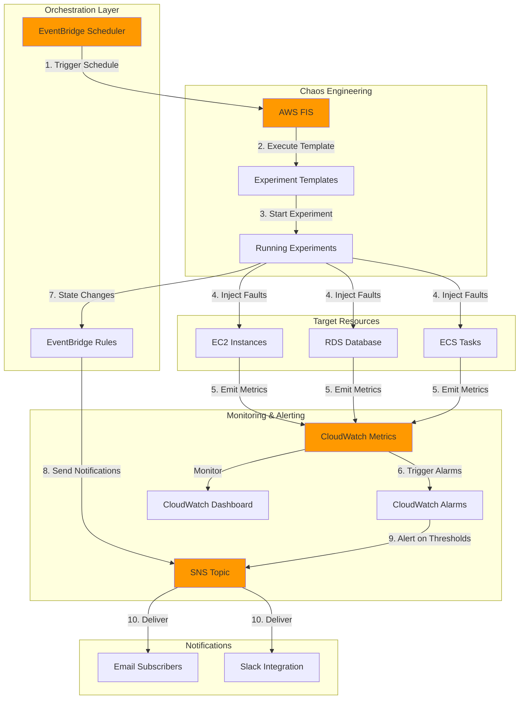

# Automated Chaos Engineering with Fault Injection Service

## Problem

Modern distributed systems are increasingly complex, making it difficult to predict how they will behave under failure conditions. Teams struggle to identify weaknesses and single points of failure before they impact production workloads. Traditional testing approaches fail to simulate real-world failures, leaving organizations vulnerable to cascading failures, extended downtime, and poor customer experiences when infrastructure components fail unexpectedly.

## Solution

AWS Fault Injection Service (FIS) enables controlled chaos engineering experiments to systematically inject failures into AWS workloads, while EventBridge orchestrates automated testing schedules and captures experiment results. This integration creates a proactive resilience testing framework that identifies system weaknesses, validates recovery mechanisms, and builds confidence in application behavior under stress conditions through automated, repeatable experiments with comprehensive monitoring and alerting.

## Architecture Diagram



## Prerequisites

1. AWS account with appropriate permissions to create IAM roles, FIS experiments, EventBridge rules, CloudWatch alarms, and SNS topics
2. AWS CLI v2 installed and configured (or use AWS CloudShell)
3. Understanding of chaos engineering principles and fault injection concepts
4. Target resources already deployed (EC2 instances, RDS databases, or ECS tasks) for testing
5. Estimated cost: $0.50-$2.00 per hour during active experiments (FIS charges per action minute)

> **Note**: AWS FIS performs real actions on real resources. Always test experiments in non-production environments first before running in production.

## Preparation

```bash
# Set environment variables
export AWS_REGION=$(aws configure get region)
export AWS_ACCOUNT_ID=$(aws sts get-caller-identity \
    --query Account --output text)

# Generate unique identifiers for resources
RANDOM_SUFFIX=$(aws secretsmanager get-random-password \
    --exclude-punctuation --exclude-uppercase \
    --password-length 6 --require-each-included-type \
    --output text --query RandomPassword)

export EXPERIMENT_NAME="chaos-experiment-${RANDOM_SUFFIX}"
export SNS_TOPIC_NAME="fis-alerts-${RANDOM_SUFFIX}"
export DASHBOARD_NAME="chaos-monitoring-${RANDOM_SUFFIX}"

# Create SNS topic for notifications
export SNS_TOPIC_ARN=$(aws sns create-topic \
    --name ${SNS_TOPIC_NAME} \
    --query TopicArn --output text)

echo "✅ SNS topic created: ${SNS_TOPIC_ARN}"

# Subscribe email to SNS topic (replace with your email)
aws sns subscribe \
    --topic-arn ${SNS_TOPIC_ARN} \
    --protocol email \
    --notification-endpoint your-email@example.com

echo "✅ Check your email to confirm SNS subscription"
```

## Steps

1. **Create IAM Role for AWS FIS Experiments**:

   AWS FIS requires an IAM role with specific permissions to execute actions on target resources during experiments. This role establishes the security boundary for chaos engineering activities, ensuring experiments can only affect intended resources while maintaining audit trails through CloudTrail. The trust policy allows FIS to assume this role, while the permissions policy grants necessary actions on EC2, RDS, and ECS resources.

   ```bash
   # Create trust policy for FIS service
   cat > fis-trust-policy.json << EOF
   {
       "Version": "2012-10-17",
       "Statement": [
           {
               "Effect": "Allow",
               "Principal": {
                   "Service": "fis.amazonaws.com"
               },
               "Action": "sts:AssumeRole"
           }
       ]
   }
   EOF

   # Create the IAM role
   export FIS_ROLE_ARN=$(aws iam create-role \
       --role-name FISExperimentRole-${RANDOM_SUFFIX} \
       --assume-role-policy-document file://fis-trust-policy.json \
       --query Role.Arn --output text)

   # Attach AWS managed policy for FIS
   aws iam attach-role-policy \
       --role-name FISExperimentRole-${RANDOM_SUFFIX} \
       --policy-arn arn:aws:iam::aws:policy/PowerUserAccess

   echo "✅ FIS IAM role created: ${FIS_ROLE_ARN}"
   ```

   The IAM role now has the necessary permissions to execute FIS experiments. The PowerUserAccess policy provides broad permissions for testing; in production, you should create a custom policy with least-privilege permissions specific to your experiment actions and target resources.

2. **Create CloudWatch Alarms for Stop Conditions**:

   CloudWatch alarms serve as safety mechanisms that automatically halt experiments when metrics exceed defined thresholds. These stop conditions prevent experiments from causing excessive damage or prolonged outages. By monitoring critical application metrics like error rates, latency, and availability, you can ensure experiments stop before crossing acceptable risk boundaries, maintaining the controlled nature of chaos engineering.

   ```bash
   # Create alarm for high error rate (stop condition)
   export ERROR_ALARM_ARN=$(aws cloudwatch put-metric-alarm \
       --alarm-name "FIS-HighErrorRate-${RANDOM_SUFFIX}" \
       --alarm-description "Stop FIS experiment on high errors" \
       --metric-name 4XXError \
       --namespace AWS/ApplicationELB \
       --statistic Sum \
       --period 60 \
       --evaluation-periods 2 \
       --threshold 50 \
       --comparison-operator GreaterThanThreshold \
       --treat-missing-data notBreaching \
       --query AlarmArn --output text)

   # Create alarm for high CPU utilization
   export CPU_ALARM_ARN=$(aws cloudwatch put-metric-alarm \
       --alarm-name "FIS-HighCPU-${RANDOM_SUFFIX}" \
       --alarm-description "Monitor CPU during experiments" \
       --metric-name CPUUtilization \
       --namespace AWS/EC2 \
       --statistic Average \
       --period 300 \
       --evaluation-periods 1 \
       --threshold 90 \
       --comparison-operator GreaterThanThreshold \
       --query AlarmArn --output text)

   echo "✅ CloudWatch alarms created for stop conditions"
   ```

   These alarms now actively monitor your infrastructure metrics. When triggered during an experiment, FIS will automatically stop all actions and roll back where possible, ensuring your chaos engineering practices remain safe and controlled.

3. **Create FIS Experiment Template**:

   The experiment template defines the blueprint for your chaos engineering tests, specifying which actions to perform, which resources to target, and under what conditions to stop. This template approach enables repeatability and version control of experiments. By defining actions like CPU stress, network latency, or instance termination, you create a library of failure scenarios that can be executed on-demand or on schedule to continuously validate system resilience.

   ```bash
   # Create experiment template configuration
   cat > experiment-template.json << EOF
   {
       "description": "Multi-action chaos experiment for resilience testing",
       "stopConditions": [
           {
               "source": "aws:cloudwatch:alarm",
               "value": "${ERROR_ALARM_ARN}"
           }
       ],
       "targets": {
           "ec2-instances": {
               "resourceType": "aws:ec2:instance",
               "selectionMode": "COUNT(1)",
               "resourceTags": {
                   "ChaosReady": "true"
               }
           }
       },
       "actions": {
           "cpu-stress": {
               "actionId": "aws:ssm:send-command",
               "description": "Inject CPU stress on EC2 instances",
               "parameters": {
                   "documentArn": "arn:aws:ssm:${AWS_REGION}::document/AWSFIS-Run-CPU-Stress",
                   "documentParameters": "{\"DurationSeconds\": \"120\", \"CPU\": \"0\", \"LoadPercent\": \"80\"}",
                   "duration": "PT3M"
               },
               "targets": {
                   "Instances": "ec2-instances"
               }
           },
           "terminate-instance": {
               "actionId": "aws:ec2:terminate-instances",
               "description": "Terminate EC2 instance to test recovery",
               "targets": {
                   "Instances": "ec2-instances"
               },
               "startAfter": ["cpu-stress"]
           }
       },
       "roleArn": "${FIS_ROLE_ARN}",
       "tags": {
           "Environment": "Testing",
           "Purpose": "ChaosEngineering"
       }
   }
   EOF

   # Create the experiment template
   export TEMPLATE_ID=$(aws fis create-experiment-template \
       --cli-input-json file://experiment-template.json \
       --query experimentTemplate.id --output text)

   echo "✅ FIS experiment template created: ${TEMPLATE_ID}"
   ```

   The experiment template is now ready for execution. This multi-action template first stresses CPU on target instances, then terminates them to test auto-recovery mechanisms. The sequential nature ensures you can observe system behavior under load before simulating complete failure.

4. **Configure EventBridge Rules for Experiment Notifications**:

   EventBridge rules capture FIS experiment state changes and route them to appropriate notification channels. This real-time event stream provides visibility into experiment lifecycle, enabling teams to respond quickly to unexpected outcomes. By integrating with SNS, these events can trigger emails, Slack messages, or automated response workflows, creating a comprehensive observability layer for chaos engineering activities.

   ```bash
   # Create EventBridge rule for FIS state changes
   aws events put-rule \
       --name "FIS-ExperimentStateChanges-${RANDOM_SUFFIX}" \
       --description "Capture all FIS experiment state changes" \
       --event-pattern '{
           "source": ["aws.fis"],
           "detail-type": ["FIS Experiment State Change"]
       }' \
       --state ENABLED

   # Create IAM role for EventBridge
   cat > eventbridge-trust-policy.json << EOF
   {
       "Version": "2012-10-17",
       "Statement": [
           {
               "Effect": "Allow",
               "Principal": {
                   "Service": "events.amazonaws.com"
               },
               "Action": "sts:AssumeRole"
           }
       ]
   }
   EOF

   export EB_ROLE_ARN=$(aws iam create-role \
       --role-name EventBridgeFISRole-${RANDOM_SUFFIX} \
       --assume-role-policy-document file://eventbridge-trust-policy.json \
       --query Role.Arn --output text)

   # Attach SNS publish policy
   aws iam put-role-policy \
       --role-name EventBridgeFISRole-${RANDOM_SUFFIX} \
       --policy-name SNSPublishPolicy \
       --policy-document '{
           "Version": "2012-10-17",
           "Statement": [
               {
                   "Effect": "Allow",
                   "Action": "sns:Publish",
                   "Resource": "'${SNS_TOPIC_ARN}'"
               }
           ]
       }'

   # Add SNS target to EventBridge rule
   aws events put-targets \
       --rule "FIS-ExperimentStateChanges-${RANDOM_SUFFIX}" \
       --targets "Id"="1","Arn"="${SNS_TOPIC_ARN}","RoleArn"="${EB_ROLE_ARN}"

   echo "✅ EventBridge rule configured for FIS notifications"
   ```

   EventBridge now monitors all FIS experiment state transitions, automatically sending notifications through SNS. This creates an audit trail of all chaos engineering activities and ensures stakeholders remain informed about experiment progress and outcomes.

5. **Create Scheduled EventBridge Rule for Automated Testing**:

   Scheduled chaos experiments enable continuous validation of system resilience without manual intervention. By running experiments during off-peak hours or maintenance windows, teams can proactively identify degradation in fault tolerance capabilities. This automation transforms chaos engineering from an occasional practice to an integral part of the reliability engineering workflow, ensuring systems maintain their resilience properties over time.

   ```bash
   # Create IAM role for EventBridge Scheduler
   cat > scheduler-trust-policy.json << EOF
   {
       "Version": "2012-10-17",
       "Statement": [
           {
               "Effect": "Allow",
               "Principal": {
                   "Service": "scheduler.amazonaws.com"
               },
               "Action": "sts:AssumeRole"
           }
       ]
   }
   EOF

   export SCHEDULER_ROLE_ARN=$(aws iam create-role \
       --role-name SchedulerFISRole-${RANDOM_SUFFIX} \
       --assume-role-policy-document file://scheduler-trust-policy.json \
       --query Role.Arn --output text)

   # Attach FIS start experiment policy
   aws iam put-role-policy \
       --role-name SchedulerFISRole-${RANDOM_SUFFIX} \
       --policy-name FISStartExperimentPolicy \
       --policy-document '{
           "Version": "2012-10-17",
           "Statement": [
               {
                   "Effect": "Allow",
                   "Action": "fis:StartExperiment",
                   "Resource": [
                       "arn:aws:fis:*:*:experiment-template/'${TEMPLATE_ID}'",
                       "arn:aws:fis:*:*:experiment/*"
                   ]
               }
           ]
       }'

   # Create EventBridge schedule (runs daily at 2 AM)
   aws scheduler create-schedule \
       --name "FIS-DailyChaosTest-${RANDOM_SUFFIX}" \
       --schedule-expression "cron(0 2 * * ? *)" \
       --target '{
           "Arn": "arn:aws:scheduler:::aws-sdk:fis:startExperiment",
           "RoleArn": "'${SCHEDULER_ROLE_ARN}'",
           "Input": "{\"experimentTemplateId\": \"'${TEMPLATE_ID}'\"}"
       }' \
       --flexible-time-window '{"Mode": "OFF"}'

   echo "✅ Scheduled EventBridge rule created for daily chaos tests"
   ```

   The automated schedule ensures chaos experiments run consistently, building confidence in system resilience through regular testing. This approach helps teams discover issues introduced by code changes, infrastructure updates, or configuration drift before they impact production availability.

6. **Create CloudWatch Dashboard for Experiment Monitoring**:

   A centralized dashboard provides real-time visibility into chaos experiment impact on system health. By correlating experiment timelines with application metrics, teams can understand how injected failures affect user experience and system performance. This observability is crucial for validating that recovery mechanisms work as designed and for identifying unexpected cascading failures that require architectural improvements.

   ```bash
   # Create CloudWatch dashboard configuration
   cat > dashboard-config.json << EOF
   {
       "widgets": [
           {
               "type": "metric",
               "properties": {
                   "metrics": [
                       ["AWS/FIS", "ExperimentsStarted", {"stat": "Sum"}],
                       [".", "ExperimentsStopped", {"stat": "Sum"}],
                       [".", "ExperimentsFailed", {"stat": "Sum"}]
                   ],
                   "period": 300,
                   "stat": "Average",
                   "region": "${AWS_REGION}",
                   "title": "FIS Experiment Status"
               }
           },
           {
               "type": "metric",
               "properties": {
                   "metrics": [
                       ["AWS/EC2", "CPUUtilization", {"stat": "Average"}],
                       ["AWS/ApplicationELB", "TargetResponseTime", {"stat": "Average"}],
                       [".", "HTTPCode_Target_4XX_Count", {"stat": "Sum"}]
                   ],
                   "period": 60,
                   "stat": "Average",
                   "region": "${AWS_REGION}",
                   "title": "Application Health During Experiments"
               }
           }
       ]
   }
   EOF

   # Create the dashboard
   aws cloudwatch put-dashboard \
       --dashboard-name ${DASHBOARD_NAME} \
       --dashboard-body file://dashboard-config.json

   echo "✅ CloudWatch dashboard created: ${DASHBOARD_NAME}"
   ```

   The monitoring dashboard now provides a comprehensive view of chaos engineering impact. Teams can observe correlations between experiment actions and system behavior, validating that monitoring and alerting systems properly detect and report failures during controlled chaos scenarios.

7. **Run a Manual Test Experiment**:

   Before enabling automated schedules, manually executing experiments allows teams to observe system behavior and validate safety mechanisms. This controlled approach ensures stop conditions work correctly and helps establish baseline expectations for system recovery time. Manual runs also provide opportunities to refine experiment parameters and adjust fault injection intensity based on observed impact.

   ```bash
   # Start a test experiment
   export EXPERIMENT_ID=$(aws fis start-experiment \
       --experiment-template-id ${TEMPLATE_ID} \
       --query experiment.id --output text)

   echo "✅ Experiment started: ${EXPERIMENT_ID}"

   # Monitor experiment status
   watch -n 5 "aws fis get-experiment \
       --id ${EXPERIMENT_ID} \
       --query 'experiment.state.status' --output text"

   # Get detailed experiment results (after completion)
   aws fis get-experiment \
       --id ${EXPERIMENT_ID} \
       --output json
   ```

   The manual experiment execution provides immediate feedback on system resilience. Observe how quickly affected services recover, whether alarms trigger appropriately, and if dependent systems handle the failure gracefully. This validation builds confidence before automating regular chaos testing.

## Validation & Testing

1. Verify experiment template was created successfully:

   ```bash
   # List all experiment templates
   aws fis list-experiment-templates \
       --query "experimentTemplates[?id=='${TEMPLATE_ID}']" \
       --output table
   ```

   Expected output: Table showing your experiment template details with status ACTIVE

2. Confirm EventBridge rules are active:

   ```bash
   # Check EventBridge rule status
   aws events describe-rule \
       --name "FIS-ExperimentStateChanges-${RANDOM_SUFFIX}" \
       --query "[Name,State,EventPattern]" --output table
   ```

   Expected output: Rule should show State as ENABLED

3. Verify SNS notifications are working:

   ```bash
   # Publish test message to SNS topic
   aws sns publish \
       --topic-arn ${SNS_TOPIC_ARN} \
       --message "Test notification from FIS chaos engineering setup" \
       --subject "FIS Test Alert"
   ```

   Expected output: Check your email for the test notification

4. Review experiment history and metrics:

   ```bash
   # List recent experiments
   aws fis list-experiments \
       --query "experiments[?experimentTemplateId=='${TEMPLATE_ID}'].[id,state.status,startTime]" \
       --output table

   # Check CloudWatch metrics
   aws cloudwatch get-metric-statistics \
       --namespace AWS/FIS \
       --metric-name ExperimentsStarted \
       --start-time $(date -u -d '1 hour ago' +%Y-%m-%dT%H:%M:%S) \
       --end-time $(date -u +%Y-%m-%dT%H:%M:%S) \
       --period 3600 \
       --statistics Sum \
       --output table
   ```

## Cleanup

1. Delete EventBridge schedules and rules:

   ```bash
   # Delete the schedule
   aws scheduler delete-schedule \
       --name "FIS-DailyChaosTest-${RANDOM_SUFFIX}"

   # Remove targets from EventBridge rule
   aws events remove-targets \
       --rule "FIS-ExperimentStateChanges-${RANDOM_SUFFIX}" \
       --ids "1"

   # Delete EventBridge rule
   aws events delete-rule \
       --name "FIS-ExperimentStateChanges-${RANDOM_SUFFIX}"

   echo "✅ Deleted EventBridge resources"
   ```

2. Remove FIS experiment template:

   ```bash
   # Delete experiment template
   aws fis delete-experiment-template \
       --id ${TEMPLATE_ID}

   echo "✅ Deleted FIS experiment template"
   ```

3. Clean up CloudWatch resources:

   ```bash
   # Delete CloudWatch alarms
   aws cloudwatch delete-alarms \
       --alarm-names "FIS-HighErrorRate-${RANDOM_SUFFIX}" \
       "FIS-HighCPU-${RANDOM_SUFFIX}"

   # Delete CloudWatch dashboard
   aws cloudwatch delete-dashboards \
       --dashboard-names ${DASHBOARD_NAME}

   echo "✅ Deleted CloudWatch resources"
   ```

4. Remove IAM roles and SNS topic:

   ```bash
   # Detach and delete IAM role policies
   aws iam detach-role-policy \
       --role-name FISExperimentRole-${RANDOM_SUFFIX} \
       --policy-arn arn:aws:iam::aws:policy/PowerUserAccess

   aws iam delete-role-policy \
       --role-name EventBridgeFISRole-${RANDOM_SUFFIX} \
       --policy-name SNSPublishPolicy

   aws iam delete-role-policy \
       --role-name SchedulerFISRole-${RANDOM_SUFFIX} \
       --policy-name FISStartExperimentPolicy

   # Delete IAM roles
   aws iam delete-role --role-name FISExperimentRole-${RANDOM_SUFFIX}
   aws iam delete-role --role-name EventBridgeFISRole-${RANDOM_SUFFIX}
   aws iam delete-role --role-name SchedulerFISRole-${RANDOM_SUFFIX}

   # Delete SNS topic
   aws sns delete-topic --topic-arn ${SNS_TOPIC_ARN}

   # Clean up temporary files
   rm -f fis-trust-policy.json eventbridge-trust-policy.json \
       scheduler-trust-policy.json experiment-template.json \
       dashboard-config.json

   echo "✅ Cleanup completed"
   ```

## Discussion

Implementing chaos engineering with AWS Fault Injection Service transforms resilience testing from a theoretical exercise into a practical, automated discipline. This approach follows the principles outlined in the [AWS Well-Architected Framework Reliability Pillar](https://docs.aws.amazon.com/wellarchitected/latest/reliability-pillar/test-reliability.html), specifically the recommendation to test reliability using fault injection. By systematically introducing controlled failures, teams can validate assumptions about system behavior and discover hidden dependencies that only manifest during failure scenarios.

The integration between FIS and EventBridge creates a powerful automation framework that extends beyond simple scheduling. EventBridge's event-driven architecture enables sophisticated workflows where experiment results can trigger additional actions, such as automatic rollbacks, capacity adjustments, or escalation procedures. This pattern aligns with modern DevOps practices and supports continuous verification of system resilience. For detailed implementation patterns, refer to the [AWS Prescriptive Guidance on Chaos Engineering](https://docs.aws.amazon.com/prescriptive-guidance/latest/chaos-engineering-on-aws/overview.html).

CloudWatch's role in this architecture extends beyond basic monitoring to providing safety mechanisms through stop conditions. These alarms act as circuit breakers, preventing experiments from causing excessive damage while still allowing meaningful failure injection. The ability to define custom metrics and complex alarm conditions enables teams to tailor safety thresholds to their specific application requirements. The [AWS FIS monitoring documentation](https://docs.aws.amazon.com/fis/latest/userguide/monitoring-experiments.html) provides comprehensive guidance on implementing effective monitoring strategies.

From a cost optimization perspective, scheduled chaos experiments during off-peak hours maximize learning while minimizing business impact. FIS charges only for the duration of actions executed, making it cost-effective for regular testing. Organizations can start with simple experiments and gradually increase complexity as confidence grows. The [AWS FIS pricing model](https://aws.amazon.com/fis/pricing/) supports this incremental approach, allowing teams to control costs while building their chaos engineering capabilities.

> **Tip**: Start with read-only experiments that observe system state without making changes, then gradually introduce more impactful actions as your team gains experience with chaos engineering practices.

## Challenge

Extend this solution by implementing these enhancements:

1. Create multi-region chaos experiments that validate disaster recovery procedures by failing entire AWS regions and measuring recovery time objectives (RTO)
2. Implement progressive fault injection using Lambda functions to gradually increase failure intensity based on real-time application health metrics
3. Build an automated experiment result analyzer using Amazon Bedrock to parse experiment outcomes and generate actionable resilience improvement recommendations
4. Develop custom FIS actions using Systems Manager documents to simulate application-specific failures like cache poisoning or message queue backlogs
5. Create a chaos engineering game day automation framework that combines multiple experiment templates into comprehensive failure scenario campaigns

## Infrastructure Code

*Infrastructure code will be generated after recipe approval.*