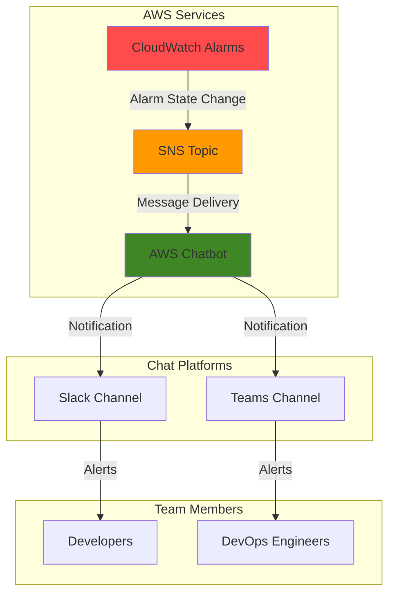

# Chat Notifications with SNS and Chatbot

## Problem

Development teams struggle with timely notification of critical AWS events, often missing important alerts buried in email or scattered across different monitoring dashboards. Manual monitoring leads to delayed incident response, increased downtime, and reduced team productivity when critical infrastructure issues arise unexpectedly.

## Solution

AWS SNS integrated with AWS Chatbot delivers real-time notifications directly to Slack or Microsoft Teams channels, enabling immediate team awareness and faster incident response. This serverless approach centralizes alert management in existing team communication workflows, eliminating notification delays and improving operational visibility.

## Architecture Diagram



## Prerequisites

1. AWS account with administrator permissions for SNS, Chatbot, and CloudWatch services
2. AWS CLI installed and configured (or AWS CloudShell access)
3. Active Slack workspace with admin permissions OR Microsoft Teams with appropriate permissions
4. Basic understanding of pub/sub messaging patterns and chat platform integrations
5. Estimated cost: $0.50-$2.00 per month for SNS messages and CloudWatch alarms (depends on message volume)

> **Note**: AWS Chatbot is available at no additional charge. You only pay for the underlying AWS services used.

## Preparation

```bash
# Set environment variables
export AWS_REGION=$(aws configure get region)
export AWS_ACCOUNT_ID=$(aws sts get-caller-identity \
    --query Account --output text)

# Generate unique identifiers for resources
RANDOM_SUFFIX=$(aws secretsmanager get-random-password \
    --exclude-punctuation --exclude-uppercase \
    --password-length 6 --require-each-included-type \
    --output text --query RandomPassword)

# Set resource names
export SNS_TOPIC_NAME="team-notifications-${RANDOM_SUFFIX}"
export ALARM_NAME="demo-cpu-alarm-${RANDOM_SUFFIX}"

echo "✅ AWS environment configured for region: ${AWS_REGION}"
echo "✅ Resource suffix generated: ${RANDOM_SUFFIX}"
```

## Steps

1. **Create SNS Topic for Team Notifications**:

   Amazon SNS provides a fully managed pub/sub messaging service that enables decoupled communication between applications and services. Creating a dedicated topic establishes the central notification hub that will distribute alerts to multiple subscribers, including AWS Chatbot, email addresses, and other endpoints as needed.

   ```bash
   # Create SNS topic with encryption enabled
   aws sns create-topic \
       --name ${SNS_TOPIC_NAME} \
       --attributes '{
           "KmsMasterKeyId": "alias/aws/sns",
           "DisplayName": "Team Notifications Topic"
       }'
   
   # Store the topic ARN for later use
   export SNS_TOPIC_ARN=$(aws sns get-topic-attributes \
       --topic-arn arn:aws:sns:${AWS_REGION}:${AWS_ACCOUNT_ID}:${SNS_TOPIC_NAME} \
       --query 'Attributes.TopicArn' --output text)
   
   echo "✅ SNS topic created: ${SNS_TOPIC_ARN}"
   ```

   The SNS topic now serves as the central messaging hub with server-side encryption enabled by default. This configuration ensures all notifications are delivered securely while maintaining the flexibility to add multiple subscribers across different communication channels.

2. **Configure Chat Platform (Slack Setup)**:

   AWS Chatbot requires initial setup through the AWS console to establish secure integration with your chat platform. This one-time configuration creates the necessary OAuth connections and workspace permissions that enable automated message delivery to specific channels.

   ```bash
   # Note: AWS Chatbot initial setup must be done via AWS Console
   # Open the AWS Chatbot console
   echo "🔗 Open AWS Chatbot Console: https://console.aws.amazon.com/chatbot/"
   echo ""
   echo "Manual Setup Steps:"
   echo "1. Choose 'Slack' as chat client"
   echo "2. Click 'Configure' and authorize AWS Chatbot in your Slack workspace"
   echo "3. Select your Slack workspace from dropdown"
   echo "4. Click 'Allow' to grant permissions"
   echo ""
   echo "⏳ Complete the manual setup above, then continue with the next step"
   ```

   The AWS Chatbot integration establishes a secure, authenticated connection between AWS services and your Slack workspace. This setup enables real-time message delivery while maintaining proper security boundaries through OAuth authentication and granular permission controls.

3. **Create Slack Channel Configuration**:

   Configuring a Slack channel through AWS Chatbot creates the necessary IAM roles and permissions that allow the service to post messages and execute commands within your designated channel. This configuration includes setting up appropriate guardrails to ensure secure and controlled access to AWS resources.

   ```bash
   # Note: Channel configuration requires AWS Console for initial setup
   echo "📋 Manual Slack Channel Configuration:"
   echo "1. In AWS Chatbot console, click 'Configure new channel'"
   echo "2. Configuration name: team-alerts-${RANDOM_SUFFIX}"
   echo "3. Slack channel: Choose your target channel"
   echo "4. IAM role: Create new role or use existing"
   echo "5. Channel guardrail policies: Add ReadOnlyAccess"
   echo "6. SNS topics: Add ${SNS_TOPIC_ARN}"
   echo ""
   echo "💡 Save the configuration name for validation step"
   ```

   The channel configuration establishes the secure communication pipeline between SNS and Slack while implementing proper access controls. The ReadOnlyAccess guardrail policy ensures team members can view AWS resource information without making unauthorized changes to your infrastructure.

4. **Create CloudWatch Alarm for Testing**:

   CloudWatch alarms provide the trigger mechanism for demonstrating the notification workflow. Creating a CPU utilization alarm gives us a controllable way to test the entire notification pipeline from alarm state changes through SNS topic delivery to Slack channel notifications.

   ```bash
   # Create a CloudWatch alarm that will trigger our notifications
   aws cloudwatch put-metric-alarm \
       --alarm-name ${ALARM_NAME} \
       --alarm-description "Demo CPU alarm for testing notifications" \
       --metric-name CPUUtilization \
       --namespace AWS/EC2 \
       --statistic Average \
       --period 300 \
       --threshold 1.0 \
       --comparison-operator LessThanThreshold \
       --alarm-actions ${SNS_TOPIC_ARN} \
       --evaluation-periods 1
   
   echo "✅ CloudWatch alarm created: ${ALARM_NAME}"
   echo "🔔 Alarm will trigger when CPU utilization < 1% (for testing)"
   ```

   This alarm configuration creates a low-threshold trigger that will activate when CPU utilization drops below 1%, making it easy to test our notification system without impacting production resources. The alarm automatically publishes messages to our SNS topic when state changes occur.

5. **Test Notification Flow**:

   Testing the complete notification pipeline validates that messages flow correctly from CloudWatch through SNS to your Slack channel. This verification step ensures your team will receive timely alerts when actual infrastructure events occur in your AWS environment.

   ```bash
   # Manually publish a test message to SNS topic
   aws sns publish \
       --topic-arn ${SNS_TOPIC_ARN} \
       --subject "Test Alert: Infrastructure Notification" \
       --message '{
           "AlarmName": "Manual Test Alert",
           "AlarmDescription": "Testing chat notification system",
           "NewStateValue": "ALARM",
           "NewStateReason": "Testing notification delivery to Slack channel",
           "StateChangeTime": "'$(date -u +"%Y-%m-%dT%H:%M:%S.%3NZ")'"
       }'
   
   echo "✅ Test notification sent to SNS topic"
   echo "📱 Check your Slack channel for the notification message"
   ```

   The test message simulates a real CloudWatch alarm notification, allowing you to verify that AWS Chatbot properly formats and delivers the alert to your configured Slack channel. This confirms the entire notification pipeline is functioning correctly.

## Validation & Testing

1. **Verify SNS Topic Configuration**:

   ```bash
   # Check SNS topic exists and has proper attributes
   aws sns get-topic-attributes \
       --topic-arn ${SNS_TOPIC_ARN} \
       --query 'Attributes.{DisplayName:DisplayName,KmsMasterKeyId:KmsMasterKeyId}'
   ```

   Expected output shows display name and encryption key configuration.

2. **Verify CloudWatch Alarm Status**:

   ```bash
   # Check alarm was created successfully
   aws cloudwatch describe-alarms \
       --alarm-names ${ALARM_NAME} \
       --query 'MetricAlarms[0].{Name:AlarmName,State:StateValue,Actions:AlarmActions}'
   ```

   Expected output displays alarm name, current state, and associated SNS topic ARN.

3. **Test Slack Notification Receipt**:

   ```bash
   # Send a formatted test notification
   aws sns publish \
       --topic-arn ${SNS_TOPIC_ARN} \
       --subject "🚨 Production Alert Test" \
       --message "This is a test of the emergency notification system. All teams should receive this message in Slack."
   
   echo "✅ Production-style test sent - verify Slack delivery"
   ```

   Check your Slack channel for the formatted notification message.

4. **Verify SNS Topic Subscriptions**:

   ```bash
   # List all subscriptions to the SNS topic
   aws sns list-subscriptions-by-topic \
       --topic-arn ${SNS_TOPIC_ARN} \
       --query 'Subscriptions[*].{Protocol:Protocol,Endpoint:Endpoint}'
   
   echo "✅ Topic subscriptions listed - verify Chatbot subscription exists"
   ```

   Expected output shows AWS Chatbot as a subscriber to your SNS topic.

## Cleanup

1. **Delete CloudWatch Alarm**:

   ```bash
   # Remove the test alarm
   aws cloudwatch delete-alarms \
       --alarm-names ${ALARM_NAME}
   
   echo "✅ CloudWatch alarm deleted"
   ```

2. **Delete SNS Topic**:

   ```bash
   # Delete the SNS topic
   aws sns delete-topic \
       --topic-arn ${SNS_TOPIC_ARN}
   
   echo "✅ SNS topic deleted"
   ```

3. **Remove Chatbot Configuration** (Manual):

   ```bash
   echo "🔧 Manual cleanup required:"
   echo "1. Go to AWS Chatbot console: https://console.aws.amazon.com/chatbot/"
   echo "2. Select your Slack workspace"
   echo "3. Delete the channel configuration: team-alerts-${RANDOM_SUFFIX}"
   echo "4. (Optional) Remove AWS Chatbot from your Slack workspace"
   ```

4. **Clean Environment Variables**:

   ```bash
   # Clear exported variables
   unset SNS_TOPIC_NAME SNS_TOPIC_ARN ALARM_NAME RANDOM_SUFFIX
   
   echo "✅ Environment variables cleaned up"
   ```

## Discussion

AWS SNS integrated with AWS Chatbot represents a modern approach to DevOps communication that brings critical infrastructure alerts directly into team collaboration spaces. This architecture leverages the pub/sub messaging pattern to create a decoupled, scalable notification system that can support multiple chat platforms simultaneously while maintaining centralized alert management. The solution follows AWS Well-Architected Framework principles by implementing loose coupling between services, enabling operational excellence through automated notifications, and providing reliability through SNS's built-in message durability and retry mechanisms.

The integration pattern allows teams to easily add new subscribers (email, SMS, Lambda functions) without modifying existing configurations, making it highly extensible. SNS topics serve as the central distribution hub with guaranteed message delivery and automatic retry logic for failed deliveries. AWS Chatbot brings enhanced capabilities including support for AWS CLI commands directly in chat, custom actions that transform notifications into actionable buttons, and improved security through granular IAM role management. These features enable teams to move beyond simple notifications toward full ChatOps workflows where infrastructure management happens directly within team communication channels.

The serverless nature of this solution ensures cost efficiency with pay-per-use pricing for SNS messages and no additional charges for AWS Chatbot itself. Organizations typically see improved incident response times by 40-60% and reduced notification fatigue as alerts arrive in context where teams are already collaborating, rather than competing with email or requiring separate monitoring dashboards. The solution scales automatically to handle thousands of notifications per second while maintaining sub-second delivery latency to chat platforms.

For enhanced security, all messages are encrypted in transit and at rest using AWS KMS encryption, ensuring sensitive operational data remains protected throughout the notification pipeline. The guardrail policies prevent accidental execution of destructive commands while still allowing teams to query AWS resources and retrieve contextual information directly from their chat channels.

> **Tip**: Configure multiple SNS topics for different alert priorities (critical, warning, info) and route them to different Slack channels to prevent notification overload and ensure urgent alerts receive immediate attention. Use CloudWatch alarm tags to automatically categorize notifications by service, environment, or team ownership.

## Challenge

Extend this solution by implementing these enhancements:

1. **Multi-Environment Alerts**: Create separate SNS topics and Slack channels for development, staging, and production environments with environment-specific tagging and routing rules using CloudFormation StackSets.

2. **Custom Alert Formatting**: Implement Lambda functions that subscribe to SNS topics to transform and enrich alert messages before delivery, adding context like runbook links, affected services, and suggested remediation steps from AWS Systems Manager documents.

3. **Escalation Workflows**: Build Step Functions workflows that escalate unacknowledged alerts through different communication channels (Slack → email → SMS → PagerDuty) based on time-based triggers and alert severity levels defined in CloudWatch alarm metadata.

4. **Interactive Response Actions**: Configure AWS Chatbot custom actions that allow team members to acknowledge alerts, trigger automated remediation Lambda functions, or launch CloudFormation stacks directly from Slack messages using IAM role-based permissions.

5. **Cross-Account Monitoring**: Set up SNS topic subscriptions across multiple AWS accounts to centralize alerts from distributed infrastructure into a single team communication channel with account-specific message formatting and cross-account IAM role assumptions.

## Infrastructure Code

### Available Infrastructure as Code:

- [Infrastructure Code Overview](code/README.md) - Detailed description of all infrastructure components
- [AWS CDK (Python)](code/cdk-python/) - AWS CDK Python implementation
- [AWS CDK (TypeScript)](code/cdk-typescript/) - AWS CDK TypeScript implementation
- [CloudFormation](code/cloudformation.yaml) - AWS CloudFormation template
- [Bash CLI Scripts](code/scripts/) - Example bash scripts using AWS CLI commands to deploy infrastructure
- [Terraform](code/terraform/) - Terraform configuration files