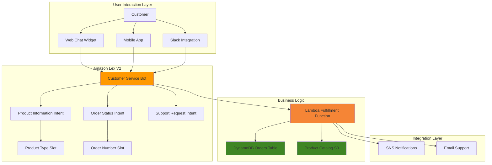

# Chatbot Development with Amazon Lex


## Problem

Modern businesses struggle with increasing customer service demands while managing operational costs and maintaining 24/7 availability. Traditional customer support channels cannot scale efficiently to handle repetitive inquiries about product information, order status, and basic troubleshooting, leading to long wait times and customer dissatisfaction. Organizations need an intelligent, automated solution that can handle common customer interactions while seamlessly escalating complex issues to human agents.

## Solution

Amazon Lex provides a fully managed service for building conversational interfaces using automatic speech recognition (ASR) and natural language understanding (NLU). By creating intelligent chatbots with Lex, businesses can automate customer service interactions, reduce response times, and scale support operations cost-effectively. The solution integrates with AWS Lambda for custom business logic and supports multi-channel deployment across web, mobile, and messaging platforms.

## Architecture Diagram



## Prerequisites

1. AWS account with appropriate permissions for Lex, Lambda, DynamoDB, S3, and IAM
2. AWS CLI v2 installed and configured (or AWS CloudShell)
3. Basic understanding of conversational design and natural language processing
4. Familiarity with Lambda functions and DynamoDB operations
5. Estimated cost: $2-5 per month for testing (includes Lex text requests, Lambda invocations, and DynamoDB read/write operations)

> **Note**: Amazon Lex V2 pricing is based on text/speech requests. First 10,000 text requests per month are free, then $0.00075 per text request. Learn more about [Amazon Lex V2 features and capabilities](https://docs.aws.amazon.com/lexv2/latest/dg/what-is.html).

## Preparation

```bash
# Set environment variables
export AWS_REGION=$(aws configure get region)
export AWS_ACCOUNT_ID=$(aws sts get-caller-identity \
    --query Account --output text)

# Generate unique identifiers for resources
RANDOM_SUFFIX=$(aws secretsmanager get-random-password \
    --exclude-punctuation --exclude-uppercase \
    --password-length 6 --require-each-included-type \
    --output text --query RandomPassword)

export BOT_NAME="customer-service-bot-${RANDOM_SUFFIX}"
export LAMBDA_FUNCTION_NAME="lex-fulfillment-${RANDOM_SUFFIX}"
export ORDERS_TABLE_NAME="customer-orders-${RANDOM_SUFFIX}"
export PRODUCTS_BUCKET_NAME="product-catalog-${RANDOM_SUFFIX}"
export LEX_ROLE_NAME="LexServiceRole-${RANDOM_SUFFIX}"
export LAMBDA_ROLE_NAME="LexLambdaRole-${RANDOM_SUFFIX}"

# Create IAM role for Lex service
aws iam create-role \
    --role-name $LEX_ROLE_NAME \
    --assume-role-policy-document '{
        "Version": "2012-10-17",
        "Statement": [
            {
                "Effect": "Allow",
                "Principal": {
                    "Service": "lexv2.amazonaws.com"
                },
                "Action": "sts:AssumeRole"
            }
        ]
    }'

# Attach basic Lex policy to role
aws iam attach-role-policy \
    --role-name $LEX_ROLE_NAME \
    --policy-arn arn:aws:iam::aws:policy/AmazonLexFullAccess

# Create DynamoDB table for order data
aws dynamodb create-table \
    --table-name $ORDERS_TABLE_NAME \
    --attribute-definitions \
        AttributeName=OrderId,AttributeType=S \
    --key-schema \
        AttributeName=OrderId,KeyType=HASH \
    --billing-mode PAY_PER_REQUEST \
    --tags Key=Purpose,Value=LexChatbotDemo

# Create S3 bucket for product catalog
aws s3 mb s3://$PRODUCTS_BUCKET_NAME

echo "✅ Preparation completed successfully"
```

## Steps

1. **Create Lambda Function for Bot Fulfillment**:

   Lambda functions serve as the brain behind conversational AI by enabling custom business logic that goes beyond simple response templates. In chatbot architectures, Lambda fulfillment functions process user intents, validate input data, integrate with backend systems, and generate dynamic responses based on real-time data. This approach transforms static chatbots into intelligent assistants capable of handling complex business workflows while maintaining the scalability and cost-effectiveness of serverless computing.

   ```bash
   # Create IAM role for Lambda function
   aws iam create-role \
       --role-name $LAMBDA_ROLE_NAME \
       --assume-role-policy-document '{
           "Version": "2012-10-17",
           "Statement": [
               {
                   "Effect": "Allow",
                   "Principal": {
                       "Service": "lambda.amazonaws.com"
                   },
                   "Action": "sts:AssumeRole"
               }
           ]
       }'
   
   # Attach necessary policies to Lambda role
   aws iam attach-role-policy \
       --role-name $LAMBDA_ROLE_NAME \
       --policy-arn arn:aws:iam::aws:policy/service-role/AWSLambdaBasicExecutionRole
   
   aws iam attach-role-policy \
       --role-name $LAMBDA_ROLE_NAME \
       --policy-arn arn:aws:iam::aws:policy/AmazonDynamoDBFullAccess
   
   aws iam attach-role-policy \
       --role-name $LAMBDA_ROLE_NAME \
       --policy-arn arn:aws:iam::aws:policy/AmazonS3ReadOnlyAccess
   
   echo "✅ Lambda IAM role created with necessary permissions"
   ```

   The IAM role is now configured with the minimum permissions required for the Lambda function to interact with DynamoDB for order lookups, S3 for product catalog access, and CloudWatch for logging. This security-first approach follows AWS best practices by granting only the specific permissions needed for chatbot functionality, reducing potential attack surfaces while enabling seamless integration with backend data sources.

2. **Create Lambda Function Code**:

   The Lambda fulfillment function implements the core conversational logic that transforms user intents into meaningful business actions. This code structure follows the [Amazon Lex V2 Lambda integration pattern](https://docs.aws.amazon.com/lexv2/latest/dg/lambda.html), handling intent routing, slot validation, and response generation. By centralizing business logic in Lambda, we enable sophisticated conversation flows that can access real-time data, perform complex validations, and integrate with multiple backend systems while maintaining fast response times essential for natural conversations.

   ```bash
   # Create Lambda function code
   cat > /tmp/lex_fulfillment.py << 'EOF'
import json
import boto3
import logging

logger = logging.getLogger()
logger.setLevel(logging.INFO)

dynamodb = boto3.resource('dynamodb')
s3 = boto3.client('s3')

def lambda_handler(event, context):
    logger.info(f"Received event: {json.dumps(event)}")
    
    intent_name = event['sessionState']['intent']['name']
    
    if intent_name == 'ProductInformation':
        return handle_product_information(event)
    elif intent_name == 'OrderStatus':
        return handle_order_status(event)
    elif intent_name == 'SupportRequest':
        return handle_support_request(event)
    else:
        return close_intent(event, "I'm sorry, I don't understand that request.")

def handle_product_information(event):
    slots = event['sessionState']['intent']['slots']
    product_type = slots.get('ProductType', {}).get('value', {}).get('interpretedValue')
    
    if not product_type:
        return elicit_slot(event, 'ProductType', 
                          "What type of product are you interested in? We have electronics, clothing, and books.")
    
    # Simulate product information lookup
    product_info = {
        'electronics': "Our electronics include smartphones, laptops, and smart home devices. Prices range from $50 to $2000.",
        'clothing': "Our clothing collection features casual wear, formal attire, and seasonal items. Sizes range from XS to XXL.",
        'books': "Our book selection includes fiction, non-fiction, and educational materials. Most books are priced between $10-30."
    }
    
    response_text = product_info.get(product_type.lower(), 
                                   "I don't have information about that product type. Please try electronics, clothing, or books.")
    
    return close_intent(event, response_text)

def handle_order_status(event):
    slots = event['sessionState']['intent']['slots']
    order_id = slots.get('OrderNumber', {}).get('value', {}).get('interpretedValue')
    
    if not order_id:
        return elicit_slot(event, 'OrderNumber', 
                          "Please provide your order number so I can check the status.")
    
    # Query DynamoDB for order status
    try:
        table = dynamodb.Table('customer-orders-example')  # Update with actual table name
        response = table.get_item(Key={'OrderId': order_id})
        
        if 'Item' in response:
            order = response['Item']
            status_text = f"Order {order_id} is currently {order.get('Status', 'Unknown')}."
            if 'EstimatedDelivery' in order:
                status_text += f" Estimated delivery: {order['EstimatedDelivery']}"
        else:
            status_text = f"I couldn't find an order with number {order_id}. Please check the number and try again."
            
    except Exception as e:
        logger.error(f"Error querying DynamoDB: {str(e)}")
        status_text = "I'm having trouble accessing order information right now. Please try again later."
    
    return close_intent(event, status_text)

def handle_support_request(event):
    # For complex issues, escalate to human support
    response_text = ("I'll connect you with a human support agent. "
                    "You can also email us at support@company.com or call 1-800-SUPPORT. "
                    "A representative will assist you within 24 hours.")
    
    return close_intent(event, response_text)

def elicit_slot(event, slot_name, message):
    return {
        'sessionState': {
            'dialogAction': {
                'type': 'ElicitSlot',
                'slotToElicit': slot_name
            },
            'intent': event['sessionState']['intent'],
            'originatingRequestId': event['requestAttributes'].get('x-amz-lex:request-id')
        },
        'messages': [
            {
                'contentType': 'PlainText',
                'content': message
            }
        ]
    }

def close_intent(event, message):
    return {
        'sessionState': {
            'dialogAction': {
                'type': 'Close'
            },
            'intent': {
                'name': event['sessionState']['intent']['name'],
                'state': 'Fulfilled'
            },
            'originatingRequestId': event['requestAttributes'].get('x-amz-lex:request-id')
        },
        'messages': [
            {
                'contentType': 'PlainText',
                'content': message
            }
        ]
    }
EOF
   
   # Create deployment package
   cd /tmp && zip lex_fulfillment.zip lex_fulfillment.py
   
   echo "✅ Lambda function code created and packaged"
   ```

   The fulfillment function code is now packaged and ready for deployment. This implementation demonstrates key chatbot patterns including intent-based routing, slot elicitation for gathering required information, and graceful error handling. The modular design allows for easy extension to support additional intents and business logic while maintaining clean separation between conversation flow and data processing.

3. **Deploy Lambda Function**:

   Lambda deployment establishes the serverless compute foundation that enables real-time conversational processing. The function configuration includes environment variables for dynamic resource references, appropriate timeout settings for database queries, and tagging for resource management. This deployment pattern ensures the Lambda function can scale automatically to handle varying conversation volumes while maintaining consistent response times critical for positive user experiences.

   ```bash
   # Wait for IAM role propagation
   sleep 10
   
   # Create Lambda function
   LAMBDA_ROLE_ARN=$(aws iam get-role \
       --role-name $LAMBDA_ROLE_NAME \
       --query 'Role.Arn' --output text)
   
   aws lambda create-function \
       --function-name $LAMBDA_FUNCTION_NAME \
       --runtime python3.9 \
       --role $LAMBDA_ROLE_ARN \
       --handler lex_fulfillment.lambda_handler \
       --zip-file fileb:///tmp/lex_fulfillment.zip \
       --timeout 30 \
       --environment Variables="{ORDERS_TABLE=$ORDERS_TABLE_NAME,PRODUCTS_BUCKET=$PRODUCTS_BUCKET_NAME}" \
       --tags Purpose=LexChatbotDemo
   
   # Get Lambda function ARN for Lex configuration
   LAMBDA_ARN=$(aws lambda get-function \
       --function-name $LAMBDA_FUNCTION_NAME \
       --query 'Configuration.FunctionArn' --output text)
   
   echo "✅ Lambda function deployed: $LAMBDA_ARN"
   ```

   The Lambda function is now active and ready to process Lex requests. The 30-second timeout provides sufficient time for database queries and external API calls while preventing long-running executions that could impact user experience. Environment variables enable the function to dynamically reference the DynamoDB table and S3 bucket, supporting deployment across different environments without code changes.

4. **Create Amazon Lex Bot**:

   Creating the Lex bot establishes the foundational conversational interface that coordinates natural language understanding, intent recognition, and response generation. Amazon Lex V2 provides advanced NLU capabilities including automatic speech recognition (ASR) and natural language understanding (NLU) that can interpret user requests across multiple languages and communication channels. The bot configuration includes data privacy settings for compliance and session management for maintaining conversation context across multiple interactions.

   ```bash
   # Get Lex service role ARN
   LEX_ROLE_ARN=$(aws iam get-role \
       --role-name $LEX_ROLE_NAME \
       --query 'Role.Arn' --output text)
   
   # Create the bot
   aws lexv2-models create-bot \
       --bot-name $BOT_NAME \
       --description "Customer service chatbot for product inquiries and order status" \
       --role-arn $LEX_ROLE_ARN \
       --data-privacy '{"childDirected": false}' \
       --idle-session-ttl-in-seconds 300
   
   # Get bot ID
   BOT_ID=$(aws lexv2-models list-bots \
       --query "botSummaries[?botName=='$BOT_NAME'].botId" \
       --output text)
   
   echo "✅ Lex bot created with ID: $BOT_ID"
   ```

   The bot is now created and ready for configuration. The 5-minute idle session timeout balances user experience with resource optimization, allowing natural conversation pauses while preventing indefinite session persistence. The data privacy configuration ensures compliance with regulations while enabling the bot to provide personalized experiences based on conversation history within each session.

5. **Create Bot Locale and Intents**:

   Intent design forms the foundation of effective conversational AI by mapping user goals to specific business functions. Each intent represents a distinct user objective that the bot can fulfill, from product inquiries to order tracking to support escalation. The NLU confidence threshold of 0.7 ensures accurate intent recognition while minimizing false positives that could lead to frustrated user experiences. This intent-based architecture enables scalable conversation design where new capabilities can be added without disrupting existing functionality.

   ```bash
   # Create bot locale (English US)
   aws lexv2-models create-bot-locale \
       --bot-id $BOT_ID \
       --bot-version DRAFT \
       --locale-id en_US \
       --nlu-intent-confidence-threshold 0.7
   
   # Create ProductInformation intent
   aws lexv2-models create-intent \
       --bot-id $BOT_ID \
       --bot-version DRAFT \
       --locale-id en_US \
       --intent-name ProductInformation \
       --description "Intent to handle product information requests"
   
   # Create OrderStatus intent  
   aws lexv2-models create-intent \
       --bot-id $BOT_ID \
       --bot-version DRAFT \
       --locale-id en_US \
       --intent-name OrderStatus \
       --description "Intent to handle order status inquiries"
   
   # Create SupportRequest intent
   aws lexv2-models create-intent \
       --bot-id $BOT_ID \
       --bot-version DRAFT \
       --locale-id en_US \
       --intent-name SupportRequest \
       --description "Intent to handle complex support requests"
   
   echo "✅ Bot locale and intents created"
   ```

   The bot locale and three core intents are now established, creating the conversational framework for customer service automation. These intents cover the most common customer service scenarios: product inquiries, order tracking, and support escalation. The English US locale configuration enables the bot to understand natural language variations and colloquialisms specific to American English speakers, improving recognition accuracy and user satisfaction.

6. **Create Slot Types and Configure Intent Details**:

   Slot types define the structured data that the bot extracts from natural language input, enabling precise information capture essential for business logic execution. Custom slot types like ProductType provide controlled vocabularies that improve recognition accuracy while built-in slot types like AMAZON.AlphaNumeric handle common data patterns. Sample utterances train the NLU model to recognize diverse ways users might express the same intent, while slot elicitation prompts guide users to provide missing information naturally within the conversation flow.

   ```bash
   # Create ProductType slot type
   aws lexv2-models create-slot-type \
       --bot-id $BOT_ID \
       --bot-version DRAFT \
       --locale-id en_US \
       --slot-type-name ProductType \
       --description "Types of products available" \
       --slot-type-values '[
           {"sampleValue": {"value": "electronics"}},
           {"sampleValue": {"value": "clothing"}},
           {"sampleValue": {"value": "books"}}
       ]'
   
   # Update ProductInformation intent with sample utterances and slots
   cat > /tmp/product_intent.json << EOF
{
    "intentName": "ProductInformation",
    "description": "Intent to handle product information requests",
    "sampleUtterances": [
        {"utterance": "Tell me about your products"},
        {"utterance": "What do you sell"},
        {"utterance": "I want to know about {ProductType}"},
        {"utterance": "Do you have {ProductType}"},
        {"utterance": "Show me {ProductType} products"}
    ],
    "slots": [
        {
            "slotName": "ProductType",
            "description": "The type of product the customer is asking about",
            "slotTypeName": "ProductType",
            "valueElicitationSetting": {
                "slotConstraint": "Optional",
                "promptSpecification": {
                    "messageGroupsList": [
                        {
                            "message": {
                                "plainTextMessage": {
                                    "value": "What type of product are you interested in?"
                                }
                            }
                        }
                    ],
                    "maxRetries": 2
                }
            }
        }
    ]
}
EOF

   aws lexv2-models update-intent \
       --bot-id $BOT_ID \
       --bot-version DRAFT \
       --locale-id en_US \
       --intent-id $(aws lexv2-models list-intents \
           --bot-id $BOT_ID \
           --bot-version DRAFT \
           --locale-id en_US \
           --query "intentSummaries[?intentName=='ProductInformation'].intentId" \
           --output text) \
       --cli-input-json file:///tmp/product_intent.json
   
   echo "✅ Slot types and intent configurations updated"
   ```

   The ProductInformation intent is now configured with a custom slot type and diverse sample utterances that train the NLU model to recognize product inquiries regardless of phrasing variations. The optional slot constraint allows users to either specify a product type immediately or be prompted for clarification, creating a flexible conversation flow that accommodates different user communication styles while ensuring all necessary information is collected.

7. **Configure OrderStatus Intent with Slot**:

   Order tracking represents a critical customer service function that demonstrates the power of conversational AI to provide immediate value by connecting natural language requests to backend data systems. The OrderStatus intent uses the built-in AMAZON.AlphaNumeric slot type to capture order numbers in various formats while the required constraint ensures essential information is collected before database queries are executed. This validation approach prevents unnecessary Lambda invocations and database calls while providing clear guidance to users about required information.

   ```bash
   # Update OrderStatus intent with sample utterances and slots
   cat > /tmp/order_intent.json << EOF
{
    "intentName": "OrderStatus",
    "description": "Intent to handle order status inquiries",
    "sampleUtterances": [
        {"utterance": "Check my order status"},
        {"utterance": "Where is my order"},
        {"utterance": "Track order {OrderNumber}"},
        {"utterance": "Order status for {OrderNumber}"},
        {"utterance": "What's the status of order {OrderNumber}"}
    ],
    "slots": [
        {
            "slotName": "OrderNumber",
            "description": "The customer's order number",
            "slotTypeName": "AMAZON.AlphaNumeric",
            "valueElicitationSetting": {
                "slotConstraint": "Required",
                "promptSpecification": {
                    "messageGroupsList": [
                        {
                            "message": {
                                "plainTextMessage": {
                                    "value": "Please provide your order number."
                                }
                            }
                        }
                    ],
                    "maxRetries": 2
                }
            }
        }
    ]
}
EOF

   aws lexv2-models update-intent \
       --bot-id $BOT_ID \
       --bot-version DRAFT \
       --locale-id en_US \
       --intent-id $(aws lexv2-models list-intents \
           --bot-id $BOT_ID \
           --bot-version DRAFT \
           --locale-id en_US \
           --query "intentSummaries[?intentName=='OrderStatus'].intentId" \
           --output text) \
       --cli-input-json file:///tmp/order_intent.json
   
   echo "✅ OrderStatus intent configured with required slot"
   ```

   The OrderStatus intent is now configured to handle the most common customer service inquiry with intelligent data validation and error handling. The two-retry limit for slot elicitation balances user patience with data accuracy, while the alphanumeric slot type accommodates various order number formats used across different e-commerce systems. This configuration enables immediate order status responses that would traditionally require human agent intervention.

8. **Configure SupportRequest Intent and Lambda Integration**:

   Support escalation intent provides the critical safety net that ensures customer satisfaction by recognizing when automated assistance reaches its limits and human intervention is needed. This intent demonstrates intelligent conversation design that acknowledges the boundaries of AI assistance while providing clear pathways for customers to receive appropriate help. The Lambda integration permission grants Lex the ability to invoke the fulfillment function, enabling dynamic response generation and backend system integration that transforms static chatbots into intelligent customer service platforms.

   ```bash
   # Update SupportRequest intent
   cat > /tmp/support_intent.json << EOF
{
    "intentName": "SupportRequest",
    "description": "Intent to handle complex support requests",
    "sampleUtterances": [
        {"utterance": "I need help"},
        {"utterance": "Speak to customer service"},
        {"utterance": "I have a problem"},
        {"utterance": "Connect me to support"},
        {"utterance": "I need technical assistance"}
    ]
}
EOF

   aws lexv2-models update-intent \
       --bot-id $BOT_ID \
       --bot-version DRAFT \
       --locale-id en_US \
       --intent-id $(aws lexv2-models list-intents \
           --bot-id $BOT_ID \
           --bot-version DRAFT \
           --locale-id en_US \
           --query "intentSummaries[?intentName=='SupportRequest'].intentId" \
           --output text) \
       --cli-input-json file:///tmp/support_intent.json
   
   # Grant Lex permission to invoke Lambda function
   aws lambda add-permission \
       --function-name $LAMBDA_FUNCTION_NAME \
       --statement-id lex-invoke \
       --action lambda:InvokeFunction \
       --principal lexv2.amazonaws.com \
       --source-arn "arn:aws:lex:$AWS_REGION:$AWS_ACCOUNT_ID:bot-alias/$BOT_ID/*"
   
   echo "✅ Support intent configured and Lambda permissions granted"
   ```

   The SupportRequest intent and Lambda integration are now configured, completing the conversational framework that balances automation with human assistance. The resource-based permission policy enables secure invocation of the fulfillment function while the broad source ARN pattern accommodates future bot versions and aliases. This integration architecture enables sophisticated conversation flows that can process business logic, access multiple data sources, and generate personalized responses in real-time.

9. **Build and Test the Bot**:

   The bot building process compiles all intents, slot types, and sample utterances into an optimized NLU model that can accurately recognize user input and extract relevant information. This machine learning training phase is essential for achieving high-quality conversation experiences, as it analyzes patterns across all sample utterances to improve intent recognition accuracy. Bot versioning and aliases enable safe deployment practices where production environments remain stable while development continues on draft versions, supporting continuous improvement without service disruption.

   ```bash
   # Build the bot
   aws lexv2-models build-bot-locale \
       --bot-id $BOT_ID \
       --bot-version DRAFT \
       --locale-id en_US
   
   # Wait for build to complete
   echo "Waiting for bot build to complete..."
   aws lexv2-models wait bot-locale-built \
       --bot-id $BOT_ID \
       --bot-version DRAFT \
       --locale-id en_US
   
   # Create bot version
   aws lexv2-models create-bot-version \
       --bot-id $BOT_ID \
       --description "Production version of customer service bot"
   
   # Create bot alias for production
   aws lexv2-models create-bot-alias \
       --bot-id $BOT_ID \
       --bot-alias-name production \
       --description "Production alias for customer service bot" \
       --bot-version "1"
   
   echo "✅ Bot built successfully and production alias created"
   ```

   The bot is now built and deployed with a production alias that provides a stable endpoint for integration with web applications, mobile apps, or messaging platforms. The versioning system ensures that updates can be tested thoroughly before deployment while the alias mechanism enables zero-downtime updates and rollback capabilities essential for production customer service operations.

10. **Populate Sample Data and Test**:

    Sample data population enables comprehensive testing of the end-to-end conversation flow, from natural language input through intent recognition to database queries and response generation. This test data demonstrates the [DynamoDB integration capabilities](https://docs.aws.amazon.com/amazondynamodb/latest/developerguide/GettingStartedDynamoDB.html) that enable real-time order status lookups while providing realistic scenarios for validating conversation logic. Proper test data coverage ensures the chatbot performs correctly across different order states and edge cases before customer deployment.

    ```bash
    # Add sample order data to DynamoDB
    aws dynamodb put-item \
        --table-name $ORDERS_TABLE_NAME \
        --item '{
            "OrderId": {"S": "ORD123456"},
            "Status": {"S": "Shipped"},
            "EstimatedDelivery": {"S": "2024-01-15"},
            "CustomerEmail": {"S": "customer@example.com"}
        }'
    
    aws dynamodb put-item \
        --table-name $ORDERS_TABLE_NAME \
        --item '{
            "OrderId": {"S": "ORD789012"},
            "Status": {"S": "Processing"},
            "EstimatedDelivery": {"S": "2024-01-20"},
            "CustomerEmail": {"S": "customer2@example.com"}
        }'
    
    echo "✅ Sample order data added to DynamoDB"
    ```

    The sample order data is now available for testing complete conversation flows that demonstrate how the chatbot transforms natural language inquiries into database queries and meaningful customer responses. This data setup includes various order statuses and delivery dates that enable testing both successful lookups and edge cases, ensuring robust error handling and user experience validation before production deployment.

## Validation & Testing

1. **Test Bot Functionality with Sample Conversations**:

   ```bash
   # Test ProductInformation intent
   aws lexv2-runtime recognize-text \
       --bot-id $BOT_ID \
       --bot-alias-id $(aws lexv2-models list-bot-aliases \
           --bot-id $BOT_ID \
           --query "botAliasSummaries[0].botAliasId" --output text) \
       --locale-id en_US \
       --session-id test-session-1 \
       --text "Tell me about your electronics"
   ```

   Expected output: Response about electronics products with pricing information.

2. **Test Order Status Intent**:

   ```bash
   # Test OrderStatus intent with valid order
   aws lexv2-runtime recognize-text \
       --bot-id $BOT_ID \
       --bot-alias-id $(aws lexv2-models list-bot-aliases \
           --bot-id $BOT_ID \
           --query "botAliasSummaries[0].botAliasId" --output text) \
       --locale-id en_US \
       --session-id test-session-2 \
       --text "Check order status for ORD123456"
   ```

   Expected output: Order status information showing "Shipped" status with delivery date.

3. **Test Support Request Intent**:

   ```bash
   # Test SupportRequest intent
   aws lexv2-runtime recognize-text \
       --bot-id $BOT_ID \
       --bot-alias-id $(aws lexv2-models list-bot-aliases \
           --bot-id $BOT_ID \
           --query "botAliasSummaries[0].botAliasId" --output text) \
       --locale-id en_US \
       --session-id test-session-3 \
       --text "I need help with my account"
   ```

   Expected output: Support escalation message with contact information.

4. **Verify Lambda Function Execution**:

   ```bash
   # Check Lambda function logs
   aws logs describe-log-groups \
       --log-group-name-prefix "/aws/lambda/$LAMBDA_FUNCTION_NAME"
   ```

## Cleanup

1. **Remove Lex Bot and Associated Resources**:

   ```bash
   # Delete bot alias
   BOT_ALIAS_ID=$(aws lexv2-models list-bot-aliases \
       --bot-id $BOT_ID \
       --query "botAliasSummaries[0].botAliasId" --output text)
   
   aws lexv2-models delete-bot-alias \
       --bot-id $BOT_ID \
       --bot-alias-id $BOT_ALIAS_ID
   
   # Delete bot
   aws lexv2-models delete-bot \
       --bot-id $BOT_ID
   
   echo "✅ Lex bot and alias deleted"
   ```

2. **Remove Lambda Function and IAM Roles**:

   ```bash
   # Delete Lambda function
   aws lambda delete-function \
       --function-name $LAMBDA_FUNCTION_NAME
   
   # Detach and delete IAM roles
   aws iam detach-role-policy \
       --role-name $LAMBDA_ROLE_NAME \
       --policy-arn arn:aws:iam::aws:policy/service-role/AWSLambdaBasicExecutionRole
   
   aws iam detach-role-policy \
       --role-name $LAMBDA_ROLE_NAME \
       --policy-arn arn:aws:iam::aws:policy/AmazonDynamoDBFullAccess
   
   aws iam detach-role-policy \
       --role-name $LAMBDA_ROLE_NAME \
       --policy-arn arn:aws:iam::aws:policy/AmazonS3ReadOnlyAccess
   
   aws iam delete-role --role-name $LAMBDA_ROLE_NAME
   
   aws iam detach-role-policy \
       --role-name $LEX_ROLE_NAME \
       --policy-arn arn:aws:iam::aws:policy/AmazonLexFullAccess
   
   aws iam delete-role --role-name $LEX_ROLE_NAME
   
   echo "✅ Lambda function and IAM roles deleted"
   ```

3. **Remove DynamoDB Table and S3 Bucket**:

   ```bash
   # Delete DynamoDB table
   aws dynamodb delete-table \
       --table-name $ORDERS_TABLE_NAME
   
   # Delete S3 bucket
   aws s3 rb s3://$PRODUCTS_BUCKET_NAME --force
   
   # Clean up temporary files
   rm -f /tmp/lex_fulfillment.py /tmp/lex_fulfillment.zip
   rm -f /tmp/product_intent.json /tmp/order_intent.json /tmp/support_intent.json
   
   echo "✅ All resources cleaned up successfully"
   ```

## Discussion

Amazon Lex V2 provides a powerful platform for building conversational interfaces that can significantly improve customer service operations. The key architectural decision in this implementation involves using Lambda functions for fulfillment, which enables custom business logic integration with existing systems like DynamoDB for order tracking and S3 for product catalogs. This approach allows organizations to create sophisticated chatbots that can handle complex workflows while maintaining the flexibility to integrate with enterprise systems.

The natural language understanding capabilities of Lex automatically handle variations in customer input, reducing the need for extensive training data. Intent-based architecture allows for clear separation of concerns, making the bot easily maintainable and extensible. The slot-filling mechanism ensures that required information is collected before processing requests, improving conversation flow and reducing user frustration.

Regarding deployment strategies, Lex V2 supports multiple channels including web chat widgets, mobile applications, and popular messaging platforms like Slack and Facebook Messenger. The bot versioning and alias system enables safe deployment of updates to production environments. For enterprise deployments, consider implementing conversation logs using CloudWatch for monitoring and analysis, and integrate with Amazon Connect for seamless handoff to human agents when needed.

> **Tip**: Use Amazon Lex conversation logs and CloudWatch metrics to continuously improve bot performance by analyzing failed intents and optimizing sample utterances based on real user interactions. Monitor key metrics through the [Amazon Lex CloudWatch integration](https://docs.aws.amazon.com/lexv2/latest/dg/monitoring-aws-lex-cloudwatch.html) to identify conversation patterns and optimization opportunities.

## Challenge

Extend this customer service chatbot by implementing these enhancements:

1. **Multi-language Support**: Add Spanish and French locales to the bot with translated intents and responses, enabling international customer support capabilities.

2. **Voice Integration**: Integrate Amazon Polly for text-to-speech responses and configure the bot for voice interactions through Amazon Connect or custom phone systems.

3. **Sentiment Analysis**: Use Amazon Comprehend to analyze customer sentiment during conversations and automatically escalate frustrated customers to human agents.

4. **Advanced Analytics**: Implement conversation analytics using Amazon QuickSight to visualize bot performance metrics, popular intents, and customer satisfaction trends.

5. **Enterprise Integration**: Connect the bot to external CRM systems like Salesforce using API Gateway and Lambda to provide personalized customer experiences based on account history.

## Infrastructure Code

*Infrastructure code will be generated after recipe approval.*