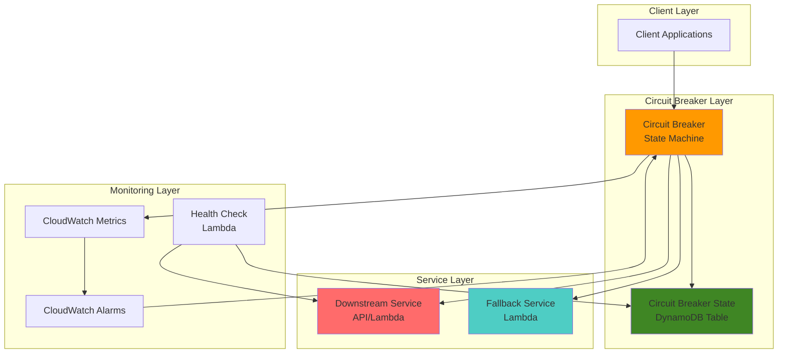

# Circuit Breaker Patterns with Step Functions

## Problem

Modern distributed applications often experience cascading failures when dependent services become unavailable or exhibit high latency. When microservices repeatedly attempt to call failing services, they can exhaust resources, degrade performance, and create a poor user experience across the entire application. Traditional retry mechanisms alone are insufficient for protecting against extended service outages, leading to resource exhaustion and potential system-wide failures.

## Solution

Implement a comprehensive circuit breaker pattern using AWS Step Functions to automatically detect service failures, prevent cascading failures, and enable graceful degradation. The solution uses Step Functions' error handling capabilities combined with DynamoDB state tracking to monitor service health, automatically trip circuit breakers during failures, and provide fallback mechanisms while periodically testing for service recovery.

## Architecture Diagram



## Prerequisites

1. AWS account with appropriate permissions for Step Functions, Lambda, DynamoDB, and CloudWatch
2. AWS CLI v2 installed and configured (or AWS CloudShell)
3. Understanding of distributed systems and fault tolerance patterns
4. Basic knowledge of Step Functions state machine design
5. Estimated cost: $5-10 for resources created (includes Step Functions executions, Lambda invocations, DynamoDB usage)

> **Note**: This recipe implements production-ready circuit breaker patterns that can significantly improve system resilience. For more information on resilience patterns, see the [AWS Well-Architected Framework - Reliability Pillar](https://docs.aws.amazon.com/wellarchitected/latest/reliability-pillar/welcome.html).

## Preparation

```bash
# Set environment variables
export AWS_REGION=$(aws configure get region)
export AWS_ACCOUNT_ID=$(aws sts get-caller-identity \
    --query Account --output text)

# Generate unique identifiers for resources
RANDOM_SUFFIX=$(aws secretsmanager get-random-password \
    --exclude-punctuation --exclude-uppercase \
    --password-length 6 --require-each-included-type \
    --output text --query RandomPassword)

export CIRCUIT_BREAKER_TABLE="circuit-breaker-state-${RANDOM_SUFFIX}"
export DOWNSTREAM_SERVICE_FUNCTION="downstream-service-${RANDOM_SUFFIX}"
export FALLBACK_SERVICE_FUNCTION="fallback-service-${RANDOM_SUFFIX}"
export HEALTH_CHECK_FUNCTION="health-check-${RANDOM_SUFFIX}"
export CIRCUIT_BREAKER_ROLE="circuit-breaker-role-${RANDOM_SUFFIX}"
export LAMBDA_EXECUTION_ROLE="lambda-execution-role-${RANDOM_SUFFIX}"

# Create IAM role for Step Functions
aws iam create-role \
    --role-name $CIRCUIT_BREAKER_ROLE \
    --assume-role-policy-document '{
        "Version": "2012-10-17",
        "Statement": [
            {
                "Effect": "Allow",
                "Principal": {
                    "Service": "states.amazonaws.com"
                },
                "Action": "sts:AssumeRole"
            }
        ]
    }'

# Create IAM role for Lambda functions
aws iam create-role \
    --role-name $LAMBDA_EXECUTION_ROLE \
    --assume-role-policy-document '{
        "Version": "2012-10-17",
        "Statement": [
            {
                "Effect": "Allow",
                "Principal": {
                    "Service": "lambda.amazonaws.com"
                },
                "Action": "sts:AssumeRole"
            }
        ]
    }'

# Wait for role propagation
sleep 10

echo "✅ Environment variables set and IAM roles created"
```

## Steps

1. **Create DynamoDB Table for Circuit Breaker State**:

   DynamoDB provides a highly available and durable storage solution for maintaining circuit breaker state across service invocations. Using DynamoDB ensures that circuit breaker state persists even if the Step Functions execution environment is recycled, and enables multiple concurrent executions to share the same circuit breaker state. The table uses the service name as the partition key, allowing each downstream service to have its own independent circuit breaker.

   ```bash
   # Create DynamoDB table to store circuit breaker states
   aws dynamodb create-table \
       --table-name $CIRCUIT_BREAKER_TABLE \
       --attribute-definitions \
           AttributeName=ServiceName,AttributeType=S \
       --key-schema \
           AttributeName=ServiceName,KeyType=HASH \
       --provisioned-throughput \
           ReadCapacityUnits=5,WriteCapacityUnits=5 \
       --tags Key=Purpose,Value=CircuitBreaker
   
   # Wait for table to be active
   aws dynamodb wait table-exists \
       --table-name $CIRCUIT_BREAKER_TABLE
   
   echo "✅ DynamoDB table created: $CIRCUIT_BREAKER_TABLE"
   ```

   The DynamoDB table is now ready to store circuit breaker states for multiple services. Each service will have its own item in the table tracking its current state (CLOSED, OPEN, or HALF_OPEN), failure count, and timestamps for state transitions. For more details on DynamoDB table design, see the [DynamoDB Developer Guide](https://docs.aws.amazon.com/amazondynamodb/latest/developerguide/WorkingWithTables.html).

2. **Create Lambda Functions for Services**:

   Lambda functions provide the serverless compute layer for our circuit breaker pattern. The downstream service simulates an external dependency that may experience failures, while the Lambda execution environment ensures automatic scaling and high availability. By controlling failure rates through environment variables, we can test circuit breaker behavior under various failure scenarios.

   ```bash
   # Create downstream service Lambda function (simulates external service)
   cat > downstream-service.py << 'EOF'
import json
import random
import time
import os

def lambda_handler(event, context):
    # Simulate service behavior based on environment variable
    failure_rate = float(os.environ.get('FAILURE_RATE', '0.3'))
    latency_ms = int(os.environ.get('LATENCY_MS', '100'))
    
    # Simulate latency
    time.sleep(latency_ms / 1000)
    
    # Simulate failures
    if random.random() < failure_rate:
        raise Exception("Service temporarily unavailable")
    
    return {
        'statusCode': 200,
        'body': json.dumps({
            'message': 'Service response successful',
            'timestamp': context.aws_request_id
        })
    }
EOF
   
   # Create deployment package
   zip downstream-service.zip downstream-service.py
   
   # Deploy downstream service function
   aws lambda create-function \
       --function-name $DOWNSTREAM_SERVICE_FUNCTION \
       --runtime python3.9 \
       --role "arn:aws:iam::${AWS_ACCOUNT_ID}:role/${LAMBDA_EXECUTION_ROLE}" \
       --handler downstream-service.lambda_handler \
       --zip-file fileb://downstream-service.zip \
       --timeout 30 \
       --environment Variables='{
           "FAILURE_RATE": "0.5",
           "LATENCY_MS": "200"
       }'
   
   echo "✅ Downstream service Lambda function created"
   ```

   The downstream service Lambda function now simulates a real-world service with configurable failure rates and latency. This enables comprehensive testing of circuit breaker behavior under various conditions. The 50% failure rate ensures we can quickly demonstrate circuit breaker activation during testing.

3. **Create Fallback Service Lambda Function**:

   The fallback service provides a degraded but functional response when the circuit breaker is open, ensuring users receive meaningful feedback rather than errors. This pattern is crucial for maintaining user experience during service disruptions. The fallback service can return cached data, default responses, or alternative functionality depending on business requirements.

   ```bash
   # Create fallback service Lambda function
   cat > fallback-service.py << 'EOF'
import json
import boto3
from datetime import datetime

def lambda_handler(event, context):
    # Provide fallback response when primary service is unavailable
    fallback_data = {
        'message': 'Fallback service response',
        'timestamp': datetime.utcnow().isoformat(),
        'source': 'fallback-service',
        'original_request': event.get('original_request', {}),
        'fallback_reason': 'Circuit breaker is open'
    }
    
    return {
        'statusCode': 200,
        'body': json.dumps(fallback_data)
    }
EOF
   
   # Create deployment package
   zip fallback-service.zip fallback-service.py
   
   # Deploy fallback service function
   aws lambda create-function \
       --function-name $FALLBACK_SERVICE_FUNCTION \
       --runtime python3.9 \
       --role "arn:aws:iam::${AWS_ACCOUNT_ID}:role/${LAMBDA_EXECUTION_ROLE}" \
       --handler fallback-service.lambda_handler \
       --zip-file fileb://fallback-service.zip \
       --timeout 30
   
   echo "✅ Fallback service Lambda function created"
   ```

   The fallback service is now deployed and ready to handle requests when the primary service is unavailable. This graceful degradation ensures business continuity during outages while providing transparency about the service state to consumers.

4. **Create Health Check Lambda Function**:

   Health checks enable the circuit breaker to automatically recover when the downstream service becomes healthy again. This function periodically tests service availability and updates the circuit breaker state accordingly. The health check implements the HALF_OPEN state transition logic, allowing the system to gradually restore normal operation without overwhelming a recovering service.

   ```bash
   # Create health check Lambda function
   cat > health-check.py << 'EOF'
import json
import boto3
from datetime import datetime, timedelta

dynamodb = boto3.resource('dynamodb')

def lambda_handler(event, context):
    table_name = event['table_name']
    service_name = event['service_name']
    
    table = dynamodb.Table(table_name)
    
    try:
        # Get current circuit breaker state
        response = table.get_item(
            Key={'ServiceName': service_name}
        )
        
        if 'Item' not in response:
            # Initialize circuit breaker state
            table.put_item(
                Item={
                    'ServiceName': service_name,
                    'State': 'CLOSED',
                    'FailureCount': 0,
                    'LastFailureTime': None,
                    'LastSuccessTime': datetime.utcnow().isoformat()
                }
            )
            state = 'CLOSED'
            failure_count = 0
        else:
            item = response['Item']
            state = item['State']
            failure_count = item.get('FailureCount', 0)
        
        # Simulate health check (in real implementation, call actual service)
        import random
        health_check_success = random.random() > 0.3
        
        if health_check_success:
            # Reset circuit breaker to CLOSED on successful health check
            table.put_item(
                Item={
                    'ServiceName': service_name,
                    'State': 'CLOSED',
                    'FailureCount': 0,
                    'LastFailureTime': None,
                    'LastSuccessTime': datetime.utcnow().isoformat()
                }
            )
            return {
                'statusCode': 200,
                'body': json.dumps({
                    'service_name': service_name,
                    'health_status': 'healthy',
                    'circuit_state': 'CLOSED'
                })
            }
        else:
            return {
                'statusCode': 503,
                'body': json.dumps({
                    'service_name': service_name,
                    'health_status': 'unhealthy',
                    'circuit_state': state
                })
            }
    
    except Exception as e:
        return {
            'statusCode': 500,
            'body': json.dumps({
                'error': str(e)
            })
        }
EOF
   
   # Create deployment package
   zip health-check.zip health-check.py
   
   # Deploy health check function
   aws lambda create-function \
       --function-name $HEALTH_CHECK_FUNCTION \
       --runtime python3.9 \
       --role "arn:aws:iam::${AWS_ACCOUNT_ID}:role/${LAMBDA_EXECUTION_ROLE}" \
       --handler health-check.lambda_handler \
       --zip-file fileb://health-check.zip \
       --timeout 30
   
   echo "✅ Health check Lambda function created"
   ```

   The health check function provides the automatic recovery mechanism for the circuit breaker pattern. It enables the system to detect when a previously failing service has recovered and safely restore normal operation without manual intervention.

5. **Attach Policies to IAM Roles**:

   Proper IAM permissions are critical for secure operation of the circuit breaker pattern. The Step Functions execution role needs permissions to invoke Lambda functions and interact with DynamoDB, while Lambda functions require permissions to write logs and access DynamoDB for state management. This follows the principle of least privilege, granting only the minimum permissions required for operation.

   ```bash
   # Attach policies to Step Functions role
   aws iam attach-role-policy \
       --role-name $CIRCUIT_BREAKER_ROLE \
       --policy-arn arn:aws:iam::aws:policy/AWSStepFunctionsFullAccess
   
   aws iam attach-role-policy \
       --role-name $CIRCUIT_BREAKER_ROLE \
       --policy-arn arn:aws:iam::aws:policy/AWSLambdaRole
   
   # Create custom policy for DynamoDB access
   aws iam put-role-policy \
       --role-name $CIRCUIT_BREAKER_ROLE \
       --policy-name DynamoDBCircuitBreakerPolicy \
       --policy-document '{
           "Version": "2012-10-17",
           "Statement": [
               {
                   "Effect": "Allow",
                   "Action": [
                       "dynamodb:GetItem",
                       "dynamodb:PutItem",
                       "dynamodb:UpdateItem",
                       "dynamodb:DeleteItem"
                   ],
                   "Resource": "arn:aws:dynamodb:'${AWS_REGION}':'${AWS_ACCOUNT_ID}':table/'${CIRCUIT_BREAKER_TABLE}'"
               }
           ]
       }'
   
   # Attach policies to Lambda execution role
   aws iam attach-role-policy \
       --role-name $LAMBDA_EXECUTION_ROLE \
       --policy-arn arn:aws:iam::aws:policy/service-role/AWSLambdaBasicExecutionRole
   
   aws iam put-role-policy \
       --role-name $LAMBDA_EXECUTION_ROLE \
       --policy-name DynamoDBLambdaPolicy \
       --policy-document '{
           "Version": "2012-10-17",
           "Statement": [
               {
                   "Effect": "Allow",
                   "Action": [
                       "dynamodb:GetItem",
                       "dynamodb:PutItem",
                       "dynamodb:UpdateItem"
                   ],
                   "Resource": "arn:aws:dynamodb:'${AWS_REGION}':'${AWS_ACCOUNT_ID}':table/'${CIRCUIT_BREAKER_TABLE}'"
               }
           ]
       }'
   
   echo "✅ IAM policies attached to roles"
   ```

   The IAM permissions are now configured to enable secure interaction between all components of the circuit breaker system. This security configuration ensures that each component can only perform its designated functions, protecting against potential security vulnerabilities. For more information on IAM best practices, see the [IAM Security Best Practices](https://docs.aws.amazon.com/IAM/latest/UserGuide/best-practices.html).

6. **Create Circuit Breaker State Machine**:

   The Step Functions state machine implements the core circuit breaker logic using AWS's visual workflow service. This state machine orchestrates the entire circuit breaker pattern, including state checks, service invocations, failure tracking, and fallback routing. The Amazon States Language (ASL) definition provides a declarative way to implement complex distributed systems patterns with built-in error handling and retry logic.

   ```bash
   # Create the circuit breaker state machine definition
   cat > circuit-breaker-state-machine.json << EOF
{
  "Comment": "Circuit Breaker Pattern Implementation",
  "StartAt": "CheckCircuitBreakerState",
  "States": {
    "CheckCircuitBreakerState": {
      "Type": "Task",
      "Resource": "arn:aws:states:::dynamodb:getItem",
      "Parameters": {
        "TableName": "$CIRCUIT_BREAKER_TABLE",
        "Key": {
          "ServiceName": {
            "S.$": "$.service_name"
          }
        }
      },
      "ResultPath": "$.circuit_state",
      "Next": "EvaluateCircuitState",
      "Catch": [
        {
          "ErrorEquals": ["States.ALL"],
          "Next": "InitializeCircuitBreaker"
        }
      ]
    },
    "InitializeCircuitBreaker": {
      "Type": "Task",
      "Resource": "arn:aws:states:::dynamodb:putItem",
      "Parameters": {
        "TableName": "$CIRCUIT_BREAKER_TABLE",
        "Item": {
          "ServiceName": {
            "S.$": "$.service_name"
          },
          "State": {
            "S": "CLOSED"
          },
          "FailureCount": {
            "N": "0"
          },
          "LastFailureTime": {
            "NULL": true
          },
          "LastSuccessTime": {
            "S.$": "$$.State.EnteredTime"
          }
        }
      },
      "Next": "CallDownstreamService"
    },
    "EvaluateCircuitState": {
      "Type": "Choice",
      "Choices": [
        {
          "Variable": "$.circuit_state.Item.State.S",
          "StringEquals": "OPEN",
          "Next": "CheckIfHalfOpenTime"
        },
        {
          "Variable": "$.circuit_state.Item.State.S",
          "StringEquals": "HALF_OPEN",
          "Next": "CallDownstreamService"
        },
        {
          "Variable": "$.circuit_state.Item.State.S",
          "StringEquals": "CLOSED",
          "Next": "CallDownstreamService"
        }
      ],
      "Default": "CallDownstreamService"
    },
    "CheckIfHalfOpenTime": {
      "Type": "Task",
      "Resource": "arn:aws:states:::lambda:invoke",
      "Parameters": {
        "FunctionName": "$HEALTH_CHECK_FUNCTION",
        "Payload": {
          "table_name": "$CIRCUIT_BREAKER_TABLE",
          "service_name.$": "$.service_name"
        }
      },
      "ResultPath": "$.health_check_result",
      "Next": "EvaluateHealthCheck",
      "Retry": [
        {
          "ErrorEquals": ["States.ALL"],
          "IntervalSeconds": 2,
          "MaxAttempts": 3,
          "BackoffRate": 2.0
        }
      ]
    },
    "EvaluateHealthCheck": {
      "Type": "Choice",
      "Choices": [
        {
          "Variable": "$.health_check_result.Payload.statusCode",
          "NumericEquals": 200,
          "Next": "CallDownstreamService"
        }
      ],
      "Default": "CallFallbackService"
    },
    "CallDownstreamService": {
      "Type": "Task",
      "Resource": "arn:aws:states:::lambda:invoke",
      "Parameters": {
        "FunctionName": "$DOWNSTREAM_SERVICE_FUNCTION",
        "Payload.$": "$.request_payload"
      },
      "ResultPath": "$.service_result",
      "Next": "RecordSuccess",
      "Catch": [
        {
          "ErrorEquals": ["States.ALL"],
          "Next": "RecordFailure",
          "ResultPath": "$.error"
        }
      ],
      "Retry": [
        {
          "ErrorEquals": ["States.TaskFailed"],
          "IntervalSeconds": 1,
          "MaxAttempts": 2,
          "BackoffRate": 2.0
        }
      ]
    },
    "RecordSuccess": {
      "Type": "Task",
      "Resource": "arn:aws:states:::dynamodb:updateItem",
      "Parameters": {
        "TableName": "$CIRCUIT_BREAKER_TABLE",
        "Key": {
          "ServiceName": {
            "S.$": "$.service_name"
          }
        },
        "UpdateExpression": "SET #state = :closed_state, FailureCount = :zero, LastSuccessTime = :timestamp",
        "ExpressionAttributeNames": {
          "#state": "State"
        },
        "ExpressionAttributeValues": {
          ":closed_state": {
            "S": "CLOSED"
          },
          ":zero": {
            "N": "0"
          },
          ":timestamp": {
            "S.$": "$$.State.EnteredTime"
          }
        }
      },
      "Next": "ReturnSuccess"
    },
    "RecordFailure": {
      "Type": "Task",
      "Resource": "arn:aws:states:::dynamodb:updateItem",
      "Parameters": {
        "TableName": "$CIRCUIT_BREAKER_TABLE",
        "Key": {
          "ServiceName": {
            "S.$": "$.service_name"
          }
        },
        "UpdateExpression": "SET FailureCount = FailureCount + :inc, LastFailureTime = :timestamp",
        "ExpressionAttributeValues": {
          ":inc": {
            "N": "1"
          },
          ":timestamp": {
            "S.$": "$$.State.EnteredTime"
          }
        }
      },
      "ResultPath": "$.update_result",
      "Next": "CheckFailureThreshold"
    },
    "CheckFailureThreshold": {
      "Type": "Task",
      "Resource": "arn:aws:states:::dynamodb:getItem",
      "Parameters": {
        "TableName": "$CIRCUIT_BREAKER_TABLE",
        "Key": {
          "ServiceName": {
            "S.$": "$.service_name"
          }
        }
      },
      "ResultPath": "$.current_state",
      "Next": "EvaluateFailureCount"
    },
    "EvaluateFailureCount": {
      "Type": "Choice",
      "Choices": [
        {
          "Variable": "$.current_state.Item.FailureCount.N",
          "NumericGreaterThanEquals": 3,
          "Next": "TripCircuitBreaker"
        }
      ],
      "Default": "CallFallbackService"
    },
    "TripCircuitBreaker": {
      "Type": "Task",
      "Resource": "arn:aws:states:::dynamodb:updateItem",
      "Parameters": {
        "TableName": "$CIRCUIT_BREAKER_TABLE",
        "Key": {
          "ServiceName": {
            "S.$": "$.service_name"
          }
        },
        "UpdateExpression": "SET #state = :open_state",
        "ExpressionAttributeNames": {
          "#state": "State"
        },
        "ExpressionAttributeValues": {
          ":open_state": {
            "S": "OPEN"
          }
        }
      },
      "Next": "CallFallbackService"
    },
    "CallFallbackService": {
      "Type": "Task",
      "Resource": "arn:aws:states:::lambda:invoke",
      "Parameters": {
        "FunctionName": "$FALLBACK_SERVICE_FUNCTION",
        "Payload": {
          "original_request.$": "$.request_payload",
          "circuit_breaker_state.$": "$.circuit_state.Item.State.S"
        }
      },
      "ResultPath": "$.fallback_result",
      "Next": "ReturnFallback"
    },
    "ReturnSuccess": {
      "Type": "Pass",
      "Parameters": {
        "statusCode": 200,
        "body.$": "$.service_result.Payload.body",
        "circuit_breaker_state": "CLOSED"
      },
      "End": true
    },
    "ReturnFallback": {
      "Type": "Pass",
      "Parameters": {
        "statusCode": 200,
        "body.$": "$.fallback_result.Payload.body",
        "circuit_breaker_state": "OPEN",
        "fallback_used": true
      },
      "End": true
    }
  }
}
EOF
   
   # Create the Step Functions state machine
   aws stepfunctions create-state-machine \
       --name "CircuitBreakerStateMachine-${RANDOM_SUFFIX}" \
       --definition file://circuit-breaker-state-machine.json \
       --role-arn "arn:aws:iam::${AWS_ACCOUNT_ID}:role/${CIRCUIT_BREAKER_ROLE}"
   
   # Store the state machine ARN
   export STATE_MACHINE_ARN=$(aws stepfunctions list-state-machines \
       --query "stateMachines[?name=='CircuitBreakerStateMachine-${RANDOM_SUFFIX}'].stateMachineArn" \
       --output text)
   
   echo "✅ Circuit breaker state machine created: $STATE_MACHINE_ARN"
   ```

   The Step Functions state machine is now deployed and implements the complete circuit breaker pattern. This visual workflow orchestrates all circuit breaker operations, from checking current state to routing requests appropriately. The state machine's built-in error handling and retry logic provide additional resilience layers. For more details on Step Functions patterns, see the [AWS Step Functions Developer Guide](https://docs.aws.amazon.com/step-functions/latest/dg/welcome.html).

7. **Create CloudWatch Alarms for Monitoring**:

   CloudWatch alarms provide real-time monitoring and alerting for circuit breaker state changes and service failures. These alarms enable operations teams to respond quickly to service disruptions and track circuit breaker behavior over time. The metrics collected can be used for capacity planning, identifying problematic services, and optimizing circuit breaker thresholds.

   ```bash
   # Create CloudWatch alarm for circuit breaker state changes
   aws cloudwatch put-metric-alarm \
       --alarm-name "CircuitBreakerOpenAlarm-${RANDOM_SUFFIX}" \
       --alarm-description "Circuit breaker has been tripped to OPEN state" \
       --metric-name "CircuitBreakerOpen" \
       --namespace "CircuitBreaker" \
       --statistic Sum \
       --period 300 \
       --threshold 1 \
       --comparison-operator GreaterThanOrEqualToThreshold \
       --evaluation-periods 1 \
       --alarm-actions "arn:aws:sns:${AWS_REGION}:${AWS_ACCOUNT_ID}:circuit-breaker-alerts"
   
   # Create CloudWatch alarm for service failures
   aws cloudwatch put-metric-alarm \
       --alarm-name "ServiceFailureRateAlarm-${RANDOM_SUFFIX}" \
       --alarm-description "High failure rate detected in downstream service" \
       --metric-name "ServiceFailures" \
       --namespace "CircuitBreaker" \
       --statistic Sum \
       --period 300 \
       --threshold 5 \
       --comparison-operator GreaterThanOrEqualToThreshold \
       --evaluation-periods 2
   
   echo "✅ CloudWatch alarms created for monitoring"
   ```

   The monitoring infrastructure is now in place to track circuit breaker behavior and alert on anomalies. These alarms provide visibility into system health and enable proactive response to service disruptions. In production environments, these alarms would typically integrate with incident management systems for automated response.

8. **Create Test Input and Execute State Machine**:

   Testing the circuit breaker implementation requires simulating real-world scenarios with appropriate test data. The test input represents a typical service request that would flow through the circuit breaker. By executing the state machine with this input, we can observe how the circuit breaker handles both successful requests and failures.

   ```bash
   # Create test input for circuit breaker
   cat > test-input.json << EOF
{
  "service_name": "payment-service",
  "request_payload": {
    "amount": 100.00,
    "currency": "USD",
    "customer_id": "12345"
  }
}
EOF
   
   # Execute the state machine to test circuit breaker
   EXECUTION_ARN=$(aws stepfunctions start-execution \
       --state-machine-arn $STATE_MACHINE_ARN \
       --name "test-execution-$(date +%s)" \
       --input file://test-input.json \
       --query executionArn --output text)
   
   echo "✅ State machine execution started: $EXECUTION_ARN"
   
   # Wait for execution to complete
   sleep 30
   
   # Get execution results
   aws stepfunctions describe-execution \
       --execution-arn $EXECUTION_ARN \
       --query 'status' --output text
   ```

   The initial test execution demonstrates the circuit breaker in its default CLOSED state, allowing normal traffic flow to the downstream service. This establishes a baseline for comparing behavior when the circuit breaker activates due to failures.

## Validation & Testing

1. **Test Circuit Breaker Closed State**:

   ```bash
   # Execute multiple times to test normal operation
   for i in {1..3}; do
     echo "Executing test $i..."
     aws stepfunctions start-execution \
         --state-machine-arn $STATE_MACHINE_ARN \
         --name "test-closed-$i-$(date +%s)" \
         --input file://test-input.json
     sleep 5
   done
   
   # Check circuit breaker state in DynamoDB
   aws dynamodb get-item \
       --table-name $CIRCUIT_BREAKER_TABLE \
       --key '{"ServiceName": {"S": "payment-service"}}'
   ```

   Expected output: Circuit breaker should be in CLOSED state with low failure count.

2. **Test Circuit Breaker Open State**:

   ```bash
   # Increase failure rate to trip circuit breaker
   aws lambda update-function-configuration \
       --function-name $DOWNSTREAM_SERVICE_FUNCTION \
       --environment Variables='{
           "FAILURE_RATE": "0.9",
           "LATENCY_MS": "300"
       }'
   
   # Execute multiple times to trip circuit breaker
   for i in {1..5}; do
     echo "Executing failure test $i..."
     aws stepfunctions start-execution \
         --state-machine-arn $STATE_MACHINE_ARN \
         --name "test-failure-$i-$(date +%s)" \
         --input file://test-input.json
     sleep 3
   done
   
   # Check if circuit breaker is now OPEN
   aws dynamodb get-item \
       --table-name $CIRCUIT_BREAKER_TABLE \
       --key '{"ServiceName": {"S": "payment-service"}}'
   ```

   Expected output: Circuit breaker state should change to OPEN after threshold failures.

3. **Test Fallback Service Activation**:

   ```bash
   # Execute with circuit breaker in OPEN state
   FALLBACK_EXECUTION=$(aws stepfunctions start-execution \
       --state-machine-arn $STATE_MACHINE_ARN \
       --name "test-fallback-$(date +%s)" \
       --input file://test-input.json \
       --query executionArn --output text)
   
   # Wait and get results
   sleep 10
   aws stepfunctions get-execution-history \
       --execution-arn $FALLBACK_EXECUTION \
       --query 'events[?type==`ExecutionSucceeded`]'
   ```

   Expected output: Execution should complete successfully using fallback service.

4. **Test Health Check Recovery**:

   ```bash
   # Restore service to healthy state
   aws lambda update-function-configuration \
       --function-name $DOWNSTREAM_SERVICE_FUNCTION \
       --environment Variables='{
           "FAILURE_RATE": "0.1",
           "LATENCY_MS": "100"
       }'
   
   # Execute health check
   aws lambda invoke \
       --function-name $HEALTH_CHECK_FUNCTION \
       --payload '{"table_name": "'$CIRCUIT_BREAKER_TABLE'", "service_name": "payment-service"}' \
       health-check-result.json
   
   cat health-check-result.json
   ```

   Expected output: Health check should pass and reset circuit breaker to CLOSED.

## Cleanup

1. **Delete State Machine**:

   ```bash
   # Delete the Step Functions state machine
   aws stepfunctions delete-state-machine \
       --state-machine-arn $STATE_MACHINE_ARN
   
   echo "✅ Deleted state machine"
   ```

2. **Delete Lambda Functions**:

   ```bash
   # Delete all Lambda functions
   aws lambda delete-function \
       --function-name $DOWNSTREAM_SERVICE_FUNCTION
   
   aws lambda delete-function \
       --function-name $FALLBACK_SERVICE_FUNCTION
   
   aws lambda delete-function \
       --function-name $HEALTH_CHECK_FUNCTION
   
   echo "✅ Deleted Lambda functions"
   ```

3. **Delete DynamoDB Table**:

   ```bash
   # Delete the DynamoDB table
   aws dynamodb delete-table \
       --table-name $CIRCUIT_BREAKER_TABLE
   
   echo "✅ Deleted DynamoDB table"
   ```

4. **Delete CloudWatch Alarms**:

   ```bash
   # Delete CloudWatch alarms
   aws cloudwatch delete-alarms \
       --alarm-names "CircuitBreakerOpenAlarm-${RANDOM_SUFFIX}" \
                    "ServiceFailureRateAlarm-${RANDOM_SUFFIX}"
   
   echo "✅ Deleted CloudWatch alarms"
   ```

5. **Delete IAM Roles**:

   ```bash
   # Detach policies and delete roles
   aws iam detach-role-policy \
       --role-name $CIRCUIT_BREAKER_ROLE \
       --policy-arn arn:aws:iam::aws:policy/AWSStepFunctionsFullAccess
   
   aws iam detach-role-policy \
       --role-name $CIRCUIT_BREAKER_ROLE \
       --policy-arn arn:aws:iam::aws:policy/AWSLambdaRole
   
   aws iam delete-role-policy \
       --role-name $CIRCUIT_BREAKER_ROLE \
       --policy-name DynamoDBCircuitBreakerPolicy
   
   aws iam delete-role \
       --role-name $CIRCUIT_BREAKER_ROLE
   
   aws iam detach-role-policy \
       --role-name $LAMBDA_EXECUTION_ROLE \
       --policy-arn arn:aws:iam::aws:policy/service-role/AWSLambdaBasicExecutionRole
   
   aws iam delete-role-policy \
       --role-name $LAMBDA_EXECUTION_ROLE \
       --policy-name DynamoDBLambdaPolicy
   
   aws iam delete-role \
       --role-name $LAMBDA_EXECUTION_ROLE
   
   echo "✅ Deleted IAM roles"
   ```

6. **Clean Up Local Files**:

   ```bash
   # Remove local files
   rm -f downstream-service.py downstream-service.zip
   rm -f fallback-service.py fallback-service.zip
   rm -f health-check.py health-check.zip
   rm -f circuit-breaker-state-machine.json
   rm -f test-input.json health-check-result.json
   
   echo "✅ Cleaned up local files"
   ```

## Discussion

The circuit breaker pattern is a critical resilience pattern for distributed systems, and AWS Step Functions provides an excellent platform for implementing sophisticated circuit breaker logic. This implementation demonstrates how to combine Step Functions' error handling capabilities with DynamoDB's consistency guarantees to create a robust circuit breaker system. For a comprehensive understanding of resilience patterns in AWS, see the [Building resilient applications on AWS](https://aws.amazon.com/architecture/resilient-apps/).

The solution uses three distinct states: CLOSED (normal operation), OPEN (service blocked), and HALF_OPEN (testing recovery). When failures exceed the threshold, the circuit breaker trips to OPEN state, immediately routing requests to the fallback service. This prevents cascading failures and allows the downstream service time to recover. The health check mechanism periodically tests service availability and automatically resets the circuit breaker when the service recovers.

Key architectural decisions include using DynamoDB for state persistence, which ensures circuit breaker state survives across executions and provides consistent reads for high-traffic scenarios. The exponential backoff retry mechanism in Step Functions handles transient failures gracefully, while the fallback service ensures users receive a degraded but functional response during outages. For more information on DynamoDB consistency models, see the [DynamoDB Read Consistency documentation](https://docs.aws.amazon.com/amazondynamodb/latest/developerguide/HowItWorks.ReadConsistency.html).

This pattern is particularly valuable for microservices architectures where service interdependencies can create cascading failures. The monitoring integration with CloudWatch provides observability into circuit breaker behavior, enabling proactive operational responses. For production deployments, consider implementing circuit breaker state caching and distributed coordination for high-throughput scenarios. Additional guidance on microservices patterns can be found in the [Implementing Microservices on AWS whitepaper](https://docs.aws.amazon.com/whitepapers/latest/microservices-on-aws/microservices-on-aws.html).

> **Tip**: Implement different circuit breaker configurations for different service types - critical services may require more aggressive thresholds while non-critical services can tolerate higher failure rates. Use AWS Systems Manager Parameter Store to manage these configurations dynamically.

> **Warning**: Ensure your fallback service responses are truly degraded and don't create additional load on failing systems. Avoid calling the same failing service from your fallback logic.

## Challenge

Extend this circuit breaker implementation with these enhancements:

1. **Multi-Region Circuit Breaker**: Implement cross-region state synchronization using DynamoDB Global Tables to maintain circuit breaker state across multiple AWS regions.

2. **Adaptive Thresholds**: Create a machine learning-based threshold adjustment system using Amazon SageMaker to automatically optimize failure thresholds based on historical patterns.

3. **Bulkhead Pattern Integration**: Combine circuit breaker with bulkhead patterns to isolate different types of requests and prevent resource exhaustion.

4. **Advanced Metrics and Alerting**: Implement comprehensive metrics collection using CloudWatch custom metrics and create automated runbooks for circuit breaker state changes.

5. **Load Balancer Integration**: Integrate circuit breaker state with Application Load Balancer health checks to automatically remove unhealthy service instances from rotation.

## Infrastructure Code

*Infrastructure code will be generated after recipe approval.*