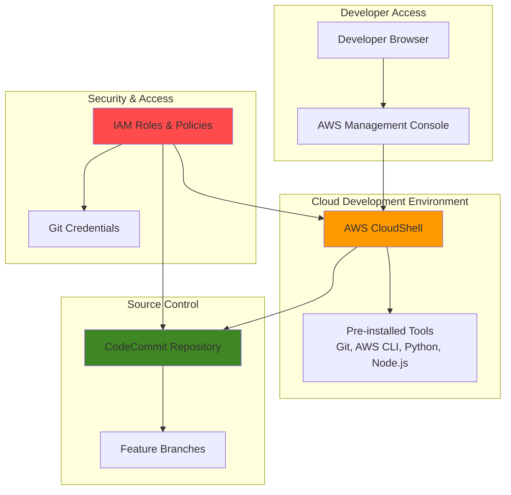

# Cloud Development Workflows with CloudShell

## Problem

Development teams often struggle with setting up consistent development environments across team members, managing local development tools, and ensuring secure access to Git repositories. Traditional approaches require installing and configuring multiple tools on each developer's machine, leading to "it works on my machine" problems and complex onboarding processes that slow down productivity.

## Solution

AWS CloudShell provides a pre-configured, browser-based development environment that eliminates local setup requirements, while CodeCommit offers secure Git repository hosting with integrated IAM authentication. This cloud-native approach ensures consistent development environments, simplified onboarding, and enhanced security through centralized access controls.

## Architecture Diagram



## Prerequisites

1. AWS account with appropriate permissions for CloudShell, CodeCommit, and IAM
2. IAM user with `AWSCloudShellFullAccess` and `AWSCodeCommitFullAccess` managed policies
3. Basic understanding of Git version control concepts
4. Familiarity with command line interface operations
5. Estimated cost: $0-5 per month (CloudShell free tier: 10 hours/month, CodeCommit free tier: 5 users)

> **Note**: AWS CodeCommit is no longer available to new customers as of July 25, 2024. Existing customers can continue using the service. Consider alternatives like GitHub, GitLab, or AWS CodeStar Connections for new implementations.

## Preparation

```bash
# Set environment variables
export AWS_REGION=$(aws configure get region)
export AWS_ACCOUNT_ID=$(aws sts get-caller-identity \
    --query Account --output text)

# Generate unique identifiers for resources
RANDOM_SUFFIX=$(aws secretsmanager get-random-password \
    --exclude-punctuation --exclude-uppercase \
    --password-length 6 --require-each-included-type \
    --output text --query RandomPassword)

# Set repository name
export REPO_NAME="dev-workflow-demo-${RANDOM_SUFFIX}"

echo "✅ AWS environment configured for region: ${AWS_REGION}"
echo "✅ Repository name: ${REPO_NAME}"
```

## Steps

1. **Launch AWS CloudShell Environment**:

   AWS CloudShell provides a browser-based shell environment that comes pre-authenticated with your console credentials and includes common development tools. This eliminates the need to install or configure software on your local machine while providing a consistent development experience across team members.

   ```bash
   # Access CloudShell from AWS Management Console
   # 1. Sign in to AWS Management Console
   # 2. Click the CloudShell icon in the top navigation bar
   # 3. Wait for the environment to initialize (30-60 seconds)
   
   # Verify CloudShell environment
   aws sts get-caller-identity
   git --version
   python3 --version
   node --version
   
   echo "✅ CloudShell environment ready with pre-installed tools"
   ```

   Your CloudShell environment is now active with a persistent 1GB home directory that persists across sessions. The environment includes AWS CLI, Git, Python, Node.js, and many other development tools pre-configured and ready to use.

2. **Create CodeCommit Repository**:

   CodeCommit provides secure Git repository hosting that integrates seamlessly with IAM for authentication and access control. Creating a repository establishes the central source code storage that supports standard Git workflows while maintaining enterprise-grade security.

   ```bash
   # Create CodeCommit repository
   aws codecommit create-repository \
       --repository-name ${REPO_NAME} \
       --repository-description "Demo repository for cloud-based development workflow"
   
   # Get repository clone URL
   export REPO_URL=$(aws codecommit get-repository \
       --repository-name ${REPO_NAME} \
       --query 'repositoryMetadata.cloneUrlHttp' \
       --output text)
   
   echo "✅ CodeCommit repository created: ${REPO_NAME}"
   echo "Repository URL: ${REPO_URL}"
   ```

   The CodeCommit repository is now available with HTTPS access configured. The repository supports all standard Git operations and integrates with IAM for secure, credential-based authentication without requiring separate Git credentials.

3. **Configure Git Credentials for CodeCommit**:

   IAM-based Git credentials provide secure access to CodeCommit repositories without exposing long-term access keys. This approach follows security best practices by using temporary credentials that integrate with your existing IAM policies and can be easily rotated or revoked.

   ```bash
   # Configure Git with IAM user information
   git config --global user.name "CloudShell Developer"
   git config --global user.email "developer@example.com"
   
   # Configure Git to use AWS credential helper for CodeCommit
   git config --global credential.helper '!aws codecommit credential-helper $@'
   git config --global credential.UseHttpPath true
   
   echo "✅ Git configured with AWS CodeCommit credential helper"
   ```

   Git is now configured to automatically use your IAM credentials when accessing CodeCommit repositories. This eliminates the need to manage separate Git credentials while maintaining secure access through IAM policies.

4. **Create and Initialize Local Repository**:

   Creating a local repository in CloudShell establishes your development workspace where you can write code, make commits, and manage branches. The persistent storage ensures your work remains available across CloudShell sessions.

   ```bash
   # Create project directory
   mkdir -p ~/projects/${REPO_NAME}
   cd ~/projects/${REPO_NAME}
   
   # Initialize Git repository
   git init
   
   # Create initial project structure
   mkdir -p src docs tests
   
   # Create README file
   cat > README.md << 'EOF'
# Cloud-Based Development Workflow Demo

This project demonstrates cloud-based development workflows using AWS CloudShell and CodeCommit.

## Features
- Browser-based development environment
- Integrated Git version control
- Pre-configured development tools
- Secure IAM-based authentication

## Getting Started
1. Access AWS CloudShell from the console
2. Clone this repository
3. Start developing!
EOF
   
   echo "✅ Local repository initialized with project structure"
   ```

   Your local development workspace is now ready with a proper project structure. The repository includes documentation and follows standard project organization patterns that support scalable development workflows.

5. **Create Sample Application Code**:

   Creating sample application code demonstrates the development workflow and provides a foundation for team collaboration. This step shows how developers can write, test, and version control their code entirely within the cloud environment.

   ```bash
   # Create a simple Python application
   cat > src/hello_world.py << 'EOF'
#!/usr/bin/env python3
"""
Simple Hello World application for demonstrating cloud-based development workflows.
"""

import sys
from datetime import datetime

def hello_world(name="World"):
    """Return a greeting message with timestamp."""
    timestamp = datetime.now().strftime("%Y-%m-%d %H:%M:%S")
    return f"Hello, {name}! Current time: {timestamp}"

def main():
    """Main function to run the application."""
    if len(sys.argv) > 1:
        name = sys.argv[1]
    else:
        name = "World"
    
    message = hello_world(name)
    print(message)
    return 0

if __name__ == "__main__":
    sys.exit(main())
EOF
   
   # Make the script executable
   chmod +x src/hello_world.py
   
   # Create a simple test
   cat > tests/test_hello_world.py << 'EOF'
#!/usr/bin/env python3
"""
Tests for the hello_world module.
"""

import sys
import os
sys.path.insert(0, os.path.join(os.path.dirname(__file__), '..', 'src'))

from hello_world import hello_world

def test_hello_world_default():
    """Test hello_world with default parameter."""
    result = hello_world()
    assert "Hello, World!" in result
    assert "Current time:" in result

def test_hello_world_custom_name():
    """Test hello_world with custom name."""
    result = hello_world("Developer")
    assert "Hello, Developer!" in result
    assert "Current time:" in result

if __name__ == "__main__":
    test_hello_world_default()
    test_hello_world_custom_name()
    print("✅ All tests passed!")
EOF
   
   # Test the application
   python3 src/hello_world.py "CloudShell Developer"
   python3 tests/test_hello_world.py
   
   echo "✅ Sample application created and tested"
   ```

   The sample application demonstrates a complete development workflow with source code, tests, and documentation. This provides a foundation for collaborative development and shows how cloud-based environments support full application development lifecycles.

6. **Commit and Push Initial Code**:

   Committing and pushing code establishes the initial version in your CodeCommit repository, making it available for team collaboration. This step demonstrates the standard Git workflow adapted for cloud-based development environments.

   ```bash
   # Add files to Git
   git add .
   
   # Create initial commit
   git commit -m "Initial commit: Add hello world application with tests

- Add Python hello world application with timestamp
- Include comprehensive test suite
- Add project documentation and structure
- Configure for cloud-based development workflow"
   
   # Add remote origin
   git remote add origin ${REPO_URL}
   
   # Push to CodeCommit
   git push -u origin main
   
   echo "✅ Initial code committed and pushed to CodeCommit"
   ```

   Your code is now version controlled and stored in CodeCommit, making it accessible to team members and providing a backup of your development work. The repository supports branching, merging, and all standard Git collaboration features.

7. **Create and Work with Feature Branches**:

   Feature branches enable parallel development and code review workflows essential for team collaboration. This approach allows developers to work on features independently while maintaining a stable main branch for production deployments.

   ```bash
   # Create and switch to feature branch
   git checkout -b feature/add-configuration
   
   # Create configuration file
   cat > src/config.py << 'EOF'
"""
Configuration settings for the hello world application.
"""

import os

# Application configuration
APP_NAME = os.getenv("APP_NAME", "Hello World App")
APP_VERSION = "1.0.0"
DEBUG_MODE = os.getenv("DEBUG", "false").lower() == "true"

# Message configuration
DEFAULT_NAME = os.getenv("DEFAULT_NAME", "World")
TIME_FORMAT = os.getenv("TIME_FORMAT", "%Y-%m-%d %H:%M:%S")

def get_config():
    """Return application configuration dictionary."""
    return {
        "app_name": APP_NAME,
        "app_version": APP_VERSION,
        "debug_mode": DEBUG_MODE,
        "default_name": DEFAULT_NAME,
        "time_format": TIME_FORMAT,
    }
EOF
   
   # Update hello_world.py to use configuration
   cat > src/hello_world.py << 'EOF'
#!/usr/bin/env python3
"""
Configurable Hello World application for demonstrating cloud-based development workflows.
"""

import sys
from datetime import datetime
from config import get_config

def hello_world(name=None):
    """Return a greeting message with timestamp."""
    config = get_config()
    if name is None:
        name = config["default_name"]
    
    timestamp = datetime.now().strftime(config["time_format"])
    return f"Hello, {name}! Current time: {timestamp}"

def main():
    """Main function to run the application."""
    config = get_config()
    
    if config["debug_mode"]:
        print(f"Debug: Running {config['app_name']} v{config['app_version']}")
    
    if len(sys.argv) > 1:
        name = sys.argv[1]
    else:
        name = None
    
    message = hello_world(name)
    print(message)
    return 0

if __name__ == "__main__":
    sys.exit(main())
EOF
   
   # Test the updated application
   python3 src/hello_world.py "CloudShell Developer"
   
   # Commit feature changes
   git add .
   git commit -m "Add configuration system

- Add config.py for centralized configuration management
- Update hello_world.py to use configuration
- Support environment variables for customization
- Add debug mode and configurable time format"
   
   # Push feature branch
   git push -u origin feature/add-configuration
   
   echo "✅ Feature branch created and pushed"
   ```

   The feature branch demonstrates how teams can work on enhancements independently while maintaining code quality through structured development workflows. This approach supports code review and testing before merging changes to the main branch.

8. **Merge Feature Branch and Clean Up**:

   Merging feature branches consolidates development work and maintains a clean repository history. This step demonstrates the complete development cycle from feature creation through integration with the main codebase.

   ```bash
   # Switch back to main branch
   git checkout main
   
   # Merge feature branch
   git merge feature/add-configuration
   
   # Push updated main branch
   git push origin main
   
   # Delete feature branch (local and remote)
   git branch -d feature/add-configuration
   git push origin --delete feature/add-configuration
   
   # Verify final state
   git log --oneline -n 5
   
   echo "✅ Feature branch merged and cleaned up"
   ```

   The feature has been successfully integrated into the main branch, demonstrating a complete development workflow. The repository now contains enhanced functionality while maintaining a clean branch structure suitable for ongoing development.

## Validation & Testing

1. **Verify Repository Access and Authentication**:

   ```bash
   # Check repository information
   aws codecommit get-repository --repository-name ${REPO_NAME}
   
   # Verify Git configuration
   git config --list | grep -E "(user|credential)"
   
   # Test repository connectivity
   git remote -v
   git ls-remote origin
   ```

   Expected output: Repository details, Git configuration showing AWS credential helper, and successful remote connection.

2. **Test Development Workflow**:

   ```bash
   # Verify application functionality
   cd ~/projects/${REPO_NAME}
   python3 src/hello_world.py
   
   # Test with environment variables
   export DEFAULT_NAME="Cloud Developer"
   export DEBUG=true
   python3 src/hello_world.py
   
   # Verify Git history
   git log --oneline --graph
   ```

   Expected output: Application runs successfully with configuration, debug output appears, and Git history shows clean commit structure.

3. **Test CloudShell Persistence**:

   ```bash
   # Create test file in home directory
   echo "CloudShell persistence test" > ~/test_persistence.txt
   
   # Verify workspace structure
   ls -la ~/projects/${REPO_NAME}
   
   # Check available disk space
   df -h /home/cloudshell-user
   ```

   Expected output: Files persist in home directory, project structure is intact, and sufficient disk space is available.

## Cleanup

1. **Remove CodeCommit Repository**:

   ```bash
   # Delete CodeCommit repository
   aws codecommit delete-repository --repository-name ${REPO_NAME}
   
   echo "✅ CodeCommit repository deleted"
   ```

2. **Clean Up Local Files**:

   ```bash
   # Remove local project directory
   rm -rf ~/projects/${REPO_NAME}
   
   # Remove test files
   rm -f ~/test_persistence.txt
   
   # Reset Git configuration (optional)
   git config --global --unset user.name
   git config --global --unset user.email
   
   echo "✅ Local files cleaned up"
   ```

3. **Clear Environment Variables**:

   ```bash
   # Unset environment variables
   unset AWS_REGION
   unset AWS_ACCOUNT_ID
   unset REPO_NAME
   unset REPO_URL
   unset DEFAULT_NAME
   unset DEBUG
   
   echo "✅ Environment variables cleared"
   ```

## Discussion

Cloud-based development workflows represent a significant shift from traditional local development environments, offering numerous advantages for modern development teams. AWS CloudShell eliminates the complexity of local environment setup by providing a pre-configured, browser-based development environment that includes essential tools like Git, AWS CLI, Python, and Node.js. This approach ensures consistency across team members and reduces the "it works on my machine" problem that often plagues development teams.

The integration between CloudShell and CodeCommit demonstrates how cloud-native development can enhance security and collaboration. IAM-based authentication eliminates the need for separate Git credentials while providing fine-grained access control through policies. This approach aligns with the [AWS Well-Architected Framework's](https://docs.aws.amazon.com/wellarchitected/latest/framework/welcome.html) security pillar by implementing defense in depth and following the principle of least privilege. The persistent storage in CloudShell ensures that development work remains available across sessions while maintaining the flexibility to scale compute resources as needed.

While CodeCommit provides robust Git repository hosting, it's important to note that AWS announced on July 25, 2024 that CodeCommit is no longer available to new customers. Existing customers can continue using the service, but new implementations should consider alternatives like [GitHub](https://github.com/features/actions), [GitLab](https://docs.gitlab.com/ee/ci/), or [AWS CodeStar Connections](https://docs.aws.amazon.com/codestar-connections/latest/userguide/welcome.html) for Git repository hosting. The principles demonstrated in this recipe, however, remain applicable to any Git-based workflow and can be adapted to work with alternative repository hosting solutions.

The development workflow shown here follows DevOps best practices by incorporating version control, feature branching, and automated testing into the development process. This approach supports continuous integration and deployment practices while maintaining code quality through structured development workflows. The browser-based nature of CloudShell also enables development from any device with internet access, supporting remote work and distributed teams.

For additional guidance on implementing cloud-based development workflows, refer to the [AWS CloudShell User Guide](https://docs.aws.amazon.com/cloudshell/latest/userguide/welcome.html) which provides comprehensive information about CloudShell features and capabilities. The [AWS CodeCommit Getting Started Guide](https://docs.aws.amazon.com/codecommit/latest/userguide/getting-started.html) offers detailed instructions for Git workflows, while the [IAM Security Best Practices](https://docs.aws.amazon.com/IAM/latest/UserGuide/best-practices.html) documentation covers security considerations.

> **Tip**: CloudShell environments automatically shut down after periods of inactivity, but your home directory (up to 1GB) persists across sessions. Use this storage for long-term projects while leveraging the environment's auto-scaling capabilities for compute resources.

## Challenge

Extend this cloud-based development workflow by implementing these enhancements:

1. **CI/CD Pipeline Integration**: Set up AWS CodePipeline to automatically build and test code when pushed to CodeCommit, incorporating CodeBuild for compilation and testing stages.

2. **Multi-Environment Deployment**: Create separate development, staging, and production environments using AWS CodeDeploy, implementing infrastructure as code with CloudFormation or CDK.

3. **Code Quality Automation**: Integrate Amazon CodeGuru Reviewer for automated code reviews and security scanning, setting up quality gates that prevent merging of low-quality code.

4. **Team Collaboration Features**: Implement pull request workflows using CodeCommit merge requests, set up branch protection rules, and configure automated notifications using SNS and Lambda.

5. **Advanced Security Controls**: Implement AWS Config rules for compliance monitoring, set up CloudTrail for audit logging, and use AWS Secrets Manager for secure credential management in applications.

## Infrastructure Code

*Infrastructure code will be generated after recipe approval.*