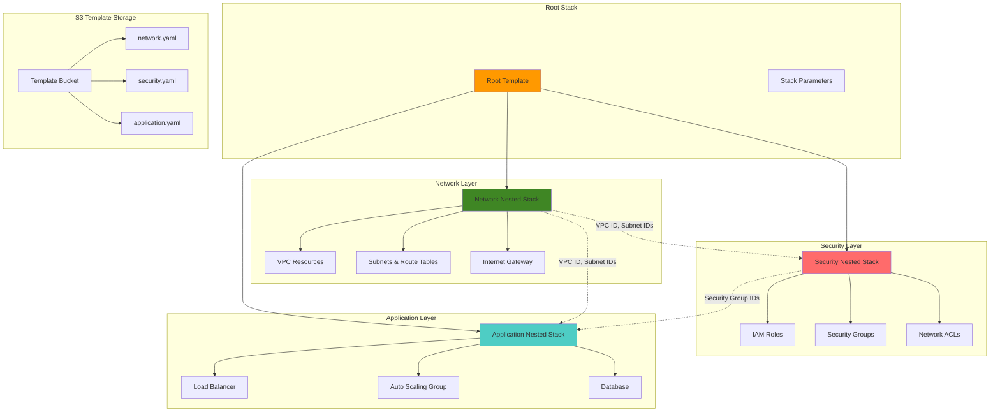

# CloudFormation Nested Stacks Management

## Problem

Enterprise infrastructure teams need to manage complex, interdependent cloud architectures that span multiple logical components like networking, security, compute, and storage. Monolithic CloudFormation templates become unwieldy with hundreds of resources, making them difficult to maintain, debug, and reuse across environments. Teams struggle with template organization, parameter management, and creating reusable infrastructure components that can be shared across projects while maintaining proper dependency management and resource isolation.

## Solution

CloudFormation nested stacks provide a hierarchical approach to infrastructure management by breaking complex deployments into modular, reusable templates. This solution demonstrates how to create a layered architecture using nested stacks with proper cross-stack references, parameter passing, and output sharing. The approach enables teams to build infrastructure libraries with reusable components while maintaining clear separation of concerns and enabling parallel development of different infrastructure layers.

## Architecture Diagram



## Prerequisites

1. AWS account with CloudFormation, S3, IAM, EC2, and RDS permissions
2. AWS CLI v2 installed and configured (or AWS CloudShell)
3. Understanding of CloudFormation template structure and parameters
4. Basic knowledge of VPC networking and security groups
5. Familiarity with infrastructure-as-code principles
6. Estimated cost: $20-40 for testing resources (RDS, EC2, Load Balancer)

> **Note**: This recipe creates multiple AWS resources including RDS instances and load balancers. Ensure you clean up resources after testing to avoid ongoing charges. For detailed cost management strategies, see the [AWS Cost Management Documentation](https://docs.aws.amazon.com/cost-management/).

## Preparation

```bash
# Set environment variables
export AWS_REGION=$(aws configure get region)
export AWS_ACCOUNT_ID=$(aws sts get-caller-identity \
    --query Account --output text)

# Generate unique identifiers for resources
RANDOM_SUFFIX=$(aws secretsmanager get-random-password \
    --exclude-punctuation --exclude-uppercase \
    --password-length 8 --require-each-included-type \
    --output text --query RandomPassword)

export ROOT_STACK_NAME="nested-infrastructure-${RANDOM_SUFFIX}"
export TEMPLATE_BUCKET_NAME="cloudformation-templates-${RANDOM_SUFFIX}"
export ENVIRONMENT="development"
export PROJECT_NAME="webapp"

# Create S3 bucket for storing nested templates
aws s3 mb s3://${TEMPLATE_BUCKET_NAME} --region ${AWS_REGION}

echo "✅ Environment variables set and template bucket created"
echo "Root Stack: ${ROOT_STACK_NAME}"
echo "Template Bucket: ${TEMPLATE_BUCKET_NAME}"
echo "Environment: ${ENVIRONMENT}"
```

## Steps

1. **Create Network Layer Template**:

   The network layer forms the foundation of your nested stack architecture by establishing the virtual private cloud (VPC) and all associated networking components. This layer implements the principle of network isolation, creating separate public and private subnets across multiple availability zones for high availability. The VPC provides a logically isolated section of the AWS cloud where you can launch resources in a virtual network that you define, giving you complete control over your network environment including IP address ranges, subnets, and routing tables. Understanding VPC architecture is crucial for building secure, scalable applications as it enables proper network segmentation between different tiers of your application.

   ```bash
   # Create network infrastructure template
   cat > network-template.yaml << 'EOF'
   AWSTemplateFormatVersion: '2010-09-09'
   Description: 'Network infrastructure layer with VPC, subnets, and routing'
   
   Parameters:
     Environment:
       Type: String
       Default: development
       AllowedValues: [development, staging, production]
       Description: Environment name
     
     ProjectName:
       Type: String
       Description: Project name for resource tagging
     
     VpcCidr:
       Type: String
       Default: '10.0.0.0/16'
       Description: CIDR block for VPC
       AllowedPattern: '^10\.\d{1,3}\.\d{1,3}\.0/16$'
     
     PublicSubnet1Cidr:
       Type: String
       Default: '10.0.1.0/24'
       Description: CIDR block for public subnet 1
     
     PublicSubnet2Cidr:
       Type: String
       Default: '10.0.2.0/24'
       Description: CIDR block for public subnet 2
     
     PrivateSubnet1Cidr:
       Type: String
       Default: '10.0.10.0/24'
       Description: CIDR block for private subnet 1
     
     PrivateSubnet2Cidr:
       Type: String
       Default: '10.0.20.0/24'
       Description: CIDR block for private subnet 2
   
   Resources:
     # VPC
     VPC:
       Type: AWS::EC2::VPC
       Properties:
         CidrBlock: !Ref VpcCidr
         EnableDnsHostnames: true
         EnableDnsSupport: true
         Tags:
           - Key: Name
             Value: !Sub '${ProjectName}-${Environment}-vpc'
           - Key: Environment
             Value: !Ref Environment
           - Key: Project
             Value: !Ref ProjectName
     
     # Internet Gateway
     InternetGateway:
       Type: AWS::EC2::InternetGateway
       Properties:
         Tags:
           - Key: Name
             Value: !Sub '${ProjectName}-${Environment}-igw'
           - Key: Environment
             Value: !Ref Environment
     
     InternetGatewayAttachment:
       Type: AWS::EC2::VPCGatewayAttachment
       Properties:
         InternetGatewayId: !Ref InternetGateway
         VpcId: !Ref VPC
     
     # Public Subnets
     PublicSubnet1:
       Type: AWS::EC2::Subnet
       Properties:
         VpcId: !Ref VPC
         AvailabilityZone: !Select [0, !GetAZs '']
         CidrBlock: !Ref PublicSubnet1Cidr
         MapPublicIpOnLaunch: true
         Tags:
           - Key: Name
             Value: !Sub '${ProjectName}-${Environment}-public-subnet-1'
           - Key: Environment
             Value: !Ref Environment
           - Key: Type
             Value: Public
     
     PublicSubnet2:
       Type: AWS::EC2::Subnet
       Properties:
         VpcId: !Ref VPC
         AvailabilityZone: !Select [1, !GetAZs '']
         CidrBlock: !Ref PublicSubnet2Cidr
         MapPublicIpOnLaunch: true
         Tags:
           - Key: Name
             Value: !Sub '${ProjectName}-${Environment}-public-subnet-2'
           - Key: Environment
             Value: !Ref Environment
           - Key: Type
             Value: Public
     
     # Private Subnets
     PrivateSubnet1:
       Type: AWS::EC2::Subnet
       Properties:
         VpcId: !Ref VPC
         AvailabilityZone: !Select [0, !GetAZs '']
         CidrBlock: !Ref PrivateSubnet1Cidr
         Tags:
           - Key: Name
             Value: !Sub '${ProjectName}-${Environment}-private-subnet-1'
           - Key: Environment
             Value: !Ref Environment
           - Key: Type
             Value: Private
     
     PrivateSubnet2:
       Type: AWS::EC2::Subnet
       Properties:
         VpcId: !Ref VPC
         AvailabilityZone: !Select [1, !GetAZs '']
         CidrBlock: !Ref PrivateSubnet2Cidr
         Tags:
           - Key: Name
             Value: !Sub '${ProjectName}-${Environment}-private-subnet-2'
           - Key: Environment
             Value: !Ref Environment
           - Key: Type
             Value: Private
     
     # NAT Gateways
     NatGateway1EIP:
       Type: AWS::EC2::EIP
       DependsOn: InternetGatewayAttachment
       Properties:
         Domain: vpc
         Tags:
           - Key: Name
             Value: !Sub '${ProjectName}-${Environment}-nat-eip-1'
     
     NatGateway2EIP:
       Type: AWS::EC2::EIP
       DependsOn: InternetGatewayAttachment
       Properties:
         Domain: vpc
         Tags:
           - Key: Name
             Value: !Sub '${ProjectName}-${Environment}-nat-eip-2'
     
     NatGateway1:
       Type: AWS::EC2::NatGateway
       Properties:
         AllocationId: !GetAtt NatGateway1EIP.AllocationId
         SubnetId: !Ref PublicSubnet1
         Tags:
           - Key: Name
             Value: !Sub '${ProjectName}-${Environment}-nat-gateway-1'
     
     NatGateway2:
       Type: AWS::EC2::NatGateway
       Properties:
         AllocationId: !GetAtt NatGateway2EIP.AllocationId
         SubnetId: !Ref PublicSubnet2
         Tags:
           - Key: Name
             Value: !Sub '${ProjectName}-${Environment}-nat-gateway-2'
     
     # Route Tables
     PublicRouteTable:
       Type: AWS::EC2::RouteTable
       Properties:
         VpcId: !Ref VPC
         Tags:
           - Key: Name
             Value: !Sub '${ProjectName}-${Environment}-public-routes'
     
     DefaultPublicRoute:
       Type: AWS::EC2::Route
       DependsOn: InternetGatewayAttachment
       Properties:
         RouteTableId: !Ref PublicRouteTable
         DestinationCidrBlock: 0.0.0.0/0
         GatewayId: !Ref InternetGateway
     
     PublicSubnet1RouteTableAssociation:
       Type: AWS::EC2::SubnetRouteTableAssociation
       Properties:
         RouteTableId: !Ref PublicRouteTable
         SubnetId: !Ref PublicSubnet1
     
     PublicSubnet2RouteTableAssociation:
       Type: AWS::EC2::SubnetRouteTableAssociation
       Properties:
         RouteTableId: !Ref PublicRouteTable
         SubnetId: !Ref PublicSubnet2
     
     PrivateRouteTable1:
       Type: AWS::EC2::RouteTable
       Properties:
         VpcId: !Ref VPC
         Tags:
           - Key: Name
             Value: !Sub '${ProjectName}-${Environment}-private-routes-1'
     
     DefaultPrivateRoute1:
       Type: AWS::EC2::Route
       Properties:
         RouteTableId: !Ref PrivateRouteTable1
         DestinationCidrBlock: 0.0.0.0/0
         NatGatewayId: !Ref NatGateway1
     
     PrivateSubnet1RouteTableAssociation:
       Type: AWS::EC2::SubnetRouteTableAssociation
       Properties:
         RouteTableId: !Ref PrivateRouteTable1
         SubnetId: !Ref PrivateSubnet1
     
     PrivateRouteTable2:
       Type: AWS::EC2::RouteTable
       Properties:
         VpcId: !Ref VPC
         Tags:
           - Key: Name
             Value: !Sub '${ProjectName}-${Environment}-private-routes-2'
     
     DefaultPrivateRoute2:
       Type: AWS::EC2::Route
       Properties:
         RouteTableId: !Ref PrivateRouteTable2
         DestinationCidrBlock: 0.0.0.0/0
         NatGatewayId: !Ref NatGateway2
     
     PrivateSubnet2RouteTableAssociation:
       Type: AWS::EC2::SubnetRouteTableAssociation
       Properties:
         RouteTableId: !Ref PrivateRouteTable2
         SubnetId: !Ref PrivateSubnet2
   
   Outputs:
     VpcId:
       Description: VPC ID
       Value: !Ref VPC
       Export:
         Name: !Sub '${AWS::StackName}-VpcId'
     
     VpcCidr:
       Description: VPC CIDR Block
       Value: !Ref VpcCidr
       Export:
         Name: !Sub '${AWS::StackName}-VpcCidr'
     
     PublicSubnet1Id:
       Description: Public Subnet 1 ID
       Value: !Ref PublicSubnet1
       Export:
         Name: !Sub '${AWS::StackName}-PublicSubnet1Id'
     
     PublicSubnet2Id:
       Description: Public Subnet 2 ID
       Value: !Ref PublicSubnet2
       Export:
         Name: !Sub '${AWS::StackName}-PublicSubnet2Id'
     
     PrivateSubnet1Id:
       Description: Private Subnet 1 ID
       Value: !Ref PrivateSubnet1
       Export:
         Name: !Sub '${AWS::StackName}-PrivateSubnet1Id'
     
     PrivateSubnet2Id:
       Description: Private Subnet 2 ID
       Value: !Ref PrivateSubnet2
       Export:
         Name: !Sub '${AWS::StackName}-PrivateSubnet2Id'
     
     PublicSubnets:
       Description: List of public subnet IDs
       Value: !Join [',', [!Ref PublicSubnet1, !Ref PublicSubnet2]]
       Export:
         Name: !Sub '${AWS::StackName}-PublicSubnets'
     
     PrivateSubnets:
       Description: List of private subnet IDs
       Value: !Join [',', [!Ref PrivateSubnet1, !Ref PrivateSubnet2]]
       Export:
         Name: !Sub '${AWS::StackName}-PrivateSubnets'
   EOF
   
   # Upload network template to S3
   aws s3 cp network-template.yaml s3://${TEMPLATE_BUCKET_NAME}/
   
   echo "✅ Network template created and uploaded to S3"
   ```

   The network template is now stored in S3 and ready for deployment as a nested stack. This template establishes the foundational VPC infrastructure with proper subnet segmentation, [NAT gateways for outbound internet access](https://docs.aws.amazon.com/vpc/latest/userguide/vpc-nat-gateway.html), and routing tables that enable secure communication between application tiers. The outputs from this stack will be consumed by subsequent security and application layers through CloudFormation's cross-stack reference mechanism.

2. **Create Security Layer Template**:

   The security layer implements defense-in-depth principles by creating IAM roles, security groups, and access policies that enforce least privilege access controls. Security groups act as virtual firewalls that control inbound and outbound traffic at the instance level, while IAM roles provide temporary, rotatable credentials for AWS service access without hardcoding secrets. This layer demonstrates [security best practices](https://docs.aws.amazon.com/IAM/latest/UserGuide/best-practices.html) by creating service-specific roles with minimal required permissions, implementing proper network segmentation through security group rules, and establishing secure communication channels between different application components.

   ```bash
   # Create security infrastructure template
   cat > security-template.yaml << 'EOF'
   AWSTemplateFormatVersion: '2010-09-09'
   Description: 'Security layer with IAM roles, security groups, and policies'
   
   Parameters:
     Environment:
       Type: String
       Default: development
       AllowedValues: [development, staging, production]
       Description: Environment name
     
     ProjectName:
       Type: String
       Description: Project name for resource tagging
     
     VpcId:
       Type: String
       Description: VPC ID from network stack
     
     VpcCidr:
       Type: String
       Description: VPC CIDR block for security group rules
   
   Resources:
     # Application Load Balancer Security Group
     ALBSecurityGroup:
       Type: AWS::EC2::SecurityGroup
       Properties:
         GroupName: !Sub '${ProjectName}-${Environment}-alb-sg'
         GroupDescription: Security group for Application Load Balancer
         VpcId: !Ref VpcId
         SecurityGroupIngress:
           - IpProtocol: tcp
             FromPort: 80
             ToPort: 80
             CidrIp: 0.0.0.0/0
             Description: Allow HTTP traffic from internet
           - IpProtocol: tcp
             FromPort: 443
             ToPort: 443
             CidrIp: 0.0.0.0/0
             Description: Allow HTTPS traffic from internet
         Tags:
           - Key: Name
             Value: !Sub '${ProjectName}-${Environment}-alb-sg'
           - Key: Environment
             Value: !Ref Environment
           - Key: Component
             Value: LoadBalancer
     
     # Application Security Group
     ApplicationSecurityGroup:
       Type: AWS::EC2::SecurityGroup
       Properties:
         GroupName: !Sub '${ProjectName}-${Environment}-app-sg'
         GroupDescription: Security group for application instances
         VpcId: !Ref VpcId
         SecurityGroupIngress:
           - IpProtocol: tcp
             FromPort: 80
             ToPort: 80
             SourceSecurityGroupId: !Ref ALBSecurityGroup
             Description: Allow HTTP traffic from ALB
           - IpProtocol: tcp
             FromPort: 22
             ToPort: 22
             SourceSecurityGroupId: !Ref BastionSecurityGroup
             Description: Allow SSH from bastion host
         Tags:
           - Key: Name
             Value: !Sub '${ProjectName}-${Environment}-app-sg'
           - Key: Environment
             Value: !Ref Environment
           - Key: Component
             Value: Application
     
     # Bastion Host Security Group
     BastionSecurityGroup:
       Type: AWS::EC2::SecurityGroup
       Properties:
         GroupName: !Sub '${ProjectName}-${Environment}-bastion-sg'
         GroupDescription: Security group for bastion host
         VpcId: !Ref VpcId
         SecurityGroupIngress:
           - IpProtocol: tcp
             FromPort: 22
             ToPort: 22
             CidrIp: 0.0.0.0/0
             Description: Allow SSH access from internet
         Tags:
           - Key: Name
             Value: !Sub '${ProjectName}-${Environment}-bastion-sg'
           - Key: Environment
             Value: !Ref Environment
           - Key: Component
             Value: Bastion
     
     # Database Security Group
     DatabaseSecurityGroup:
       Type: AWS::EC2::SecurityGroup
       Properties:
         GroupName: !Sub '${ProjectName}-${Environment}-db-sg'
         GroupDescription: Security group for database
         VpcId: !Ref VpcId
         SecurityGroupIngress:
           - IpProtocol: tcp
             FromPort: 3306
             ToPort: 3306
             SourceSecurityGroupId: !Ref ApplicationSecurityGroup
             Description: Allow MySQL access from application
         Tags:
           - Key: Name
             Value: !Sub '${ProjectName}-${Environment}-db-sg'
           - Key: Environment
             Value: !Ref Environment
           - Key: Component
             Value: Database
     
     # IAM Role for EC2 instances
     EC2InstanceRole:
       Type: AWS::IAM::Role
       Properties:
         RoleName: !Sub '${ProjectName}-${Environment}-ec2-role'
         AssumeRolePolicyDocument:
           Version: '2012-10-17'
           Statement:
             - Effect: Allow
               Principal:
                 Service: ec2.amazonaws.com
               Action: sts:AssumeRole
         ManagedPolicyArns:
           - arn:aws:iam::aws:policy/CloudWatchAgentServerPolicy
           - arn:aws:iam::aws:policy/AmazonSSMManagedInstanceCore
         Policies:
           - PolicyName: S3AccessPolicy
             PolicyDocument:
               Version: '2012-10-17'
               Statement:
                 - Effect: Allow
                   Action:
                     - s3:GetObject
                     - s3:PutObject
                   Resource: !Sub 'arn:aws:s3:::${ProjectName}-${Environment}-*/*'
                 - Effect: Allow
                   Action:
                     - s3:ListBucket
                   Resource: !Sub 'arn:aws:s3:::${ProjectName}-${Environment}-*'
         Tags:
           - Key: Environment
             Value: !Ref Environment
           - Key: Component
             Value: Compute
     
     # Instance Profile for EC2 role
     EC2InstanceProfile:
       Type: AWS::IAM::InstanceProfile
       Properties:
         InstanceProfileName: !Sub '${ProjectName}-${Environment}-ec2-profile'
         Roles:
           - !Ref EC2InstanceRole
     
     # IAM Role for RDS Enhanced Monitoring
     RDSEnhancedMonitoringRole:
       Type: AWS::IAM::Role
       Properties:
         RoleName: !Sub '${ProjectName}-${Environment}-rds-monitoring-role'
         AssumeRolePolicyDocument:
           Version: '2012-10-17'
           Statement:
             - Effect: Allow
               Principal:
                 Service: monitoring.rds.amazonaws.com
               Action: sts:AssumeRole
         ManagedPolicyArns:
           - arn:aws:iam::aws:policy/service-role/AmazonRDSEnhancedMonitoringRole
         Tags:
           - Key: Environment
             Value: !Ref Environment
           - Key: Component
             Value: Database
   
   Outputs:
     ALBSecurityGroupId:
       Description: Application Load Balancer Security Group ID
       Value: !Ref ALBSecurityGroup
       Export:
         Name: !Sub '${AWS::StackName}-ALBSecurityGroupId'
     
     ApplicationSecurityGroupId:
       Description: Application Security Group ID
       Value: !Ref ApplicationSecurityGroup
       Export:
         Name: !Sub '${AWS::StackName}-ApplicationSecurityGroupId'
     
     BastionSecurityGroupId:
       Description: Bastion Security Group ID
       Value: !Ref BastionSecurityGroup
       Export:
         Name: !Sub '${AWS::StackName}-BastionSecurityGroupId'
     
     DatabaseSecurityGroupId:
       Description: Database Security Group ID
       Value: !Ref DatabaseSecurityGroup
       Export:
         Name: !Sub '${AWS::StackName}-DatabaseSecurityGroupId'
     
     EC2InstanceRoleArn:
       Description: EC2 Instance Role ARN
       Value: !GetAtt EC2InstanceRole.Arn
       Export:
         Name: !Sub '${AWS::StackName}-EC2InstanceRoleArn'
     
     EC2InstanceProfileArn:
       Description: EC2 Instance Profile ARN
       Value: !GetAtt EC2InstanceProfile.Arn
       Export:
         Name: !Sub '${AWS::StackName}-EC2InstanceProfileArn'
     
     RDSMonitoringRoleArn:
       Description: RDS Enhanced Monitoring Role ARN
       Value: !GetAtt RDSEnhancedMonitoringRole.Arn
       Export:
         Name: !Sub '${AWS::StackName}-RDSMonitoringRoleArn'
   EOF
   
   # Upload security template to S3
   aws s3 cp security-template.yaml s3://${TEMPLATE_BUCKET_NAME}/
   
   echo "✅ Security template created and uploaded to S3"
   ```

   The security template establishes comprehensive access controls that will be referenced by application resources. The [IAM roles for EC2 instances](https://docs.aws.amazon.com/AWSEC2/latest/UserGuide/iam-roles-for-amazon-ec2.html) provide secure, temporary credentials for AWS service access, while security groups implement network-level access controls using the principle of least privilege. These security foundations are essential for maintaining compliance and protecting against common security threats in cloud environments.

3. **Create Application Layer Template**:

   The application layer orchestrates compute resources, load balancing, and database services to create a scalable, highly available application platform. This layer implements auto scaling capabilities through [Auto Scaling Groups](https://docs.aws.amazon.com/autoscaling/ec2/userguide/what-is-amazon-ec2-auto-scaling.html) that automatically adjust capacity based on demand, ensuring optimal performance and cost efficiency. The Application Load Balancer distributes incoming traffic across multiple targets, providing fault tolerance and improved application availability. The RDS database provides managed relational database services with automated backups, monitoring, and high availability features, reducing operational overhead while ensuring data persistence and reliability.

   ```bash
   # Create application infrastructure template
   cat > application-template.yaml << 'EOF'
   AWSTemplateFormatVersion: '2010-09-09'
   Description: 'Application layer with load balancer, auto scaling, and database'
   
   Parameters:
     Environment:
       Type: String
       Default: development
       AllowedValues: [development, staging, production]
       Description: Environment name
     
     ProjectName:
       Type: String
       Description: Project name for resource tagging
     
     VpcId:
       Type: String
       Description: VPC ID from network stack
     
     PublicSubnets:
       Type: CommaDelimitedList
       Description: List of public subnet IDs for load balancer
     
     PrivateSubnets:
       Type: CommaDelimitedList
       Description: List of private subnet IDs for application
     
     ALBSecurityGroupId:
       Type: String
       Description: Security group ID for Application Load Balancer
     
     ApplicationSecurityGroupId:
       Type: String
       Description: Security group ID for application instances
     
     DatabaseSecurityGroupId:
       Type: String
       Description: Security group ID for database
     
     EC2InstanceProfileArn:
       Type: String
       Description: EC2 instance profile ARN
     
     RDSMonitoringRoleArn:
       Type: String
       Description: RDS monitoring role ARN
   
   Mappings:
     EnvironmentConfig:
       development:
         InstanceType: t3.micro
         MinSize: 1
         MaxSize: 2
         DesiredCapacity: 1
         DBInstanceClass: db.t3.micro
         DBAllocatedStorage: 20
       staging:
         InstanceType: t3.small
         MinSize: 2
         MaxSize: 4
         DesiredCapacity: 2
         DBInstanceClass: db.t3.small
         DBAllocatedStorage: 50
       production:
         InstanceType: t3.medium
         MinSize: 2
         MaxSize: 6
         DesiredCapacity: 3
         DBInstanceClass: db.t3.medium
         DBAllocatedStorage: 100
   
   Resources:
     # Application Load Balancer
     ApplicationLoadBalancer:
       Type: AWS::ElasticLoadBalancingV2::LoadBalancer
       Properties:
         Name: !Sub '${ProjectName}-${Environment}-alb'
         Scheme: internet-facing
         Type: application
         Subnets: !Ref PublicSubnets
         SecurityGroups:
           - !Ref ALBSecurityGroupId
         Tags:
           - Key: Name
             Value: !Sub '${ProjectName}-${Environment}-alb'
           - Key: Environment
             Value: !Ref Environment
           - Key: Component
             Value: LoadBalancer
     
     # Target Group
     ApplicationTargetGroup:
       Type: AWS::ElasticLoadBalancingV2::TargetGroup
       Properties:
         Name: !Sub '${ProjectName}-${Environment}-tg'
         Port: 80
         Protocol: HTTP
         VpcId: !Ref VpcId
         HealthCheckPath: /health
         HealthCheckProtocol: HTTP
         HealthCheckIntervalSeconds: 30
         HealthCheckTimeoutSeconds: 5
         HealthyThresholdCount: 2
         UnhealthyThresholdCount: 3
         TargetGroupAttributes:
           - Key: deregistration_delay.timeout_seconds
             Value: '300'
         Tags:
           - Key: Name
             Value: !Sub '${ProjectName}-${Environment}-tg'
           - Key: Environment
             Value: !Ref Environment
     
     # Load Balancer Listener
     ApplicationListener:
       Type: AWS::ElasticLoadBalancingV2::Listener
       Properties:
         DefaultActions:
           - Type: forward
             TargetGroupArn: !Ref ApplicationTargetGroup
         LoadBalancerArn: !Ref ApplicationLoadBalancer
         Port: 80
         Protocol: HTTP
     
     # Launch Template
     ApplicationLaunchTemplate:
       Type: AWS::EC2::LaunchTemplate
       Properties:
         LaunchTemplateName: !Sub '${ProjectName}-${Environment}-template'
         LaunchTemplateData:
           ImageId: !Sub '{{resolve:ssm:/aws/service/ami-amazon-linux-latest/amzn2-ami-hvm-x86_64-gp2}}'
           InstanceType: !FindInMap [EnvironmentConfig, !Ref Environment, InstanceType]
           IamInstanceProfile:
             Arn: !Ref EC2InstanceProfileArn
           SecurityGroupIds:
             - !Ref ApplicationSecurityGroupId
           UserData:
             Fn::Base64: !Sub |
               #!/bin/bash
               yum update -y
               yum install -y httpd
               systemctl start httpd
               systemctl enable httpd
               
               # Create simple health check endpoint
               echo '<html><body><h1>Application Running</h1><p>Environment: ${Environment}</p></body></html>' > /var/www/html/index.html
               echo 'OK' > /var/www/html/health
               
               # Install CloudWatch agent
               yum install -y amazon-cloudwatch-agent
               
               # Configure CloudWatch agent
               cat > /opt/aws/amazon-cloudwatch-agent/etc/amazon-cloudwatch-agent.json << 'CWCONFIG'
               {
                 "logs": {
                   "logs_collected": {
                     "files": {
                       "collect_list": [
                         {
                           "file_path": "/var/log/httpd/access_log",
                           "log_group_name": "/aws/ec2/${ProjectName}-${Environment}/httpd/access",
                           "log_stream_name": "{instance_id}"
                         }
                       ]
                     }
                   }
                 }
               }
               CWCONFIG
               
               # Start CloudWatch agent
               /opt/aws/amazon-cloudwatch-agent/bin/amazon-cloudwatch-agent-ctl \
                 -a fetch-config -m ec2 -c file:/opt/aws/amazon-cloudwatch-agent/etc/amazon-cloudwatch-agent.json -s
           TagSpecifications:
             - ResourceType: instance
               Tags:
                 - Key: Name
                   Value: !Sub '${ProjectName}-${Environment}-instance'
                 - Key: Environment
                   Value: !Ref Environment
                 - Key: Component
                   Value: Application
     
     # Auto Scaling Group
     ApplicationAutoScalingGroup:
       Type: AWS::AutoScaling::AutoScalingGroup
       Properties:
         AutoScalingGroupName: !Sub '${ProjectName}-${Environment}-asg'
         VPCZoneIdentifier: !Ref PrivateSubnets
         LaunchTemplate:
           LaunchTemplateId: !Ref ApplicationLaunchTemplate
           Version: !GetAtt ApplicationLaunchTemplate.LatestVersionNumber
         MinSize: !FindInMap [EnvironmentConfig, !Ref Environment, MinSize]
         MaxSize: !FindInMap [EnvironmentConfig, !Ref Environment, MaxSize]
         DesiredCapacity: !FindInMap [EnvironmentConfig, !Ref Environment, DesiredCapacity]
         TargetGroupARNs:
           - !Ref ApplicationTargetGroup
         HealthCheckType: ELB
         HealthCheckGracePeriod: 300
         Tags:
           - Key: Name
             Value: !Sub '${ProjectName}-${Environment}-asg'
             PropagateAtLaunch: false
           - Key: Environment
             Value: !Ref Environment
             PropagateAtLaunch: true
           - Key: Component
             Value: Application
             PropagateAtLaunch: true
     
     # Database Subnet Group
     DatabaseSubnetGroup:
       Type: AWS::RDS::DBSubnetGroup
       Properties:
         DBSubnetGroupName: !Sub '${ProjectName}-${Environment}-db-subnet-group'
         DBSubnetGroupDescription: Subnet group for RDS database
         SubnetIds: !Ref PrivateSubnets
         Tags:
           - Key: Name
             Value: !Sub '${ProjectName}-${Environment}-db-subnet-group'
           - Key: Environment
             Value: !Ref Environment
     
     # RDS Database Instance
     DatabaseInstance:
       Type: AWS::RDS::DBInstance
       DeletionPolicy: Delete
       Properties:
         DBInstanceIdentifier: !Sub '${ProjectName}-${Environment}-db'
         DBInstanceClass: !FindInMap [EnvironmentConfig, !Ref Environment, DBInstanceClass]
         Engine: mysql
         EngineVersion: '8.0.35'
         MasterUsername: admin
         MasterUserPassword: !Sub '{{resolve:secretsmanager:${DatabaseSecret}:SecretString:password}}'
         AllocatedStorage: !FindInMap [EnvironmentConfig, !Ref Environment, DBAllocatedStorage]
         StorageType: gp2
         StorageEncrypted: true
         VPCSecurityGroups:
           - !Ref DatabaseSecurityGroupId
         DBSubnetGroupName: !Ref DatabaseSubnetGroup
         BackupRetentionPeriod: 7
         MultiAZ: !If [IsProduction, true, false]
         MonitoringInterval: 60
         MonitoringRoleArn: !Ref RDSMonitoringRoleArn
         EnablePerformanceInsights: true
         DeletionProtection: !If [IsProduction, true, false]
         Tags:
           - Key: Name
             Value: !Sub '${ProjectName}-${Environment}-db'
           - Key: Environment
             Value: !Ref Environment
           - Key: Component
             Value: Database
     
     # Database Secret
     DatabaseSecret:
       Type: AWS::SecretsManager::Secret
       Properties:
         Name: !Sub '${ProjectName}-${Environment}-db-secret'
         Description: Database credentials
         GenerateSecretString:
           SecretStringTemplate: '{"username": "admin"}'
           GenerateStringKey: 'password'
           PasswordLength: 16
           ExcludeCharacters: '"@/\'
         Tags:
           - Key: Environment
             Value: !Ref Environment
           - Key: Component
             Value: Database
   
   Conditions:
     IsProduction: !Equals [!Ref Environment, production]
   
   Outputs:
     LoadBalancerDNS:
       Description: Application Load Balancer DNS name
       Value: !GetAtt ApplicationLoadBalancer.DNSName
       Export:
         Name: !Sub '${AWS::StackName}-LoadBalancerDNS'
     
     LoadBalancerArn:
       Description: Application Load Balancer ARN
       Value: !Ref ApplicationLoadBalancer
       Export:
         Name: !Sub '${AWS::StackName}-LoadBalancerArn'
     
     AutoScalingGroupName:
       Description: Auto Scaling Group name
       Value: !Ref ApplicationAutoScalingGroup
       Export:
         Name: !Sub '${AWS::StackName}-AutoScalingGroupName'
     
     DatabaseEndpoint:
       Description: RDS database endpoint
       Value: !GetAtt DatabaseInstance.Endpoint.Address
       Export:
         Name: !Sub '${AWS::StackName}-DatabaseEndpoint'
     
     DatabasePort:
       Description: RDS database port
       Value: !GetAtt DatabaseInstance.Endpoint.Port
       Export:
         Name: !Sub '${AWS::StackName}-DatabasePort'
     
     DatabaseSecretArn:
       Description: Database secret ARN
       Value: !Ref DatabaseSecret
       Export:
         Name: !Sub '${AWS::StackName}-DatabaseSecretArn'
   EOF
   
   # Upload application template to S3
   aws s3 cp application-template.yaml s3://${TEMPLATE_BUCKET_NAME}/
   
   echo "✅ Application template created and uploaded to S3"
   ```

   The application template creates a complete three-tier architecture with presentation (load balancer), application (EC2 instances), and data (RDS database) tiers. The [target group configuration](https://docs.aws.amazon.com/elasticloadbalancing/latest/application/load-balancer-target-groups.html) enables health checks and automated failover, while the launch template provides consistent instance configuration across the auto scaling group. This architecture pattern ensures high availability, scalability, and maintainability for production workloads.

4. **Create Root Stack Template**:

   The root stack serves as the orchestration layer that manages the deployment and dependencies of all nested stacks. This template demonstrates [nested stack best practices](https://docs.aws.amazon.com/AWSCloudFormation/latest/UserGuide/using-cfn-nested-stacks.html) by defining explicit dependencies between layers, passing parameters between stacks, and collecting outputs from child stacks. The root stack enables atomic deployments where all infrastructure components are created, updated, or deleted as a single unit, ensuring consistency and reducing deployment complexity. The hierarchical structure allows teams to work independently on different infrastructure layers while maintaining proper integration points through well-defined interfaces.

   ```bash
   # Create the root stack template that orchestrates nested stacks
   cat > root-stack-template.yaml << EOF
   AWSTemplateFormatVersion: '2010-09-09'
   Description: 'Root stack for nested infrastructure deployment'
   
   Parameters:
     Environment:
       Type: String
       Default: development
       AllowedValues: [development, staging, production]
       Description: Environment name
     
     ProjectName:
       Type: String
       Default: webapp
       Description: Project name for resource tagging
     
     TemplateBucketName:
       Type: String
       Description: S3 bucket containing nested stack templates
     
     VpcCidr:
       Type: String
       Default: '10.0.0.0/16'
       Description: CIDR block for VPC
       AllowedPattern: '^10\.\d{1,3}\.\d{1,3}\.0/16$'
   
   Resources:
     # Network Infrastructure Stack
     NetworkStack:
       Type: AWS::CloudFormation::Stack
       Properties:
         TemplateURL: !Sub 'https://\${TemplateBucketName}.s3.\${AWS::Region}.amazonaws.com/network-template.yaml'
         Parameters:
           Environment: !Ref Environment
           ProjectName: !Ref ProjectName
           VpcCidr: !Ref VpcCidr
           PublicSubnet1Cidr: !Select [0, !Cidr [!Ref VpcCidr, 4, 8]]
           PublicSubnet2Cidr: !Select [1, !Cidr [!Ref VpcCidr, 4, 8]]
           PrivateSubnet1Cidr: !Select [2, !Cidr [!Ref VpcCidr, 4, 8]]
           PrivateSubnet2Cidr: !Select [3, !Cidr [!Ref VpcCidr, 4, 8]]
         Tags:
           - Key: Environment
             Value: !Ref Environment
           - Key: Component
             Value: Network
           - Key: StackType
             Value: Nested
     
     # Security Infrastructure Stack
     SecurityStack:
       Type: AWS::CloudFormation::Stack
       DependsOn: NetworkStack
       Properties:
         TemplateURL: !Sub 'https://\${TemplateBucketName}.s3.\${AWS::Region}.amazonaws.com/security-template.yaml'
         Parameters:
           Environment: !Ref Environment
           ProjectName: !Ref ProjectName
           VpcId: !GetAtt NetworkStack.Outputs.VpcId
           VpcCidr: !GetAtt NetworkStack.Outputs.VpcCidr
         Tags:
           - Key: Environment
             Value: !Ref Environment
           - Key: Component
             Value: Security
           - Key: StackType
             Value: Nested
     
     # Application Infrastructure Stack
     ApplicationStack:
       Type: AWS::CloudFormation::Stack
       DependsOn: [NetworkStack, SecurityStack]
       Properties:
         TemplateURL: !Sub 'https://\${TemplateBucketName}.s3.\${AWS::Region}.amazonaws.com/application-template.yaml'
         Parameters:
           Environment: !Ref Environment
           ProjectName: !Ref ProjectName
           VpcId: !GetAtt NetworkStack.Outputs.VpcId
           PublicSubnets: !GetAtt NetworkStack.Outputs.PublicSubnets
           PrivateSubnets: !GetAtt NetworkStack.Outputs.PrivateSubnets
           ALBSecurityGroupId: !GetAtt SecurityStack.Outputs.ALBSecurityGroupId
           ApplicationSecurityGroupId: !GetAtt SecurityStack.Outputs.ApplicationSecurityGroupId
           DatabaseSecurityGroupId: !GetAtt SecurityStack.Outputs.DatabaseSecurityGroupId
           EC2InstanceProfileArn: !GetAtt SecurityStack.Outputs.EC2InstanceProfileArn
           RDSMonitoringRoleArn: !GetAtt SecurityStack.Outputs.RDSMonitoringRoleArn
         Tags:
           - Key: Environment
             Value: !Ref Environment
           - Key: Component
             Value: Application
           - Key: StackType
             Value: Nested
   
   Outputs:
     NetworkStackId:
       Description: Network stack ID
       Value: !Ref NetworkStack
       Export:
         Name: !Sub '\${AWS::StackName}-NetworkStackId'
     
     SecurityStackId:
       Description: Security stack ID
       Value: !Ref SecurityStack
       Export:
         Name: !Sub '\${AWS::StackName}-SecurityStackId'
     
     ApplicationStackId:
       Description: Application stack ID
       Value: !Ref ApplicationStack
       Export:
         Name: !Sub '\${AWS::StackName}-ApplicationStackId'
     
     VpcId:
       Description: VPC ID
       Value: !GetAtt NetworkStack.Outputs.VpcId
       Export:
         Name: !Sub '\${AWS::StackName}-VpcId'
     
     ApplicationURL:
       Description: Application URL
       Value: !Sub 'http://\${ApplicationStack.Outputs.LoadBalancerDNS}'
       Export:
         Name: !Sub '\${AWS::StackName}-ApplicationURL'
     
     DatabaseEndpoint:
       Description: Database endpoint
       Value: !GetAtt ApplicationStack.Outputs.DatabaseEndpoint
       Export:
         Name: !Sub '\${AWS::StackName}-DatabaseEndpoint'
   EOF
   
   echo "✅ Root stack template created"
   ```

   The root stack template establishes the deployment orchestration that ensures proper dependency management and parameter passing between nested stacks. This approach enables infrastructure teams to maintain separation of concerns while ensuring that all components integrate correctly. The explicit dependency declarations (DependsOn) ensure that resources are created in the correct order, preventing race conditions and deployment failures.

5. **Deploy the Nested Stack Infrastructure**:

   Deploying the root stack initiates a hierarchical deployment process where CloudFormation creates the nested stacks in dependency order. The CAPABILITY_NAMED_IAM capability is required because the templates create IAM roles and policies, ensuring that CloudFormation has explicit permission to create these security-sensitive resources. This deployment process demonstrates infrastructure as code principles by creating reproducible, version-controlled infrastructure that can be deployed consistently across environments. The wait commands ensure that the deployment completes successfully before proceeding to validation steps, providing feedback on the deployment status and enabling proper error handling.

   ```bash
   # Deploy the root stack
   aws cloudformation create-stack \
       --stack-name ${ROOT_STACK_NAME} \
       --template-body file://root-stack-template.yaml \
       --parameters ParameterKey=Environment,ParameterValue=${ENVIRONMENT} \
                   ParameterKey=ProjectName,ParameterValue=${PROJECT_NAME} \
                   ParameterKey=TemplateBucketName,ParameterValue=${TEMPLATE_BUCKET_NAME} \
       --capabilities CAPABILITY_NAMED_IAM
   
   # Wait for stack creation to complete
   echo "⏳ Waiting for root stack creation to complete..."
   aws cloudformation wait stack-create-complete \
       --stack-name ${ROOT_STACK_NAME}
   
   # Check stack status
   STACK_STATUS=$(aws cloudformation describe-stacks \
       --stack-name ${ROOT_STACK_NAME} \
       --query 'Stacks[0].StackStatus' --output text)
   
   echo "✅ Root stack created successfully: ${STACK_STATUS}"
   ```

   The successful deployment creates a complete multi-tier infrastructure with proper networking, security, and application components. CloudFormation's nested stack management ensures that all resources are created in the correct order with proper dependency handling, while the stack status confirmation provides visibility into the deployment outcome. This deployment approach enables teams to manage complex infrastructure as a single, atomic unit while maintaining modularity and reusability.

6. **Verify Cross-Stack References and Dependencies**:

   Cross-stack references enable loose coupling between nested stacks while maintaining data consistency through [CloudFormation exports](https://docs.aws.amazon.com/AWSCloudFormation/latest/UserGuide/outputs-section-structure.html). The export mechanism allows one stack to make values available to other stacks in the same region, creating a publish-subscribe pattern for infrastructure dependencies. This verification step ensures that the parameter passing and output sharing between nested stacks is working correctly, confirming that the network layer outputs are properly consumed by security and application layers. Understanding these dependencies is crucial for maintaining stack integrity and troubleshooting deployment issues.

   ```bash
   # List all stack outputs and their exports
   echo "📋 Root Stack Outputs:"
   aws cloudformation describe-stacks \
       --stack-name ${ROOT_STACK_NAME} \
       --query 'Stacks[0].Outputs[].{OutputKey:OutputKey,OutputValue:OutputValue,ExportName:ExportName}' \
       --output table
   
   # Check nested stack details
   NETWORK_STACK_ID=$(aws cloudformation describe-stacks \
       --stack-name ${ROOT_STACK_NAME} \
       --query 'Stacks[0].Outputs[?OutputKey==`NetworkStackId`].OutputValue' \
       --output text)
   
   SECURITY_STACK_ID=$(aws cloudformation describe-stacks \
       --stack-name ${ROOT_STACK_NAME} \
       --query 'Stacks[0].Outputs[?OutputKey==`SecurityStackId`].OutputValue' \
       --output text)
   
   APPLICATION_STACK_ID=$(aws cloudformation describe-stacks \
       --stack-name ${ROOT_STACK_NAME} \
       --query 'Stacks[0].Outputs[?OutputKey==`ApplicationStackId`].OutputValue' \
       --output text)
   
   echo "📋 Network Stack Outputs:"
   aws cloudformation describe-stacks \
       --stack-name ${NETWORK_STACK_ID} \
       --query 'Stacks[0].Outputs[].{OutputKey:OutputKey,ExportName:ExportName}' \
       --output table
   
   echo "📋 Security Stack Outputs:"
   aws cloudformation describe-stacks \
       --stack-name ${SECURITY_STACK_ID} \
       --query 'Stacks[0].Outputs[].{OutputKey:OutputKey,ExportName:ExportName}' \
       --output table
   
   echo "✅ Cross-stack references verified"
   ```

   The verification confirms that the cross-stack reference mechanism is functioning correctly, enabling proper data flow between nested stacks. The export names follow a consistent naming convention that prevents conflicts while providing clear identification of resource origins. This validation step is essential for ensuring that stack dependencies are properly established and that subsequent operations will have access to required resource identifiers.

7. **Test Stack Update with Parameter Changes**:

   Stack updates demonstrate the power of infrastructure as code by enabling controlled modifications to existing resources without manual intervention. CloudFormation's update mechanism analyzes the differences between current and desired states, creating a change set that shows exactly what will be modified, added, or removed. This capability enables teams to evolve infrastructure safely while maintaining configuration consistency across environments. The update process follows the same dependency ordering as initial deployment, ensuring that changes cascade properly through the nested stack hierarchy. Understanding update behavior is crucial for maintaining infrastructure reliability and minimizing service disruptions during changes.

   ```bash
   # Update the root stack with different environment configuration
   aws cloudformation update-stack \
       --stack-name ${ROOT_STACK_NAME} \
       --template-body file://root-stack-template.yaml \
       --parameters ParameterKey=Environment,ParameterValue=staging \
                   ParameterKey=ProjectName,ParameterValue=${PROJECT_NAME} \
                   ParameterKey=TemplateBucketName,ParameterValue=${TEMPLATE_BUCKET_NAME} \
       --capabilities CAPABILITY_NAMED_IAM
   
   # Wait for update to complete
   echo "⏳ Waiting for stack update to complete..."
   aws cloudformation wait stack-update-complete \
       --stack-name ${ROOT_STACK_NAME}
   
   echo "✅ Stack updated successfully to staging environment"
   ```

   The successful update demonstrates how nested stacks handle parameter changes across multiple layers. CloudFormation's update process analyzes dependencies and applies changes in the correct order, ensuring that network modifications propagate to security and application layers as needed. This capability enables teams to maintain consistent infrastructure configurations while adapting to changing requirements and evolving security policies.

8. **Create Change Sets for Safe Updates**:

   [Change sets](https://docs.aws.amazon.com/AWSCloudFormation/latest/UserGuide/using-cfn-updating-stacks-changesets.html) provide a preview mechanism that shows exactly what changes will be made before execution, enabling safe infrastructure updates through a review and approval process. This feature is essential for production environments where infrastructure changes require validation and approval workflows. Change sets help prevent unintended consequences by allowing teams to understand the impact of changes before applying them, reducing the risk of service disruptions or security vulnerabilities. The change set mechanism supports GitOps workflows where infrastructure changes are treated with the same rigor as application code changes.

   ```bash
   # Create a change set to preview changes
   CHANGE_SET_NAME="update-to-production-${RANDOM_SUFFIX}"
   
   aws cloudformation create-change-set \
       --stack-name ${ROOT_STACK_NAME} \
       --change-set-name ${CHANGE_SET_NAME} \
       --template-body file://root-stack-template.yaml \
       --parameters ParameterKey=Environment,ParameterValue=production \
                   ParameterKey=ProjectName,ParameterValue=${PROJECT_NAME} \
                   ParameterKey=TemplateBucketName,ParameterValue=${TEMPLATE_BUCKET_NAME} \
       --capabilities CAPABILITY_NAMED_IAM
   
   # Wait for change set creation
   aws cloudformation wait change-set-create-complete \
       --stack-name ${ROOT_STACK_NAME} \
       --change-set-name ${CHANGE_SET_NAME}
   
   # Review the change set
   echo "📋 Change Set Details:"
   aws cloudformation describe-change-set \
       --stack-name ${ROOT_STACK_NAME} \
       --change-set-name ${CHANGE_SET_NAME} \
       --query 'Changes[].{Action:Action,ResourceType:ResourceChange.ResourceType,LogicalId:ResourceChange.LogicalResourceId}' \
       --output table
   
   # Execute the change set (optional)
   read -p "Execute change set to production? (y/N): " -n 1 -r
   echo
   if [[ $REPLY =~ ^[Yy]$ ]]; then
       aws cloudformation execute-change-set \
           --stack-name ${ROOT_STACK_NAME} \
           --change-set-name ${CHANGE_SET_NAME}
       
       echo "⏳ Executing change set..."
       aws cloudformation wait stack-update-complete \
           --stack-name ${ROOT_STACK_NAME}
       
       echo "✅ Change set executed successfully"
   else
       # Delete the change set if not executing
       aws cloudformation delete-change-set \
           --stack-name ${ROOT_STACK_NAME} \
           --change-set-name ${CHANGE_SET_NAME}
       echo "Change set deleted"
   fi
   ```

   The change set workflow demonstrates best practices for production infrastructure management by providing visibility into proposed changes before execution. This approach enables teams to implement proper change control processes, ensuring that infrastructure modifications are reviewed, approved, and documented according to organizational policies. The optional execution step allows for automated deployments while maintaining human oversight when required.

9. **Monitor Stack Dependencies and Events**:

   Stack monitoring provides visibility into the health and status of nested stack deployments, enabling proactive issue detection and resolution. CloudFormation events provide a detailed audit trail of all stack operations, including resource creation, updates, and failures, which is essential for troubleshooting and compliance reporting. The dependency monitoring capabilities help teams understand the relationships between nested stacks and identify potential issues before they impact dependent resources. Export monitoring ensures that cross-stack references are functioning correctly and that dependent stacks have access to required shared resources.

   ```bash
   # Monitor stack events across all nested stacks
   echo "📋 Root Stack Events:"
   aws cloudformation describe-stack-events \
       --stack-name ${ROOT_STACK_NAME} \
       --max-items 10 \
       --query 'StackEvents[].{Time:Timestamp,Resource:LogicalResourceId,Status:ResourceStatus,Reason:ResourceStatusReason}' \
       --output table
   
   # Check stack dependencies
   echo "📋 Stack Dependencies:"
   aws cloudformation list-stack-resources \
       --stack-name ${ROOT_STACK_NAME} \
       --query 'StackResourceSummaries[?ResourceType==`AWS::CloudFormation::Stack`].{StackName:LogicalResourceId,PhysicalId:PhysicalResourceId,Status:ResourceStatus}' \
       --output table
   
   # List all exports in the region
   echo "📋 Available Exports:"
   aws cloudformation list-exports \
       --query 'Exports[?starts_with(Name, `'${ROOT_STACK_NAME}'`)].{ExportName:Name,ExportValue:Value}' \
       --output table
   
   echo "✅ Stack monitoring completed"
   ```

   The monitoring capabilities provide comprehensive visibility into nested stack status and dependencies, enabling teams to maintain infrastructure health and troubleshoot issues effectively. The export listing helps identify potential conflicts or missing dependencies that could impact stack operations, while event monitoring provides the audit trail necessary for compliance and operational excellence.

10. **Create Stack Documentation and Metadata**:

    Documentation and metadata creation establishes the foundation for infrastructure governance and operational excellence by capturing essential information about stack composition, configuration, and relationships. This documentation serves as a reference for operations teams, enables knowledge transfer, and supports compliance reporting requirements. The metadata collection includes stack identifiers, deployment timestamps, and environment configurations that facilitate automated operations and monitoring. Proper documentation is essential for maintaining complex nested stack architectures and ensuring that teams can effectively manage and troubleshoot infrastructure deployments over time.

    ```bash
    # Generate stack documentation
    cat > stack-documentation.md << EOF
    # ${PROJECT_NAME} Infrastructure Documentation
    
    ## Overview
    This infrastructure consists of nested CloudFormation stacks that provide:
    - Network layer with VPC, subnets, and routing
    - Security layer with IAM roles and security groups
    - Application layer with load balancer, auto scaling, and database
    
    ## Stack Architecture
    - **Root Stack**: ${ROOT_STACK_NAME}
    - **Network Stack**: Network infrastructure and connectivity
    - **Security Stack**: IAM roles, policies, and security groups
    - **Application Stack**: Application resources and database
    
    ## Environment Configuration
    - **Current Environment**: ${ENVIRONMENT}
    - **Project Name**: ${PROJECT_NAME}
    - **Template Bucket**: ${TEMPLATE_BUCKET_NAME}
    
    ## Outputs
    EOF
    
    # Add stack outputs to documentation
    aws cloudformation describe-stacks \
        --stack-name ${ROOT_STACK_NAME} \
        --query 'Stacks[0].Outputs[]' \
        --output table >> stack-documentation.md
    
    # Create stack metadata
    cat > stack-metadata.json << EOF
    {
      "stackName": "${ROOT_STACK_NAME}",
      "environment": "${ENVIRONMENT}",
      "projectName": "${PROJECT_NAME}",
      "templateBucket": "${TEMPLATE_BUCKET_NAME}",
      "created": "$(date -u +%Y-%m-%dT%H:%M:%SZ)",
      "nestedStacks": {
        "network": "${NETWORK_STACK_ID}",
        "security": "${SECURITY_STACK_ID}",
        "application": "${APPLICATION_STACK_ID}"
      }
    }
    EOF
    
    echo "✅ Stack documentation and metadata created"
    ```

    The generated documentation provides a comprehensive record of the infrastructure deployment, including stack relationships, outputs, and configuration details. This documentation serves as a reference for operations teams and supports automated processes that require infrastructure metadata. The structured format enables integration with monitoring and management tools, facilitating automated operations and compliance reporting.

## Validation & Testing

1. **Verify All Stack Resources**:

   ```bash
   # Check all stack statuses
   aws cloudformation describe-stacks \
       --stack-name ${ROOT_STACK_NAME} \
       --query 'Stacks[0].{StackName:StackName,Status:StackStatus,CreationTime:CreationTime}' \
       --output table
   
   # Verify nested stacks
   aws cloudformation list-stack-resources \
       --stack-name ${ROOT_STACK_NAME} \
       --resource-type AWS::CloudFormation::Stack \
       --query 'StackResourceSummaries[].{LogicalId:LogicalResourceId,PhysicalId:PhysicalResourceId,Status:ResourceStatus}' \
       --output table
   ```

   Expected output: All stacks should show CREATE_COMPLETE or UPDATE_COMPLETE status

2. **Test Cross-Stack References**:

   ```bash
   # Verify exports are working
   VPC_ID=$(aws cloudformation list-exports \
       --query 'Exports[?Name==`'${NETWORK_STACK_ID}'-VpcId`].Value' \
       --output text)
   
   ALB_DNS=$(aws cloudformation describe-stacks \
       --stack-name ${ROOT_STACK_NAME} \
       --query 'Stacks[0].Outputs[?OutputKey==`ApplicationURL`].OutputValue' \
       --output text)
   
   echo "VPC ID from export: ${VPC_ID}"
   echo "Application URL: ${ALB_DNS}"
   
   # Test application accessibility
   curl -I ${ALB_DNS} || echo "Application not yet accessible (may need time to provision)"
   ```

3. **Validate Parameter Inheritance**:

   ```bash
   # Check parameter values in nested stacks
   aws cloudformation describe-stacks \
       --stack-name ${NETWORK_STACK_ID} \
       --query 'Stacks[0].Parameters[].{ParameterKey:ParameterKey,ParameterValue:ParameterValue}' \
       --output table
   
   aws cloudformation describe-stacks \
       --stack-name ${APPLICATION_STACK_ID} \
       --query 'Stacks[0].Parameters[].{ParameterKey:ParameterKey,ParameterValue:ParameterValue}' \
       --output table
   ```

4. **Test Stack Rollback and Error Handling**:

   ```bash
   # Create an intentional error template to test rollback
   cat > error-test-template.yaml << EOF
   AWSTemplateFormatVersion: '2010-09-09'
   Description: 'Test template with intentional error'
   
   Resources:
     InvalidResource:
       Type: AWS::EC2::Instance
       Properties:
         ImageId: ami-invalid
         InstanceType: t3.micro
   EOF
   
   # Try to deploy error template
   ERROR_STACK_NAME="error-test-${RANDOM_SUFFIX}"
   aws cloudformation create-stack \
       --stack-name ${ERROR_STACK_NAME} \
       --template-body file://error-test-template.yaml || echo "Expected failure occurred"
   
   # Wait and check rollback
   sleep 30
   aws cloudformation describe-stacks \
       --stack-name ${ERROR_STACK_NAME} \
       --query 'Stacks[0].{Status:StackStatus,StatusReason:StackStatusReason}' \
       --output table 2>/dev/null || echo "Stack rollback completed as expected"
   ```

## Cleanup

1. **Delete Nested Stack Infrastructure**:

   ```bash
   # Delete the root stack (this will delete all nested stacks)
   aws cloudformation delete-stack --stack-name ${ROOT_STACK_NAME}
   
   # Wait for deletion to complete
   echo "⏳ Waiting for stack deletion to complete..."
   aws cloudformation wait stack-delete-complete \
       --stack-name ${ROOT_STACK_NAME}
   
   echo "✅ Root stack and all nested stacks deleted"
   ```

2. **Clean up Error Test Stack**:

   ```bash
   # Delete error test stack if it exists
   aws cloudformation delete-stack \
       --stack-name ${ERROR_STACK_NAME} 2>/dev/null || echo "Error test stack already cleaned up"
   ```

3. **Remove S3 Template Bucket**:

   ```bash
   # Delete all templates from bucket
   aws s3 rm s3://${TEMPLATE_BUCKET_NAME} --recursive
   
   # Delete the bucket
   aws s3 rb s3://${TEMPLATE_BUCKET_NAME}
   
   echo "✅ Template bucket and contents deleted"
   ```

4. **Clean up Local Files**:

   ```bash
   # Remove local template files
   rm -f network-template.yaml security-template.yaml application-template.yaml
   rm -f root-stack-template.yaml error-test-template.yaml
   rm -f stack-documentation.md stack-metadata.json
   
   echo "✅ Local files cleaned up"
   ```

## Discussion

CloudFormation nested stacks provide a powerful architectural pattern for managing complex infrastructure deployments while maintaining modularity and reusability. This approach addresses the challenges of monolithic templates by breaking infrastructure into logical layers that can be developed, tested, and maintained independently. The [nested stack pattern](https://docs.aws.amazon.com/AWSCloudFormation/latest/UserGuide/using-cfn-nested-stacks.html) enables teams to create infrastructure libraries with reusable components that can be composed into complete solutions.

The key advantage of nested stacks lies in their ability to create hierarchical dependencies while enabling parameter passing and output sharing between stack layers. The network layer provides foundational resources like VPC and subnets, which are then consumed by security and application layers through cross-stack references. This creates a clear separation of concerns where networking teams can focus on connectivity, security teams on access controls, and application teams on compute resources, following the principle of least privilege and defense in depth.

Cross-stack references using [CloudFormation exports](https://docs.aws.amazon.com/AWSCloudFormation/latest/UserGuide/outputs-section-structure.html) enable loose coupling between nested stacks while maintaining data consistency. The export mechanism ensures that dependent stacks can reliably access shared resources without hardcoding values or complex parameter passing. This pattern is particularly valuable in enterprise environments where different teams manage different infrastructure layers and need to maintain clear interfaces between components.

Parameter inheritance and mapping strategies allow for environment-specific configurations while maintaining template reusability. The mapping approach demonstrated here enables different instance types, scaling parameters, and database configurations based on environment tags, reducing the need for separate templates for each environment. This pattern supports [infrastructure as code best practices](https://docs.aws.amazon.com/AWSCloudFormation/latest/UserGuide/best-practices.html) by promoting consistency and reducing configuration drift across environments.

> **Tip**: Use [CloudFormation stack policies](https://docs.aws.amazon.com/AWSCloudFormation/latest/UserGuide/protect-stack-resources.html) to protect critical nested stacks from accidental updates or deletions, especially in production environments where infrastructure changes require approval workflows.

> **Warning**: Nested stacks have a maximum depth of 5 levels and each stack can reference up to 60 parameters. Plan your architecture accordingly to avoid hitting these [CloudFormation limits](https://docs.aws.amazon.com/AWSCloudFormation/latest/UserGuide/cloudformation-limits.html).

## Challenge

Extend this nested stack architecture with these advanced capabilities:

1. **Multi-Region Nested Stacks**: Create a cross-region deployment strategy using nested stacks with global resources like Route 53, CloudFront, and cross-region replication for disaster recovery scenarios.

2. **Stack Composition Framework**: Build a reusable framework that allows teams to compose infrastructure from a library of standardized nested stack templates with automated validation and testing.

3. **Dynamic Stack Generation**: Implement a system that generates nested stack templates dynamically based on application requirements, using AWS CDK or custom tools to create optimized infrastructure configurations.

4. **Advanced Dependency Management**: Create sophisticated dependency management that handles circular dependencies, conditional resource creation, and complex update ordering across multiple nested stacks.

5. **Infrastructure Versioning**: Develop a versioning system for nested stack templates that enables blue-green infrastructure deployments, rollback capabilities, and compatibility testing between template versions.

## Infrastructure Code

*Infrastructure code will be generated after recipe approval.*