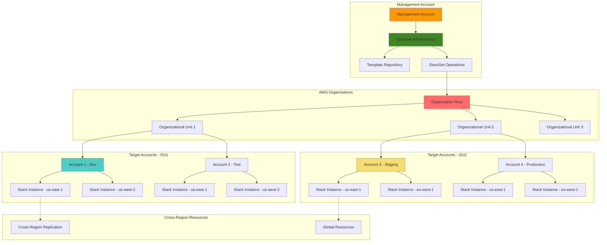

# CloudFormation StackSets Multi-Account Management

## Problem

Large enterprises operating across multiple AWS accounts and regions face significant challenges in maintaining consistent infrastructure deployment, security policies, and compliance standards. Manual deployment of CloudFormation stacks across dozens or hundreds of accounts is error-prone, time-consuming, and difficult to audit. Organizations struggle with maintaining infrastructure drift, ensuring compliance across all accounts, and implementing organization-wide security policies while allowing individual accounts sufficient autonomy for their specific requirements.

## Solution

AWS CloudFormation StackSets enables centralized deployment and management of CloudFormation stacks across multiple AWS accounts and regions from a single management account. This solution demonstrates how to implement organization-wide infrastructure governance using StackSets with AWS Organizations integration, automated deployment pipelines, and comprehensive monitoring. The approach provides centralized control while enabling delegation of stack management to organizational units and individual accounts based on business requirements.

## Architecture Diagram



## Prerequisites

1. AWS Organizations set up with management account and member accounts
2. IAM permissions for CloudFormation StackSets administration
3. AWS CLI v2 configured with management account credentials
4. Understanding of AWS Organizations, IAM cross-account roles, and CloudFormation
5. Multiple AWS accounts for testing (minimum 2-3 target accounts)
6. Estimated cost: $10-30 per account for testing resources (varies by regions and resources deployed)

> **Note**: This recipe requires AWS Organizations with all features enabled and multiple AWS accounts. Ensure you have proper permissions and understand cross-account billing implications before proceeding. For detailed setup instructions, see the [AWS Organizations User Guide](https://docs.aws.amazon.com/organizations/latest/userguide/orgs_introduction.html).

## Preparation

```bash
# Set environment variables
export AWS_REGION=$(aws configure get region)
export MANAGEMENT_ACCOUNT_ID=$(aws sts get-caller-identity \
    --query Account --output text)

# Generate unique identifiers for resources
RANDOM_SUFFIX=$(aws secretsmanager get-random-password \
    --exclude-punctuation --exclude-uppercase \
    --password-length 8 --require-each-included-type \
    --output text --query RandomPassword)

export STACKSET_NAME="org-governance-stackset-${RANDOM_SUFFIX}"
export TEMPLATE_BUCKET="stackset-templates-${RANDOM_SUFFIX}"
export ORGANIZATION_ID=$(aws organizations describe-organization \
    --query 'Organization.Id' --output text 2>/dev/null || echo "not-configured")

# Target regions for deployment
export TARGET_REGIONS="us-east-1,us-west-2,eu-west-1"

echo "✅ Environment variables configured"
echo "Management Account: ${MANAGEMENT_ACCOUNT_ID}"
echo "StackSet Name: ${STACKSET_NAME}"
echo "Template Bucket: ${TEMPLATE_BUCKET}"
echo "Organization ID: ${ORGANIZATION_ID}"
echo "Target Regions: ${TARGET_REGIONS}"

# Create S3 bucket for templates
aws s3 mb s3://${TEMPLATE_BUCKET} --region ${AWS_REGION}
```

## Steps

1. **Activate Trusted Access for StackSets with Organizations**:

   AWS CloudFormation StackSets with service-managed permissions requires trusted access to be activated with AWS Organizations. This enables CloudFormation to automatically create and manage IAM roles across member accounts without manual intervention. The trusted access model leverages AWS Organizations' built-in trust relationships to establish secure cross-account operations while maintaining centralized governance.

   ```bash
   # Enable trusted access for CloudFormation StackSets in Organizations
   aws organizations enable-aws-service-access \
       --service-principal stacksets.cloudformation.amazonaws.com
   
   # Verify trusted access is enabled
   aws organizations list-aws-service-access-for-organization \
       --query "EnabledServicePrincipals[?ServicePrincipal=='stacksets.cloudformation.amazonaws.com']"
   
   echo "✅ Trusted access enabled for CloudFormation StackSets"
   ```

   Trusted access is now activated, enabling CloudFormation StackSets to automatically create service-linked roles in member accounts. This eliminates the need for manual role creation and provides a secure foundation for organization-wide deployments while maintaining the principle of least privilege across all accounts.

2. **Create Governance Policy Template**:

   The governance template defines organization-wide security policies, compliance controls, and monitoring capabilities that will be consistently applied across all accounts and regions. This template includes IAM password policies, CloudTrail logging, AWS Config monitoring, and GuardDuty threat detection to establish comprehensive security baselines. The parameterized design allows for different compliance levels while maintaining consistency across the enterprise.

   ```bash
   # Create template for organization-wide governance policies
   cat > governance-template.yaml << 'EOF'
   AWSTemplateFormatVersion: '2010-09-09'
   Description: 'Organization-wide governance and security policies'
   
   Parameters:
     Environment:
       Type: String
       Default: 'all'
       AllowedValues: ['development', 'staging', 'production', 'all']
       Description: Environment for which policies apply
     
     OrganizationId:
       Type: String
       Description: AWS Organizations ID
     
     ComplianceLevel:
       Type: String
       Default: 'standard'
       AllowedValues: ['basic', 'standard', 'strict']
       Description: Compliance level for security policies
   
   Mappings:
     ComplianceConfig:
       basic:
         PasswordMinLength: 8
         RequireMFA: false
         S3PublicReadBlock: true
         S3PublicWriteBlock: true
       standard:
         PasswordMinLength: 12
         RequireMFA: true
         S3PublicReadBlock: true
         S3PublicWriteBlock: true
       strict:
         PasswordMinLength: 16
         RequireMFA: true
         S3PublicReadBlock: true
         S3PublicWriteBlock: true
   
   Resources:
     # Organization-wide password policy
     PasswordPolicy:
       Type: AWS::IAM::AccountPasswordPolicy
       Properties:
         MinimumPasswordLength: !FindInMap [ComplianceConfig, !Ref ComplianceLevel, PasswordMinLength]
         RequireUppercaseCharacters: true
         RequireLowercaseCharacters: true
         RequireNumbers: true
         RequireSymbols: true
         MaxPasswordAge: 90
         PasswordReusePrevention: 12
         HardExpiry: false
         AllowUsersToChangePassword: true
     
     # CloudTrail for auditing
     OrganizationCloudTrail:
       Type: AWS::CloudTrail::Trail
       Properties:
         TrailName: !Sub 'organization-audit-trail-${AWS::AccountId}-${AWS::Region}'
         S3BucketName: !Ref AuditBucket
         S3KeyPrefix: !Sub 'cloudtrail-logs/${AWS::AccountId}/'
         IncludeGlobalServiceEvents: true
         IsMultiRegionTrail: true
         EnableLogFileValidation: true
         EventSelectors:
           - ReadWriteType: All
             IncludeManagementEvents: true
             DataResources:
               - Type: AWS::S3::Object
                 Values: 
                   - "arn:aws:s3:::*/*"
         Tags:
           - Key: Purpose
             Value: OrganizationAudit
           - Key: Environment
             Value: !Ref Environment
     
     # S3 bucket for CloudTrail logs
     AuditBucket:
       Type: AWS::S3::Bucket
       Properties:
         BucketName: !Sub 'org-audit-logs-${AWS::AccountId}-${AWS::Region}-${OrganizationId}'
         PublicAccessBlockConfiguration:
           BlockPublicAcls: !FindInMap [ComplianceConfig, !Ref ComplianceLevel, S3PublicReadBlock]
           BlockPublicPolicy: !FindInMap [ComplianceConfig, !Ref ComplianceLevel, S3PublicWriteBlock]
           IgnorePublicAcls: !FindInMap [ComplianceConfig, !Ref ComplianceLevel, S3PublicReadBlock]
           RestrictPublicBuckets: !FindInMap [ComplianceConfig, !Ref ComplianceLevel, S3PublicWriteBlock]
         BucketEncryption:
           ServerSideEncryptionConfiguration:
             - ServerSideEncryptionByDefault:
                 SSEAlgorithm: AES256
         VersioningConfiguration:
           Status: Enabled
         LifecycleConfiguration:
           Rules:
             - Id: DeleteOldLogs
               Status: Enabled
               ExpirationInDays: 2555  # 7 years
               NoncurrentVersionExpirationInDays: 365
         Tags:
           - Key: Purpose
             Value: AuditLogs
           - Key: Environment
             Value: !Ref Environment
     
     # CloudTrail bucket policy
     AuditBucketPolicy:
       Type: AWS::S3::BucketPolicy
       Properties:
         Bucket: !Ref AuditBucket
         PolicyDocument:
           Version: '2012-10-17'
           Statement:
             - Sid: AWSCloudTrailAclCheck
               Effect: Allow
               Principal:
                 Service: cloudtrail.amazonaws.com
               Action: s3:GetBucketAcl
               Resource: !GetAtt AuditBucket.Arn
             - Sid: AWSCloudTrailWrite
               Effect: Allow
               Principal:
                 Service: cloudtrail.amazonaws.com
               Action: s3:PutObject
               Resource: !Sub '${AuditBucket.Arn}/*'
               Condition:
                 StringEquals:
                   's3:x-amz-acl': bucket-owner-full-control
     
     # CloudWatch Log Group for monitoring
     AuditLogGroup:
       Type: AWS::Logs::LogGroup
       Properties:
         LogGroupName: !Sub '/aws/cloudtrail/${AWS::AccountId}'
         RetentionInDays: 365
         Tags:
           - Key: Purpose
             Value: AuditLogs
           - Key: Environment
             Value: !Ref Environment
     
     # GuardDuty Detector
     GuardDutyDetector:
       Type: AWS::GuardDuty::Detector
       Properties:
         Enable: true
         FindingPublishingFrequency: FIFTEEN_MINUTES
         Tags:
           - Key: Purpose
             Value: SecurityMonitoring
           - Key: Environment
             Value: !Ref Environment
     
     # Config Configuration Recorder
     ConfigurationRecorder:
       Type: AWS::Config::ConfigurationRecorder
       Properties:
         Name: !Sub 'organization-config-${AWS::AccountId}'
         RoleARN: !GetAtt ConfigRole.Arn
         RecordingGroup:
           AllSupported: true
           IncludeGlobalResourceTypes: true
     
     # Config Delivery Channel
     ConfigDeliveryChannel:
       Type: AWS::Config::DeliveryChannel
       Properties:
         Name: !Sub 'organization-config-delivery-${AWS::AccountId}'
         S3BucketName: !Ref ConfigBucket
         S3KeyPrefix: !Sub 'config-logs/${AWS::AccountId}/'
         ConfigSnapshotDeliveryProperties:
           DeliveryFrequency: TwentyFour_Hours
     
     # S3 bucket for Config
     ConfigBucket:
       Type: AWS::S3::Bucket
       Properties:
         BucketName: !Sub 'org-config-logs-${AWS::AccountId}-${AWS::Region}-${OrganizationId}'
         PublicAccessBlockConfiguration:
           BlockPublicAcls: true
           BlockPublicPolicy: true
           IgnorePublicAcls: true
           RestrictPublicBuckets: true
         BucketEncryption:
           ServerSideEncryptionConfiguration:
             - ServerSideEncryptionByDefault:
                 SSEAlgorithm: AES256
         Tags:
           - Key: Purpose
             Value: ConfigLogs
           - Key: Environment
             Value: !Ref Environment
     
     # IAM Role for Config
     ConfigRole:
       Type: AWS::IAM::Role
       Properties:
         AssumeRolePolicyDocument:
           Version: '2012-10-17'
           Statement:
             - Effect: Allow
               Principal:
                 Service: config.amazonaws.com
               Action: sts:AssumeRole
         ManagedPolicyArns:
           - arn:aws:iam::aws:policy/service-role/ConfigRole
         Policies:
           - PolicyName: ConfigS3Policy
             PolicyDocument:
               Version: '2012-10-17'
               Statement:
                 - Effect: Allow
                   Action:
                     - s3:GetBucketAcl
                     - s3:GetBucketLocation
                     - s3:ListBucket
                   Resource: !GetAtt ConfigBucket.Arn
                 - Effect: Allow
                   Action:
                     - s3:PutObject
                     - s3:GetObject
                   Resource: !Sub '${ConfigBucket.Arn}/*'
                   Condition:
                     StringEquals:
                       's3:x-amz-acl': bucket-owner-full-control
   
   Outputs:
     CloudTrailArn:
       Description: CloudTrail ARN
       Value: !GetAtt OrganizationCloudTrail.Arn
       Export:
         Name: !Sub '${AWS::StackName}-CloudTrailArn'
     
     AuditBucketName:
       Description: Audit bucket name
       Value: !Ref AuditBucket
       Export:
         Name: !Sub '${AWS::StackName}-AuditBucketName'
     
     GuardDutyDetectorId:
       Description: GuardDuty detector ID
       Value: !Ref GuardDutyDetector
       Export:
         Name: !Sub '${AWS::StackName}-GuardDutyDetectorId'
     
     ConfigRecorderName:
       Description: Config recorder name
       Value: !Ref ConfigurationRecorder
       Export:
         Name: !Sub '${AWS::StackName}-ConfigRecorderName'
   EOF
   
   # Upload governance template to S3
   aws s3 cp governance-template.yaml s3://${TEMPLATE_BUCKET}/
   
   echo "✅ Governance template created and uploaded"
   ```

   The governance template establishes a comprehensive security foundation that will be consistently deployed across all target accounts. The mapping-based configuration allows for flexible compliance levels while ensuring standardized security controls. This approach enables organizations to maintain different security postures for development, staging, and production environments while ensuring all accounts meet minimum security requirements.

3. **Create Organization-Wide Governance StackSet**:

   The governance StackSet leverages the service-managed permission model to automatically deploy security policies and compliance controls across all accounts in the organization. This StackSet enables automatic deployment to new accounts as they join organizational units, ensuring consistent governance without manual intervention. The auto-deployment feature maintains compliance as the organization scales.

   ```bash
   # Create StackSet for organization-wide governance
   aws cloudformation create-stack-set \
       --stack-set-name ${STACKSET_NAME} \
       --description "Organization-wide governance and security policies" \
       --template-url https://${TEMPLATE_BUCKET}.s3.${AWS_REGION}.amazonaws.com/governance-template.yaml \
       --parameters ParameterKey=Environment,ParameterValue=all \
                   ParameterKey=OrganizationId,ParameterValue=${ORGANIZATION_ID} \
                   ParameterKey=ComplianceLevel,ParameterValue=standard \
       --capabilities CAPABILITY_IAM \
       --permission-model SERVICE_MANAGED \
       --auto-deployment Enabled=true,RetainStacksOnAccountRemoval=false
   
   echo "✅ Governance StackSet created: ${STACKSET_NAME}"
   ```

   The governance StackSet is now configured with service-managed permissions and automatic deployment capabilities. This StackSet will automatically deploy governance policies to new accounts as they join the organization, ensuring consistent security posture across the entire enterprise.

4. **Deploy StackSet to Organizational Units**:

   Deploying the StackSet to organizational units enables hierarchical governance where different policies can be applied to different business units while maintaining enterprise-wide consistency. This approach allows for organizational autonomy while ensuring compliance with corporate standards. The deployment targets organizational units rather than individual accounts, enabling automatic policy application as accounts move between units.

   ```bash
   # Get organizational unit IDs
   OU_IDS=$(aws organizations list-organizational-units-for-parent \
       --parent-id $(aws organizations list-roots --query 'Roots[0].Id' --output text) \
       --query 'OrganizationalUnits[].Id' --output text | tr '\t' ',')
   
   # Get list of accounts in the organization (excluding management account) as fallback
   TARGET_ACCOUNTS=$(aws organizations list-accounts \
       --query "Accounts[?Status=='ACTIVE' && Id!='${MANAGEMENT_ACCOUNT_ID}'].Id" \
       --output text | tr '\t' ',')
   
   if [ ! -z "$OU_IDS" ]; then
       echo "Deploying to organizational units: ${OU_IDS}"
       # Deploy to organizational units
       GOVERNANCE_OPERATION_ID=$(aws cloudformation create-stack-instances \
           --stack-set-name ${STACKSET_NAME} \
           --deployment-targets OrganizationalUnitIds=${OU_IDS} \
           --regions ${TARGET_REGIONS} \
           --operation-preferences RegionConcurrencyType=PARALLEL,MaxConcurrentPercentage=100 \
           --query 'OperationId' --output text)
   elif [ ! -z "$TARGET_ACCOUNTS" ]; then
       echo "⚠️  No organizational units found. Deploying to accounts directly."
       echo "Target accounts: ${TARGET_ACCOUNTS}"
       # Deploy to specific accounts instead
       GOVERNANCE_OPERATION_ID=$(aws cloudformation create-stack-instances \
           --stack-set-name ${STACKSET_NAME} \
           --accounts ${TARGET_ACCOUNTS} \
           --regions ${TARGET_REGIONS} \
           --query 'OperationId' --output text)
   else
       echo "❌ No target accounts or organizational units found."
       echo "Please configure AWS Organizations with member accounts."
       exit 1
   fi
   
   echo "⏳ Deploying governance policies across organization..."
   echo "Operation ID: ${GOVERNANCE_OPERATION_ID}"
   
   # Wait for operation to complete
   aws cloudformation wait stack-set-operation-complete \
       --stack-set-name ${STACKSET_NAME} \
       --operation-id ${GOVERNANCE_OPERATION_ID}
   
   echo "✅ Governance policies deployed across organization"
   ```

   Governance policies are now consistently deployed across all organizational units and regions. The parallel deployment approach ensures rapid policy implementation while maintaining failure tolerance. All accounts now have standardized security controls, audit logging, and compliance monitoring in place.

5. **Configure StackSet Update Policies and Drift Detection**:

   Operational preferences control how StackSet updates are rolled out across the organization, balancing deployment speed with stability and failure tolerance. These settings determine the maximum percentage of accounts that can be updated simultaneously and the failure threshold before stopping operations. Drift detection identifies when stack instances have diverged from their intended configuration, enabling proactive compliance management.

   ```bash
   # Update StackSet with operational preferences
   aws cloudformation update-stack-set \
       --stack-set-name ${STACKSET_NAME} \
       --template-url https://${TEMPLATE_BUCKET}.s3.${AWS_REGION}.amazonaws.com/governance-template.yaml \
       --parameters ParameterKey=Environment,ParameterValue=all \
                   ParameterKey=OrganizationId,ParameterValue=${ORGANIZATION_ID} \
                   ParameterKey=ComplianceLevel,ParameterValue=standard \
       --capabilities CAPABILITY_IAM \
       --operation-preferences RegionConcurrencyType=PARALLEL,MaxConcurrentPercentage=50,FailureTolerancePercentage=10
   
   # Enable drift detection
   aws cloudformation detect-stack-set-drift \
       --stack-set-name ${STACKSET_NAME}
   
   echo "✅ StackSet update policies configured and drift detection enabled"
   ```

   The StackSet now has optimized operational preferences that balance deployment speed with stability. Drift detection enables continuous monitoring of configuration compliance across all deployed stack instances, providing early warning when resources deviate from their intended state.

6. **Create Monitoring and Alerting for StackSets**:

   Comprehensive monitoring and alerting enable proactive management of StackSet operations across the organization. CloudWatch dashboards provide real-time visibility into operation success rates, failure patterns, and deployment progress. SNS topics enable immediate notification of critical events, allowing operations teams to respond quickly to issues or failures in the governance deployment pipeline.

   ```bash
   # Create CloudWatch dashboard for StackSet monitoring
   cat > stackset-dashboard.json << EOF
   {
     "widgets": [
       {
         "type": "metric",
         "x": 0,
         "y": 0,
         "width": 12,
         "height": 6,
         "properties": {
           "metrics": [
             ["AWS/CloudFormation", "StackSetOperationSuccessCount", "StackSetName", "${STACKSET_NAME}"],
             [".", "StackSetOperationFailureCount", ".", "."]
           ],
           "period": 300,
           "stat": "Sum",
           "region": "${AWS_REGION}",
           "title": "StackSet Operation Results"
         }
       },
       {
         "type": "log",
         "x": 0,
         "y": 6,
         "width": 24,
         "height": 6,
         "properties": {
           "query": "SOURCE '/aws/cloudformation/stackset-operations'\n| fields @timestamp, stackSetName, operationType, operationStatus\n| filter stackSetName like /${STACKSET_NAME}/\n| sort @timestamp desc\n| limit 20",
           "region": "${AWS_REGION}",
           "title": "Recent StackSet Operations"
         }
       }
     ]
   }
   EOF
   
   aws cloudwatch put-dashboard \
       --dashboard-name "StackSet-Monitoring-${RANDOM_SUFFIX}" \
       --dashboard-body file://stackset-dashboard.json
   
   # Create SNS topic for alerts
   ALERT_TOPIC_ARN=$(aws sns create-topic \
       --name "StackSetAlerts-${RANDOM_SUFFIX}" \
       --output text --query TopicArn)
   
   # Create CloudWatch alarm for failed operations
   aws cloudwatch put-metric-alarm \
       --alarm-name "StackSetOperationFailure-${STACKSET_NAME}" \
       --alarm-description "Alert when StackSet operations fail" \
       --metric-name StackSetOperationFailureCount \
       --namespace AWS/CloudFormation \
       --statistic Sum \
       --period 300 \
       --threshold 1 \
       --comparison-operator GreaterThanOrEqualToThreshold \
       --evaluation-periods 1 \
       --alarm-actions ${ALERT_TOPIC_ARN} \
       --dimensions Name=StackSetName,Value=${STACKSET_NAME}
   
   echo "✅ StackSet monitoring and alerting configured"
   ```

   The monitoring infrastructure provides comprehensive visibility into StackSet operations and enables proactive management of governance policy deployments. CloudWatch alarms will immediately notify operations teams of any failures, while the dashboard provides ongoing visibility into the health and performance of the organization-wide governance system.

7. **Implement Compliance Scanning and Reporting**:

   Compliance reporting capabilities enable regular assessment of governance policy deployment status and identification of any compliance gaps across the organization. The reporting tools provide detailed insights into stack instance health, deployment history, and drift status, supporting audit requirements and continuous compliance monitoring. Automated report generation ensures consistent documentation of compliance posture.

   ```bash
   # Create compliance report script
   cat > generate-compliance-report.sh << 'EOF'
   #!/bin/bash
   
   STACKSET_NAME=$1
   OUTPUT_FILE="compliance-report-$(date +%Y%m%d-%H%M%S).json"
   
   echo "Generating compliance report for StackSet: ${STACKSET_NAME}"
   
   # Get StackSet summary
   aws cloudformation describe-stack-set \
       --stack-set-name ${STACKSET_NAME} \
       --query '{
           StackSetName: StackSetName,
           Status: Status,
           Description: Description,
           Parameters: Parameters
       }' > ${OUTPUT_FILE}
   
   # Get stack instances
   aws cloudformation list-stack-instances \
       --stack-set-name ${STACKSET_NAME} \
       --query 'Summaries[].{
           Account: Account,
           Region: Region,
           Status: Status,
           StatusReason: StatusReason,
           DriftStatus: DriftStatus
       }' >> stack-instances-${OUTPUT_FILE}
   
   # Get operation history
   aws cloudformation list-stack-set-operations \
       --stack-set-name ${STACKSET_NAME} \
       --query 'Summaries[0:10].{
           OperationId: OperationId,
           Action: Action,
           Status: Status,
           CreationTimestamp: CreationTimestamp,
           EndTimestamp: EndTimestamp
       }' >> operations-${OUTPUT_FILE}
   
   echo "Compliance report generated: ${OUTPUT_FILE}"
   echo "Stack instances report: stack-instances-${OUTPUT_FILE}"
   echo "Operations report: operations-${OUTPUT_FILE}"
   EOF
   
   chmod +x generate-compliance-report.sh
   
   # Generate initial compliance report
   ./generate-compliance-report.sh ${STACKSET_NAME}
   
   echo "✅ Compliance reporting tools created"
   ```

   The compliance reporting system provides automated assessment of governance policy deployment across all accounts and regions. These tools enable regular compliance audits and support continuous monitoring of the organization's security posture through detailed reporting and historical analysis.

8. **Test StackSet Updates and Rollback**:

   Testing StackSet updates with enhanced policies validates the organization's ability to evolve security standards while maintaining operational stability. The sequential deployment approach with reduced concurrency and failure tolerance provides additional safety for critical policy updates. Version tracking enables rollback capabilities and change management throughout the organization.

   ```bash
   # Create updated governance template with stricter policies
   cat > governance-template-v2.yaml << 'EOF'
   AWSTemplateFormatVersion: '2010-09-09'
   Description: 'Updated organization-wide governance and security policies v2'
   
   Parameters:
     Environment:
       Type: String
       Default: 'all'
       AllowedValues: ['development', 'staging', 'production', 'all']
       Description: Environment for which policies apply
     
     OrganizationId:
       Type: String
       Description: AWS Organizations ID
     
     ComplianceLevel:
       Type: String
       Default: 'strict'
       AllowedValues: ['basic', 'standard', 'strict']
       Description: Compliance level for security policies
   
   Mappings:
     ComplianceConfig:
       basic:
         PasswordMinLength: 8
         RequireMFA: false
         S3PublicReadBlock: true
         S3PublicWriteBlock: true
         CloudTrailLogLevel: 'ReadOnly'
       standard:
         PasswordMinLength: 12
         RequireMFA: true
         S3PublicReadBlock: true
         S3PublicWriteBlock: true
         CloudTrailLogLevel: 'All'
       strict:
         PasswordMinLength: 16
         RequireMFA: true
         S3PublicReadBlock: true
         S3PublicWriteBlock: true
         CloudTrailLogLevel: 'All'
   
   Resources:
     # Enhanced password policy
     PasswordPolicy:
       Type: AWS::IAM::AccountPasswordPolicy
       Properties:
         MinimumPasswordLength: !FindInMap [ComplianceConfig, !Ref ComplianceLevel, PasswordMinLength]
         RequireUppercaseCharacters: true
         RequireLowercaseCharacters: true
         RequireNumbers: true
         RequireSymbols: true
         MaxPasswordAge: 60  # Stricter: 60 days instead of 90
         PasswordReusePrevention: 24  # Stricter: 24 instead of 12
         HardExpiry: false
         AllowUsersToChangePassword: true
     
     # Enhanced CloudTrail with insights
     OrganizationCloudTrail:
       Type: AWS::CloudTrail::Trail
       Properties:
         TrailName: !Sub 'organization-audit-trail-${AWS::AccountId}-${AWS::Region}'
         S3BucketName: !Ref AuditBucket
         S3KeyPrefix: !Sub 'cloudtrail-logs/${AWS::AccountId}/'
         IncludeGlobalServiceEvents: true
         IsMultiRegionTrail: true
         EnableLogFileValidation: true
         InsightSelectors:
           - InsightType: ApiCallRateInsight
         EventSelectors:
           - ReadWriteType: !FindInMap [ComplianceConfig, !Ref ComplianceLevel, CloudTrailLogLevel]
             IncludeManagementEvents: true
             DataResources:
               - Type: AWS::S3::Object
                 Values: 
                   - "arn:aws:s3:::*/*"
               - Type: AWS::Lambda::Function
                 Values:
                   - "arn:aws:lambda:*:*:function:*"
         Tags:
           - Key: Purpose
             Value: OrganizationAudit
           - Key: Environment
             Value: !Ref Environment
           - Key: Version
             Value: 'v2'
     
     # S3 bucket for CloudTrail logs (enhanced)
     AuditBucket:
       Type: AWS::S3::Bucket
       Properties:
         BucketName: !Sub 'org-audit-logs-${AWS::AccountId}-${AWS::Region}-${OrganizationId}'
         PublicAccessBlockConfiguration:
           BlockPublicAcls: true
           BlockPublicPolicy: true
           IgnorePublicAcls: true
           RestrictPublicBuckets: true
         BucketEncryption:
           ServerSideEncryptionConfiguration:
             - ServerSideEncryptionByDefault:
                 SSEAlgorithm: aws:kms  # Enhanced: KMS instead of AES256
                 KMSMasterKeyID: !Ref AuditBucketKMSKey
         VersioningConfiguration:
           Status: Enabled
         LifecycleConfiguration:
           Rules:
             - Id: DeleteOldLogs
               Status: Enabled
               ExpirationInDays: 2555  # 7 years
               NoncurrentVersionExpirationInDays: 365
             - Id: TransitionToIA
               Status: Enabled
               TransitionInDays: 30
               StorageClass: STANDARD_IA
             - Id: TransitionToGlacier
               Status: Enabled
               TransitionInDays: 365
               StorageClass: GLACIER
         Tags:
           - Key: Purpose
             Value: AuditLogs
           - Key: Environment
             Value: !Ref Environment
           - Key: Version
             Value: 'v2'
     
     # KMS key for audit bucket encryption
     AuditBucketKMSKey:
       Type: AWS::KMS::Key
       Properties:
         Description: KMS key for audit bucket encryption
         KeyPolicy:
           Version: '2012-10-17'
           Statement:
             - Sid: Enable IAM User Permissions
               Effect: Allow
               Principal:
                 AWS: !Sub 'arn:aws:iam::${AWS::AccountId}:root'
               Action: 'kms:*'
               Resource: '*'
             - Sid: Allow CloudTrail to encrypt logs
               Effect: Allow
               Principal:
                 Service: cloudtrail.amazonaws.com
               Action:
                 - kms:Decrypt
                 - kms:GenerateDataKey
               Resource: '*'
         Tags:
           - Key: Purpose
             Value: AuditBucketEncryption
   
     # KMS key alias
     AuditBucketKMSKeyAlias:
       Type: AWS::KMS::Alias
       Properties:
         AliasName: !Sub 'alias/audit-bucket-${AWS::AccountId}'
         TargetKeyId: !Ref AuditBucketKMSKey
     
     # CloudWatch Log Group for monitoring
     AuditLogGroup:
       Type: AWS::Logs::LogGroup
       Properties:
         LogGroupName: !Sub '/aws/cloudtrail/${AWS::AccountId}'
         RetentionInDays: 365
         Tags:
           - Key: Purpose
             Value: AuditLogs
           - Key: Environment
             Value: !Ref Environment
     
     # GuardDuty Detector
     GuardDutyDetector:
       Type: AWS::GuardDuty::Detector
       Properties:
         Enable: true
         FindingPublishingFrequency: FIFTEEN_MINUTES
         Tags:
           - Key: Purpose
             Value: SecurityMonitoring
           - Key: Environment
             Value: !Ref Environment
     
     # Config Configuration Recorder
     ConfigurationRecorder:
       Type: AWS::Config::ConfigurationRecorder
       Properties:
         Name: !Sub 'organization-config-${AWS::AccountId}'
         RoleARN: !GetAtt ConfigRole.Arn
         RecordingGroup:
           AllSupported: true
           IncludeGlobalResourceTypes: true
     
     # Config Delivery Channel
     ConfigDeliveryChannel:
       Type: AWS::Config::DeliveryChannel
       Properties:
         Name: !Sub 'organization-config-delivery-${AWS::AccountId}'
         S3BucketName: !Ref ConfigBucket
         S3KeyPrefix: !Sub 'config-logs/${AWS::AccountId}/'
         ConfigSnapshotDeliveryProperties:
           DeliveryFrequency: TwentyFour_Hours
     
     # S3 bucket for Config
     ConfigBucket:
       Type: AWS::S3::Bucket
       Properties:
         BucketName: !Sub 'org-config-logs-${AWS::AccountId}-${AWS::Region}-${OrganizationId}'
         PublicAccessBlockConfiguration:
           BlockPublicAcls: true
           BlockPublicPolicy: true
           IgnorePublicAcls: true
           RestrictPublicBuckets: true
         BucketEncryption:
           ServerSideEncryptionConfiguration:
             - ServerSideEncryptionByDefault:
                 SSEAlgorithm: AES256
         Tags:
           - Key: Purpose
             Value: ConfigLogs
           - Key: Environment
             Value: !Ref Environment
     
     # IAM Role for Config
     ConfigRole:
       Type: AWS::IAM::Role
       Properties:
         AssumeRolePolicyDocument:
           Version: '2012-10-17'
           Statement:
             - Effect: Allow
               Principal:
                 Service: config.amazonaws.com
               Action: sts:AssumeRole
         ManagedPolicyArns:
           - arn:aws:iam::aws:policy/service-role/ConfigRole
         Policies:
           - PolicyName: ConfigS3Policy
             PolicyDocument:
               Version: '2012-10-17'
               Statement:
                 - Effect: Allow
                   Action:
                     - s3:GetBucketAcl
                     - s3:GetBucketLocation
                     - s3:ListBucket
                   Resource: !GetAtt ConfigBucket.Arn
                 - Effect: Allow
                   Action:
                     - s3:PutObject
                     - s3:GetObject
                   Resource: !Sub '${ConfigBucket.Arn}/*'
                   Condition:
                     StringEquals:
                       's3:x-amz-acl': bucket-owner-full-control
   
   Outputs:
     CloudTrailArn:
       Description: CloudTrail ARN
       Value: !GetAtt OrganizationCloudTrail.Arn
       Export:
         Name: !Sub '${AWS::StackName}-CloudTrailArn'
     
     AuditBucketName:
       Description: Audit bucket name
       Value: !Ref AuditBucket
       Export:
         Name: !Sub '${AWS::StackName}-AuditBucketName'
     
     KMSKeyId:
       Description: KMS key ID for audit bucket
       Value: !Ref AuditBucketKMSKey
       Export:
         Name: !Sub '${AWS::StackName}-KMSKeyId'
     
     Version:
       Description: Template version
       Value: 'v2'
       Export:
         Name: !Sub '${AWS::StackName}-Version'
   EOF
   
   # Upload updated template
   aws s3 cp governance-template-v2.yaml s3://${TEMPLATE_BUCKET}/
   
   # Update StackSet with new template
   UPDATE_OPERATION_ID=$(aws cloudformation update-stack-set \
       --stack-set-name ${STACKSET_NAME} \
       --template-url https://${TEMPLATE_BUCKET}.s3.${AWS_REGION}.amazonaws.com/governance-template-v2.yaml \
       --parameters ParameterKey=Environment,ParameterValue=all \
                   ParameterKey=OrganizationId,ParameterValue=${ORGANIZATION_ID} \
                   ParameterKey=ComplianceLevel,ParameterValue=strict \
       --capabilities CAPABILITY_IAM \
       --operation-preferences RegionConcurrencyType=SEQUENTIAL,MaxConcurrentPercentage=25,FailureTolerancePercentage=5 \
       --query 'OperationId' --output text)
   
   echo "⏳ Updating StackSet with enhanced governance policies..."
   echo "Update Operation ID: ${UPDATE_OPERATION_ID}"
   
   # Monitor update progress
   aws cloudformation wait stack-set-operation-complete \
       --stack-set-name ${STACKSET_NAME} \
       --operation-id ${UPDATE_OPERATION_ID}
   
   echo "✅ StackSet updated successfully with enhanced policies"
   ```

   The organization now has validated update procedures that enable safe evolution of governance policies across all accounts. The enhanced policies demonstrate the system's ability to adapt to changing security requirements while maintaining operational stability and compliance.

9. **Implement Automated Drift Detection and Remediation**:

   Automated drift detection through Lambda functions provides continuous monitoring of stack instance compliance without manual intervention. The Lambda function integrates with CloudFormation APIs to detect configuration drift and provides detailed reporting through SNS notifications. This automation enables proactive compliance management and rapid response to configuration changes that could impact security posture.

   ```bash
   # Create Lambda function for automated drift detection
   cat > drift-detection-lambda.py << 'EOF'
   import boto3
   import json
   import logging
   from datetime import datetime
   
   logger = logging.getLogger()
   logger.setLevel(logging.INFO)
   
   def lambda_handler(event, context):
       """
       Lambda function to detect and report StackSet drift
       """
       try:
           cf_client = boto3.client('cloudformation')
           sns_client = boto3.client('sns')
           
           # Get StackSet name from environment or event
           stackset_name = event.get('stackset_name') or context.function_name.split('-')[0]
           sns_topic_arn = event.get('sns_topic_arn')
           
           logger.info(f"Starting drift detection for StackSet: {stackset_name}")
           
           # Initiate drift detection
           response = cf_client.detect_stack_set_drift(StackSetName=stackset_name)
           operation_id = response['OperationId']
           
           logger.info(f"Drift detection initiated with operation ID: {operation_id}")
           
           # Wait for operation to complete (in production, this would be handled by separate invocations)
           waiter = cf_client.get_waiter('stack_set_operation_complete')
           waiter.wait(StackSetName=stackset_name, OperationId=operation_id)
           
           # Get drift detection results
           drift_results = cf_client.describe_stack_set_operation(
               StackSetName=stackset_name,
               OperationId=operation_id
           )
           
           # Get stack instances with drift
           stack_instances = cf_client.list_stack_instances(
               StackSetName=stackset_name
           )
           
           drifted_instances = []
           for instance in stack_instances['Summaries']:
               if instance.get('DriftStatus') == 'DRIFTED':
                   drifted_instances.append({
                       'Account': instance['Account'],
                       'Region': instance['Region'],
                       'DriftStatus': instance['DriftStatus']
                   })
           
           # Generate report
           report = {
               'timestamp': datetime.utcnow().isoformat(),
               'stackset_name': stackset_name,
               'operation_id': operation_id,
               'total_instances': len(stack_instances['Summaries']),
               'drifted_instances': len(drifted_instances),
               'drifted_details': drifted_instances
           }
           
           logger.info(f"Drift detection complete. Found {len(drifted_instances)} drifted instances")
           
           # Send notification if drift detected
           if drifted_instances and sns_topic_arn:
               message = f"""
               StackSet Drift Detected
               
               StackSet: {stackset_name}
               Total Instances: {len(stack_instances['Summaries'])}
               Drifted Instances: {len(drifted_instances)}
               
               Drifted Instance Details:
               {json.dumps(drifted_instances, indent=2)}
               
               Operation ID: {operation_id}
               Timestamp: {datetime.utcnow().isoformat()}
               """
               
               sns_client.publish(
                   TopicArn=sns_topic_arn,
                   Subject=f'StackSet Drift Alert: {stackset_name}',
                   Message=message
               )
           
           return {
               'statusCode': 200,
               'body': json.dumps(report, indent=2)
           }
           
       except Exception as e:
           logger.error(f"Error in drift detection: {str(e)}")
           return {
               'statusCode': 500,
               'body': json.dumps({'error': str(e)})
           }
   EOF
   
   # Package Lambda function
   zip drift-detection-lambda.zip drift-detection-lambda.py
   
   # Create IAM role for Lambda
   cat > lambda-trust-policy.json << 'EOF'
   {
     "Version": "2012-10-17",
     "Statement": [
       {
         "Effect": "Allow",
         "Principal": {
           "Service": "lambda.amazonaws.com"
         },
         "Action": "sts:AssumeRole"
       }
     ]
   }
   EOF
   
   aws iam create-role \
       --role-name StackSetDriftDetectionRole \
       --assume-role-policy-document file://lambda-trust-policy.json
   
   aws iam attach-role-policy \
       --role-name StackSetDriftDetectionRole \
       --policy-arn arn:aws:iam::aws:policy/service-role/AWSLambdaBasicExecutionRole
   
   # Create custom policy for StackSet operations
   cat > stackset-drift-policy.json << 'EOF'
   {
     "Version": "2012-10-17",
     "Statement": [
       {
         "Effect": "Allow",
         "Action": [
           "cloudformation:DetectStackSetDrift",
           "cloudformation:DescribeStackSetOperation",
           "cloudformation:ListStackInstances",
           "cloudformation:DescribeStackInstance",
           "sns:Publish"
         ],
         "Resource": "*"
       }
     ]
   }
   EOF
   
   aws iam create-policy \
       --policy-name StackSetDriftDetectionPolicy \
       --policy-document file://stackset-drift-policy.json
   
   aws iam attach-role-policy \
       --role-name StackSetDriftDetectionRole \
       --policy-arn arn:aws:iam::${MANAGEMENT_ACCOUNT_ID}:policy/StackSetDriftDetectionPolicy
   
   # Create Lambda function
   LAMBDA_ROLE_ARN="arn:aws:iam::${MANAGEMENT_ACCOUNT_ID}:role/StackSetDriftDetectionRole"
   
   aws lambda create-function \
       --function-name "stackset-drift-detection-${RANDOM_SUFFIX}" \
       --runtime python3.9 \
       --role ${LAMBDA_ROLE_ARN} \
       --handler drift-detection-lambda.lambda_handler \
       --zip-file fileb://drift-detection-lambda.zip \
       --timeout 900 \
       --environment Variables="{SNS_TOPIC_ARN=${ALERT_TOPIC_ARN}}"
   
   echo "✅ Automated drift detection Lambda function created"
   ```

   The automated drift detection system provides continuous monitoring of governance policy compliance across all accounts and regions. This Lambda-based solution enables real-time detection of configuration drift with automated alerting, supporting proactive compliance management and rapid response to potential security issues.

## Validation & Testing

1. **Verify StackSet Deployment Status**:

   Verifying StackSet deployment status confirms that governance policies have been successfully deployed across all target accounts and regions. This validation ensures that the organization-wide security controls are properly implemented and functioning as expected. The status check provides visibility into any failed deployments that require attention.

   ```bash
   # Check StackSet status
   aws cloudformation describe-stack-set \
       --stack-set-name ${STACKSET_NAME} \
       --query '{Name:StackSetName,Status:Status,Description:Description,Capabilities:Capabilities}'
   
   # List all stack instances
   aws cloudformation list-stack-instances \
       --stack-set-name ${STACKSET_NAME} \
       --query 'Summaries[].{Account:Account,Region:Region,Status:Status,DriftStatus:DriftStatus}' \
       --output table
   ```

   Expected output: All stack instances should show CURRENT status

2. **Test Cross-Account Resource Creation**:

   Testing cross-account resource creation validates that the service-managed permissions are properly configured and that CloudFormation can successfully deploy resources in target accounts. This verification ensures that the trust relationships and permissions are correctly established for ongoing governance operations.

   ```bash
   # Check CloudTrail deployment across accounts
   aws cloudformation list-stack-instances \
       --stack-set-name ${STACKSET_NAME} \
       --query 'Summaries[?Status==`CURRENT`].{Account:Account,Region:Region}' \
       --output table
   
   # Verify governance policies are deployed
   echo "Governance policies deployed to $(aws cloudformation list-stack-instances \
       --stack-set-name ${STACKSET_NAME} \
       --query 'length(Summaries[?Status==`CURRENT`])' --output text) stack instances"
   ```

3. **Test StackSet Update Propagation**:

   Testing StackSet update propagation verifies that policy changes can be successfully rolled out across the organization. This validation ensures that the operational preferences are properly configured and that updates can be safely deployed to all accounts while maintaining service availability.

   ```bash
   # Check operation history
   aws cloudformation list-stack-set-operations \
       --stack-set-name ${STACKSET_NAME} \
       --query 'Summaries[0:5].{OperationId:OperationId,Action:Action,Status:Status,CreationTimestamp:CreationTimestamp}' \
       --output table
   
   # Verify template version in stack instances
   aws cloudformation list-stack-instances \
       --stack-set-name ${STACKSET_NAME} \
       --query 'Summaries[0]' \
       --output json
   ```

4. **Test Drift Detection**:

   ```bash
   # Manually trigger drift detection
   DRIFT_OPERATION_ID=$(aws cloudformation detect-stack-set-drift \
       --stack-set-name ${STACKSET_NAME} \
       --query 'OperationId' --output text)
   
   echo "Drift detection operation ID: ${DRIFT_OPERATION_ID}"
   
   # Wait for completion
   aws cloudformation wait stack-set-operation-complete \
       --stack-set-name ${STACKSET_NAME} \
       --operation-id ${DRIFT_OPERATION_ID}
   
   # Check drift results
   aws cloudformation describe-stack-set-operation \
       --stack-set-name ${STACKSET_NAME} \
       --operation-id ${DRIFT_OPERATION_ID} \
       --query 'Operation.{Status:Status,StatusReason:StatusReason}'
   ```

## Cleanup

1. **Delete Stack Instances**:

   Removing stack instances from all target accounts and regions ensures complete cleanup of governance policies and resources. This operation must be performed before deleting the StackSet itself to avoid orphaned resources and potential billing charges.

   ```bash
   # Get current stack instances for cleanup
   CLEANUP_ACCOUNTS=$(aws cloudformation list-stack-instances \
       --stack-set-name ${STACKSET_NAME} \
       --query 'Summaries[].Account' --output text | tr '\t' ',')
   
   CLEANUP_REGIONS=$(aws cloudformation list-stack-instances \
       --stack-set-name ${STACKSET_NAME} \
       --query 'Summaries[].Region' --output text | sort -u | tr '\n' ',' | sed 's/,$//')
   
   if [ ! -z "$CLEANUP_ACCOUNTS" ] && [ ! -z "$CLEANUP_REGIONS" ]; then
       # Delete all stack instances
       DELETE_OPERATION_ID=$(aws cloudformation delete-stack-instances \
           --stack-set-name ${STACKSET_NAME} \
           --accounts ${CLEANUP_ACCOUNTS} \
           --regions ${CLEANUP_REGIONS} \
           --retain-stacks false \
           --query 'OperationId' --output text)
       
       echo "⏳ Deleting stack instances..."
       aws cloudformation wait stack-set-operation-complete \
           --stack-set-name ${STACKSET_NAME} \
           --operation-id ${DELETE_OPERATION_ID}
       
       echo "✅ Stack instances deleted"
   else
       echo "⚠️  No stack instances found to delete"
   fi
   ```

2. **Delete StackSet**:

   Deleting the StackSet removes the centralized governance infrastructure. This cleanup must be performed after all stack instances have been removed to ensure proper resource cleanup and prevent orphaned configurations.

   ```bash
   # Delete governance StackSet
   aws cloudformation delete-stack-set \
       --stack-set-name ${STACKSET_NAME}
   
   echo "✅ StackSet deleted"
   ```

3. **Clean up Lambda and Monitoring Resources**:

   Removing monitoring and automation resources ensures complete cleanup of the operational infrastructure supporting the StackSet solution. This includes Lambda functions, CloudWatch dashboards, alarms, and SNS topics that provided ongoing monitoring and alerting capabilities.

   ```bash
   # Delete Lambda function
   aws lambda delete-function \
       --function-name "stackset-drift-detection-${RANDOM_SUFFIX}"
   
   # Delete CloudWatch dashboard
   aws cloudwatch delete-dashboards \
       --dashboard-names "StackSet-Monitoring-${RANDOM_SUFFIX}"
   
   # Delete CloudWatch alarms
   aws cloudwatch delete-alarms \
       --alarm-names "StackSetOperationFailure-${STACKSET_NAME}"
   
   # Delete SNS topic
   aws sns delete-topic --topic-arn ${ALERT_TOPIC_ARN}
   
   echo "✅ Monitoring resources cleaned up"
   ```

4. **Remove IAM Roles and Policies**:

   ```bash
   # Clean up Lambda role
   aws iam detach-role-policy \
       --role-name StackSetDriftDetectionRole \
       --policy-arn arn:aws:iam::aws:policy/service-role/AWSLambdaBasicExecutionRole
   
   aws iam detach-role-policy \
       --role-name StackSetDriftDetectionRole \
       --policy-arn arn:aws:iam::${MANAGEMENT_ACCOUNT_ID}:policy/StackSetDriftDetectionPolicy
   
   aws iam delete-policy \
       --policy-arn arn:aws:iam::${MANAGEMENT_ACCOUNT_ID}:policy/StackSetDriftDetectionPolicy
   
   aws iam delete-role --role-name StackSetDriftDetectionRole
   
   echo "✅ IAM roles and policies cleaned up"
   ```

5. **Remove S3 Templates and Local Files**:

   ```bash
   # Delete S3 templates
   aws s3 rm s3://${TEMPLATE_BUCKET} --recursive
   aws s3 rb s3://${TEMPLATE_BUCKET}
   
   # Clean up local files
   rm -f governance-template.yaml governance-template-v2.yaml
   rm -f stackset-dashboard.json drift-detection-lambda.py drift-detection-lambda.zip
   rm -f lambda-trust-policy.json stackset-drift-policy.json
   rm -f generate-compliance-report.sh compliance-report-*.json \
         stack-instances-*.json operations-*.json
   
   echo "✅ S3 templates and local files cleaned up"
   ```

## Discussion

CloudFormation StackSets represent a paradigm shift from individual account management to organization-wide infrastructure governance. This approach enables enterprise-scale infrastructure management while maintaining the flexibility and autonomy that individual development teams require. The integration with AWS Organizations provides automatic discovery and deployment to new accounts, ensuring that governance policies are applied consistently as the organization grows.

The service-managed permission model simplifies cross-account role management by leveraging AWS Organizations' trusted relationships. This eliminates the need to manually create execution roles in each target account, reducing operational overhead and potential security vulnerabilities. The automatic deployment feature ensures that new accounts joining organizational units immediately receive the appropriate governance policies without manual intervention. For detailed information on permission models, see the [AWS CloudFormation StackSets concepts documentation](https://docs.aws.amazon.com/AWSCloudFormation/latest/UserGuide/stacksets-concepts.html).

Regional deployment strategies become critical in multi-region organizations. The concurrent deployment options allow for parallel rollouts across regions while providing failure tolerance and rollback capabilities. Sequential deployment may be preferred for critical updates where regional dependencies or compliance requirements necessitate careful staged rollouts. The operational preferences provide fine-grained control over deployment speed versus stability trade-offs.

Drift detection and remediation capabilities address one of the most significant challenges in large-scale infrastructure management. Automated drift detection helps maintain compliance by identifying when stack instances have diverged from their intended configuration. The integration with CloudWatch and SNS enables proactive monitoring and alerting, allowing operations teams to respond quickly to configuration drift. For troubleshooting drift detection issues, reference the [AWS CloudFormation StackSets troubleshooting guide](https://docs.aws.amazon.com/AWSCloudFormation/latest/UserGuide/stacksets-troubleshooting.html).

> **Warning**: StackSet operations can affect multiple accounts and regions simultaneously. Always test changes in a controlled environment before deploying to production organizational units to avoid unintended service disruptions.

> **Tip**: Use CloudFormation StackSets with AWS Config Rules to implement organization-wide compliance policies that automatically remediate drift and policy violations across all accounts and regions. For comprehensive guidance on StackSets best practices, see the [AWS CloudFormation StackSets User Guide](https://docs.aws.amazon.com/AWSCloudFormation/latest/UserGuide/what-is-cfnstacksets.html).

## Challenge

Extend this StackSets implementation with these advanced capabilities:

1. **Multi-Organization StackSets**: Implement cross-organization deployments for complex enterprise scenarios with multiple AWS Organizations, including shared services accounts and central governance using AWS Resource Access Manager (RAM) for cross-organization resource sharing.

2. **Conditional Deployment Logic**: Create StackSets that deploy different resources based on account metadata, organizational unit attributes, or regional compliance requirements using advanced CloudFormation conditions and parameter overrides.

3. **GitOps-Driven StackSets**: Build a GitOps workflow that automatically creates, updates, and manages StackSets based on infrastructure code changes, including automated testing and approval workflows using AWS CodePipeline and AWS CodeBuild.

4. **Cost Optimization StackSets**: Develop StackSets specifically for cost optimization that deploy different resource configurations based on account usage patterns, budget constraints, and workload characteristics using AWS Cost Explorer APIs.

5. **Disaster Recovery Orchestration**: Create a comprehensive disaster recovery system using StackSets that can automatically replicate critical infrastructure across regions and accounts with coordinated failover capabilities using AWS Systems Manager Automation documents.

## Infrastructure Code

### Available Infrastructure as Code:

- [Infrastructure Code Overview](code/README.md) - Detailed description of all infrastructure components
- [AWS CDK (Python)](code/cdk-python/) - AWS CDK Python implementation
- [AWS CDK (TypeScript)](code/cdk-typescript/) - AWS CDK TypeScript implementation
- [CloudFormation](code/cloudformation.yaml) - AWS CloudFormation template
- [Bash CLI Scripts](code/scripts/) - Example bash scripts using AWS CLI commands to deploy infrastructure
- [Terraform](code/terraform/) - Terraform configuration files