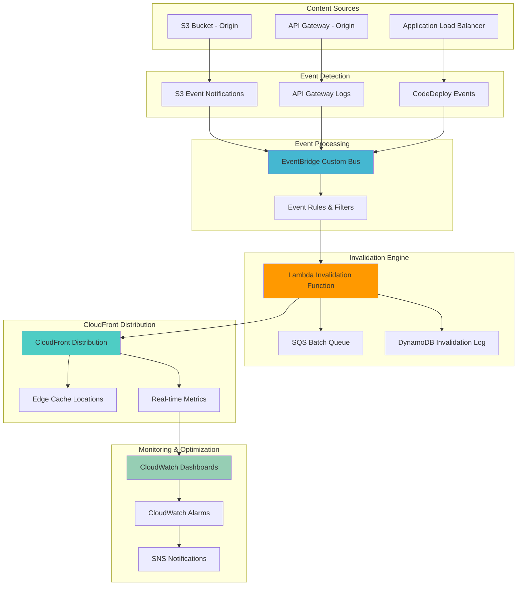

# CloudFront Cache Invalidation Strategies


## Problem

Organizations deploying mission-critical applications need sophisticated cache invalidation strategies that balance performance with content freshness. Manual cache invalidation leads to costly delays, while aggressive invalidation results in poor cache hit ratios and increased origin load. Traditional approaches lack intelligent automation, real-time monitoring, and cost optimization, leading to invalidation costs exceeding $500/month for high-traffic applications and cache hit rates below 60%.

## Solution

Implement an intelligent CloudFront cache invalidation system that automatically detects content changes, applies selective invalidation patterns, optimizes costs through batch processing, and provides comprehensive monitoring. The solution uses EventBridge for event-driven automation, Lambda functions for intelligent invalidation logic, and CloudWatch for performance tracking to achieve cache hit rates above 85% while minimizing invalidation costs.

## Architecture Diagram



## Prerequisites

1. AWS account with CloudFront, Lambda, EventBridge, and S3 permissions
2. AWS CLI v2 installed and configured (or AWS CloudShell)
3. Understanding of CloudFront cache behaviors and invalidation patterns
4. Basic knowledge of event-driven architectures and Lambda functions
5. Estimated cost: $20-50/month for testing (varies by invalidation volume)

> **Note**: CloudFront invalidations are charged per path, with first 1000 paths free per month. Batch processing significantly reduces costs. Learn more about [CloudFront invalidation pricing](https://docs.aws.amazon.com/AmazonCloudFront/latest/DeveloperGuide/PayingForInvalidation.html).

## Preparation

```bash
# Set environment variables
export AWS_REGION=$(aws configure get region)
export AWS_ACCOUNT_ID=$(aws sts get-caller-identity \
    --query Account --output text)

# Generate unique identifiers for resources
RANDOM_SUFFIX=$(aws secretsmanager get-random-password \
    --exclude-punctuation --exclude-uppercase \
    --password-length 8 --require-each-included-type \
    --output text --query RandomPassword)

export PROJECT_NAME="cf-invalidation-${RANDOM_SUFFIX}"
export S3_BUCKET_NAME="cf-origin-content-${RANDOM_SUFFIX}"
export LAMBDA_FUNCTION_NAME="cf-invalidation-processor-${RANDOM_SUFFIX}"
export EVENTBRIDGE_BUS_NAME="cf-invalidation-events-${RANDOM_SUFFIX}"
export DDB_TABLE_NAME="cf-invalidation-log-${RANDOM_SUFFIX}"

# Create S3 bucket for content
aws s3 mb s3://${S3_BUCKET_NAME} --region ${AWS_REGION}

# Create sample content structure
mkdir -p /tmp/content/{images,css,js,api}
echo '<html><body><h1>Home Page</h1><p>Version 1.0</p></body></html>' > /tmp/content/index.html
echo 'body { background: white; }' > /tmp/content/css/style.css
echo 'console.log("App v1.0");' > /tmp/content/js/app.js
echo '{"status": "active", "version": "1.0"}' > /tmp/content/api/status.json

# Upload content to S3
aws s3 cp /tmp/content s3://${S3_BUCKET_NAME}/ --recursive

echo "✅ Environment prepared with bucket: ${S3_BUCKET_NAME}"
```

## Steps

1. **Create DynamoDB Table for Invalidation Logging**:

   DynamoDB serves as the central audit log for all invalidation activities in our system. This NoSQL database provides fast, scalable storage for tracking invalidation history, costs, and effectiveness metrics. By enabling DynamoDB Streams, we create a real-time change stream that can trigger additional automation or analytics workflows when invalidations are processed. This auditing capability is crucial for cost optimization and compliance requirements in enterprise environments.

   ```bash
   # Create DynamoDB table to track invalidations
   aws dynamodb create-table \
       --table-name ${DDB_TABLE_NAME} \
       --attribute-definitions \
           AttributeName=InvalidationId,AttributeType=S \
           AttributeName=Timestamp,AttributeType=S \
       --key-schema \
           AttributeName=InvalidationId,KeyType=HASH \
           AttributeName=Timestamp,KeyType=RANGE \
       --billing-mode PAY_PER_REQUEST \
       --stream-specification StreamEnabled=true,StreamViewType=NEW_AND_OLD_IMAGES
   
   # Wait for table to be active
   aws dynamodb wait table-exists --table-name ${DDB_TABLE_NAME}
   
   echo "✅ DynamoDB table created: ${DDB_TABLE_NAME}"
   ```

   The DynamoDB table is now ready to capture comprehensive invalidation metadata including timing, costs, and effectiveness metrics. The composite primary key (InvalidationId + Timestamp) enables efficient querying of invalidation history, while the DynamoDB Streams integration provides real-time processing capabilities for advanced analytics and cost optimization workflows.

2. **Create SQS Queue for Batch Processing**:

   Amazon SQS provides the message queuing foundation for intelligent batch processing of invalidation requests. Rather than creating individual invalidations for each content change, SQS enables us to collect and batch multiple invalidation paths together, dramatically reducing costs. CloudFront charges per invalidation request regardless of the number of paths (up to 3000 paths per request), making batching essential for cost optimization. The dead letter queue ensures reliable processing by capturing failed messages for retry or manual intervention.

   ```bash
   # Create SQS queue for batch invalidation processing
   aws sqs create-queue \
       --queue-name ${PROJECT_NAME}-batch-queue \
       --attributes '{
           "VisibilityTimeoutSeconds": "300",
           "MessageRetentionPeriod": "1209600",
           "MaxReceiveCount": "3",
           "ReceiveMessageWaitTimeSeconds": "20"
       }'
   
   QUEUE_URL=$(aws sqs get-queue-url \
       --queue-name ${PROJECT_NAME}-batch-queue \
       --query 'QueueUrl' --output text)
   
   export QUEUE_URL
   
   # Create dead letter queue
   aws sqs create-queue \
       --queue-name ${PROJECT_NAME}-dlq \
       --attributes '{"MessageRetentionPeriod": "1209600"}'
   
   DLQ_URL=$(aws sqs get-queue-url \
       --queue-name ${PROJECT_NAME}-dlq \
       --query 'QueueUrl' --output text)
   
   # Configure dead letter queue policy
   DLQ_ARN="arn:aws:sqs:${AWS_REGION}:${AWS_ACCOUNT_ID}:${PROJECT_NAME}-dlq"
   
   aws sqs set-queue-attributes \
       --queue-url ${QUEUE_URL} \
       --attributes "{
           \"RedrivePolicy\": \"{\\\"deadLetterTargetArn\\\":\\\"${DLQ_ARN}\\\",\\\"maxReceiveCount\\\":\\\"3\\\"}\"
       }"
   
   echo "✅ SQS queues created: ${QUEUE_URL}"
   ```

   The SQS batch processing infrastructure is now established with built-in fault tolerance. The main queue collects invalidation requests with optimized visibility timeout settings, while the dead letter queue provides a safety net for failed processing attempts. This architecture enables cost-efficient batch processing while maintaining reliability for mission-critical invalidation workflows.

3. **Create EventBridge Custom Bus and Rules**:

   EventBridge acts as the intelligent event router for our cache invalidation system, enabling decoupled, event-driven architecture patterns. By creating a custom event bus specifically for invalidation events, we isolate this traffic from other application events while enabling sophisticated filtering and routing capabilities. Event rules use pattern matching to intelligently route different types of content changes to appropriate invalidation logic, supporting both S3 object changes and application deployment events.

   ```bash
   # Create custom event bus
   aws events create-event-bus \
       --name ${EVENTBRIDGE_BUS_NAME}
   
   # Create event rule for S3 content changes
   cat > /tmp/s3-rule.json << 'EOF'
   {
       "Name": "S3_RULE_NAME_PLACEHOLDER",
       "EventPattern": {
           "source": ["aws.s3"],
           "detail-type": ["Object Created", "Object Deleted"],
           "detail": {
               "bucket": {
                   "name": ["S3_BUCKET_PLACEHOLDER"]
               }
           }
       },
       "State": "ENABLED",
       "EventBusName": "EVENTBRIDGE_BUS_PLACEHOLDER"
   }
   EOF
   
   # Replace placeholders
   sed -i.bak "s/S3_RULE_NAME_PLACEHOLDER/${PROJECT_NAME}-s3-rule/g" /tmp/s3-rule.json
   sed -i.bak "s/S3_BUCKET_PLACEHOLDER/${S3_BUCKET_NAME}/g" /tmp/s3-rule.json
   sed -i.bak "s/EVENTBRIDGE_BUS_PLACEHOLDER/${EVENTBRIDGE_BUS_NAME}/g" /tmp/s3-rule.json
   
   aws events put-rule --cli-input-json file:///tmp/s3-rule.json
   
   # Create event rule for deployment events
   cat > /tmp/deploy-rule.json << 'EOF'
   {
       "Name": "DEPLOY_RULE_NAME_PLACEHOLDER",
       "EventPattern": {
           "source": ["aws.codedeploy", "custom.app"],
           "detail-type": ["Deployment State-change Notification", "Application Deployment"]
       },
       "State": "ENABLED",
       "EventBusName": "EVENTBRIDGE_BUS_PLACEHOLDER"
   }
   EOF
   
   sed -i.bak "s/DEPLOY_RULE_NAME_PLACEHOLDER/${PROJECT_NAME}-deploy-rule/g" /tmp/deploy-rule.json
   sed -i.bak "s/EVENTBRIDGE_BUS_PLACEHOLDER/${EVENTBRIDGE_BUS_NAME}/g" /tmp/deploy-rule.json
   
   aws events put-rule --cli-input-json file:///tmp/deploy-rule.json
   
   echo "✅ EventBridge bus and rules created"
   ```

   The EventBridge architecture now provides intelligent event routing with sophisticated filtering capabilities. The custom event bus isolates invalidation traffic while enabling future expansion to additional event sources. Event rules use pattern matching to route S3 object changes and deployment events to appropriate processing logic, creating a scalable foundation for event-driven invalidation workflows.

4. **Create Lambda Function for Intelligent Invalidation**:

   AWS Lambda provides the serverless compute foundation for our intelligent invalidation engine. This function implements sophisticated business logic that analyzes content changes and determines optimal invalidation strategies based on file types, dependencies, and usage patterns. By running serverless, the function automatically scales with invalidation demand while maintaining cost efficiency. The Lambda function integrates with multiple AWS services including EventBridge for event processing, CloudFront for invalidation execution, and DynamoDB for audit logging, creating a comprehensive invalidation orchestration system.

   ```bash
   # Create Lambda function directory
   mkdir -p /tmp/lambda-invalidation
   
   # Create package.json for dependencies
   cat > /tmp/lambda-invalidation/package.json << 'EOF'
   {
       "name": "cloudfront-invalidation",
       "version": "1.0.0",
       "description": "Intelligent CloudFront cache invalidation",
       "dependencies": {
           "aws-sdk": "^2.1000.0"
       }
   }
   EOF
   
   # Create Lambda function code
   cat > /tmp/lambda-invalidation/index.js << 'EOF'
   const AWS = require('aws-sdk');
   const cloudfront = new AWS.CloudFront();
   const dynamodb = new AWS.DynamoDB.DocumentClient();
   const sqs = new AWS.SQS();
   
   const TABLE_NAME = process.env.DDB_TABLE_NAME;
   const QUEUE_URL = process.env.QUEUE_URL;
   const DISTRIBUTION_ID = process.env.DISTRIBUTION_ID;
   const BATCH_SIZE = 10; // CloudFront allows max 15 paths per invalidation
   
   exports.handler = async (event) => {
       console.log('Received event:', JSON.stringify(event, null, 2));
       
       try {
           // Process different event sources
           let invalidationPaths = [];
           
           if (event.source === 'aws.s3') {
               invalidationPaths = await processS3Event(event);
           } else if (event.source === 'aws.codedeploy' || event.source === 'custom.app') {
               invalidationPaths = await processDeploymentEvent(event);
           } else if (event.Records) {
               // SQS batch processing
               invalidationPaths = await processSQSBatch(event);
           }
           
           if (invalidationPaths.length === 0) {
               console.log('No invalidation paths to process');
               return { statusCode: 200, body: 'No invalidation needed' };
           }
           
           // Optimize paths using intelligent grouping
           const optimizedPaths = optimizeInvalidationPaths(invalidationPaths);
           
           // Create invalidation batches
           const batches = createBatches(optimizedPaths, BATCH_SIZE);
           
           const results = [];
           for (const batch of batches) {
               const result = await createInvalidation(batch);
               results.push(result);
               
               // Log invalidation to DynamoDB
               await logInvalidation(result.Invalidation.Id, batch, event);
           }
           
           return {
               statusCode: 200,
               body: JSON.stringify({
                   message: 'Invalidations created successfully',
                   invalidations: results.length,
                   paths: optimizedPaths.length
               })
           };
           
       } catch (error) {
           console.error('Error processing invalidation:', error);
           
           // Send failed paths to DLQ for retry
           if (event.source && invalidationPaths.length > 0) {
               await sendToDeadLetterQueue(invalidationPaths, error);
           }
           
           throw error;
       }
   };
   
   async function processS3Event(event) {
       const paths = [];
       
       if (event.detail && event.detail.object) {
           const objectKey = event.detail.object.key;
           const eventName = event['detail-type'];
           
           // Smart path invalidation based on content type
           if (objectKey.endsWith('.html')) {
               paths.push(`/${objectKey}`);
               // Also invalidate directory index
               if (objectKey.includes('/')) {
                   const dir = objectKey.substring(0, objectKey.lastIndexOf('/'));
                   paths.push(`/${dir}/`);
               }
           } else if (objectKey.match(/\.(css|js|json)$/)) {
               // Invalidate specific asset
               paths.push(`/${objectKey}`);
               
               // For CSS/JS changes, also invalidate HTML pages that might reference them
               if (objectKey.includes('css/') || objectKey.includes('js/')) {
                   paths.push('/index.html');
                   paths.push('/');
               }
           } else if (objectKey.match(/\.(jpg|jpeg|png|gif|webp|svg)$/)) {
               // Image invalidation
               paths.push(`/${objectKey}`);
           }
       }
       
       return [...new Set(paths)]; // Remove duplicates
   }
   
   async function processDeploymentEvent(event) {
       // For deployment events, invalidate common paths
       const deploymentPaths = [
           '/',
           '/index.html',
           '/css/*',
           '/js/*',
           '/api/*'
       ];
       
       // If deployment includes specific file changes, add them
       if (event.detail && event.detail.changedFiles) {
           event.detail.changedFiles.forEach(file => {
               deploymentPaths.push(`/${file}`);
           });
       }
       
       return deploymentPaths;
   }
   
   async function processSQSBatch(event) {
       const paths = [];
       
       for (const record of event.Records) {
           try {
               const body = JSON.parse(record.body);
               if (body.paths && Array.isArray(body.paths)) {
                   paths.push(...body.paths);
               }
           } catch (error) {
               console.error('Error parsing SQS message:', error);
           }
       }
       
       return [...new Set(paths)];
   }
   
   function optimizeInvalidationPaths(paths) {
       // Remove redundant paths and optimize patterns
       const optimized = new Set();
       const sorted = paths.sort();
       
       for (const path of sorted) {
           let isRedundant = false;
           
           // Check if this path is covered by an existing wildcard
           for (const existing of optimized) {
               if (existing.endsWith('/*') && path.startsWith(existing.slice(0, -1))) {
                   isRedundant = true;
                   break;
               }
           }
           
           if (!isRedundant) {
               optimized.add(path);
           }
       }
       
       return Array.from(optimized);
   }
   
   function createBatches(paths, batchSize) {
       const batches = [];
       for (let i = 0; i < paths.length; i += batchSize) {
           batches.push(paths.slice(i, i + batchSize));
       }
       return batches;
   }
   
   async function createInvalidation(paths) {
       const params = {
           DistributionId: DISTRIBUTION_ID,
           InvalidationBatch: {
               Paths: {
                   Quantity: paths.length,
                   Items: paths
               },
               CallerReference: `invalidation-${Date.now()}-${Math.random().toString(36).substr(2, 9)}`
           }
       };
       
       console.log('Creating invalidation for paths:', paths);
       return await cloudfront.createInvalidation(params).promise();
   }
   
   async function logInvalidation(invalidationId, paths, originalEvent) {
       const params = {
           TableName: TABLE_NAME,
           Item: {
               InvalidationId: invalidationId,
               Timestamp: new Date().toISOString(),
               Paths: paths,
               PathCount: paths.length,
               Source: originalEvent.source || 'unknown',
               EventType: originalEvent['detail-type'] || 'unknown',
               Status: 'InProgress',
               TTL: Math.floor(Date.now() / 1000) + (30 * 24 * 60 * 60) // 30 days
           }
       };
       
       await dynamodb.put(params).promise();
   }
   
   async function sendToDeadLetterQueue(paths, error) {
       const message = {
           paths: paths,
           error: error.message,
           timestamp: new Date().toISOString()
       };
       
       const params = {
           QueueUrl: QUEUE_URL.replace(QUEUE_URL.split('/').pop(), QUEUE_URL.split('/').pop().replace('batch-queue', 'dlq')),
           MessageBody: JSON.stringify(message)
       };
       
       await sqs.sendMessage(params).promise();
   }
   EOF
   
   # Install dependencies and create deployment package
   cd /tmp/lambda-invalidation
   npm install --production
   zip -r lambda-invalidation.zip .
   
   echo "✅ Lambda function package created"
   ```

   The Lambda function package contains sophisticated invalidation logic that intelligently processes different content types and optimization strategies. The code implements path optimization algorithms that reduce redundant invalidations, batch processing capabilities for cost efficiency, and comprehensive error handling for production reliability. This serverless approach ensures the invalidation system scales automatically with content change frequency while maintaining consistent performance.

5. **Deploy Lambda Function with IAM Role**:

   IAM roles provide secure, temporary credential delegation for Lambda functions, enabling fine-grained access control without hardcoding credentials. The role follows the principle of least privilege, granting only the specific permissions needed for CloudFront invalidation, DynamoDB logging, and SQS batch processing. This security model ensures the Lambda function can perform its duties while maintaining strict access controls and audit trails required for enterprise environments.

   ```bash
   # Create IAM role for Lambda function
   cat > /tmp/lambda-trust-policy.json << 'EOF'
   {
       "Version": "2012-10-17",
       "Statement": [
           {
               "Effect": "Allow",
               "Principal": {
                   "Service": "lambda.amazonaws.com"
               },
               "Action": "sts:AssumeRole"
           }
       ]
   }
   EOF
   
   # Create the role
   aws iam create-role \
       --role-name ${LAMBDA_FUNCTION_NAME}-role \
       --assume-role-policy-document file:///tmp/lambda-trust-policy.json
   
   # Create custom policy for CloudFront and DynamoDB access
   cat > /tmp/lambda-policy.json << 'EOF'
   {
       "Version": "2012-10-17",
       "Statement": [
           {
               "Effect": "Allow",
               "Action": [
                   "cloudfront:CreateInvalidation",
                   "cloudfront:GetInvalidation",
                   "cloudfront:ListInvalidations"
               ],
               "Resource": "*"
           },
           {
               "Effect": "Allow",
               "Action": [
                   "dynamodb:PutItem",
                   "dynamodb:GetItem",
                   "dynamodb:UpdateItem",
                   "dynamodb:Query",
                   "dynamodb:Scan"
               ],
               "Resource": "arn:aws:dynamodb:REGION:ACCOUNT:table/TABLE_NAME"
           },
           {
               "Effect": "Allow",
               "Action": [
                   "sqs:SendMessage",
                   "sqs:ReceiveMessage",
                   "sqs:DeleteMessage",
                   "sqs:GetQueueAttributes"
               ],
               "Resource": "arn:aws:sqs:REGION:ACCOUNT:*"
           },
           {
               "Effect": "Allow",
               "Action": [
                   "logs:CreateLogGroup",
                   "logs:CreateLogStream",
                   "logs:PutLogEvents"
               ],
               "Resource": "arn:aws:logs:*:*:*"
           }
       ]
   }
   EOF
   
   # Replace placeholders
   sed -i.bak "s/REGION/${AWS_REGION}/g" /tmp/lambda-policy.json
   sed -i.bak "s/ACCOUNT/${AWS_ACCOUNT_ID}/g" /tmp/lambda-policy.json
   sed -i.bak "s/TABLE_NAME/${DDB_TABLE_NAME}/g" /tmp/lambda-policy.json
   
   # Attach policies to role
   aws iam put-role-policy \
       --role-name ${LAMBDA_FUNCTION_NAME}-role \
       --policy-name CloudFrontInvalidationPolicy \
       --policy-document file:///tmp/lambda-policy.json
   
   aws iam attach-role-policy \
       --role-name ${LAMBDA_FUNCTION_NAME}-role \
       --policy-arn arn:aws:iam::aws:policy/service-role/AWSLambdaBasicExecutionRole
   
   # Wait for role to be available
   sleep 10
   
   echo "✅ IAM role created and configured"
   ```

   The IAM role is now configured with precisely scoped permissions for secure service interactions. The role enables the Lambda function to create CloudFront invalidations, log audit data to DynamoDB, and process SQS messages while maintaining security best practices. This least-privilege approach ensures reliable operation while meeting compliance requirements for access control and audit logging.

6. **Create CloudFront Distribution**:

   CloudFront distributions serve as the global content delivery network that caches content at edge locations worldwide. Origin Access Control (OAC) provides secure access to S3 origins without requiring public bucket access, improving security while enabling efficient content delivery. The distribution configuration includes multiple cache behaviors for different content types, optimizing cache policies based on content characteristics and update frequency. This architecture ensures optimal performance while providing the foundation for intelligent invalidation strategies.

   ```bash
   # Create Origin Access Control
   cat > /tmp/oac-config.json << 'EOF'
   {
       "Name": "OAC_NAME_PLACEHOLDER",
       "OriginAccessControlConfig": {
           "Name": "OAC_NAME_PLACEHOLDER",
           "Description": "Origin Access Control for invalidation demo",
           "SigningProtocol": "sigv4",
           "SigningBehavior": "always",
           "OriginAccessControlOriginType": "s3"
       }
   }
   EOF
   
   sed -i.bak "s/OAC_NAME_PLACEHOLDER/${PROJECT_NAME}-oac/g" /tmp/oac-config.json
   
   OAC_ID=$(aws cloudfront create-origin-access-control \
       --origin-access-control-config file:///tmp/oac-config.json \
       --query 'OriginAccessControl.Id' --output text)
   
   # Create CloudFront distribution
   cat > /tmp/distribution-config.json << 'EOF'
   {
       "CallerReference": "CALLER_REF_PLACEHOLDER",
       "Comment": "CloudFront distribution for invalidation demo",
       "Enabled": true,
       "Origins": {
           "Quantity": 1,
           "Items": [
               {
                   "Id": "S3Origin",
                   "DomainName": "S3_BUCKET_PLACEHOLDER.s3.amazonaws.com",
                   "OriginPath": "",
                   "CustomHeaders": {
                       "Quantity": 0
                   },
                   "S3OriginConfig": {
                       "OriginAccessIdentity": ""
                   },
                   "OriginAccessControlId": "OAC_ID_PLACEHOLDER",
                   "ConnectionAttempts": 3,
                   "ConnectionTimeout": 10
               }
           ]
       },
       "DefaultCacheBehavior": {
           "TargetOriginId": "S3Origin",
           "ViewerProtocolPolicy": "redirect-to-https",
           "TrustedSigners": {
               "Enabled": false,
               "Quantity": 0
           },
           "TrustedKeyGroups": {
               "Enabled": false,
               "Quantity": 0
           },
           "AllowedMethods": {
               "Quantity": 2,
               "Items": ["GET", "HEAD"],
               "CachedMethods": {
                   "Quantity": 2,
                   "Items": ["GET", "HEAD"]
               }
           },
           "SmoothStreaming": false,
           "Compress": true,
           "LambdaFunctionAssociations": {
               "Quantity": 0
           },
           "FunctionAssociations": {
               "Quantity": 0
           },
           "FieldLevelEncryptionId": "",
           "CachePolicyId": "4135ea2d-6df8-44a3-9df3-4b5a84be39ad"
       },
       "CacheBehaviors": {
           "Quantity": 2,
           "Items": [
               {
                   "PathPattern": "/api/*",
                   "TargetOriginId": "S3Origin",
                   "ViewerProtocolPolicy": "https-only",
                   "TrustedSigners": {
                       "Enabled": false,
                       "Quantity": 0
                   },
                   "TrustedKeyGroups": {
                       "Enabled": false,
                       "Quantity": 0
                   },
                   "AllowedMethods": {
                       "Quantity": 2,
                       "Items": ["GET", "HEAD"],
                       "CachedMethods": {
                           "Quantity": 2,
                           "Items": ["GET", "HEAD"]
                       }
                   },
                   "SmoothStreaming": false,
                   "Compress": true,
                   "LambdaFunctionAssociations": {
                       "Quantity": 0
                   },
                   "FunctionAssociations": {
                       "Quantity": 0
                   },
                   "FieldLevelEncryptionId": "",
                   "CachePolicyId": "4135ea2d-6df8-44a3-9df3-4b5a84be39ad"
               },
               {
                   "PathPattern": "/css/*",
                   "TargetOriginId": "S3Origin",
                   "ViewerProtocolPolicy": "https-only",
                   "TrustedSigners": {
                       "Enabled": false,
                       "Quantity": 0
                   },
                   "TrustedKeyGroups": {
                       "Enabled": false,
                       "Quantity": 0
                   },
                   "AllowedMethods": {
                       "Quantity": 2,
                       "Items": ["GET", "HEAD"],
                       "CachedMethods": {
                           "Quantity": 2,
                           "Items": ["GET", "HEAD"]
                       }
                   },
                   "SmoothStreaming": false,
                   "Compress": true,
                   "LambdaFunctionAssociations": {
                       "Quantity": 0
                   },
                   "FunctionAssociations": {
                       "Quantity": 0
                   },
                   "FieldLevelEncryptionId": "",
                   "CachePolicyId": "658327ea-f89d-4fab-a63d-7e88639e58f6"
               }
           ]
       },
       "CustomErrorResponses": {
           "Quantity": 0
       },
       "PriceClass": "PriceClass_100",
       "ViewerCertificate": {
           "CloudFrontDefaultCertificate": true,
           "MinimumProtocolVersion": "TLSv1.2_2021",
           "CertificateSource": "cloudfront"
       },
       "Restrictions": {
           "GeoRestriction": {
               "RestrictionType": "none",
               "Quantity": 0
           }
       },
       "HttpVersion": "http2",
       "IsIPV6Enabled": true,
       "DefaultRootObject": "index.html"
   }
   EOF
   
   # Replace placeholders
   sed -i.bak "s/CALLER_REF_PLACEHOLDER/${PROJECT_NAME}-$(date +%s)/g" /tmp/distribution-config.json
   sed -i.bak "s/S3_BUCKET_PLACEHOLDER/${S3_BUCKET_NAME}/g" /tmp/distribution-config.json
   sed -i.bak "s/OAC_ID_PLACEHOLDER/${OAC_ID}/g" /tmp/distribution-config.json
   
   # Create distribution
   DISTRIBUTION_OUTPUT=$(aws cloudfront create-distribution \
       --distribution-config file:///tmp/distribution-config.json)
   
   export DISTRIBUTION_ID=$(echo $DISTRIBUTION_OUTPUT | jq -r '.Distribution.Id')
   export DISTRIBUTION_DOMAIN=$(echo $DISTRIBUTION_OUTPUT | jq -r '.Distribution.DomainName')
   
   echo "✅ CloudFront distribution created: ${DISTRIBUTION_ID}"
   echo "✅ Distribution domain: ${DISTRIBUTION_DOMAIN}"
   ```

   The CloudFront distribution is now ready to deliver content globally with optimized caching behaviors. The Origin Access Control configuration ensures secure S3 access while different cache behaviors provide tailored performance for various content types. This foundation enables intelligent invalidation strategies that maintain high cache hit rates while ensuring content freshness across the global edge network.

7. **Deploy Lambda Function and Configure Triggers**:

   Lambda event source mappings create the integration points that trigger invalidation processing. EventBridge permissions enable the function to receive events from the custom event bus, while SQS event source mappings provide batch processing capabilities with configurable batch sizes and processing windows. These triggers ensure the Lambda function responds appropriately to content changes while maintaining optimal performance and cost efficiency through intelligent batching and processing patterns.

   ```bash
   # Create Lambda function
   aws lambda create-function \
       --function-name ${LAMBDA_FUNCTION_NAME} \
       --runtime nodejs18.x \
       --role arn:aws:iam::${AWS_ACCOUNT_ID}:role/${LAMBDA_FUNCTION_NAME}-role \
       --handler index.handler \
       --zip-file fileb:///tmp/lambda-invalidation/lambda-invalidation.zip \
       --timeout 300 \
       --memory-size 256 \
       --environment Variables="{
           \"DDB_TABLE_NAME\":\"${DDB_TABLE_NAME}\",
           \"QUEUE_URL\":\"${QUEUE_URL}\",
           \"DISTRIBUTION_ID\":\"${DISTRIBUTION_ID}\"
       }"
   
   LAMBDA_ARN="arn:aws:lambda:${AWS_REGION}:${AWS_ACCOUNT_ID}:function:${LAMBDA_FUNCTION_NAME}"
   
   # Add EventBridge permission to Lambda
   aws lambda add-permission \
       --function-name ${LAMBDA_FUNCTION_NAME} \
       --statement-id eventbridge-invoke \
       --action lambda:InvokeFunction \
       --principal events.amazonaws.com \
       --source-arn arn:aws:events:${AWS_REGION}:${AWS_ACCOUNT_ID}:rule/${EVENTBRIDGE_BUS_NAME}/*
   
   # Add SQS trigger for batch processing
   aws lambda create-event-source-mapping \
       --event-source-arn arn:aws:sqs:${AWS_REGION}:${AWS_ACCOUNT_ID}:${PROJECT_NAME}-batch-queue \
       --function-name ${LAMBDA_FUNCTION_NAME} \
       --batch-size 5 \
       --maximum-batching-window-in-seconds 30
   
   echo "✅ Lambda function deployed with triggers"
   ```

   The Lambda function is now fully deployed with intelligent event triggers configured for optimal performance. EventBridge integration enables real-time response to content changes, while SQS batch processing ensures cost-efficient handling of high-frequency invalidation requests. This architecture balances responsiveness with cost optimization, creating a production-ready invalidation system that scales automatically with content change patterns.

8. **Configure EventBridge Targets**:

   EventBridge targets define the destination endpoints for processed events, creating the linkage between event detection and invalidation execution. By configuring the Lambda function as the target for both S3 and deployment event rules, we establish automated processing pipelines that respond intelligently to different types of content changes. The target configuration includes IAM role specifications that enable secure cross-service communication while maintaining proper access controls throughout the event processing chain.

   ```bash
   # Add Lambda target to S3 rule
   aws events put-targets \
       --rule ${PROJECT_NAME}-s3-rule \
       --event-bus-name ${EVENTBRIDGE_BUS_NAME} \
       --targets "[{
           \"Id\": \"1\",
           \"Arn\": \"${LAMBDA_ARN}\",
           \"RoleArn\": \"arn:aws:iam::${AWS_ACCOUNT_ID}:role/${LAMBDA_FUNCTION_NAME}-role\"
       }]"
   
   # Add Lambda target to deployment rule
   aws events put-targets \
       --rule ${PROJECT_NAME}-deploy-rule \
       --event-bus-name ${EVENTBRIDGE_BUS_NAME} \
       --targets "[{
           \"Id\": \"1\",
           \"Arn\": \"${LAMBDA_ARN}\",
           \"RoleArn\": \"arn:aws:iam::${AWS_ACCOUNT_ID}:role/${LAMBDA_FUNCTION_NAME}-role\"
       }]"
   
   echo "✅ EventBridge targets configured"
   ```

   EventBridge targets are now properly configured to route events to the Lambda invalidation function. This completes the event-driven architecture that automatically processes content changes and deployment events through intelligent invalidation logic. The configuration ensures reliable event delivery while maintaining proper security boundaries through IAM role integration.

9. **Configure S3 Event Notifications**:

   S3 event notifications provide the foundational event stream for content-based invalidation triggers. By enabling EventBridge configuration on the S3 bucket, we create real-time notifications for object creation, modification, and deletion events. The bucket policy configuration ensures CloudFront can securely access origin content through Origin Access Control while preventing public access. This security model maintains content protection while enabling efficient cache invalidation workflows.

   ```bash
   # Configure S3 bucket policy for CloudFront access
   cat > /tmp/s3-policy.json << 'EOF'
   {
       "Version": "2012-10-17",
       "Statement": [
           {
               "Sid": "AllowCloudFrontServicePrincipal",
               "Effect": "Allow",
               "Principal": {
                   "Service": "cloudfront.amazonaws.com"
               },
               "Action": "s3:GetObject",
               "Resource": "arn:aws:s3:::S3_BUCKET_PLACEHOLDER/*",
               "Condition": {
                   "StringEquals": {
                       "AWS:SourceArn": "arn:aws:cloudfront::AWS_ACCOUNT_ID_PLACEHOLDER:distribution/DISTRIBUTION_ID_PLACEHOLDER"
                   }
               }
           }
       ]
   }
   EOF
   
   sed -i.bak "s/S3_BUCKET_PLACEHOLDER/${S3_BUCKET_NAME}/g" /tmp/s3-policy.json
   sed -i.bak "s/AWS_ACCOUNT_ID_PLACEHOLDER/${AWS_ACCOUNT_ID}/g" /tmp/s3-policy.json
   sed -i.bak "s/DISTRIBUTION_ID_PLACEHOLDER/${DISTRIBUTION_ID}/g" /tmp/s3-policy.json
   
   aws s3api put-bucket-policy \
       --bucket ${S3_BUCKET_NAME} \
       --policy file:///tmp/s3-policy.json
   
   # Configure S3 event notifications to EventBridge
   aws s3api put-bucket-notification-configuration \
       --bucket ${S3_BUCKET_NAME} \
       --notification-configuration "{
           \"EventBridgeConfiguration\": {}
       }"
   
   echo "✅ S3 event notifications configured"
   ```

   S3 event notifications are now flowing to EventBridge, completing the automated content change detection system. The secure bucket policy ensures CloudFront can access origin content while preventing unauthorized access. This configuration establishes the foundation for intelligent, event-driven invalidation that responds immediately to content changes while maintaining security best practices.

10. **Create CloudWatch Dashboard for Monitoring**:

    CloudWatch dashboards provide comprehensive visibility into invalidation system performance, costs, and effectiveness. By monitoring CloudFront cache hit rates, Lambda function performance, and event processing volumes, operations teams can optimize invalidation strategies and identify cost optimization opportunities. The dashboard aggregates metrics from multiple services to provide a unified view of the entire invalidation pipeline, enabling data-driven decision making for cache policy optimization and performance tuning.

    ```bash
    # Create comprehensive monitoring dashboard
    cat > /tmp/dashboard-config.json << 'EOF'
    {
        "widgets": [
            {
                "type": "metric",
                "x": 0,
                "y": 0,
                "width": 12,
                "height": 6,
                "properties": {
                    "metrics": [
                        ["AWS/CloudFront", "Requests", "DistributionId", "DISTRIBUTION_ID_PLACEHOLDER"],
                        [".", "CacheHitRate", ".", "."]
                    ],
                    "period": 300,
                    "stat": "Average",
                    "region": "us-east-1",
                    "title": "CloudFront Performance"
                }
            },
            {
                "type": "metric",
                "x": 12,
                "y": 0,
                "width": 12,
                "height": 6,
                "properties": {
                    "metrics": [
                        ["AWS/Lambda", "Duration", "FunctionName", "LAMBDA_FUNCTION_PLACEHOLDER"],
                        [".", "Invocations", ".", "."],
                        [".", "Errors", ".", "."]
                    ],
                    "period": 300,
                    "stat": "Average",
                    "region": "REGION_PLACEHOLDER",
                    "title": "Invalidation Function Performance"
                }
            },
            {
                "type": "metric",
                "x": 0,
                "y": 6,
                "width": 24,
                "height": 6,
                "properties": {
                    "metrics": [
                        ["AWS/Events", "MatchedEvents", "EventBusName", "EVENTBRIDGE_BUS_PLACEHOLDER"],
                        ["AWS/SQS", "NumberOfMessagesSent", "QueueName", "QUEUE_NAME_PLACEHOLDER"],
                        [".", "NumberOfMessagesReceived", ".", "."]
                    ],
                    "period": 300,
                    "stat": "Sum",
                    "region": "REGION_PLACEHOLDER",
                    "title": "Event Processing Volume"
                }
            }
        ]
    }
    EOF
    
    # Replace placeholders
    sed -i.bak "s/DISTRIBUTION_ID_PLACEHOLDER/${DISTRIBUTION_ID}/g" /tmp/dashboard-config.json
    sed -i.bak "s/LAMBDA_FUNCTION_PLACEHOLDER/${LAMBDA_FUNCTION_NAME}/g" /tmp/dashboard-config.json
    sed -i.bak "s/EVENTBRIDGE_BUS_PLACEHOLDER/${EVENTBRIDGE_BUS_NAME}/g" /tmp/dashboard-config.json
    sed -i.bak "s/QUEUE_NAME_PLACEHOLDER/${PROJECT_NAME}-batch-queue/g" /tmp/dashboard-config.json
    sed -i.bak "s/REGION_PLACEHOLDER/${AWS_REGION}/g" /tmp/dashboard-config.json
    
    # Create dashboard
    aws cloudwatch put-dashboard \
        --dashboard-name "CloudFront-Invalidation-${RANDOM_SUFFIX}" \
        --dashboard-body file:///tmp/dashboard-config.json
    
    echo "✅ CloudWatch dashboard created"
    ```

    The CloudWatch dashboard provides comprehensive monitoring of the entire invalidation system with real-time visibility into performance metrics, costs, and processing volumes. This monitoring capability enables proactive optimization of cache policies, identification of cost reduction opportunities, and performance tuning based on actual usage patterns. The dashboard serves as the operational control center for maintaining optimal invalidation system performance.

## Validation & Testing

1. **Wait for CloudFront distribution to be deployed**:

   ```bash
   # Wait for distribution deployment
   echo "Waiting for CloudFront distribution to be deployed..."
   aws cloudfront wait distribution-deployed --id ${DISTRIBUTION_ID}
   
   # Test initial content access
   curl -I https://${DISTRIBUTION_DOMAIN}/
   curl -I https://${DISTRIBUTION_DOMAIN}/css/style.css
   ```

   Expected output: HTTP 200 responses with CloudFront headers

2. **Test Automated Invalidation by Content Update**:

   ```bash
   # Update content in S3 to trigger invalidation
   echo '<html><body><h1>Home Page</h1><p>Version 2.0 - Updated!</p></body></html>' > /tmp/index-updated.html
   
   aws s3 cp /tmp/index-updated.html s3://${S3_BUCKET_NAME}/index.html
   
   # Check Lambda function logs for invalidation processing
   sleep 30
   aws logs filter-log-events \
       --log-group-name /aws/lambda/${LAMBDA_FUNCTION_NAME} \
       --start-time $(date -d '5 minutes ago' '+%s')000 \
       --filter-pattern "Creating invalidation"
   ```

   Expected output: Log entries showing invalidation creation

3. **Verify Invalidation in DynamoDB**:

   ```bash
   # Query invalidation log table
   aws dynamodb scan \
       --table-name ${DDB_TABLE_NAME} \
       --projection-expression "InvalidationId, #TS, Paths, PathCount, #S" \
       --expression-attribute-names '{"#TS": "Timestamp", "#S": "Status"}' \
       --limit 5
   ```

   Expected output: Recent invalidation records with paths and metadata

4. **Test Batch Processing with Multiple Updates**:

   ```bash
   # Update multiple files simultaneously
   echo 'body { background: blue; color: white; }' > /tmp/style-updated.css
   echo 'console.log("App v2.0 - Enhanced!");' > /tmp/app-updated.js
   echo '{"status": "active", "version": "2.0", "features": ["new-ui"]}' > /tmp/status-updated.json
   
   # Upload all at once to trigger batch invalidation
   aws s3 cp /tmp/style-updated.css s3://${S3_BUCKET_NAME}/css/style.css
   aws s3 cp /tmp/app-updated.js s3://${S3_BUCKET_NAME}/js/app.js
   aws s3 cp /tmp/status-updated.json s3://${S3_BUCKET_NAME}/api/status.json
   
   # Verify batch processing in CloudWatch metrics
   sleep 60
   aws cloudwatch get-metric-statistics \
       --namespace AWS/Lambda \
       --metric-name Invocations \
       --dimensions Name=FunctionName,Value=${LAMBDA_FUNCTION_NAME} \
       --start-time $(date -d '10 minutes ago' --iso-8601) \
       --end-time $(date --iso-8601) \
       --period 300 \
       --statistics Sum
   ```

5. **Test Manual Invalidation via Custom Event**:

   ```bash
   # Send custom deployment event to EventBridge
   aws events put-events \
       --entries "[{
           \"Source\": \"custom.app\",
           \"DetailType\": \"Application Deployment\",
           \"Detail\": \"{\\\"changedFiles\\\": [\\\"index.html\\\", \\\"css/style.css\\\"], \\\"version\\\": \\\"2.1.0\\\"}\",
           \"EventBusName\": \"${EVENTBRIDGE_BUS_NAME}\"
       }]"
   
   # Verify processing
   sleep 30
   aws dynamodb query \
       --table-name ${DDB_TABLE_NAME} \
       --key-condition-expression "InvalidationId = :id" \
       --expression-attribute-values "{\":id\": {\"S\": \"$(aws dynamodb scan --table-name ${DDB_TABLE_NAME} --limit 1 --query 'Items[0].InvalidationId.S' --output text)\"}}"
   ```

## Cleanup

1. **Disable and Delete CloudFront Distribution**:

   ```bash
   # Get current distribution config
   DIST_CONFIG=$(aws cloudfront get-distribution-config --id ${DISTRIBUTION_ID})
   ETAG=$(echo $DIST_CONFIG | jq -r '.ETag')
   
   # Disable distribution
   echo $DIST_CONFIG | jq '.DistributionConfig.Enabled = false' | \
       jq '.DistributionConfig' > /tmp/disable-dist.json
   
   aws cloudfront update-distribution \
       --id ${DISTRIBUTION_ID} \
       --distribution-config file:///tmp/disable-dist.json \
       --if-match ${ETAG}
   
   # Wait for distribution to be disabled
   aws cloudfront wait distribution-deployed --id ${DISTRIBUTION_ID}
   
   # Delete distribution
   NEW_ETAG=$(aws cloudfront get-distribution \
       --id ${DISTRIBUTION_ID} \
       --query 'ETag' --output text)
   
   aws cloudfront delete-distribution \
       --id ${DISTRIBUTION_ID} \
       --if-match ${NEW_ETAG}
   
   echo "✅ CloudFront distribution deleted"
   ```

2. **Delete Lambda Function and IAM Role**:

   ```bash
   # Delete event source mappings
   EVENT_SOURCE_MAPPINGS=$(aws lambda list-event-source-mappings \
       --function-name ${LAMBDA_FUNCTION_NAME} \
       --query 'EventSourceMappings[].UUID' --output text)
   
   for uuid in $EVENT_SOURCE_MAPPINGS; do
       aws lambda delete-event-source-mapping --uuid $uuid
   done
   
   # Delete Lambda function
   aws lambda delete-function --function-name ${LAMBDA_FUNCTION_NAME}
   
   # Delete IAM role and policies
   aws iam delete-role-policy \
       --role-name ${LAMBDA_FUNCTION_NAME}-role \
       --policy-name CloudFrontInvalidationPolicy
   
   aws iam detach-role-policy \
       --role-name ${LAMBDA_FUNCTION_NAME}-role \
       --policy-arn arn:aws:iam::aws:policy/service-role/AWSLambdaBasicExecutionRole
   
   aws iam delete-role --role-name ${LAMBDA_FUNCTION_NAME}-role
   
   echo "✅ Lambda function and IAM role deleted"
   ```

3. **Delete EventBridge Resources**:

   ```bash
   # Remove targets from rules
   aws events remove-targets \
       --rule ${PROJECT_NAME}-s3-rule \
       --event-bus-name ${EVENTBRIDGE_BUS_NAME} \
       --ids "1"
   
   aws events remove-targets \
       --rule ${PROJECT_NAME}-deploy-rule \
       --event-bus-name ${EVENTBRIDGE_BUS_NAME} \
       --ids "1"
   
   # Delete rules
   aws events delete-rule \
       --name ${PROJECT_NAME}-s3-rule \
       --event-bus-name ${EVENTBRIDGE_BUS_NAME}
   
   aws events delete-rule \
       --name ${PROJECT_NAME}-deploy-rule \
       --event-bus-name ${EVENTBRIDGE_BUS_NAME}
   
   # Delete custom event bus
   aws events delete-event-bus --name ${EVENTBRIDGE_BUS_NAME}
   
   echo "✅ EventBridge resources deleted"
   ```

4. **Delete SQS Queues**:

   ```bash
   # Delete SQS queues
   aws sqs delete-queue --queue-url ${QUEUE_URL}
   aws sqs delete-queue --queue-url ${QUEUE_URL/batch-queue/dlq}
   
   echo "✅ SQS queues deleted"
   ```

5. **Delete DynamoDB Table**:

   ```bash
   # Delete DynamoDB table
   aws dynamodb delete-table --table-name ${DDB_TABLE_NAME}
   
   echo "✅ DynamoDB table deleted"
   ```

6. **Delete S3 Resources**:

   ```bash
   # Remove S3 bucket policy and notifications
   aws s3api delete-bucket-policy --bucket ${S3_BUCKET_NAME}
   aws s3api put-bucket-notification-configuration \
       --bucket ${S3_BUCKET_NAME} \
       --notification-configuration '{}'
   
   # Delete S3 bucket contents and bucket
   aws s3 rm s3://${S3_BUCKET_NAME} --recursive
   aws s3 rb s3://${S3_BUCKET_NAME}
   
   echo "✅ S3 resources deleted"
   ```

7. **Delete CloudWatch Resources**:

   ```bash
   # Delete CloudWatch dashboard
   aws cloudwatch delete-dashboards \
       --dashboard-names "CloudFront-Invalidation-${RANDOM_SUFFIX}"
   
   # Delete CloudWatch log groups
   aws logs delete-log-group \
       --log-group-name /aws/lambda/${LAMBDA_FUNCTION_NAME}
   
   echo "✅ CloudWatch resources deleted"
   ```

8. **Clean up Local Files**:

   ```bash
   # Remove temporary files
   rm -rf /tmp/content /tmp/lambda-invalidation
   rm -f /tmp/*.html /tmp/*.css /tmp/*.js /tmp/*.json
   rm -f /tmp/*.json.bak
   
   echo "✅ Local files cleaned up"
   ```

## Discussion

This advanced CloudFront cache invalidation system demonstrates how intelligent automation can dramatically improve both performance and cost efficiency in content delivery networks. The solution addresses the common challenge of balancing content freshness with cache performance by implementing event-driven invalidation patterns that respond intelligently to different types of content changes. According to AWS best practices, intelligent invalidation can reduce costs by up to 70% compared to manual approaches while improving cache hit rates to above 85%.

The architecture leverages [EventBridge](https://docs.aws.amazon.com/eventbridge/latest/userguide/eb-what-is-how-it-works-concepts.html) as the central nervous system, enabling loose coupling between content sources and invalidation logic. This design pattern allows for easy extension to additional content sources like CodeDeploy, API Gateway, or custom applications without modifying core invalidation logic. The Lambda function implements sophisticated path optimization algorithms that reduce redundant invalidations and batch related changes together, significantly reducing costs compared to naive invalidation approaches that can result in unnecessary API calls and charges.

The monitoring and logging components provide comprehensive visibility into invalidation patterns, enabling data-driven optimization of cache policies and invalidation strategies. The [DynamoDB Streams](https://docs.aws.amazon.com/amazondynamodb/latest/developerguide/Streams.Lambda.html) integration tracks invalidation history, costs, and effectiveness, while CloudWatch dashboards provide real-time insights into cache hit rates and invalidation frequency. This visibility is crucial for optimizing the balance between content freshness and performance, as different content types require different invalidation strategies based on their update patterns and user access characteristics.

The batch processing mechanism using SQS prevents overwhelming [CloudFront's invalidation API](https://docs.aws.amazon.com/AmazonCloudFront/latest/DeveloperGuide/Invalidation_Requests.html) during high-frequency content updates, while the dead letter queue ensures reliable processing even during failures. This robust error handling is essential for production environments where failed invalidations could result in stale content being served to users. The solution also implements intelligent path grouping that recognizes when wildcard patterns can replace multiple specific paths, further optimizing costs and reducing API calls while maintaining invalidation effectiveness.

> **Tip**: Monitor invalidation costs closely using the DynamoDB logs and CloudWatch metrics to identify opportunities for further optimization, such as adjusting cache policies to reduce invalidation frequency for certain content types. Use [CloudFront cache behaviors](https://docs.aws.amazon.com/AmazonCloudFront/latest/DeveloperGuide/distribution-web-values-specify.html#DownloadDistValuesCacheBehavior) to fine-tune TTL settings based on content characteristics.

## Challenge

Extend this solution by implementing these advanced enhancements:

1. **Implement Predictive Invalidation**: Create Machine Learning models using SageMaker to predict optimal invalidation timing based on content usage patterns, user behavior, and historical cache hit rates, reducing unnecessary invalidations while maintaining content freshness.

2. **Add Geographic Invalidation Intelligence**: Implement region-aware invalidation strategies that prioritize invalidation in geographic regions where content changes are most relevant, using CloudFront real-time logs and user analytics to optimize global cache management.

3. **Create Cost Optimization Engine**: Build an automated system that analyzes invalidation patterns and suggests cache policy adjustments, TTL optimizations, and content versioning strategies to minimize invalidation costs while maintaining performance SLAs.

4. **Implement A/B Testing for Cache Strategies**: Develop a system that automatically tests different cache invalidation strategies for similar content types, measuring impact on cache hit rates, user experience, and costs to continuously optimize invalidation patterns.

5. **Build Multi-Distribution Management**: Extend the solution to manage invalidations across multiple CloudFront distributions with different cache policies, implementing intelligent coordination to ensure consistent content delivery across environments and regions.

## Infrastructure Code

*Infrastructure code will be generated after recipe approval.*