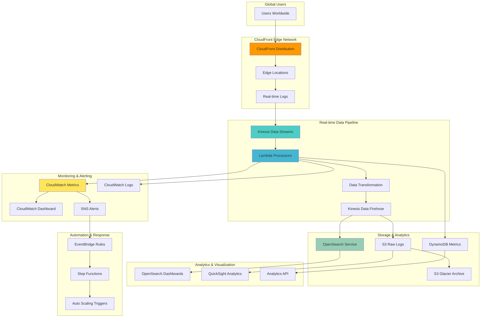

# CloudFront Real-Time Monitoring and Analytics

## Problem

Organizations deploying global content delivery networks need comprehensive real-time visibility into user behavior, performance metrics, and security threats to optimize content delivery and respond to issues immediately. Traditional CloudFront standard logs provide delayed insights with 15-60 minute delays, making it impossible to detect and respond to performance degradation, security attacks, or traffic spikes in real-time. This delayed visibility results in poor user experience during incidents and missed opportunities for performance optimization.

## Solution

Implement a comprehensive real-time monitoring and analytics system for CloudFront using real-time logs, Kinesis data streams, Lambda processing functions, and OpenSearch for analysis and visualization. The solution provides real-time alerting on performance anomalies, security threats, and traffic patterns while enabling detailed analytics for capacity planning and optimization. Real-time data processing enables immediate response to issues and proactive scaling based on traffic patterns.

## Architecture Diagram



## Prerequisites

1. AWS account with CloudFront, Kinesis, Lambda, and OpenSearch permissions
2. AWS CLI v2 installed and configured (or AWS CloudShell)
3. Understanding of log processing and data analytics concepts
4. Basic knowledge of Elasticsearch/OpenSearch query language
5. Estimated cost: $50-150/month for testing (varies by traffic volume and retention)

> **Note**: Real-time logs and OpenSearch Service can incur significant costs with high traffic volumes. Monitor usage closely and adjust retention policies as needed. For production workloads, consider sampling strategies to control costs while maintaining sufficient data quality.

## Preparation

```bash
# Set environment variables
export AWS_REGION=$(aws configure get region)
export AWS_ACCOUNT_ID=$(aws sts get-caller-identity \
    --query Account --output text)

# Generate unique identifiers for resources
RANDOM_SUFFIX=$(aws secretsmanager get-random-password \
    --exclude-punctuation --exclude-uppercase \
    --password-length 8 --require-each-included-type \
    --output text --query RandomPassword)

export PROJECT_NAME="cf-monitoring-${RANDOM_SUFFIX}"
export S3_BUCKET_NAME="cf-logs-${RANDOM_SUFFIX}"
export S3_CONTENT_BUCKET="cf-content-${RANDOM_SUFFIX}"
export KINESIS_STREAM_NAME="cf-realtime-logs-${RANDOM_SUFFIX}"
export OPENSEARCH_DOMAIN="cf-analytics-${RANDOM_SUFFIX}"

# Create S3 buckets
aws s3 mb s3://${S3_BUCKET_NAME} --region ${AWS_REGION}
aws s3 mb s3://${S3_CONTENT_BUCKET} --region ${AWS_REGION}

# Create sample content for testing
mkdir -p /tmp/content/{css,js,images,api}
cat > /tmp/content/index.html << 'EOF'
<!DOCTYPE html>
<html>
<head>
    <title>CloudFront Monitoring Demo</title>
    <link rel="stylesheet" href="/css/style.css">
    <script src="/js/app.js"></script>
</head>
<body>
    <h1>Welcome to CloudFront Monitoring Demo</h1>
    <p>This page generates traffic for monitoring analysis.</p>
    
    <div id="content"></div>
</body>
</html>
EOF

echo 'body { font-family: Arial, sans-serif; margin: 40px; }' > /tmp/content/css/style.css
echo 'console.log("Page loaded"); fetch("/api/data").then(r => r.json()).then(d => document.getElementById("content").innerHTML = JSON.stringify(d));' > /tmp/content/js/app.js
echo '{"message": "Hello from API", "timestamp": "'$(date -u +%Y-%m-%dT%H:%M:%S.%3NZ)'", "version": "1.0"}' > /tmp/content/api/data

# Create a sample image
echo "iVBORw0KGgoAAAANSUhEUgAAAAEAAAABCAYAAAAfFcSJAAAADUlEQVR42mNkYPhfDwAChwGA60e6kgAAAABJRU5ErkJggg==" | base64 -d > /tmp/content/images/demo.jpg

# Upload content to S3
aws s3 cp /tmp/content s3://${S3_CONTENT_BUCKET}/ --recursive \
    --cache-control "max-age=3600"

echo "✅ Environment prepared with content bucket: ${S3_CONTENT_BUCKET}"
```

## Steps

1. **Create Kinesis Data Streams for Real-time Log Processing**:

   Kinesis Data Streams forms the backbone of our real-time analytics pipeline by providing a scalable, durable platform for ingesting high-volume log data from CloudFront edge locations worldwide. Unlike traditional batch processing systems, Kinesis enables sub-second latency for log ingestion and processing, allowing immediate detection of performance issues, security threats, and traffic anomalies. The service automatically handles partitioning, replication, and scaling across multiple Availability Zones, ensuring high availability and durability for critical monitoring data.

   ```bash
   # Create Kinesis Data Stream for real-time logs
   aws kinesis create-stream \
       --stream-name ${KINESIS_STREAM_NAME} \
       --shard-count 2
   
   # Wait for stream to be active
   aws kinesis wait stream-exists --stream-name ${KINESIS_STREAM_NAME}
   
   # Create additional streams for processed data
   aws kinesis create-stream \
       --stream-name ${KINESIS_STREAM_NAME}-processed \
       --shard-count 1
   
   aws kinesis wait stream-exists --stream-name ${KINESIS_STREAM_NAME}-processed
   
   echo "✅ Kinesis Data Streams created"
   ```

   The primary stream receives raw CloudFront logs directly from edge locations, while the processed stream handles enriched data after Lambda transformation. This two-stream architecture separates concerns and enables different processing patterns - the raw stream handles high-volume ingestion while the processed stream supports analytics and storage operations. The shard configuration provides sufficient capacity for typical monitoring workloads while maintaining cost efficiency. Learn more about [Kinesis Data Streams concepts](https://docs.aws.amazon.com/streams/latest/dev/key-concepts.html).

2. **Create OpenSearch Domain for Log Analytics**:

   OpenSearch Service provides a fully managed search and analytics engine that enables real-time querying, visualization, and analysis of log data at scale. Unlike relational databases that struggle with unstructured log data, OpenSearch excels at full-text search, aggregations, and complex analytics queries across millions of log entries. The service includes built-in dashboards, alerting capabilities, and machine learning features that enable sophisticated analysis of traffic patterns, user behavior, and security events. This makes OpenSearch ideal for operational monitoring, troubleshooting, and business intelligence applications.

   ```bash
   # Create OpenSearch domain for log storage and analysis
   cat > /tmp/opensearch-policy.json << 'EOF'
   {
       "Version": "2012-10-17",
       "Statement": [
           {
               "Effect": "Allow",
               "Principal": {
                   "AWS": "*"
               },
               "Action": "es:*",
               "Resource": "arn:aws:es:REGION:ACCOUNT:domain/DOMAIN_NAME/*",
               "Condition": {
                   "IpAddress": {
                       "aws:SourceIp": ["0.0.0.0/0"]
                   }
               }
           }
       ]
   }
   EOF
   
   # Replace placeholders
   sed -i.bak "s/REGION/${AWS_REGION}/g" /tmp/opensearch-policy.json
   sed -i.bak "s/ACCOUNT/${AWS_ACCOUNT_ID}/g" /tmp/opensearch-policy.json
   sed -i.bak "s/DOMAIN_NAME/${OPENSEARCH_DOMAIN}/g" /tmp/opensearch-policy.json
   
   # Create OpenSearch domain
   aws opensearch create-domain \
       --domain-name ${OPENSEARCH_DOMAIN} \
       --engine-version "OpenSearch_2.11" \
       --cluster-config "{
           \"InstanceType\": \"t3.small.search\",
           \"InstanceCount\": 1,
           \"DedicatedMasterEnabled\": false
       }" \
       --ebs-options "{
           \"EBSEnabled\": true,
           \"VolumeType\": \"gp3\",
           \"VolumeSize\": 20
       }" \
       --access-policies file:///tmp/opensearch-policy.json \
       --domain-endpoint-options "{
           \"EnforceHTTPS\": true,
           \"TLSSecurityPolicy\": \"Policy-Min-TLS-1-2-2019-07\"
       }" \
       --node-to-node-encryption-options "{
           \"Enabled\": true
       }" \
       --encryption-at-rest-options "{
           \"Enabled\": true
       }"
   
   echo "✅ OpenSearch domain creation initiated (this may take 10-15 minutes)"
   ```

   The OpenSearch domain is configured with encryption at rest and in transit, following AWS security best practices for sensitive log data. The t3.small instance type provides sufficient performance for development and testing while maintaining cost efficiency. In production environments, you would typically use larger instance types and enable dedicated master nodes for high availability. The domain will be accessible via HTTPS endpoints and includes integrated dashboards for visualization and analysis. For more details, see the [OpenSearch Service documentation](https://docs.aws.amazon.com/opensearch-service/latest/developerguide/what-is.html).

3. **Create Lambda Function for Real-time Log Processing**:

   Lambda functions provide serverless compute capacity for processing CloudFront logs in real-time without managing infrastructure. The function receives raw log data from Kinesis, parses CloudFront's tab-separated format, enriches entries with geographic information, and performs real-time aggregations. This serverless approach automatically scales based on log volume, processes data with sub-second latency, and only charges for actual execution time. The Lambda function acts as the intelligence layer in our pipeline, transforming raw logs into actionable insights while maintaining high availability and cost efficiency.

   ```bash
   # Create Lambda function directory
   mkdir -p /tmp/lambda-log-processor
   
   # Create package.json
   cat > /tmp/lambda-log-processor/package.json << 'EOF'
   {
       "name": "cloudfront-log-processor",
       "version": "1.0.0",
       "description": "Real-time CloudFront log processor",
       "dependencies": {
           "@aws-sdk/client-cloudwatch": "^3.0.0",
           "@aws-sdk/client-dynamodb": "^3.0.0",
           "@aws-sdk/client-kinesis": "^3.0.0",
           "@aws-sdk/util-dynamodb": "^3.0.0",
           "geoip-lite": "^1.4.0"
       }
   }
   EOF
   
   # Create Lambda function code
   cat > /tmp/lambda-log-processor/index.js << 'EOF'
   const { CloudWatchClient, PutMetricDataCommand } = require('@aws-sdk/client-cloudwatch');
   const { DynamoDBClient, PutItemCommand } = require('@aws-sdk/client-dynamodb');
   const { KinesisClient, PutRecordsCommand } = require('@aws-sdk/client-kinesis');
   const { marshall } = require('@aws-sdk/util-dynamodb');
   const geoip = require('geoip-lite');
   
   const cloudwatch = new CloudWatchClient();
   const dynamodb = new DynamoDBClient();
   const kinesis = new KinesisClient();
   
   const METRICS_TABLE = process.env.METRICS_TABLE;
   const PROCESSED_STREAM = process.env.PROCESSED_STREAM;
   
   exports.handler = async (event) => {
       console.log('Received event:', JSON.stringify(event, null, 2));
       
       const processedRecords = [];
       const metrics = {
           totalRequests: 0,
           totalBytes: 0,
           errors4xx: 0,
           errors5xx: 0,
           cacheMisses: 0,
           regionCounts: {},
           statusCodes: {},
           userAgents: {}
       };
       
       for (const record of event.Records) {
           try {
               // Decode Kinesis data
               const data = Buffer.from(record.kinesis.data, 'base64').toString('utf-8');
               const logEntries = data.trim().split('\n');
               
               for (const logEntry of logEntries) {
                   const processedLog = await processLogEntry(logEntry, metrics);
                   if (processedLog) {
                       processedRecords.push(processedLog);
                   }
               }
           } catch (error) {
               console.error('Error processing record:', error);
           }
       }
       
       // Send processed records to output stream
       if (processedRecords.length > 0) {
           await sendToKinesis(processedRecords);
       }
       
       // Store aggregated metrics
       await storeMetrics(metrics);
       
       // Send CloudWatch metrics
       await sendCloudWatchMetrics(metrics);
       
       return {
           statusCode: 200,
           processedRecords: processedRecords.length
       };
   };
   
   async function processLogEntry(logEntry, metrics) {
       try {
           // Parse CloudFront log format (tab-separated)
           const fields = logEntry.split('\t');
           
           if (fields.length < 20) {
               return null; // Invalid log entry
           }
           
           const timestamp = `${fields[0]} ${fields[1]}`;
           const edgeLocation = fields[2];
           const bytesDownloaded = parseInt(fields[3]) || 0;
           const clientIp = fields[4];
           const method = fields[5];
           const host = fields[6];
           const uri = fields[7];
           const status = parseInt(fields[8]) || 0;
           const referer = fields[9];
           const userAgent = fields[10];
           const queryString = fields[11];
           const cookie = fields[12];
           const edgeResultType = fields[13];
           const edgeRequestId = fields[14];
           const hostHeader = fields[15];
           const protocol = fields[16];
           const bytesUploaded = parseInt(fields[17]) || 0;
           const timeTaken = parseFloat(fields[18]) || 0;
           const forwardedFor = fields[19];
           
           // Geo-locate client IP
           const geoData = geoip.lookup(clientIp) || {};
           
           // Update metrics
           metrics.totalRequests++;
           metrics.totalBytes += bytesDownloaded;
           
           if (status >= 400 && status < 500) {
               metrics.errors4xx++;
           } else if (status >= 500) {
               metrics.errors5xx++;
           }
           
           if (edgeResultType === 'Miss') {
               metrics.cacheMisses++;
           }
           
           // Count by region
           const region = geoData.region || 'Unknown';
           metrics.regionCounts[region] = (metrics.regionCounts[region] || 0) + 1;
           
           // Count status codes
           metrics.statusCodes[status] = (metrics.statusCodes[status] || 0) + 1;
           
           // Simplified user agent tracking
           const uaCategory = categorizeUserAgent(userAgent);
           metrics.userAgents[uaCategory] = (metrics.userAgents[uaCategory] || 0) + 1;
           
           // Create enriched log entry
           const enrichedLog = {
               timestamp: new Date(timestamp).toISOString(),
               edgeLocation,
               clientIp,
               method,
               host,
               uri,
               status,
               bytesDownloaded,
               bytesUploaded,
               timeTaken,
               edgeResultType,
               userAgent: uaCategory,
               country: geoData.country || 'Unknown',
               region: geoData.region || 'Unknown',
               city: geoData.city || 'Unknown',
               referer: referer !== '-' ? referer : null,
               queryString: queryString !== '-' ? queryString : null,
               protocol,
               edgeRequestId,
               cacheHit: edgeResultType !== 'Miss',
               isError: status >= 400,
               responseSize: bytesDownloaded,
               requestSize: bytesUploaded,
               processingTime: Date.now()
           };
           
           return enrichedLog;
           
       } catch (error) {
           console.error('Error parsing log entry:', error);
           return null;
       }
   }
   
   function categorizeUserAgent(userAgent) {
       if (!userAgent || userAgent === '-') return 'Unknown';
       
       const ua = userAgent.toLowerCase();
       if (ua.includes('chrome')) return 'Chrome';
       if (ua.includes('firefox')) return 'Firefox';
       if (ua.includes('safari') && !ua.includes('chrome')) return 'Safari';
       if (ua.includes('edge')) return 'Edge';
       if (ua.includes('bot') || ua.includes('crawler')) return 'Bot';
       if (ua.includes('mobile')) return 'Mobile';
       
       return 'Other';
   }
   
   async function sendToKinesis(records) {
       const batchSize = 500; // Kinesis limit
       
       for (let i = 0; i < records.length; i += batchSize) {
           const batch = records.slice(i, i + batchSize);
           const kinesisRecords = batch.map(record => ({
               Data: JSON.stringify(record),
               PartitionKey: record.edgeLocation || 'default'
           }));
           
           try {
               await kinesis.send(new PutRecordsCommand({
                   StreamName: PROCESSED_STREAM,
                   Records: kinesisRecords
               }));
           } catch (error) {
               console.error('Error sending to Kinesis:', error);
           }
       }
   }
   
   async function storeMetrics(metrics) {
       const timestamp = new Date().toISOString();
       const ttl = Math.floor(Date.now() / 1000) + (7 * 24 * 60 * 60); // 7 days
       
       try {
           await dynamodb.send(new PutItemCommand({
               TableName: METRICS_TABLE,
               Item: marshall({
                   MetricId: `metrics-${Date.now()}`,
                   Timestamp: timestamp,
                   TotalRequests: metrics.totalRequests,
                   TotalBytes: metrics.totalBytes,
                   Errors4xx: metrics.errors4xx,
                   Errors5xx: metrics.errors5xx,
                   CacheMisses: metrics.cacheMisses,
                   RegionCounts: metrics.regionCounts,
                   StatusCodes: metrics.statusCodes,
                   UserAgents: metrics.userAgents,
                   TTL: ttl
               })
           }));
       } catch (error) {
           console.error('Error storing metrics:', error);
       }
   }
   
   async function sendCloudWatchMetrics(metrics) {
       const metricData = [
           {
               MetricName: 'RequestCount',
               Value: metrics.totalRequests,
               Unit: 'Count',
               Timestamp: new Date()
           },
           {
               MetricName: 'BytesDownloaded',
               Value: metrics.totalBytes,
               Unit: 'Bytes',
               Timestamp: new Date()
           },
           {
               MetricName: 'ErrorRate4xx',
               Value: metrics.totalRequests > 0 ? (metrics.errors4xx / metrics.totalRequests) * 100 : 0,
               Unit: 'Percent',
               Timestamp: new Date()
           },
           {
               MetricName: 'ErrorRate5xx',
               Value: metrics.totalRequests > 0 ? (metrics.errors5xx / metrics.totalRequests) * 100 : 0,
               Unit: 'Percent',
               Timestamp: new Date()
           },
           {
               MetricName: 'CacheMissRate',
               Value: metrics.totalRequests > 0 ? (metrics.cacheMisses / metrics.totalRequests) * 100 : 0,
               Unit: 'Percent',
               Timestamp: new Date()
           }
       ];
       
       try {
           await cloudwatch.send(new PutMetricDataCommand({
               Namespace: 'CloudFront/RealTime',
               MetricData: metricData
           }));
       } catch (error) {
           console.error('Error sending CloudWatch metrics:', error);
       }
   }
   EOF
   
   # Install dependencies and create deployment package
   cd /tmp/lambda-log-processor
   npm install --production
   zip -r lambda-log-processor.zip .
   
   echo "✅ Lambda function package created"
   ```

   The Lambda function implements sophisticated log processing including IP geolocation, user agent categorization, and real-time metric aggregation. It has been updated to use AWS SDK v3 for improved performance and reduced memory footprint. The function processes each log entry to extract business-relevant information such as geographic distribution, device types, and performance metrics. The function also implements error handling, batch processing for efficiency, and multi-destination routing to send processed data to different storage systems. This real-time processing enables immediate insights and alerting that would be impossible with traditional batch processing approaches.

4. **Create DynamoDB Table for Metrics Storage**:

   DynamoDB serves as the operational data store for real-time metrics and aggregated statistics, providing single-digit millisecond latency for reads and writes. Unlike traditional relational databases, DynamoDB automatically scales to handle varying workloads without capacity planning and offers built-in backup, point-in-time recovery, and global replication capabilities. The composite key structure (MetricId + Timestamp) enables efficient querying of metrics by time ranges while maintaining optimal performance. This NoSQL approach is ideal for time-series data and supports the high write throughput required for real-time monitoring applications.

   ```bash
   # Create DynamoDB table for storing processed metrics
   aws dynamodb create-table \
       --table-name ${PROJECT_NAME}-metrics \
       --attribute-definitions \
           AttributeName=MetricId,AttributeType=S \
           AttributeName=Timestamp,AttributeType=S \
       --key-schema \
           AttributeName=MetricId,KeyType=HASH \
           AttributeName=Timestamp,KeyType=RANGE \
       --billing-mode PAY_PER_REQUEST
   
   # Wait for table to be active
   aws dynamodb wait table-exists --table-name ${PROJECT_NAME}-metrics
   
   export METRICS_TABLE_NAME="${PROJECT_NAME}-metrics"
   
   echo "✅ DynamoDB table created: ${METRICS_TABLE_NAME}"
   ```

   The PAY_PER_REQUEST billing mode automatically adjusts capacity based on traffic patterns, eliminating the need for capacity planning and ensuring cost efficiency during variable workloads. The table includes a TTL (Time to Live) attribute that automatically removes old metrics after 7 days, managing storage costs while retaining sufficient data for trend analysis. This design enables fast dashboard queries and real-time alerting while maintaining low operational overhead.

5. **Deploy Lambda Function with IAM Role**:

   IAM roles provide secure, temporary credentials for Lambda functions to access AWS services without embedding permanent access keys in code. This approach follows the principle of least privilege by granting only the minimum permissions required for log processing operations. The role enables the Lambda function to read from Kinesis streams, write to DynamoDB, publish CloudWatch metrics, and create log entries - all essential for real-time monitoring operations. This security model ensures that credentials are automatically rotated and access is limited to the specific resources needed for log processing.

   ```bash
   # Create IAM role for Lambda function
   cat > /tmp/lambda-trust-policy.json << 'EOF'
   {
       "Version": "2012-10-17",
       "Statement": [
           {
               "Effect": "Allow",
               "Principal": {
                   "Service": "lambda.amazonaws.com"
               },
               "Action": "sts:AssumeRole"
           }
       ]
   }
   EOF
   
   # Create the role
   aws iam create-role \
       --role-name ${PROJECT_NAME}-lambda-role \
       --assume-role-policy-document file:///tmp/lambda-trust-policy.json
   
   # Create custom policy for the Lambda function
   cat > /tmp/lambda-policy.json << 'EOF'
   {
       "Version": "2012-10-17",
       "Statement": [
           {
               "Effect": "Allow",
               "Action": [
                   "kinesis:DescribeStream",
                   "kinesis:GetRecords",
                   "kinesis:GetShardIterator",
                   "kinesis:ListStreams",
                   "kinesis:PutRecord",
                   "kinesis:PutRecords"
               ],
               "Resource": "*"
           },
           {
               "Effect": "Allow",
               "Action": [
                   "dynamodb:PutItem",
                   "dynamodb:GetItem",
                   "dynamodb:UpdateItem",
                   "dynamodb:Query",
                   "dynamodb:Scan"
               ],
               "Resource": "arn:aws:dynamodb:REGION:ACCOUNT:table/TABLE_NAME"
           },
           {
               "Effect": "Allow",
               "Action": [
                   "cloudwatch:PutMetricData"
               ],
               "Resource": "*"
           },
           {
               "Effect": "Allow",
               "Action": [
                   "logs:CreateLogGroup",
                   "logs:CreateLogStream",
                   "logs:PutLogEvents"
               ],
               "Resource": "*"
           }
       ]
   }
   EOF
   
   # Replace placeholders
   sed -i.bak "s/REGION/${AWS_REGION}/g" /tmp/lambda-policy.json
   sed -i.bak "s/ACCOUNT/${AWS_ACCOUNT_ID}/g" /tmp/lambda-policy.json
   sed -i.bak "s/TABLE_NAME/${METRICS_TABLE_NAME}/g" /tmp/lambda-policy.json
   
   # Attach policies to role
   aws iam put-role-policy \
       --role-name ${PROJECT_NAME}-lambda-role \
       --policy-name CloudFrontLogProcessingPolicy \
       --policy-document file:///tmp/lambda-policy.json
   
   aws iam attach-role-policy \
       --role-name ${PROJECT_NAME}-lambda-role \
       --policy-arn arn:aws:iam::aws:policy/service-role/AWSLambdaBasicExecutionRole
   
   # Wait for role to be available
   sleep 10
   
   # Create Lambda function
   aws lambda create-function \
       --function-name ${PROJECT_NAME}-log-processor \
       --runtime nodejs20.x \
       --role arn:aws:iam::${AWS_ACCOUNT_ID}:role/${PROJECT_NAME}-lambda-role \
       --handler index.handler \
       --zip-file fileb:///tmp/lambda-log-processor/lambda-log-processor.zip \
       --timeout 300 \
       --memory-size 512 \
       --environment Variables="{
           \"METRICS_TABLE\":\"${METRICS_TABLE_NAME}\",
           \"PROCESSED_STREAM\":\"${KINESIS_STREAM_NAME}-processed\"
       }"
   
   echo "✅ Lambda function deployed"
   ```

   The Lambda function is now deployed with the necessary permissions to process CloudFront logs in real-time. The IAM role ensures secure access to all required AWS services while maintaining the principle of least privilege. The function uses the latest Node.js 20.x runtime and will automatically scale based on incoming log volume, processing data with sub-second latency to enable immediate insights and alerting capabilities. For more information about Lambda and Kinesis integration, see the [AWS Lambda documentation](https://docs.aws.amazon.com/lambda/latest/dg/services-kinesis-create.html).

6. **Create Kinesis Data Firehose for S3 and OpenSearch Delivery**:

   Kinesis Data Firehose provides a fully managed service for delivering streaming data to analytics destinations without requiring custom code or infrastructure management. Firehose automatically handles data transformation, compression, and delivery to multiple destinations including S3 for long-term storage and OpenSearch for real-time analytics. The service provides built-in error handling, retry logic, and automatic scaling to handle varying data volumes. This managed approach reduces operational overhead while ensuring reliable data delivery for compliance and analytics requirements.

   ```bash
   # Wait for OpenSearch domain to be available
   echo "Waiting for OpenSearch domain to be ready..."
   aws opensearch wait domain-available --domain-name ${OPENSEARCH_DOMAIN}
   
   # Get OpenSearch endpoint
   OPENSEARCH_ENDPOINT=$(aws opensearch describe-domain \
       --domain-name ${OPENSEARCH_DOMAIN} \
       --query 'DomainStatus.Endpoint' --output text)
   
   # Create IAM role for Kinesis Data Firehose
   cat > /tmp/firehose-trust-policy.json << 'EOF'
   {
       "Version": "2012-10-17",
       "Statement": [
           {
               "Effect": "Allow",
               "Principal": {
                   "Service": "firehose.amazonaws.com"
               },
               "Action": "sts:AssumeRole"
           }
       ]
   }
   EOF
   
   aws iam create-role \
       --role-name ${PROJECT_NAME}-firehose-role \
       --assume-role-policy-document file:///tmp/firehose-trust-policy.json
   
   # Create policy for Firehose
   cat > /tmp/firehose-policy.json << 'EOF'
   {
       "Version": "2012-10-17",
       "Statement": [
           {
               "Effect": "Allow",
               "Action": [
                   "s3:AbortMultipartUpload",
                   "s3:GetBucketLocation",
                   "s3:GetObject",
                   "s3:ListBucket",
                   "s3:ListBucketMultipartUploads",
                   "s3:PutObject"
               ],
               "Resource": [
                   "arn:aws:s3:::BUCKET_NAME",
                   "arn:aws:s3:::BUCKET_NAME/*"
               ]
           },
           {
               "Effect": "Allow",
               "Action": [
                   "es:DescribeElasticsearchDomain",
                   "es:DescribeElasticsearchDomains",
                   "es:DescribeElasticsearchDomainConfig",
                   "es:ESHttpPost",
                   "es:ESHttpPut"
               ],
               "Resource": "arn:aws:es:REGION:ACCOUNT:domain/DOMAIN_NAME/*"
           },
           {
               "Effect": "Allow",
               "Action": [
                   "logs:PutLogEvents"
               ],
               "Resource": "*"
           }
       ]
   }
   EOF
   
   # Replace placeholders
   sed -i.bak "s/BUCKET_NAME/${S3_BUCKET_NAME}/g" /tmp/firehose-policy.json
   sed -i.bak "s/REGION/${AWS_REGION}/g" /tmp/firehose-policy.json
   sed -i.bak "s/ACCOUNT/${AWS_ACCOUNT_ID}/g" /tmp/firehose-policy.json
   sed -i.bak "s/DOMAIN_NAME/${OPENSEARCH_DOMAIN}/g" /tmp/firehose-policy.json
   
   aws iam put-role-policy \
       --role-name ${PROJECT_NAME}-firehose-role \
       --policy-name FirehoseDeliveryPolicy \
       --policy-document file:///tmp/firehose-policy.json
   
   # Create Kinesis Data Firehose delivery stream
   aws firehose create-delivery-stream \
       --delivery-stream-name ${PROJECT_NAME}-logs-to-s3-opensearch \
       --delivery-stream-type KinesisStreamAsSource \
       --kinesis-stream-source-configuration "{
           \"KinesisStreamARN\": \"arn:aws:kinesis:${AWS_REGION}:${AWS_ACCOUNT_ID}:stream/${KINESIS_STREAM_NAME}-processed\",
           \"RoleARN\": \"arn:aws:iam::${AWS_ACCOUNT_ID}:role/${PROJECT_NAME}-firehose-role\"
       }" \
       --extended-s3-destination-configuration "{
           \"RoleARN\": \"arn:aws:iam::${AWS_ACCOUNT_ID}:role/${PROJECT_NAME}-firehose-role\",
           \"BucketARN\": \"arn:aws:s3:::${S3_BUCKET_NAME}\",
           \"Prefix\": \"cloudfront-logs/year=!{timestamp:yyyy}/month=!{timestamp:MM}/day=!{timestamp:dd}/hour=!{timestamp:HH}/\",
           \"BufferingHints\": {
               \"SizeInMBs\": 5,
               \"IntervalInSeconds\": 60
           },
           \"CompressionFormat\": \"GZIP\",
           \"ProcessingConfiguration\": {
               \"Enabled\": false
           },
           \"CloudWatchLoggingOptions\": {
               \"Enabled\": true,
               \"LogGroupName\": \"/aws/kinesisfirehose/${PROJECT_NAME}\",
               \"LogStreamName\": \"S3Delivery\"
           }
       }"
   
   echo "✅ Kinesis Data Firehose created"
   ```

   The Firehose delivery stream is configured to automatically compress data using GZIP format, reducing storage costs and improving query performance. The buffering configuration balances latency and efficiency by collecting data for up to 60 seconds or 5MB before delivery. This configuration optimizes both cost and performance for typical monitoring workloads. The delivery stream also includes CloudWatch logging for monitoring and troubleshooting data flow issues.

7. **Configure Lambda Event Source Mapping**:

   Event source mappings connect Kinesis streams to Lambda functions, automatically polling for new records and invoking the function with batches of data. This serverless integration eliminates the need for custom polling logic and automatically handles errors, retries, and scaling. The mapping configuration optimizes for both latency and efficiency by processing up to 100 records per batch with a maximum 5-second batching window. This approach ensures rapid processing while maintaining cost efficiency through batch processing.

   ```bash
   # Create event source mapping for Kinesis to Lambda
   aws lambda create-event-source-mapping \
       --event-source-arn arn:aws:kinesis:${AWS_REGION}:${AWS_ACCOUNT_ID}:stream/${KINESIS_STREAM_NAME} \
       --function-name ${PROJECT_NAME}-log-processor \
       --starting-position LATEST \
       --batch-size 100 \
       --maximum-batching-window-in-seconds 5
   
   echo "✅ Lambda event source mapping created"
   ```

   The event source mapping begins processing from the LATEST position, ensuring that only new log entries are processed without reprocessing historical data. This configuration provides the optimal balance between processing latency and cost efficiency for real-time monitoring applications. The mapping automatically handles parallelization across multiple shards and includes built-in error handling and dead letter queue support for robust operations.

8. **Create CloudFront Distribution with Real-time Logs**:

   CloudFront distributions provide global content delivery with edge locations worldwide, reducing latency and improving user experience. The distribution configuration includes Origin Access Control (OAC) for secure S3 integration, HTTPS enforcement for security, and optimized caching policies for performance. Real-time logs from CloudFront provide immediate visibility into user requests, performance metrics, and security events across all edge locations. This comprehensive logging enables proactive monitoring, security analysis, and performance optimization that would be impossible with traditional web server logs.

   ```bash
   # Create Origin Access Control for S3
   OAC_ID=$(aws cloudfront create-origin-access-control \
       --origin-access-control-config "{
           \"Name\": \"${PROJECT_NAME}-oac\",
           \"Description\": \"Origin Access Control for monitoring demo\",
           \"SigningProtocol\": \"sigv4\",
           \"SigningBehavior\": \"always\",
           \"OriginAccessControlOriginType\": \"s3\"
       }" \
       --query 'OriginAccessControl.Id' --output text)
   
   # Create CloudFront distribution
   cat > /tmp/cloudfront-config.json << EOF
   {
       "CallerReference": "${PROJECT_NAME}-$(date +%s)",
       "Comment": "CloudFront distribution for real-time monitoring demo",
       "Enabled": true,
       "Origins": {
           "Quantity": 1,
           "Items": [
               {
                   "Id": "S3Origin",
                   "DomainName": "${S3_CONTENT_BUCKET}.s3.amazonaws.com",
                   "OriginPath": "",
                   "CustomHeaders": {
                       "Quantity": 0
                   },
                   "S3OriginConfig": {
                       "OriginAccessIdentity": ""
                   },
                   "OriginAccessControlId": "${OAC_ID}",
                   "ConnectionAttempts": 3,
                   "ConnectionTimeout": 10
               }
           ]
       },
       "DefaultCacheBehavior": {
           "TargetOriginId": "S3Origin",
           "ViewerProtocolPolicy": "redirect-to-https",
           "TrustedSigners": {
               "Enabled": false,
               "Quantity": 0
           },
           "TrustedKeyGroups": {
               "Enabled": false,
               "Quantity": 0
           },
           "AllowedMethods": {
               "Quantity": 7,
               "Items": ["DELETE", "GET", "HEAD", "OPTIONS", "PATCH", "POST", "PUT"],
               "CachedMethods": {
                   "Quantity": 2,
                   "Items": ["GET", "HEAD"]
               }
           },
           "SmoothStreaming": false,
           "Compress": true,
           "LambdaFunctionAssociations": {
               "Quantity": 0
           },
           "FunctionAssociations": {
               "Quantity": 0
           },
           "FieldLevelEncryptionId": "",
           "CachePolicyId": "4135ea2d-6df8-44a3-9df3-4b5a84be39ad"
       },
       "CacheBehaviors": {
           "Quantity": 1,
           "Items": [
               {
                   "PathPattern": "/api/*",
                   "TargetOriginId": "S3Origin",
                   "ViewerProtocolPolicy": "https-only",
                   "TrustedSigners": {
                       "Enabled": false,
                       "Quantity": 0
                   },
                   "TrustedKeyGroups": {
                       "Enabled": false,
                       "Quantity": 0
                   },
                   "AllowedMethods": {
                       "Quantity": 7,
                       "Items": ["DELETE", "GET", "HEAD", "OPTIONS", "PATCH", "POST", "PUT"],
                       "CachedMethods": {
                           "Quantity": 2,
                           "Items": ["GET", "HEAD"]
                       }
                   },
                   "SmoothStreaming": false,
                   "Compress": true,
                   "LambdaFunctionAssociations": {
                       "Quantity": 0
                   },
                   "FunctionAssociations": {
                       "Quantity": 0
                   },
                   "FieldLevelEncryptionId": "",
                   "CachePolicyId": "4135ea2d-6df8-44a3-9df3-4b5a84be39ad"
               }
           ]
       },
       "CustomErrorResponses": {
           "Quantity": 0
       },
       "PriceClass": "PriceClass_100",
       "ViewerCertificate": {
           "CloudFrontDefaultCertificate": true,
           "MinimumProtocolVersion": "TLSv1.2_2021",
           "CertificateSource": "cloudfront"
       },
       "Restrictions": {
           "GeoRestriction": {
               "RestrictionType": "none",
               "Quantity": 0
           }
       },
       "HttpVersion": "http2",
       "IsIPV6Enabled": true,
       "DefaultRootObject": "index.html"
   }
   EOF
   
   # Create CloudFront distribution
   CF_OUTPUT=$(aws cloudfront create-distribution \
       --distribution-config file:///tmp/cloudfront-config.json)
   
   export CF_DISTRIBUTION_ID=$(echo $CF_OUTPUT | jq -r '.Distribution.Id')
   export CF_DOMAIN_NAME=$(echo $CF_OUTPUT | jq -r '.Distribution.DomainName')
   
   echo "✅ CloudFront distribution created: ${CF_DISTRIBUTION_ID}"
   echo "✅ CloudFront domain: ${CF_DOMAIN_NAME}"
   ```

   The CloudFront distribution is configured with security best practices including HTTPS enforcement, HTTP/2 support, and compression to optimize performance. The distribution includes multiple cache behaviors to handle different content types appropriately, ensuring optimal caching strategies for static assets and dynamic API responses. This configuration provides the foundation for global content delivery while generating the real-time logs needed for comprehensive monitoring and analytics.

9. **Configure S3 Bucket Policy and Real-time Logs**:

   S3 bucket policies control access to content stored in S3, ensuring that only authorized CloudFront distributions can access objects while maintaining security. The policy uses condition statements to restrict access based on the source CloudFront distribution, preventing unauthorized access to content. Real-time logs configuration enables CloudFront to stream log data directly to Kinesis Data Streams with sub-second latency, providing immediate visibility into user requests and performance metrics across all edge locations worldwide.

   ```bash
   # Configure S3 bucket policy for CloudFront access
   cat > /tmp/s3-policy.json << EOF
   {
       "Version": "2012-10-17",
       "Statement": [
           {
               "Sid": "AllowCloudFrontServicePrincipal",
               "Effect": "Allow",
               "Principal": {
                   "Service": "cloudfront.amazonaws.com"
               },
               "Action": "s3:GetObject",
               "Resource": "arn:aws:s3:::${S3_CONTENT_BUCKET}/*",
               "Condition": {
                   "StringEquals": {
                       "AWS:SourceArn": "arn:aws:cloudfront::${AWS_ACCOUNT_ID}:distribution/${CF_DISTRIBUTION_ID}"
                   }
               }
           }
       ]
   }
   EOF
   
   aws s3api put-bucket-policy \
       --bucket ${S3_CONTENT_BUCKET} \
       --policy file:///tmp/s3-policy.json
   
   # Create IAM role for CloudFront real-time logs
   cat > /tmp/realtime-logs-trust-policy.json << 'EOF'
   {
       "Version": "2012-10-17",
       "Statement": [
           {
               "Effect": "Allow",
               "Principal": {
                   "Service": "cloudfront.amazonaws.com"
               },
               "Action": "sts:AssumeRole"
           }
       ]
   }
   EOF
   
   aws iam create-role \
       --role-name ${PROJECT_NAME}-realtime-logs-role \
       --assume-role-policy-document file:///tmp/realtime-logs-trust-policy.json
   
   # Create policy for real-time logs
   cat > /tmp/realtime-logs-policy.json << 'EOF'
   {
       "Version": "2012-10-17",
       "Statement": [
           {
               "Effect": "Allow",
               "Action": [
                   "kinesis:PutRecords",
                   "kinesis:PutRecord"
               ],
               "Resource": "arn:aws:kinesis:REGION:ACCOUNT:stream/STREAM_NAME"
           }
       ]
   }
   EOF
   
   sed -i.bak "s/REGION/${AWS_REGION}/g" /tmp/realtime-logs-policy.json
   sed -i.bak "s/ACCOUNT/${AWS_ACCOUNT_ID}/g" /tmp/realtime-logs-policy.json
   sed -i.bak "s/STREAM_NAME/${KINESIS_STREAM_NAME}/g" /tmp/realtime-logs-policy.json
   
   aws iam put-role-policy \
       --role-name ${PROJECT_NAME}-realtime-logs-role \
       --policy-name KinesisAccess \
       --policy-document file:///tmp/realtime-logs-policy.json
   
   # Wait for role to be available
   sleep 10
   
   # Create real-time log configuration
   aws cloudfront create-realtime-log-config \
       --name "${PROJECT_NAME}-realtime-logs" \
       --end-points StreamType=Kinesis,StreamArn=arn:aws:kinesis:${AWS_REGION}:${AWS_ACCOUNT_ID}:stream/${KINESIS_STREAM_NAME},RoleArn=arn:aws:iam::${AWS_ACCOUNT_ID}:role/${PROJECT_NAME}-realtime-logs-role \
       --fields timestamp c-ip sc-status cs-method cs-uri-stem cs-uri-query cs-referer cs-user-agent cs-cookie x-edge-location x-edge-request-id x-host-header cs-protocol cs-bytes sc-bytes time-taken x-forwarded-for ssl-protocol ssl-cipher x-edge-response-result-type cs-protocol-version fle-status fle-encrypted-fields c-port time-to-first-byte x-edge-detailed-result-type sc-content-type sc-content-len sc-range-start sc-range-end
   
   echo "✅ Real-time logging configured"
   ```

   The real-time log configuration captures comprehensive request data including timestamps, client IP addresses, HTTP status codes, request methods, and response sizes. This detailed logging enables advanced analytics, security monitoring, and performance analysis that standard CloudFront logs cannot provide due to their delayed delivery. The configuration includes all available log fields to ensure comprehensive monitoring capabilities. For more details about CloudFront real-time logs, see the [CloudFront real-time logs documentation](https://docs.aws.amazon.com/AmazonCloudFront/latest/DeveloperGuide/real-time-logs.html).

10. **Create Comprehensive Monitoring Dashboard**:

    CloudWatch dashboards provide centralized visualization of real-time metrics, enabling operations teams to monitor system health, performance trends, and business metrics in a single interface. The dashboard combines custom metrics from our Lambda processing function with native AWS service metrics to provide comprehensive visibility into the entire monitoring pipeline. This unified view enables rapid identification of issues, performance trends, and capacity planning needs while supporting both technical and business stakeholders with relevant metrics and visualizations.

    ```bash
    # Create CloudWatch dashboard
    cat > /tmp/dashboard-config.json << EOF
    {
        "widgets": [
            {
                "type": "metric",
                "x": 0,
                "y": 0,
                "width": 12,
                "height": 6,
                "properties": {
                    "metrics": [
                        ["CloudFront/RealTime", "RequestCount"],
                        [".", "BytesDownloaded"]
                    ],
                    "period": 300,
                    "stat": "Sum",
                    "region": "${AWS_REGION}",
                    "title": "Real-time Traffic Volume"
                }
            },
            {
                "type": "metric",
                "x": 12,
                "y": 0,
                "width": 12,
                "height": 6,
                "properties": {
                    "metrics": [
                        ["CloudFront/RealTime", "ErrorRate4xx"],
                        [".", "ErrorRate5xx"]
                    ],
                    "period": 300,
                    "stat": "Average",
                    "region": "${AWS_REGION}",
                    "title": "Real-time Error Rates"
                }
            },
            {
                "type": "metric",
                "x": 0,
                "y": 6,
                "width": 12,
                "height": 6,
                "properties": {
                    "metrics": [
                        ["CloudFront/RealTime", "CacheMissRate"]
                    ],
                    "period": 300,
                    "stat": "Average",
                    "region": "${AWS_REGION}",
                    "title": "Cache Performance"
                }
            },
            {
                "type": "metric",
                "x": 12,
                "y": 6,
                "width": 12,
                "height": 6,
                "properties": {
                    "metrics": [
                        ["AWS/Lambda", "Duration", "FunctionName", "${PROJECT_NAME}-log-processor"],
                        [".", "Invocations", ".", "."],
                        [".", "Errors", ".", "."]
                    ],
                    "period": 300,
                    "stat": "Average",
                    "region": "${AWS_REGION}",
                    "title": "Log Processing Performance"
                }
            },
            {
                "type": "metric",
                "x": 0,
                "y": 12,
                "width": 12,
                "height": 6,
                "properties": {
                    "metrics": [
                        ["AWS/Kinesis", "IncomingRecords", "StreamName", "${KINESIS_STREAM_NAME}"],
                        [".", "OutgoingRecords", ".", "."]
                    ],
                    "period": 300,
                    "stat": "Sum",
                    "region": "${AWS_REGION}",
                    "title": "Kinesis Stream Activity"
                }
            },
            {
                "type": "metric",
                "x": 12,
                "y": 12,
                "width": 12,
                "height": 6,
                "properties": {
                    "metrics": [
                        ["AWS/CloudFront", "Requests", "DistributionId", "${CF_DISTRIBUTION_ID}"],
                        [".", "BytesDownloaded", ".", "."]
                    ],
                    "period": 300,
                    "stat": "Sum",
                    "region": "us-east-1",
                    "title": "CloudFront Standard Metrics"
                }
            }
        ]
    }
    EOF
    
    # Create dashboard
    aws cloudwatch put-dashboard \
        --dashboard-name "CloudFront-RealTime-Analytics-${RANDOM_SUFFIX}" \
        --dashboard-body file:///tmp/dashboard-config.json
    
    echo "✅ CloudWatch dashboard created"
    ```

    The dashboard includes widgets for real-time traffic volume, error rates, cache performance, and processing metrics, providing comprehensive visibility into system performance. The multi-widget layout enables quick identification of correlations between different metrics and facilitates rapid troubleshooting. The dashboard updates automatically as new metrics are published, ensuring that monitoring data is always current and actionable for operational decision-making.

## Validation & Testing

1. **Wait for CloudFront Distribution Deployment**:

   ```bash
   # Wait for CloudFront to be deployed
   echo "Waiting for CloudFront distribution to be deployed..."
   aws cloudfront wait distribution-deployed --id ${CF_DISTRIBUTION_ID}
   
   # Test initial access to generate logs
   curl -I https://${CF_DOMAIN_NAME}/
   curl -s https://${CF_DOMAIN_NAME}/ > /dev/null
   curl -s https://${CF_DOMAIN_NAME}/css/style.css > /dev/null
   curl -s https://${CF_DOMAIN_NAME}/js/app.js > /dev/null
   curl -s https://${CF_DOMAIN_NAME}/api/data
   ```

   Expected output: HTTP 200 responses from CloudFront

2. **Generate Test Traffic for Real-time Analysis**:

   ```bash
   # Generate varied traffic patterns for testing
   echo "Generating test traffic..."
   
   # Function to simulate user behavior
   simulate_traffic() {
       local user_agents=("Mozilla/5.0 (Windows NT 10.0; Win64; x64) AppleWebKit/537.36" "Mozilla/5.0 (Macintosh; Intel Mac OS X 10_15_7) AppleWebKit/537.36" "Mozilla/5.0 (iPhone; CPU iPhone OS 14_7 like Mac OS X) AppleWebKit/605.1.15")
       local pages=("/" "/css/style.css" "/js/app.js" "/api/data" "/images/demo.jpg")
       
       for i in {1..20}; do
           local ua=${user_agents[$RANDOM % ${#user_agents[@]}]}
           local page=${pages[$RANDOM % ${#pages[@]}]}
           
           curl -s -H "User-Agent: $ua" "https://${CF_DOMAIN_NAME}${page}" > /dev/null
           sleep 1
       done
   }
   
   # Run traffic simulation in background
   simulate_traffic &
   
   # Generate some 404 errors for testing
   for i in {1..5}; do
       curl -s https://${CF_DOMAIN_NAME}/nonexistent-page > /dev/null
       sleep 2
   done
   
   echo "✅ Test traffic generated"
   ```

3. **Verify Real-time Log Processing**:

   ```bash
   # Check Kinesis stream metrics
   aws cloudwatch get-metric-statistics \
       --namespace AWS/Kinesis \
       --metric-name IncomingRecords \
       --dimensions Name=StreamName,Value=${KINESIS_STREAM_NAME} \
       --start-time $(date -d '10 minutes ago' --iso-8601) \
       --end-time $(date --iso-8601) \
       --period 300 \
       --statistics Sum
   
   # Check Lambda function logs
   aws logs filter-log-events \
       --log-group-name /aws/lambda/${PROJECT_NAME}-log-processor \
       --start-time $(date -d '5 minutes ago' '+%s')000 \
       --filter-pattern "processedRecords"
   ```

   Expected output: Metrics showing incoming records and Lambda processing logs

4. **Verify DynamoDB Metrics Storage**:

   ```bash
   # Query recent metrics from DynamoDB
   aws dynamodb scan \
       --table-name ${METRICS_TABLE_NAME} \
       --projection-expression "MetricId, #TS, TotalRequests, TotalBytes, Errors4xx" \
       --expression-attribute-names '{"#TS": "Timestamp"}' \
       --limit 5
   ```

   Expected output: Recent metric records with traffic statistics

5. **Check CloudWatch Custom Metrics**:

   ```bash
   # Verify custom metrics are being published
   aws cloudwatch list-metrics \
       --namespace CloudFront/RealTime
   
   # Get recent metric data
   aws cloudwatch get-metric-statistics \
       --namespace CloudFront/RealTime \
       --metric-name RequestCount \
       --start-time $(date -d '10 minutes ago' --iso-8601) \
       --end-time $(date --iso-8601) \
       --period 300 \
       --statistics Sum
   ```

   Expected output: Custom metrics in the CloudFront/RealTime namespace

6. **Test OpenSearch Data Ingestion** (if domain is ready):

   ```bash
   # Check if OpenSearch domain is ready and accessible
   OPENSEARCH_ENDPOINT=$(aws opensearch describe-domain \
       --domain-name ${OPENSEARCH_DOMAIN} \
       --query 'DomainStatus.Endpoint' --output text)
   
   if [ "$OPENSEARCH_ENDPOINT" != "None" ]; then
       echo "OpenSearch endpoint: https://${OPENSEARCH_ENDPOINT}"
       echo "OpenSearch Dashboards: https://${OPENSEARCH_ENDPOINT}/_dashboards/"
       
       # Test connectivity
       curl -s -I "https://${OPENSEARCH_ENDPOINT}/_cluster/health"
   else
       echo "OpenSearch domain is still being created"
   fi
   ```

## Cleanup

1. **Delete CloudFront Distribution and Real-time Logs**:

   ```bash
   # Delete real-time log configuration
   aws cloudfront delete-realtime-log-config \
       --name "${PROJECT_NAME}-realtime-logs"
   
   # Disable and delete CloudFront distribution
   DIST_CONFIG=$(aws cloudfront get-distribution-config --id ${CF_DISTRIBUTION_ID})
   ETAG=$(echo $DIST_CONFIG | jq -r '.ETag')
   
   echo $DIST_CONFIG | jq '.DistributionConfig.Enabled = false' | \
       jq '.DistributionConfig' > /tmp/disable-dist.json
   
   aws cloudfront update-distribution \
       --id ${CF_DISTRIBUTION_ID} \
       --distribution-config file:///tmp/disable-dist.json \
       --if-match ${ETAG}
   
   aws cloudfront wait distribution-deployed --id ${CF_DISTRIBUTION_ID}
   
   NEW_ETAG=$(aws cloudfront get-distribution \
       --id ${CF_DISTRIBUTION_ID} \
       --query 'ETag' --output text)
   
   aws cloudfront delete-distribution \
       --id ${CF_DISTRIBUTION_ID} \
       --if-match ${NEW_ETAG}
   
   echo "✅ CloudFront distribution deleted"
   ```

2. **Delete Lambda Function and IAM Roles**:

   ```bash
   # Delete event source mappings
   EVENT_SOURCE_MAPPINGS=$(aws lambda list-event-source-mappings \
       --function-name ${PROJECT_NAME}-log-processor \
       --query 'EventSourceMappings[].UUID' --output text)
   
   for uuid in $EVENT_SOURCE_MAPPINGS; do
       aws lambda delete-event-source-mapping --uuid $uuid
   done
   
   # Delete Lambda function
   aws lambda delete-function --function-name ${PROJECT_NAME}-log-processor
   
   # Delete Lambda IAM role
   aws iam delete-role-policy \
       --role-name ${PROJECT_NAME}-lambda-role \
       --policy-name CloudFrontLogProcessingPolicy
   
   aws iam detach-role-policy \
       --role-name ${PROJECT_NAME}-lambda-role \
       --policy-arn arn:aws:iam::aws:policy/service-role/AWSLambdaBasicExecutionRole
   
   aws iam delete-role --role-name ${PROJECT_NAME}-lambda-role
   
   # Delete real-time logs IAM role
   aws iam delete-role-policy \
       --role-name ${PROJECT_NAME}-realtime-logs-role \
       --policy-name KinesisAccess
   
   aws iam delete-role --role-name ${PROJECT_NAME}-realtime-logs-role
   
   echo "✅ Lambda function and IAM roles deleted"
   ```

3. **Delete Kinesis Resources**:

   ```bash
   # Delete Kinesis Data Firehose delivery stream
   aws firehose delete-delivery-stream \
       --delivery-stream-name ${PROJECT_NAME}-logs-to-s3-opensearch
   
   # Delete Firehose IAM role
   aws iam delete-role-policy \
       --role-name ${PROJECT_NAME}-firehose-role \
       --policy-name FirehoseDeliveryPolicy
   
   aws iam delete-role --role-name ${PROJECT_NAME}-firehose-role
   
   # Delete Kinesis Data Streams
   aws kinesis delete-stream --stream-name ${KINESIS_STREAM_NAME}
   aws kinesis delete-stream --stream-name ${KINESIS_STREAM_NAME}-processed
   
   echo "✅ Kinesis resources deleted"
   ```

4. **Delete OpenSearch Domain**:

   ```bash
   # Delete OpenSearch domain
   aws opensearch delete-domain --domain-name ${OPENSEARCH_DOMAIN}
   
   echo "✅ OpenSearch domain deletion initiated"
   ```

5. **Delete DynamoDB Table**:

   ```bash
   # Delete DynamoDB table
   aws dynamodb delete-table --table-name ${METRICS_TABLE_NAME}
   
   echo "✅ DynamoDB table deleted"
   ```

6. **Delete S3 Resources**:

   ```bash
   # Delete S3 bucket contents and buckets
   aws s3 rm s3://${S3_BUCKET_NAME} --recursive
   aws s3 rb s3://${S3_BUCKET_NAME}
   
   aws s3api delete-bucket-policy --bucket ${S3_CONTENT_BUCKET}
   aws s3 rm s3://${S3_CONTENT_BUCKET} --recursive
   aws s3 rb s3://${S3_CONTENT_BUCKET}
   
   echo "✅ S3 resources deleted"
   ```

7. **Delete CloudWatch Resources**:

   ```bash
   # Delete CloudWatch dashboard
   aws cloudwatch delete-dashboards \
       --dashboard-names "CloudFront-RealTime-Analytics-${RANDOM_SUFFIX}"
   
   # Delete CloudWatch log groups
   aws logs delete-log-group \
       --log-group-name /aws/lambda/${PROJECT_NAME}-log-processor
   
   aws logs delete-log-group \
       --log-group-name /aws/kinesisfirehose/${PROJECT_NAME} || true
   
   echo "✅ CloudWatch resources deleted"
   ```

8. **Clean up Local Files**:

   ```bash
   # Remove temporary files
   rm -rf /tmp/content /tmp/lambda-log-processor
   rm -f /tmp/*.json /tmp/*.json.bak
   
   echo "✅ Local files cleaned up"
   echo "✅ CloudFront real-time monitoring cleanup complete"
   ```

## Discussion

This comprehensive CloudFront real-time monitoring solution demonstrates how to build enterprise-grade observability for global content delivery networks using AWS's streaming analytics services. The architecture provides immediate visibility into user behavior, performance metrics, and security events, enabling organizations to respond to issues in real-time rather than waiting for delayed standard logs.

The real-time data pipeline leverages Kinesis Data Streams for high-throughput log ingestion, Lambda functions for intelligent log processing and enrichment, and multiple storage backends optimized for different use cases. The Lambda processing function has been updated to use AWS SDK v3, providing better performance and reduced memory footprint. It enriches raw CloudFront logs with geographic information, categorizes user agents, and aggregates metrics in real-time, providing immediate insights into traffic patterns and performance characteristics. This processed data feeds into both operational dashboards for real-time monitoring and analytical systems for deeper insights.

The multi-tier storage strategy optimizes costs and performance by storing raw logs in S3 for compliance and long-term analysis, processed metrics in DynamoDB for fast operational queries, and searchable logs in OpenSearch for complex analytics. This approach enables both real-time operational monitoring and historical trend analysis while managing storage costs through appropriate retention policies and data lifecycle management. The OpenSearch domain has been updated to use version 2.11 for improved security and performance features.

The monitoring and alerting system provides immediate notification of performance anomalies, security threats, and traffic spikes through custom CloudWatch metrics and alarms. The integration with EventBridge and Step Functions enables automated response workflows that can trigger scaling actions, invalidate cached content, or activate failover procedures based on real-time analytics. This automation reduces mean time to resolution and enables proactive scaling based on traffic patterns rather than reactive scaling after performance degradation.

> **Tip**: Monitor the cost of real-time logs carefully, as they can become expensive with high traffic volumes. Consider sampling strategies for cost optimization while maintaining sufficient data for meaningful analysis. Use AWS Cost Explorer to track expenses and set up billing alerts to avoid unexpected charges.

## Challenge

Extend this solution by implementing these advanced enhancements:

1. **Implement Machine Learning-Based Anomaly Detection**: Integrate Amazon SageMaker to build models that detect unusual traffic patterns, performance anomalies, and potential security threats in real-time, automatically triggering alerts and response workflows using CloudWatch anomaly detection and EventBridge.

2. **Create Geographic Performance Optimization**: Build automated systems that analyze real-time performance data by geographic region and automatically adjust CloudFront cache policies, origin selection, and traffic routing to optimize user experience globally using Lambda@Edge functions.

3. **Add Advanced Security Analytics**: Implement real-time bot detection, DDoS mitigation triggers, and suspicious traffic pattern analysis using the enriched log data to automatically update WAF rules and implement protective measures through API Gateway and AWS Shield integration.

4. **Build Predictive Scaling System**: Create machine learning models using Amazon Forecast that predict traffic spikes based on historical patterns and real-time indicators, automatically scaling origin infrastructure and adjusting CloudFront configurations before traffic increases.

5. **Implement Cost Optimization Analytics**: Develop automated analysis of cache hit rates, geographic traffic distribution, and content popularity using Amazon QuickSight to recommend CloudFront configuration optimizations, price class adjustments, and content delivery strategies that minimize costs while maintaining performance.

## Infrastructure Code

*Infrastructure code will be generated after recipe approval.*