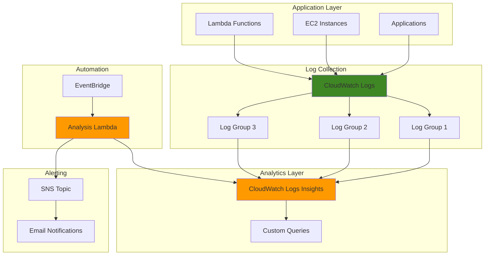

# CloudWatch Log Analytics with Insights

## Problem

Organizations generate massive volumes of application and system logs across distributed architectures, making it difficult to quickly identify issues, monitor performance trends, and extract actionable insights. Traditional log analysis requires complex ETL pipelines and expensive data processing infrastructure, while manual log searching is time-consuming and error-prone. Without efficient log analytics capabilities, teams struggle to maintain system reliability and troubleshoot problems effectively.

## Solution

CloudWatch Logs Insights provides a serverless, real-time log analytics service that enables SQL-like queries across massive log datasets without complex infrastructure setup. This solution combines CloudWatch Logs for centralized log collection, Logs Insights for interactive querying, Lambda for automated analysis, and SNS for intelligent alerting. The architecture delivers fast, cost-effective log analytics with automated anomaly detection and notification capabilities.

## Architecture Diagram



## Prerequisites

1. AWS account with CloudWatch Logs, Lambda, EventBridge, and SNS permissions
2. AWS CLI v2 installed and configured (or AWS CloudShell)
3. Basic understanding of log formats and SQL-like query syntax
4. Existing applications generating logs or sample log data
5. Email address for receiving alerts and notifications
6. Estimated cost: $10-30/month for moderate log volumes (varies by data ingestion)

> **Note**: CloudWatch Logs charges based on data ingestion, storage, and query execution. Monitor usage to control costs in production environments. See [CloudWatch Logs pricing](https://aws.amazon.com/cloudwatch/pricing/) for details.

## Preparation

```bash
# Set environment variables
export AWS_REGION=$(aws configure get region)
export AWS_ACCOUNT_ID=$(aws sts get-caller-identity \
    --query Account --output text)

# Generate unique identifiers for resources
RANDOM_SUFFIX=$(aws secretsmanager get-random-password \
    --exclude-punctuation --exclude-uppercase \
    --password-length 6 --require-each-included-type \
    --output text --query RandomPassword)

export LOG_GROUP_NAME="/aws/lambda/log-analytics-${RANDOM_SUFFIX}"
export SNS_TOPIC_NAME="log-analytics-alerts-${RANDOM_SUFFIX}"
export LAMBDA_FUNCTION_NAME="log-analytics-processor-${RANDOM_SUFFIX}"

# Set your email for notifications
export NOTIFICATION_EMAIL="your-email@example.com"

echo "Environment prepared for log analytics solution"
echo "Log Group: ${LOG_GROUP_NAME}"
echo "SNS Topic: ${SNS_TOPIC_NAME}"
echo "Lambda Function: ${LAMBDA_FUNCTION_NAME}"
```

## Steps

1. **Create CloudWatch Log Group for Centralized Logging**:

   CloudWatch Logs provides a centralized, scalable logging solution that automatically handles log retention, indexing, and access control. Creating a dedicated log group establishes the foundation for our analytics pipeline, enabling secure log aggregation from multiple sources while maintaining performance and cost efficiency.

   ```bash
   # Create log group with 30-day retention
   aws logs create-log-group \
       --log-group-name ${LOG_GROUP_NAME} \
       --region ${AWS_REGION}
   
   # Set retention policy to control costs
   aws logs put-retention-policy \
       --log-group-name ${LOG_GROUP_NAME} \
       --retention-in-days 30
   
   echo "✅ Log group created: ${LOG_GROUP_NAME}"
   ```

   The log group is now ready to receive log data from applications, EC2 instances, and Lambda functions. The 30-day retention policy balances analytical needs with cost optimization, automatically managing log lifecycle without manual intervention.

2. **Generate Sample Log Data for Analysis**:

   To demonstrate the analytics capabilities, we'll create realistic application logs that simulate common scenarios like API requests, errors, and performance metrics. This sample data enables immediate testing of our analytics queries and establishes patterns for real-world log analysis.

   ```bash
   # Create sample log entries with various patterns
   TIMESTAMP1=$(date +%s000)
   TIMESTAMP2=$((TIMESTAMP1 + 1000))
   TIMESTAMP3=$((TIMESTAMP2 + 1000))
   TIMESTAMP4=$((TIMESTAMP3 + 1000))
   TIMESTAMP5=$((TIMESTAMP4 + 1000))
   
   aws logs put-log-events \
       --log-group-name ${LOG_GROUP_NAME} \
       --log-stream-name "api-server-001" \
       --log-events '[
         {
           "timestamp": '$TIMESTAMP1',
           "message": "[INFO] API Request: GET /users/123 - 200 - 45ms"
         },
         {
           "timestamp": '$TIMESTAMP2',
           "message": "[ERROR] Database connection failed - Connection timeout"
         },
         {
           "timestamp": '$TIMESTAMP3',
           "message": "[INFO] API Request: POST /orders - 201 - 120ms"
         },
         {
           "timestamp": '$TIMESTAMP4',
           "message": "[WARN] High memory usage detected: 85%"
         },
         {
           "timestamp": '$TIMESTAMP5',
           "message": "[INFO] API Request: GET /products - 200 - 32ms"
         }
       ]'
   
   echo "✅ Sample log data generated successfully"
   ```

   The sample logs now provide realistic data for testing analytics queries. These entries represent common application scenarios that operations teams regularly monitor and analyze for performance optimization and issue resolution.

3. **Create SNS Topic for Alert Notifications**:

   Amazon SNS enables reliable, scalable notification delivery across multiple channels including email, SMS, and application endpoints. Setting up the notification infrastructure early ensures that automated alerts can reach the appropriate stakeholders when log analysis detects critical issues or anomalies.

   ```bash
   # Create SNS topic for alerts
   SNS_TOPIC_ARN=$(aws sns create-topic \
       --name ${SNS_TOPIC_NAME} \
       --query 'TopicArn' --output text)
   
   # Subscribe email address to receive notifications
   aws sns subscribe \
       --topic-arn ${SNS_TOPIC_ARN} \
       --protocol email \
       --notification-endpoint ${NOTIFICATION_EMAIL}
   
   echo "✅ SNS topic created: ${SNS_TOPIC_ARN}"
   echo "📧 Please check your email and confirm the subscription"
   ```

   The notification system is now configured to deliver real-time alerts. The email subscription provides immediate visibility into system issues, while the SNS architecture enables future expansion to additional notification channels as organizational needs evolve.

4. **Create IAM Role for Lambda Analytics Function**:

   IAM roles enable secure, temporary credential delegation following the principle of least privilege. This role grants our Lambda function only the specific permissions needed to read logs, execute queries, and send notifications, reducing security risk while maintaining operational functionality.

   ```bash
   # Create trust policy for Lambda
   cat > trust-policy.json << EOF
{
    "Version": "2012-10-17",
    "Statement": [
        {
            "Effect": "Allow",
            "Principal": {
                "Service": "lambda.amazonaws.com"
            },
            "Action": "sts:AssumeRole"
        }
    ]
}
EOF
   
   # Create IAM role
   LAMBDA_ROLE_ARN=$(aws iam create-role \
       --role-name ${LAMBDA_FUNCTION_NAME}-role \
       --assume-role-policy-document file://trust-policy.json \
       --query 'Role.Arn' --output text)
   
   echo "✅ IAM role created: ${LAMBDA_ROLE_ARN}"
   ```

   The IAM role establishes the security foundation for our analytics function. This approach eliminates the need for hardcoded credentials while ensuring the Lambda function can access only the specific AWS resources required for log analysis operations.

5. **Attach Required IAM Policies to Lambda Role**:

   Attaching specific managed policies grants the Lambda function precise permissions for CloudWatch Logs operations, SNS publishing, and basic Lambda execution. This granular permission model follows AWS security best practices while enabling all required functionality for automated log analytics.

   ```bash
   # Attach CloudWatch Logs permissions
   aws iam attach-role-policy \
       --role-name ${LAMBDA_FUNCTION_NAME}-role \
       --policy-arn arn:aws:iam::aws:policy/service-role/AWSLambdaBasicExecutionRole
   
   # Create custom policy for CloudWatch Logs Insights and SNS
   cat > logs-sns-policy.json << EOF
{
    "Version": "2012-10-17",
    "Statement": [
        {
            "Effect": "Allow",
            "Action": [
                "logs:StartQuery",
                "logs:GetQueryResults",
                "logs:DescribeLogGroups"
            ],
            "Resource": "*"
        },
        {
            "Effect": "Allow",
            "Action": [
                "sns:Publish"
            ],
            "Resource": "${SNS_TOPIC_ARN}"
        }
    ]
}
EOF
   
   # Create and attach custom policy
   aws iam create-policy \
       --policy-name ${LAMBDA_FUNCTION_NAME}-logs-sns-policy \
       --policy-document file://logs-sns-policy.json
   
   aws iam attach-role-policy \
       --role-name ${LAMBDA_FUNCTION_NAME}-role \
       --policy-arn arn:aws:iam::${AWS_ACCOUNT_ID}:policy/${LAMBDA_FUNCTION_NAME}-logs-sns-policy
   
   # Wait for IAM consistency
   sleep 10
   
   echo "✅ IAM policies attached successfully"
   ```

   The permissions are now properly configured to enable secure log analytics operations. This layered security approach ensures the function can perform necessary analysis while maintaining strict access controls on sensitive log data.

6. **Create Lambda Function for Automated Log Analysis**:

   AWS Lambda provides serverless compute that automatically scales based on demand, making it ideal for log analysis workloads that vary in frequency and intensity. This function will execute CloudWatch Logs Insights queries on a schedule, analyzing patterns and triggering alerts when specific conditions are detected.

   ```bash
   # Create Lambda function code
   cat > lambda_function.py << EOF
import json
import boto3
import time
import os
from datetime import datetime, timedelta

def lambda_handler(event, context):
    logs_client = boto3.client('logs')
    sns_client = boto3.client('sns')
    
    log_group_name = '${LOG_GROUP_NAME}'
    sns_topic_arn = '${SNS_TOPIC_ARN}'
    
    # Query for errors in the last hour
    end_time = int(time.time())
    start_time = end_time - 3600  # 1 hour ago
    
    query = '''
    fields @timestamp, @message
    | filter @message like /ERROR/
    | stats count() as error_count
    '''
    
    try:
        # Start CloudWatch Logs Insights query
        response = logs_client.start_query(
            logGroupName=log_group_name,
            startTime=start_time,
            endTime=end_time,
            queryString=query
        )
        
        query_id = response['queryId']
        
        # Wait for query completion with timeout
        max_wait = 30
        wait_time = 0
        while wait_time < max_wait:
            result = logs_client.get_query_results(queryId=query_id)
            if result['status'] == 'Complete':
                break
            time.sleep(1)
            wait_time += 1
        
        # Check results and send alert if errors found
        if result['status'] == 'Complete' and result['results']:
            if len(result['results']) > 0 and len(result['results'][0]) > 0:
                error_count = int(result['results'][0][0]['value'])
                if error_count > 0:
                    message = f"Log Analytics Alert: {error_count} errors detected in the last hour\\n\\nTimestamp: {datetime.now().isoformat()}\\nLog Group: {log_group_name}"
                    sns_client.publish(
                        TopicArn=sns_topic_arn,
                        Message=message,
                        Subject='CloudWatch Log Analytics Alert'
                    )
                    print(f"Alert sent: {error_count} errors detected")
                else:
                    print("No errors detected in the last hour")
            else:
                print("No results returned from query")
        else:
            print(f"Query incomplete or failed. Status: {result.get('status', 'Unknown')}")
                
        return {
            'statusCode': 200,
            'body': json.dumps('Log analysis completed successfully')
        }
        
    except Exception as e:
        print(f"Error during log analysis: {str(e)}")
        return {
            'statusCode': 500,
            'body': json.dumps(f"Error: {str(e)}")
        }
EOF
   
   # Package the function
   zip lambda-function.zip lambda_function.py
   
   # Create Lambda function with latest Python runtime
   aws lambda create-function \
       --function-name ${LAMBDA_FUNCTION_NAME} \
       --runtime python3.12 \
       --role ${LAMBDA_ROLE_ARN} \
       --handler lambda_function.lambda_handler \
       --zip-file fileb://lambda-function.zip \
       --timeout 60 \
       --description "Automated CloudWatch Logs analysis and alerting"
   
   echo "✅ Lambda function created: ${LAMBDA_FUNCTION_NAME}"
   ```

   The Lambda function is now deployed with automated error detection capabilities. This serverless approach eliminates infrastructure management while providing reliable, cost-effective log analysis that scales automatically with your logging volume.

7. **Create EventBridge Rule for Scheduled Analysis**:

   Amazon EventBridge (formerly CloudWatch Events) provides reliable, cron-like scheduling for automated workflows. Scheduling our log analysis function ensures continuous monitoring without manual intervention, enabling proactive issue detection and maintaining system observability around the clock.

   ```bash
   # Create EventBridge rule for every 5 minutes
   aws events put-rule \
       --name ${LAMBDA_FUNCTION_NAME}-schedule \
       --schedule-expression "rate(5 minutes)" \
       --description "Automated log analysis every 5 minutes" \
       --state ENABLED
   
   # Add Lambda function as target
   aws events put-targets \
       --rule ${LAMBDA_FUNCTION_NAME}-schedule \
       --targets "Id"="1","Arn"="arn:aws:lambda:${AWS_REGION}:${AWS_ACCOUNT_ID}:function:${LAMBDA_FUNCTION_NAME}"
   
   # Grant permission for EventBridge to invoke Lambda
   aws lambda add-permission \
       --function-name ${LAMBDA_FUNCTION_NAME} \
       --statement-id allow-eventbridge \
       --action lambda:InvokeFunction \
       --principal events.amazonaws.com \
       --source-arn arn:aws:events:${AWS_REGION}:${AWS_ACCOUNT_ID}:rule/${LAMBDA_FUNCTION_NAME}-schedule
   
   echo "✅ Automated log analysis scheduled every 5 minutes"
   ```

   The scheduling system is now active and will automatically analyze logs for errors every 5 minutes. This continuous monitoring approach ensures rapid detection of issues while the 5-minute interval balances responsiveness with cost efficiency.

8. **Test Manual CloudWatch Logs Insights Queries**:

   CloudWatch Logs Insights provides a powerful query language similar to SQL that enables interactive exploration of log data. Testing manual queries helps validate our setup and demonstrates the analytical capabilities available for ad-hoc troubleshooting and performance analysis.

   ```bash
   # Execute a sample query to find API response times
   QUERY_ID=$(aws logs start-query \
       --log-group-name ${LOG_GROUP_NAME} \
       --start-time $(date -d '1 hour ago' +%s) \
       --end-time $(date +%s) \
       --query-string 'fields @timestamp, @message | filter @message like /API Request/ | parse @message "- * -" as status | parse @message "- *ms" as response_time | stats avg(response_time) as avg_response_time' \
       --query 'queryId' --output text)
   
   # Wait for query completion and get results
   sleep 5
   aws logs get-query-results --query-id ${QUERY_ID}
   
   echo "✅ Sample query executed successfully"
   ```

   The manual query demonstrates the analytical power available for interactive log exploration. This capability enables operations teams to quickly investigate issues, analyze performance trends, and extract insights from large log datasets without complex data processing pipelines.

## Validation & Testing

1. **Verify log data ingestion and retention**:

   ```bash
   # Check log group and streams
   aws logs describe-log-groups \
       --log-group-name-prefix ${LOG_GROUP_NAME}
   
   # Verify log events were stored
   aws logs describe-log-streams \
       --log-group-name ${LOG_GROUP_NAME}
   ```

   Expected output: Log group with proper retention policy and log streams containing sample data.

2. **Test CloudWatch Logs Insights query functionality**:

   ```bash
   # Run comprehensive error analysis query
   INSIGHTS_QUERY=$(aws logs start-query \
       --log-group-name ${LOG_GROUP_NAME} \
       --start-time $(date -d '2 hours ago' +%s) \
       --end-time $(date +%s) \
       --query-string 'fields @timestamp, @message | filter @message like /ERROR/ | stats count() as error_count by bin(5m)' \
       --query 'queryId' --output text)
   
   # Get query results
   sleep 3
   aws logs get-query-results --query-id ${INSIGHTS_QUERY}
   ```

   Expected output: Query results showing error patterns over time periods.

3. **Validate Lambda function execution and alerting**:

   ```bash
   # Trigger Lambda function manually
   aws lambda invoke \
       --function-name ${LAMBDA_FUNCTION_NAME} \
       --payload '{}' \
       response.json
   
   # Check execution results
   cat response.json
   
   # Verify SNS topic and subscription
   aws sns list-subscriptions-by-topic \
       --topic-arn ${SNS_TOPIC_ARN}
   ```

   Expected output: Successful Lambda execution and confirmed email subscription.

4. **Test automated scheduling and notifications**:

   ```bash
   # Check EventBridge rule status
   aws events describe-rule \
       --name ${LAMBDA_FUNCTION_NAME}-schedule
   
   # View recent Lambda invocations
   aws logs filter-log-events \
       --log-group-name /aws/lambda/${LAMBDA_FUNCTION_NAME} \
       --start-time $(date -d '10 minutes ago' +%s)
   ```

   Expected output: Active schedule rule and Lambda execution logs from automated runs.

## Cleanup

1. **Remove EventBridge rule and targets**:

   ```bash
   # Remove targets from rule
   aws events remove-targets \
       --rule ${LAMBDA_FUNCTION_NAME}-schedule \
       --ids "1"
   
   # Delete the rule
   aws events delete-rule \
       --name ${LAMBDA_FUNCTION_NAME}-schedule
   
   echo "✅ EventBridge rule deleted"
   ```

2. **Delete Lambda function and associated resources**:

   ```bash
   # Delete Lambda function
   aws lambda delete-function \
       --function-name ${LAMBDA_FUNCTION_NAME}
   
   # Remove local files
   rm -f lambda_function.py lambda-function.zip response.json \
         trust-policy.json logs-sns-policy.json
   
   echo "✅ Lambda function and files deleted"
   ```

3. **Remove IAM role and policies**:

   ```bash
   # Detach policies from role
   aws iam detach-role-policy \
       --role-name ${LAMBDA_FUNCTION_NAME}-role \
       --policy-arn arn:aws:iam::aws:policy/service-role/AWSLambdaBasicExecutionRole
   
   aws iam detach-role-policy \
       --role-name ${LAMBDA_FUNCTION_NAME}-role \
       --policy-arn arn:aws:iam::${AWS_ACCOUNT_ID}:policy/${LAMBDA_FUNCTION_NAME}-logs-sns-policy
   
   # Delete custom policy and role
   aws iam delete-policy \
       --policy-arn arn:aws:iam::${AWS_ACCOUNT_ID}:policy/${LAMBDA_FUNCTION_NAME}-logs-sns-policy
   
   aws iam delete-role \
       --role-name ${LAMBDA_FUNCTION_NAME}-role
   
   echo "✅ IAM resources deleted"
   ```

4. **Remove SNS topic and CloudWatch Logs**:

   ```bash
   # Delete SNS topic
   aws sns delete-topic --topic-arn ${SNS_TOPIC_ARN}
   
   # Delete log group
   aws logs delete-log-group \
       --log-group-name ${LOG_GROUP_NAME}
   
   echo "✅ SNS topic and log group deleted"
   echo "🧹 All resources have been cleaned up"
   ```

## Discussion

CloudWatch Logs Insights transforms log analysis from a complex, infrastructure-heavy process into a serverless, SQL-like querying experience that scales automatically with your data volume. This solution demonstrates how modern cloud services enable sophisticated analytics capabilities without traditional data warehouse overhead, making advanced log analysis accessible to teams of all sizes. The service can process terabytes of log data in seconds, providing near real-time insights into application behavior and system performance.

The architecture leverages several key AWS services working in concert: CloudWatch Logs provides centralized, durable log storage with automatic indexing, while Logs Insights delivers interactive querying capabilities using a purpose-built query language. Lambda functions enable automated analysis workflows that run without server management, and SNS provides reliable notification delivery across multiple channels. EventBridge ensures precise scheduling of analysis tasks, creating a robust monitoring pipeline that operates continuously without manual intervention.

The automated alerting system demonstrates proactive monitoring patterns that detect issues before they impact users. By scheduling regular analysis of error patterns, response times, and system metrics, organizations can shift from reactive troubleshooting to predictive maintenance. The solution's flexibility allows for custom query development that adapts to specific application architectures and business requirements, making it valuable across diverse operational environments. The [CloudWatch Logs Insights query syntax](https://docs.aws.amazon.com/AmazonCloudWatch/latest/logs/CWL_QuerySyntax.html) supports advanced filtering, parsing, and statistical operations.

Cost optimization is achieved through intelligent retention policies, efficient query execution, and serverless computing models that charge only for actual usage. Organizations can control expenses by adjusting log retention periods, optimizing query frequency, and leveraging CloudWatch Logs' built-in compression and lifecycle management capabilities. The solution follows AWS Well-Architected Framework principles for operational excellence, security, reliability, and cost optimization.

> **Tip**: Use CloudWatch Logs Insights' query optimization features like field selection and time range filtering to improve performance and reduce costs. Consider implementing custom metrics extraction for frequently accessed data patterns using the [parse command](https://docs.aws.amazon.com/AmazonCloudWatch/latest/logs/CWL_QuerySyntax.html) to structure unstructured log data.

## Challenge

Extend this solution by implementing these enhancements:

1. **Multi-Application Dashboard**: Create a CloudWatch dashboard that visualizes log analytics results across multiple applications, showing error rates, performance trends, and custom business metrics extracted from logs using CloudWatch custom metrics.

2. **Intelligent Anomaly Detection**: Integrate Amazon CloudWatch Anomaly Detection to automatically identify unusual patterns in log metrics, reducing false positives while catching subtle issues that static thresholds might miss.

3. **Log Correlation Engine**: Build a Lambda function that correlates events across multiple log sources using trace IDs or session identifiers, enabling end-to-end transaction analysis in distributed systems with AWS X-Ray integration.

4. **Custom Metric Generation**: Develop automated processes that extract business metrics from log data and publish them as CloudWatch custom metrics, enabling integration with existing monitoring and alerting systems.

5. **Advanced Query Templates**: Create a library of reusable Logs Insights query templates for common analysis patterns like security monitoring, performance optimization, and business intelligence, complete with parameterization for different environments and stored in AWS Systems Manager Parameter Store.

## Infrastructure Code

### Available Infrastructure as Code:

- [Infrastructure Code Overview](code/README.md) - Detailed description of all infrastructure components
- [AWS CDK (Python)](code/cdk-python/) - AWS CDK Python implementation
- [AWS CDK (TypeScript)](code/cdk-typescript/) - AWS CDK TypeScript implementation
- [CloudFormation](code/cloudformation.yaml) - AWS CloudFormation template
- [Bash CLI Scripts](code/scripts/) - Example bash scripts using AWS CLI commands to deploy infrastructure
- [Terraform](code/terraform/) - Terraform configuration files