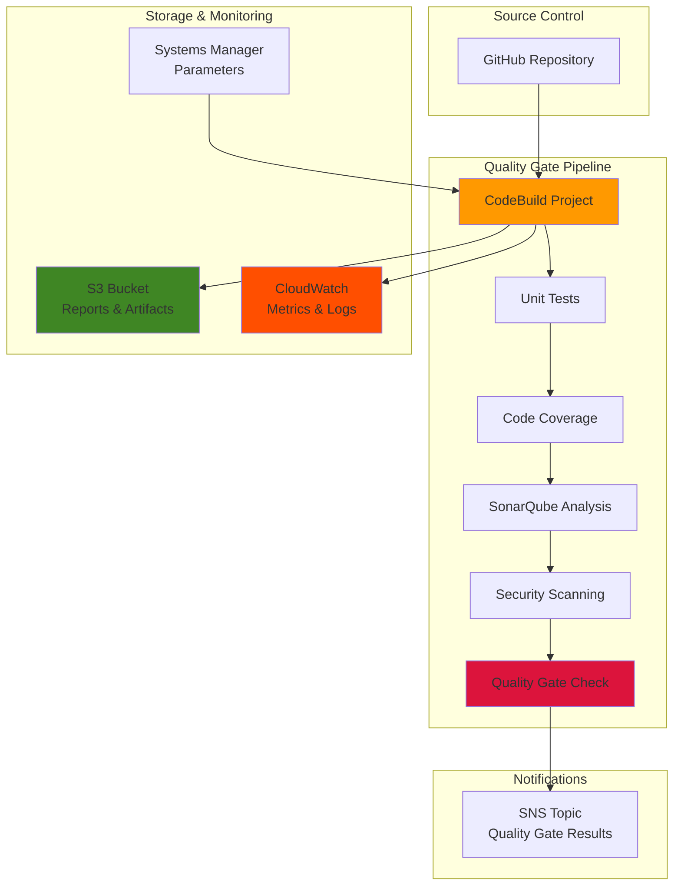

# Code Quality Gates with CodeBuild


## Problem

Development teams struggle with maintaining consistent code quality across large projects and multiple contributors. Manual code reviews miss subtle issues, security vulnerabilities slip through, and technical debt accumulates over time. Without automated quality gates, teams face increased bug rates, security incidents, and decreased developer productivity. Organizations need a comprehensive solution that enforces quality standards, prevents low-quality code from reaching production, and provides actionable feedback to developers while maintaining rapid development cycles.

## Solution

This solution implements automated code quality gates using AWS CodeBuild with integrated static analysis, security scanning, and test execution. The system creates enforceable quality thresholds that prevent deployment of substandard code while providing developers with immediate feedback. By combining multiple quality checks including SonarQube analysis, security scanning, unit testing, and coverage metrics, teams can maintain high code quality standards at scale.

## Architecture Diagram



## Prerequisites

1. AWS account with CodeBuild, S3, CloudWatch, and Systems Manager permissions
2. AWS CLI v2 installed and configured (or AWS CloudShell)
3. GitHub repository with sample application code
4. Basic understanding of CI/CD pipelines and code quality metrics
5. Familiarity with buildspec.yml syntax and Docker concepts
6. Estimated cost: $5-15 per month for CodeBuild compute time and S3 storage

> **Note**: This recipe demonstrates quality gates using Java/Maven, but the concepts apply to any programming language and build system.

## Preparation

```bash
# Set environment variables
export AWS_REGION=$(aws configure get region)
export AWS_ACCOUNT_ID=$(aws sts get-caller-identity \
    --query Account --output text)

# Generate unique identifiers for resources
RANDOM_SUFFIX=$(aws secretsmanager get-random-password \
    --exclude-punctuation --exclude-uppercase \
    --password-length 6 --require-each-included-type \
    --output text --query RandomPassword)

export PROJECT_NAME="quality-gates-demo-${RANDOM_SUFFIX}"
export BUCKET_NAME="codebuild-quality-gates-${AWS_ACCOUNT_ID}-${RANDOM_SUFFIX}"
export SNS_TOPIC_NAME="quality-gate-notifications-${RANDOM_SUFFIX}"

# Create S3 bucket for build artifacts and reports
aws s3 mb s3://${BUCKET_NAME} --region ${AWS_REGION}

# Enable versioning on the bucket
aws s3api put-bucket-versioning \
    --bucket ${BUCKET_NAME} \
    --versioning-configuration Status=Enabled

echo "✅ Created S3 bucket: ${BUCKET_NAME}"
```

## Steps

1. **Create SNS Topic for Quality Gate Notifications**:

   Amazon SNS enables real-time notifications about quality gate status changes, ensuring immediate awareness when builds fail quality checks. This asynchronous messaging service provides reliable, scalable notification delivery to multiple subscribers, making it ideal for alerting development teams, operations staff, and automated remediation systems about quality gate failures.

   ```bash
   # Create SNS topic for notifications
   SNS_TOPIC_ARN=$(aws sns create-topic \
       --name ${SNS_TOPIC_NAME} \
       --query TopicArn --output text)
   
   # Subscribe your email to notifications
   aws sns subscribe \
       --topic-arn ${SNS_TOPIC_ARN} \
       --protocol email \
       --notification-endpoint your-email@example.com
   
   echo "✅ Created SNS topic: ${SNS_TOPIC_ARN}"
   ```

   The SNS topic is now established and ready to deliver quality gate notifications. This communication channel enables rapid response to quality issues and supports compliance requirements by providing audit trails of quality gate events. For more information about SNS capabilities and integration patterns, see the [Amazon SNS documentation](https://docs.aws.amazon.com/sns/latest/dg/welcome.html).

2. **Store Quality Gate Configuration in Systems Manager**:

   AWS Systems Manager Parameter Store provides centralized, secure configuration management for quality gate thresholds. This approach enables teams to adjust quality standards without modifying buildspec files or redeploying applications. Parameter Store supports hierarchical organization, version control, and fine-grained access control, making it ideal for managing quality gate configurations across multiple environments and teams.

   ```bash
   # Create quality gate thresholds as parameters
   aws ssm put-parameter \
       --name "/quality-gates/coverage-threshold" \
       --value "80" \
       --type "String" \
       --description "Minimum code coverage percentage"
   
   aws ssm put-parameter \
       --name "/quality-gates/sonar-quality-gate" \
       --value "ERROR" \
       --type "String" \
       --description "SonarQube quality gate status threshold"
   
   aws ssm put-parameter \
       --name "/quality-gates/security-threshold" \
       --value "HIGH" \
       --type "String" \
       --description "Maximum security vulnerability level"
   
   echo "✅ Stored quality gate parameters in Systems Manager"
   ```

   These parameters establish the quality standards that will be enforced during builds. The hierarchical naming convention "/quality-gates/" enables organized management of related configurations and supports environment-specific overrides. CodeBuild will retrieve these values during build execution, ensuring consistent quality enforcement across all builds. Learn more about Parameter Store capabilities in the [AWS Systems Manager Parameter Store documentation](https://docs.aws.amazon.com/systems-manager/latest/userguide/systems-manager-parameter-store.html).

3. **Create IAM Service Role for CodeBuild**:

   IAM service roles enable CodeBuild to securely access AWS services using temporary credentials based on the principle of least privilege. This security model eliminates the need for hardcoded credentials while providing fine-grained access control to specific AWS resources. The service role we create will grant CodeBuild the minimum permissions required to execute quality gates, access configuration parameters, and publish notifications.

   ```bash
   # Create trust policy for CodeBuild
   cat > trust-policy.json << EOF
   {
       "Version": "2012-10-17",
       "Statement": [
           {
               "Effect": "Allow",
               "Principal": {
                   "Service": "codebuild.amazonaws.com"
               },
               "Action": "sts:AssumeRole"
           }
       ]
   }
   EOF
   
   # Create IAM role
   aws iam create-role \
       --role-name ${PROJECT_NAME}-service-role \
       --assume-role-policy-document file://trust-policy.json
   
   # Attach managed policies
   aws iam attach-role-policy \
       --role-name ${PROJECT_NAME}-service-role \
       --policy-arn arn:aws:iam::aws:policy/CloudWatchLogsFullAccess
   
   aws iam attach-role-policy \
       --role-name ${PROJECT_NAME}-service-role \
       --policy-arn arn:aws:iam::aws:policy/AmazonS3FullAccess
   
   # Create custom policy for additional permissions
   cat > quality-gate-policy.json << EOF
   {
       "Version": "2012-10-17",
       "Statement": [
           {
               "Effect": "Allow",
               "Action": [
                   "ssm:GetParameter",
                   "ssm:GetParameters",
                   "sns:Publish",
                   "codebuild:BatchGetBuilds"
               ],
               "Resource": "*"
           }
       ]
   }
   EOF
   
   aws iam create-policy \
       --policy-name ${PROJECT_NAME}-quality-gate-policy \
       --policy-document file://quality-gate-policy.json
   
   aws iam attach-role-policy \
       --role-name ${PROJECT_NAME}-service-role \
       --policy-arn arn:aws:iam::${AWS_ACCOUNT_ID}:policy/${PROJECT_NAME}-quality-gate-policy
   
   echo "✅ Created IAM service role with quality gate permissions"
   ```

   The service role is now configured with the necessary permissions to execute quality gates securely. CodeBuild will assume this role during build execution, enabling access to CloudWatch Logs for build monitoring, S3 for artifact storage, Parameter Store for configuration retrieval, and SNS for notifications. This security configuration follows AWS best practices for service-to-service authentication and authorization.

4. **Create Comprehensive buildspec.yml for Quality Gates**:

   The buildspec.yml file defines the automated quality gate pipeline that will execute during each build. This specification implements a multi-phase approach to quality assurance, progressing from compilation and unit testing through coverage analysis, static code analysis, security scanning, and integration testing. Each phase acts as a quality gate that must pass before proceeding to the next phase, implementing fail-fast principles to provide rapid feedback to developers.

   ```bash
   # Create buildspec.yml with quality gate implementation
   cat > buildspec.yml << 'EOF'
   version: 0.2
   
   env:
     parameter-store:
       COVERAGE_THRESHOLD: /quality-gates/coverage-threshold
       SONAR_QUALITY_GATE: /quality-gates/sonar-quality-gate
       SECURITY_THRESHOLD: /quality-gates/security-threshold
     variables:
       MAVEN_OPTS: "-Dmaven.repo.local=.m2/repository"
   
   phases:
     install:
       runtime-versions:
         java: corretto21
       commands:
         - echo "Installing dependencies and tools..."
         - apt-get update && apt-get install -y curl unzip
         - curl -sSL https://github.com/SonarSource/sonar-scanner-cli/releases/download/4.8.0.2856/sonar-scanner-cli-4.8.0.2856-linux.zip -o sonar-scanner.zip
         - unzip sonar-scanner.zip
         - export PATH=$PATH:$(pwd)/sonar-scanner-4.8.0.2856-linux/bin
         - curl -sSL https://github.com/jeremylong/DependencyCheck/releases/download/v8.4.0/dependency-check-8.4.0-release.zip -o dependency-check.zip
         - unzip dependency-check.zip
         - chmod +x dependency-check/bin/dependency-check.sh
   
     pre_build:
       commands:
         - echo "Validating build environment..."
         - java -version
         - mvn -version
         - echo "Build started on $(date)"
   
     build:
       commands:
         - echo "=== PHASE 1: Compile and Unit Tests ==="
         - mvn clean compile test
         - echo "✅ Unit tests completed"
         
         - echo "=== PHASE 2: Code Coverage Analysis ==="
         - mvn jacoco:report
         - COVERAGE=$(grep -o 'Total[^%]*%' target/site/jacoco/index.html | grep -o '[0-9]*' | head -1)
         - echo "Code coverage: ${COVERAGE}%"
         - |
           if [ "${COVERAGE:-0}" -lt "${COVERAGE_THRESHOLD}" ]; then
             echo "❌ QUALITY GATE FAILED: Coverage ${COVERAGE}% below threshold ${COVERAGE_THRESHOLD}%"
             aws sns publish --topic-arn ${SNS_TOPIC_ARN} --message "Quality Gate Failed: Coverage ${COVERAGE}% below threshold ${COVERAGE_THRESHOLD}%" --subject "Quality Gate Failure"
             exit 1
           fi
         - echo "✅ Code coverage check passed"
         
         - echo "=== PHASE 3: Static Code Analysis ==="
         - mvn sonar:sonar -Dsonar.projectKey=quality-gates-demo -Dsonar.host.url=https://sonarcloud.io -Dsonar.token=${SONAR_TOKEN}
         - echo "✅ SonarQube analysis completed"
         
         - echo "=== PHASE 4: Security Scanning ==="
         - ./dependency-check/bin/dependency-check.sh --project "Quality Gates Demo" --scan . --format JSON --out ./security-report.json
         - |
           HIGH_VULNS=$(jq '.dependencies[].vulnerabilities[]? | select(.severity == "HIGH") | length' security-report.json 2>/dev/null | wc -l)
           if [ "${HIGH_VULNS}" -gt 0 ]; then
             echo "❌ QUALITY GATE FAILED: Found ${HIGH_VULNS} HIGH severity vulnerabilities"
             aws sns publish --topic-arn ${SNS_TOPIC_ARN} --message "Quality Gate Failed: ${HIGH_VULNS} HIGH severity vulnerabilities found" --subject "Security Gate Failure"
             exit 1
           fi
         - echo "✅ Security scan passed"
         
         - echo "=== PHASE 5: Integration Tests ==="
         - mvn verify
         - echo "✅ Integration tests completed"
         
         - echo "=== PHASE 6: Quality Gate Summary ==="
         - echo "All quality gates passed successfully!"
         - aws sns publish --topic-arn ${SNS_TOPIC_ARN} --message "Quality Gate Success: All checks passed for build ${CODEBUILD_BUILD_ID}" --subject "Quality Gate Success"
   
     post_build:
       commands:
         - echo "=== Generating Quality Reports ==="
         - mkdir -p quality-reports
         - cp -r target/site/jacoco quality-reports/coverage-report
         - cp security-report.json quality-reports/
         - echo "Build completed on $(date)"
   
   artifacts:
     files:
       - target/*.jar
       - quality-reports/**/*
     name: quality-gates-artifacts
   
   reports:
     jacoco-reports:
       files:
         - target/site/jacoco/jacoco.xml
       file-format: JACOCOXML
     junit-reports:
       files:
         - target/surefire-reports/*.xml
       file-format: JUNITXML
   
   cache:
     paths:
       - .m2/repository/**/*
   EOF
   
   echo "✅ Created comprehensive buildspec.yml with quality gates"
   ```

   The buildspec configuration now implements a comprehensive quality gate pipeline with automated threshold enforcement and notification integration. The specification uses CodeBuild's built-in Parameter Store integration to retrieve quality thresholds dynamically, enabling configuration changes without buildspec modifications. Each quality gate failure triggers immediate SNS notifications and build termination, providing rapid feedback to development teams. For detailed information about buildspec syntax and capabilities, refer to the [CodeBuild buildspec reference](https://docs.aws.amazon.com/codebuild/latest/userguide/build-spec-ref.html).

5. **Create Sample Java Application with Quality Gate Configuration**:

   Creating a sample application with comprehensive test coverage demonstrates how quality gates function in practice. This Maven-based Java project includes JaCoCo for code coverage analysis, comprehensive unit tests to meet coverage thresholds, and proper Maven configuration for integration with SonarQube analysis. The application serves as a baseline for testing quality gate enforcement and provides a foundation for understanding how quality metrics are measured and reported.

   ```bash
   # Create sample Maven project structure
   mkdir -p src/main/java/com/example/qualitygates
   mkdir -p src/test/java/com/example/qualitygates
   
   # Create pom.xml with quality gate plugins
   cat > pom.xml << 'EOF'
   <?xml version="1.0" encoding="UTF-8"?>
   <project xmlns="http://maven.apache.org/POM/4.0.0"
            xmlns:xsi="http://www.w3.org/2001/XMLSchema-instance"
            xsi:schemaLocation="http://maven.apache.org/POM/4.0.0 
                              http://maven.apache.org/xsd/maven-4.0.0.xsd">
       <modelVersion>4.0.0</modelVersion>
       
       <groupId>com.example</groupId>
       <artifactId>quality-gates-demo</artifactId>
       <version>1.0-SNAPSHOT</version>
       <packaging>jar</packaging>
       
       <name>Quality Gates Demo</name>
       <description>Demo project for implementing quality gates</description>
       
       <properties>
           <maven.compiler.source>21</maven.compiler.source>
           <maven.compiler.target>21</maven.compiler.target>
           <project.build.sourceEncoding>UTF-8</project.build.sourceEncoding>
           <sonar.organization>your-sonar-org</sonar.organization>
           <sonar.host.url>https://sonarcloud.io</sonar.host.url>
           <sonar.coverage.jacoco.xmlReportPaths>target/site/jacoco/jacoco.xml</sonar.coverage.jacoco.xmlReportPaths>
       </properties>
       
       <dependencies>
           <dependency>
               <groupId>org.junit.jupiter</groupId>
               <artifactId>junit-jupiter</artifactId>
               <version>5.9.2</version>
               <scope>test</scope>
           </dependency>
       </dependencies>
       
       <build>
           <plugins>
               <plugin>
                   <groupId>org.apache.maven.plugins</groupId>
                   <artifactId>maven-surefire-plugin</artifactId>
                   <version>3.0.0-M9</version>
               </plugin>
               
               <plugin>
                   <groupId>org.jacoco</groupId>
                   <artifactId>jacoco-maven-plugin</artifactId>
                   <version>0.8.8</version>
                   <executions>
                       <execution>
                           <goals>
                               <goal>prepare-agent</goal>
                           </goals>
                       </execution>
                       <execution>
                           <id>report</id>
                           <phase>test</phase>
                           <goals>
                               <goal>report</goal>
                           </goals>
                       </execution>
                   </executions>
               </plugin>
               
               <plugin>
                   <groupId>org.sonarsource.scanner.maven</groupId>
                   <artifactId>sonar-maven-plugin</artifactId>
                   <version>3.9.1.2184</version>
               </plugin>
           </plugins>
       </build>
   </project>
   EOF
   
   # Create sample Java class
   cat > src/main/java/com/example/qualitygates/Calculator.java << 'EOF'
   package com.example.qualitygates;
   
   /**
    * A simple calculator class to demonstrate quality gates
    */
   public class Calculator {
       
       /**
        * Adds two numbers
        * @param a first number
        * @param b second number
        * @return sum of a and b
        */
       public int add(int a, int b) {
           return a + b;
       }
       
       /**
        * Subtracts two numbers
        * @param a first number
        * @param b second number
        * @return difference of a and b
        */
       public int subtract(int a, int b) {
           return a - b;
       }
       
       /**
        * Multiplies two numbers
        * @param a first number
        * @param b second number
        * @return product of a and b
        */
       public int multiply(int a, int b) {
           return a * b;
       }
       
       /**
        * Divides two numbers
        * @param a dividend
        * @param b divisor
        * @return quotient
        * @throws IllegalArgumentException if divisor is zero
        */
       public double divide(int a, int b) {
           if (b == 0) {
               throw new IllegalArgumentException("Division by zero");
           }
           return (double) a / b;
       }
   }
   EOF
   
   # Create comprehensive test class
   cat > src/test/java/com/example/qualitygates/CalculatorTest.java << 'EOF'
   package com.example.qualitygates;
   
   import org.junit.jupiter.api.Test;
   import org.junit.jupiter.api.BeforeEach;
   import static org.junit.jupiter.api.Assertions.*;
   
   /**
    * Test class for Calculator to achieve high code coverage
    */
   public class CalculatorTest {
       
       private Calculator calculator;
       
       @BeforeEach
       void setUp() {
           calculator = new Calculator();
       }
       
       @Test
       void testAdd() {
           assertEquals(5, calculator.add(2, 3));
           assertEquals(0, calculator.add(-1, 1));
           assertEquals(-5, calculator.add(-2, -3));
       }
       
       @Test
       void testSubtract() {
           assertEquals(1, calculator.subtract(3, 2));
           assertEquals(-2, calculator.subtract(-1, 1));
           assertEquals(1, calculator.subtract(-2, -3));
       }
       
       @Test
       void testMultiply() {
           assertEquals(6, calculator.multiply(2, 3));
           assertEquals(0, calculator.multiply(0, 5));
           assertEquals(6, calculator.multiply(-2, -3));
       }
       
       @Test
       void testDivide() {
           assertEquals(2.0, calculator.divide(6, 3));
           assertEquals(-2.0, calculator.divide(-6, 3));
           assertEquals(0.5, calculator.divide(1, 2));
       }
       
       @Test
       void testDivideByZero() {
           assertThrows(IllegalArgumentException.class, () -> {
               calculator.divide(5, 0);
           });
       }
   }
   EOF
   
   echo "✅ Created sample Java application with comprehensive tests"
   ```

   The sample application now includes comprehensive test coverage designed to meet quality gate requirements. The Maven configuration integrates JaCoCo for coverage analysis and SonarQube for static code analysis, providing the foundation for quality gate enforcement. This application structure follows Java best practices and demonstrates how to organize code for effective quality measurement and reporting.

6. **Create CodeBuild Project with Quality Gate Configuration**:

   CodeBuild projects provide managed build environments that execute quality gates consistently and reliably. The project configuration specifies compute resources, runtime environment, source location, and artifact destinations. By using S3 for source storage and caching, the project optimizes build performance and provides reliable artifact management. The medium compute type provides sufficient resources for compilation, testing, and quality analysis while maintaining cost efficiency.

   ```bash
   # Upload buildspec and source code to S3
   zip -r source-code.zip . -x "*.git*" "target/*"
   aws s3 cp source-code.zip s3://${BUCKET_NAME}/source/
   
   # Create CodeBuild project
   cat > codebuild-project.json << EOF
   {
       "name": "${PROJECT_NAME}",
       "description": "Quality Gates Demo with CodeBuild",
       "source": {
           "type": "S3",
           "location": "${BUCKET_NAME}/source/source-code.zip"
       },
       "artifacts": {
           "type": "S3",
           "location": "${BUCKET_NAME}/artifacts"
       },
       "environment": {
           "type": "LINUX_CONTAINER",
           "image": "aws/codebuild/amazonlinux2-x86_64-standard:4.0",
           "computeType": "BUILD_GENERAL1_MEDIUM",
           "environmentVariables": [
               {
                   "name": "SNS_TOPIC_ARN",
                   "value": "${SNS_TOPIC_ARN}"
               }
           ]
       },
       "serviceRole": "arn:aws:iam::${AWS_ACCOUNT_ID}:role/${PROJECT_NAME}-service-role",
       "timeoutInMinutes": 60,
       "queuedTimeoutInMinutes": 480,
       "cache": {
           "type": "S3",
           "location": "${BUCKET_NAME}/cache"
       }
   }
   EOF
   
   aws codebuild create-project \
       --cli-input-json file://codebuild-project.json
   
   echo "✅ Created CodeBuild project: ${PROJECT_NAME}"
   ```

   The CodeBuild project is now configured to execute quality gates with appropriate compute resources and security permissions. The project uses the Amazon Linux 2 standard image which includes pre-installed development tools and supports the Java runtime required for our Maven-based application. S3 caching improves build performance by persisting Maven dependencies between builds, reducing both build time and network bandwidth usage.

7. **Create Quality Gate Dashboard with CloudWatch**:

   CloudWatch dashboards provide centralized monitoring and visualization of quality gate metrics, enabling teams to track build success rates, identify trends, and monitor quality gate performance over time. The dashboard combines quantitative metrics like build counts and durations with qualitative log analysis to provide comprehensive visibility into quality gate operations. This observability foundation supports continuous improvement by highlighting quality gate bottlenecks and failure patterns.

   ```bash
   # Create CloudWatch dashboard for quality metrics
   cat > quality-dashboard.json << EOF
   {
       "widgets": [
           {
               "type": "metric",
               "x": 0,
               "y": 0,
               "width": 12,
               "height": 6,
               "properties": {
                   "metrics": [
                       [ "AWS/CodeBuild", "Builds", "ProjectName", "${PROJECT_NAME}" ],
                       [ ".", "Duration", ".", "." ],
                       [ ".", "FailedBuilds", ".", "." ],
                       [ ".", "SucceededBuilds", ".", "." ]
                   ],
                   "period": 300,
                   "stat": "Sum",
                   "region": "${AWS_REGION}",
                   "title": "CodeBuild Quality Gate Metrics"
               }
           },
           {
               "type": "log",
               "x": 0,
               "y": 6,
               "width": 24,
               "height": 6,
               "properties": {
                   "query": "SOURCE '/aws/codebuild/${PROJECT_NAME}' | fields @timestamp, @message\n| filter @message like /QUALITY GATE/\n| sort @timestamp desc\n| limit 20",
                   "region": "${AWS_REGION}",
                   "title": "Quality Gate Events"
               }
           }
       ]
   }
   EOF
   
   aws cloudwatch put-dashboard \
       --dashboard-name "Quality-Gates-${PROJECT_NAME}" \
       --dashboard-body file://quality-dashboard.json
   
   echo "✅ Created CloudWatch dashboard for quality gate monitoring"
   ```

   The CloudWatch dashboard now provides real-time visibility into quality gate performance and trends. The metric widgets display quantitative build data including success rates, failure counts, and build duration trends, while the log widget shows detailed quality gate events and failure reasons. This monitoring capability enables proactive identification of quality issues and supports data-driven decisions about quality gate threshold adjustments. For more information about CloudWatch metrics and monitoring capabilities, see the [CloudWatch CodeBuild metrics documentation](https://docs.aws.amazon.com/codebuild/latest/userguide/cloudwatch_metrics-codebuild.html).

8. **Start Build and Monitor Quality Gates**:

   Executing the quality gate pipeline validates that all components work together correctly and demonstrates the enforced quality standards in action. The build monitoring process provides real-time feedback about quality gate execution, showing how each phase progresses and whether quality thresholds are met. This validation step confirms that the quality gate configuration functions as intended and provides immediate feedback about code quality status.

   ```bash
   # Start the build
   BUILD_ID=$(aws codebuild start-build \
       --project-name ${PROJECT_NAME} \
       --query 'build.id' --output text)
   
   echo "Started build: ${BUILD_ID}"
   
   # Monitor build status
   echo "Monitoring build progress..."
   while true; do
       BUILD_STATUS=$(aws codebuild batch-get-builds \
           --ids ${BUILD_ID} \
           --query 'builds[0].buildStatus' --output text)
       
       if [ "$BUILD_STATUS" = "SUCCEEDED" ]; then
           echo "✅ Build completed successfully - All quality gates passed!"
           break
       elif [ "$BUILD_STATUS" = "FAILED" ]; then
           echo "❌ Build failed - Quality gates not met"
           break
       elif [ "$BUILD_STATUS" = "IN_PROGRESS" ]; then
           echo "⏳ Build in progress..."
           sleep 30
       else
           echo "Build status: $BUILD_STATUS"
           sleep 30
       fi
   done
   
   echo "✅ Quality gate pipeline execution completed"
   ```

   The build execution demonstrates the complete quality gate pipeline in action, from source code compilation through security scanning and final artifact generation. Successful build completion indicates that all quality gates have been satisfied, while build failures provide immediate feedback about specific quality issues that need attention. The monitoring loop provides real-time visibility into build progress and enables rapid response to quality gate failures, supporting the continuous feedback loop essential for maintaining high code quality standards.

## Validation & Testing

1. **Verify Quality Gate Configuration**:

   ```bash
   # Check that quality gate parameters are properly configured
   aws ssm get-parameters \
       --names "/quality-gates/coverage-threshold" \
           "/quality-gates/sonar-quality-gate" \
           "/quality-gates/security-threshold" \
       --query 'Parameters[].{Name:Name,Value:Value}'
   ```

   Expected output: Parameters with configured thresholds

2. **Test Quality Gate Failure Scenarios**:

   ```bash
   # Create a version with poor test coverage
   cat > src/main/java/com/example/qualitygates/UncoveredCode.java << 'EOF'
   package com.example.qualitygates;
   
   public class UncoveredCode {
       public String processData(String input) {
           if (input == null) {
               return "null";
           }
           if (input.isEmpty()) {
               return "empty";
           }
           return input.toUpperCase();
       }
   }
   EOF
   
   # Upload updated code and trigger build
   zip -r source-code-updated.zip . -x "*.git*" "target/*"
   aws s3 cp source-code-updated.zip s3://${BUCKET_NAME}/source/
   
   # Start build to test quality gate failure
   FAILED_BUILD_ID=$(aws codebuild start-build \
       --project-name ${PROJECT_NAME} \
       --source-location-override "${BUCKET_NAME}/source/source-code-updated.zip" \
       --query 'build.id' --output text)
   
   echo "Started build to test quality gate failure: ${FAILED_BUILD_ID}"
   ```

3. **Verify Quality Reports Generation**:

   ```bash
   # Check if quality reports are generated
   aws s3 ls s3://${BUCKET_NAME}/artifacts/ --recursive | grep quality-reports
   
   # Download and examine coverage report
   aws s3 cp s3://${BUCKET_NAME}/artifacts/quality-reports/coverage-report/index.html ./
   echo "Coverage report downloaded and available for review"
   ```

4. **Monitor Quality Gate Metrics**:

   ```bash
   # Check CloudWatch metrics for build success/failure rates
   aws cloudwatch get-metric-statistics \
       --namespace "AWS/CodeBuild" \
       --metric-name "Builds" \
       --dimensions Name=ProjectName,Value=${PROJECT_NAME} \
       --start-time "$(date -u -d '1 hour ago' +%Y-%m-%dT%H:%M:%S)" \
       --end-time "$(date -u +%Y-%m-%dT%H:%M:%S)" \
       --period 3600 \
       --statistics Sum
   ```

## Cleanup

1. **Delete CodeBuild Project**:

   ```bash
   # Delete the CodeBuild project
   aws codebuild delete-project --name ${PROJECT_NAME}
   
   echo "✅ Deleted CodeBuild project"
   ```

2. **Remove IAM Role and Policies**:

   ```bash
   # Detach and delete policies
   aws iam detach-role-policy \
       --role-name ${PROJECT_NAME}-service-role \
       --policy-arn arn:aws:iam::aws:policy/CloudWatchLogsFullAccess
   
   aws iam detach-role-policy \
       --role-name ${PROJECT_NAME}-service-role \
       --policy-arn arn:aws:iam::aws:policy/AmazonS3FullAccess
   
   aws iam detach-role-policy \
       --role-name ${PROJECT_NAME}-service-role \
       --policy-arn arn:aws:iam::${AWS_ACCOUNT_ID}:policy/${PROJECT_NAME}-quality-gate-policy
   
   aws iam delete-policy \
       --policy-arn arn:aws:iam::${AWS_ACCOUNT_ID}:policy/${PROJECT_NAME}-quality-gate-policy
   
   aws iam delete-role --role-name ${PROJECT_NAME}-service-role
   
   echo "✅ Removed IAM resources"
   ```

3. **Delete Systems Manager Parameters**:

   ```bash
   # Delete quality gate parameters
   aws ssm delete-parameters \
       --names "/quality-gates/coverage-threshold" \
           "/quality-gates/sonar-quality-gate" \
           "/quality-gates/security-threshold"
   
   echo "✅ Deleted Systems Manager parameters"
   ```

4. **Remove SNS Topic and CloudWatch Dashboard**:

   ```bash
   # Delete SNS topic
   aws sns delete-topic --topic-arn ${SNS_TOPIC_ARN}
   
   # Delete CloudWatch dashboard
   aws cloudwatch delete-dashboards \
       --dashboard-names "Quality-Gates-${PROJECT_NAME}"
   
   echo "✅ Removed SNS topic and CloudWatch dashboard"
   ```

5. **Delete S3 Bucket and Contents**:

   ```bash
   # Delete all objects in bucket
   aws s3 rm s3://${BUCKET_NAME} --recursive
   
   # Delete the bucket
   aws s3 rb s3://${BUCKET_NAME}
   
   echo "✅ Deleted S3 bucket and contents"
   ```

6. **Clean up Local Files**:

   ```bash
   # Remove local temporary files
   rm -f trust-policy.json quality-gate-policy.json
   rm -f codebuild-project.json quality-dashboard.json
   rm -f buildspec.yml pom.xml source-code.zip
   rm -rf src target .m2
   
   echo "✅ Cleaned up local files"
   ```

## Discussion

This comprehensive quality gates implementation demonstrates how to enforce code quality standards at scale using AWS CodeBuild. The solution integrates multiple quality assurance tools including unit testing, code coverage analysis, static code analysis via SonarQube, and security vulnerability scanning. By implementing automated quality gates, development teams can maintain consistent code quality while preventing substandard code from reaching production environments.

The architecture leverages AWS-native services to create a robust and scalable quality assurance pipeline. Systems Manager Parameter Store provides centralized configuration management for quality thresholds, allowing teams to adjust standards without modifying buildspec files. CloudWatch integration enables comprehensive monitoring and alerting, while SNS notifications ensure immediate awareness of quality gate failures. The use of S3 for artifact storage and caching optimizes build performance and provides audit trails for compliance requirements.

The buildspec implementation showcases advanced CI/CD patterns including fail-fast mechanisms, comprehensive reporting, and integration with external quality tools. The solution demonstrates how to balance automation with flexibility, allowing teams to customize quality gates based on project requirements while maintaining consistent enforcement across the organization. This approach significantly reduces manual review overhead while improving overall code quality and security posture.

> **Tip**: Consider implementing different quality gate profiles for different types of projects (e.g., strict gates for production libraries, moderate gates for internal tools) using environment-specific parameter configurations.

## Challenge

Extend this solution by implementing these advanced enhancements:

1. **Multi-Language Support**: Modify the solution to support multiple programming languages (Python, Node.js, .NET) with language-specific quality tools and thresholds, using dynamic buildspec generation based on project detection.

2. **Progressive Quality Gates**: Implement a tiered quality gate system where different branches have different quality requirements (e.g., stricter gates for main branch, relaxed gates for feature branches).

3. **Quality Trend Analysis**: Build a data pipeline using Kinesis and Lambda to analyze quality metrics over time, identifying trends and providing insights for continuous improvement.

4. **Custom Quality Metrics**: Integrate additional quality metrics such as cyclomatic complexity, technical debt ratio, and architectural fitness functions using custom analyzers and reporting.

5. **Automated Remediation**: Develop automated remediation workflows that can fix simple quality issues (code formatting, unused imports) and create pull requests with improvements.

## Infrastructure Code

*Infrastructure code will be generated after recipe approval.*