# Code Review Automation with CodeGuru


## Problem

Development teams face increasing pressure to maintain code quality while accelerating release cycles. Manual code reviews are time-consuming, inconsistent, and prone to human oversight, leading to performance bottlenecks, security vulnerabilities, and maintainability issues making it to production. Organizations struggle to scale code review processes across multiple repositories and languages, resulting in technical debt accumulation and reduced developer productivity.

## Solution

Amazon CodeGuru provides AI-powered code review automation that continuously analyzes code for quality, performance, and security issues. By integrating CodeGuru Reviewer for static analysis and CodeGuru Profiler for runtime performance monitoring, organizations can establish automated code quality gates that identify issues early in the development cycle while providing actionable recommendations for improvement.

## Architecture Diagram

```mermaid
graph TB
    subgraph "Development Environment"
        DEV[Developer]
        IDE[IDE/Editor]
    end
    
    subgraph "Source Control"
        CODECOMMIT[CodeCommit Repository]
        PR[Pull Request]
    end
    
    subgraph "CodeGuru Services"
        REVIEWER[CodeGuru Reviewer]
        PROFILER[CodeGuru Profiler]
        DETECTOR[ML Detector Library]
    end
    
    subgraph "Analysis & Feedback"
        RECOMMENDATIONS[Code Recommendations]
        PERFORMANCE[Performance Insights]
        DASHBOARD[CodeGuru Console]
    end
    
    subgraph "Runtime Environment"
        APP[Application Runtime]
        AGENT[Profiling Agent]
    end
    
    DEV --> IDE
    IDE --> CODECOMMIT
    CODECOMMIT --> PR
    PR --> REVIEWER
    REVIEWER --> DETECTOR
    DETECTOR --> RECOMMENDATIONS
    RECOMMENDATIONS --> DASHBOARD
    DASHBOARD --> DEV
    
    APP --> AGENT
    AGENT --> PROFILER
    PROFILER --> PERFORMANCE
    PERFORMANCE --> DASHBOARD
    
    style REVIEWER fill:#FF9900
    style PROFILER fill:#FF9900
    style DETECTOR fill:#3F8624
    style DASHBOARD fill:#232F3E
```



## Prerequisites

1. AWS account with administrative permissions for CodeGuru, CodeCommit, and IAM
2. AWS CLI v2 installed and configured (or AWS CloudShell)
3. Git client installed and configured
4. Java or Python application code repository
5. Understanding of code review processes and performance optimization
6. Estimated cost: $10-50/month for CodeGuru services depending on repository size and profiling duration

> **Note**: CodeGuru Reviewer charges based on lines of code analyzed, while CodeGuru Profiler charges based on application runtime hours. For detailed pricing information, see the [AWS CodeGuru Reviewer pricing](https://aws.amazon.com/codeguru/pricing/) and [CodeGuru Profiler documentation](https://docs.aws.amazon.com/codeguru/latest/profiler-ug/what-is-codeguru-profiler.html).

## Preparation

```bash
# Set environment variables
export AWS_REGION=$(aws configure get region)
export AWS_ACCOUNT_ID=$(aws sts get-caller-identity \
    --query Account --output text)

# Generate unique identifiers for resources
RANDOM_SUFFIX=$(aws secretsmanager get-random-password \
    --exclude-punctuation --exclude-uppercase \
    --password-length 6 --require-each-included-type \
    --output text --query RandomPassword)

export REPO_NAME="codeguru-demo-${RANDOM_SUFFIX}"
export PROFILER_GROUP_NAME="demo-profiler-${RANDOM_SUFFIX}"
export IAM_ROLE_NAME="CodeGuruDemoRole-${RANDOM_SUFFIX}"

# Create IAM role for CodeGuru services
aws iam create-role \
    --role-name ${IAM_ROLE_NAME} \
    --assume-role-policy-document '{
        "Version": "2012-10-17",
        "Statement": [
            {
                "Effect": "Allow",
                "Principal": {
                    "Service": "codeguru-reviewer.amazonaws.com"
                },
                "Action": "sts:AssumeRole"
            }
        ]
    }'

# Attach managed policy for CodeGuru Reviewer
aws iam attach-role-policy \
    --role-name ${IAM_ROLE_NAME} \
    --policy-arn arn:aws:iam::aws:policy/service-role/AmazonCodeGuruReviewerServiceRolePolicy

echo "✅ IAM role created successfully"
```

## Steps

1. **Create CodeCommit Repository**:

   AWS CodeCommit serves as a secure, scalable Git repository hosting service that integrates seamlessly with CodeGuru Reviewer. Creating a dedicated repository establishes the foundation for automated code review workflows, enabling CodeGuru to analyze code changes through pull requests and repository associations. CodeCommit's integration with AWS identity and access management ensures secure collaboration while maintaining full audit trails of code changes.

   ```bash
   # Create the repository
   aws codecommit create-repository \
       --repository-name ${REPO_NAME} \
       --repository-description "Demo repository for CodeGuru automation"
   
   # Get repository clone URL
   CLONE_URL=$(aws codecommit get-repository \
       --repository-name ${REPO_NAME} \
       --query 'repositoryMetadata.cloneUrlHttp' --output text)
   
   echo "✅ Repository created: ${CLONE_URL}"
   ```

   The repository is now ready to receive code and can be associated with CodeGuru Reviewer for automated analysis. This centralized Git hosting enables team collaboration while providing the necessary integration points for CodeGuru's machine learning-powered code review capabilities.

2. **Associate Repository with CodeGuru Reviewer**:

   Repository association is the critical step that enables CodeGuru Reviewer to monitor your codebase for quality issues. This association creates a persistent connection between your repository and CodeGuru's machine learning models, allowing the service to automatically analyze code changes during pull requests and provide contextual recommendations. The association process establishes the necessary permissions and monitoring hooks that trigger automated code reviews.

   ```bash
   # Associate the repository with CodeGuru Reviewer
   ASSOCIATION_ARN=$(aws codeguru-reviewer associate-repository \
       --repository CodeCommit={Name=${REPO_NAME}} \
       --query 'RepositoryAssociation.AssociationArn' --output text)
   
   echo "Repository association ARN: ${ASSOCIATION_ARN}"
   
   # Wait for association to complete
   aws codeguru-reviewer describe-repository-association \
       --association-arn ${ASSOCIATION_ARN}
   
   echo "✅ Repository associated with CodeGuru Reviewer"
   ```

   The association is now active and CodeGuru Reviewer can access your repository to perform automated code analysis. This connection enables real-time code quality monitoring and integrates seamlessly with your development workflow, providing immediate feedback on code changes without disrupting developer productivity.

3. **Clone Repository and Add Sample Code**:

   Creating realistic sample code with intentional quality issues demonstrates CodeGuru Reviewer's detection capabilities across multiple programming languages. This step populates your repository with Java and Python applications containing common coding problems such as security vulnerabilities, performance bottlenecks, and resource leaks. By including deliberately flawed code, you can observe how CodeGuru's machine learning models identify and categorize different types of issues, providing insight into the service's analytical capabilities.

   ```bash
   # Clone the repository
   git clone ${CLONE_URL}
   cd ${REPO_NAME}
   
   # Create sample Java application with potential issues
   mkdir -p src/main/java/com/example
   cat > src/main/java/com/example/DatabaseManager.java << 'EOF'
   package com.example;

   import java.sql.*;
   import java.util.concurrent.ConcurrentHashMap;
   import java.util.List;
   import java.util.ArrayList;

   public class DatabaseManager {
       private static ConcurrentHashMap<String, Connection> connections = new ConcurrentHashMap<>();
       private static final String DB_URL = "jdbc:mysql://localhost:3306/mydb";
       private static final String USER = "admin";
       private static final String PASS = "password123"; // Hardcoded credential
       
       public Connection getConnection(String key) {
           if (connections.containsKey(key)) {
               return connections.get(key); // Potential race condition
           }
           return null;
       }
       
       public void addConnection(String key, Connection conn) {
           connections.put(key, conn);
       }
       
       public void removeConnection(String key) {
           Connection conn = connections.remove(key);
           if (conn != null) {
               // Connection not closed - resource leak
           }
       }
       
       public List<String> executeQuery(String sql) throws SQLException {
           Connection conn = DriverManager.getConnection(DB_URL, USER, PASS);
           Statement stmt = conn.createStatement();
           ResultSet rs = stmt.executeQuery(sql); // SQL injection potential
           
           List<String> results = new ArrayList<>();
           while (rs.next()) {
               results.add(rs.getString(1));
           }
           
           return results; // Resources not closed
       }
       
       public void slowOperation() {
           // Inefficient loop that could be optimized
           for (int i = 0; i < 1000000; i++) {
               String temp = "Processing item " + i;
               System.out.println(temp);
           }
       }
   }
   EOF
   
   # Create Python sample with issues
   cat > app.py << 'EOF'
   import sqlite3
   import os
   import time
   
   # Hardcoded database credentials
   DB_PASSWORD = "secretpassword123"
   
   def get_user_data(user_id):
       # SQL injection vulnerability
       query = f"SELECT * FROM users WHERE id = {user_id}"
       conn = sqlite3.connect("users.db")
       cursor = conn.cursor()
       cursor.execute(query)
       result = cursor.fetchall()
       # Connection not closed - resource leak
       return result
   
   def process_large_dataset():
       # Inefficient processing
       data = []
       for i in range(100000):
           data.append(f"Item {i}")
           if i % 1000 == 0:
               time.sleep(0.01)  # Unnecessary delay
       return data
   
   def file_handler(filename):
       # File handle not properly closed
       file = open(filename, 'r')
       content = file.read()
       return content
   
   if __name__ == "__main__":
       user_data = get_user_data(123)
       large_data = process_large_dataset()
       content = file_handler("sample.txt")
   EOF
   
   # Create sample configuration file
   cat > aws-codeguru-reviewer.yml << 'EOF'
   version: 1.0
   
   # Files and directories to exclude from analysis
   exclude:
     - "*.log"
     - "*.tmp"
     - "target/**"
     - "__pycache__/**"
     - ".git/**"
   
   # File patterns to include
   include:
     - "**/*.java"
     - "**/*.py"
     - "**/*.js"
   EOF
   
   # Commit the initial code
   git add .
   git commit -m "Initial commit with sample code for CodeGuru analysis"
   git push origin main
   
   echo "✅ Sample code committed to repository"
   ```

   The sample applications now provide a comprehensive testing ground for CodeGuru Reviewer's analysis capabilities. The Java DatabaseManager class contains security issues like hardcoded credentials and SQL injection vulnerabilities, while the Python application demonstrates resource leaks and performance anti-patterns. These intentional flaws will trigger CodeGuru's detection algorithms and generate actionable recommendations for improvement.

4. **Create CodeGuru Profiler Group**:

   CodeGuru Profiler groups organize runtime performance data collection for applications, enabling continuous monitoring of CPU utilization, memory allocation, and method-level performance metrics. Creating a profiling group establishes the foundation for runtime analysis that complements static code review, providing insights into actual application behavior under load. This runtime profiling capability helps identify performance bottlenecks that static analysis cannot detect, such as inefficient algorithms in production workloads.

   ```bash
   # Create profiler group
   aws codeguru-profiler create-profiling-group \
       --profiling-group-name ${PROFILER_GROUP_NAME} \
       --compute-platform Default \
       --agent-permissions '{
           "actionGroupPermissions": [
               "agentPermissions:CreateProfilingGroup",
               "agentPermissions:DescribeProfilingGroup"
           ]
       }'
   
   echo "✅ Profiler group created: ${PROFILER_GROUP_NAME}"
   ```

   The profiling group is now ready to collect runtime performance data from your applications. This enables continuous performance monitoring and cost optimization recommendations based on actual application behavior, helping identify performance regressions and optimization opportunities that static analysis alone cannot discover.

5. **Trigger Full Repository Analysis**:

   Initiating a full repository analysis allows CodeGuru Reviewer to comprehensively examine your entire codebase, applying machine learning models trained on millions of lines of code to identify quality issues. This comprehensive analysis goes beyond incremental pull request reviews, providing a complete baseline assessment of code quality across all files and functions. The analysis process leverages AWS's distributed computing infrastructure to scan large codebases efficiently while maintaining detailed context about code relationships and dependencies.

   ```bash
   # Create a full repository analysis
   CODE_REVIEW_ARN=$(aws codeguru-reviewer create-code-review \
       --name "initial-analysis-${RANDOM_SUFFIX}" \
       --repository-association-arn ${ASSOCIATION_ARN} \
       --type '{"RepositoryAnalysis": {"RepositoryHead": {"BranchName": "main"}}}' \
       --query 'CodeReview.CodeReviewArn' --output text)
   
   echo "Code review ARN: ${CODE_REVIEW_ARN}"
   
   # Wait for analysis to complete (this may take several minutes)
   echo "Waiting for code review analysis to complete..."
   while true; do
       STATUS=$(aws codeguru-reviewer describe-code-review \
           --code-review-arn ${CODE_REVIEW_ARN} \
           --query 'CodeReview.State' --output text)
       
       if [[ "$STATUS" == "Completed" ]]; then
           echo "✅ Code review analysis completed"
           break
       elif [[ "$STATUS" == "Failed" ]]; then
           echo "❌ Code review analysis failed"
           break
       else
           echo "Current status: $STATUS"
           sleep 30
       fi
   done
   ```

   The comprehensive code review is now complete, providing a detailed assessment of your codebase quality with categorized recommendations for improvement. This initial analysis establishes a quality baseline and demonstrates CodeGuru's ability to identify security vulnerabilities, performance issues, and coding best practice violations across your entire repository.

6. **Configure Pull Request Automation**:

   Pull request automation represents the core value proposition of CodeGuru Reviewer, enabling automated code quality checks during the development workflow. By creating a feature branch with improved code that addresses the issues identified in previous analysis, you demonstrate how CodeGuru integrates with standard Git workflows to provide continuous feedback. This automation ensures that code quality improvements are tracked and validated before merging changes into the main branch, preventing regression and maintaining quality standards.

   ```bash
   # Create a new branch for pull request testing
   git checkout -b feature/optimization-improvements
   
   # Make improvements to the Java code
   cat > src/main/java/com/example/DatabaseManager.java << 'EOF'
   package com.example;

   import java.sql.*;
   import java.util.concurrent.ConcurrentHashMap;
   import java.util.List;
   import java.util.ArrayList;

   public class DatabaseManager {
       private static ConcurrentHashMap<String, Connection> connections = new ConcurrentHashMap<>();
       private static final String DB_URL = System.getenv("DB_URL");
       private static final String USER = System.getenv("DB_USER");
       private static final String PASS = System.getenv("DB_PASSWORD");
       
       public Connection getConnection(String key) {
           // Fixed: Use atomic operation to avoid race condition
           return connections.get(key);
       }
       
       public void addConnection(String key, Connection conn) {
           connections.put(key, conn);
       }
       
       public void removeConnection(String key) {
           Connection conn = connections.remove(key);
           if (conn != null) {
               try {
                   conn.close(); // Fixed: Properly close connection
               } catch (SQLException e) {
                   System.err.println("Error closing connection: " + e.getMessage());
               }
           }
       }
       
       public List<String> executeQuery(String sql, Object... params) throws SQLException {
           // Fixed: Use try-with-resources and prepared statements
           try (Connection conn = DriverManager.getConnection(DB_URL, USER, PASS);
                PreparedStatement stmt = conn.prepareStatement(sql)) {
               
               for (int i = 0; i < params.length; i++) {
                   stmt.setObject(i + 1, params[i]);
               }
               
               try (ResultSet rs = stmt.executeQuery()) {
                   List<String> results = new ArrayList<>();
                   while (rs.next()) {
                       results.add(rs.getString(1));
                   }
                   return results;
               }
           }
       }
       
       public void optimizedOperation() {
           // Fixed: Use StringBuilder for better performance
           StringBuilder sb = new StringBuilder();
           for (int i = 0; i < 1000000; i++) {
               sb.append("Processing item ").append(i).append("\n");
           }
           System.out.println(sb.toString());
       }
   }
   EOF
   
   # Commit improvements
   git add .
   git commit -m "Fix security vulnerabilities and performance issues"
   git push origin feature/optimization-improvements
   
   echo "✅ Feature branch with improvements created"
   ```

   The feature branch demonstrates best practices for addressing CodeGuru recommendations, showing how to fix security vulnerabilities by using environment variables for credentials, implementing proper resource management with try-with-resources blocks, and optimizing performance with efficient data structures. This improved code will generate fewer recommendations when analyzed, illustrating the iterative code quality improvement process.

7. **Set Up Application Profiling**:

   Application profiling bridges the gap between static code analysis and runtime performance optimization by collecting detailed execution data from running applications. CodeGuru Profiler's lightweight agents collect CPU and memory usage patterns without significantly impacting application performance, enabling continuous monitoring in production environments. This runtime data provides insights into actual performance characteristics that static analysis cannot detect, such as inefficient algorithms under real workloads.

   ```bash
   # Create a simple Java application for profiling
   cat > src/main/java/com/example/ProfiledApplication.java << 'EOF'
   package com.example;

   import software.amazon.codeguruprofiler.CodeGuruProfiler;
   
   public class ProfiledApplication {
       public static void main(String[] args) {
           // Initialize CodeGuru Profiler
           CodeGuruProfiler.initialize();
           
           System.out.println("Starting application with profiling...");
           
           // Simulate application workload
           for (int i = 0; i < 10; i++) {
               performCpuIntensiveTask();
               performMemoryIntensiveTask();
               
               try {
                   Thread.sleep(1000);
               } catch (InterruptedException e) {
                   Thread.currentThread().interrupt();
               }
           }
           
           System.out.println("Application completed");
       }
       
       private static void performCpuIntensiveTask() {
           long start = System.currentTimeMillis();
           double result = 0;
           for (int i = 0; i < 1000000; i++) {
               result += Math.sqrt(i);
           }
           long end = System.currentTimeMillis();
           System.out.println("CPU task completed in " + (end - start) + "ms");
       }
       
       private static void performMemoryIntensiveTask() {
           long start = System.currentTimeMillis();
           StringBuilder sb = new StringBuilder();
           for (int i = 0; i < 100000; i++) {
               sb.append("Data item ").append(i).append(" ");
           }
           long end = System.currentTimeMillis();
           System.out.println("Memory task completed in " + (end - start) + "ms");
       }
   }
   EOF
   
   # Create a Python profiling example
   cat > profiled_app.py << 'EOF'
   import boto3
   import time
   import os
   from codeguru_profiler_agent import Profiler
   
   def main():
       # Initialize CodeGuru Profiler
       profiler = Profiler(
           profiling_group_name=os.environ.get('PROFILING_GROUP_NAME', 'demo-profiler'),
           aws_session=boto3.Session()
       )
       
       profiler.start()
       
       print("Starting Python application with profiling...")
       
       try:
           for i in range(10):
               cpu_intensive_task()
               memory_intensive_task()
               time.sleep(1)
       finally:
           profiler.stop()
       
       print("Application completed")
   
   def cpu_intensive_task():
       start = time.time()
       result = sum(i ** 2 for i in range(100000))
       end = time.time()
       print(f"CPU task completed in {end - start:.2f}s")
   
   def memory_intensive_task():
       start = time.time()
       data = [f"Item {i}" for i in range(50000)]
       end = time.time()
       print(f"Memory task completed in {end - start:.2f}s")
   
   if __name__ == "__main__":
       main()
   EOF
   
   echo "✅ Profiling applications created"
   ```

   The profiling-enabled applications demonstrate how to integrate CodeGuru Profiler into both Java and Python applications using minimal code changes. These applications simulate CPU-intensive and memory-intensive workloads that will generate meaningful profiling data, enabling you to observe how CodeGuru identifies performance hotspots and provides optimization recommendations based on actual runtime behavior.

8. **Configure Automated Code Quality Gates**:

   Code quality gates provide automated decision-making capabilities that enforce quality standards throughout the development process. By creating scripts that analyze CodeGuru recommendations and automatically determine whether code changes meet quality thresholds, you establish consistent, objective criteria for code approval. This automation reduces subjective decision-making in code reviews and ensures that high-severity issues are addressed before deployment, maintaining code quality standards across development teams.

   ```bash
   # Create a script to check code review results
   cat > check_code_quality.sh << 'EOF'
   #!/bin/bash
   
   CODE_REVIEW_ARN=$1
   
   if [ -z "$CODE_REVIEW_ARN" ]; then
       echo "Usage: $0 <code-review-arn>"
       exit 1
   fi
   
   echo "Checking code review results..."
   
   # Get recommendations
   RECOMMENDATIONS=$(aws codeguru-reviewer list-recommendations \
       --code-review-arn $CODE_REVIEW_ARN \
       --query 'RecommendationSummaries[].{Description:Description,Severity:Severity,File:FilePath}' \
       --output json)
   
   # Count recommendations by severity
   HIGH_SEVERITY=$(echo "$RECOMMENDATIONS" | jq '[.[] | select(.Severity == "HIGH")] | length')
   MEDIUM_SEVERITY=$(echo "$RECOMMENDATIONS" | jq '[.[] | select(.Severity == "MEDIUM")] | length')
   LOW_SEVERITY=$(echo "$RECOMMENDATIONS" | jq '[.[] | select(.Severity == "LOW")] | length')
   
   echo "Code Review Results:"
   echo "High Severity Issues: $HIGH_SEVERITY"
   echo "Medium Severity Issues: $MEDIUM_SEVERITY"
   echo "Low Severity Issues: $LOW_SEVERITY"
   
   # Quality gate: Fail if high severity issues found
   if [ "$HIGH_SEVERITY" -gt 0 ]; then
       echo "❌ Quality gate failed: High severity issues found"
       exit 1
   else
       echo "✅ Quality gate passed: No high severity issues"
       exit 0
   fi
   EOF
   
   chmod +x check_code_quality.sh
   
   # Add to repository
   git add check_code_quality.sh
   git commit -m "Add automated code quality gate script"
   git push origin feature/optimization-improvements
   
   echo "✅ Code quality gate script created"
   ```

   The quality gate script provides automated enforcement of code quality standards by analyzing recommendation severity levels and failing builds when high-severity issues are detected. This automated quality control ensures consistent application of quality standards and prevents problematic code from progressing through the development pipeline, maintaining code quality without manual intervention.

9. **Enable Recommendation Feedback Loop**:

   The recommendation feedback loop is crucial for training CodeGuru's machine learning models to better understand your codebase patterns and reduce false positives over time. By providing feedback on recommendations through thumbs up/down reactions, you help CodeGuru learn which recommendations are valuable for your specific context and coding standards. This continuous learning process improves the accuracy and relevance of future recommendations, making the automated code review process more effective for your team.

   ```bash
   # Create a script to provide feedback on recommendations
   cat > feedback_recommendations.sh << 'EOF'
   #!/bin/bash
   
   CODE_REVIEW_ARN=$1
   
   if [ -z "$CODE_REVIEW_ARN" ]; then
       echo "Usage: $0 <code-review-arn>"
       exit 1
   fi
   
   echo "Processing recommendations and providing feedback..."
   
   # Get all recommendations
   RECOMMENDATIONS=$(aws codeguru-reviewer list-recommendations \
       --code-review-arn $CODE_REVIEW_ARN \
       --query 'RecommendationSummaries[].RecommendationId' \
       --output text)
   
   # Provide thumbs up feedback for each recommendation
   for rec_id in $RECOMMENDATIONS; do
       aws codeguru-reviewer put-recommendation-feedback \
           --code-review-arn $CODE_REVIEW_ARN \
           --recommendation-id $rec_id \
           --reactions ThumbsUp
       
       echo "Provided feedback for recommendation: $rec_id"
   done
   
   echo "✅ Feedback provided for all recommendations"
   EOF
   
   chmod +x feedback_recommendations.sh
   
   echo "✅ Recommendation feedback script created"
   ```

   The feedback mechanism enables continuous improvement of CodeGuru's recommendation quality by providing machine learning models with validation data about recommendation accuracy and relevance. Regular feedback helps CodeGuru adapt to your team's coding patterns and reduces the number of false positives in future analyses, making the automated code review process more valuable and less disruptive to development workflows.

10. **Set Up Profiling Data Collection**:

    Configuring profiling data collection establishes the environment settings required for CodeGuru Profiler to capture runtime performance metrics from your applications. These environment variables enable the profiler agent to connect to the appropriate profiling group and AWS region, ensuring that performance data is collected and transmitted securely. Proper configuration is essential for capturing meaningful performance insights that can drive optimization decisions.

    ```bash
    # Create environment variables for profiling
    export PROFILING_GROUP_NAME=${PROFILER_GROUP_NAME}
    export AWS_CODEGURU_PROFILER_TARGET_REGION=${AWS_REGION}
    export AWS_CODEGURU_PROFILER_ENABLED=true
    
    # Test profiling setup
    echo "Testing profiler configuration..."
    aws codeguru-profiler describe-profiling-group \
        --profiling-group-name ${PROFILER_GROUP_NAME}
    
    echo "✅ Profiling configuration verified"
    ```

    The profiling configuration is now ready to capture runtime performance data from your applications. When applications run with these environment variables, CodeGuru Profiler will automatically collect CPU and memory usage patterns, enabling performance analysis and optimization recommendations based on actual application behavior in production environments.

11. **Create Performance Monitoring Dashboard**:

    Performance monitoring dashboards provide visibility into application runtime behavior and profiling data collection status. By creating monitoring scripts that query profiling group information and check for recent profile data, you establish operational visibility into your performance monitoring infrastructure. This monitoring capability ensures that profiling data is being collected consistently and helps identify when applications are not generating expected performance metrics.

    ```bash
    # Create a script to monitor profiling group
    cat > monitor_performance.sh << 'EOF'
    #!/bin/bash
    
    PROFILING_GROUP=$1
    
    if [ -z "$PROFILING_GROUP" ]; then
        echo "Usage: $0 <profiling-group-name>"
        exit 1
    fi
    
    echo "Monitoring performance for profiling group: $PROFILING_GROUP"
    
    # List profiling groups
    aws codeguru-profiler list-profiling-groups \
        --include-description
    
    # Get profile times (if any profiles exist)
    PROFILE_TIMES=$(aws codeguru-profiler list-profile-times \
        --profiling-group-name $PROFILING_GROUP \
        --start-time $(date -d '1 hour ago' -u +%Y-%m-%dT%H:%M:%SZ) \
        --end-time $(date -u +%Y-%m-%dT%H:%M:%SZ) \
        --query 'profileTimes[].start' \
        --output text 2>/dev/null)
    
    if [ -n "$PROFILE_TIMES" ]; then
        echo "Recent profile times found:"
        echo "$PROFILE_TIMES"
    else
        echo "No recent profiles found. Start your application with profiling enabled."
    fi
    
    echo "✅ Performance monitoring check completed"
    EOF
    
    chmod +x monitor_performance.sh
    
    echo "✅ Performance monitoring script created"
    ```

    The performance monitoring script provides operational visibility into your profiling infrastructure, enabling you to verify that applications are generating profiling data and that CodeGuru Profiler is collecting performance metrics as expected. This monitoring capability helps ensure continuous performance visibility and enables proactive identification of profiling issues before they impact optimization efforts.

12. **Configure Continuous Integration Integration**:

    Continuous integration integration represents the culmination of automated code quality assurance, embedding CodeGuru analysis directly into your development pipeline. By creating scripts that trigger code reviews automatically and integrate with quality gates, you establish a seamless workflow where code quality checks happen transparently during the development process. This integration ensures that quality standards are maintained consistently across all code changes without disrupting developer productivity.

    ```bash
    # Create a CI/CD integration script
    cat > integrate_codeguru_ci.sh << 'EOF'
    #!/bin/bash
    
    # This script demonstrates how to integrate CodeGuru into CI/CD pipelines
    
    REPO_ASSOCIATION_ARN=$1
    BRANCH_NAME=${2:-main}
    
    if [ -z "$REPO_ASSOCIATION_ARN" ]; then
        echo "Usage: $0 <repository-association-arn> [branch-name]"
        exit 1
    fi
    
    echo "Integrating CodeGuru into CI/CD pipeline..."
    
    # Create code review for the current branch
    CODE_REVIEW_ARN=$(aws codeguru-reviewer create-code-review \
        --name "ci-analysis-$(date +%Y%m%d-%H%M%S)" \
        --repository-association-arn $REPO_ASSOCIATION_ARN \
        --type "{\"RepositoryAnalysis\": {\"RepositoryHead\": {\"BranchName\": \"$BRANCH_NAME\"}}}" \
        --query 'CodeReview.CodeReviewArn' --output text)
    
    echo "Code review started: $CODE_REVIEW_ARN"
    
    # Wait for completion
    echo "Waiting for code review to complete..."
    while true; do
        STATUS=$(aws codeguru-reviewer describe-code-review \
            --code-review-arn $CODE_REVIEW_ARN \
            --query 'CodeReview.State' --output text)
        
        if [[ "$STATUS" == "Completed" ]]; then
            echo "✅ Code review completed successfully"
            break
        elif [[ "$STATUS" == "Failed" ]]; then
            echo "❌ Code review failed"
            exit 1
        else
            echo "Status: $STATUS"
            sleep 30
        fi
    done
    
    # Run quality gate check
    ./check_code_quality.sh $CODE_REVIEW_ARN
    
    echo "✅ CI/CD integration completed"
    EOF
    
    chmod +x integrate_codeguru_ci.sh
    
    echo "✅ CI/CD integration script created"
    ```

    The CI/CD integration script demonstrates how to embed CodeGuru analysis into automated build and deployment pipelines, creating a comprehensive quality assurance workflow that operates transparently during development. This integration ensures that code quality checks are performed consistently across all branches and pull requests, maintaining quality standards while enabling rapid development cycles.

## Validation & Testing

1. **Verify Repository Association**:

   ```bash
   # Check repository association status
   aws codeguru-reviewer describe-repository-association \
       --association-arn ${ASSOCIATION_ARN}
   
   # List all repository associations
   aws codeguru-reviewer list-repository-associations
   ```

   Expected output: Association should be in "Associated" state

2. **Test Code Review Analysis**:

   ```bash
   # Check code review status
   aws codeguru-reviewer describe-code-review \
       --code-review-arn ${CODE_REVIEW_ARN}
   
   # List recommendations
   aws codeguru-reviewer list-recommendations \
       --code-review-arn ${CODE_REVIEW_ARN}
   ```

   Expected output: Recommendations should include security, performance, and best practice suggestions

3. **Verify Profiling Group Configuration**:

   ```bash
   # Check profiling group
   aws codeguru-profiler describe-profiling-group \
       --profiling-group-name ${PROFILER_GROUP_NAME}
   
   # Test monitoring script
   ./monitor_performance.sh ${PROFILER_GROUP_NAME}
   ```

   Expected output: Profiling group should be active and ready for data collection

4. **Test Quality Gate Scripts**:

   ```bash
   # Test quality gate
   ./check_code_quality.sh ${CODE_REVIEW_ARN}
   
   # Test feedback mechanism
   ./feedback_recommendations.sh ${CODE_REVIEW_ARN}
   ```

   Expected output: Scripts should execute without errors and provide appropriate feedback

5. **Validate CI/CD Integration**:

   ```bash
   # Test CI/CD integration
   ./integrate_codeguru_ci.sh ${ASSOCIATION_ARN} main
   ```

   Expected output: Integration should complete successfully with quality gate results

## Cleanup

1. **Remove Code Reviews**:

   ```bash
   # Note: Code reviews cannot be deleted, but will age out automatically
   echo "Code reviews will be retained for historical reference"
   ```

2. **Disassociate Repository**:

   ```bash
   # Disassociate repository from CodeGuru Reviewer
   aws codeguru-reviewer disassociate-repository \
       --association-arn ${ASSOCIATION_ARN}
   
   echo "✅ Repository disassociated from CodeGuru Reviewer"
   ```

3. **Delete Profiling Group**:

   ```bash
   # Delete profiling group
   aws codeguru-profiler delete-profiling-group \
       --profiling-group-name ${PROFILER_GROUP_NAME}
   
   echo "✅ Profiling group deleted"
   ```

4. **Remove CodeCommit Repository**:

   ```bash
   # Delete the repository
   aws codecommit delete-repository \
       --repository-name ${REPO_NAME}
   
   echo "✅ CodeCommit repository deleted"
   ```

5. **Clean up IAM Resources**:

   ```bash
   # Detach policy from role
   aws iam detach-role-policy \
       --role-name ${IAM_ROLE_NAME} \
       --policy-arn arn:aws:iam::aws:policy/service-role/AmazonCodeGuruReviewerServiceRolePolicy
   
   # Delete IAM role
   aws iam delete-role \
       --role-name ${IAM_ROLE_NAME}
   
   echo "✅ IAM resources cleaned up"
   ```

6. **Remove Local Files**:

   ```bash
   # Clean up local repository
   cd ..
   rm -rf ${REPO_NAME}
   
   # Clean up environment variables
   unset REPO_NAME PROFILER_GROUP_NAME IAM_ROLE_NAME
   unset ASSOCIATION_ARN CODE_REVIEW_ARN CLONE_URL
   
   echo "✅ Local files and environment variables cleaned up"
   ```

## Discussion

Amazon CodeGuru represents a significant advancement in automated code quality assurance, leveraging machine learning models trained on millions of lines of code from Amazon's internal repositories and open-source projects. The service addresses the fundamental challenge of scaling code review processes while maintaining consistent quality standards across development teams.

CodeGuru Reviewer's static analysis capabilities extend beyond traditional linting tools by providing context-aware recommendations that consider code patterns, security vulnerabilities, and performance implications. The service's integration with pull request workflows enables proactive quality gates that prevent problematic code from reaching production environments. The ML-powered detector library continuously evolves, incorporating new patterns and improving accuracy based on user feedback.

CodeGuru Profiler complements static analysis by providing runtime insights into application performance characteristics. By collecting detailed profiling data from production environments, it identifies actual performance bottlenecks and provides cost-optimization recommendations. The service's ability to visualize CPU utilization patterns, memory allocation, and method-level performance metrics enables data-driven optimization decisions.

The integration between CodeGuru services and existing development workflows creates a comprehensive code quality ecosystem. By combining static analysis with runtime profiling, teams can establish evidence-based quality standards that balance development velocity with code maintainability. The automated feedback loop ensures that identified issues are tracked and addressed systematically, reducing technical debt accumulation over time.

> **Warning**: AWS CodeCommit is no longer available to new customers as of July 2024. For new implementations, consider using GitHub, GitLab, or Bitbucket with CodeGuru Reviewer's [repository association capabilities](https://docs.aws.amazon.com/codeguru/latest/reviewer-ug/working-with-repositories.html). Existing CodeCommit users can continue using the service normally.

> **Tip**: Use CodeGuru's recommendation feedback feature to train the ML models for your specific codebase patterns and reduce false positives over time. Learn more about [how CodeGuru Reviewer works](https://docs.aws.amazon.com/codeguru/latest/reviewer-ug/how-codeguru-reviewer-works.html) and the feedback mechanism for improving recommendations.

## Challenge

Extend this solution by implementing these enhancements:

1. **Multi-Repository Management**: Create a centralized dashboard that aggregates CodeGuru recommendations across multiple repositories, implementing priority-based issue tracking and automated assignment to development teams.

2. **Custom Detector Development**: Develop organization-specific detectors using CodeGuru's custom detector framework to identify anti-patterns unique to your codebase and coding standards.

3. **Performance Regression Detection**: Implement automated performance regression testing by comparing CodeGuru Profiler data across application releases, creating alerts for performance degradation.

4. **Integration with JIRA/ServiceNow**: Build automated ticket creation workflows that generate tracking issues for high-severity CodeGuru recommendations, including remediation guidance and ownership assignment.

5. **Cost Optimization Analytics**: Develop a comprehensive cost analysis system that correlates CodeGuru recommendations with actual infrastructure costs, quantifying the ROI of code quality improvements.

## Infrastructure Code

*Infrastructure code will be generated after recipe approval.*