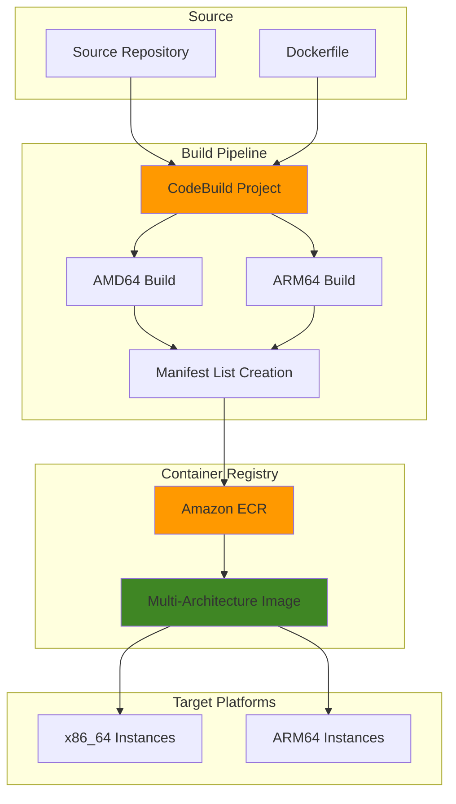

# CodeBuild Multi-Architecture Container Images

## Problem

Modern organizations need to support diverse computing architectures to optimize performance and cost. Applications must run efficiently on both ARM-based instances (like AWS Graviton processors) and traditional x86 processors. Managing separate build processes for each architecture creates operational complexity, longer deployment cycles, and increased maintenance overhead. Teams often struggle with cross-compilation compatibility issues and maintaining consistency across different architecture-specific container images.

## Solution

Create a unified CI/CD pipeline using AWS CodeBuild that automatically builds multi-architecture container images supporting both ARM64 and x86_64 architectures. The solution leverages Docker Buildx with manifest lists to create a single image reference that automatically delivers the correct architecture-specific image to target platforms, simplifying deployment and reducing operational complexity.

## Architecture Diagram



## Prerequisites

1. AWS account with CodeBuild, ECR, and IAM permissions
2. AWS CLI v2 installed and configured (or AWS CloudShell)
3. Basic understanding of Docker and containerization concepts
4. Familiarity with buildspec.yml files for CodeBuild
5. Estimated cost: $0.50-$2.00 per hour for CodeBuild compute time

> **Note**: Multi-architecture builds require additional compute time compared to single-architecture builds, but provide significant deployment flexibility benefits.

> **Warning**: Ensure privileged mode is enabled in CodeBuild for Docker Buildx functionality. Without privileged mode, multi-architecture builds will fail with permission errors during the Docker daemon initialization phase.

## Preparation

```bash
# Set environment variables
export AWS_REGION=$(aws configure get region)
export AWS_ACCOUNT_ID=$(aws sts get-caller-identity \
    --query Account --output text)

# Generate unique identifiers for resources
RANDOM_SUFFIX=$(aws secretsmanager get-random-password \
    --exclude-punctuation --exclude-uppercase \
    --password-length 6 --require-each-included-type \
    --output text --query RandomPassword)

export PROJECT_NAME="multi-arch-build-${RANDOM_SUFFIX}"
export ECR_REPO_NAME="sample-app-${RANDOM_SUFFIX}"
export CODEBUILD_ROLE_NAME="CodeBuildMultiArchRole-${RANDOM_SUFFIX}"
export ECR_REPO_URI="${AWS_ACCOUNT_ID}.dkr.ecr.${AWS_REGION}.amazonaws.com/${ECR_REPO_NAME}"

# Create ECR repository for storing multi-architecture images
aws ecr create-repository \
    --repository-name "${ECR_REPO_NAME}" \
    --image-scanning-configuration scanOnPush=true \
    --encryption-configuration encryptionType=AES256

echo "✅ Created ECR repository: ${ECR_REPO_URI}"
```

## Steps

1. **Create IAM Role for CodeBuild**:

   CodeBuild requires proper IAM permissions to access ECR for pushing multi-architecture images and to write build logs to CloudWatch. This role establishes the security foundation that allows CodeBuild to interact with AWS services while maintaining least-privilege access principles.

   ```bash
   # Create trust policy for CodeBuild
   cat > trust-policy.json << EOF
   {
     "Version": "2012-10-17",
     "Statement": [
       {
         "Effect": "Allow",
         "Principal": {
           "Service": "codebuild.amazonaws.com"
         },
         "Action": "sts:AssumeRole"
       }
     ]
   }
   EOF

   # Create IAM role
   aws iam create-role \
       --role-name "${CODEBUILD_ROLE_NAME}" \
       --assume-role-policy-document file://trust-policy.json

   # Create policy for CodeBuild permissions
   cat > codebuild-policy.json << EOF
   {
     "Version": "2012-10-17",
     "Statement": [
       {
         "Effect": "Allow",
         "Action": [
           "logs:CreateLogGroup",
           "logs:CreateLogStream",
           "logs:PutLogEvents"
         ],
         "Resource": "arn:aws:logs:${AWS_REGION}:${AWS_ACCOUNT_ID}:log-group:/aws/codebuild/*"
       },
       {
         "Effect": "Allow",
         "Action": [
           "ecr:BatchCheckLayerAvailability",
           "ecr:GetDownloadUrlForLayer",
           "ecr:BatchGetImage",
           "ecr:GetAuthorizationToken",
           "ecr:PutImage",
           "ecr:InitiateLayerUpload",
           "ecr:UploadLayerPart",
           "ecr:CompleteLayerUpload"
         ],
         "Resource": "*"
       }
     ]
   }
   EOF

   # Attach policy to role
   aws iam put-role-policy \
       --role-name "${CODEBUILD_ROLE_NAME}" \
       --policy-name "CodeBuildMultiArchPolicy" \
       --policy-document file://codebuild-policy.json

   echo "✅ Created IAM role: ${CODEBUILD_ROLE_NAME}"
   ```

   The IAM role now provides CodeBuild with the necessary permissions to build container images and push them to ECR. The policy includes ECR access for both pulling base images and pushing the final multi-architecture images, along with CloudWatch Logs permissions for build monitoring.

2. **Create Sample Application with Dockerfile**:

   A sample application helps demonstrate multi-architecture capabilities by showing how the same code runs on different processor architectures. This Node.js application exposes architecture information, making it easy to verify that the correct image variant is deployed on ARM and x86 systems.

   ```bash
   # Create application directory
   mkdir -p sample-app && cd sample-app

   # Create a simple Node.js application
   cat > app.js << 'EOF'
   const express = require('express');
   const os = require('os');
   
   const app = express();
   const PORT = process.env.PORT || 3000;
   
   app.get('/', (req, res) => {
     res.json({
       message: 'Hello from multi-architecture container!',
       architecture: os.arch(),
       platform: os.platform(),
       hostname: os.hostname(),
       timestamp: new Date().toISOString()
     });
   });
   
   app.listen(PORT, () => {
     console.log(`Server running on port ${PORT}`);
     console.log(`Architecture: ${os.arch()}`);
     console.log(`Platform: ${os.platform()}`);
   });
   EOF

   # Create package.json
   cat > package.json << 'EOF'
   {
     "name": "multi-arch-sample",
     "version": "1.0.0",
     "description": "Sample application for multi-architecture builds",
     "main": "app.js",
     "scripts": {
       "start": "node app.js"
     },
     "dependencies": {
       "express": "^4.19.2"
     }
   }
   EOF

   echo "✅ Created sample Node.js application"
   ```

   The sample application now provides a simple way to verify multi-architecture functionality. When deployed, it will report the underlying processor architecture, allowing you to confirm that ARM instances receive ARM images and x86 instances receive x86 images automatically.

3. **Create Multi-Architecture Dockerfile**:

   Multi-architecture Dockerfiles use build arguments and platform-specific base images to create optimized containers for different processor architectures. The multi-stage build approach ensures efficient layer caching and smaller final images while supporting both ARM64 and x86_64 targets.

   ```bash
   # Create Dockerfile optimized for multi-architecture builds
   cat > Dockerfile << 'EOF'
   # syntax=docker/dockerfile:1
   FROM --platform=$BUILDPLATFORM node:20-alpine AS build
   
   # Set working directory
   WORKDIR /app
   
   # Copy package files
   COPY package*.json ./
   
   # Install dependencies
   RUN npm ci --only=production
   
   # Multi-stage build for final image
   FROM node:20-alpine AS runtime
   
   # Install security updates
   RUN apk update && apk upgrade && apk add --no-cache dumb-init
   
   # Create non-root user
   RUN addgroup -g 1001 -S nodejs && \
       adduser -S nodejs -u 1001
   
   # Set working directory
   WORKDIR /app
   
   # Copy dependencies from build stage
   COPY --from=build /app/node_modules ./node_modules
   
   # Copy application code
   COPY --chown=nodejs:nodejs . .
   
   # Switch to non-root user
   USER nodejs
   
   # Expose port
   EXPOSE 3000
   
   # Use dumb-init to handle signals properly
   ENTRYPOINT ["dumb-init", "--"]
   CMD ["node", "app.js"]
   EOF

   echo "✅ Created multi-architecture Dockerfile"
   ```

4. **Create BuildSpec for Multi-Architecture Build**:

   The buildspec.yml file defines the build pipeline that CodeBuild executes. This configuration establishes a sophisticated multi-architecture build process using Docker Buildx, which extends Docker's capabilities to support cross-platform builds. The buildspec includes intelligent caching strategies to minimize build times and optimize resource utilization across multiple architecture targets.

   ```bash
   # Create buildspec.yml for CodeBuild
   cat > buildspec.yml << EOF
   version: 0.2
   
   phases:
     pre_build:
       commands:
         - echo Logging in to Amazon ECR...
         - aws ecr get-login-password --region \$AWS_DEFAULT_REGION | docker login --username AWS --password-stdin \$AWS_ACCOUNT_ID.dkr.ecr.\$AWS_DEFAULT_REGION.amazonaws.com
         - REPOSITORY_URI=\$AWS_ACCOUNT_ID.dkr.ecr.\$AWS_DEFAULT_REGION.amazonaws.com/\$IMAGE_REPO_NAME
         - COMMIT_HASH=\$(echo \$CODEBUILD_RESOLVED_SOURCE_VERSION | cut -c 1-7)
         - IMAGE_TAG=\${COMMIT_HASH:=latest}
         - echo Repository URI is \$REPOSITORY_URI
         - echo Image tag is \$IMAGE_TAG
         
     build:
       commands:
         - echo Build started on \$(date)
         - echo Building multi-architecture Docker image...
         
         # Create and use buildx builder
         - docker buildx create --name multiarch-builder --use --bootstrap
         - docker buildx inspect --bootstrap
         
         # Build and push multi-architecture image
         - |
           docker buildx build \
             --platform linux/amd64,linux/arm64 \
             --tag \$REPOSITORY_URI:latest \
             --tag \$REPOSITORY_URI:\$IMAGE_TAG \
             --push \
             --cache-from type=local,src=/tmp/.buildx-cache \
             --cache-to type=local,dest=/tmp/.buildx-cache-new,mode=max \
             .
         
         # Move cache to prevent unbounded growth
         - rm -rf /tmp/.buildx-cache
         - mv /tmp/.buildx-cache-new /tmp/.buildx-cache
         
     post_build:
       commands:
         - echo Build completed on \$(date)
         - echo Pushing the Docker images...
         - docker buildx imagetools inspect \$REPOSITORY_URI:latest
         - printf '{"ImageURI":"%s"}' \$REPOSITORY_URI:latest > imageDetail.json
         
   artifacts:
     files:
       - imageDetail.json
   
   cache:
     paths:
       - '/tmp/.buildx-cache/**/*'
   EOF

   echo "✅ Created buildspec.yml with multi-architecture support"
   ```

   The buildspec configuration now enables CodeBuild to simultaneously build ARM64 and x86_64 images in a single pipeline execution. This approach leverages Docker Buildx's parallel processing capabilities and intelligent layer caching to efficiently produce multi-architecture container images without requiring separate build environments for each target platform.

5. **Create CodeBuild Project**:

   CodeBuild projects define the execution environment and configuration for your build pipeline. This project configuration enables privileged mode (required for Docker-in-Docker operations), specifies the appropriate compute resources for multi-architecture builds, and establishes the connection between your source code, build environment, and target ECR repository.

   ```bash
   # Create CodeBuild project configuration
   cat > codebuild-project.json << EOF
   {
     "name": "${PROJECT_NAME}",
     "description": "Multi-architecture container image build project",
     "source": {
       "type": "S3",
       "location": "${PROJECT_NAME}-source/source.zip"
     },
     "artifacts": {
       "type": "NO_ARTIFACTS"
     },
     "environment": {
       "type": "LINUX_CONTAINER",
       "image": "aws/codebuild/amazonlinux-x86_64-standard:5.0",
       "computeType": "BUILD_GENERAL1_MEDIUM",
       "privilegedMode": true,
       "environmentVariables": [
         {
           "name": "AWS_DEFAULT_REGION",
           "value": "${AWS_REGION}"
         },
         {
           "name": "AWS_ACCOUNT_ID",
           "value": "${AWS_ACCOUNT_ID}"
         },
         {
           "name": "IMAGE_REPO_NAME",
           "value": "${ECR_REPO_NAME}"
         }
       ]
     },
     "serviceRole": "arn:aws:iam::${AWS_ACCOUNT_ID}:role/${CODEBUILD_ROLE_NAME}",
     "timeoutInMinutes": 60,
     "cache": {
       "type": "LOCAL",
       "modes": ["LOCAL_DOCKER_LAYER_CACHE"]
     }
   }
   EOF

   # Create CodeBuild project
   aws codebuild create-project \
       --cli-input-json file://codebuild-project.json

   echo "✅ Created CodeBuild project: ${PROJECT_NAME}"
   ```

   The CodeBuild project is now configured with the necessary compute resources and permissions to execute multi-architecture builds. The privileged mode setting allows Docker Buildx to function properly within the containerized build environment, while the build cache configuration optimizes subsequent build performance.

6. **Upload Source Code to S3**:

   CodeBuild requires source code to be stored in a supported location such as S3, GitHub, or CodeCommit. For this demonstration, we'll use S3 to store a compressed archive of our application source code. This approach provides a reliable, versioned source for the build process and ensures consistent build inputs across multiple executions.

   ```bash
   # Create S3 bucket for source code
   aws s3 mb s3://${PROJECT_NAME}-source

   # Create source archive
   zip -r source.zip . -x "*.git*" "*.DS_Store*"

   # Upload source to S3
   aws s3 cp source.zip s3://${PROJECT_NAME}-source/source.zip

   echo "✅ Uploaded source code to S3"
   ```

   The source code archive is now available in S3 and ready for CodeBuild to download and process. This establishes the input source for our multi-architecture build pipeline, providing CodeBuild with access to the Dockerfile, application code, and buildspec configuration needed to execute the build.

7. **Start Build and Monitor Progress**:

   Initiating the CodeBuild execution begins the multi-architecture build process. The build will download source code from S3, set up Docker Buildx for cross-platform compilation, and simultaneously build ARM64 and x86_64 container images. Monitoring the build status provides real-time feedback on the pipeline execution and helps identify any issues early in the process.

   ```bash
   # Start CodeBuild build
   BUILD_ID=$(aws codebuild start-build \
       --project-name "${PROJECT_NAME}" \
       --query 'build.id' --output text)

   echo "✅ Started build with ID: ${BUILD_ID}"

   # Monitor build status
   echo "Monitoring build progress..."
   while true; do
       BUILD_STATUS=$(aws codebuild batch-get-builds \
           --ids "${BUILD_ID}" \
           --query 'builds[0].buildStatus' --output text)
       
       echo "Build status: ${BUILD_STATUS}"
       
       if [ "$BUILD_STATUS" = "SUCCEEDED" ]; then
           echo "✅ Build completed successfully!"
           break
       elif [ "$BUILD_STATUS" = "FAILED" ] || [ "$BUILD_STATUS" = "FAULT" ] || [ "$BUILD_STATUS" = "STOPPED" ] || [ "$BUILD_STATUS" = "TIMED_OUT" ]; then
           echo "❌ Build failed with status: ${BUILD_STATUS}"
           break
       fi
       
       sleep 30
   done
   ```

   The build process is now executing, creating both ARM64 and x86_64 variants of your container image. During this phase, Docker Buildx performs cross-compilation for the target architectures and uploads the resulting images to ECR with appropriate manifest lists that enable automatic architecture selection during deployment.

8. **Verify Multi-Architecture Image**:

   Verification confirms that the multi-architecture build process completed successfully and that both ARM64 and x86_64 image variants are available in ECR. The Docker Buildx imagetools inspect command reveals the manifest list structure, showing how a single image reference points to multiple architecture-specific images, enabling automatic platform selection during container deployment.

   ```bash
   # Inspect the multi-architecture manifest
   aws ecr describe-images \
       --repository-name "${ECR_REPO_NAME}" \
       --query 'imageDetails[0].{ImageTags:imageTags,ImagePushedAt:imagePushedAt,ImageSizeInBytes:imageSizeInBytes}'

   # Get login token for Docker
   aws ecr get-login-password --region ${AWS_REGION} | \
       docker login --username AWS --password-stdin ${AWS_ACCOUNT_ID}.dkr.ecr.${AWS_REGION}.amazonaws.com

   # Pull and inspect multi-architecture image
   docker buildx imagetools inspect ${ECR_REPO_URI}:latest

   echo "✅ Multi-architecture image verification complete"
   ```

   The multi-architecture image is now successfully stored in ECR with proper manifest lists. Container runtimes on ARM64 instances will automatically pull the ARM64 variant, while x86_64 instances will receive the x86_64 variant, all using the same image reference without requiring architecture-specific tags or deployment configurations.

## Validation & Testing

1. **Verify Multi-Architecture Manifest**:

   ```bash
   # Inspect the image manifest to confirm multi-architecture support
   docker buildx imagetools inspect ${ECR_REPO_URI}:latest
   ```

   Expected output should show multiple platforms:
   ```
   Name:      123456789012.dkr.ecr.us-east-1.amazonaws.com/sample-app-abc123:latest
   MediaType: application/vnd.docker.distribution.manifest.list.v2+json
   Digest:    sha256:abc123...
   
   Manifests:
     Name:      123456789012.dkr.ecr.us-east-1.amazonaws.com/sample-app-abc123:latest@sha256:def456...
     MediaType: application/vnd.docker.distribution.manifest.v2+json
     Platform:  linux/amd64
     
     Name:      123456789012.dkr.ecr.us-east-1.amazonaws.com/sample-app-abc123:latest@sha256:ghi789...
     MediaType: application/vnd.docker.distribution.manifest.v2+json
     Platform:  linux/arm64
   ```

2. **Test Architecture-Specific Image Pull**:

   ```bash
   # Test pulling specific architecture images
   docker pull --platform linux/amd64 ${ECR_REPO_URI}:latest
   docker pull --platform linux/arm64 ${ECR_REPO_URI}:latest
   
   # Run containers to verify architecture
   docker run --rm --platform linux/amd64 ${ECR_REPO_URI}:latest node -e "console.log('AMD64:', process.arch)"
   docker run --rm --platform linux/arm64 ${ECR_REPO_URI}:latest node -e "console.log('ARM64:', process.arch)"
   ```

3. **Validate Build Logs**:

   ```bash
   # Review build logs for multi-architecture build confirmation
   aws codebuild batch-get-builds \
       --ids "${BUILD_ID}" \
       --query 'builds[0].logs.deepLink' --output text
   ```

## Cleanup

1. **Delete CodeBuild Project**:

   ```bash
   # Delete CodeBuild project
   aws codebuild delete-project --name "${PROJECT_NAME}"
   
   echo "✅ Deleted CodeBuild project"
   ```

2. **Remove ECR Repository**:

   ```bash
   # Delete ECR repository and all images
   aws ecr delete-repository \
       --repository-name "${ECR_REPO_NAME}" \
       --force
   
   echo "✅ Deleted ECR repository"
   ```

3. **Clean Up IAM Resources**:

   ```bash
   # Remove IAM role policy
   aws iam delete-role-policy \
       --role-name "${CODEBUILD_ROLE_NAME}" \
       --policy-name "CodeBuildMultiArchPolicy"
   
   # Delete IAM role
   aws iam delete-role --role-name "${CODEBUILD_ROLE_NAME}"
   
   echo "✅ Cleaned up IAM resources"
   ```

4. **Remove S3 Bucket**:

   ```bash
   # Delete S3 bucket and contents
   aws s3 rb s3://${PROJECT_NAME}-source --force
   
   echo "✅ Deleted S3 bucket"
   ```

5. **Clean Up Local Files**:

   ```bash
   # Remove local files
   cd .. && rm -rf sample-app
   rm -f trust-policy.json codebuild-policy.json codebuild-project.json
   
   echo "✅ Cleaned up local files"
   ```

## Discussion

This solution addresses the growing need for multi-architecture container support in modern cloud environments. By leveraging Docker Buildx with AWS CodeBuild, organizations can create a single CI/CD pipeline that produces container images compatible with both x86_64 and ARM64 architectures. This approach significantly reduces operational complexity compared to managing separate build processes for each architecture.

The key architectural decision involves using Docker manifest lists, which act as a "pointer" to architecture-specific images. When a container runtime requests an image, Docker automatically selects the appropriate architecture variant, making the multi-architecture support transparent to deployment processes. This eliminates the need for architecture-specific deployment configurations and reduces the risk of deploying incompatible images.

The solution leverages CodeBuild's privileged mode to enable Docker-in-Docker functionality required for Buildx operations. The build process utilizes layer caching to optimize build times, which is particularly important for multi-architecture builds that inherently require more compute resources. The buildspec configuration demonstrates best practices for cross-platform compilation, including proper handling of build arguments and platform-specific optimizations. Following the [AWS Well-Architected Framework](https://docs.aws.amazon.com/wellarchitected/latest/framework/welcome.html), this approach optimizes for both operational excellence and cost efficiency.

From a cost perspective, multi-architecture builds consume additional compute time but provide significant operational benefits. ARM-based instances like those powered by AWS Graviton processors often provide better price-performance ratios for many workloads, making the initial investment in multi-architecture support worthwhile for long-term cost optimization. The solution also incorporates security best practices by using least-privilege IAM permissions and encrypted container image storage.

> **Tip**: Use build caching strategies and consider implementing conditional builds based on code changes to optimize build times and reduce costs for multi-architecture pipelines. See the [CodeBuild documentation](https://docs.aws.amazon.com/codebuild/latest/userguide/build-caching.html) for advanced caching strategies.

## Challenge

Extend this solution by implementing these enhancements:

1. **Implement Architecture-Specific Optimizations**: Create conditional Dockerfile instructions that apply different optimizations based on target architecture, such as architecture-specific package installations or compiler flags.

2. **Add Security Scanning Integration**: Integrate Amazon Inspector or third-party security scanning tools to automatically scan each architecture-specific image variant and fail builds if critical vulnerabilities are detected.

3. **Create Multi-Stage Multi-Architecture Builds**: Develop a more complex build pipeline that creates different image variants (development, production) for each architecture, utilizing Docker Buildx's advanced targeting capabilities.

4. **Implement Automated Testing**: Set up automated testing that validates functionality across different architecture variants, potentially using AWS Device Farm or CodeBuild's multiple compute environments.

5. **Build Registry Management**: Create automation to manage manifest lists and clean up unused architecture-specific images based on retention policies, helping optimize ECR storage costs.

## Infrastructure Code

### Available Infrastructure as Code:

- [Infrastructure Code Overview](code/README.md) - Detailed description of all infrastructure components
- [AWS CDK (Python)](code/cdk-python/) - AWS CDK Python implementation
- [AWS CDK (TypeScript)](code/cdk-typescript/) - AWS CDK TypeScript implementation
- [CloudFormation](code/cloudformation.yaml) - AWS CloudFormation template
- [Bash CLI Scripts](code/scripts/) - Example bash scripts using AWS CLI commands to deploy infrastructure
- [Terraform](code/terraform/) - Terraform configuration files